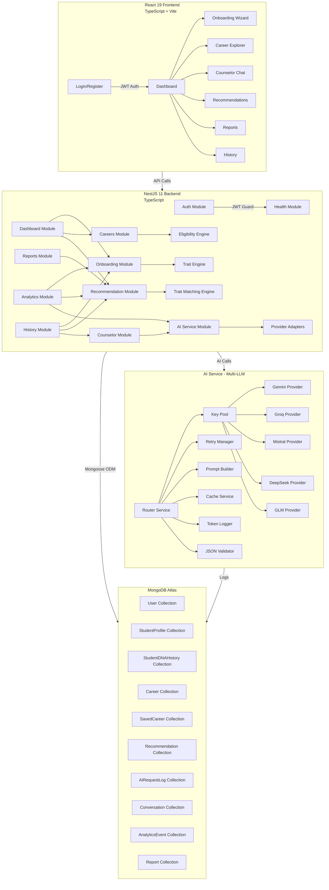
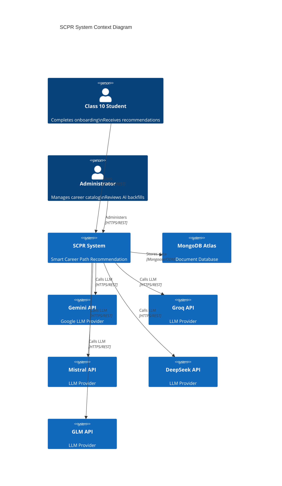
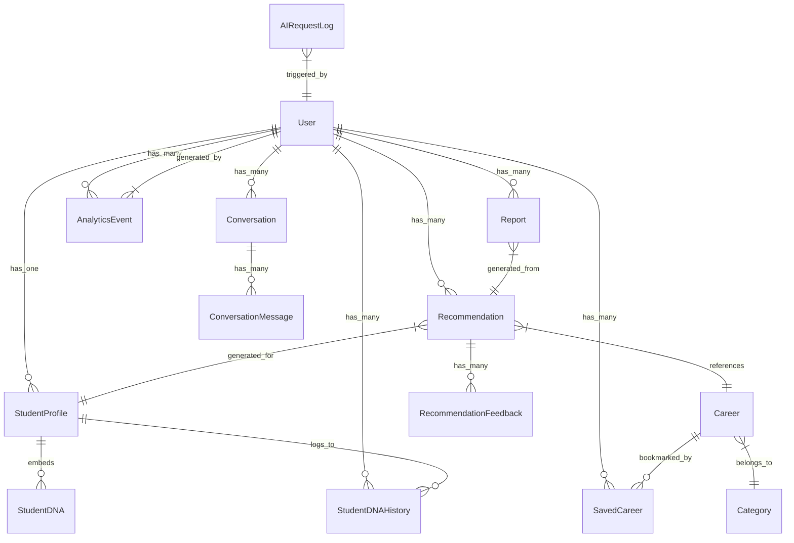
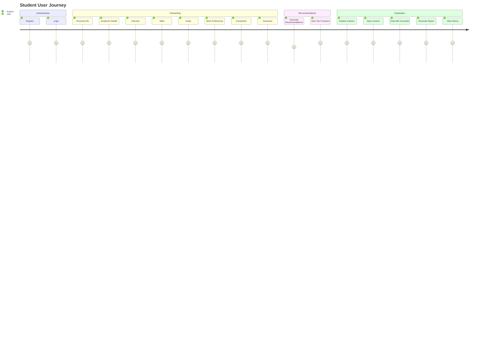
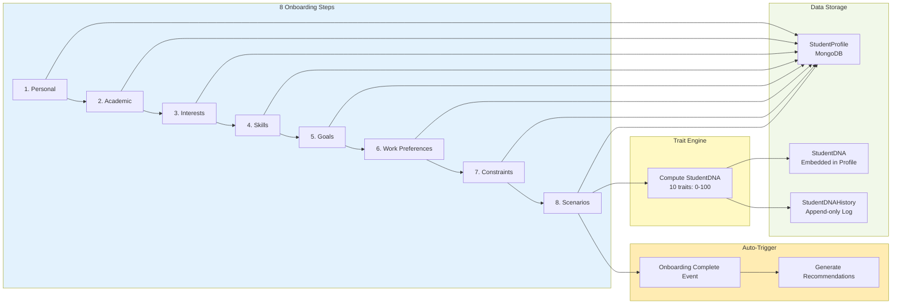
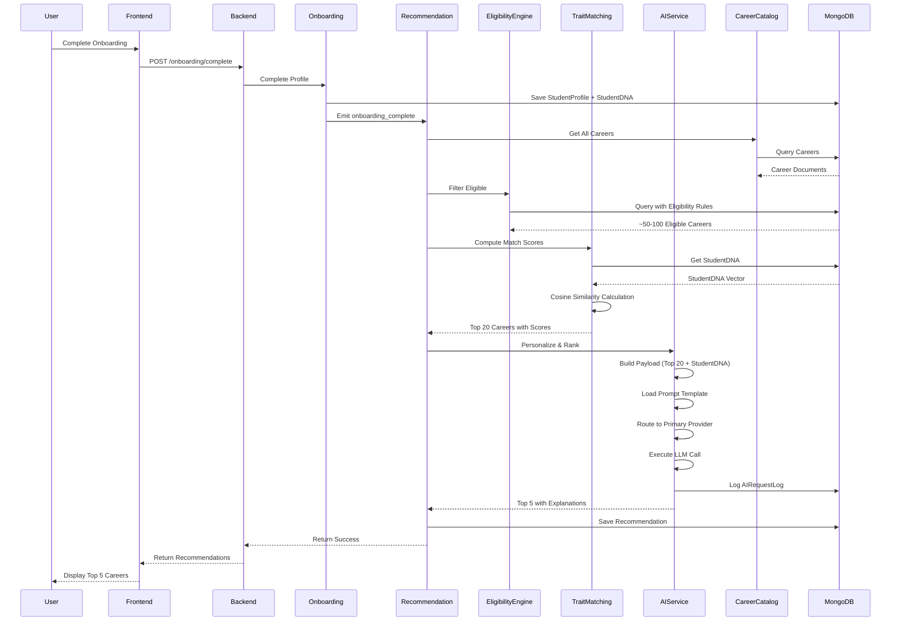

# SCPR — Smart Career Path Recommendation System
## Comprehensive Project Analysis & Documentation

---

**Last Updated:** 2026-07-14
**Project Version:** v1
**Status:** Backend 100% Complete | Frontend 100% Migrated | Testing Pending

---

## Table of Contents

1. [Executive Summary](#1-executive-summary)
2. [Project Overview](#2-project-overview)
3. [High-Level Architecture](#3-high-level-architecture)
4. [System Architecture Diagrams](#4-system-architecture-diagrams)
5. [Module Breakdown](#5-module-breakdown)
6. [Data Flow & Workflow Diagrams](#6-data-flow--workflow-diagrams)
7. [Technical Stack](#7-technical-stack)
8. [Domain Model](#8-domain-model)
9. [Recommendation Pipeline](#9-recommendation-pipeline)
10. [AI Service Architecture](#10-ai-service-architecture)
11. [API Surface](#11-api-surface)
12. [Frontend Architecture](#12-frontend-architecture)
13. [Engineering Rules & Principles](#13-engineering-rules--principles)
14. [Career Catalog Import](#14-career-catalog-import)
15. [Project Status & Progress](#15-project-status--progress)
16. [Known Issues & Open Items](#16-known-issues--open-items)
17. [File Structure](#17-file-structure)
18. [Summary & Next Steps](#18-summary--next-steps)

---

## 1. Executive Summary

SCPR (Smart Career Path Recommendation System) is a production-grade, AI-powered career counseling platform designed specifically for Class 10 students in India. The system uniquely combines **deterministic computation** (for eligibility filtering and trait matching) with **LLM personalization** (for explanations and roadmaps), ensuring every recommendation is transparent, traceable, and defensible.

### Key Metrics

| Metric | Value |
|--------|-------|
| Backend Modules | 11 (NestJS) |
| Frontend Pages | 9 (React 19) |
| Career Catalog | 742 distinct careers across 8 sectors |
| AI Backfill Completion | 89.5% (628/702) |
| API Endpoints | 45+ |
| MongoDB Collections | 11 |
| LLM Providers | 5 (Gemini, Groq, Mistral, DeepSeek, GLM) |
| Total Build Phases | 10 (Phases 0-7 complete, Phase 8 pending) |

### Key Design Decisions

1. **LLM as Co-Pilot, Not Decision-Maker**: The LLM never decides eligibility or invents careers — it only ranks, explains, and personalizes a shortlist the backend already computed
2. **Three-Stage Pipeline**: Eligibility Engine (MongoDB query) → Trait Matching (cosine similarity) → AI Personalization (single LLM call)
3. **Architectural Fix for Classification Failure**: Previous Random Forest + XGBoost approach collapsed onto the same 1-2 careers; the new deterministic architecture solves this
4. **Provider Abstraction**: Swap LLM providers with one-line config changes

---

## 2. Project Overview

### Purpose

SCPR is an AI-powered career counseling platform that guides Class 10 students through an 8-step natural onboarding flow (not a test) to produce traceable, explainable career recommendations. The system uses a deterministic engine to narrow down career options, with AI used only for personalization and explanation — never for decision-making.

### Vision

> A student completes SCPR's onboarding and never feels like they took a test. They answered questions about their subjects, interests, what they're good at, what they want out of life, and how they handle pressure — and at the end, the system hands them a short, ranked, explained list of careers that actually fit them, with a roadmap to get there.

### Key Features

- **8-Step Natural Onboarding**: Personal → Academic → Interests → Skills → Goals → Work Preferences → Constraints → Scenarios
- **Deterministic Recommendation Engine**: 3-stage pipeline (Eligibility → Trait Matching → AI Personalization)
- **Multi-LLM Orchestration**: 5 providers with automatic fallback and retry
- **AI Counselor Chat**: Context-aware conversation with rolling summary
- **PDF Report Generation**: Career reports via pdfmake
- **Admin Panel**: Career catalog management with draft publish/reject workflow
- **742 Career Catalog**: Imported across 8 sectors with AI-refined trait weights

---

## 3. High-Level Architecture

```
┌─────────────────────────────────────────────────────────────────────┐
│                        SCPR System Architecture                      │
├─────────────────────────────────────────────────────────────────────┤
│                                                                       │
│  ┌─────────────────────┐    ┌─────────────────────┐                │
│  │  React 19 Frontend   │    │  NestJS 11 Backend   │                │
│  │  (TypeScript + Vite) │───▶│  (TypeScript)        │                │
│  └─────────────────────┘    └──────────┬──────────┘                │
│                                           │                            │
│                                           ▼                            │
│  ┌─────────────────────────────────────────────────────────────────┐  │
│  │                      Backend Modules                             │  │
│  │  ┌──────────┐ ┌──────────────┐ ┌──────────────┐ ┌────────────┐ │  │
│  │  │   Auth   │ │ Onboarding   │ │   Careers    │ │Recommendation│ │  │
│  │  └──────────┘ └──────────────┘ └──────────────┘ └────────────┘ │  │
│  │  ┌──────────┐ ┌──────────────┐ ┌──────────────┐ ┌────────────┐ │  │
│  │  │Dashboard │ │  Counselor   │ │   Reports    │ │  Analytics  │ │  │
│  │  └──────────┘ └──────────────┘ └──────────────┘ └────────────┘ │  │
│  │  ┌──────────────┐ ┌──────────────┐                              │  │
│  │  │  AI Service   │ │   History    │                              │  │
│  │  │(Multi-LLM)   │ │              │                              │  │
│  │  └──────────────┘ └──────────────┘                              │  │
│  └─────────────────────────────────────────────────────────────────┘  │
│                                           │                            │
│                                           ▼                            │
│  ┌─────────────────────────────────────────────────────────────────┐  │
│  │                    External Dependencies                         │  │
│  │  ┌──────────┐ ┌──────────┐ ┌──────────────┐ ┌──────────────┐  │  │
│  │  │ MongoDB  │ │   JWT    │ │  AI LLM      │ │   PDF Gen    │  │  │
│  │  │  Atlas   │ │  Auth    │ │  Providers   │ │  (pdfmake)   │  │  │
│  │  └──────────┘ └──────────┘ └──────────────┘ └──────────────┘  │  │
│  └─────────────────────────────────────────────────────────────────┘  │
│                                                                       │
└─────────────────────────────────────────────────────────────────────┘
```

---

## 4. System Architecture Diagrams

### 4.1 Component Flow



### 4.2 System Context (C4)



### 4.3 ERD (Entity Relationship Diagram)



---

## 5. Module Breakdown

### 5.1 Backend Modules (11 Core Modules)

| Module | Responsibility | Dependencies | Key Features |
|--------|---------------|--------------|--------------|
| `auth` | Authentication & Authorization | None | JWT issuance, register/login/refresh, password hashing, failed attempt lockout (5→15min) |
| `health` | System Health Checks | None | Public `/health` endpoint, backend status |
| `ai-service` | Multi-LLM Orchestration | None | 5 provider adapters, key pool rotation, retry with cross-provider fallback, prompt management, JSON validation, caching, token logging |
| `careers` | Career Catalog Management | `ai-service` | Career CRUD, trait weights, eligibility constraints, AI backfill with draft→promote workflow, admin endpoints |
| `onboarding` | Student Onboarding Flow | None | 8-step resumable wizard, profile management, StudentDNA computation (10-dim vector), append-only DNA history |
| `recommendation` | Career Recommendation Engine | `ai-service`, `careers`, `onboarding` | Eligibility engine (MongoDB query), trait matching (cosine similarity), AI personalization (single LLM call), staleness tracking |
| `counselor` | AI Chat & Guidance | `ai-service` | Conversation management, rolling summary (compresses beyond 10 messages), intent classification, safety filter |
| `dashboard` | User Dashboard | `onboarding`, `recommendation`, `careers` | Server-side state machine (`next_action`), progress tracking, insights |
| `reports` | PDF Report Generation | `onboarding`, `recommendation` | pdfmake PDF generation (no Puppeteer), status tracking: QUEUED→GENERATING→READY→DOWNLOADED→FAILED |
| `analytics` | Event Tracking | None | Fire-and-forget logging (never throws), admin dashboards, provider health visibility |
| `history` | Unified Timeline | `onboarding`, `recommendation`, `counselor` | Chronological feed, pagination, type filter |

### 5.2 Frontend Pages

| Page | Route | Auth | Purpose |
|------|-------|------|---------|
| Landing | `/` | Public | Marketing page with hero, career orbit, assessment preview, AI chat preview, student stories |
| Login | `/login` | Public | Email/password login |
| Register | `/register` | Public | User registration |
| Dashboard | `/` (auth) | Auth | Journey state, recommendations overview, saved careers, PDF report generation |
| Onboarding | `/onboarding` | Auth | 8-step profile wizard with confetti completion |
| Career Explorer | `/careers` | Auth | Browse/search careers, save/unsave, view recommendations |
| Counseling Chat | `/chat` | Auth | AI counselor chat interface |
| History Log | `/history` | Auth | Unified activity timeline |
| Admin Careers | `/admin/careers` | Admin | Career catalog management, draft review, import audit |

---

## 6. Data Flow & Workflow Diagrams

### 6.1 Student User Journey



### 6.2 Recommendation Pipeline


### 6.3 AI Service Flow

```mermaid
flowchart TD
    subgraph Request["AI Service Request"]
        A[aiService.run\n(taskType, context)] --> B[Router Service]
    end

    subgraph Routing["Provider Selection"]
        B --> C[Get Provider List\nfrom taskType]
        C --> D[Primary Provider]
        D -->|Success| E[Return Response]
        D -->|Failure| F[Retry Manager]
        F --> G[Next Key in Pool]
        G -->|Success| E
        G -->|Exhausted| H[Next Provider\nin Fallback Chain]
        H --> D
    end

    subgraph Processing["Request Processing"]
        D --> I[Key Pool Service\nGet Next Key]
        I --> J[Prompt Builder\nLoad & Interpolate Template]
        J --> K[Provider Adapter\nCall LLM API]
        K --> L[Cache Service\nCheck/Store]
        K --> M[Token Logger\nLog AIRequestLog]
        K --> N[JSON Validator\nValidate & Repair]
    end

    subgraph Response["Standardized Response"]
        N --> O[Normalize to\nStandard Shape]
        O --> E
    end

    subgraph Providers["LLM Providers"]
        P1[Gemini] --> K
        P2[Groq] --> K
        P3[Mistral] --> K
        P4[DeepSeek] --> K
        P5[GLM] --> K
    end

    style Request fill:#bbdefb
    style Routing fill:#c8e6c9
    style Processing fill:#ffecb3
    style Response fill:#ffcdd2
    style Providers fill:#f8bbd0
```

### 6.4 Onboarding Step Flow



### 6.5 Counselor Chat Flow

```mermaid
flowchart TD
    subgraph UserInput["User Chat Input"]
        A[User Message] --> B[Context Builder]
    end

    subgraph Context["Context Assembly"]
        B --> C[Get Recent Messages]
        C --> D{History > 10 messages?}
        D -->|Yes| E[Get Rolling Summary]
        D -->|No| F[Use Full History]
        E --> F
        F --> G[Add User Message]
        G --> H[Build Context Payload]
    end

    subgraph Intent["Intent Classification"]
        H --> I[Classify Intent\ncareer/roadmap/general]
        I --> J[Shape Prompt\nBased on Intent]
    end

    subgraph AI["AI Processing"]
        J --> K[aiService.run\n('counselor_chat')]
        K --> L[Get AI Response]
    end

    subgraph PostProcess["Response Handling"]
        L --> M[Safety Filter]
        M --> N{Valid JSON?}
        N -->|Yes| O[Parse Structured Response]
        N -->|No| P[Render as Markdown]
        O --> P
        P --> Q[Save Message]
    end

    subgraph Storage["Storage"]
        Q --> R[ConversationMessage\nCollection]
        Q --> S[Update Conversation\nSummary if needed]
    end

    style UserInput fill:#e1f5fe
    style Context fill:#fff3e0
    style Intent fill:#e8f5e9
    style AI fill:#ffecb3
    style PostProcess fill:#f3e5f5
    style Storage fill:#fce4ec
```

### 6.6 Sequence Diagram: Recommendation Generation



---

## 7. Technical Stack

### 7.1 Backend Stack

| Category | Technology | Version | Purpose |
|----------|------------|---------|---------|
| Framework | NestJS | 11.x | Modular backend framework with DI |
| Runtime | Node.js | LTS | JavaScript runtime |
| Language | TypeScript | 5.7+ | Type-safe development |
| ODM | Mongoose | 9.x | MongoDB object modeling |
| Database | MongoDB Atlas | Latest | Cloud document database |
| Validation | class-validator / class-transformer | Latest | DTO validation at controller boundary |
| Auth | Passport.js | 0.7.x | Authentication middleware (passport-jwt, passport-local) |
| JWT | @nestjs/jwt | 11.x | Token generation/verification |
| Hashing | bcrypt | 6.x | Password hashing |
| PDF | pdfmake | 0.3.x | PDF generation (no Puppeteer) |
| Vector Math | Custom `vector-math.ts` | N/A | Cosine similarity calculations |
| JSON Schema | ajv | 8.x | AI response validation |

### 7.2 Frontend Stack

| Category | Technology | Version | Purpose |
|----------|------------|---------|---------|
| Framework | React | 19.x | UI framework |
| Build Tool | Vite | 8.x | Fast development server & bundler |
| Language | TypeScript | 6.x | Type-safe development |
| Styling | Tailwind CSS | 4.x | Utility-first CSS (CSS-first, no config file) |
| State Management | Zustand | 5.x | Client state (JWT in memory only) |
| Server Cache | TanStack Query | 5.x | Server state caching & management |
| Routing | React Router | 7.x | Client-side routing (lazy-loaded) |
| HTTP Client | Axios | 1.x | HTTP requests with interceptors |
| Animation | Framer Motion | 12.x | UI animations with reduced-motion support |
| Icons | lucide-react | 1.x | Icon library |
| Utilities | clsx, tailwind-merge | Latest | Class merging helpers |

### 7.3 AI Providers

| Provider | Models | Primary Use Case | Status |
|----------|--------|------------------|--------|
| Gemini | gemini-2.5-flash | Career ranking, roadmap generation | ✅ Healthy (v1 API) |
| Groq | llama-3.3-70b-versatile, llama-3.1-8b-instant | Counselor chat (low-latency) | ⚠️ TPD-limited |
| Mistral | mistral-large-latest | Report summary | ✅ Healthy |
| DeepSeek | deepseek-chat | Fallback for ranking | ❌ Insufficient balance |
| GLM | glm-4-plus | Configured, not in routing | ⚙️ Available |

---

## 8. Domain Model

### 8.1 Core Entities

#### User Schema
```typescript
{
  user_id: string;           // UUID, hyphens stripped — stable external id
  email: string;
  email_verified: boolean;
  password_hash: string;
  provider: 'local';        // Future: 'google', etc.
  role: 'student' | 'admin';
  full_name: string;
  failed_login_attempts: number;
  locked_until: Date;
  last_login: Date;
  created_at: Date;
  updated_at: Date;
}
```

#### StudentProfile Schema
```typescript
{
  user_id: string;
  onboarding_step: string;  // Current step key for resume
  completion_percentage: number;
  personal: {
    name: string;
    dob: Date;
    age: number;
    gender: string;
    city: string;
    state: string;
    board: string;
  };
  academic: {
    status: string;
    class10_percent: number;
    class12_percent: number;
    subjects: {
      maths: number;
      science: number;
      english: number;
      sst: number;
      computer: number;
    };
    favorite_subjects: string[];
    weak_subjects: string[];
    stream_interest: string;
  };
  interests: {              // 0-100 sliders
    technology: number;
    business: number;
    helping_people: number;
    teaching: number;
    nature: number;
    research: number;
    sports: number;
    design: number;
    media: number;
    government: number;
    finance: number;
    machines: number;
  };
  skills: {                 // 1-5 self-rated
    communication: number;
    leadership: number;
    problem_solving: number;
    creativity: number;
    logical_thinking: number;
    coding: number;
    drawing: number;
    math: number;
    observation: number;
    patience: number;
  };
  goals: string[];          // Ranked list
  work_preferences: string[];
  constraints: {
    govt_vs_private: string;
    budget_tier: number;
    study_duration_max: number;
    willing_to_relocate: boolean;
    abroad_ok: boolean;
    preferred_location: string;
  };
  scenario_responses: [{
    question_id: string;
    selected_option: string;
    trait_weights: object;
  }];
  current_dna: StudentDNA;  // Embedded
  created_at: Date;
  updated_at: Date;
}
```

#### StudentDNA Schema (Embedded)
```typescript
{
  analytical_thinking: number;      // 0-100
  creativity: number;               // 0-100
  communication: number;            // 0-100
  leadership: number;               // 0-100
  research: number;                 // 0-100
  business_acumen: number;          // 0-100
  technical_curiosity: number;      // 0-100
  empathy: number;                  // 0-100
  patience: number;                 // 0-100
  risk_tolerance: number;           // 0-100
  computed_at: Date;
  source_version: string;           // Trait-weight config version
}
```

#### Career Schema
```typescript
{
  career_code: string;              // Stable string id (slug of name)
  category_code: string;
  sub_domain_code: string;
  name: string;
  description: string;
  required_skills: string[];
  technical_skills: string[];
  soft_skills: string[];
  market_demand: number;
  future_scope: string;
  career_progression: string;
  pathway_tags: string[];
  source_catalog_parts: string[];
  backfill_status: 'rule_based' | 'ai_refined' | 'published';
  needs_enrichment: boolean;
  is_active: boolean;
  imported_at: Date;
  trait_weights: {                  // Live weights
    analytical_thinking: number;
    creativity: number;
    communication: number;
    leadership: number;
    research: number;
    business_acumen: number;
    technical_curiosity: number;
    empathy: number;
    patience: number;
    risk_tolerance: number;
  };
  eligibility: {                   // Hard gates
    min_maths: number;
    min_science: number;
    min_biology: number;
    min_english: number;
    max_budget_tier: number;
    min_study_duration_years: number;
    max_study_duration_years: number;
    required_stream: string;
    abroad_required: boolean;
  };
  trait_weights_draft: object;      // Staging for LLM backfill
  eligibility_draft: object;       // Staging for LLM backfill
}
```

#### Recommendation Schema
```typescript
{
  user_id: string;
  onboarding_session_ref: string;
  pipeline_version: string;
  eligible_count: number;
  shortlist: [{
    career_code: string;
    match_score: number;
  }];
  final_recommendations: [{
    career_code: string;
    rank: number;
    ai_score: number;
    explanation: string;
    roadmap: string;
    suggested_colleges: string[];
    suggested_certifications: string[];
  }];
  ai_provider_used: string;
  ai_model_used: string;
  fallback_used: boolean;
  generated_at: Date;
  stale: boolean;
}
```

### 8.2 MongoDB Collections Summary

| Collection | Records | Purpose |
|------------|---------|---------|
| User | ~few | Authentication & identity |
| StudentProfile | ~few | Onboarding data + StudentDNA |
| StudentDNAHistory | ~few | Append-only DNA snapshots |
| Career | 742 | Career catalog with traits & eligibility |
| SavedCareer | ~few | Career bookmarks per user |
| Recommendation | ~few | Generated recommendations |
| RecommendationFeedback | ~few | User feedback on recommendations |
| Conversation | ~few | Counselor chat sessions |
| ConversationMessage | ~few | Individual chat messages |
| AIRequestLog | ~hundreds | Per-call AI provider logging |
| AnalyticsEvent | ~thousands | Fire-and-forget events |
| Report | ~few | PDF report generation status |

---

## 9. Recommendation Pipeline

### 9.1 Three-Stage Architecture

```
┌─────────────────────────────────────────────────────────────────────┐
│                      RECOMMENDATION PIPELINE                        │
├─────────────────────────────────────────────────────────────────────┤
│                                                                       │
│  Student Input ──► Eligibility Engine ──► Trait Matching Engine     │
│                    │                       │                           │
│                    ▼                       ▼                           │
│           ~50-100 Eligible Careers     Top 20 Candidates             │
│                    │                       │                           │
│                    └───────────┬───────────┘                           │
│                                     ▼                                  │
│                            AI Personalization                         │
│                                     │                                  │
│                                     ▼                                  │
│                            Top 5 Final Recommendations                │
│                                                                       │
└─────────────────────────────────────────────────────────────────────┘
```

### 9.2 Stage 1: Eligibility Engine

- **Type**: Deterministic MongoDB Query
- **Input**: Full career catalog + StudentProfile constraints
- **Output**: ~50-100 careers that pass hard constraints
- **Mechanism**: MongoDB query with `$lte`, `$gte` operators
- **AI Involvement**: **NONE** — Pure database filtering

```typescript
// Example Eligibility Query
this.careerModel.find({
  'eligibility.min_maths': { $lte: student.academic.subjects.maths },
  'eligibility.min_science': { $lte: student.academic.subjects.science },
  'eligibility.max_budget_tier': { $gte: student.constraints.budget_tier },
  'eligibility.min_study_duration_years': { $lte: student.constraints.study_duration_max },
});
```

### 9.3 Stage 2: Trait Matching Engine

- **Type**: Deterministic Vector Similarity
- **Input**: Eligible careers + StudentDNA vector
- **Output**: Top 20 careers ranked by match score
- **Mechanism**: Weighted cosine similarity between vectors
- **AI Involvement**: **NONE** — Pure TypeScript math

```typescript
// Cosine Similarity Calculation
function cosineSimilarity(a: number[], b: number[]): number {
  let dotProduct = 0, normA = 0, normB = 0;
  for (let i = 0; i < a.length; i++) {
    dotProduct += a[i] * b[i];
    normA += a[i] * a[i];
    normB += b[i] * b[i];
  }
  return dotProduct / (Math.sqrt(normA) * Math.sqrt(normB));
}

// Match Score
match_score = cosineSimilarity(studentDnaVector, careerTraitVector) * 100;
```

### 9.4 Stage 3: AI Personalization

- **Type**: Single LLM Call
- **Input**: Top 20 candidates + StudentDNA + StudentProfile
- **Output**: Top 5 careers with rankings, explanations, roadmaps
- **AI Involvement**: **YES** — But only for ranking and explanation

```json
{
  "student_profile": { "academic": {...}, "interests": {...}, "goals": [...] },
  "student_dna": { "analytical_thinking": 92, "technical_curiosity": 96, ... },
  "candidate_careers": [
    { "career_code": "SE", "name": "Software Engineer", "match_score": 96 },
    { "career_code": "AI", "name": "AI Engineer", "match_score": 94 }
  ]
}
```

**Critical Rule**: The LLM must **NEVER** invent a career outside the provided candidate list. It can only rank, explain, and personalize from the top 20 already determined by the backend.

---

## 10. AI Service Architecture

### 10.1 Provider Orchestration Layer

```
┌─────────────────────────────────────────────────────────────────────┐
│                        AI SERVICE MODULE                            │
├─────────────────────────────────────────────────────────────────────┤
│                                                                       │
│  ┌─────────────────────────────────────────────────────────────────┐ │
│  │                  ai-service.client.ts                            │ │
│  │               (Single Public Entrypoint)                         │ │
│  │             aiService.run(taskType, context)                     │ │
│  └─────────────────────────────────────────────────────────────────┘ │
│                                     │                                 │
│                                     ▼                                 │
│  ┌─────────────────────────────────────────────────────────────────┐ │
│  │                  router.service.ts                               │ │
│  │  Task Type → [Primary, Fallback1, Fallback2]                     │ │
│  │  career_recommendation → [Gemini, DeepSeek, Groq]                │ │
│  │  counselor_chat → [Groq, Groq, Gemini Flash]                     │ │
│  │  career_trait_backfill → [GLM, Gemini, Groq]                     │ │
│  └─────────────────────────────────────────────────────────────────┘ │
│                                     │                                 │
│                     ┌───────────────┴───────────────┐                │
│                     ▼                               ▼                │
│  ┌─────────────────────────┐       ┌─────────────────────────┐     │
│  │  key-pool.service.ts    │       │ retry-manager.service    │     │
│  │  - Load keys from env   │       │  - Rotate within         │     │
│  │  - Round-robin rotation │       │    provider first        │     │
│  │  - Track key usage      │       │  - Escalate to           │     │
│  └─────────────────────────┘       │    fallback provider     │     │
│                                     └─────────────────────────┘     │
│                                     │                                 │
│                     ┌───────────────┴───────────────┐                │
│                     ▼                               ▼                │
│  ┌─────────────────────────┐       ┌─────────────────────────┐     │
│  │ prompt-builder.ts       │       │ cache.service.ts         │     │
│  │  - Load .md templates   │       │  - SHA-256 hashing       │     │
│  │  - Variable interp.     │       │  - TTL-based cache       │     │
│  └─────────────────────────┘       └─────────────────────────┘     │
│                                     │                                 │
│                     ┌───────────────┴───────────────┐                │
│                     ▼                               ▼                │
│  ┌─────────────────────────┐       ┌─────────────────────────┐     │
│  │ json-validator.ts       │       │ token-logger.ts          │     │
│  │  - ajv-backed valid.    │       │  - Log to MongoDB        │     │
│  │  - Bounded JSON repair  │       │  - Track usage           │     │
│  └─────────────────────────┘       └─────────────────────────┘     │
│                                     │                                 │
│                                     ▼                                 │
│  ┌─────────────────────────────────────────────────────────────────┐ │
│  │                    providers/                                    │ │
│  │  ┌──────────┐ ┌──────────┐ ┌──────────┐ ┌──────────┐ ┌──────┐ │ │
│  │  │ Gemini   │ │  Groq    │ │ Mistral  │ │DeepSeek  │ │ GLM  │ │ │
│  │  │ Provider │ │ Provider │ │ Provider │ │ Provider │ │Provid│ │ │
│  │  └──────────┘ └──────────┘ └──────────┘ └──────────┘ └──────┘ │ │
│  └─────────────────────────────────────────────────────────────────┘ │
│                                                                       │
└─────────────────────────────────────────────────────────────────────┘
```

### 10.2 Routing Table

| Task Type | Primary | Fallback 1 | Fallback 2 | Use Case |
|-----------|---------|------------|------------|----------|
| career_recommendation | Gemini Flash | DeepSeek | Groq LLaMA 3.3-70B | Rank & explain top 20 |
| roadmap_generation | Gemini Flash | DeepSeek | Groq LLaMA 3.3-70B | Generate career roadmap |
| counselor_chat | Groq LLaMA 3.3-70B | Groq Mixtral 8x7B | Gemini Flash | Low-latency chat |
| career_trait_backfill | Gemini Flash | Groq LLaMA 3.3-70B | Groq LLaMA 3.1-8B | LLM-assisted catalog building |
| report_summary | Mistral Large | Gemini Flash | Groq LLaMA 3.3-70B | PDF report content |

### 10.3 Fallback Flow

1. **Primary Provider**: Try all available keys in pool
2. **Within Provider**: Rotate through keys, retry on rate limit/timeout
3. **Cross Provider**: After exhausting all keys for primary, escalate to Fallback 1
4. **Final Fallback**: After exhausting Fallback 1, escalate to Fallback 2
5. **Failure**: If all providers fail, throw typed error
6. **Quota Fail-Fast**: Billing/rate-limit errors skip remaining keys immediately

### 10.4 Standard Response Shape

```typescript
interface AIResponse {
  provider: string;           // e.g., "gemini"
  model: string;              // e.g., "gemini-2.5-flash"
  task: string;               // e.g., "career_recommendation"
  success: boolean;
  data: any;                  // Task-specific JSON
  usage: {
    input_tokens: number;
    output_tokens: number;
  };
  latency_ms: number;
  fallback_used: boolean;
  cached: boolean;
}
```

### 10.5 Prompt Management

All prompts are stored as `.md` files in `ai-service/prompts/`:
- `career-recommendation.md`
- `roadmap-generation.md`
- `counselor-chat.md`
- `career-trait-backfill.md`
- `report-summary.md`
- `test-task.md`

Prompts are loaded and interpolated at runtime using `prompt-builder.service.ts`.

### 10.6 AI Service File Structure

```
ai-service/
├── config/
│   └── provider-models.config.ts       # Centralized model identifiers + API versions
├── schemas/
│   └── json-schemas/
│       ├── index.ts                    # TaskType → JSONSchema map
│       ├── career-recommendation.schema.ts
│       ├── counselor-chat.schema.ts
│       ├── career-trait-backfill.schema.ts
│       ├── report-summary.schema.ts
│       └── roadmap-generation.schema.ts
├── prompts/
│   ├── career-recommendation.md
│   ├── career-trait-backfill.md
│   ├── counselor-chat.md
│   ├── report-summary.md
│   ├── roadmap-generation.md
│   └── test-task.md
├── providers/
│   ├── provider.interface.ts
│   ├── gemini.provider.ts
│   ├── groq.provider.ts
│   ├── mistral.provider.ts
│   ├── deepseek.provider.ts
│   └── glm.provider.ts
├── ai-request-log.schema.ts
├── ai-service.client.ts              # SINGLE public entrypoint
├── ai-service.controller.ts          # GET /ai-service/health
├── ai-service.module.ts
├── ai-service.schemas.ts
├── cache.service.ts
├── json-validator.service.ts         # ajv-backed + bounded repair
├── key-pool.service.ts
├── prompt-builder.service.ts
├── retry-manager.service.ts
├── router.service.ts
└── token-logger.service.ts
```

---

## 11. API Surface

### 11.1 Global Configuration

- **Base Path**: `/api`
- **Authentication**: JWT Bearer (default), with `@Public()` decorator for exceptions
- **Response Envelope**: All success responses wrapped in `{ data, timestamp, requestId }`
- **Error Shape**: Consistent error format across all endpoints

### 11.2 Module Endpoints

#### Auth Module (`/api/auth`)

| Method | Endpoint | Description | Auth |
|--------|----------|-------------|------|
| POST | `/register` | Register new user | Public |
| POST | `/login` | Login with credentials | Public |
| POST | `/logout` | Invalidate refresh token | Auth |
| POST | `/refresh` | Get new access token | Public |
| GET | `/me` | Get current user info | Auth |
| GET | `/verify-email/:token` | Verify email | Public |
| POST | `/forgot-password` | Request password reset | Public |
| POST | `/reset-password` | Reset password | Public |

#### Health Module (`/api/health`)

| Method | Endpoint | Description | Auth |
|--------|----------|-------------|------|
| GET | `/` | System health check | Public |

#### AI Service Module (`/api/ai-service`)

| Method | Endpoint | Description | Auth |
|--------|----------|-------------|------|
| GET | `/health` | Live per-provider health check (5-min cache) | Public |

#### Onboarding Module (`/api/onboarding`)

| Method | Endpoint | Description | Auth |
|--------|----------|-------------|------|
| POST | `/start` | Initialize onboarding | Auth |
| PUT | `/step/:stepKey` | Save step data | Auth |
| GET | `/resume` | Get current step & saved data | Auth |
| POST | `/complete` | Mark onboarding complete | Auth |
| GET | `/student-dna` | Get StudentDNA | Auth |

#### Careers Module (`/api/careers`)

| Method | Endpoint | Description | Auth |
|--------|----------|-------------|------|
| GET | `/` | List all careers | Public |
| GET | `/categories` | List all categories | Public |
| GET | `/search` | Search careers | Public |
| GET | `/suggest` | Get career suggestions | Public |
| GET | `/filter` | Filter careers | Public |
| GET | `/:careerCode` | Get career by code | Public |
| GET | `/related/:careerCode` | Get related careers | Public |
| GET | `/roadmap/:careerCode` | Get career roadmap | Public |
| POST | `/by-codes` | Get multiple careers by codes | Public |
| POST | `/save/:careerId` | Save career bookmark | Auth |
| GET | `/saved` | Get saved careers | Auth |
| GET | `/saved/status/:careerId` | Check save status | Auth |
| GET | `/admin/careers` | Paginated list with filters | Admin |
| GET | `/admin/careers/:careerCode` | Full detail with draft comparison | Admin |
| PUT | `/admin/careers/:careerCode` | Manual inline edit | Admin |
| POST | `/admin/careers/:careerCode/publish-draft` | Publish draft → live | Admin |
| POST | `/admin/careers/:careerCode/reject-draft` | Reject draft | Admin |
| POST | `/admin/careers/bulk-publish` | Bulk publish drafts | Admin |
| GET | `/admin/careers/import-audit` | Import audit summary | Admin |
| PATCH | `/admin/careers/:careerCode/toggle-active` | Soft enable/disable | Admin |

#### Recommendation Module (`/api/recommendations`)

| Method | Endpoint | Description | Auth |
|--------|----------|-------------|------|
| POST | `/generate` | Generate recommendations | Auth |
| GET | `/latest` | Get latest recommendations | Auth |
| POST | `/regenerate` | Regenerate recommendations | Auth |
| POST | `/feedback` | Submit feedback | Auth |

#### Counselor Module (`/api/counselor`)

| Method | Endpoint | Description | Auth |
|--------|----------|-------------|------|
| POST | `/chat` | Send chat message | Auth |
| GET | `/conversations` | List conversations | Auth |
| GET | `/conversations/:id` | Get conversation by ID | Auth |
| POST | `/feedback` | Submit chat feedback | Auth |
| POST | `/regenerate` | Regenerate last response | Auth |

#### Dashboard Module (`/api/dashboard`)

| Method | Endpoint | Description | Auth |
|--------|----------|-------------|------|
| GET | `/` | Get dashboard data | Auth |

#### Reports Module (`/api/report`)

| Method | Endpoint | Description | Auth |
|--------|----------|-------------|------|
| POST | `/generate` | Generate PDF report | Auth |
| GET | `/status/:reportId` | Get report status | Auth |
| GET | `/download/:reportId` | Download report | Auth |
| GET | `/history` | Get report history | Auth |

#### Analytics Module (`/api/analytics`)

| Method | Endpoint | Description | Auth |
|--------|----------|-------------|------|
| GET | `/me` | User analytics | Auth |
| GET | `/platform` | Platform-wide analytics | Admin |
| GET | `/careers` | Career analytics | Admin |
| GET | `/ai` | AI usage analytics | Admin |
| POST | `/event` | Log analytics event | Auth |

#### History Module (`/api/history`)

| Method | Endpoint | Description | Auth |
|--------|----------|-------------|------|
| GET | `/?type=all\|careers\|recommendations\|onboarding` | Get history | Auth |

### 11.3 Response Envelope Contract

**Success Response:**
```typescript
{
  data: any;              // Actual response payload
  timestamp: string;      // ISO timestamp
  requestId: string;      // Unique request identifier
}
```

**Error Response:**
```typescript
{
  statusCode: number;     // HTTP status code
  message: string;        // Error message
  detail?: string;        // Optional detail
  errors?: FieldError[];  // Optional field-level errors
  timestamp: string;      // ISO timestamp
  path: string;           // Request path
  requestId: string;      // Unique request identifier
}
```

---

## 12. Frontend Architecture

### 12.1 Directory Structure

```
frontend/src/
├── main.tsx                    # Entry point
├── App.tsx                     # Router + Suspense + ErrorBoundary
├── App.css                     # (minimal)
├── index.css                   # Tailwind v4 @theme + utilities + animations
├── api/
│   ├── client.ts               # Axios with JWT interceptor + refresh queue
│   └── adminCareers.ts         # Admin career API functions
├── store/
│   └── authStore.ts            # Zustand: user, accessToken, refreshToken (memory only)
├── lib/
│   ├── utils.ts                # cn() helper (clsx + tailwind-merge)
│   └── motion.ts               # Framer Motion variants (fadeUp, fadeIn, scaleIn, staggerContainer)
├── components/
│   ├── layout/
│   │   ├── AppShell.tsx        # Sidebar + main content + floating AI button
│   │   └── AuthLayout.tsx      # Centered card layout + AmbientOrbs
│   ├── shared/
│   │   ├── AmbientOrbs.tsx     # Animated background orbs
│   │   ├── ErrorBoundary.tsx   # React error boundary with retry
│   │   └── SectionReveal.tsx   # Scroll-in animation wrapper
│   ├── ui/
│   │   ├── Button.tsx          # Variants: primary, secondary, ghost, destructive
│   │   └── GlassCard.tsx       # Glassmorphism card component
│   └── OnboardingProgress.tsx  # Step progress indicator
└── pages/
    ├── Landing.tsx             # Public landing page (hero, orbit, journey, careers, CTA)
    ├── Login.tsx               # Login form → POST /auth/login
    ├── Register.tsx            # Register form → POST /auth/register
    ├── Dashboard.tsx           # Dashboard with reports, recommendations, PDF gen
    ├── Onboarding.tsx          # 8-step wizard: personal → academic → interests → skills → goals
    ├── CareerExplorer.tsx      # Browse/search careers, save/unsave, recommendations
    ├── CounselingChat.tsx      # AI counselor chat interface
    ├── HistoryLog.tsx          # Unified activity timeline
    └── AdminCareers.tsx        # Admin career catalog management panel
```

### 12.2 Routing

| Route | Component | Auth | Notes |
|-------|-----------|------|-------|
| `/` | Landing or Dashboard | Public → Auth | Unauthenticated: Landing; authenticated: Dashboard |
| `/login` | Login | Public | Redirects to `/` if already authenticated |
| `/register` | Register | Public | Redirects to `/` if already authenticated |
| `/onboarding` | Onboarding | Auth | 8-step profile wizard |
| `/careers` | CareerExplorer | Auth | Career catalog + recommendations |
| `/chat` | CounselingChat | Auth | AI counselor |
| `/history` | HistoryLog | Auth | Activity timeline |
| `/admin/careers` | AdminCareers | Admin | Admin career management |
| `*` | Navigate to `/` | — | Catch-all redirect |

### 12.3 Key Frontend Design Decisions

- **JWT in memory only**: Zustand store, never localStorage/sessionStorage
- **Silent token refresh**: Axios interceptor queues failed 401 requests, refreshes token, retries
- **Response envelope unwrap**: Axios interceptor extracts `response.data.data` automatically
- **Lazy-loaded routes**: All page components use `React.lazy()` + `Suspense`
- **Tailwind v4 CSS-first**: Design tokens via `@theme` directive in `index.css`
- **Dark theme**: Deep purple/black background (`#150E22`), accent purple (`#B583F0`), gold CTA (`#F0A83E`)
- **Glassmorphism**: `glass-card` utility with backdrop blur and translucent backgrounds
- **Reduced motion**: Respects `prefers-reduced-motion` — animations disabled
- **Accessibility**: Focus rings (`focus-ring` utility), keyboard navigation, semantic HTML

### 12.4 Design System (Tailwind v4 Theme)

```css
@theme {
  --color-bg: #150E22;
  --color-surface: #201735;
  --color-text: #FFFFFF;
  --color-text-muted: #C3B8D9;
  --color-accent: #B583F0;
  --color-accent-2: #4FE0B0;
  --color-muted: #9686B5;
  --color-cta: #F0A83E;
  --color-cta-text: #1A1330;
  --color-destructive: #EF4444;
  --font-jakarta: "Plus Jakarta Sans", sans-serif;
  --font-anton: "Anton", sans-serif;
}
```

### 12.5 Component Library

| Component | Purpose | Variants/Features |
|-----------|---------|-------------------|
| `Button` | Primary action button | primary, secondary, ghost, destructive; size: sm/md/lg |
| `GlassCard` | Glassmorphism container | backdrop-blur, translucent background, border |
| `AppShell` | Authenticated layout | Sidebar + main content + floating AI button |
| `AuthLayout` | Unauthenticated layout | Centered card + AmbientOrbs |
| `ErrorBoundary` | React error boundary | Retry button, fallback UI |
| `SectionReveal` | Scroll-in animation | IntersectionObserver + Framer Motion |
| `AmbientOrbs` | Background decoration | Animated gradient orbs |
| `OnboardingProgress` | Step indicator | 8-step progress bar with icons |

---

## 13. Engineering Rules & Principles

### 13.1 Non-Negotiable Rules

1. **Mongoose Only**: Never use raw MongoDB driver calls unless Mongoose cannot express the operation
2. **Thin Controllers**: All business logic must live in `*.service.ts` files; controllers only parse requests and shape responses
3. **JWT in Memory Only**: Frontend JWT tokens must be stored in Zustand (memory only), never in `localStorage` or `sessionStorage`
4. **Analytics Must Never Throw**: Every analytics event-firing call must be wrapped in try/catch that logs and swallows failures
5. **Backend is Source of Truth**: Eligibility filtering and trait-match scoring must be deterministic TypeScript/Mongo logic; LLM never decides eligibility
6. **Never Send Full Catalog to LLM**: Every recommendation call must receive pre-filtered top-20 candidates only
7. **Provider-Agnostic Design**: No module outside `ai-service/` may import a provider SDK directly
8. **Prompts as MD Files**: All prompts must be stored as `.md` template files under `ai-service/prompts/`
9. **Snake Case on Wire**: All API request/response bodies and query params must use `snake_case` field names
10. **Scope Discipline**: Each phase must touch only the files it explicitly names
11. **Model Strings in One Place**: Never hardcoded in provider files; all in `config/provider-models.config.ts`
12. **No Hand-Rolled Validation**: Use ajv for JSON Schema; hand-rolled `checkSchema()` was the root cause of a production bug
13. **Quota Errors Fail Fast**: Billing/rate-limit errors skip remaining keys and escalate to next fallback immediately

### 13.2 Field Naming Conventions

- **API Boundary**: Always `snake_case` (e.g., `user_id`, `career_code`, `student_dna`)
- **Database**: Match API naming (`snake_case`)
- **Internal TypeScript**: Can use `camelCase` or `PascalCase` as appropriate
- **Stable Identifiers**: Use `career_code` and `category_code` as string IDs, never Mongo `_id`
- **User ID**: Hyphen-stripped UUID, not Mongo `_id`

---

## 14. Career Catalog Import

### 14.1 Import Phases

| Phase | Sector | Careers Added | Running Total | Key Notes |
|-------|--------|:------------:|:------------:|-----------|
| Existing seed | — | 40 | 40 | Original seed careers |
| Phase 1 | Science (PCM/PCB) | +93 | 133 | B.Des, Aerospace flagged for enrichment |
| Phase 2 | Commerce | +106 | 239 | Sub-domain code resolution for parenthetical names |
| Phase 3 | Arts & Humanities | +98 | 337 | 10 merged duplicates |
| Phase 4 | Diploma | +87 | 424 | 42 merged duplicates (significant overlap) |
| Phase 5 | ITI & Polytechnic | +81 | 505 | 25 cross-linked to Diploma |
| Phase 6 | Vocational | +69 | 574 | 14 merged |
| Phase 7 | Government & Defence | +85 | 659 | 22 graduate-level flagged |
| Phase 8 | Emerging & Future | +83 | **742** | 31 merged, final dedup clean |
| **Total** | | | **742** | From ~1,000 catalog leaves |

### 14.2 AI Backfill (Phase 9)

| Run | Concurrency | Delay | Eligible | Success | Fail | Detail |
|-----|:-----------:|:-----:|:-------:|:------:|:----:|:-------|
| 1 | 2 concurrent | 2s | 702 | 242 | 460 | Gemini 20 RPM limit hit, Groq TPD exhausted |
| 2 | 1 sequential | 3s + 429 retry | 460 | 386 | 74 | Groq daily token limits exhausted |
| **Total** | | | **702** | **628** | **74** | **89.5% backfill rate** |

### 14.3 Admin Panel (Phase 10)

- Full CRUD for careers with filters (category, backfill_status, needs_enrichment, is_active, search)
- Draft publish/reject workflow for LLM backfill results
- Import audit log with summary cards
- Bulk publish across filters
- Toggle active/inactive for careers

---

## 15. Project Status & Progress

### 15.1 Phase Status

| Phase | Description | Status | Date |
|-------|-------------|--------|------|
| P0 | Project skeleton, auth, response contract | ✅ Done | 2026-07-11 |
| P1 | AI service (multi-LLM orchestration) | ✅ Done | 2026-07-11 |
| P2 | Careers (catalog + trait weights) | ✅ Done | 2026-07-11 |
| P3 | Onboarding (8-step profile wizard) | ✅ Done | 2026-07-11 |
| P4 | Recommendation (pipeline engine) | ✅ Done | 2026-07-11 |
| P5 | Counselor (AI chat) | ✅ Done | 2026-07-11 |
| P6 | Dashboard, reports, analytics, history | ✅ Done | 2026-07-11 |
| — | Career catalog import (~742 careers) | ✅ Done | 2026-07-12 |
| — | AI backfill (628/702) | ⚠️ Partial | 2026-07-12 |
| — | Admin panel | ✅ Done | 2026-07-12 |
| P7 | Frontend UI migration | ✅ Done | 2026-07-13 |
| — | JSON Validator fix (ajv + schemas) | ✅ Done | 2026-07-13 |
| — | AI Provider config fix & health checks | ✅ Done | 2026-07-13 |
| P8 | Testing & QA | ⏳ Pending | — |

### 15.2 Build Order Rationale

```
Auth → AI Service → Careers → Onboarding → Recommendation → Counselor → Consumer Modules
```

Each module only depends on modules already built, eliminating circular dependencies.

---

## 16. Known Issues & Open Items

### 16.1 High Priority

| Issue | Detail | Status |
|-------|--------|--------|
| 74 careers not AI backfilled | Rate limits exhausted (Gemini 1500/day, Groq TPD) — runner is resumable | ⚠️ Pending retry |

### 16.2 Medium Priority

| Issue | Detail | Status |
|-------|--------|--------|
| Groq TPD limit (100k tokens/day) | Limits batch backfill throughput | ⚠️ Mitigated (4 keys in pool) |
| GLM model not in routing | Provider configured (`glm-4-plus`) but not wired into any task route | ⚠️ Open |
| DeepSeek insufficient balance | Account out of credits | ❌ Requires human action |

### 16.3 Low Priority

| Issue | Detail | Status |
|-------|--------|--------|
| 11 broad-degree careers need enrichment | B.Des, B.Arch, etc. flagged `needs_enrichment: true` | ⚠️ Open |
| 25 Polytechnic cross-links best-effort | Slug-matched sub-domain names may have imperfections | ⚠️ Open |
| 22 government roles need enrichment | Graduate-level roles needing additional context | ⚠️ Open |
| ProtectedRoute role check timing | On page refresh, user is null until hydration | ⚠️ Mitigated |

### 16.4 Recently Resolved

| Issue | Fix |
|-------|-----|
| `json-validator.service.ts` `checkSchema()` broken | Replaced with ajv-backed compiled validation + bounded JSON repair (22 tests) |
| Gemini 1.5 Flash not found on v1beta API | Changed to `v1` API, model `gemini-2.5-flash` |
| Model strings hardcoded across router + providers | Centralized into `config/provider-models.config.ts` |
| Quota/billing errors wasted retry attempts | Added fail-fast detection (`insufficient_balance` / `429` / `402`) |
| Health endpoint only checked key presence | Now performs live per-provider API ping with 5-min cache |
| Missing API keys discovered on first request | Startup validation logs loud warning for missing Primary provider keys |
| `checkSchema()` field-key format incompatible with JSON Schema | Rewritten to understand `{type, properties}` format via ajv |
| `needsEnrichment` query param case sensitivity | Fixed with `.toLowerCase()` normalization |
| Admin route protection non-admin access | Added `isAdminRoute` check verifying `user?.role === 'admin'` |

### 16.5 Human Action Items

| Item | Detail |
|------|--------|
| Top up DeepSeek balance | Account out of credits — either top up or remove `deepseek` from routing |
| Review Groq org-level TPD | 4 API keys in pool but may share a single org quota |

---

## 17. File Structure

### 17.1 Root Structure

```
parul project/
├── .git/
├── .gitignore
├── .mimocode/
├── .opencode/
├── start.bat                    # Starts both backend + frontend dev servers
├── WORKFLOW.md                  # Project workflow documentation
├── ISSUES_LOG.md                # Issues & failures log
├── CAREER_IMPORT_PROGRESS.md    # Career catalog import progress
├── PROJECT_ANALYSIS.md          # This file
├── backend/
│   ├── package.json
│   ├── tsconfig.json
│   ├── tsconfig.build.json
│   ├── nest-cli.json
│   ├── .env                     # Environment variables (not in git)
│   ├── test/
│   │   ├── jest-e2e.json
│   │   └── app.e2e-spec.ts
│   ├── test_phase1.js           # Phase test scripts
│   ├── test_phase2.js
│   ├── test_phase3.js
│   ├── test_phase4.js
│   ├── test_phase5.js
│   ├── test_phase6.js
│   └── src/
│       ├── main.ts              # Bootstrap + global pipes/filters/interceptors
│       ├── app.module.ts        # Root module (imports all 11 modules)
│       ├── common/
│       │   ├── vector-math.ts
│       │   ├── filters/http-exception.filter.ts
│       │   └── interceptors/transform.interceptor.ts
│       ├── auth/
│       ├── health/
│       ├── ai-service/
│       ├── careers/
│       ├── onboarding/
│       ├── recommendation/
│       ├── counselor/
│       ├── dashboard/
│       ├── reports/
│       ├── analytics/
│       └── history/
└── frontend/
    ├── package.json
    ├── vite.config.ts
    ├── tsconfig.json
    ├── tsconfig.app.json
    ├── tsconfig.node.json
    ├── .oxlintrc.json
    ├── .gitignore
    ├── public/
    │   ├── favicon.svg
    │   └── icons.svg
    ├── dist/                    # Built output
    └── src/
        ├── main.tsx
        ├── App.tsx
        ├── App.css
        ├── index.css
        ├── api/
        ├── store/
        ├── lib/
        ├── components/
        │   ├── layout/
        │   ├── shared/
        │   ├── ui/
        │   └── OnboardingProgress.tsx
        └── pages/
            ├── Landing.tsx
            ├── Login.tsx
            ├── Register.tsx
            ├── Dashboard.tsx
            ├── Onboarding.tsx
            ├── CareerExplorer.tsx
            ├── CounselingChat.tsx
            ├── HistoryLog.tsx
            └── AdminCareers.tsx
```

### 17.2 Backend Module Structure (Per Module)

```
<module>/
├── <module>.controller.ts    # Request parsing + response shaping
├── <module>.service.ts       # Business logic
├── <module>.module.ts        # NestJS module definition
├── dto/                      # Data Transfer Objects
│   └── <name>.dto.ts
└── schemas/                  # Mongoose schemas
    └── <name>.schema.ts
```

---

## 18. Summary & Next Steps

### 18.1 Key Innovations

1. **Three-Stage Pipeline**: Eligibility → Trait Matching → AI Personalization
2. **LLM as Co-Pilot**: AI explains and personalizes, but never decides
3. **Architectural Fix for Classification Failure**: Previous ML approach collapsed; deterministic architecture solves this
4. **Provider Abstraction**: Swap AI providers with one-line config changes
5. **Traceable Recommendations**: Every recommendation can be traced through the pipeline
6. **Resumable Onboarding**: Students can leave and return without losing progress
7. **Memory-Only JWT**: No localStorage/sessionStorage — immune to XSS token theft

### 18.2 Architecture Quality

| Aspect | Rating | Notes |
|--------|--------|-------|
| Separation of Concerns | Excellent | Strict module boundaries, no circular deps |
| Type Safety | Excellent | TypeScript throughout, DTOs validated |
| Security | Strong | JWT memory-only, bcrypt, rate limiting |
| Resilience | Strong | Multi-LLM fallback, retry manager, quota fail-fast |
| Scalability | Good | MongoDB Atlas, provider-agnostic AI layer |
| Maintainability | Excellent | Thin controllers, prompts as .md, config centralized |
| Testability | Good | 22 JSON validator tests, e2e scaffold ready |

### 18.3 Next Steps

1. **Phase 8 — Testing & QA**
   - Full onboarding sequence + resume tests
   - Eligibility edge case: zero eligible careers
   - Forced provider fallback tests
   - Cache hit/miss tests
   - JSON validator unit tests (22 already pass)
   - Response envelope contract tests
   - Postman/API collection

2. **Retry AI Backfill**
   - Run `ai-backfill-runner.ts` when quotas reset (typically next calendar day)
   - Runner is resumable — picks up remaining 74 careers automatically

3. **Human Action Items**
   - Top up DeepSeek balance or remove from routing
   - Review Groq org-level TPD allocation

4. **Optional Enhancements** (Future)
   - Social login (Google OAuth)
   - Mobile apps
   - Full admin dashboard with analytics
   - Expand career catalog beyond 742

---

*Generated: 2026-07-14*
*Documentation Version: 2.0*
*Project: SCPR — Smart Career Path Recommendation System*
