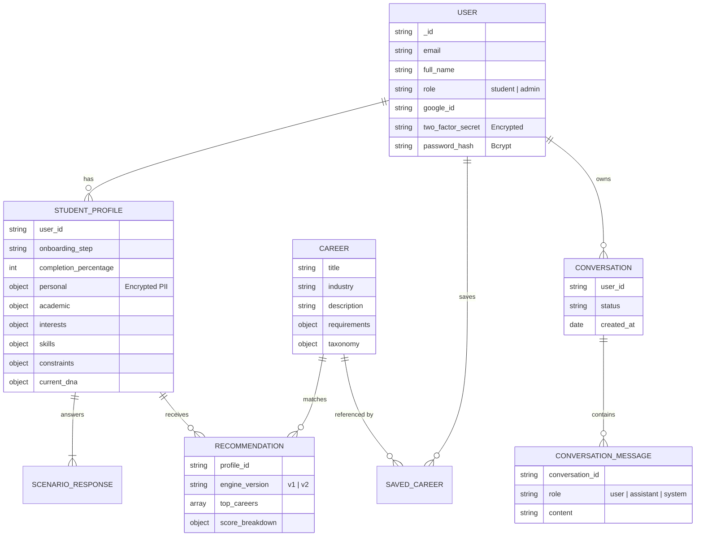

# SCPR: Student Career Path Recommender - Master Analysis

## 1. System Overview & Technology Stack

**The Core Mission**: SCPR is an advanced, AI-driven educational platform designed to guide students toward their ideal career paths. It moves beyond traditional aptitude tests by combining deterministic multi-engine scoring with generative AI counseling to provide holistic, bias-free, and highly personalized career roadmaps.

### Technology Stack
- **Backend (NestJS)**: Chosen for its robust, highly opinionated enterprise architecture. It provides out-of-the-box support for Dependency Injection, Modules, Interceptors, and Guards, making it perfect for the complex V2 Recommendation Engine orchestration.
- **Frontend (React + Vite)**: A lightning-fast modern frontend stack. React powers the complex interactive states (like the AI Chat and Career Explorer), while Vite ensures instant HMR (Hot Module Replacement) during development and highly optimized production builds.
- **Database (MongoDB + Mongoose)**: A NoSQL database is ideal here due to the highly dynamic nature of Student Profiles and Career taxonomies. Mongoose provides a strict schema layer on top of MongoDB to enforce data integrity while maintaining flexibility.
- **AI Layer (OpenRouter)**: Acts as a unified API gateway to access multiple LLMs (Gemini, Mistral, Groq). It provides a robust fallback chain, ensuring that if one AI provider experiences downtime, the system instantly routes the request to another model, guaranteeing 100% uptime for the AI Counselor.

---

## 2. End-to-End Workflows (User Journeys)

### A. Authentication & Onboarding Flow
1. **Login/Register**: A user lands on the site and chooses to authenticate. They can use traditional credentials or **Google Sign-In**. The backend verifies the Google token natively.
2. **2FA Verification**: Before a JWT is issued, the user must pass a Time-Based One-Time Password (TOTP) check. If they are a new user, they are routed to `/setup-2fa` to scan a QR code.
3. **Onboarding Pipeline**: Once authenticated, a new student enters the multi-step onboarding wizard.
   - **Personal Info**: Captures age, location, and board (with intelligent auto-fill logic).
   - **Academic Info**: Captures 10th/12th grades and favorite/weak subjects.
   - **Traits & Skills**: Self-reported interests and competencies.
   - **Scenario Responses**: The student is presented with dynamic scenarios. Their choices calculate their intrinsic "Student DNA" (e.g., risk tolerance, empathy).

### B. Recommendation Generation (V2 Engine) Flow
When a profile is complete, the V2 Orchestrator triggers:
1. **Eligibility Engine**: Filters out careers the student absolutely cannot pursue (e.g., requires Science but student is Commerce).
2. **Scoring Engines**: The core engines (Academic, Interest, Skill, Personality, Constraint) independently evaluate the student against every eligible career in the taxonomy.
3. **Hybrid Ranking**: The scores are normalized and combined into a final ranking.
4. **Diversity Engine**: The top results are clustered by industry. The engine forces diversity, ensuring the Top 8 recommendations aren't all identical (e.g., all engineering roles).
5. **Explainability Engine**: The system generates a deterministic, non-hallucinated breakdown explaining exactly *why* each career was recommended based on the student's specific traits.

### C. AI Counseling Flow
1. A student opens the `CounselingChat`.
2. The frontend sends a message to the backend `/counselor/chat` endpoint.
3. The **Context Builder** retrieves the student's full profile, DNA, and Top 8 recommended careers, injecting them into a system prompt.
4. The `RouterService` sends this massive context to OpenRouter.
5. The LLM streams back personalized, context-aware advice, which the frontend renders beautifully using `ChatMarkdown`.

---

## 3. Database Architecture & ER Diagram

The database is heavily optimized for fast reads and modular AI extensions. Sensitive fields are protected by native AES-256-CBC Field-Level Encryption.

---

## 4. Backend File-by-File Breakdown (NestJS)

The backend resides in `backend/src/` and strictly follows modular domain-driven design.

### `ai-service/` (AI Orchestration Layer)
- **`router.service.ts`**: The brain of the AI layer. Implements a 13-layer model fallback chain via OpenRouter to ensure 100% uptime.
- **`key-pool.service.ts`**: Manages API keys and rate limits.
- **`prompt-builder.service.ts`**: Dynamically compiles markdown templates in `/prompts` (like `career-recommendation.md`) with live student data.
- **`json-validator.service.ts`**: Ensures that any structured output requested from an LLM perfectly matches the TypeScript schemas defined in `schemas/json-schemas/`.

### `recommendation/` (The V2 Recommendation Engine)
- **`engines/*.engine.ts`**: Contains the isolated scoring logic for Academics, Skills, Interests, Personality, and Constraints.
- **`eligibility-engine.service.ts`**: The strict boolean filter that runs before scoring to drop incompatible careers.
- **`hybrid-ranking.engine.ts`**: Normalizes the raw outputs from the scoring engines into a unified 0-100 score.
- **`diversity.engine.ts`**: Groups the top results to prevent cluster domination.
- **`config/`**: Contains the JSON weight mappings and threshold constants.

### `auth/` (Authentication Layer)
- **`auth.controller.ts`**: Exposes `/login`, `/register`, and `/google` endpoints.
- **`auth.service.ts`**: Handles password hashing, Google token verification (via Axios), JWT signing, and TOTP generation.
- **`strategies/jwt.strategy.ts`**: Validates incoming bearer tokens and extracts the user payload.
- **`schemas/user.schema.ts`**: Defines the user collection, utilizing custom encryption setters for `two_factor_secret` and `full_name`.

### `onboarding/` (Student Profile Generation)
- **`onboarding.controller.ts`**: Manages the multi-step wizard state.
- **`onboarding-flow.service.ts`**: Validates the sequential progression of a student's profile.
- **`trait-engine.service.ts`**: Computes the `StudentDNA` object based on scenario responses.
- **`schemas/student-profile.schema.ts`**: A massive nested schema holding PII (encrypted), academic histories, and skills.

### `counselor/` (AI Chat Integration)
- **`counselor.controller.ts`**: Exposes the chat API to the frontend.
- **`counselor.service.ts`**: Manages chat sessions and persists messages to the database.
- **`context-builder.service.ts`**: Queries the `StudentProfile` and `Recommendation` collections to build a highly personalized context window for the LLM.

### `common/` (Global Utilities & Security)
- **`interceptors/sanitization.interceptor.ts`**: A global interceptor that recursively scrubs passwords, recovery codes, and secrets from all outgoing API JSON responses.
- **`utils/crypto.util.ts`**: A native wrapper around Node's `crypto` module providing AES-256-CBC Field-Level Encryption for Mongoose schemas.
- **`filters/http-exception.filter.ts`**: Formats all backend errors into a clean, uniform JSON structure for the frontend.

---

## 5. Frontend File-by-File Breakdown (React/Vite)

The frontend resides in `frontend/src/` and is designed for maximum visual impact using custom CSS and specialized components.

### `pages/` (Route Views)
- **`Login.tsx` / `Register.tsx`**: Standard auth flows now enhanced with native Google Sign-In buttons.
- **`Setup2FA.tsx`**: Renders the TOTP QR code for new accounts.
- **`RecoverAccount.tsx`**: Replaces the old email reset flow with secure backup code validation.
- **`Onboarding.tsx`**: The massive interactive wizard. Features intelligent auto-fill (e.g., DOB instantly calculates Age, State automatically locks in the respective Board).
- **`Dashboard.tsx`**: The central hub displaying the student's DNA spider-chart and quick stats.
- **`CareerExplorer.tsx` & `CareerGallery.tsx`**: Highly visual interfaces for browsing recommended and raw catalog careers.
- **`CounselingChat.tsx`**: The main chat interface hooking into the AI Counselor, featuring streaming text responses.
- **`AdminCareers.tsx`**: An internal tool for modifying the career taxonomy.

### `components/` & `shared/` (UI Building Blocks)
- **`ChatMarkdown.tsx`**: Safely parses and renders Markdown (including tables and bold text) returned by the AI Counselor.
- **`AmbientOrbs.tsx`**: A high-end visual component that creates the glowing, floating background effects.
- **`SectionReveal.tsx`**: A wrapper component utilizing framer-motion concepts to fade in content as the user scrolls.
- **`GlassCard.tsx`**: The core structural container used everywhere, providing the premium "glassmorphism" aesthetic with blurred backdrops.

### `design/` (Design Token System)
Unlike tailwind, this project uses a strict vanilla CSS token system compiled via TypeScript:
- **`colors.ts`**: Harmonious, HSL-tailored premium color palettes.
- **`glass.ts`**: Defines the exact opacity and blur radius for glassmorphism effects.
- **`typography.ts`**: Configures the modern font stacks (e.g., Inter/Outfit) and scale.

### `store/` (State Management)
- **`authStore.ts`**: A lightweight global store (likely Zustand or Context) that holds the active JWT, refresh token, and current User object, persisting them securely across page reloads.

### `api/` (Network Layer)
- **`client.ts`**: The core Axios instance configured to automatically attach the Bearer token to all outgoing requests and gracefully intercept 401 Unauthorized errors to trigger token refreshes.

---

## 6. Security & Encryption Posture

The platform treats student data with extreme privacy:
1. **Field-Level Encryption (FLE)**: Names, DOBs, Locations, and TOTP Secrets are never stored in plaintext. They are encrypted using `crypto.util.ts` before hitting the database, meaning even a database dump reveals zero PII.
2. **Network Security**: `helmet` is active, enforcing strict HSTS (HTTP Strict Transport Security) to prevent man-in-the-middle attacks.
3. **Response Sanitization**: The `SanitizationInterceptor` acts as an absolute fail-safe, ensuring internal operational keys never leak to the client side.
4. **Stateless Authentication**: JWTs are used alongside TOTP, entirely eliminating session hijacking vulnerabilities.

---
*End of Analysis*
