# SCPR — Smart Career Path Recommendation System
## Comprehensive Project Analysis & Documentation

---

**Last Updated:** 2026-07-14
**Project Version:** v1
**Status:** Backend 100% Complete | Frontend 100% Migrated | Testing Pending

---

## Table of Contents

1. [Executive Summary](#1-executive-summary)
2. [Project Overview](#2-project-overview)
3. [High-Level Architecture](#3-high-level-architecture)
4. [System Architecture Diagrams](#4-system-architecture-diagrams)
5. [Module Breakdown](#5-module-breakdown)
6. [Data Flow & Workflow Diagrams](#6-data-flow--workflow-diagrams)
7. [Technical Stack](#7-technical-stack)
8. [Domain Model](#8-domain-model)
9. [Recommendation Pipeline](#9-recommendation-pipeline)
10. [AI Service Architecture](#10-ai-service-architecture)
11. [API Surface](#11-api-surface)
12. [Frontend Architecture](#12-frontend-architecture)
13. [Engineering Rules & Principles](#13-engineering-rules--principles)
14. [Career Catalog Import](#14-career-catalog-import)
15. [Project Status & Progress](#15-project-status--progress)
16. [Known Issues & Open Items](#16-known-issues--open-items)
17. [File Structure](#17-file-structure)
18. [Summary & Next Steps](#18-summary--next-steps)

---

## 1. Executive Summary

SCPR (Smart Career Path Recommendation System) is a production-grade, AI-powered career counseling platform designed specifically for Class 10 students in India. The system uniquely combines **deterministic computation** (for eligibility filtering and trait matching) with **LLM personalization** (for explanations and roadmaps), ensuring every recommendation is transparent, traceable, and defensible.

### Key Metrics

| Metric | Value |
|--------|-------|
| Backend Modules | 11 (NestJS) |
| Frontend Pages | 9 (React 19) |
| Career Catalog | 742 distinct careers across 8 sectors |
| AI Backfill Completion | 89.5% (628/702) |
| API Endpoints | 45+ |
| MongoDB Collections | 11 |
| LLM Providers | 5 (Gemini, Groq, Mistral, DeepSeek, GLM) |
| Total Build Phases | 10 (Phases 0-7 complete, Phase 8 pending) |

### Key Design Decisions

1. **LLM as Co-Pilot, Not Decision-Maker**: The LLM never decides eligibility or invents careers — it only ranks, explains, and personalizes a shortlist the backend already computed
2. **Three-Stage Pipeline**: Eligibility Engine (MongoDB query) → Trait Matching (cosine similarity) → AI Personalization (single LLM call)
3. **Architectural Fix for Classification Failure**: Previous Random Forest + XGBoost approach collapsed onto the same 1-2 careers; the new deterministic architecture solves this
4. **Provider Abstraction**: Swap LLM providers with one-line config changes

---

## 2. Project Overview

### Purpose

SCPR is an AI-powered career counseling platform that guides Class 10 students through an 8-step natural onboarding flow (not a test) to produce traceable, explainable career recommendations. The system uses a deterministic engine to narrow down career options, with AI used only for personalization and explanation — never for decision-making.

### Vision

> A student completes SCPR's onboarding and never feels like they took a test. They answered questions about their subjects, interests, what they're good at, what they want out of life, and how they handle pressure — and at the end, the system hands them a short, ranked, explained list of careers that actually fit them, with a roadmap to get there.

### Key Features

- **8-Step Natural Onboarding**: Personal → Academic → Interests → Skills → Goals → Work Preferences → Constraints → Scenarios
- **Deterministic Recommendation Engine**: 3-stage pipeline (Eligibility → Trait Matching → AI Personalization)
- **Multi-LLM Orchestration**: 5 providers with automatic fallback and retry
- **AI Counselor Chat**: Context-aware conversation with rolling summary
- **PDF Report Generation**: Career reports via pdfmake
- **Admin Panel**: Career catalog management with draft publish/reject workflow
- **742 Career Catalog**: Imported across 8 sectors with AI-refined trait weights

---

## 3. High-Level Architecture

```
┌─────────────────────────────────────────────────────────────────────┐
│                        SCPR System Architecture                      │
├─────────────────────────────────────────────────────────────────────┤
│                                                                       │
│  ┌─────────────────────┐    ┌─────────────────────┐                │
│  │  React 19 Frontend   │    │  NestJS 11 Backend   │                │
│  │  (TypeScript + Vite) │───▶│  (TypeScript)        │                │
│  └─────────────────────┘    └──────────┬──────────┘                │
│                                           │                            │
│                                           ▼                            │
│  ┌─────────────────────────────────────────────────────────────────┐  │
│  │                      Backend Modules                             │  │
│  │  ┌──────────┐ ┌──────────────┐ ┌──────────────┐ ┌────────────┐ │  │
│  │  │   Auth   │ │ Onboarding   │ │   Careers    │ │Recommendation│ │  │
│  │  └──────────┘ └──────────────┘ └──────────────┘ └────────────┘ │  │
│  │  ┌──────────┐ ┌──────────────┐ ┌──────────────┐ ┌────────────┐ │  │
│  │  │Dashboard │ │  Counselor   │ │   Reports    │ │  Analytics  │ │  │
│  │  └──────────┘ └──────────────┘ └──────────────┘ └────────────┘ │  │
│  │  ┌──────────────┐ ┌──────────────┐                              │  │
│  │  │  AI Service   │ │   History    │                              │  │
│  │  │(Multi-LLM)   │ │              │                              │  │
│  │  └──────────────┘ └──────────────┘                              │  │
│  └─────────────────────────────────────────────────────────────────┘  │
│                                           │                            │
│                                           ▼                            │
│  ┌─────────────────────────────────────────────────────────────────┐  │
│  │                    External Dependencies                         │  │
│  │  ┌──────────┐ ┌──────────┐ ┌──────────────┐ ┌──────────────┐  │  │
│  │  │ MongoDB  │ │   JWT    │ │  AI LLM      │ │   PDF Gen    │  │  │
│  │  │  Atlas   │ │  Auth    │ │  Providers   │ │  (pdfmake)   │  │  │
│  │  └──────────┘ └──────────┘ └──────────────┘ └──────────────┘  │  │
│  └─────────────────────────────────────────────────────────────────┘  │
│                                                                       │
└─────────────────────────────────────────────────────────────────────┘
```

---

## 4. System Architecture Diagrams

### 4.1 Component Flow

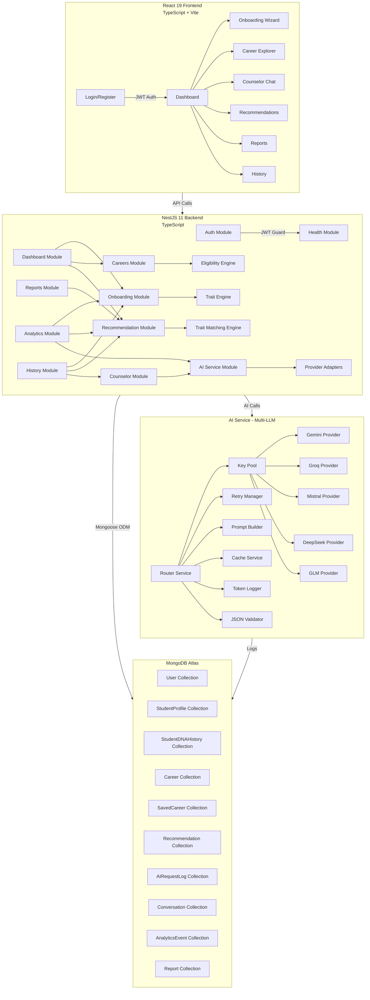

### 4.2 System Context (C4)

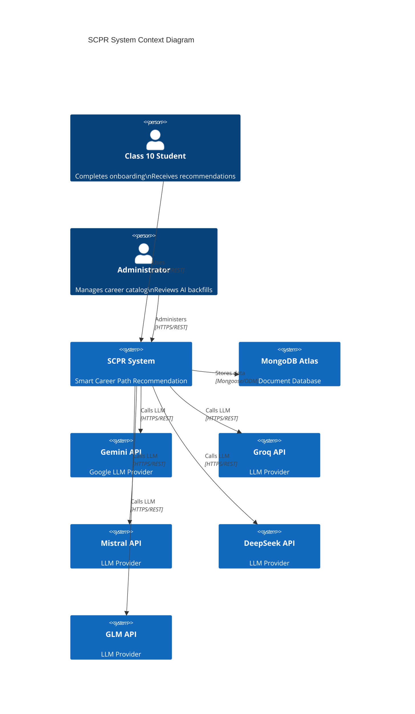

### 4.3 ERD (Entity Relationship Diagram)

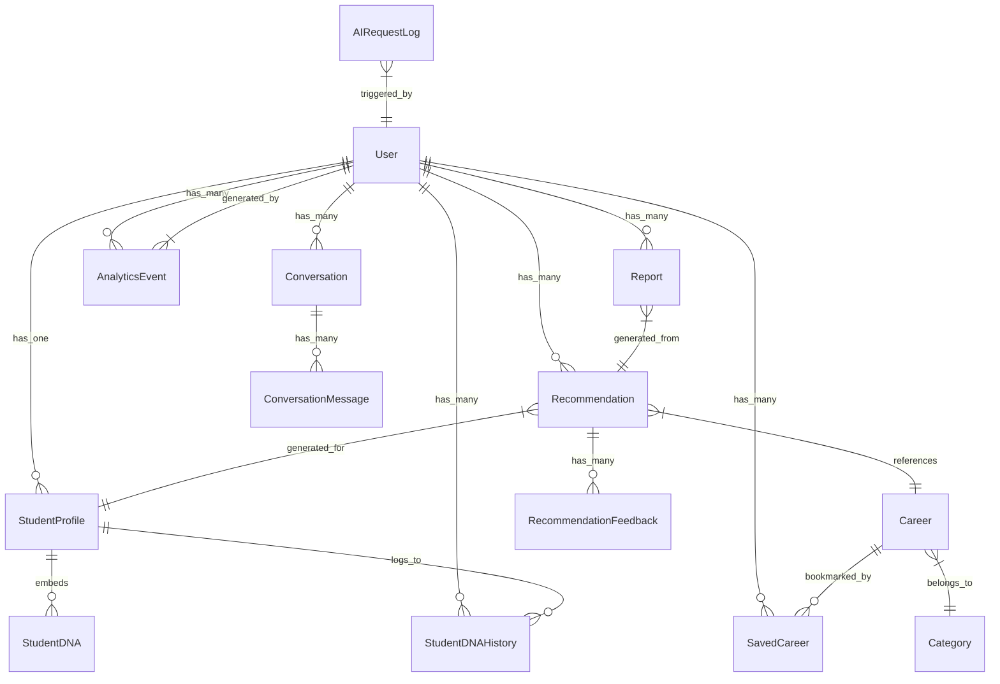

---

## 5. Module Breakdown

### 5.1 Backend Modules (11 Core Modules)

| Module | Responsibility | Dependencies | Key Features |
|--------|---------------|--------------|--------------|
| `auth` | Authentication & Authorization | None | JWT issuance, register/login/refresh, password hashing, failed attempt lockout (5→15min) |
| `health` | System Health Checks | None | Public `/health` endpoint, backend status |
| `ai-service` | Multi-LLM Orchestration | None | 5 provider adapters, key pool rotation, retry with cross-provider fallback, prompt management, JSON validation, caching, token logging |
| `careers` | Career Catalog Management | `ai-service` | Career CRUD, trait weights, eligibility constraints, AI backfill with draft→promote workflow, admin endpoints |
| `onboarding` | Student Onboarding Flow | None | 8-step resumable wizard, profile management, StudentDNA computation (10-dim vector), append-only DNA history |
| `recommendation` | Career Recommendation Engine | `ai-service`, `careers`, `onboarding` | Eligibility engine (MongoDB query), trait matching (cosine similarity), AI personalization (single LLM call), staleness tracking |
| `counselor` | AI Chat & Guidance | `ai-service` | Conversation management, rolling summary (compresses beyond 10 messages), intent classification, safety filter |
| `dashboard` | User Dashboard | `onboarding`, `recommendation`, `careers` | Server-side state machine (`next_action`), progress tracking, insights |
| `reports` | PDF Report Generation | `onboarding`, `recommendation` | pdfmake PDF generation (no Puppeteer), status tracking: QUEUED→GENERATING→READY→DOWNLOADED→FAILED |
| `analytics` | Event Tracking | None | Fire-and-forget logging (never throws), admin dashboards, provider health visibility |
| `history` | Unified Timeline | `onboarding`, `recommendation`, `counselor` | Chronological feed, pagination, type filter |

### 5.2 Frontend Pages

| Page | Route | Auth | Purpose |
|------|-------|------|---------|
| Landing | `/` | Public | Marketing page with hero, career orbit, assessment preview, AI chat preview, student stories |
| Login | `/login` | Public | Email/password login |
| Register | `/register` | Public | User registration |
| Dashboard | `/` (auth) | Auth | Journey state, recommendations overview, saved careers, PDF report generation |
| Onboarding | `/onboarding` | Auth | 8-step profile wizard with confetti completion |
| Career Explorer | `/careers` | Auth | Browse/search careers, save/unsave, view recommendations |
| Counseling Chat | `/chat` | Auth | AI counselor chat interface |
| History Log | `/history` | Auth | Unified activity timeline |
| Admin Careers | `/admin/careers` | Admin | Career catalog management, draft review, import audit |

---

## 6. Data Flow & Workflow Diagrams

### 6.1 Student User Journey

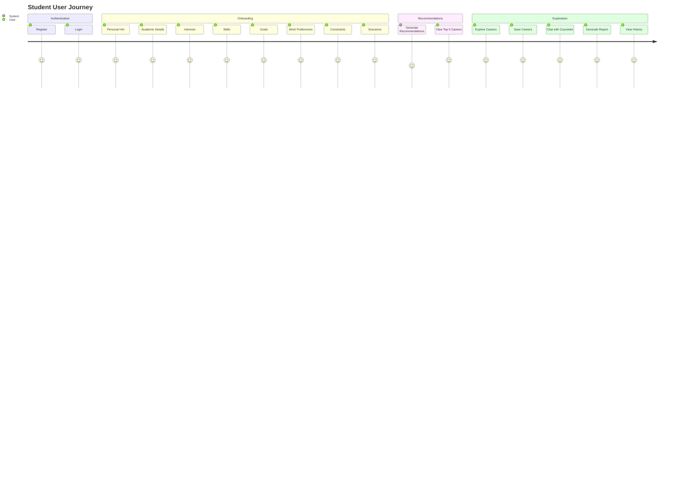

### 6.2 Recommendation Pipeline


### 6.3 AI Service Flow

```mermaid
flowchart TD
    subgraph Request["AI Service Request"]
        A[aiService.run\n(taskType, context)] --> B[Router Service]
    end

    subgraph Routing["Provider Selection"]
        B --> C[Get Provider List\nfrom taskType]
        C --> D[Primary Provider]
        D -->|Success| E[Return Response]
        D -->|Failure| F[Retry Manager]
        F --> G[Next Key in Pool]
        G -->|Success| E
        G -->|Exhausted| H[Next Provider\nin Fallback Chain]
        H --> D
    end

    subgraph Processing["Request Processing"]
        D --> I[Key Pool Service\nGet Next Key]
        I --> J[Prompt Builder\nLoad & Interpolate Template]
        J --> K[Provider Adapter\nCall LLM API]
        K --> L[Cache Service\nCheck/Store]
        K --> M[Token Logger\nLog AIRequestLog]
        K --> N[JSON Validator\nValidate & Repair]
    end

    subgraph Response["Standardized Response"]
        N --> O[Normalize to\nStandard Shape]
        O --> E
    end

    subgraph Providers["LLM Providers"]
        P1[Gemini] --> K
        P2[Groq] --> K
        P3[Mistral] --> K
        P4[DeepSeek] --> K
        P5[GLM] --> K
    end

    style Request fill:#bbdefb
    style Routing fill:#c8e6c9
    style Processing fill:#ffecb3
    style Response fill:#ffcdd2
    style Providers fill:#f8bbd0
```

### 6.4 Onboarding Step Flow

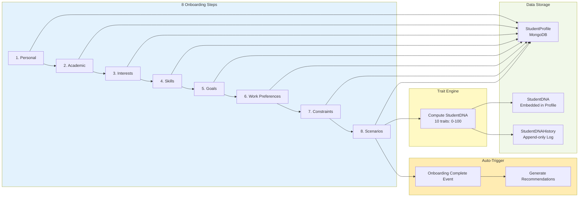

### 6.5 Counselor Chat Flow

```mermaid
flowchart TD
    subgraph UserInput["User Chat Input"]
        A[User Message] --> B[Context Builder]
    end

    subgraph Context["Context Assembly"]
        B --> C[Get Recent Messages]
        C --> D{History > 10 messages?}
        D -->|Yes| E[Get Rolling Summary]
        D -->|No| F[Use Full History]
        E --> F
        F --> G[Add User Message]
        G --> H[Build Context Payload]
    end

    subgraph Intent["Intent Classification"]
        H --> I[Classify Intent\ncareer/roadmap/general]
        I --> J[Shape Prompt\nBased on Intent]
    end

    subgraph AI["AI Processing"]
        J --> K[aiService.run\n('counselor_chat')]
        K --> L[Get AI Response]
    end

    subgraph PostProcess["Response Handling"]
        L --> M[Safety Filter]
        M --> N{Valid JSON?}
        N -->|Yes| O[Parse Structured Response]
        N -->|No| P[Render as Markdown]
        O --> P
        P --> Q[Save Message]
    end

    subgraph Storage["Storage"]
        Q --> R[ConversationMessage\nCollection]
        Q --> S[Update Conversation\nSummary if needed]
    end

    style UserInput fill:#e1f5fe
    style Context fill:#fff3e0
    style Intent fill:#e8f5e9
    style AI fill:#ffecb3
    style PostProcess fill:#f3e5f5
    style Storage fill:#fce4ec
```

### 6.6 Sequence Diagram: Recommendation Generation

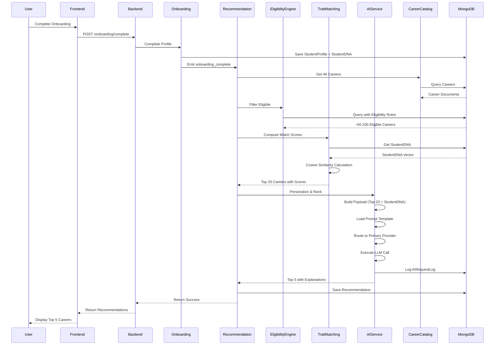

---

## 7. Technical Stack

### 7.1 Backend Stack

| Category | Technology | Version | Purpose |
|----------|------------|---------|---------|
| Framework | NestJS | 11.x | Modular backend framework with DI |
| Runtime | Node.js | LTS | JavaScript runtime |
| Language | TypeScript | 5.7+ | Type-safe development |
| ODM | Mongoose | 9.x | MongoDB object modeling |
| Database | MongoDB Atlas | Latest | Cloud document database |
| Validation | class-validator / class-transformer | Latest | DTO validation at controller boundary |
| Auth | Passport.js | 0.7.x | Authentication middleware (passport-jwt, passport-local) |
| JWT | @nestjs/jwt | 11.x | Token generation/verification |
| Hashing | bcrypt | 6.x | Password hashing |
| PDF | pdfmake | 0.3.x | PDF generation (no Puppeteer) |
| Vector Math | Custom `vector-math.ts` | N/A | Cosine similarity calculations |
| JSON Schema | ajv | 8.x | AI response validation |

### 7.2 Frontend Stack

| Category | Technology | Version | Purpose |
|----------|------------|---------|---------|
| Framework | React | 19.x | UI framework |
| Build Tool | Vite | 8.x | Fast development server & bundler |
| Language | TypeScript | 6.x | Type-safe development |
| Styling | Tailwind CSS | 4.x | Utility-first CSS (CSS-first, no config file) |
| State Management | Zustand | 5.x | Client state (JWT in memory only) |
| Server Cache | TanStack Query | 5.x | Server state caching & management |
| Routing | React Router | 7.x | Client-side routing (lazy-loaded) |
| HTTP Client | Axios | 1.x | HTTP requests with interceptors |
| Animation | Framer Motion | 12.x | UI animations with reduced-motion support |
| Icons | lucide-react | 1.x | Icon library |
| Utilities | clsx, tailwind-merge | Latest | Class merging helpers |

### 7.3 AI Providers

| Provider | Models | Primary Use Case | Status |
|----------|--------|------------------|--------|
| Gemini | gemini-2.5-flash | Career ranking, roadmap generation | ✅ Healthy (v1 API) |
| Groq | llama-3.3-70b-versatile, llama-3.1-8b-instant | Counselor chat (low-latency) | ⚠️ TPD-limited |
| Mistral | mistral-large-latest | Report summary | ✅ Healthy |
| DeepSeek | deepseek-chat | Fallback for ranking | ❌ Insufficient balance |
| GLM | glm-4-plus | Configured, not in routing | ⚙️ Available |

---

## 8. Domain Model

### 8.1 Core Entities

#### User Schema
```typescript
{
  user_id: string;           // UUID, hyphens stripped — stable external id
  email: string;
  email_verified: boolean;
  password_hash: string;
  provider: 'local';        // Future: 'google', etc.
  role: 'student' | 'admin';
  full_name: string;
  failed_login_attempts: number;
  locked_until: Date;
  last_login: Date;
  created_at: Date;
  updated_at: Date;
}
```

#### StudentProfile Schema
```typescript
{
  user_id: string;
  onboarding_step: string;  // Current step key for resume
  completion_percentage: number;
  personal: {
    name: string;
    dob: Date;
    age: number;
    gender: string;
    city: string;
    state: string;
    board: string;
  };
  academic: {
    status: string;
    class10_percent: number;
    class12_percent: number;
    subjects: {
      maths: number;
      science: number;
      english: number;
      sst: number;
      computer: number;
    };
    favorite_subjects: string[];
    weak_subjects: string[];
    stream_interest: string;
  };
  interests: {              // 0-100 sliders
    technology: number;
    business: number;
    helping_people: number;
    teaching: number;
    nature: number;
    research: number;
    sports: number;
    design: number;
    media: number;
    government: number;
    finance: number;
    machines: number;
  };
  skills: {                 // 1-5 self-rated
    communication: number;
    leadership: number;
    problem_solving: number;
    creativity: number;
    logical_thinking: number;
    coding: number;
    drawing: number;
    math: number;
    observation: number;
    patience: number;
  };
  goals: string[];          // Ranked list
  work_preferences: string[];
  constraints: {
    govt_vs_private: string;
    budget_tier: number;
    study_duration_max: number;
    willing_to_relocate: boolean;
    abroad_ok: boolean;
    preferred_location: string;
  };
  scenario_responses: [{
    question_id: string;
    selected_option: string;
    trait_weights: object;
  }];
  current_dna: StudentDNA;  // Embedded
  created_at: Date;
  updated_at: Date;
}
```

#### StudentDNA Schema (Embedded)
```typescript
{
  analytical_thinking: number;      // 0-100
  creativity: number;               // 0-100
  communication: number;            // 0-100
  leadership: number;               // 0-100
  research: number;                 // 0-100
  business_acumen: number;          // 0-100
  technical_curiosity: number;      // 0-100
  empathy: number;                  // 0-100
  patience: number;                 // 0-100
  risk_tolerance: number;           // 0-100
  computed_at: Date;
  source_version: string;           // Trait-weight config version
}
```

#### Career Schema
```typescript
{
  career_code: string;              // Stable string id (slug of name)
  category_code: string;
  sub_domain_code: string;
  name: string;
  description: string;
  required_skills: string[];
  technical_skills: string[];
  soft_skills: string[];
  market_demand: number;
  future_scope: string;
  career_progression: string;
  pathway_tags: string[];
  source_catalog_parts: string[];
  backfill_status: 'rule_based' | 'ai_refined' | 'published';
  needs_enrichment: boolean;
  is_active: boolean;
  imported_at: Date;
  trait_weights: {                  // Live weights
    analytical_thinking: number;
    creativity: number;
    communication: number;
    leadership: number;
    research: number;
    business_acumen: number;
    technical_curiosity: number;
    empathy: number;
    patience: number;
    risk_tolerance: number;
  };
  eligibility: {                   // Hard gates
    min_maths: number;
    min_science: number;
    min_biology: number;
    min_english: number;
    max_budget_tier: number;
    min_study_duration_years: number;
    max_study_duration_years: number;
    required_stream: string;
    abroad_required: boolean;
  };
  trait_weights_draft: object;      // Staging for LLM backfill
  eligibility_draft: object;       // Staging for LLM backfill
}
```

#### Recommendation Schema
```typescript
{
  user_id: string;
  onboarding_session_ref: string;
  pipeline_version: string;
  eligible_count: number;
  shortlist: [{
    career_code: string;
    match_score: number;
  }];
  final_recommendations: [{
    career_code: string;
    rank: number;
    ai_score: number;
    explanation: string;
    roadmap: string;
    suggested_colleges: string[];
    suggested_certifications: string[];
  }];
  ai_provider_used: string;
  ai_model_used: string;
  fallback_used: boolean;
  generated_at: Date;
  stale: boolean;
}
```

### 8.2 MongoDB Collections Summary

| Collection | Records | Purpose |
|------------|---------|---------|
| User | ~few | Authentication & identity |
| StudentProfile | ~few | Onboarding data + StudentDNA |
| StudentDNAHistory | ~few | Append-only DNA snapshots |
| Career | 742 | Career catalog with traits & eligibility |
| SavedCareer | ~few | Career bookmarks per user |
| Recommendation | ~few | Generated recommendations |
| RecommendationFeedback | ~few | User feedback on recommendations |
| Conversation | ~few | Counselor chat sessions |
| ConversationMessage | ~few | Individual chat messages |
| AIRequestLog | ~hundreds | Per-call AI provider logging |
| AnalyticsEvent | ~thousands | Fire-and-forget events |
| Report | ~few | PDF report generation status |

---

## 9. Recommendation Pipeline

### 9.1 Three-Stage Architecture

```
┌─────────────────────────────────────────────────────────────────────┐
│                      RECOMMENDATION PIPELINE                        │
├─────────────────────────────────────────────────────────────────────┤
│                                                                       │
│  Student Input ──► Eligibility Engine ──► Trait Matching Engine     │
│                    │                       │                           │
│                    ▼                       ▼                           │
│           ~50-100 Eligible Careers     Top 20 Candidates             │
│                    │                       │                           │
│                    └───────────┬───────────┘                           │
│                                     ▼                                  │
│                            AI Personalization                         │
│                                     │                                  │
│                                     ▼                                  │
│                            Top 5 Final Recommendations                │
│                                                                       │
└─────────────────────────────────────────────────────────────────────┘
```

### 9.2 Stage 1: Eligibility Engine

- **Type**: Deterministic MongoDB Query
- **Input**: Full career catalog + StudentProfile constraints
- **Output**: ~50-100 careers that pass hard constraints
- **Mechanism**: MongoDB query with `$lte`, `$gte` operators
- **AI Involvement**: **NONE** — Pure database filtering

```typescript
// Example Eligibility Query
this.careerModel.find({
  'eligibility.min_maths': { $lte: student.academic.subjects.maths },
  'eligibility.min_science': { $lte: student.academic.subjects.science },
  'eligibility.max_budget_tier': { $gte: student.constraints.budget_tier },
  'eligibility.min_study_duration_years': { $lte: student.constraints.study_duration_max },
});
```

### 9.3 Stage 2: Trait Matching Engine

- **Type**: Deterministic Vector Similarity
- **Input**: Eligible careers + StudentDNA vector
- **Output**: Top 20 careers ranked by match score
- **Mechanism**: Weighted cosine similarity between vectors
- **AI Involvement**: **NONE** — Pure TypeScript math

```typescript
// Cosine Similarity Calculation
function cosineSimilarity(a: number[], b: number[]): number {
  let dotProduct = 0, normA = 0, normB = 0;
  for (let i = 0; i < a.length; i++) {
    dotProduct += a[i] * b[i];
    normA += a[i] * a[i];
    normB += b[i] * b[i];
  }
  return dotProduct / (Math.sqrt(normA) * Math.sqrt(normB));
}

// Match Score
match_score = cosineSimilarity(studentDnaVector, careerTraitVector) * 100;
```

### 9.4 Stage 3: AI Personalization

- **Type**: Single LLM Call
- **Input**: Top 20 candidates + StudentDNA + StudentProfile
- **Output**: Top 5 careers with rankings, explanations, roadmaps
- **AI Involvement**: **YES** — But only for ranking and explanation

```json
{
  "student_profile": { "academic": {...}, "interests": {...}, "goals": [...] },
  "student_dna": { "analytical_thinking": 92, "technical_curiosity": 96, ... },
  "candidate_careers": [
    { "career_code": "SE", "name": "Software Engineer", "match_score": 96 },
    { "career_code": "AI", "name": "AI Engineer", "match_score": 94 }
  ]
}
```

**Critical Rule**: The LLM must **NEVER** invent a career outside the provided candidate list. It can only rank, explain, and personalize from the top 20 already determined by the backend.

---

## 10. AI Service Architecture

### 10.1 Provider Orchestration Layer

```
┌─────────────────────────────────────────────────────────────────────┐
│                        AI SERVICE MODULE                            │
├─────────────────────────────────────────────────────────────────────┤
│                                                                       │
│  ┌─────────────────────────────────────────────────────────────────┐ │
│  │                  ai-service.client.ts                            │ │
│  │               (Single Public Entrypoint)                         │ │
│  │             aiService.run(taskType, context)                     │ │
│  └─────────────────────────────────────────────────────────────────┘ │
│                                     │                                 │
│                                     ▼                                 │
│  ┌─────────────────────────────────────────────────────────────────┐ │
│  │                  router.service.ts                               │ │
│  │  Task Type → [Primary, Fallback1, Fallback2]                     │ │
│  │  career_recommendation → [Gemini, DeepSeek, Groq]                │ │
│  │  counselor_chat → [Groq, Groq, Gemini Flash]                     │ │
│  │  career_trait_backfill → [GLM, Gemini, Groq]                     │ │
│  └─────────────────────────────────────────────────────────────────┘ │
│                                     │                                 │
│                     ┌───────────────┴───────────────┐                │
│                     ▼                               ▼                │
│  ┌─────────────────────────┐       ┌─────────────────────────┐     │
│  │  key-pool.service.ts    │       │ retry-manager.service    │     │
│  │  - Load keys from env   │       │  - Rotate within         │     │
│  │  - Round-robin rotation │       │    provider first        │     │
│  │  - Track key usage      │       │  - Escalate to           │     │
│  └─────────────────────────┘       │    fallback provider     │     │
│                                     └─────────────────────────┘     │
│                                     │                                 │
│                     ┌───────────────┴───────────────┐                │
│                     ▼                               ▼                │
│  ┌─────────────────────────┐       ┌─────────────────────────┐     │
│  │ prompt-builder.ts       │       │ cache.service.ts         │     │
│  │  - Load .md templates   │       │  - SHA-256 hashing       │     │
│  │  - Variable interp.     │       │  - TTL-based cache       │     │
│  └─────────────────────────┘       └─────────────────────────┘     │
│                                     │                                 │
│                     ┌───────────────┴───────────────┐                │
│                     ▼                               ▼                │
│  ┌─────────────────────────┐       ┌─────────────────────────┐     │
│  │ json-validator.ts       │       │ token-logger.ts          │     │
│  │  - ajv-backed valid.    │       │  - Log to MongoDB        │     │
│  │  - Bounded JSON repair  │       │  - Track usage           │     │
│  └─────────────────────────┘       └─────────────────────────┘     │
│                                     │                                 │
│                                     ▼                                 │
│  ┌─────────────────────────────────────────────────────────────────┐ │
│  │                    providers/                                    │ │
│  │  ┌──────────┐ ┌──────────┐ ┌──────────┐ ┌──────────┐ ┌──────┐ │ │
│  │  │ Gemini   │ │  Groq    │ │ Mistral  │ │DeepSeek  │ │ GLM  │ │ │
│  │  │ Provider │ │ Provider │ │ Provider │ │ Provider │ │Provid│ │ │
│  │  └──────────┘ └──────────┘ └──────────┘ └──────────┘ └──────┘ │ │
│  └─────────────────────────────────────────────────────────────────┘ │
│                                                                       │
└─────────────────────────────────────────────────────────────────────┘
```

### 10.2 Routing Table

| Task Type | Primary | Fallback 1 | Fallback 2 | Use Case |
|-----------|---------|------------|------------|----------|
| career_recommendation | Gemini Flash | DeepSeek | Groq LLaMA 3.3-70B | Rank & explain top 20 |
| roadmap_generation | Gemini Flash | DeepSeek | Groq LLaMA 3.3-70B | Generate career roadmap |
| counselor_chat | Groq LLaMA 3.3-70B | Groq Mixtral 8x7B | Gemini Flash | Low-latency chat |
| career_trait_backfill | Gemini Flash | Groq LLaMA 3.3-70B | Groq LLaMA 3.1-8B | LLM-assisted catalog building |
| report_summary | Mistral Large | Gemini Flash | Groq LLaMA 3.3-70B | PDF report content |

### 10.3 Fallback Flow

1. **Primary Provider**: Try all available keys in pool
2. **Within Provider**: Rotate through keys, retry on rate limit/timeout
3. **Cross Provider**: After exhausting all keys for primary, escalate to Fallback 1
4. **Final Fallback**: After exhausting Fallback 1, escalate to Fallback 2
5. **Failure**: If all providers fail, throw typed error
6. **Quota Fail-Fast**: Billing/rate-limit errors skip remaining keys immediately

### 10.4 Standard Response Shape

```typescript
interface AIResponse {
  provider: string;           // e.g., "gemini"
  model: string;              // e.g., "gemini-2.5-flash"
  task: string;               // e.g., "career_recommendation"
  success: boolean;
  data: any;                  // Task-specific JSON
  usage: {
    input_tokens: number;
    output_tokens: number;
  };
  latency_ms: number;
  fallback_used: boolean;
  cached: boolean;
}
```

### 10.5 Prompt Management

All prompts are stored as `.md` files in `ai-service/prompts/`:
- `career-recommendation.md`
- `roadmap-generation.md`
- `counselor-chat.md`
- `career-trait-backfill.md`
- `report-summary.md`
- `test-task.md`

Prompts are loaded and interpolated at runtime using `prompt-builder.service.ts`.

### 10.6 AI Service File Structure

```
ai-service/
├── config/
│   └── provider-models.config.ts       # Centralized model identifiers + API versions
├── schemas/
│   └── json-schemas/
│       ├── index.ts                    # TaskType → JSONSchema map
│       ├── career-recommendation.schema.ts
│       ├── counselor-chat.schema.ts
│       ├── career-trait-backfill.schema.ts
│       ├── report-summary.schema.ts
│       └── roadmap-generation.schema.ts
├── prompts/
│   ├── career-recommendation.md
│   ├── career-trait-backfill.md
│   ├── counselor-chat.md
│   ├── report-summary.md
│   ├── roadmap-generation.md
│   └── test-task.md
├── providers/
│   ├── provider.interface.ts
│   ├── gemini.provider.ts
│   ├── groq.provider.ts
│   ├── mistral.provider.ts
│   ├── deepseek.provider.ts
│   └── glm.provider.ts
├── ai-request-log.schema.ts
├── ai-service.client.ts              # SINGLE public entrypoint
├── ai-service.controller.ts          # GET /ai-service/health
├── ai-service.module.ts
├── ai-service.schemas.ts
├── cache.service.ts
├── json-validator.service.ts         # ajv-backed + bounded repair
├── key-pool.service.ts
├── prompt-builder.service.ts
├── retry-manager.service.ts
├── router.service.ts
└── token-logger.service.ts
```

---

## 11. API Surface

### 11.1 Global Configuration

- **Base Path**: `/api`
- **Authentication**: JWT Bearer (default), with `@Public()` decorator for exceptions
- **Response Envelope**: All success responses wrapped in `{ data, timestamp, requestId }`
- **Error Shape**: Consistent error format across all endpoints

### 11.2 Module Endpoints

#### Auth Module (`/api/auth`)

| Method | Endpoint | Description | Auth |
|--------|----------|-------------|------|
| POST | `/register` | Register new user | Public |
| POST | `/login` | Login with credentials | Public |
| POST | `/logout` | Invalidate refresh token | Auth |
| POST | `/refresh` | Get new access token | Public |
| GET | `/me` | Get current user info | Auth |
| GET | `/verify-email/:token` | Verify email | Public |
| POST | `/forgot-password` | Request password reset | Public |
| POST | `/reset-password` | Reset password | Public |

#### Health Module (`/api/health`)

| Method | Endpoint | Description | Auth |
|--------|----------|-------------|------|
| GET | `/` | System health check | Public |

#### AI Service Module (`/api/ai-service`)

| Method | Endpoint | Description | Auth |
|--------|----------|-------------|------|
| GET | `/health` | Live per-provider health check (5-min cache) | Public |

#### Onboarding Module (`/api/onboarding`)

| Method | Endpoint | Description | Auth |
|--------|----------|-------------|------|
| POST | `/start` | Initialize onboarding | Auth |
| PUT | `/step/:stepKey` | Save step data | Auth |
| GET | `/resume` | Get current step & saved data | Auth |
| POST | `/complete` | Mark onboarding complete | Auth |
| GET | `/student-dna` | Get StudentDNA | Auth |

#### Careers Module (`/api/careers`)

| Method | Endpoint | Description | Auth |
|--------|----------|-------------|------|
| GET | `/` | List all careers | Public |
| GET | `/categories` | List all categories | Public |
| GET | `/search` | Search careers | Public |
| GET | `/suggest` | Get career suggestions | Public |
| GET | `/filter` | Filter careers | Public |
| GET | `/:careerCode` | Get career by code | Public |
| GET | `/related/:careerCode` | Get related careers | Public |
| GET | `/roadmap/:careerCode` | Get career roadmap | Public |
| POST | `/by-codes` | Get multiple careers by codes | Public |
| POST | `/save/:careerId` | Save career bookmark | Auth |
| GET | `/saved` | Get saved careers | Auth |
| GET | `/saved/status/:careerId` | Check save status | Auth |
| GET | `/admin/careers` | Paginated list with filters | Admin |
| GET | `/admin/careers/:careerCode` | Full detail with draft comparison | Admin |
| PUT | `/admin/careers/:careerCode` | Manual inline edit | Admin |
| POST | `/admin/careers/:careerCode/publish-draft` | Publish draft → live | Admin |
| POST | `/admin/careers/:careerCode/reject-draft` | Reject draft | Admin |
| POST | `/admin/careers/bulk-publish` | Bulk publish drafts | Admin |
| GET | `/admin/careers/import-audit` | Import audit summary | Admin |
| PATCH | `/admin/careers/:careerCode/toggle-active` | Soft enable/disable | Admin |

#### Recommendation Module (`/api/recommendations`)

| Method | Endpoint | Description | Auth |
|--------|----------|-------------|------|
| POST | `/generate` | Generate recommendations | Auth |
| GET | `/latest` | Get latest recommendations | Auth |
| POST | `/regenerate` | Regenerate recommendations | Auth |
| POST | `/feedback` | Submit feedback | Auth |

#### Counselor Module (`/api/counselor`)

| Method | Endpoint | Description | Auth |
|--------|----------|-------------|------|
| POST | `/chat` | Send chat message | Auth |
| GET | `/conversations` | List conversations | Auth |
| GET | `/conversations/:id` | Get conversation by ID | Auth |
| POST | `/feedback` | Submit chat feedback | Auth |
| POST | `/regenerate` | Regenerate last response | Auth |

#### Dashboard Module (`/api/dashboard`)

| Method | Endpoint | Description | Auth |
|--------|----------|-------------|------|
| GET | `/` | Get dashboard data | Auth |

#### Reports Module (`/api/report`)

| Method | Endpoint | Description | Auth |
|--------|----------|-------------|------|
| POST | `/generate` | Generate PDF report | Auth |
| GET | `/status/:reportId` | Get report status | Auth |
| GET | `/download/:reportId` | Download report | Auth |
| GET | `/history` | Get report history | Auth |

#### Analytics Module (`/api/analytics`)

| Method | Endpoint | Description | Auth |
|--------|----------|-------------|------|
| GET | `/me` | User analytics | Auth |
| GET | `/platform` | Platform-wide analytics | Admin |
| GET | `/careers` | Career analytics | Admin |
| GET | `/ai` | AI usage analytics | Admin |
| POST | `/event` | Log analytics event | Auth |

#### History Module (`/api/history`)

| Method | Endpoint | Description | Auth |
|--------|----------|-------------|------|
| GET | `/?type=all\|careers\|recommendations\|onboarding` | Get history | Auth |

### 11.3 Response Envelope Contract

**Success Response:**
```typescript
{
  data: any;              // Actual response payload
  timestamp: string;      // ISO timestamp
  requestId: string;      // Unique request identifier
}
```

**Error Response:**
```typescript
{
  statusCode: number;     // HTTP status code
  message: string;        // Error message
  detail?: string;        // Optional detail
  errors?: FieldError[];  // Optional field-level errors
  timestamp: string;      // ISO timestamp
  path: string;           // Request path
  requestId: string;      // Unique request identifier
}
```

---

## 12. Frontend Architecture

### 12.1 Directory Structure

```
frontend/src/
├── main.tsx                    # Entry point
├── App.tsx                     # Router + Suspense + ErrorBoundary
├── App.css                     # (minimal)
├── index.css                   # Tailwind v4 @theme + utilities + animations
├── api/
│   ├── client.ts               # Axios with JWT interceptor + refresh queue
│   └── adminCareers.ts         # Admin career API functions
├── store/
│   └── authStore.ts            # Zustand: user, accessToken, refreshToken (memory only)
├── lib/
│   ├── utils.ts                # cn() helper (clsx + tailwind-merge)
│   └── motion.ts               # Framer Motion variants (fadeUp, fadeIn, scaleIn, staggerContainer)
├── components/
│   ├── layout/
│   │   ├── AppShell.tsx        # Sidebar + main content + floating AI button
│   │   └── AuthLayout.tsx      # Centered card layout + AmbientOrbs
│   ├── shared/
│   │   ├── AmbientOrbs.tsx     # Animated background orbs
│   │   ├── ErrorBoundary.tsx   # React error boundary with retry
│   │   └── SectionReveal.tsx   # Scroll-in animation wrapper
│   ├── ui/
│   │   ├── Button.tsx          # Variants: primary, secondary, ghost, destructive
│   │   └── GlassCard.tsx       # Glassmorphism card component
│   └── OnboardingProgress.tsx  # Step progress indicator
└── pages/
    ├── Landing.tsx             # Public landing page (hero, orbit, journey, careers, CTA)
    ├── Login.tsx               # Login form → POST /auth/login
    ├── Register.tsx            # Register form → POST /auth/register
    ├── Dashboard.tsx           # Dashboard with reports, recommendations, PDF gen
    ├── Onboarding.tsx          # 8-step wizard: personal → academic → interests → skills → goals
    ├── CareerExplorer.tsx      # Browse/search careers, save/unsave, recommendations
    ├── CounselingChat.tsx      # AI counselor chat interface
    ├── HistoryLog.tsx          # Unified activity timeline
    └── AdminCareers.tsx        # Admin career catalog management panel
```

### 12.2 Routing

| Route | Component | Auth | Notes |
|-------|-----------|------|-------|
| `/` | Landing or Dashboard | Public → Auth | Unauthenticated: Landing; authenticated: Dashboard |
| `/login` | Login | Public | Redirects to `/` if already authenticated |
| `/register` | Register | Public | Redirects to `/` if already authenticated |
| `/onboarding` | Onboarding | Auth | 8-step profile wizard |
| `/careers` | CareerExplorer | Auth | Career catalog + recommendations |
| `/chat` | CounselingChat | Auth | AI counselor |
| `/history` | HistoryLog | Auth | Activity timeline |
| `/admin/careers` | AdminCareers | Admin | Admin career management |
| `*` | Navigate to `/` | — | Catch-all redirect |

### 12.3 Key Frontend Design Decisions

- **JWT in memory only**: Zustand store, never localStorage/sessionStorage
- **Silent token refresh**: Axios interceptor queues failed 401 requests, refreshes token, retries
- **Response envelope unwrap**: Axios interceptor extracts `response.data.data` automatically
- **Lazy-loaded routes**: All page components use `React.lazy()` + `Suspense`
- **Tailwind v4 CSS-first**: Design tokens via `@theme` directive in `index.css`
- **Dark theme**: Deep purple/black background (`#150E22`), accent purple (`#B583F0`), gold CTA (`#F0A83E`)
- **Glassmorphism**: `glass-card` utility with backdrop blur and translucent backgrounds
- **Reduced motion**: Respects `prefers-reduced-motion` — animations disabled
- **Accessibility**: Focus rings (`focus-ring` utility), keyboard navigation, semantic HTML

### 12.4 Design System (Tailwind v4 Theme)

```css
@theme {
  --color-bg: #150E22;
  --color-surface: #201735;
  --color-text: #FFFFFF;
  --color-text-muted: #C3B8D9;
  --color-accent: #B583F0;
  --color-accent-2: #4FE0B0;
  --color-muted: #9686B5;
  --color-cta: #F0A83E;
  --color-cta-text: #1A1330;
  --color-destructive: #EF4444;
  --font-jakarta: "Plus Jakarta Sans", sans-serif;
  --font-anton: "Anton", sans-serif;
}
```

### 12.5 Component Library

| Component | Purpose | Variants/Features |
|-----------|---------|-------------------|
| `Button` | Primary action button | primary, secondary, ghost, destructive; size: sm/md/lg |
| `GlassCard` | Glassmorphism container | backdrop-blur, translucent background, border |
| `AppShell` | Authenticated layout | Sidebar + main content + floating AI button |
| `AuthLayout` | Unauthenticated layout | Centered card + AmbientOrbs |
| `ErrorBoundary` | React error boundary | Retry button, fallback UI |
| `SectionReveal` | Scroll-in animation | IntersectionObserver + Framer Motion |
| `AmbientOrbs` | Background decoration | Animated gradient orbs |
| `OnboardingProgress` | Step indicator | 8-step progress bar with icons |

---

## 13. Engineering Rules & Principles

### 13.1 Non-Negotiable Rules

1. **Mongoose Only**: Never use raw MongoDB driver calls unless Mongoose cannot express the operation
2. **Thin Controllers**: All business logic must live in `*.service.ts` files; controllers only parse requests and shape responses
3. **JWT in Memory Only**: Frontend JWT tokens must be stored in Zustand (memory only), never in `localStorage` or `sessionStorage`
4. **Analytics Must Never Throw**: Every analytics event-firing call must be wrapped in try/catch that logs and swallows failures
5. **Backend is Source of Truth**: Eligibility filtering and trait-match scoring must be deterministic TypeScript/Mongo logic; LLM never decides eligibility
6. **Never Send Full Catalog to LLM**: Every recommendation call must receive pre-filtered top-20 candidates only
7. **Provider-Agnostic Design**: No module outside `ai-service/` may import a provider SDK directly
8. **Prompts as MD Files**: All prompts must be stored as `.md` template files under `ai-service/prompts/`
9. **Snake Case on Wire**: All API request/response bodies and query params must use `snake_case` field names
10. **Scope Discipline**: Each phase must touch only the files it explicitly names
11. **Model Strings in One Place**: Never hardcoded in provider files; all in `config/provider-models.config.ts`
12. **No Hand-Rolled Validation**: Use ajv for JSON Schema; hand-rolled `checkSchema()` was the root cause of a production bug
13. **Quota Errors Fail Fast**: Billing/rate-limit errors skip remaining keys and escalate to next fallback immediately

### 13.2 Field Naming Conventions

- **API Boundary**: Always `snake_case` (e.g., `user_id`, `career_code`, `student_dna`)
- **Database**: Match API naming (`snake_case`)
- **Internal TypeScript**: Can use `camelCase` or `PascalCase` as appropriate
- **Stable Identifiers**: Use `career_code` and `category_code` as string IDs, never Mongo `_id`
- **User ID**: Hyphen-stripped UUID, not Mongo `_id`

---

## 14. Career Catalog Import

### 14.1 Import Phases

| Phase | Sector | Careers Added | Running Total | Key Notes |
|-------|--------|:------------:|:------------:|-----------|
| Existing seed | — | 40 | 40 | Original seed careers |
| Phase 1 | Science (PCM/PCB) | +93 | 133 | B.Des, Aerospace flagged for enrichment |
| Phase 2 | Commerce | +106 | 239 | Sub-domain code resolution for parenthetical names |
| Phase 3 | Arts & Humanities | +98 | 337 | 10 merged duplicates |
| Phase 4 | Diploma | +87 | 424 | 42 merged duplicates (significant overlap) |
| Phase 5 | ITI & Polytechnic | +81 | 505 | 25 cross-linked to Diploma |
| Phase 6 | Vocational | +69 | 574 | 14 merged |
| Phase 7 | Government & Defence | +85 | 659 | 22 graduate-level flagged |
| Phase 8 | Emerging & Future | +83 | **742** | 31 merged, final dedup clean |
| **Total** | | | **742** | From ~1,000 catalog leaves |

### 14.2 AI Backfill (Phase 9)

| Run | Concurrency | Delay | Eligible | Success | Fail | Detail |
|-----|:-----------:|:-----:|:-------:|:------:|:----:|:-------|
| 1 | 2 concurrent | 2s | 702 | 242 | 460 | Gemini 20 RPM limit hit, Groq TPD exhausted |
| 2 | 1 sequential | 3s + 429 retry | 460 | 386 | 74 | Groq daily token limits exhausted |
| **Total** | | | **702** | **628** | **74** | **89.5% backfill rate** |

### 14.3 Admin Panel (Phase 10)

- Full CRUD for careers with filters (category, backfill_status, needs_enrichment, is_active, search)
- Draft publish/reject workflow for LLM backfill results
- Import audit log with summary cards
- Bulk publish across filters
- Toggle active/inactive for careers

---

## 15. Project Status & Progress

### 15.1 Phase Status

| Phase | Description | Status | Date |
|-------|-------------|--------|------|
| P0 | Project skeleton, auth, response contract | ✅ Done | 2026-07-11 |
| P1 | AI service (multi-LLM orchestration) | ✅ Done | 2026-07-11 |
| P2 | Careers (catalog + trait weights) | ✅ Done | 2026-07-11 |
| P3 | Onboarding (8-step profile wizard) | ✅ Done | 2026-07-11 |
| P4 | Recommendation (pipeline engine) | ✅ Done | 2026-07-11 |
| P5 | Counselor (AI chat) | ✅ Done | 2026-07-11 |
| P6 | Dashboard, reports, analytics, history | ✅ Done | 2026-07-11 |
| — | Career catalog import (~742 careers) | ✅ Done | 2026-07-12 |
| — | AI backfill (628/702) | ⚠️ Partial | 2026-07-12 |
| — | Admin panel | ✅ Done | 2026-07-12 |
| P7 | Frontend UI migration | ✅ Done | 2026-07-13 |
| — | JSON Validator fix (ajv + schemas) | ✅ Done | 2026-07-13 |
| — | AI Provider config fix & health checks | ✅ Done | 2026-07-13 |
| P8 | Testing & QA | ⏳ Pending | — |

### 15.2 Build Order Rationale

```
Auth → AI Service → Careers → Onboarding → Recommendation → Counselor → Consumer Modules
```

Each module only depends on modules already built, eliminating circular dependencies.

---

## 16. Known Issues & Open Items

### 16.1 High Priority

| Issue | Detail | Status |
|-------|--------|--------|
| 74 careers not AI backfilled | Rate limits exhausted (Gemini 1500/day, Groq TPD) — runner is resumable | ⚠️ Pending retry |

### 16.2 Medium Priority

| Issue | Detail | Status |
|-------|--------|--------|
| Groq TPD limit (100k tokens/day) | Limits batch backfill throughput | ⚠️ Mitigated (4 keys in pool) |
| GLM model not in routing | Provider configured (`glm-4-plus`) but not wired into any task route | ⚠️ Open |
| DeepSeek insufficient balance | Account out of credits | ❌ Requires human action |

### 16.3 Low Priority

| Issue | Detail | Status |
|-------|--------|--------|
| 11 broad-degree careers need enrichment | B.Des, B.Arch, etc. flagged `needs_enrichment: true` | ⚠️ Open |
| 25 Polytechnic cross-links best-effort | Slug-matched sub-domain names may have imperfections | ⚠️ Open |
| 22 government roles need enrichment | Graduate-level roles needing additional context | ⚠️ Open |
| ProtectedRoute role check timing | On page refresh, user is null until hydration | ⚠️ Mitigated |

### 16.4 Recently Resolved

| Issue | Fix |
|-------|-----|
| `json-validator.service.ts` `checkSchema()` broken | Replaced with ajv-backed compiled validation + bounded JSON repair (22 tests) |
| Gemini 1.5 Flash not found on v1beta API | Changed to `v1` API, model `gemini-2.5-flash` |
| Model strings hardcoded across router + providers | Centralized into `config/provider-models.config.ts` |
| Quota/billing errors wasted retry attempts | Added fail-fast detection (`insufficient_balance` / `429` / `402`) |
| Health endpoint only checked key presence | Now performs live per-provider API ping with 5-min cache |
| Missing API keys discovered on first request | Startup validation logs loud warning for missing Primary provider keys |
| `checkSchema()` field-key format incompatible with JSON Schema | Rewritten to understand `{type, properties}` format via ajv |
| `needsEnrichment` query param case sensitivity | Fixed with `.toLowerCase()` normalization |
| Admin route protection non-admin access | Added `isAdminRoute` check verifying `user?.role === 'admin'` |

### 16.5 Human Action Items

| Item | Detail |
|------|--------|
| Top up DeepSeek balance | Account out of credits — either top up or remove `deepseek` from routing |
| Review Groq org-level TPD | 4 API keys in pool but may share a single org quota |

---

## 17. File Structure

### 17.1 Root Structure

```
parul project/
├── .git/
├── .gitignore
├── .mimocode/
├── .opencode/
├── start.bat                    # Starts both backend + frontend dev servers
├── WORKFLOW.md                  # Project workflow documentation
├── ISSUES_LOG.md                # Issues & failures log
├── CAREER_IMPORT_PROGRESS.md    # Career catalog import progress
├── PROJECT_ANALYSIS.md          # This file
├── backend/
│   ├── package.json
│   ├── tsconfig.json
│   ├── tsconfig.build.json
│   ├── nest-cli.json
│   ├── .env                     # Environment variables (not in git)
│   ├── test/
│   │   ├── jest-e2e.json
│   │   └── app.e2e-spec.ts
│   ├── test_phase1.js           # Phase test scripts
│   ├── test_phase2.js
│   ├── test_phase3.js
│   ├── test_phase4.js
│   ├── test_phase5.js
│   ├── test_phase6.js
│   └── src/
│       ├── main.ts              # Bootstrap + global pipes/filters/interceptors
│       ├── app.module.ts        # Root module (imports all 11 modules)
│       ├── common/
│       │   ├── vector-math.ts
│       │   ├── filters/http-exception.filter.ts
│       │   └── interceptors/transform.interceptor.ts
│       ├── auth/
│       ├── health/
│       ├── ai-service/
│       ├── careers/
│       ├── onboarding/
│       ├── recommendation/
│       ├── counselor/
│       ├── dashboard/
│       ├── reports/
│       ├── analytics/
│       └── history/
└── frontend/
    ├── package.json
    ├── vite.config.ts
    ├── tsconfig.json
    ├── tsconfig.app.json
    ├── tsconfig.node.json
    ├── .oxlintrc.json
    ├── .gitignore
    ├── public/
    │   ├── favicon.svg
    │   └── icons.svg
    ├── dist/                    # Built output
    └── src/
        ├── main.tsx
        ├── App.tsx
        ├── App.css
        ├── index.css
        ├── api/
        ├── store/
        ├── lib/
        ├── components/
        │   ├── layout/
        │   ├── shared/
        │   ├── ui/
        │   └── OnboardingProgress.tsx
        └── pages/
            ├── Landing.tsx
            ├── Login.tsx
            ├── Register.tsx
            ├── Dashboard.tsx
            ├── Onboarding.tsx
            ├── CareerExplorer.tsx
            ├── CounselingChat.tsx
            ├── HistoryLog.tsx
            └── AdminCareers.tsx
```

### 17.2 Backend Module Structure (Per Module)

```
<module>/
├── <module>.controller.ts    # Request parsing + response shaping
├── <module>.service.ts       # Business logic
├── <module>.module.ts        # NestJS module definition
├── dto/                      # Data Transfer Objects
│   └── <name>.dto.ts
└── schemas/                  # Mongoose schemas
    └── <name>.schema.ts
```

---

## 18. Summary & Next Steps

### 18.1 Key Innovations

1. **Three-Stage Pipeline**: Eligibility → Trait Matching → AI Personalization
2. **LLM as Co-Pilot**: AI explains and personalizes, but never decides
3. **Architectural Fix for Classification Failure**: Previous ML approach collapsed; deterministic architecture solves this
4. **Provider Abstraction**: Swap AI providers with one-line config changes
5. **Traceable Recommendations**: Every recommendation can be traced through the pipeline
6. **Resumable Onboarding**: Students can leave and return without losing progress
7. **Memory-Only JWT**: No localStorage/sessionStorage — immune to XSS token theft

### 18.2 Architecture Quality

| Aspect | Rating | Notes |
|--------|--------|-------|
| Separation of Concerns | Excellent | Strict module boundaries, no circular deps |
| Type Safety | Excellent | TypeScript throughout, DTOs validated |
| Security | Strong | JWT memory-only, bcrypt, rate limiting |
| Resilience | Strong | Multi-LLM fallback, retry manager, quota fail-fast |
| Scalability | Good | MongoDB Atlas, provider-agnostic AI layer |
| Maintainability | Excellent | Thin controllers, prompts as .md, config centralized |
| Testability | Good | 22 JSON validator tests, e2e scaffold ready |

### 18.3 Next Steps

1. **Phase 8 — Testing & QA**
   - Full onboarding sequence + resume tests
   - Eligibility edge case: zero eligible careers
   - Forced provider fallback tests
   - Cache hit/miss tests
   - JSON validator unit tests (22 already pass)
   - Response envelope contract tests
   - Postman/API collection

2. **Retry AI Backfill**
   - Run `ai-backfill-runner.ts` when quotas reset (typically next calendar day)
   - Runner is resumable — picks up remaining 74 careers automatically

3. **Human Action Items**
   - Top up DeepSeek balance or remove from routing
   - Review Groq org-level TPD allocation

4. **Optional Enhancements** (Future)
   - Social login (Google OAuth)
   - Mobile apps
   - Full admin dashboard with analytics
   - Expand career catalog beyond 742

---

*Generated: 2026-07-14*
*Documentation Version: 2.0*
*Project: SCPR — Smart Career Path Recommendation System*
## 19. Detailed File-by-File Analysis

### 19.1 Backend Files

#### `backend\.dockerignore`
- **Size:** 54 bytes
- **Lines:** 8

#### `backend\.env`
- **Size:** 1418 bytes
- **Lines:** 14

#### `backend\.prettierrc`
- **Size:** 56 bytes
- **Lines:** 5

#### `backend\Dockerfile`
- **Size:** 656 bytes
- **Lines:** 37

#### `backend\eslint.config.mjs`
- **Size:** 934 bytes
- **Lines:** 36
- **Imports Count:** 4

#### `backend\nest-cli.json`
- **Size:** 246 bytes
- **Lines:** 11

#### `backend\package.json`
- **Size:** 2667 bytes
- **Lines:** 91

#### `backend\README.md`
- **Size:** 5125 bytes
- **Lines:** 99

#### `backend\reports_output\report_6a521aa13562d31059114f04.pdf`
- **Size:** 0 bytes
- **Lines:** 1

#### `backend\reports_output\report_6a521b74188fdcf729cd68ed.pdf`
- **Size:** 3351 bytes
- **Lines:** 149

#### `backend\reports_output\report_6a521b96d16345d6353da515.pdf`
- **Size:** 3351 bytes
- **Lines:** 149

#### `backend\reports_output\report_6a53bd64dd93c51c858f73dc.pdf`
- **Size:** 11115 bytes
- **Lines:** 217

#### `backend\reports_output\report_6a564d8f0c9b862eb2ebf044.pdf`
- **Size:** 9327 bytes
- **Lines:** 202

#### `backend\src\ai-service\ai-request-log.schema.ts`
- **Size:** 1049 bytes
- **Lines:** 40
- **Classes:** export class AIRequestLog {
- **Imports Count:** 2

#### `backend\src\ai-service\ai-service.client.ts`
- **Size:** 4311 bytes
- **Lines:** 145
- **Classes:** export class AIServiceClient {
- **Interfaces:** export interface AIResponse<T = any> {
- **Imports Count:** 7

#### `backend\src\ai-service\ai-service.controller.ts`
- **Size:** 2887 bytes
- **Lines:** 73
- **Classes:** export class AIServiceController {
- **Imports Count:** 5
- **Endpoints:**
  - `@Get('health')`

#### `backend\src\ai-service\ai-service.module.ts`
- **Size:** 1534 bytes
- **Lines:** 48
- **Classes:** export class AIServiceModule {}
- **Imports Count:** 16

#### `backend\src\ai-service\ai-service.schemas.ts`
- **Size:** 234 bytes
- **Lines:** 14
- **Classes:** export class AIRunRequestDto {
- **Imports Count:** 1

#### `backend\src\ai-service\cache.service.ts`
- **Size:** 1368 bytes
- **Lines:** 52
- **Classes:** export class CacheService {
- **Imports Count:** 2

#### `backend\src\ai-service\config\provider-models.config.ts`
- **Size:** 737 bytes
- **Lines:** 30
- **Interfaces:** export interface ProviderModelConfig {, export interface ProviderModels {

#### `backend\src\ai-service\json-validator.service.spec.ts`
- **Size:** 4735 bytes
- **Lines:** 104
- **Imports Count:** 2

#### `backend\src\ai-service\json-validator.service.ts`
- **Size:** 3227 bytes
- **Lines:** 95
- **Classes:** export class JsonValidatorService {
- **Imports Count:** 3

#### `backend\src\ai-service\key-pool.service.ts`
- **Size:** 1611 bytes
- **Lines:** 53
- **Classes:** export class KeyPoolService {
- **Imports Count:** 1

#### `backend\src\ai-service\prompt-builder.service.ts`
- **Size:** 2534 bytes
- **Lines:** 75
- **Classes:** export class PromptBuilderService {
- **Imports Count:** 3

#### `backend\src\ai-service\prompts\career-recommendation.md`
- **Size:** 2104 bytes
- **Lines:** 57

#### `backend\src\ai-service\prompts\career-trait-backfill.md`
- **Size:** 1316 bytes
- **Lines:** 52

#### `backend\src\ai-service\prompts\counselor-chat.md`
- **Size:** 1408 bytes
- **Lines:** 31

#### `backend\src\ai-service\prompts\report-summary.md`
- **Size:** 526 bytes
- **Lines:** 15

#### `backend\src\ai-service\prompts\roadmap-generation.md`
- **Size:** 11783 bytes
- **Lines:** 237

#### `backend\src\ai-service\prompts\scenario-generation.md`
- **Size:** 1523 bytes
- **Lines:** 44

#### `backend\src\ai-service\prompts\test-task.md`
- **Size:** 369 bytes
- **Lines:** 14

#### `backend\src\ai-service\providers\gemini.provider.ts`
- **Size:** 2256 bytes
- **Lines:** 77
- **Classes:** export class GeminiProvider implements AbstractLLM
- **Imports Count:** 4

#### `backend\src\ai-service\providers\glm.provider.ts`
- **Size:** 1968 bytes
- **Lines:** 77
- **Classes:** export class GLMProvider implements AbstractLLMPro
- **Imports Count:** 3

#### `backend\src\ai-service\providers\groq.provider.ts`
- **Size:** 1965 bytes
- **Lines:** 77
- **Classes:** export class GroqProvider implements AbstractLLMPr
- **Imports Count:** 3

#### `backend\src\ai-service\providers\mistral.provider.ts`
- **Size:** 1969 bytes
- **Lines:** 77
- **Classes:** export class MistralProvider implements AbstractLL
- **Imports Count:** 3

#### `backend\src\ai-service\providers\provider.interface.ts`
- **Size:** 373 bytes
- **Lines:** 19
- **Interfaces:** export interface ProviderResponse {, export interface AbstractLLMProvider {

#### `backend\src\ai-service\retry-manager.service.ts`
- **Size:** 4956 bytes
- **Lines:** 156
- **Classes:** export class RetryManagerService {
- **Imports Count:** 9

#### `backend\src\ai-service\router.service.ts`
- **Size:** 1209 bytes
- **Lines:** 39
- **Classes:** export class RouterService {
- **Interfaces:** export interface RouteConfig {
- **Imports Count:** 2

#### `backend\src\ai-service\schemas\json-schemas\career-recommendation.schema.ts`
- **Size:** 883 bytes
- **Lines:** 27

#### `backend\src\ai-service\schemas\json-schemas\career-trait-backfill.schema.ts`
- **Size:** 1674 bytes
- **Lines:** 45

#### `backend\src\ai-service\schemas\json-schemas\counselor-chat.schema.ts`
- **Size:** 392 bytes
- **Lines:** 18

#### `backend\src\ai-service\schemas\json-schemas\index.ts`
- **Size:** 782 bytes
- **Lines:** 16
- **Imports Count:** 6

#### `backend\src\ai-service\schemas\json-schemas\report-summary.schema.ts`
- **Size:** 232 bytes
- **Lines:** 10

#### `backend\src\ai-service\schemas\json-schemas\roadmap-generation.schema.ts`
- **Size:** 2799 bytes
- **Lines:** 86

#### `backend\src\ai-service\schemas\json-schemas\scenario-generation.schema.ts`
- **Size:** 773 bytes
- **Lines:** 30

#### `backend\src\ai-service\scripts\audit-json-validation.ts`
- **Size:** 7981 bytes
- **Lines:** 204
- **Imports Count:** 11

#### `backend\src\ai-service\token-logger.service.ts`
- **Size:** 1141 bytes
- **Lines:** 37
- **Classes:** export class TokenLoggerService {
- **Imports Count:** 4

#### `backend\src\analytics\analytics.controller.ts`
- **Size:** 1035 bytes
- **Lines:** 39
- **Classes:** export class AnalyticsController {
- **Imports Count:** 2
- **Endpoints:**
  - `@Get('me')`
  - `@Get('platform')`
  - `@Get('careers')`
  - `@Get('ai')`
  - `@Post('event')`

#### `backend\src\analytics\analytics.module.ts`
- **Size:** 1148 bytes
- **Lines:** 27
- **Classes:** export class AnalyticsModule {}
- **Imports Count:** 9

#### `backend\src\analytics\analytics.service.ts`
- **Size:** 5447 bytes
- **Lines:** 150
- **Classes:** export class AnalyticsService implements OnModuleI
- **Imports Count:** 8

#### `backend\src\analytics\schemas\analytics-event.schema.ts`
- **Size:** 781 bytes
- **Lines:** 22
- **Classes:** export class AnalyticsEvent {
- **Imports Count:** 2

#### `backend\src\app.module.ts`
- **Size:** 1659 bytes
- **Lines:** 51
- **Classes:** export class AppModule {}
- **Imports Count:** 16

#### `backend\src\auth\auth.controller.ts`
- **Size:** 1209 bytes
- **Lines:** 54
- **Classes:** export class AuthController {
- **Imports Count:** 6
- **Endpoints:**
  - `@Post('register')`
  - `@Post('login')`
  - `@Post('refresh')`
  - `@Post('logout')`
  - `@Get('me')`

#### `backend\src\auth\auth.module.ts`
- **Size:** 760 bytes
- **Lines:** 21
- **Classes:** export class AuthModule {}
- **Imports Count:** 8

#### `backend\src\auth\auth.service.spec.ts`
- **Size:** 4531 bytes
- **Lines:** 130
- **Imports Count:** 3

#### `backend\src\auth\auth.service.ts`
- **Size:** 4210 bytes
- **Lines:** 138
- **Classes:** export class AuthService {
- **Imports Count:** 9

#### `backend\src\auth\decorators\public.decorator.ts`
- **Size:** 150 bytes
- **Lines:** 5
- **Imports Count:** 1

#### `backend\src\auth\dto\login.dto.ts`
- **Size:** 254 bytes
- **Lines:** 12
- **Classes:** export class LoginDto {
- **Imports Count:** 1

#### `backend\src\auth\dto\register.dto.ts`
- **Size:** 510 bytes
- **Lines:** 17
- **Classes:** export class RegisterDto {
- **Imports Count:** 1

#### `backend\src\auth\guards\jwt-auth.guard.ts`
- **Size:** 622 bytes
- **Lines:** 23
- **Classes:** export class JwtAuthGuard extends AuthGuard('jwt')
- **Imports Count:** 4

#### `backend\src\auth\schemas\user.schema.ts`
- **Size:** 1050 bytes
- **Lines:** 41
- **Classes:** export class User extends Document {
- **Imports Count:** 2

#### `backend\src\auth\strategies\jwt.strategy.ts`
- **Size:** 1109 bytes
- **Lines:** 32
- **Classes:** export class JwtStrategy extends PassportStrategy(
- **Imports Count:** 6

#### `backend\src\careers\careers.controller.ts`
- **Size:** 5076 bytes
- **Lines:** 165
- **Classes:** export class CareersController {
- **Imports Count:** 4
- **Endpoints:**
  - `@Get()`
  - `@Get('categories')`
  - `@Get('by-codes')`
  - `@Get('related/:careerCode')`
  - `@Get(':careerCode')`
  - `@Post('save')`
  - `@Delete('save/:careerCode')`
  - `@Get('saved')`
  - `@Get('saved/status/:careerCode')`
  - `@Get('admin/careers')`
  - `@Get('admin/careers/:careerCode')`
  - `@Put('admin/careers/:careerCode')`
  - `@Post('admin/careers/:careerCode/publish-draft')`
  - `@Post('admin/careers/:careerCode/reject-draft')`
  - `@Post('admin/careers/bulk-publish')`
  - `@Get('admin/careers/import-audit')`
  - `@Patch('admin/careers/:careerCode/toggle-active')`

#### `backend\src\careers\careers.module.ts`
- **Size:** 857 bytes
- **Lines:** 23
- **Classes:** export class CareersModule {}
- **Imports Count:** 8

#### `backend\src\careers\careers.service.ts`
- **Size:** 49036 bytes
- **Lines:** 1058
- **Classes:** export class CareersService implements OnModuleIni
- **Imports Count:** 7

#### `backend\src\careers\dto\career.dto.ts`
- **Size:** 1551 bytes
- **Lines:** 93
- **Classes:** export class CreateCareerDto {, export class UpdateCareerDto {, export class ReviewPromoteDto {
- **Imports Count:** 1

#### `backend\src\careers\import\ai-backfill-runner.ts`
- **Size:** 7978 bytes
- **Lines:** 203
- **Imports Count:** 6

#### `backend\src\careers\import\default-eligibility.config.ts`
- **Size:** 7732 bytes
- **Lines:** 307
- **Interfaces:** export interface EligibilityConstraints {, export interface CategoryEligibilityRule {

#### `backend\src\careers\import\default-eligibility.spec.ts`
- **Size:** 6527 bytes
- **Lines:** 171
- **Imports Count:** 1

#### `backend\src\careers\import\default-weights.config.ts`
- **Size:** 5349 bytes
- **Lines:** 195
- **Interfaces:** export interface TraitProfile {

#### `backend\src\careers\import\default-weights.spec.ts`
- **Size:** 5606 bytes
- **Lines:** 148
- **Imports Count:** 1

#### `backend\src\careers\import\dry-run-part-1.ts`
- **Size:** 5677 bytes
- **Lines:** 166
- **Imports Count:** 6

#### `backend\src\careers\import\publish-drafts.ts`
- **Size:** 2942 bytes
- **Lines:** 88
- **Imports Count:** 5

#### `backend\src\careers\import\run-seed-bulk.ts`
- **Size:** 4159 bytes
- **Lines:** 111
- **Imports Count:** 5

#### `backend\src\careers\import\run-seed-part-1.ts`
- **Size:** 2529 bytes
- **Lines:** 79
- **Imports Count:** 5

#### `backend\src\careers\import\run-seed-part-2.ts`
- **Size:** 2205 bytes
- **Lines:** 68
- **Imports Count:** 5

#### `backend\src\careers\import\seed-part-1.ts`
- **Size:** 1420 bytes
- **Lines:** 45
- **Imports Count:** 1

#### `backend\src\careers\import\seed.service.ts`
- **Size:** 8627 bytes
- **Lines:** 221
- **Classes:** export class CareerSeedService {
- **Interfaces:** export interface SeedPhaseResult {
- **Imports Count:** 10

#### `backend\src\careers\import\taxonomy.config.ts`
- **Size:** 3776 bytes
- **Lines:** 169

#### `backend\src\careers\import\tree-parser.service.ts`
- **Size:** 8563 bytes
- **Lines:** 286
- **Interfaces:** export interface ParsedCareerLeaf {, export interface CatalogParseResult {

#### `backend\src\careers\import\tree-parser.spec.ts`
- **Size:** 8776 bytes
- **Lines:** 291
- **Imports Count:** 1

#### `backend\src\careers\schemas\career.schema.ts`
- **Size:** 4575 bytes
- **Lines:** 151
- **Classes:** export class CareerTraitProfile {, export class CareerConstraints {, export class Career {
- **Imports Count:** 2

#### `backend\src\careers\schemas\saved-career.schema.ts`
- **Size:** 585 bytes
- **Lines:** 19
- **Classes:** export class SavedCareer {
- **Imports Count:** 2

#### `backend\src\common\filters\http-exception.filter.ts`
- **Size:** 2391 bytes
- **Lines:** 81
- **Classes:** export class HttpExceptionFilter implements Except
- **Interfaces:** export interface FieldError {
- **Imports Count:** 3

#### `backend\src\common\interceptors\transform.interceptor.ts`
- **Size:** 953 bytes
- **Lines:** 41
- **Classes:** export class TransformInterceptor<T>
- **Interfaces:** export interface Response<T> {
- **Imports Count:** 4

#### `backend\src\common\vector-math.ts`
- **Size:** 969 bytes
- **Lines:** 37

#### `backend\src\counselor\context-builder.service.ts`
- **Size:** 5240 bytes
- **Lines:** 117
- **Classes:** export class ContextBuilderService {
- **Imports Count:** 7

#### `backend\src\counselor\counselor.controller.ts`
- **Size:** 2730 bytes
- **Lines:** 78
- **Classes:** export class CounselorController {
- **Imports Count:** 3
- **Endpoints:**
  - `@Post('chat')`
  - `@Get('conversations')`
  - `@Get('conversations/:id')`
  - `@Post('feedback')`
  - `@Post('regenerate')`

#### `backend\src\counselor\counselor.module.ts`
- **Size:** 1210 bytes
- **Lines:** 29
- **Classes:** export class CounselorModule {}
- **Imports Count:** 11

#### `backend\src\counselor\counselor.service.spec.ts`
- **Size:** 6983 bytes
- **Lines:** 149
- **Imports Count:** 9

#### `backend\src\counselor\counselor.service.ts`
- **Size:** 12316 bytes
- **Lines:** 328
- **Classes:** export class CounselorService {
- **Imports Count:** 11

#### `backend\src\counselor\dto\chat.dto.ts`
- **Size:** 428 bytes
- **Lines:** 28
- **Classes:** export class ChatDto {, export class FeedbackDto {, export class RegenerateDto {
- **Imports Count:** 1

#### `backend\src\counselor\dto\counselor.dto.ts`
- **Size:** 293 bytes
- **Lines:** 18
- **Classes:** export class StartSessionDto {, export class SendMessageDto {
- **Imports Count:** 1

#### `backend\src\counselor\schemas\conversation-message.schema.ts`
- **Size:** 957 bytes
- **Lines:** 28
- **Classes:** export class ConversationMessage {
- **Imports Count:** 2

#### `backend\src\counselor\schemas\conversation.schema.ts`
- **Size:** 619 bytes
- **Lines:** 19
- **Classes:** export class Conversation {
- **Imports Count:** 2

#### `backend\src\counselor\schemas\counselor-chat-message.schema.ts`
- **Size:** 764 bytes
- **Lines:** 25
- **Classes:** export class CounselorChatMessage {
- **Imports Count:** 2

#### `backend\src\counselor\schemas\counselor-chat-session.schema.ts`
- **Size:** 757 bytes
- **Lines:** 22
- **Classes:** export class CounselorChatSession {
- **Imports Count:** 2

#### `backend\src\dashboard\dashboard.controller.ts`
- **Size:** 375 bytes
- **Lines:** 13
- **Classes:** export class DashboardController {
- **Imports Count:** 2
- **Endpoints:**
  - `@Get()`

#### `backend\src\dashboard\dashboard.module.ts`
- **Size:** 634 bytes
- **Lines:** 20
- **Classes:** export class DashboardModule {}
- **Imports Count:** 7

#### `backend\src\dashboard\dashboard.service.ts`
- **Size:** 4934 bytes
- **Lines:** 124
- **Classes:** export class DashboardService {
- **Imports Count:** 7

#### `backend\src\health\health.controller.ts`
- **Size:** 306 bytes
- **Lines:** 12
- **Classes:** export class HealthController {
- **Imports Count:** 2
- **Endpoints:**
  - `@Get()`

#### `backend\src\health\health.module.ts`
- **Size:** 175 bytes
- **Lines:** 8
- **Classes:** export class HealthModule {}
- **Imports Count:** 2

#### `backend\src\history\history.controller.ts`
- **Size:** 584 bytes
- **Lines:** 20
- **Classes:** export class HistoryController {
- **Imports Count:** 2
- **Endpoints:**
  - `@Get()`

#### `backend\src\history\history.module.ts`
- **Size:** 554 bytes
- **Lines:** 18
- **Classes:** export class HistoryModule {}
- **Imports Count:** 6

#### `backend\src\history\history.service.ts`
- **Size:** 4197 bytes
- **Lines:** 116
- **Classes:** export class HistoryService {
- **Interfaces:** export interface HistoryItem {
- **Imports Count:** 7

#### `backend\src\main.ts`
- **Size:** 1512 bytes
- **Lines:** 47
- **Imports Count:** 5

#### `backend\src\onboarding\dto\onboarding-step.dto.ts`
- **Size:** 4080 bytes
- **Lines:** 164
- **Classes:** export class SavePersonalStepDto {, export class Class10SubjectsDto {, export class Class10DetailsDto {, export class Class12DetailsDto {, export class SaveAcademicStepDto {, export class SaveInterestsStepDto {, export class SaveSkillsStepDto {, export class SaveGoalsStepDto {, export class SaveWorkPreferencesStepDto {, export class SaveConstraintsStepDto {, export class ScenarioResponseDto {, export class SaveScenariosStepDto {
- **Imports Count:** 2

#### `backend\src\onboarding\onboarding-flow.service.spec.ts`
- **Size:** 2822 bytes
- **Lines:** 79
- **Imports Count:** 2

#### `backend\src\onboarding\onboarding-flow.service.ts`
- **Size:** 1629 bytes
- **Lines:** 56
- **Classes:** export class OnboardingFlowService {
- **Imports Count:** 1

#### `backend\src\onboarding\onboarding.controller.ts`
- **Size:** 2940 bytes
- **Lines:** 112
- **Classes:** export class OnboardingController {
- **Imports Count:** 5
- **Endpoints:**
  - `@Post('start')`
  - `@Get('resume')`
  - `@Put('step/:stepKey')`
  - `@Post('complete')`
  - `@Get('scenarios')`
  - `@Get('student-dna')`

#### `backend\src\onboarding\onboarding.module.ts`
- **Size:** 1027 bytes
- **Lines:** 24
- **Classes:** export class OnboardingModule {}
- **Imports Count:** 9

#### `backend\src\onboarding\onboarding.service.ts`
- **Size:** 6682 bytes
- **Lines:** 192
- **Classes:** export class OnboardingService {
- **Imports Count:** 9

#### `backend\src\onboarding\schemas\student-dna-history.schema.ts`
- **Size:** 805 bytes
- **Lines:** 23
- **Classes:** export class StudentDNAHistory {
- **Imports Count:** 3

#### `backend\src\onboarding\schemas\student-profile.schema.ts`
- **Size:** 7631 bytes
- **Lines:** 288
- **Classes:** export class StudentDNA {, export class PersonalInfo {, export class Class10Subjects {, export class Class10Details {, export class Class12Details {, export class AcademicInfo {, export class StudentInterests {, export class StudentSkills {, export class StudentConstraints {, export class ScenarioResponse {, export class StudentProfile {
- **Imports Count:** 2

#### `backend\src\onboarding\trait-engine.service.spec.ts`
- **Size:** 4163 bytes
- **Lines:** 99
- **Imports Count:** 2

#### `backend\src\onboarding\trait-engine.service.ts`
- **Size:** 5639 bytes
- **Lines:** 159
- **Classes:** export class TraitEngineService {
- **Imports Count:** 2

#### `backend\src\recommendation\config\recommendation-weights.v1.json`
- **Size:** 128 bytes
- **Lines:** 9

#### `backend\src\recommendation\config\recommendation.constants.ts`
- **Size:** 166 bytes
- **Lines:** 4

#### `backend\src\recommendation\config\thresholds.ts`
- **Size:** 372 bytes
- **Lines:** 15

#### `backend\src\recommendation\dto\recommendation.dto.ts`
- **Size:** 335 bytes
- **Lines:** 21
- **Classes:** export class FeedbackDto {
- **Imports Count:** 1

#### `backend\src\recommendation\eligibility-engine.service.spec.ts`
- **Size:** 2518 bytes
- **Lines:** 81
- **Imports Count:** 2

#### `backend\src\recommendation\eligibility-engine.service.ts`
- **Size:** 1776 bytes
- **Lines:** 41
- **Classes:** export class EligibilityEngineService {
- **Imports Count:** 5

#### `backend\src\recommendation\engines\academic.engine.spec.ts`
- **Size:** 1399 bytes
- **Lines:** 48
- **Imports Count:** 3

#### `backend\src\recommendation\engines\academic.engine.ts`
- **Size:** 7565 bytes
- **Lines:** 186
- **Classes:** export class AcademicEngine extends BaseScoringEng
- **Imports Count:** 6

#### `backend\src\recommendation\engines\base-scoring.engine.spec.ts`
- **Size:** 2339 bytes
- **Lines:** 78
- **Imports Count:** 4

#### `backend\src\recommendation\engines\base-scoring.engine.ts`
- **Size:** 1574 bytes
- **Lines:** 40
- **Imports Count:** 4

#### `backend\src\recommendation\engines\confidence.engine.ts`
- **Size:** 1637 bytes
- **Lines:** 44
- **Classes:** export class ConfidenceEngine {
- **Imports Count:** 3

#### `backend\src\recommendation\engines\constraint.engine.spec.ts`
- **Size:** 1808 bytes
- **Lines:** 65
- **Imports Count:** 3

#### `backend\src\recommendation\engines\constraint.engine.ts`
- **Size:** 5009 bytes
- **Lines:** 122
- **Classes:** export class ConstraintEngine extends BaseScoringE
- **Imports Count:** 6

#### `backend\src\recommendation\engines\diversity.engine.spec.ts`
- **Size:** 1576 bytes
- **Lines:** 45
- **Imports Count:** 2

#### `backend\src\recommendation\engines\diversity.engine.ts`
- **Size:** 3489 bytes
- **Lines:** 106
- **Classes:** export class DiversityEngine {
- **Interfaces:** export interface DiversityInput {
- **Imports Count:** 3

#### `backend\src\recommendation\engines\eligibility.engine.spec.ts`
- **Size:** 1492 bytes
- **Lines:** 38
- **Imports Count:** 4

#### `backend\src\recommendation\engines\eligibility.engine.ts`
- **Size:** 1354 bytes
- **Lines:** 34
- **Classes:** export class EligibilityEngine extends BaseScoring
- **Imports Count:** 6

#### `backend\src\recommendation\engines\explainability.engine.spec.ts`
- **Size:** 3253 bytes
- **Lines:** 54
- **Imports Count:** 2

#### `backend\src\recommendation\engines\explainability.engine.ts`
- **Size:** 4512 bytes
- **Lines:** 130
- **Classes:** export class ExplainabilityEngine {
- **Interfaces:** export interface RecommendationReason {
- **Imports Count:** 2

#### `backend\src\recommendation\engines\hybrid-ranking.engine.spec.ts`
- **Size:** 2417 bytes
- **Lines:** 74
- **Imports Count:** 2

#### `backend\src\recommendation\engines\hybrid-ranking.engine.ts`
- **Size:** 3273 bytes
- **Lines:** 98
- **Classes:** export class HybridRankingEngine {
- **Interfaces:** export interface HybridInput {, export interface HybridRankedResult {
- **Imports Count:** 3

#### `backend\src\recommendation\engines\interest.engine.spec.ts`
- **Size:** 1373 bytes
- **Lines:** 51
- **Imports Count:** 3

#### `backend\src\recommendation\engines\interest.engine.ts`
- **Size:** 6611 bytes
- **Lines:** 177
- **Classes:** export class InterestEngine extends BaseScoringEng
- **Imports Count:** 7

#### `backend\src\recommendation\engines\opportunity.engine.spec.ts`
- **Size:** 1200 bytes
- **Lines:** 37
- **Imports Count:** 3

#### `backend\src\recommendation\engines\opportunity.engine.ts`
- **Size:** 2037 bytes
- **Lines:** 62
- **Classes:** export class OpportunityEngine extends BaseScoring
- **Imports Count:** 6

#### `backend\src\recommendation\engines\personality.engine.spec.ts`
- **Size:** 1116 bytes
- **Lines:** 38
- **Imports Count:** 4

#### `backend\src\recommendation\engines\personality.engine.ts`
- **Size:** 2401 bytes
- **Lines:** 72
- **Classes:** export class PersonalityEngine extends BaseScoring
- **Imports Count:** 7

#### `backend\src\recommendation\engines\skill.engine.spec.ts`
- **Size:** 879 bytes
- **Lines:** 32
- **Imports Count:** 3

#### `backend\src\recommendation\engines\skill.engine.ts`
- **Size:** 5703 bytes
- **Lines:** 153
- **Classes:** export class SkillEngine extends BaseScoringEngine
- **Imports Count:** 7

#### `backend\src\recommendation\interfaces\engine.interface.ts`
- **Size:** 448 bytes
- **Lines:** 11
- **Interfaces:** export interface RecommendationEngine {
- **Imports Count:** 3

#### `backend\src\recommendation\interfaces\score-breakdown.interface.ts`
- **Size:** 575 bytes
- **Lines:** 13
- **Interfaces:** export interface ScoreBreakdown {

#### `backend\src\recommendation\recommendation.controller.ts`
- **Size:** 1059 bytes
- **Lines:** 40
- **Classes:** export class RecommendationController {
- **Imports Count:** 3
- **Endpoints:**
  - `@Post('generate')`
  - `@Get('latest')`
  - `@Post('regenerate')`
  - `@Post('feedback')`

#### `backend\src\recommendation\recommendation.module.ts`
- **Size:** 2731 bytes
- **Lines:** 74
- **Classes:** export class RecommendationModule {}
- **Imports Count:** 23

#### `backend\src\recommendation\recommendation.service.spec.ts`
- **Size:** 10480 bytes
- **Lines:** 229
- **Imports Count:** 19

#### `backend\src\recommendation\recommendation.service.ts`
- **Size:** 16933 bytes
- **Lines:** 409
- **Classes:** export class RecommendationService implements OnMo
- **Imports Count:** 22

#### `backend\src\recommendation\schemas\recommendation-feedback.schema.ts`
- **Size:** 851 bytes
- **Lines:** 28
- **Classes:** export class RecommendationFeedback {
- **Imports Count:** 2

#### `backend\src\recommendation\schemas\recommendation.schema.ts`
- **Size:** 2485 bytes
- **Lines:** 99
- **Classes:** export class ShortlistEntry {, export class FinalRecommendation {, export class Recommendation {
- **Imports Count:** 2

#### `backend\src\recommendation\test\run-persona-tests.ts`
- **Size:** 7544 bytes
- **Lines:** 253
- **Imports Count:** 12

#### `backend\src\recommendation\trait-matching-engine.service.spec.ts`
- **Size:** 3250 bytes
- **Lines:** 69
- **Imports Count:** 3

#### `backend\src\recommendation\trait-matching-engine.service.ts`
- **Size:** 1679 bytes
- **Lines:** 52
- **Classes:** export class TraitMatchingEngineService {
- **Imports Count:** 4

#### `backend\src\recommendation\utils\bonus.spec.ts`
- **Size:** 576 bytes
- **Lines:** 17
- **Imports Count:** 1

#### `backend\src\recommendation\utils\bonus.ts`
- **Size:** 452 bytes
- **Lines:** 20
- **Interfaces:** export interface BonusRule {

#### `backend\src\recommendation\utils\normalize.spec.ts`
- **Size:** 750 bytes
- **Lines:** 29
- **Imports Count:** 1

#### `backend\src\recommendation\utils\normalize.ts`
- **Size:** 345 bytes
- **Lines:** 11

#### `backend\src\recommendation\utils\penalty.spec.ts`
- **Size:** 625 bytes
- **Lines:** 17
- **Imports Count:** 1

#### `backend\src\recommendation\utils\penalty.ts`
- **Size:** 460 bytes
- **Lines:** 20
- **Interfaces:** export interface PenaltyRule {

#### `backend\src\recommendation\utils\weight-calculator.spec.ts`
- **Size:** 1781 bytes
- **Lines:** 59
- **Imports Count:** 1

#### `backend\src\recommendation\utils\weight-calculator.ts`
- **Size:** 1724 bytes
- **Lines:** 61
- **Interfaces:** export interface RecommendationWeights {
- **Imports Count:** 3

#### `backend\src\reports\reports.controller.ts`
- **Size:** 1205 bytes
- **Lines:** 44
- **Classes:** export class ReportsController {
- **Imports Count:** 2
- **Endpoints:**
  - `@Post('generate')`
  - `@Get('status/:reportId')`
  - `@Get('download/:reportId')`
  - `@Get('history')`

#### `backend\src\reports\reports.module.ts`
- **Size:** 698 bytes
- **Lines:** 20
- **Classes:** export class ReportsModule {}
- **Imports Count:** 7

#### `backend\src\reports\reports.service.ts`
- **Size:** 6965 bytes
- **Lines:** 182
- **Classes:** export class ReportsService {
- **Imports Count:** 8

#### `backend\src\reports\schemas\report.schema.ts`
- **Size:** 824 bytes
- **Lines:** 29
- **Classes:** export class Report {
- **Imports Count:** 2

#### `backend\src\test-api-keys.ts`
- **Size:** 3028 bytes
- **Lines:** 102
- **Imports Count:** 3

#### `backend\test\app.e2e-spec.ts`
- **Size:** 754 bytes
- **Lines:** 30
- **Imports Count:** 5

#### `backend\test\jest-e2e.json`
- **Size:** 192 bytes
- **Lines:** 10

#### `backend\test_out.pdf`
- **Size:** 1503 bytes
- **Lines:** 120

#### `backend\test_phase1.js`
- **Size:** 2118 bytes
- **Lines:** 58

#### `backend\test_phase2.js`
- **Size:** 4299 bytes
- **Lines:** 110

#### `backend\test_phase3.js`
- **Size:** 6969 bytes
- **Lines:** 183

#### `backend\test_phase4.js`
- **Size:** 6872 bytes
- **Lines:** 170

#### `backend\test_phase5.js`
- **Size:** 7901 bytes
- **Lines:** 196

#### `backend\test_phase6.js`
- **Size:** 8032 bytes
- **Lines:** 184

#### `backend\tsconfig.build.json`
- **Size:** 101 bytes
- **Lines:** 5

#### `backend\tsconfig.json`
- **Size:** 699 bytes
- **Lines:** 26

### 19.2 Frontend Files

#### `frontend\.dockerignore`
- **Size:** 40 bytes
- **Lines:** 6

#### `frontend\.oxlintrc.json`
- **Size:** 245 bytes
- **Lines:** 9

#### `frontend\Dockerfile`
- **Size:** 348 bytes
- **Lines:** 21

#### `frontend\index.html`
- **Size:** 589 bytes
- **Lines:** 16

#### `frontend\nginx.conf`
- **Size:** 729 bytes
- **Lines:** 26

#### `frontend\package.json`
- **Size:** 1047 bytes
- **Lines:** 43

#### `frontend\public\favicon.svg`
- **Size:** 9522 bytes
- **Lines:** 1

#### `frontend\public\icons.svg`
- **Size:** 5031 bytes
- **Lines:** 25

#### `frontend\README.md`
- **Size:** 1278 bytes
- **Lines:** 33

#### `frontend\src\api\adminCareers.ts`
- **Size:** 2334 bytes
- **Lines:** 68
- **Imports Count:** 1

#### `frontend\src\api\client.test.ts`
- **Size:** 2183 bytes
- **Lines:** 72
- **Imports Count:** 2

#### `frontend\src\api\client.ts`
- **Size:** 3127 bytes
- **Lines:** 105
- **Imports Count:** 2

#### `frontend\src\App.css`
- **Size:** 17 bytes
- **Lines:** 2

#### `frontend\src\App.tsx`
- **Size:** 3967 bytes
- **Lines:** 81
- **Imports Count:** 6

#### `frontend\src\assets\hero.png`
- **Size:** 12365 bytes
- **Lines:** 53

#### `frontend\src\assets\react.svg`
- **Size:** 4126 bytes
- **Lines:** 1

#### `frontend\src\assets\vite.svg`
- **Size:** 8709 bytes
- **Lines:** 2

#### `frontend\src\components\ChatMarkdown.tsx`
- **Size:** 2434 bytes
- **Lines:** 56
- **Imports Count:** 3

#### `frontend\src\components\layout\AppShell.tsx`
- **Size:** 4402 bytes
- **Lines:** 103
- **Imports Count:** 7

#### `frontend\src\components\layout\AuthLayout.tsx`
- **Size:** 453 bytes
- **Lines:** 18
- **Imports Count:** 2

#### `frontend\src\components\OnboardingProgress.tsx`
- **Size:** 3694 bytes
- **Lines:** 96
- **Imports Count:** 2

#### `frontend\src\components\shared\AmbientOrbs.tsx`
- **Size:** 720 bytes
- **Lines:** 19
- **Imports Count:** 1

#### `frontend\src\components\shared\ErrorBoundary.tsx`
- **Size:** 1911 bytes
- **Lines:** 52
- **Imports Count:** 1

#### `frontend\src\components\shared\SectionReveal.tsx`
- **Size:** 804 bytes
- **Lines:** 36
- **Imports Count:** 4

#### `frontend\src\components\ui\Button.tsx`
- **Size:** 1350 bytes
- **Lines:** 42
- **Imports Count:** 3

#### `frontend\src\components\ui\GlassCard.tsx`
- **Size:** 625 bytes
- **Lines:** 24
- **Imports Count:** 4

#### `frontend\src\index.css`
- **Size:** 2180 bytes
- **Lines:** 76

#### `frontend\src\lib\catalogs.ts`
- **Size:** 1578 bytes
- **Lines:** 22

#### `frontend\src\lib\motion.ts`
- **Size:** 772 bytes
- **Lines:** 27
- **Imports Count:** 1

#### `frontend\src\lib\utils.ts`
- **Size:** 166 bytes
- **Lines:** 7
- **Imports Count:** 2

#### `frontend\src\main.tsx`
- **Size:** 230 bytes
- **Lines:** 11
- **Imports Count:** 4

#### `frontend\src\pages\AdminCareers.tsx`
- **Size:** 36198 bytes
- **Lines:** 679
- **Imports Count:** 7

#### `frontend\src\pages\CareerExplorer.tsx`
- **Size:** 25980 bytes
- **Lines:** 542
- **Imports Count:** 8

#### `frontend\src\pages\CareerGallery.tsx`
- **Size:** 9592 bytes
- **Lines:** 228
- **Imports Count:** 7

#### `frontend\src\pages\CounselingChat.tsx`
- **Size:** 19828 bytes
- **Lines:** 469
- **Imports Count:** 8

#### `frontend\src\pages\Dashboard.tsx`
- **Size:** 16688 bytes
- **Lines:** 352
- **Imports Count:** 7

#### `frontend\src\pages\HistoryLog.tsx`
- **Size:** 10833 bytes
- **Lines:** 236
- **Imports Count:** 7

#### `frontend\src\pages\Landing.tsx`
- **Size:** 45076 bytes
- **Lines:** 669
- **Imports Count:** 9

#### `frontend\src\pages\Login.tsx`
- **Size:** 3507 bytes
- **Lines:** 87
- **Imports Count:** 9

#### `frontend\src\pages\Onboarding.tsx`
- **Size:** 48652 bytes
- **Lines:** 943
- **Imports Count:** 9

#### `frontend\src\pages\Register.tsx`
- **Size:** 3980 bytes
- **Lines:** 96
- **Imports Count:** 8

#### `frontend\src\store\authStore.test.ts`
- **Size:** 1435 bytes
- **Lines:** 42
- **Imports Count:** 2

#### `frontend\src\store\authStore.ts`
- **Size:** 812 bytes
- **Lines:** 31
- **Imports Count:** 1

#### `frontend\tsconfig.app.json`
- **Size:** 655 bytes
- **Lines:** 27

#### `frontend\tsconfig.json`
- **Size:** 119 bytes
- **Lines:** 8

#### `frontend\tsconfig.node.json`
- **Size:** 558 bytes
- **Lines:** 24

#### `frontend\vite.config.ts`
- **Size:** 192 bytes
- **Lines:** 8
- **Imports Count:** 3

## 20. Backflow Architecture (Mermaid)

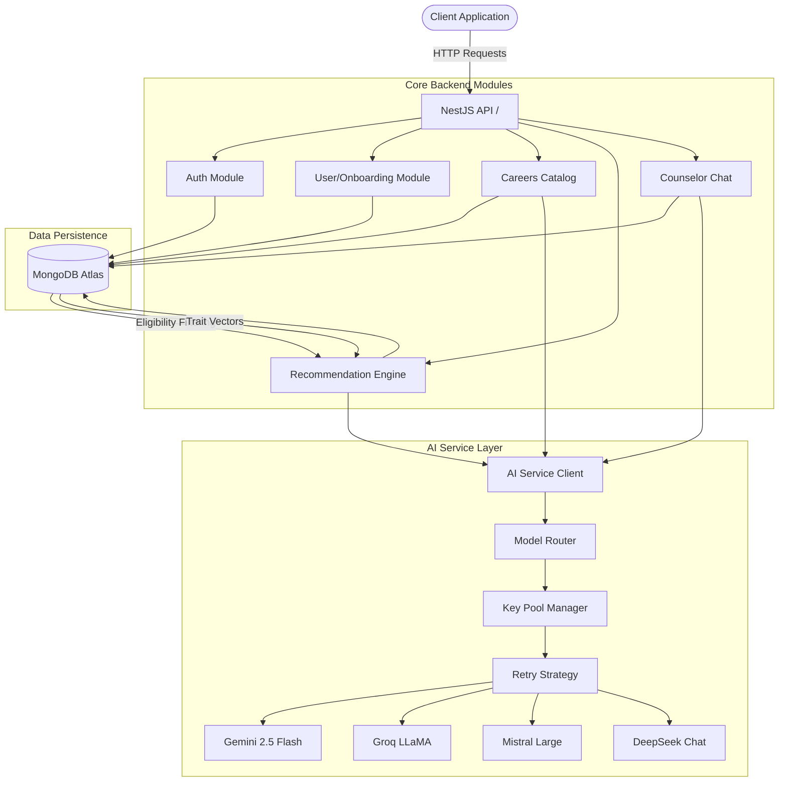

### 19.3 Root Files Analysis

#### `.dockerignore`
- **Size:** 29 bytes
- **Lines:** 5

#### `analyze.js`
- **Size:** 5183 bytes
- **Lines:** 129

#### `analyze_root.js`
- **Size:** 2018 bytes
- **Lines:** 52

#### `CAREER_IMPORT_PROGRESS.md`
- **Size:** 9189 bytes
- **Lines:** 207

#### `clean_analysis.js`
- **Size:** 446 bytes
- **Lines:** 12

#### `deep_analyze.js`
- **Size:** 4841 bytes
- **Lines:** 120

#### `docker-compose.yml`
- **Size:** 1067 bytes
- **Lines:** 54
- **Services:** services, mongo, ports, volumes, healthcheck, backend, build, ports, depends_on, mongo, healthcheck, env_file, environment, frontend, build, ports, depends_on, volumes, mongo-data

#### `ISSUES_LOG.md`
- **Size:** 14102 bytes
- **Lines:** 194

#### `recommendation-engine-v2-implementation-prompt.md`
- **Size:** 43515 bytes
- **Lines:** 723

#### `SCPR_Master_Career_Catalog_Part_1_Science_v2.md`
- **Size:** 5167 bytes
- **Lines:** 193

#### `SCPR_Master_Career_Catalog_Part_2_Commerce.md`
- **Size:** 5388 bytes
- **Lines:** 216

#### `SCPR_Master_Career_Catalog_Part_3_Arts_Humanities.md`
- **Size:** 4515 bytes
- **Lines:** 197

#### `SCPR_Master_Career_Catalog_Part_4_Diploma.md`
- **Size:** 6137 bytes
- **Lines:** 245

#### `SCPR_Master_Career_Catalog_Part_5_ITI_Polytechnic.md`
- **Size:** 4308 bytes
- **Lines:** 186

#### `SCPR_Master_Career_Catalog_Part_6_Vocational_Skill_Development.md`
- **Size:** 3948 bytes
- **Lines:** 165

#### `SCPR_Master_Career_Catalog_Part_7_Government_Defence.md`
- **Size:** 3471 bytes
- **Lines:** 178

#### `SCPR_Master_Career_Catalog_Part_8_Emerging_Future_Careers.md`
- **Size:** 5180 bytes
- **Lines:** 209

#### `start.bat`
- **Size:** 221 bytes
- **Lines:** 9

#### `WORKFLOW.md`
- **Size:** 35796 bytes
- **Lines:** 760


## 21. Deep Module-Level Inspection & Mermaid Flows

### 21.1 Backend Module: AUTH

#### Sub-Flow (Mermaid)
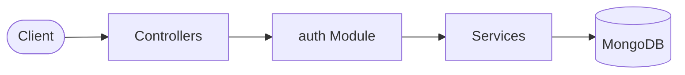

#### Files & Methods in auth

**File:** `backend\src\auth\auth.controller.ts`
- **Methods / Signatures:**
  - `@Controller('auth')`
  - `@Public()`
  - `@Post('register')`
  - `async register(@Body() dto: RegisterDto)`
  - `@Public()`
  - `@Post('login')`
  - `@HttpCode(HttpStatus.OK)`
  - `async login(@Body() dto: LoginDto)`
  - `@Public()`
  - `@Post('refresh')`
  - `@HttpCode(HttpStatus.OK)`
  - `async refresh(@Body('refresh_token') refreshToken: string)`
  - `@Post('logout')`
  - `@HttpCode(HttpStatus.OK)`
  - `async logout(@Request() req: any)`
  - `@Get('me')`
  - `async me(@Request() req: any)`

**File:** `backend\src\auth\auth.service.spec.ts`
- **Methods / Signatures:**
  - `const execMock = jest.fn();`
  - `const fn: any = function (this: any, data: any)`
  - `this.save = jest.fn().mockResolvedValue(undefined);`
  - `fn.findOne = jest.fn(() => (`
  - `sign: jest.fn().mockReturnValue('mock-token'),`
  - `password_hash: bcrypt.hashSync('password123', 10),`
  - `save: jest.fn().mockResolvedValue(undefined),`
  - `describe('AuthService', () =>`
  - `execMock.mockReset();`
  - `userModel = mockModel();`
  - `jwtService = mockJwt();`
  - `service = new AuthService(userModel, jwtService);`
  - `describe('register', () =>`
  - `it('throws ConflictException when email exists', async () =>`
  - `execMock.mockResolvedValue(makeUser());`
  - `await expect(service.register(`
  - `.rejects.toThrow(ConflictException);`
  - `execMock.mockResolvedValue(null);`
  - `const result = await service.register(`
  - `expect(result.email).toBe('new@t.com');`
  - `expect(result).not.toHaveProperty('password_hash');`
  - `describe('login', () =>`
  - `it('rejects unknown email', async () =>`
  - `execMock.mockResolvedValue(null);`
  - `await expect(service.login(`
  - `.rejects.toThrow(UnauthorizedException);`
  - `it('rejects locked account', async () =>`
  - `execMock.mockResolvedValue(makeUser(`
  - `await expect(service.login(`
  - `.rejects.toThrow(/Account is locked/);`
  - `it('locks after 5 failed attempts', async () =>`
  - `const user = makeUser(`
  - `execMock.mockResolvedValue(user);`
  - `await expect(service.login(`
  - `.rejects.toThrow(UnauthorizedException);`
  - `expect(user.failed_login_attempts).toBe(5);`
  - `expect(user.locked_until).toBeInstanceOf(Date);`
  - `const user = makeUser(`
  - `execMock.mockResolvedValue(user);`
  - `const result = await service.login(`
  - `expect(result.access_token).toBe('mock-token');`
  - `expect(result.user).toBeDefined();`
  - `expect(user.failed_login_attempts).toBe(0);`
  - `expect(user.locked_until).toBeUndefined();`
  - `describe('refresh', () =>`
  - `it('rejects invalid token', async () =>`
  - `await expect(service.refresh('bad')).rejects.toThrow(UnauthorizedException);`
  - `execMock.mockResolvedValue(makeUser());`
  - `const result = await service.refresh('good');`
  - `expect(result.access_token).toBe('mock-token');`
  - `describe('sanitizeUser', () =>`
  - `it('strips sensitive fields', () =>`
  - `const user = makeUser();`
  - `const s = service.sanitizeUser(user as any);`
  - `expect(s.user_id).toBe('mock-uuid');`
  - `expect(s).not.toHaveProperty('password_hash');`
  - `expect(s).not.toHaveProperty('failed_login_attempts');`
  - `expect(s).not.toHaveProperty('locked_until');`

**File:** `backend\src\auth\auth.service.ts`
- **Methods / Signatures:**
  - `@Injectable()`
  - `@InjectModel(User.name) private userModel: Model<User>,`
  - `async register(dto: RegisterDto)`
  - `const existing = await this.userModel.findOne(`
  - `throw new ConflictException('Email is already registered');`
  - `const salt = await bcrypt.genSalt(10);`
  - `const passwordHash = await bcrypt.hash(dto.password, salt);`
  - `const userId = randomUUID().replace(/-/g, ''); // Hyphen-stripped UUID`
  - `const user = new this.userModel(`
  - `email: dto.email.toLowerCase(),`
  - `await user.save();`
  - `async login(dto: LoginDto)`
  - `const user = await this.userModel.findOne(`
  - `throw new UnauthorizedException('Invalid credentials');`
  - `const waitTime = Math.ceil((user.locked_until.getTime() - Date.now()) / 1000 / 60);`
  - `throw new UnauthorizedException(`Account is locked. Try again in $`
  - `const passwordMatch = await bcrypt.compare(dto.password, user.password_hash);`
  - `user.locked_until = new Date(Date.now() + 15 * 60 * 1000); // 15 mins lock`
  - `await user.save();`
  - `throw new UnauthorizedException('Invalid credentials');`
  - `user.last_login = new Date();`
  - `await user.save();`
  - `const tokens = await this.generateTokens(user);`
  - `user: this.sanitizeUser(user),`
  - `async refresh(refreshToken: string)`
  - `const user = await this.userModel.findOne(`
  - `throw new UnauthorizedException('Invalid refresh token');`
  - `const tokens = await this.generateTokens(user);`
  - `throw new UnauthorizedException('Invalid or expired refresh token');`
  - `async logout(user: User)`
  - `private async generateTokens(user: User)`
  - `const accessToken = this.jwtService.sign(payload,`
  - `const refreshToken = this.jwtService.sign(payload,`
  - `sanitizeUser(user: User)`
  - `created_at: user.get('created_at'),`
  - `updated_at: user.get('updated_at'),`

**File:** `backend\src\auth\schemas\user.schema.ts`
- **Methods / Signatures:**
  - `@Schema(`
  - `@Prop(`
  - `@Prop(`
  - `@Prop(`
  - `@Prop(`
  - `@Prop(`
  - `@Prop(`
  - `@Prop(`
  - `@Prop(`
  - `@Prop(`
  - `@Prop(`
  - `export const UserSchema = SchemaFactory.createForClass(User);`

**File:** `backend\src\auth\dto\login.dto.ts`
- **Methods / Signatures:**
  - `@IsEmail(`
  - `@IsNotEmpty()`
  - `@IsString()`
  - `@IsNotEmpty()`

**File:** `backend\src\auth\dto\register.dto.ts`
- **Methods / Signatures:**
  - `@IsEmail(`
  - `@IsNotEmpty()`
  - `@IsString()`
  - `@IsNotEmpty()`
  - `@MinLength(6,`
  - `@IsString()`
  - `@IsNotEmpty()`

### 21.2 Backend Module: AI-SERVICE

#### Sub-Flow (Mermaid)
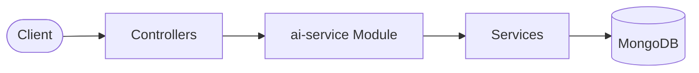

#### Files & Methods in ai-service

**File:** `backend\src\ai-service\ai-service.controller.ts`
- **Methods / Signatures:**
  - `@Controller('ai-service')`
  - `@Get('health')`
  - `@Public()`
  - `async getHealth()`
  - `const providers = Object.keys(this.providerEndpoints);`
  - `const results = await Promise.allSettled(`
  - `providers.map(async (name) =>`
  - `const keys = this.keyPoolService.getKeysForProvider(name);`
  - `const start = Date.now();`
  - `await axios.get(url,`
  - `statusMap[name] =`
  - `latency_ms: Date.now() - start,`
  - `healthCache =`

**File:** `backend\src\ai-service\cache.service.ts`
- **Methods / Signatures:**
  - `@Injectable()`
  - `private readonly logger = new Logger(CacheService.name);`
  - `this.ttlSeconds = parseInt(process.env.AI_SERVICE_CACHE_TTL_SECONDS || '3600');`
  - `generateKey(taskType: string, context: Record<string, any>): string`
  - `get(key: string): any | null`
  - `const entry = this.cache.get(key);`
  - `this.cache.delete(key);`
  - `this.logger.debug(`Cache key expired: $`
  - `set(key: string, value: any): void`
  - `const expiresAt = Date.now() + this.ttlSeconds * 1000;`
  - `this.cache.set(key,`
  - `this.logger.debug(`Cached key: $`
  - `clear(): void`
  - `this.cache.clear();`
  - `this.logger.log('AI Cache cleared');`

**File:** `backend\src\ai-service\json-validator.service.spec.ts`
- **Methods / Signatures:**
  - `const service = new JsonValidatorService();`
  - `describe('validate', () =>`
  - `describe.each(Object.entries(fixtures))('%s', (taskType, f) =>`
  - `it('accepts valid data', () =>`
  - `it('rejects missing required field', () =>`
  - `.toThrow(BadRequestException);`
  - `it('rejects wrong field type', () =>`
  - `.toThrow(BadRequestException);`
  - `describe('repair', () =>`
  - `it('strips ```json fences', () =>`
  - `it('removes trailing commas', () =>`
  - `const withTrailing = validStr.replace(/}$/, ',}');`
  - `expect(() => service.validateAndRepair(withTrailing, 'counselor_chat')).not.toThrow();`
  - `it('handles single-quoted keys', () =>`
  - `const singleQuoted = validStr.replace(/"/g, "'");`
  - `expect(() => service.validateAndRepair(singleQuoted, 'counselor_chat')).not.toThrow();`
  - `it('fails fast on truncated JSON', () =>`
  - `expect(() => service.validateAndRepair('`
  - `it('fails fast on non-JSON garbage', () =>`
  - `it('does not loop — single repair attempt', () =>`
  - `expect(() => service.validateAndRepair(unbalanced, 'counselor_chat')).toThrow(BadRequestException);`

**File:** `backend\src\ai-service\json-validator.service.ts`
- **Methods / Signatures:**
  - `@Injectable()`
  - `private readonly logger = new Logger(JsonValidatorService.name);`
  - `private readonly validators: Map<string, ValidateFunction> = new Map();`
  - `const ajv = new Ajv(`
  - `this.validators.set(taskType, ajv.compile(schema));`
  - `validate(taskType: string, data: unknown):`
  - `const validate = this.validators.get(taskType);`
  - `const valid = validate(data) as boolean;`
  - `validateAndRepair(rawText: string, taskType?: string): any`
  - `let text = rawText.trim();`
  - `const match = text.match(markdownRegex);`
  - `text = match[1].trim();`
  - `const firstBrace = text.indexOf('`
  - `const firstBracket = text.indexOf('[');`
  - `const lastIdx = text.lastIndexOf(endChar);`
  - `text = text.substring(startIdx, lastIdx + 1);`
  - `parsed = JSON.parse(text);`
  - `parsed = JSON.parse(this.repairJson(text));`
  - `this.logger.error(`JSON Parsing failed. Raw text: $`
  - `throw new BadRequestException('AI provider response is not valid JSON and could not be repaired');`
  - `const result = this.validate(taskType, parsed);`
  - `const messages = result.errors!.map(`
  - `throw new BadRequestException(`AI provider response failed schema validation: $`
  - `private repairJson(text: string): string`
  - `.replace(/(?<=[`
  - `.replace(/:\s*'([^']*?)'\s*([,}\]])/g, ': "$1"$2')`
  - `.replace(/,\s*([}\]])/g, '$1')`
  - `.replace(/\n/g, '\\n');`

**File:** `backend\src\ai-service\key-pool.service.ts`
- **Methods / Signatures:**
  - `@Injectable()`
  - `private readonly logger = new Logger(KeyPoolService.name);`
  - `this.loadKeysFromEnv();`
  - `private loadKeysFromEnv()`
  - `const envVarName = `$`
  - `.split(',')`
  - `.map((k) => k.trim())`
  - `.filter((k) => k.length > 0);`
  - `getKeysForProvider(provider: string): string[]`
  - `const name = provider.toLowerCase();`
  - `// Get the next key round-robin style (though the retry manager might iterate systematically)`
  - `getNextKey(provider: string):`
  - `const name = provider.toLowerCase();`

**File:** `backend\src\ai-service\prompt-builder.service.ts`
- **Methods / Signatures:**
  - `@Injectable()`
  - `private readonly logger = new Logger(PromptBuilderService.name);`
  - `private readonly promptsDir = path.join(__dirname, 'prompts');`
  - `async build(taskType: string, context: Record<string, any>): Promise<`
  - `const filename = `$`
  - `const filePath = path.join(this.promptsDir, filename);`
  - `const content = await fs.readFile(filePath, 'utf-8');`
  - `const sections = content.split('---');`
  - `promptBody = sections.slice(2).join('---').trim();`
  - `const systemMatch = frontmatter.match(/system_instruction:\s*([\s\S]*?)(?:\n\w+:|$)/);`
  - `systemInstruction = this.interpolate(systemMatch[1].trim(), context);`
  - `const finalPrompt = this.interpolate(promptBody, context);`
  - `throw new InternalServerErrorException(`Prompt template not found or invalid: $`
  - `private interpolate(template: string, context: Record<string, any>): string`
  - `const keys = key.split('.');`

**File:** `backend\src\ai-service\retry-manager.service.ts`
- **Methods / Signatures:**
  - `export const aiServiceEvents = new EventEmitter();`
  - `@Injectable()`
  - `private readonly logger = new Logger(RetryManagerService.name);`
  - `private isQuotaError(error?: string): boolean`
  - `const lower = error.toLowerCase();`
  - `lower.includes('insufficient_balance') ||`
  - `lower.includes('insufficient_quota') ||`
  - `lower.includes('quota exceeded') ||`
  - `lower.includes('rate limit') ||`
  - `lower.includes('429') ||`
  - `error.includes('402')`
  - `async executeWithFallback(`
  - `const startTime = Date.now();`
  - `this.logger.warn(`Provider adapter not found: $`
  - `const keys = this.keyPoolService.getKeysForProvider(route.provider);`
  - `aiServiceEvents.emit('AI_PROVIDER_FALLBACK_TRIGGERED',`
  - `timestamp: new Date().toISOString(),`
  - `const attemptStartTime = Date.now();`
  - `this.logger.log(`
  - `const response: ProviderResponse = await providerInstance.call(`
  - `const latency = Date.now() - attemptStartTime;`
  - `latency_ms: Date.now() - startTime,`
  - `this.logger.error(`
  - ``AI Call failed (provider=$`
  - `unhealthyReported.add(route.provider);`
  - `aiServiceEvents.emit('AI_PROVIDER_UNHEALTHY_DETECTED',`
  - `timestamp: new Date().toISOString(),`
  - `throw new HttpException(`
  - `timestamp: new Date().toISOString(),`

**File:** `backend\src\ai-service\router.service.ts`
- **Methods / Signatures:**
  - `@Injectable()`
  - `getRoute(taskType: string): RouteConfig[]`

**File:** `backend\src\ai-service\token-logger.service.ts`
- **Methods / Signatures:**
  - `@Injectable()`
  - `private readonly logger = new Logger(TokenLoggerService.name);`
  - `@InjectModel(AIRequestLog.name) private readonly logModel: Model<AIRequestLog>,`
  - `async log(logData:`
  - `const log = new this.logModel(logData);`
  - `await log.save();`
  - `this.logger.debug(`
  - `this.logger.error(`Failed to save AI log: $`

**File:** `backend\src\ai-service\ai-request-log.schema.ts`
- **Methods / Signatures:**
  - `@Schema(`
  - `@Prop(`
  - `@Prop(`
  - `@Prop(`
  - `@Prop(`
  - `@Prop(`
  - `@Prop(`
  - `@Prop(`
  - `@Prop(`
  - `@Prop(`
  - `export const AIRequestLogSchema: MongooseSchema = SchemaFactory.createForClass(AIRequestLog);`

**File:** `backend\src\ai-service\schemas\json-schemas\career-recommendation.schema.ts`

**File:** `backend\src\ai-service\schemas\json-schemas\career-trait-backfill.schema.ts`

**File:** `backend\src\ai-service\schemas\json-schemas\counselor-chat.schema.ts`

**File:** `backend\src\ai-service\schemas\json-schemas\report-summary.schema.ts`

**File:** `backend\src\ai-service\schemas\json-schemas\roadmap-generation.schema.ts`

**File:** `backend\src\ai-service\schemas\json-schemas\scenario-generation.schema.ts`

### 21.3 Backend Module: ANALYTICS

#### Sub-Flow (Mermaid)
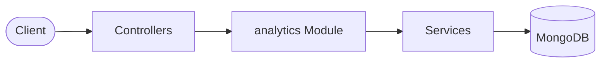

#### Files & Methods in analytics

**File:** `backend\src\analytics\analytics.controller.ts`
- **Methods / Signatures:**
  - `@Controller('analytics')`
  - `@Get('me')`
  - `async getMyAnalytics(@Request() req: any)`
  - `@Get('careers')`
  - `async getCareersStats()`
  - `@Get('ai')`
  - `async getAIStats()`
  - `@Post('event')`
  - `@HttpCode(HttpStatus.OK)`
  - `async logCustomEvent(`
  - `@Request() req: any,`
  - `@Body() body:`
  - `await this.analyticsService.trackEvent(userId, body.event_type, body.payload);`

**File:** `backend\src\analytics\analytics.service.ts`
- **Methods / Signatures:**
  - `@Injectable()`
  - `private readonly logger = new Logger(AnalyticsService.name);`
  - `@InjectModel(AnalyticsEvent.name)`
  - `@InjectModel(AIRequestLog.name)`
  - `@InjectModel(SavedCareer.name)`
  - `onModuleInit()`
  - `this.logger.log('Initializing Analytics Event Listeners...');`
  - `onboardingEvents.on('ONBOARDING_STARTED', async (data) =>`
  - `await this.trackEvent(data.user_id, 'ONBOARDING_STARTED', data);`
  - `onboardingEvents.on('ONBOARDING_STEP_COMPLETED', async (data) =>`
  - `await this.trackEvent(data.user_id, 'ONBOARDING_STEP_COMPLETED', data);`
  - `onboardingEvents.on('ONBOARDING_COMPLETED', async (data) =>`
  - `await this.trackEvent(data.user_id, 'ONBOARDING_COMPLETED', data);`
  - `aiServiceEvents.on('AI_PROVIDER_FALLBACK_TRIGGERED', async (data) =>`
  - `await this.trackEvent(data.user_id || 'system', 'AI_PROVIDER_FALLBACK_TRIGGERED', data);`
  - `aiServiceEvents.on('AI_PROVIDER_UNHEALTHY_DETECTED', async (data) =>`
  - `await this.trackEvent('system', 'AI_PROVIDER_UNHEALTHY_DETECTED', data);`
  - `const event = new this.eventModel(`
  - `await event.save();`
  - `this.logger.error(`[Analytics Failure Swallowed] Failed to track event $`
  - `async getUserEvents(userId: string): Promise<AnalyticsEvent[]>`
  - `const stats = await this.eventModel.aggregate([`
  - `]).exec();`
  - `async getCareersStats()`
  - `const savedCount = await this.savedCareerModel.countDocuments().exec();`
  - `const topSaved = await this.savedCareerModel.aggregate([`
  - `]).exec();`
  - `top_bookmarked_careers: topSaved.map((t) => (`
  - `async getAIStats()`
  - `const totalRequests = await this.aiLogModel.countDocuments().exec();`
  - `const aggregateData = await this.aiLogModel.aggregate([`
  - `]).exec();`
  - `.find(`
  - `.sort(`
  - `.limit(10)`
  - `.lean()`
  - `.exec();`
  - `average_latency_ms: Math.round(stats.avg_latency),`
  - `success_rate_percentage: Math.round(successRate * 10) / 10,`
  - `fallback_escalation_rate_percentage: Math.round(fallbackRate * 10) / 10,`
  - `recent_provider_issues: unhealthyEvents.map((e: any) => (`

**File:** `backend\src\analytics\schemas\analytics-event.schema.ts`
- **Methods / Signatures:**
  - `@Schema(`
  - `@Prop(`
  - `@Prop(`
  - `@Prop(`
  - `export const AnalyticsEventSchema: MongooseSchema = SchemaFactory.createForClass(AnalyticsEvent);`

### 21.4 Backend Module: CAREERS

#### Sub-Flow (Mermaid)
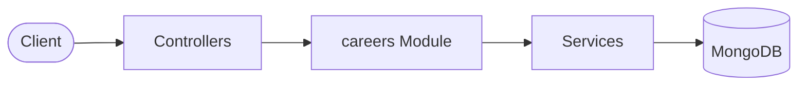

#### Files & Methods in careers

**File:** `backend\src\careers\careers.controller.ts`
- **Methods / Signatures:**
  - `@Controller('careers')`
  - `@Public()`
  - `@Get()`
  - `async getCareers(`
  - `@Query('category') category?: string,`
  - `@Query('search') search?: string,`
  - `@Public()`
  - `@Get('categories')`
  - `async getCategories()`
  - `@Public()`
  - `@Get('by-codes')`
  - `async getCareersByCodes(@Query('codes') codesString?: string)`
  - `const codes = codesString ? codesString.split(',').map((c) => c.trim()) : [];`
  - `@Public()`
  - `@Get('related/:careerCode')`
  - `async getRelated(@Param('careerCode') careerCode: string)`
  - `@Public()`
  - `@Get(':careerCode')`
  - `async getOne(@Param('careerCode') careerCode: string)`
  - `// Saved / bookmarked careers (requires authentication)`
  - `@Post('save')`
  - `async saveCareer(@Request() req: any, @Body('career_code') careerCode: string)`
  - `@Delete('save/:careerCode')`
  - `async unsaveCareer(@Request() req: any, @Param('careerCode') careerCode: string)`
  - `@Get('saved')`
  - `async getSaved(@Request() req: any)`
  - `@Get('saved/status/:careerCode')`
  - `async getSavedStatus(@Request() req: any, @Param('careerCode') careerCode: string)`
  - `// ============ Admin Endpoints (Phase 10) ============`
  - `private checkAdminRole(user: any)`
  - `@Get('admin/careers')`
  - `async adminListCareers(`
  - `@Request() req: any,`
  - `@Query('page') page?: string,`
  - `@Query('limit') limit?: string,`
  - `@Query('category_code') categoryCode?: string,`
  - `@Query('backfill_status') backfillStatus?: string,`
  - `@Query('needs_enrichment') needsEnrichment?: string,`
  - `@Query('is_active') isActive?: string,`
  - `@Query('search') search?: string,`
  - `@Query('sort_by') sortBy?: string,`
  - `@Query('sort_order') sortOrder?: string,`
  - `this.checkAdminRole(req.user);`
  - `page: page ? parseInt(page, 10) : 1,`
  - `limit: limit ? parseInt(limit, 10) : 50,`
  - `const ne = (needsEnrichment || '').toLowerCase();`
  - `@Get('admin/careers/:careerCode')`
  - `async adminGetCareer(@Request() req: any, @Param('careerCode') careerCode: string)`
  - `this.checkAdminRole(req.user);`
  - `@Put('admin/careers/:careerCode')`
  - `async adminUpdateCareer(`
  - `@Request() req: any,`
  - `@Param('careerCode') careerCode: string,`
  - `@Body() body: any,`
  - `this.checkAdminRole(req.user);`
  - `@Post('admin/careers/:careerCode/publish-draft')`
  - `async adminPublishDraft(@Request() req: any, @Param('careerCode') careerCode: string)`
  - `this.checkAdminRole(req.user);`
  - `@Post('admin/careers/:careerCode/reject-draft')`
  - `async adminRejectDraft(@Request() req: any, @Param('careerCode') careerCode: string)`
  - `this.checkAdminRole(req.user);`
  - `@Post('admin/careers/bulk-publish')`
  - `async adminBulkPublish(`
  - `@Request() req: any,`
  - `@Body() body:`
  - `this.checkAdminRole(req.user);`
  - `@Get('admin/careers/import-audit')`
  - `async adminGetImportAudit(@Request() req: any)`
  - `this.checkAdminRole(req.user);`
  - `@Patch('admin/careers/:careerCode/toggle-active')`
  - `async adminToggleActive(@Request() req: any, @Param('careerCode') careerCode: string)`
  - `this.checkAdminRole(req.user);`

**File:** `backend\src\careers\careers.service.ts`
- **Methods / Signatures:**
  - `@Injectable()`
  - `private readonly logger = new Logger(CareersService.name);`
  - `@InjectModel(Career.name) private readonly careerModel: Model<CareerDocument>,`
  - `@InjectModel(SavedCareer.name) private readonly savedCareerModel: Model<SavedCareerDocument>,`
  - `async onModuleInit()`
  - `await this.seedCareers();`
  - `private async seedCareers()`
  - `const sample = await this.careerModel.findOne().exec();`
  - `this.logger.log('Detected placeholder seed. Re-seeding with realistic weights...');`
  - `await this.careerModel.deleteMany(`
  - `const oldCategoryCount = await this.careerModel.countDocuments(`
  - `this.logger.log('Detected old seed. Re-seeding...');`
  - `await this.careerModel.deleteMany(`
  - `const count = await this.careerModel.countDocuments().exec();`
  - `this.logger.log('Careers catalog already seeded with weights.');`
  - `this.logger.log('Seeding 40 careers into database with realistic weights...');`
  - `const careersSeed = this.getCareersSeedData();`
  - `await this.careerModel.insertMany(careersSeed);`
  - `this.logger.log('Seeding completed successfully!');`
  - `this.logger.error(`Seeding failed: $`
  - `async findAll(category?: string, search?: string)`
  - `async findCategories()`
  - `async findOne(careerCode: string)`
  - `const career = await this.careerModel.findOne(`
  - `throw new NotFoundException(`Career with code $`
  - `async findRelated(careerCode: string)`
  - `const career = await this.findOne(careerCode);`
  - `.find(`
  - `.limit(5)`
  - `.exec();`
  - `async findByCodes(codes: string[])`
  - `async saveCareer(userId: string, careerCode: string)`
  - `await this.findOne(careerCode);`
  - `.findOne(`
  - `.exec();`
  - `const saved = new this.savedCareerModel(`
  - `await saved.save();`
  - `async unsaveCareer(userId: string, careerCode: string)`
  - `await this.savedCareerModel.deleteOne(`
  - `async getSavedCareers(userId: string)`
  - `const saved = await this.savedCareerModel.find(`
  - `const codes = saved.map((s) => s.career_code);`
  - `async getSavedStatus(userId: string, careerCode: string)`
  - `.findOne(`
  - `.exec();`
  - `async create(dto: CreateCareerDto)`
  - `const existing = await this.careerModel.findOne(`
  - `throw new ConflictException(`Career with code $`
  - `const newCareer = new this.careerModel(dto);`
  - `async update(careerCode: string, dto: UpdateCareerDto)`
  - `.findOneAndUpdate(`
  - `.exec();`
  - `throw new NotFoundException(`Career with code $`
  - `async delete(careerCode: string)`
  - `const result = await this.careerModel.deleteOne(`
  - `throw new NotFoundException(`Career with code $`
  - `async backfillTraitWeightsForAllCareers()`
  - `const careers = await this.careerModel.find().exec();`
  - `const response = await this.aiServiceClient.run(`
  - `await career.save();`
  - `async promoteDraft(careerCode: string, approve: boolean)`
  - `const career = await this.findOne(careerCode);`
  - `await career.save();`
  - `async adminFindAll(filters:`
  - `const total = await this.careerModel.countDocuments(query).exec();`
  - `.find(query)`
  - `.sort(`
  - `.skip((filters.page - 1) * filters.limit)`
  - `.limit(filters.limit)`
  - `.exec();`
  - `total_pages: Math.ceil(total / filters.limit),`
  - `async adminFindOne(careerCode: string)`
  - `const career = await this.findOne(careerCode);`
  - `...career.toObject(),`
  - `async adminUpdate(careerCode: string, updates: Record<string, any>)`
  - `const career = await this.findOne(careerCode);`
  - `await career.save();`
  - `async adminPublishDraft(careerCode: string)`
  - `const career = await this.findOne(careerCode);`
  - `await career.save();`
  - `async adminRejectDraft(careerCode: string)`
  - `const career = await this.findOne(careerCode);`
  - `await career.save();`
  - `async adminBulkPublish(filter: Record<string, any>)`
  - `const careers = await this.careerModel.find(query).exec();`
  - `await career.save();`
  - `async adminGetImportAudit()`
  - `const total = await this.careerModel.countDocuments().exec();`
  - `const byCategory = await this.careerModel.aggregate([`
  - `]).exec();`
  - `const byBackfillStatus = await this.careerModel.aggregate([`
  - `]).exec();`
  - `const bySubDomain = await this.careerModel.aggregate([`
  - `]).exec();`
  - `const enrichmentCount = await this.careerModel.countDocuments(`
  - `const backfillAwaitingReview = await this.careerModel.countDocuments(`
  - `}).exec();`
  - `async adminToggleActive(careerCode: string)`
  - `const career = await this.findOne(careerCode);`
  - `await career.save();`
  - `private getCareersSeedData(): Partial<Career>[]`
  - `trait_weights: makeWeights(`
  - `eligibility: makeEligibility(`
  - `trait_weights: makeWeights(`
  - `eligibility: makeEligibility(`
  - `trait_weights: makeWeights(`
  - `eligibility: makeEligibility(`
  - `trait_weights: makeWeights(`
  - `eligibility: makeEligibility(`
  - `trait_weights: makeWeights(`
  - `eligibility: makeEligibility(`
  - `trait_weights: makeWeights(`
  - `eligibility: makeEligibility(`
  - `trait_weights: makeWeights(`
  - `eligibility: makeEligibility(`
  - `trait_weights: makeWeights(`
  - `eligibility: makeEligibility(`
  - `trait_weights: makeWeights(`
  - `eligibility: makeEligibility(`
  - `trait_weights: makeWeights(`
  - `eligibility: makeEligibility(`
  - `trait_weights: makeWeights(`
  - `eligibility: makeEligibility(`
  - `trait_weights: makeWeights(`
  - `eligibility: makeEligibility(`
  - `trait_weights: makeWeights(`
  - `eligibility: makeEligibility(`
  - `trait_weights: makeWeights(`
  - `eligibility: makeEligibility(`
  - `trait_weights: makeWeights(`
  - `eligibility: makeEligibility(`
  - `trait_weights: makeWeights(`
  - `eligibility: makeEligibility(`
  - `trait_weights: makeWeights(`
  - `eligibility: makeEligibility(`
  - `trait_weights: makeWeights(`
  - `eligibility: makeEligibility(`
  - `trait_weights: makeWeights(`
  - `eligibility: makeEligibility(`
  - `trait_weights: makeWeights(`
  - `eligibility: makeEligibility(`
  - `trait_weights: makeWeights(`
  - `eligibility: makeEligibility(`
  - `trait_weights: makeWeights(`
  - `eligibility: makeEligibility(`
  - `trait_weights: makeWeights(`
  - `eligibility: makeEligibility(`
  - `trait_weights: makeWeights(`
  - `eligibility: makeEligibility(`
  - `trait_weights: makeWeights(`
  - `eligibility: makeEligibility(`
  - `trait_weights: makeWeights(`
  - `eligibility: makeEligibility(`
  - `trait_weights: makeWeights(`
  - `eligibility: makeEligibility(`
  - `trait_weights: makeWeights(`
  - `eligibility: makeEligibility(`
  - `trait_weights: makeWeights(`
  - `eligibility: makeEligibility(`
  - `trait_weights: makeWeights(`
  - `eligibility: makeEligibility(`
  - `trait_weights: makeWeights(`
  - `eligibility: makeEligibility(`
  - `trait_weights: makeWeights(`
  - `eligibility: makeEligibility(`
  - `trait_weights: makeWeights(`
  - `eligibility: makeEligibility(`
  - `trait_weights: makeWeights(`
  - `eligibility: makeEligibility(`
  - `trait_weights: makeWeights(`
  - `eligibility: makeEligibility(`
  - `trait_weights: makeWeights(`
  - `eligibility: makeEligibility(`
  - `trait_weights: makeWeights(`
  - `eligibility: makeEligibility(`
  - `trait_weights: makeWeights(`
  - `eligibility: makeEligibility(`
  - `trait_weights: makeWeights(`
  - `eligibility: makeEligibility(`
  - `trait_weights: makeWeights(`
  - `eligibility: makeEligibility(`

**File:** `backend\src\careers\import\seed.service.ts`
- **Methods / Signatures:**
  - `@Injectable()`
  - `private readonly logger = new Logger(CareerSeedService.name);`
  - `@InjectModel(Career.name) private readonly careerModel: Model<CareerDocument>,`
  - `async seedFromCatalog(filePath: string, catalogPart: string): Promise<SeedPhaseResult>`
  - `throw new Error(`Unknown catalog part: $`
  - `const resolvedPath = path.resolve(filePath);`
  - `content = await fs.readFile(resolvedPath, 'utf-8');`
  - `throw new Error(`Failed to read catalog file at $`
  - `const`
  - `timestamp: new Date().toISOString(),`
  - `this.logger.log(`Parsed $`
  - `// Handle Part 5 (ITI/Polytechnic) cross-linking: Polytechnic subtree has degree names only`
  - `const polytechnicLeaves = leaves.filter(l => l.sub_domain_source === 'Polytechnic');`
  - `this.logger.log(`Cross-linking $`
  - `const count = await this.careerModel.countDocuments(`
  - `}).exec();`
  - `await this.careerModel.updateMany(`
  - `).exec();`
  - `const careerLeaves = leaves.filter(l => l.sub_domain_source !== 'Polytechnic');`
  - `const rawSubDomain = computeSubDomainCode(leaf.sub_domain_source);`
  - `// For parenthetical codes like "Company Secretary (CS)", also try the inner code "cs"`
  - `const parenMatch = leaf.sub_domain_source.match(/\(([^)]+)\)/);`
  - `const subDomainCode = isValidSubDomain(categoryCode, rawSubDomain)`
  - `: (innerCode && isValidSubDomain(categoryCode, innerCode))`
  - `: isValidSubDomain(categoryCode, prefixedSubDomain)`
  - `const existing = await this.careerModel.findOne(`
  - `// Merge pathway tags using $addToSet with $each (avoids overwrite in loop)`
  - `await this.careerModel.updateOne(`
  - `const traitWeights = computeTraitWeights(categoryCode, leaf.name);`
  - `const`
  - `// Detect broad-degree leaves (Section 3.2 heuristic)`
  - `const nameLower = leaf.name.toLowerCase();`
  - `const isBroadDegree = broadDegreeKeywords.some(kw => nameLower.includes(kw));`
  - `const newCareer = new this.careerModel(`
  - `imported_at: new Date(),`
  - `await newCareer.save();`
  - `this.logger.log(`Inserted $`
  - `this.logger.log(`Merged $`
  - `timestamp: new Date().toISOString(),`

**File:** `backend\src\careers\import\tree-parser.service.ts`
- **Methods / Signatures:**
  - `/** The immediate parent (depth-1) node text — used to derive sub_domain_code */`
  - `.toLowerCase()`
  - `.trim()`
  - `.replace(/[^a-z0-9_ ]/g, '')   // strip punctuation but keep spaces and underscores`
  - `.replace(/\s+/g, '_')           // spaces to underscores`
  - `.replace(/_+/g, '_')            // collapse multiple underscores`
  - `.replace(/^_|_$/g, '');         // trim leading/trailing underscores`
  - `* Extract the fenced code block (```text ... ```) from catalog markdown.`
  - `export function extractFencedBlock(content: string): string | null`
  - `// Match ```text or ``` text (with/without space)`
  - `const match = content.match(/```\s*text\s*\n([\s\S]*?)\n```/);`
  - `* - Depth 0: marker is at column 0 (e.g. `├── Science (PCM)`)`
  - `* - Depth 1: marker is at column ~4 (e.g. `│   ├── Engineering`)`
  - `* - Depth 2: marker is at column ~8 (e.g. `│   │   ├── Computer Science`)`
  - `export function parseTreeLine(line: string):`
  - `const trimmed = line.trimEnd();`
  - `// Match: any leading indent (spaces and │ chars), then the ├──/└── marker, then text`
  - `const treeMatch = trimmed.match(/^([ │]*?)([├└]──)\s+(.+)$/);`
  - `const text = treeMatch[3].trim();`
  - `// Depth = column position of the marker divided by indent width (4 chars per level)`
  - `const depth = Math.round(markerColumn / 4);`
  - `export function parseTreeToLeaves(treeContent: string): ParsedCareerLeaf[]`
  - `const lines = treeContent.split('\n');`
  - `const overviewIndices: Set<number> = new Set();`
  - `const parsed = parseTreeLine(line);`
  - `nodes.push(parsed);`
  - `while (parentStack.length > 0 && nodes[parentStack[parentStack.length - 1]].depth >= node.depth)`
  - `parentStack.pop();`
  - `parentStack.push(i);`
  - `while (ancestor >= 0)`
  - `overviewIndices.add(j);`
  - `// Determine which nodes are leaves (have no children at a deeper depth)`
  - `const isLeaf: boolean[] = new Array(nodes.length).fill(true);`
  - `while (parentIdx >= 0)`
  - `while (pathIdx >= 0 && pathIdx !== subDomainAncestor)`
  - `leaves.push(`
  - `* Parse a complete catalog file (markdown with fenced ASCII tree).`
  - `export function parseCatalogFile(`
  - `const treeBlock = extractFencedBlock(content);`
  - `const leaves = parseTreeToLeaves(treeBlock);`
  - `const lines = treeBlock.split('\n');`
  - `const parsed = parseTreeLine(line);`
  - `* This converts e.g. "Science (PCM)" -> "science_pcm", "Commerce (B.Com)" -> "b_com"`
  - `export function computeSubDomainCode(subDomainSource: string): string`
  - `const parenMatch = subDomainSource.match(/\(([^)]+)\)/);`
  - `const inner = parenMatch[1].trim();`
  - `// e.g. "Science (PCM)" -> "science_pcm"`

**File:** `backend\src\careers\schemas\career.schema.ts`
- **Methods / Signatures:**
  - `@Schema(`
  - `@Prop(`
  - `@Prop(`
  - `@Prop(`
  - `@Prop(`
  - `@Prop(`
  - `@Prop(`
  - `@Prop(`
  - `@Prop(`
  - `@Prop(`
  - `@Prop(`
  - `export const CareerTraitProfileSchema = SchemaFactory.createForClass(CareerTraitProfile);`
  - `@Schema(`
  - `@Prop(`
  - `@Prop(`
  - `@Prop(`
  - `@Prop(`
  - `@Prop(`
  - `@Prop(`
  - `@Prop(`
  - `@Prop(`
  - `@Prop(`
  - `export const CareerConstraintsSchema = SchemaFactory.createForClass(CareerConstraints);`
  - `@Schema(`
  - `@Prop(`
  - `@Prop(`
  - `@Prop(`
  - `@Prop(`
  - `@Prop(`
  - `@Prop(`
  - `@Prop(`
  - `@Prop(`
  - `@Prop(`
  - `@Prop(`
  - `@Prop(`
  - `@Prop(`
  - `@Prop(`
  - `@Prop(`
  - `// === IMPORT-RELATED FIELDS (added in Phase 0) ===`
  - `@Prop(`
  - `@Prop(`
  - `@Prop(`
  - `@Prop(`
  - `@Prop(`
  - `@Prop(`
  - `@Prop(`
  - `export const CareerSchema: MongooseSchema = SchemaFactory.createForClass(Career);`

**File:** `backend\src\careers\schemas\saved-career.schema.ts`
- **Methods / Signatures:**
  - `@Schema(`
  - `@Prop(`
  - `@Prop(`
  - `export const SavedCareerSchema: MongooseSchema = SchemaFactory.createForClass(SavedCareer);`

**File:** `backend\src\careers\dto\career.dto.ts`
- **Methods / Signatures:**
  - `@IsString()`
  - `@IsNotEmpty()`
  - `@IsString()`
  - `@IsNotEmpty()`
  - `@IsString()`
  - `@IsNotEmpty()`
  - `@IsString()`
  - `@IsNotEmpty()`
  - `@IsArray()`
  - `@IsString(`
  - `@IsOptional()`
  - `@IsArray()`
  - `@IsString(`
  - `@IsOptional()`
  - `@IsArray()`
  - `@IsString(`
  - `@IsOptional()`
  - `@IsString()`
  - `@IsOptional()`
  - `@IsString()`
  - `@IsOptional()`
  - `@IsString()`
  - `@IsOptional()`
  - `@IsString()`
  - `@IsOptional()`
  - `@IsString()`
  - `@IsOptional()`
  - `@IsString()`
  - `@IsOptional()`
  - `@IsArray()`
  - `@IsString(`
  - `@IsOptional()`
  - `@IsArray()`
  - `@IsString(`
  - `@IsOptional()`
  - `@IsArray()`
  - `@IsString(`
  - `@IsOptional()`
  - `@IsString()`
  - `@IsOptional()`
  - `@IsString()`
  - `@IsOptional()`
  - `@IsString()`
  - `@IsOptional()`
  - `@IsBoolean()`

### 21.5 Backend Module: COMMON

#### Sub-Flow (Mermaid)
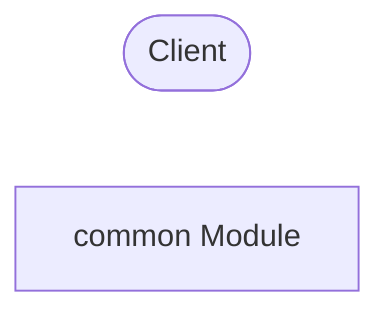

#### Files & Methods in common

### 21.6 Backend Module: COUNSELOR

#### Sub-Flow (Mermaid)
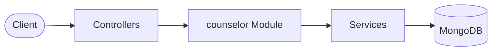

#### Files & Methods in counselor

**File:** `backend\src\counselor\counselor.controller.ts`
- **Methods / Signatures:**
  - `@Controller('counselor')`
  - `@Post('chat')`
  - `@HttpCode(HttpStatus.OK)`
  - `async chat(@Request() req: any, @Body() dto: ChatDto)`
  - `const session = await this.counselorService.startSession(userId,`
  - `conversationId = String(session._id);`
  - `@Get('conversations')`
  - `async getConversations(@Request() req: any)`
  - `@Get('conversations/:id')`
  - `async getHistory(@Request() req: any, @Param('id') id: string)`
  - `@Post('feedback')`
  - `@HttpCode(HttpStatus.OK)`
  - `async feedback(@Request() req: any, @Body() dto: FeedbackDto)`
  - `@Post('regenerate')`
  - `@HttpCode(HttpStatus.OK)`
  - `async regenerate(@Request() req: any, @Body() dto: RegenerateDto)`
  - `const history = await this.counselorService.getSessionHistory(userId, dto.conversation_id);`
  - `const studentMessages = history.filter((m) => m.role === 'student' || m.role === 'user');`
  - `throw new Error('No user messages found in this conversation history to regenerate');`
  - `const`
  - `const`
  - `// To keep controller thin, let's just send the last message text again (it will log a new message)`

**File:** `backend\src\counselor\context-builder.service.ts`
- **Methods / Signatures:**
  - `@Injectable()`
  - `private readonly logger = new Logger(ContextBuilderService.name);`
  - `@InjectModel(Conversation.name)`
  - `async buildContext(`
  - `this.logger.log(`Conversation messages length ($`
  - `const messagesToSummarize = messages.slice(0, messages.length - 4);`
  - `const remainingMessages = messages.slice(messages.length - 4);`
  - `.map((m) => `$`
  - `.join('\n');`
  - `const summaryPrompt = `Existing Summary: $`
  - `const summaryResponse = await this.aiServiceClient.run('report_summary',`
  - `await conversation.save();`
  - `this.logger.error(`Failed to compress conversation history: $`
  - `.map((m) => `$`
  - `.join('\n');`
  - `- Academic: Class 10 Status: $`
  - `- Top Interests: $`
  - `.filter(([_, val]) => val >= 70)`
  - `.map(([key, val]) => `$`
  - `.join(', ') || 'None'}`
  - `- Top Skills: $`
  - `.filter(([_, val]) => val >= 4)`
  - `.map(([key, val]) => `$`
  - `.join(', ') || 'None'}`
  - `- Top Goals: $`
  - ``.trim();`
  - `candidate_careers: '', // to be populated by caller (counselor service) with actual career lists`

**File:** `backend\src\counselor\counselor.service.spec.ts`
- **Methods / Signatures:**
  - `const exec = jest.fn();`
  - `const fn: any = function (this: any, data: any)`
  - `Object.assign(this, data);`
  - `this.save = jest.fn().mockResolvedValue(undefined);`
  - `fn.findOne = jest.fn(() => query);`
  - `fn.findById = jest.fn(() => query);`
  - `fn.find = jest.fn(() => query);`
  - `const module = await Test.createTestingModule(`
  - `}).compile();`
  - `describe('applySafetyFilter', () =>`
  - `const module = await Test.createTestingModule(`
  - `}).compile();`
  - `const srv = module.get(CounselorService);`
  - `filter = (t: string) => (srv as any).applySafetyFilter(t);`
  - `logWarn = jest.spyOn((srv as any).logger, 'warn').mockImplementation(() =>`
  - `afterAll(() => logWarn.mockRestore());`
  - `it('replaces "hack"', () => expect(filter('hack the system')).toBe('*** the system'));`
  - `it('replaces "kill"', () => expect(filter('this will kill')).toBe('this will ***'));`
  - `it('replaces "suicide"', () => expect(filter('suicide is not')).toBe('*** is not'));`
  - `it('replaces "bomb"', () => expect(filter('make a bomb')).toBe('make a ***'));`
  - `it('case-insensitive', () => expect(filter('HACK')).toBe('***'));`
  - `it('passes clean text', () => expect(filter('What careers?')).toBe('What careers?'));`
  - `it('logs warning on blocklist hit', () =>`
  - `describe('sendMessage', () =>`
  - `const convModel = makeModel();`
  - `const msgModel = makeModel();`
  - `const profModel = makeModel();`
  - `const recModel = makeModel();`
  - `const careModel = makeModel();`
  - `conv: convModel.findById()!.exec,`
  - `msg: msgModel.find()!.exec,`
  - `prof: profModel.findOne()!.exec,`
  - `rec: recModel.findOne()!.exec,`
  - `care: careModel.find()!.exec,`
  - `execs.conv.mockResolvedValue(`
  - `execs.prof.mockResolvedValue(`
  - `// trace: findOne -> sort -> exec finds rec (null = fallback to top seeding)`
  - `execs.rec.mockResolvedValue(null);`
  - `execs.care.mockResolvedValue([]);`
  - `execs.msg.mockResolvedValue([]);`
  - `const module = await Test.createTestingModule(`
  - `}).compile();`
  - `service = module.get(CounselorService);`
  - `it('rejects unauthorized session', async () =>`
  - `await expect(service.sendMessage('other', 'sid', 'Hi')).rejects.toThrow(NotFoundException);`
  - `const result = await service.sendMessage('user-1', 'sid', 'Hi');`
  - `expect(result.role).toBe('counselor');`
  - `expect(result.content).toBe('Hello there');`

**File:** `backend\src\counselor\counselor.service.ts`
- **Methods / Signatures:**
  - `@Injectable()`
  - `private readonly logger = new Logger(CounselorService.name);`
  - `@InjectModel(Conversation.name)`
  - `@InjectModel(ConversationMessage.name)`
  - `@InjectModel(StudentProfile.name)`
  - `@InjectModel(Recommendation.name)`
  - `@InjectModel(Career.name)`
  - `async startSession(userId: string, dto: StartSessionDto): Promise<ConversationDocument>`
  - `? await this.recommendationModel.findById(dto.recommendation_id).exec()`
  - `: await this.recommendationModel.findOne(`
  - `const conversation = new this.conversationModel(`
  - `await conversation.save();`
  - `const message = new this.messageModel(`
  - `conversation_id: String(conversation._id),`
  - `await message.save();`
  - `async getSessions(userId: string): Promise<Conversation[]>`
  - `async getSessionHistory(userId: string, sessionId: string): Promise<ConversationMessage[]>`
  - `const conversation = await this.conversationModel.findById(sessionId).exec();`
  - `throw new NotFoundException('Conversation not found or unauthorized');`
  - `const conversation = await this.conversationModel.findById(sessionId).exec();`
  - `throw new NotFoundException('Conversation not found or unauthorized');`
  - `const userMessage = new this.messageModel(`
  - `await userMessage.save();`
  - `conversation.set('last_message_at', new Date());`
  - `await conversation.save();`
  - `const profile = await this.profileModel.findOne(`
  - `throw new BadRequestException('Student profile not found. Please complete onboarding first.');`
  - `.findOne(`
  - `.sort(`
  - `.exec();`
  - `const careerCodes = latestRec.shortlist.map((c) => c.career_code);`
  - `const careers = await this.careerModel.find(`
  - `candidateCareersList = careers.map(`
  - `const careers = await this.careerModel.find().limit(20).exec();`
  - `candidateCareersList = careers.map(`
  - `.find(`
  - `.sort(`
  - `.exec();`
  - `const aiContext = await this.contextBuilder.buildContext(`
  - `aiContext.candidate_careers = candidateCareersList.join('\n');`
  - `// 5. Call AI Service Client (routed to Groq/Mistral)`
  - `const aiResponse = await this.aiServiceClient.run(`
  - `throw new BadRequestException('AI Counselor failed to respond.');`
  - `replyText = this.buildRoadmapReply(aiResponse.data);`
  - `replyText = this.applySafetyFilter(replyText);`
  - `const counselorMessage = new this.messageModel(`
  - `await counselorMessage.save();`
  - `private buildRoadmapReply(data: any): string`
  - `md += `**Skills to Build:** $`
  - `md += `**Entrance Exams:** $`
  - `const mermaidSyntax = this.buildMermaidSyntax(data.mermaid?.nodes, data.mermaid?.edges);`
  - `private buildMermaidSyntax(nodes:`
  - `const nodeMap = new Map(nodes.map(n => [n.id, n]));`
  - `lines.push(`  $`
  - `lines.push(`  $`
  - `const lower = text.toLowerCase();`
  - `private applySafetyFilter(text: string): string`
  - `const regex = new RegExp(`\\b$`
  - `this.logger.warn(`Safety filter flagged word: "$`
  - `cleanText = cleanText.replace(regex, '***');`

**File:** `backend\src\counselor\schemas\conversation-message.schema.ts`
- **Methods / Signatures:**
  - `@Schema(`
  - `@Prop(`
  - `@Prop(`
  - `@Prop(`
  - `@Prop(`
  - `@Prop(`

**File:** `backend\src\counselor\schemas\conversation.schema.ts`
- **Methods / Signatures:**
  - `@Schema(`
  - `@Prop(`
  - `@Prop(`
  - `export const ConversationSchema: MongooseSchema = SchemaFactory.createForClass(Conversation);`

**File:** `backend\src\counselor\schemas\counselor-chat-message.schema.ts`
- **Methods / Signatures:**
  - `@Schema(`
  - `@Prop(`
  - `@Prop(`
  - `@Prop(`
  - `@Prop(`

**File:** `backend\src\counselor\schemas\counselor-chat-session.schema.ts`
- **Methods / Signatures:**
  - `@Schema(`
  - `@Prop(`
  - `@Prop(`
  - `@Prop(`

**File:** `backend\src\counselor\dto\chat.dto.ts`
- **Methods / Signatures:**
  - `@IsString()`
  - `@IsNotEmpty()`
  - `@IsString()`
  - `@IsOptional()`
  - `@IsString()`
  - `@IsNotEmpty()`
  - `@IsString()`
  - `@IsNotEmpty()`
  - `@IsString()`
  - `@IsNotEmpty()`

**File:** `backend\src\counselor\dto\counselor.dto.ts`
- **Methods / Signatures:**
  - `@IsString()`
  - `@IsOptional()`
  - `@IsString()`
  - `@IsOptional()`
  - `@IsString()`
  - `@IsNotEmpty()`

### 21.7 Backend Module: DASHBOARD

#### Sub-Flow (Mermaid)
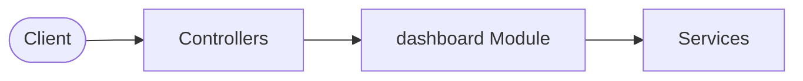

#### Files & Methods in dashboard

**File:** `backend\src\dashboard\dashboard.controller.ts`
- **Methods / Signatures:**
  - `@Controller('dashboard')`
  - `@Get()`
  - `async getDashboard(@Request() req: any)`

**File:** `backend\src\dashboard\dashboard.service.ts`
- **Methods / Signatures:**
  - `@Injectable()`
  - `private readonly logger = new Logger(DashboardService.name);`
  - `@InjectModel(User.name) private readonly userModel: Model<User>,`
  - `@InjectModel(StudentProfile.name) private readonly profileModel: Model<StudentProfileDocument>,`
  - `@InjectModel(SavedCareer.name) private readonly savedCareerModel: Model<SavedCareerDocument>,`
  - `async getDashboardData(userId: string)`
  - `const user = await this.userModel.findOne(`
  - `const profile = await this.profileModel.findOne(`
  - `.findOne(`
  - `.sort(`
  - `.exec();`
  - `const savedCount = await this.savedCareerModel.countDocuments(`
  - `.find(`
  - `.sort(`
  - `.limit(3)`
  - `.exec();`
  - `nextAction = 'Review matches and bookmark (save) your first career.';`
  - `// 5. Server-Side AI Insight (Deterministic template matching)`
  - `const sortedTraits = Object.entries(`
  - `}).sort((a, b) => b[1] - a[1]);`
  - `top_matches: recommendation?.final_recommendations?.slice(0, 3).map((r) => r.career_code) || [],`
  - `recent: recentSaved.map((s) => s.career_code),`

### 21.8 Backend Module: HEALTH

#### Sub-Flow (Mermaid)
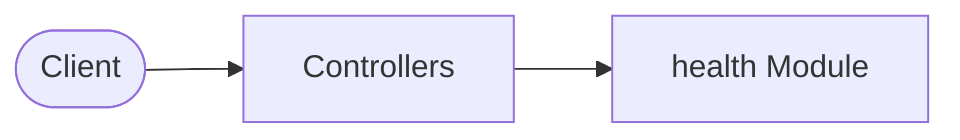

#### Files & Methods in health

**File:** `backend\src\health\health.controller.ts`
- **Methods / Signatures:**
  - `@Controller('health')`
  - `@Get()`
  - `@Public() // Mark as public so JwtAuthGuard ignores it`
  - `check()`

### 21.9 Backend Module: HISTORY

#### Sub-Flow (Mermaid)
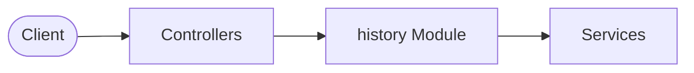

#### Files & Methods in history

**File:** `backend\src\history\history.controller.ts`
- **Methods / Signatures:**
  - `@Controller('history')`
  - `@Get()`
  - `async getHistory(`
  - `@Request() req: any,`
  - `@Query('type') type = 'all',`
  - `@Query('page') page = '1',`
  - `@Query('limit') limit = '10'`
  - `const pageNum = parseInt(page, 10) || 1;`
  - `const limitNum = parseInt(limit, 10) || 10;`

**File:** `backend\src\history\history.service.ts`
- **Methods / Signatures:**
  - `@Injectable()`
  - `private readonly logger = new Logger(HistoryService.name);`
  - `@InjectModel(StudentDNAHistory.name) private readonly dnaHistoryModel: Model<any>,`
  - `@InjectModel(Recommendation.name) private readonly recommendationModel: Model<any>,`
  - `@InjectModel(SavedCareer.name) private readonly savedCareerModel: Model<any>,`
  - `@InjectModel(Career.name) private readonly careerModel: Model<any>,`
  - `async getHistory(userId: string, type: string, page = 1, limit = 10): Promise<`
  - `const onboardingHistoryPromise = (async (): Promise<HistoryItem[]> =>`
  - `const records = await this.dnaHistoryModel.find(`
  - `title: `Onboarding completed (DNA snapshot generated)`,`
  - `const recommendationsHistoryPromise = (async (): Promise<HistoryItem[]> =>`
  - `const records = await this.recommendationModel.find(`
  - `title: `Recommendation generated ($`
  - `top_careers: r.final_recommendations.map((fr: any) => fr.career_code),`
  - `const savedCareersHistoryPromise = (async (): Promise<HistoryItem[]> =>`
  - `const records = await this.savedCareerModel.find(`
  - `const careerCodes = records.map((r) => r.career_code);`
  - `const careers = await this.careerModel.find(`
  - `const nameMap = careers.reduce((acc, curr) =>`
  - `title: `Saved career bookmark: $`
  - `const [onboard, recs, saved] = await Promise.all([`
  - `items = [...onboard, ...recs, ...saved].sort((a, b) =>`
  - `const paginatedItems = items.slice(startIndex, startIndex + limit);`

### 21.10 Backend Module: ONBOARDING

#### Sub-Flow (Mermaid)
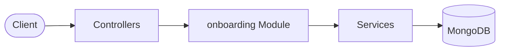

#### Files & Methods in onboarding

**File:** `backend\src\onboarding\onboarding.controller.ts`
- **Methods / Signatures:**
  - `@Controller('onboarding')`
  - `@Post('start')`
  - `async start(@Request() req: any)`
  - `@Get('resume')`
  - `async resume(@Request() req: any)`
  - `@Put('step/:stepKey')`
  - `async saveStep(`
  - `@Request() req: any,`
  - `@Param('stepKey') stepKey: string,`
  - `@Body() body: any,`
  - `const normalizedStep = stepKey.toLowerCase();`
  - `switch (normalizedStep)`
  - `throw new BadRequestException(`Invalid onboarding step: $`
  - `const dtoInstance = plainToInstance(dtoClass, body);`
  - `const errors = await validate(dtoInstance);`
  - `const errorMessages = errors.flatMap((err) =>`
  - `Object.values(err.constraints ||`
  - `throw new BadRequestException(errorMessages);`
  - `@Post('complete')`
  - `@HttpCode(HttpStatus.OK)`
  - `async complete(@Request() req: any)`
  - `@Get('scenarios')`
  - `async getScenarios(@Request() req: any)`
  - `@Get('student-dna')`
  - `async getStudentDNA(@Request() req: any)`

**File:** `backend\src\onboarding\onboarding-flow.service.spec.ts`
- **Methods / Signatures:**
  - `describe('OnboardingFlowService', () =>`
  - `const service = new OnboardingFlowService();`
  - `describe('getStepIndex', () =>`
  - `expect(service.getStepIndex('personal')).toBe(0);`
  - `expect(service.getStepIndex('scenarios')).toBe(7);`
  - `expect(service.getStepIndex('invalid')).toBe(-1);`
  - `describe('getCompletionPercentage', () =>`
  - `expect(service.getCompletionPercentage('complete')).toBe(100);`
  - `expect(service.getCompletionPercentage('invalid')).toBe(0);`
  - `const pct = Math.round(((i + 1) / ONBOARDING_STEPS.length) * 100);`
  - `expect(service.getCompletionPercentage(step)).toBe(pct);`
  - `describe('validateStepTransition', () =>`
  - `it('allows jumping back to any completed step', () =>`
  - `expect(() => service.validateStepTransition('skills', 'personal')).not.toThrow();`
  - `expect(() => service.validateStepTransition('skills', 'academic')).not.toThrow();`
  - `expect(() => service.validateStepTransition('personal', 'academic')).not.toThrow();`
  - `expect(() => service.validateStepTransition('academic', 'interests')).not.toThrow();`
  - `expect(() => service.validateStepTransition('personal', 'skills'))`
  - `.toThrow(BadRequestException);`
  - `expect(() => service.validateStepTransition('personal', 'scenarios'))`
  - `.toThrow(BadRequestException);`
  - `it('rejects invalid target step', () =>`
  - `expect(() => service.validateStepTransition('personal', 'invalid_step'))`
  - `.toThrow(BadRequestException);`
  - `it('allows editing any step from complete', () =>`
  - `expect(() => service.validateStepTransition('complete', 'personal')).not.toThrow();`
  - `expect(() => service.validateStepTransition('complete', 'scenarios')).not.toThrow();`
  - `describe('getNextStep', () =>`
  - `expect(service.getNextStep('personal')).toBe('academic');`
  - `expect(service.getNextStep('work_preferences')).toBe('constraints');`
  - `expect(service.getNextStep('scenarios')).toBe('complete');`
  - `expect(service.getNextStep('invalid')).toBe('complete');`

**File:** `backend\src\onboarding\onboarding-flow.service.ts`
- **Methods / Signatures:**
  - `@Injectable()`
  - `getStepIndex(stepKey: string): number`
  - `getCompletionPercentage(stepKey: string): number`
  - `const idx = this.getStepIndex(stepKey);`
  - `validateStepTransition(currentStep: string, targetStep: string): void`
  - `const currentIdx = this.getStepIndex(currentStep);`
  - `const targetIdx = this.getStepIndex(targetStep);`
  - `throw new BadRequestException(`Invalid target onboarding step: $`
  - `throw new BadRequestException(`
  - `getNextStep(currentStep: string): string`
  - `const idx = this.getStepIndex(currentStep);`

**File:** `backend\src\onboarding\onboarding.service.ts`
- **Methods / Signatures:**
  - `export const onboardingEvents = new EventEmitter();`
  - `@Injectable()`
  - `private readonly logger = new Logger(OnboardingService.name);`
  - `@InjectModel(StudentProfile.name)`
  - `@InjectModel(StudentDNAHistory.name)`
  - `async startOnboarding(userId: string)`
  - `let profile = await this.profileModel.findOne(`
  - `profile = new this.profileModel(`
  - `await profile.save();`
  - `onboardingEvents.emit('ONBOARDING_STARTED',`
  - `async resumeOnboarding(userId: string)`
  - `const profile = await this.profileModel.findOne(`
  - `async saveStep(userId: string, stepKey: string, stepData: any)`
  - `const profile = await this.profileModel.findOne(`
  - `throw new NotFoundException('Onboarding profile not found. Call start first.');`
  - `const normalizedStep = stepKey.toLowerCase();`
  - `this.flowService.validateStepTransition(profile.onboarding_step, normalizedStep);`
  - `switch (normalizedStep)`
  - `throw new BadRequestException(`Unknown step key: $`
  - `const nextStep = this.flowService.getNextStep(normalizedStep);`
  - `profile.completion_percentage = this.flowService.getCompletionPercentage(normalizedStep);`
  - `await profile.save();`
  - `onboardingEvents.emit('ONBOARDING_STEP_COMPLETED',`
  - `onboardingEvents.emit('PROFILE_UPDATED',`
  - `async completeOnboarding(userId: string)`
  - `const profile = await this.profileModel.findOne(`
  - `throw new NotFoundException('Onboarding profile not found');`
  - `throw new BadRequestException(`
  - `const dna = this.traitEngine.computeDNA(profile);`
  - `await profile.save();`
  - `const history = new this.dnaHistoryModel(`
  - `await history.save();`
  - `// 4. Emit event to trigger recommendation pipeline (Phase 4 stub)`
  - `onboardingEvents.emit('ONBOARDING_COMPLETED',`
  - `async generateScenarios(userId: string): Promise<any>`
  - `const profile = await this.profileModel.findOne(`
  - `throw new NotFoundException('Onboarding profile not found.');`
  - `const response = await this.aiClient.run('scenario_generation', context);`
  - `await profile.save();`
  - `async getDNA(userId: string): Promise<StudentDNA>`
  - `const profile = await this.profileModel.findOne(`
  - `throw new NotFoundException('Student DNA not found. Onboarding must be completed first.');`

**File:** `backend\src\onboarding\trait-engine.service.spec.ts`
- **Methods / Signatures:**
  - `const service = new TraitEngineService();`
  - `describe('TraitEngineService', () =>`
  - `describe('computeDNA', () =>`
  - `it('computes all 10 traits', () =>`
  - `const dna = service.computeDNA(baseProfile);`
  - `expect(dna).toHaveProperty(t);`
  - `expect((dna as any)[t]).toBeGreaterThanOrEqual(0);`
  - `expect((dna as any)[t]).toBeLessThanOrEqual(100);`
  - `expect(dna.source_version).toBe('v1');`
  - `expect(dna.computed_at).toBeInstanceOf(Date);`
  - `const dna = service.computeDNA(baseProfile);`
  - `expect(dna.analytical_thinking).toBeGreaterThan(60);`
  - `const dna = service.computeDNA(baseProfile);`
  - `expect(dna.creativity).toBeLessThan(60);`
  - `it('clamps values to 0-100', () =>`
  - `const dna = service.computeDNA(extremeProfile);`
  - `expect(dna.analytical_thinking).toBeLessThanOrEqual(100);`
  - `it('falls back to default when subjects/interests/skills are null', () =>`
  - `const dna = service.computeDNA(emptyProfile);`
  - `expect((dna as any)[t]).toBe(50);`
  - `it('applies scenario response impacts', () =>`
  - `const dna1 = service.computeDNA(baseProfile);`
  - `const dna2 = service.computeDNA(profileWithScenario);`
  - `expect(dna2.risk_tolerance).not.toBe(dna1.risk_tolerance);`
  - `trait_weights: new Map(Object.entries(`
  - `const dna = service.computeDNA(profile);`
  - `expect(dna.risk_tolerance).toBeGreaterThanOrEqual(0);`

**File:** `backend\src\onboarding\trait-engine.service.ts`
- **Methods / Signatures:**
  - `profile_weight: number; // weight of profile vs scenarios (0.0 to 1.0)`
  - `@Injectable()`
  - `private readonly logger = new Logger(TraitEngineService.name);`
  - `computeDNA(profile: StudentProfile): StudentDNA`
  - `const traits = Object.keys(this.TRAIT_CONFIG);`
  - `// 3. Compute Skills Component (scale 1-5 to 0-100)`
  - `? profileComponents.reduce((a, b) => a + b, 0) / profileComponents.length`
  - `? resp.trait_weights.get(trait)`
  - `scenarioSum = Math.min(100, Math.max(0, scenarioSum + impactSum));`
  - `dna[trait] = Math.round(Math.min(100, Math.max(0, finalScore)));`
  - `dna.computed_at = new Date();`

**File:** `backend\src\onboarding\schemas\student-dna-history.schema.ts`
- **Methods / Signatures:**
  - `@Schema(`
  - `@Prop(`
  - `@Prop(`
  - `@Prop(`

**File:** `backend\src\onboarding\schemas\student-profile.schema.ts`
- **Methods / Signatures:**
  - `@Schema(`
  - `@Prop(`
  - `@Prop(`
  - `@Prop(`
  - `@Prop(`
  - `@Prop(`
  - `@Prop(`
  - `@Prop(`
  - `@Prop(`
  - `@Prop(`
  - `@Prop(`
  - `@Prop(`
  - `@Prop(`
  - `export const StudentDNASchema = SchemaFactory.createForClass(StudentDNA);`
  - `@Schema(`
  - `@Prop(`
  - `@Prop(`
  - `@Prop(`
  - `@Prop(`
  - `@Prop(`
  - `@Prop(`
  - `@Prop(`
  - `@Schema(`
  - `@Prop(`
  - `@Prop(`
  - `@Prop(`
  - `@Prop(`
  - `@Prop(`
  - `@Schema(`
  - `@Prop(`
  - `@Prop(`
  - `@Prop(`
  - `@Prop(`
  - `@Prop(`
  - `@Schema(`
  - `@Prop(`
  - `@Prop(`
  - `@Prop(`
  - `@Prop(`
  - `@Prop(`
  - `@Prop(`
  - `@Schema(`
  - `@Prop(`
  - `@Prop(`
  - `@Schema(`
  - `@Prop(`
  - `@Prop(`
  - `@Prop(`
  - `@Prop(`
  - `@Prop(`
  - `@Prop(`
  - `@Prop(`
  - `@Prop(`
  - `@Prop(`
  - `@Prop(`
  - `@Prop(`
  - `@Prop(`
  - `@Schema(`
  - `@Prop(`
  - `@Prop(`
  - `@Prop(`
  - `@Prop(`
  - `@Prop(`
  - `@Prop(`
  - `@Prop(`
  - `@Prop(`
  - `@Prop(`
  - `@Prop(`
  - `@Schema(`
  - `@Prop(`
  - `@Prop(`
  - `@Prop(`
  - `@Prop(`
  - `@Prop(`
  - `@Prop(`
  - `@Schema(`
  - `@Prop(`
  - `@Prop(`
  - `@Prop(`
  - `@Schema(`
  - `@Prop(`
  - `@Prop(`
  - `@Prop(`
  - `@Prop(`
  - `@Prop(`
  - `@Prop(`
  - `@Prop(`
  - `@Prop(`
  - `@Prop(`
  - `@Prop(`
  - `@Prop(`
  - `@Prop(`
  - `@Prop(`
  - `export const StudentProfileSchema: MongooseSchema = SchemaFactory.createForClass(StudentProfile);`

**File:** `backend\src\onboarding\dto\onboarding-step.dto.ts`
- **Methods / Signatures:**
  - `@IsString()`
  - `@IsNotEmpty()`
  - `@IsString()`
  - `@IsNotEmpty()`
  - `@IsNumber()`
  - `@Min(5)`
  - `@Max(100)`
  - `@IsString()`
  - `@IsNotEmpty()`
  - `@IsString()`
  - `@IsNotEmpty()`
  - `@IsString()`
  - `@IsNotEmpty()`
  - `@IsString()`
  - `@IsNotEmpty()`
  - `@IsNumber() @Min(0) @Max(100) maths: number;`
  - `@IsNumber() @Min(0) @Max(100) science: number;`
  - `@IsNumber() @Min(0) @Max(100) english: number;`
  - `@IsNumber() @Min(0) @Max(100) sst: number;`
  - `@IsNumber() @Min(0) @Max(100) computer: number;`
  - `@IsString() @IsOptional() status?: string;`
  - `@IsNumber() @IsOptional() @Min(0) @Max(100) percentage?: number;`
  - `@ValidateNested() @IsOptional() @Type(() => Class10SubjectsDto) subjects?: Class10SubjectsDto;`
  - `@IsArray() @IsString(`
  - `@IsArray() @IsString(`
  - `@IsString() @IsOptional() status?: string;`
  - `@IsString() @IsOptional() stream?: string;`
  - `@IsNumber() @IsOptional() @Min(0) @Max(100) percentage?: number;`
  - `@IsObject() @IsOptional() subjects?: Record<string, number>;`
  - `@IsArray() @IsString(`
  - `@IsArray() @IsString(`
  - `@ValidateNested() @IsOptional() @Type(() => Class10DetailsDto) class10?: Class10DetailsDto;`
  - `@ValidateNested() @IsOptional() @Type(() => Class12DetailsDto) class12?: Class12DetailsDto;`
  - `@IsNumber() @Min(0) @Max(100) technology: number;`
  - `@IsNumber() @Min(0) @Max(100) business: number;`
  - `@IsNumber() @Min(0) @Max(100) helping_people: number;`
  - `@IsNumber() @Min(0) @Max(100) teaching: number;`
  - `@IsNumber() @Min(0) @Max(100) nature: number;`
  - `@IsNumber() @Min(0) @Max(100) research: number;`
  - `@IsNumber() @Min(0) @Max(100) sports: number;`
  - `@IsNumber() @Min(0) @Max(100) design: number;`
  - `@IsNumber() @Min(0) @Max(100) media: number;`
  - `@IsNumber() @Min(0) @Max(100) government: number;`
  - `@IsNumber() @Min(0) @Max(100) finance: number;`
  - `@IsNumber() @Min(0) @Max(100) machines: number;`
  - `@IsNumber() @Min(1) @Max(5) communication: number;`
  - `@IsNumber() @Min(1) @Max(5) leadership: number;`
  - `@IsNumber() @Min(1) @Max(5) problem_solving: number;`
  - `@IsNumber() @Min(1) @Max(5) creativity: number;`
  - `@IsNumber() @Min(1) @Max(5) logical_thinking: number;`
  - `@IsNumber() @Min(1) @Max(5) coding: number;`
  - `@IsNumber() @Min(1) @Max(5) drawing: number;`
  - `@IsNumber() @Min(1) @Max(5) math: number;`
  - `@IsNumber() @Min(1) @Max(5) observation: number;`
  - `@IsNumber() @Min(1) @Max(5) patience: number;`
  - `@IsArray()`
  - `@IsString(`
  - `@IsNotEmpty()`
  - `@IsArray()`
  - `@IsString(`
  - `@IsNotEmpty()`
  - `@IsString()`
  - `@IsOptional()`
  - `@IsNumber()`
  - `@Min(1)`
  - `@Max(4)`
  - `@IsNumber()`
  - `@Min(1)`
  - `@IsBoolean()`
  - `@IsBoolean()`
  - `@IsString()`
  - `@IsOptional()`
  - `@IsString()`
  - `@IsNotEmpty()`
  - `@IsString()`
  - `@IsNotEmpty()`
  - `@IsObject()`
  - `@IsNotEmpty()`
  - `@ValidateNested(`
  - `@Type(() => ScenarioResponseDto)`
  - `@IsArray()`
  - `@IsNotEmpty()`

### 21.11 Backend Module: RECOMMENDATION

#### Sub-Flow (Mermaid)
```mermaid
flowchart LR
    Client([Client])
    Module[recommendation Module]
    Controllers[Controllers]
    Client --> Controllers
    Controllers --> Module
    Services[Services]
    Module --> Services
    Database[(MongoDB)]
    Services --> Database
```

#### Files & Methods in recommendation

**File:** `backend\src\recommendation\recommendation.controller.ts`
- **Methods / Signatures:**
  - `@Controller('recommendations')`
  - `@Post('generate')`
  - `@HttpCode(HttpStatus.OK)`
  - `async generate(@Request() req: any)`
  - `@Get('latest')`
  - `async getLatest(@Request() req: any)`
  - `@Post('regenerate')`
  - `@HttpCode(HttpStatus.OK)`
  - `async regenerate(@Request() req: any)`
  - `@Post('feedback')`
  - `@HttpCode(HttpStatus.OK)`
  - `async feedback(@Request() req: any, @Body() dto: FeedbackDto)`

**File:** `backend\src\recommendation\eligibility-engine.service.spec.ts`
- **Methods / Signatures:**
  - `const execMock = jest.fn();`
  - `find: jest.fn(() => (`
  - `describe('EligibilityEngineService', () =>`
  - `execMock.mockReset();`
  - `careerModel = mockModel();`
  - `service = new EligibilityEngineService(careerModel);`
  - `it('builds query with student scores and constraints', async () =>`
  - `execMock.mockResolvedValue(['career1', 'career2']);`
  - `const profile = makeProfile();`
  - `await service.getEligibleCareers(profile);`
  - `expect(careerModel.find).toHaveBeenCalledWith(`
  - `execMock.mockResolvedValue([]);`
  - `const profile = makeProfile(`
  - `await service.getEligibleCareers(profile);`
  - `expect(careerModel.find).toHaveBeenCalledWith(`
  - `it('defaults budget_tier to 4 and study_duration_max to 5 when constraints missing', async () =>`
  - `execMock.mockResolvedValue([]);`
  - `const profile = makeProfile(`
  - `await service.getEligibleCareers(profile);`
  - `expect(careerModel.find).toHaveBeenCalledWith(`
  - `execMock.mockResolvedValue([]);`
  - `const result = await service.getEligibleCareers(makeProfile());`
  - `expect(result).toEqual([]);`

**File:** `backend\src\recommendation\eligibility-engine.service.ts`
- **Methods / Signatures:**
  - `@Injectable()`
  - `private readonly logger = new Logger(EligibilityEngineService.name);`
  - `@InjectModel(Career.name) private readonly careerModel: Model<CareerDocument>,`
  - `async getEligibleCareers(student: StudentProfile): Promise<CareerDocument[]>`
  - `const eligible = await this.careerModel.find(query).exec();`
  - `this.logger.log(`Eligibility check: found $`

**File:** `backend\src\recommendation\recommendation.service.spec.ts`
- **Methods / Signatures:**
  - `jest.mock('./config/recommendation.constants', () => (`
  - `get RECOMMENDATION_ENGINE_VERSION()`
  - `const execMock = jest.fn();`
  - `const fn: any = function (this: any, data: any)`
  - `Object.assign(this, data);`
  - `this.save = jest.fn().mockResolvedValue(undefined);`
  - `fn.findOne = jest.fn(() => query);`
  - `fn.findById = jest.fn(() => query);`
  - `fn.find = jest.fn(() => query);`
  - `fn.updateMany = jest.fn(() => query);`
  - `describe('RecommendationService', () =>`
  - `execMock.mockReset();`
  - `recModel = makeModel();`
  - `feedbackModel = makeModel();`
  - `profileModel = makeModel();`
  - `eligibilityEngine =`
  - `traitMatchingEngine =`
  - `aiClient =`
  - `const mockAcademicEngine =`
  - `const mockInterestEngine =`
  - `const mockSkillEngine =`
  - `const mockPersonalityEngine =`
  - `const mockConstraintEngine =`
  - `const mockOpportunityEngine =`
  - `calculate: jest.fn().mockReturnValue(`
  - `rank: jest.fn().mockImplementation((x) => x),`
  - `calculate: jest.fn().mockReturnValue(85),`
  - `explain: jest.fn().mockReturnValue(`
  - `const module: TestingModule = await Test.createTestingModule(`
  - `}).compile();`
  - `describe('generateRecommendation', () =>`
  - `it('throws when profile or DNA not found', async () =>`
  - `execMock.mockResolvedValue(null);`
  - `await expect(service.generateRecommendation('user-1')).rejects.toThrow(BadRequestException);`
  - `it('throws when zero eligible careers', async () =>`
  - `execMock.mockResolvedValue(mockProfile);`
  - `eligibilityEngine.getEligibleCareers.mockResolvedValue([]);`
  - `await expect(service.generateRecommendation('user-1')).rejects.toThrow(BadRequestException);`
  - `it('throws when AI call fails', async () =>`
  - `execMock.mockResolvedValue(mockProfile);`
  - `eligibilityEngine.getEligibleCareers.mockResolvedValue(eligible);`
  - `traitMatchingEngine.matchCareers.mockReturnValue(eligible.map(c => (`
  - `aiClient.run.mockResolvedValue(`
  - `await expect(service.generateRecommendation('user-1')).rejects.toThrow(BadRequestException);`
  - `it('saves recommendation with top 5 on success', async () =>`
  - `execMock.mockResolvedValue(mockProfile);`
  - `eligibilityEngine.getEligibleCareers.mockResolvedValue(eligible);`
  - `traitMatchingEngine.matchCareers.mockReturnValue(eligible.map(c => (`
  - `aiClient.run.mockResolvedValue(`
  - `await service.generateRecommendation('user-1');`
  - `expect(recModel.updateMany).toHaveBeenCalledWith(`
  - `it('saves V2 recommendation on success with engine version v2', async () =>`
  - `execMock.mockResolvedValue(mockProfile);`
  - `eligibilityEngine.getEligibleCareers.mockResolvedValue(eligible);`
  - `aiClient.run.mockResolvedValue(`
  - `const result = await service.generateRecommendation('user-1');`
  - `expect(result.pipeline_version).toBe('v2');`
  - `describe('getLatestRecommendation', () =>`
  - `it('throws when none exists', async () =>`
  - `execMock.mockResolvedValue(null);`
  - `await expect(service.getLatestRecommendation('user-1')).rejects.toThrow(NotFoundException);`
  - `execMock.mockResolvedValue(`
  - `const result = await service.getLatestRecommendation('user-1');`
  - `expect(result._id).toBe('rec-1');`
  - `describe('submitFeedback', () =>`
  - `it('throws when recommendation not found', async () =>`
  - `execMock.mockResolvedValue(null);`
  - `await expect(service.submitFeedback('user-1',`
  - `execMock.mockResolvedValue(`
  - `await service.submitFeedback('user-1',`
  - `describe('event hooks', () =>`
  - `it('registers listeners when onModuleInit is called', () =>`
  - `service.onModuleInit();`
  - `const names = onboardingEvents.eventNames();`
  - `expect(names).toContain('ONBOARDING_COMPLETED');`
  - `expect(names).toContain('PROFILE_UPDATED');`

**File:** `backend\src\recommendation\recommendation.service.ts`
- **Methods / Signatures:**
  - `@Injectable()`
  - `private readonly logger = new Logger(RecommendationService.name);`
  - `@InjectModel(Recommendation.name)`
  - `@InjectModel(RecommendationFeedback.name)`
  - `@InjectModel(StudentProfile.name)`
  - `onModuleInit()`
  - `onboardingEvents.on('ONBOARDING_COMPLETED', async (data) =>`
  - `await this.generateRecommendation(data.user_id);`
  - `onboardingEvents.on('PROFILE_UPDATED', async (data) =>`
  - `await this.markAsStale(data.user_id);`
  - `async generateRecommendation(userId: string): Promise<Recommendation>`
  - `const startTime = Date.now();`
  - `const profile = await this.profileModel.findOne(`
  - `const eligibleCareers = await this.eligibilityEngine.getEligibleCareers(profile);`
  - `const scoredResults = await Promise.all(`
  - `eligibleCareers.map(async (career) =>`
  - `const academicScore = this.academicEngine.calculate(profile, career);`
  - `const interestScore = this.interestEngine.calculate(profile, career);`
  - `const skillScore = this.skillEngine.calculate(profile, career);`
  - `const personalityScore = this.personalityEngine.calculate(profile, career);`
  - `const constraintScore = this.constraintEngine.calculate(profile, career);`
  - `const opportunityScore = this.opportunityEngine.calculate(profile, career);`
  - `const rankedResults = this.hybridRankingEngine.rank(scoredResults);`
  - `const diversityInput = (rankedResults as any[]).map((r) => (`
  - `const shortlist = rankedResults.slice(0, 20).map((item) => (`
  - `// 6. Call AI Service Client (exactly 1 routed call)`
  - `const aiResponse = await this.aiServiceClient.run(`
  - `throw new BadRequestException('AI Personalization failed to produce valid recommendations.');`
  - `const confidenceScore = this.confidenceEngine.calculate(profile, rankedResults);`
  - `const matchingRankedResult = rankedResults.find(r => r.career_code === item.career.career_code)!;`
  - `const reason = this.explainabilityEngine.explain(`
  - `const matchingAiRec = aiResponse.data.final_recommendations.find(`
  - `await this.recommendationModel.updateMany(`
  - `const recommendation = new this.recommendationModel(`
  - `processing_time_ms: Date.now() - startTime,`
  - `await recommendation.save();`
  - `const profile = await this.profileModel.findOne(`
  - `// 2. Eligibility Engine (runs database Mongoose filters)`
  - `const eligibleCareers = await this.eligibilityEngine.getEligibleCareers(profile);`
  - `// 3. Trait Matching Engine (calculates cosine similarities)`
  - `const shortlist = shortlistScored.map((item) => (`
  - `// 4. Assemble AI Personalization payload (top 20 max)`
  - `const aiCandidateCareers = shortlistScored.map((item) => (`
  - `// 5. Call AI Service Client (exactly 1 routed call)`
  - `const aiResponse = await this.aiServiceClient.run(`
  - `throw new BadRequestException('AI Personalization failed to produce valid recommendations.');`
  - `const finalRecs = aiResponse.data.final_recommendations.slice(0, 5);`
  - `await this.recommendationModel.updateMany(`
  - `const recommendation = new this.recommendationModel(`
  - `await recommendation.save();`
  - `async getLatestRecommendation(userId: string): Promise<Recommendation>`
  - `.findOne(`
  - `.sort(`
  - `.exec();`
  - `async regenerate(userId: string): Promise<Recommendation>`
  - `async submitFeedback(userId: string, dto: FeedbackDto): Promise<RecommendationFeedback>`
  - `const rec = await this.recommendationModel.findById(dto.recommendation_id).exec();`
  - `throw new NotFoundException('Recommendation document not found or unauthorized');`
  - `const feedback = new this.feedbackModel(`
  - `async markAsStale(userId: string): Promise<void>`
  - `await this.recommendationModel.updateMany(`

**File:** `backend\src\recommendation\trait-matching-engine.service.spec.ts`
- **Methods / Signatures:**
  - `const service = new TraitMatchingEngineService();`
  - `risk_tolerance: 50, computed_at: new Date(), source_version: 'v1',`
  - `describe('TraitMatchingEngineService', () =>`
  - `describe('matchCareers', () =>`
  - `const result = service.matchCareers(makeDNA(), []);`
  - `expect(result).toEqual([]);`
  - `const career = makeCareer('cs',`
  - `const dna = makeDNA(`
  - `const result = service.matchCareers(dna, [career]);`
  - `expect(result[0].score).toBe(100);`
  - `it('sorts descending by score', () =>`
  - `const dna = makeDNA(`
  - `makeCareer('high_match',`
  - `makeCareer('low_match',`
  - `makeCareer('mid_match',`
  - `const result = service.matchCareers(dna, careers);`
  - `expect(result.length).toBe(3);`
  - `expect(result[0].career.career_code).toBe('high_match');`
  - `expect(result[2].career.career_code).toBe('low_match');`
  - `it('limits to top 20 when more careers exist', () =>`
  - `const careers = Array.from(`
  - `makeCareer(`c$`
  - `const result = service.matchCareers(makeDNA(), careers);`
  - `expect(result.length).toBe(20);`

**File:** `backend\src\recommendation\trait-matching-engine.service.ts`
- **Methods / Signatures:**
  - `@Injectable()`
  - `private readonly logger = new Logger(TraitMatchingEngineService.name);`
  - `matchCareers(dna: StudentDNA, eligibleCareers: CareerDocument[]):`
  - `this.logger.log(`Running Trait Matching Engine against $`
  - `const dnaVector = TRAIT_KEYS.map((key) => (dna as any)[key] || 0);`
  - `const scored = eligibleCareers.map((career) =>`
  - `const careerVector = TRAIT_KEYS.map((key) => (careerWeights as any)[key] || 0);`
  - `// 3. Compute cosine similarity (convert -1 to 1 to a 0 to 100 percentage score)`
  - `const similarity = cosineSimilarity(dnaVector, careerVector);`
  - `const score = Math.round(similarity * 100);`
  - `const sorted = scored.sort((a, b) => b.score - a.score);`
  - `const top20 = sorted.slice(0, 20);`
  - `this.logger.log(`Matched top $`

**File:** `backend\src\recommendation\schemas\recommendation-feedback.schema.ts`
- **Methods / Signatures:**
  - `@Schema(`
  - `@Prop(`
  - `@Prop(`
  - `@Prop(`
  - `@Prop(`
  - `@Prop(`

**File:** `backend\src\recommendation\schemas\recommendation.schema.ts`
- **Methods / Signatures:**
  - `@Schema(`
  - `@Prop(`
  - `@Prop(`
  - `@Schema(`
  - `@Prop(`
  - `@Prop(`
  - `@Prop(`
  - `@Prop(`
  - `@Prop(`
  - `@Prop(`
  - `@Prop(`
  - `@Prop(`
  - `@Prop(`
  - `@Schema(`
  - `@Prop(`
  - `@Prop(`
  - `@Prop(`
  - `@Prop(`
  - `@Prop(`
  - `@Prop(`
  - `@Prop(`
  - `@Prop(`
  - `@Prop(`
  - `@Prop(`
  - `@Prop(`
  - `@Prop(`
  - `@Prop(`
  - `@Prop(`
  - `@Prop(`
  - `export const RecommendationSchema: MongooseSchema = SchemaFactory.createForClass(Recommendation);`

**File:** `backend\src\recommendation\dto\recommendation.dto.ts`
- **Methods / Signatures:**
  - `@IsString()`
  - `@IsNotEmpty()`
  - `@IsString()`
  - `@IsNotEmpty()`
  - `@IsNumber()`
  - `@Min(1)`
  - `@Max(5)`
  - `@IsString()`
  - `@IsOptional()`

### 21.12 Backend Module: REPORTS

#### Sub-Flow (Mermaid)
```mermaid
flowchart LR
    Client([Client])
    Module[reports Module]
    Controllers[Controllers]
    Client --> Controllers
    Controllers --> Module
    Services[Services]
    Module --> Services
    Database[(MongoDB)]
    Services --> Database
```

#### Files & Methods in reports

**File:** `backend\src\reports\reports.controller.ts`
- **Methods / Signatures:**
  - `@Controller('reports')`
  - `@Post('generate')`
  - `@HttpCode(HttpStatus.OK)`
  - `async generate(@Request() req: any)`
  - `@Get('status/:reportId')`
  - `async getStatus(@Request() req: any, @Param('reportId') reportId: string)`
  - `@Get('download/:reportId')`
  - `@Header('Content-Type', 'application/pdf')`
  - `async download(@Request() req: any, @Param('reportId') reportId: string)`
  - `const stream = await this.reportsService.getReportDownloadStream(req.user.user_id, reportId);`
  - `@Get('history')`
  - `async getHistory(@Request() req: any)`

**File:** `backend\src\reports\reports.service.ts`
- **Methods / Signatures:**
  - `const pdfmake = require('pdfmake');`
  - `@Injectable()`
  - `private readonly logger = new Logger(ReportsService.name);`
  - `private readonly reportsDir = path.join(process.cwd(), 'reports_output');`
  - `@InjectModel(Report.name) private readonly reportModel: Model<ReportDocument>,`
  - `@InjectModel(StudentProfile.name) private readonly profileModel: Model<StudentProfileDocument>,`
  - `fs.mkdirSync(this.reportsDir,`
  - `async startReportGeneration(userId: string): Promise<Report>`
  - `const profile = await this.profileModel.findOne(`
  - `.findOne(`
  - `.sort(`
  - `.exec();`
  - `throw new BadRequestException('No recommendation found. Generate recommendations first.');`
  - `const report = new this.reportModel(`
  - `recommendation_ref: String(recommendation._id),`
  - `await report.save();`
  - `this.generatePdfAsync(report, profile, recommendation);`
  - `private async generatePdfAsync(`
  - `await report.save();`
  - `...finalRecs.map((rec) => [`
  - `const filePath = path.join(this.reportsDir, filename);`
  - `const pdfDoc = pdfmake.createPdf(docDefinition);`
  - `await pdfDoc.write(filePath);`
  - `await report.save();`
  - `await report.save();`
  - `async getReportStatus(userId: string, reportId: string): Promise<Report>`
  - `const report = await this.reportModel.findById(reportId).exec();`
  - `throw new NotFoundException('Report not found or unauthorized');`
  - `async getReportDownloadStream(userId: string, reportId: string): Promise<fs.ReadStream>`
  - `const report = await this.reportModel.findById(reportId).exec();`
  - `throw new NotFoundException('Report not found or unauthorized');`
  - `await report.save();`
  - `async getReportsHistory(userId: string): Promise<Report[]>`

**File:** `backend\src\reports\schemas\report.schema.ts`
- **Methods / Signatures:**
  - `@Schema(`
  - `@Prop(`
  - `@Prop(`
  - `@Prop(`
  - `@Prop(`
  - `export const ReportSchema: MongooseSchema = SchemaFactory.createForClass(Report);`

### 21.13 Frontend Components & Pages

#### Frontend Flow (Mermaid)
```mermaid
flowchart TD
    App[App.tsx]
    Pages[Pages/Routes]
    App --> Pages
    Pages --> AdminCareers
    Pages --> CareerExplorer
    Pages --> CareerGallery
    Pages --> CounselingChat
    Pages --> Dashboard
    Pages --> HistoryLog
    Pages --> Landing
    Pages --> Login
    Pages --> Onboarding
    Pages --> Register
```

**File:** `frontend\src\api\adminCareers.ts`

**File:** `frontend\src\api\client.test.ts`
- **Hooks Detected:**
  - `useAuthStore`

**File:** `frontend\src\api\client.ts`
- **Hooks Detected:**
  - `useAuthStore`

**File:** `frontend\src\App.tsx`
- **Hooks Detected:**
  - `useAuthStore`

**File:** `frontend\src\components\ChatMarkdown.tsx`
- **Hooks Detected:**
  - `useEffect`
  - `useMaxWidth`
  - `useRef`
  - `useId`

**File:** `frontend\src\components\layout\AppShell.tsx`
- **Hooks Detected:**
  - `useNavigate`
  - `useAuthStore`
  - `useLocation`

**File:** `frontend\src\components\layout\AuthLayout.tsx`

**File:** `frontend\src\components\OnboardingProgress.tsx`

**File:** `frontend\src\components\shared\AmbientOrbs.tsx`

**File:** `frontend\src\components\shared\ErrorBoundary.tsx`

**File:** `frontend\src\components\shared\SectionReveal.tsx`

**File:** `frontend\src\components\ui\Button.tsx`

**File:** `frontend\src\components\ui\GlassCard.tsx`

**File:** `frontend\src\lib\catalogs.ts`

**File:** `frontend\src\lib\motion.ts`

**File:** `frontend\src\lib\utils.ts`

**File:** `frontend\src\main.tsx`

**File:** `frontend\src\pages\AdminCareers.tsx`
- **Hooks Detected:**
  - `useState`
  - `useNavigate`
  - `useAuthStore`
  - `useEffect`
  - `useCallback`

**File:** `frontend\src\pages\CareerExplorer.tsx`
- **Hooks Detected:**
  - `useEffect`
  - `useNavigate`
  - `useAuthStore`
  - `useState`
  - `useEvent`

**File:** `frontend\src\pages\CareerGallery.tsx`
- **Hooks Detected:**
  - `useEffect`
  - `useNavigate`
  - `useState`

**File:** `frontend\src\pages\CounselingChat.tsx`
- **Hooks Detected:**
  - `useEffect`
  - `useNavigate`
  - `useAuthStore`
  - `useState`
  - `useRef`

**File:** `frontend\src\pages\Dashboard.tsx`
- **Hooks Detected:**
  - `useEffect`
  - `useNavigate`
  - `useAuthStore`
  - `useState`

**File:** `frontend\src\pages\HistoryLog.tsx`
- **Hooks Detected:**
  - `useEffect`
  - `useNavigate`
  - `useAuthStore`
  - `useState`

**File:** `frontend\src\pages\Landing.tsx`
- **Hooks Detected:**
  - `useState`
  - `useNavigate`
  - `useScroll`
  - `useRef`
  - `useInView`
  - `useMotionValue`
  - `useEffect`
  - `useReducedMotion`
  - `useMotionValueEvent`
  - `useMemo`

**File:** `frontend\src\pages\Login.tsx`
- **Hooks Detected:**
  - `useState`
  - `useNavigate`
  - `useAuthStore`

**File:** `frontend\src\pages\Onboarding.tsx`
- **Hooks Detected:**
  - `useEffect`
  - `useNavigate`
  - `useAuthStore`
  - `useState`

**File:** `frontend\src\pages\Register.tsx`
- **Hooks Detected:**
  - `useState`
  - `useNavigate`

**File:** `frontend\src\store\authStore.test.ts`
- **Hooks Detected:**
  - `useAuthStore`

**File:** `frontend\src\store\authStore.ts`
- **Hooks Detected:**
  - `useAuthStore`

