# SCPR — Detailed Mermaid-Level Career Roadmaps

> **Coverage:** 903 individual career entries extracted from the eight uploaded SCPR career catalogs.

## Purpose

This file gives every individual career a **predefined, detailed roadmap starting from Class 10**. The Mermaid diagram expands the catalog hierarchy into a practical sequence: school stage → stream/pathway → qualification → preparation/training → entry → career progression.

## Accuracy and Maintenance Note

The **career names and catalog hierarchy are derived from the uploaded SCPR files**. The roadmap stages are structured from those pathways and general Indian education/career progression. Admission examinations, eligibility thresholds, recruitment rules, and professional regulations can change; where a route is variable, the roadmap deliberately uses wording such as **“relevant entrance/admission route”**, **“post-specific eligibility”**, or **“check the latest official rules”** instead of inventing a fixed rule.

Some professional pathways have current official structures that should be kept updateable in your application. For example, NEET-UG is currently the common national entrance route for undergraduate medical education and also applies to BAMS/BUMS/BHMS under the respective statutory frameworks; ICSI's CSEET structure was restructured effective June 2026; ICAI and ICMAI publish current CA/CMA course structures; and NIFT/NID publish current design-admission requirements. These should be treated as external verification layers, not hardcoded forever.

## Recommended SCPR Database Fields

- `career_name`
- `catalog`
- `source_path`
- `roadmap_steps[]`
- `roadmap_mermaid`
- `verification_status`
- `last_verified_at`

## Roadmaps

# Science

## 1. Engineering

**Catalog:** Science  
**Source Path:** Science → Engineering

### Detailed Career Roadmap

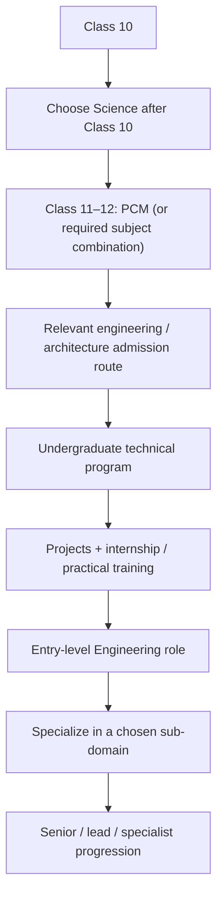

### Roadmap Steps

1. **Class 10**
2. **Choose Science after Class 10**
3. **Class 11–12: PCM (or required subject combination)**
4. **Relevant engineering / architecture admission route**
5. **Undergraduate technical program**
6. **Projects + internship / practical training**
7. **Entry-level Engineering role**
8. **Specialize in a chosen sub-domain**
9. **Senior / lead / specialist progression**

---

## 2. Computer Science

**Catalog:** Science  
**Source Path:** Science → Computer Science

### Detailed Career Roadmap

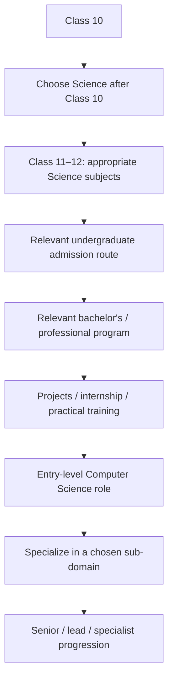

### Roadmap Steps

1. **Class 10**
2. **Choose Science after Class 10**
3. **Class 11–12: appropriate Science subjects**
4. **Relevant undergraduate admission route**
5. **Relevant bachelor's / professional program**
6. **Projects / internship / practical training**
7. **Entry-level Computer Science role**
8. **Specialize in a chosen sub-domain**
9. **Senior / lead / specialist progression**

---

## 3. Defence

**Catalog:** Science  
**Source Path:** Science → Defence

### Detailed Career Roadmap

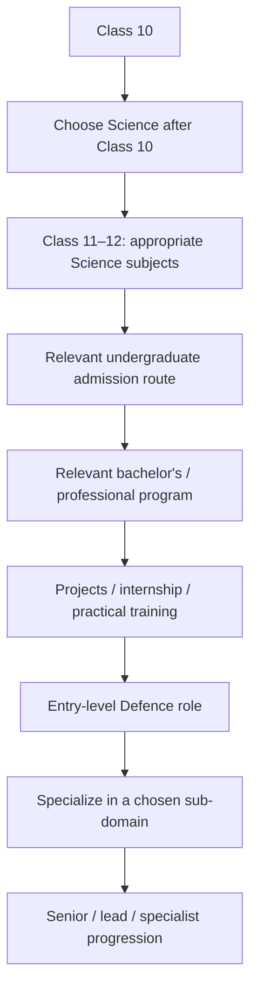

### Roadmap Steps

1. **Class 10**
2. **Choose Science after Class 10**
3. **Class 11–12: appropriate Science subjects**
4. **Relevant undergraduate admission route**
5. **Relevant bachelor's / professional program**
6. **Projects / internship / practical training**
7. **Entry-level Defence role**
8. **Specialize in a chosen sub-domain**
9. **Senior / lead / specialist progression**

---

## 4. Aviation

**Catalog:** Science  
**Source Path:** Science → Aviation

### Detailed Career Roadmap

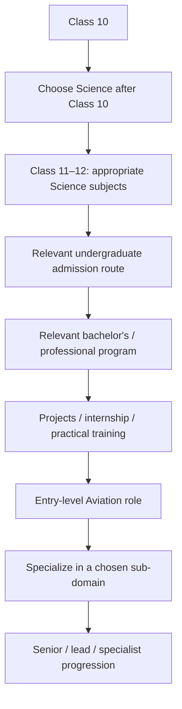

### Roadmap Steps

1. **Class 10**
2. **Choose Science after Class 10**
3. **Class 11–12: appropriate Science subjects**
4. **Relevant undergraduate admission route**
5. **Relevant bachelor's / professional program**
6. **Projects / internship / practical training**
7. **Entry-level Aviation role**
8. **Specialize in a chosen sub-domain**
9. **Senior / lead / specialist progression**

---

## 5. Space Technology

**Catalog:** Science  
**Source Path:** Science → Space Technology

### Detailed Career Roadmap

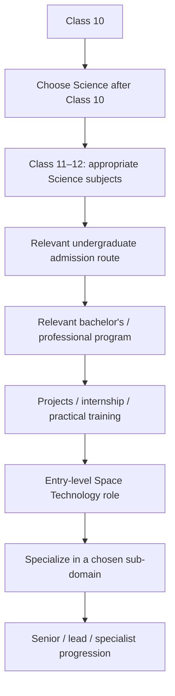

### Roadmap Steps

1. **Class 10**
2. **Choose Science after Class 10**
3. **Class 11–12: appropriate Science subjects**
4. **Relevant undergraduate admission route**
5. **Relevant bachelor's / professional program**
6. **Projects / internship / practical training**
7. **Entry-level Space Technology role**
8. **Specialize in a chosen sub-domain**
9. **Senior / lead / specialist progression**

---

## 6. Research

**Catalog:** Science  
**Source Path:** Science → Research

### Detailed Career Roadmap

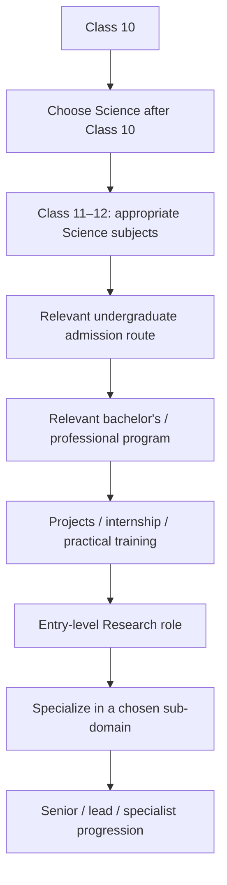

### Roadmap Steps

1. **Class 10**
2. **Choose Science after Class 10**
3. **Class 11–12: appropriate Science subjects**
4. **Relevant undergraduate admission route**
5. **Relevant bachelor's / professional program**
6. **Projects / internship / practical training**
7. **Entry-level Research role**
8. **Specialize in a chosen sub-domain**
9. **Senior / lead / specialist progression**

---

## 7. B.Tech CSE

**Catalog:** Science  
**Source Path:** Science → B.Tech CSE

### Detailed Career Roadmap

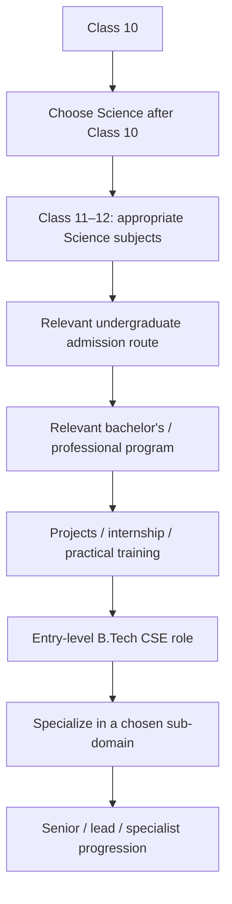

### Roadmap Steps

1. **Class 10**
2. **Choose Science after Class 10**
3. **Class 11–12: appropriate Science subjects**
4. **Relevant undergraduate admission route**
5. **Relevant bachelor's / professional program**
6. **Projects / internship / practical training**
7. **Entry-level B.Tech CSE role**
8. **Specialize in a chosen sub-domain**
9. **Senior / lead / specialist progression**

---

## 8. Software Engineer

**Catalog:** Science  
**Source Path:** Science → Software Engineer

### Detailed Career Roadmap

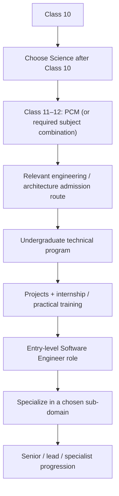

### Roadmap Steps

1. **Class 10**
2. **Choose Science after Class 10**
3. **Class 11–12: PCM (or required subject combination)**
4. **Relevant engineering / architecture admission route**
5. **Undergraduate technical program**
6. **Projects + internship / practical training**
7. **Entry-level Software Engineer role**
8. **Specialize in a chosen sub-domain**
9. **Senior / lead / specialist progression**

---

## 9. AI Engineer

**Catalog:** Science  
**Source Path:** Science → AI Engineer

### Detailed Career Roadmap

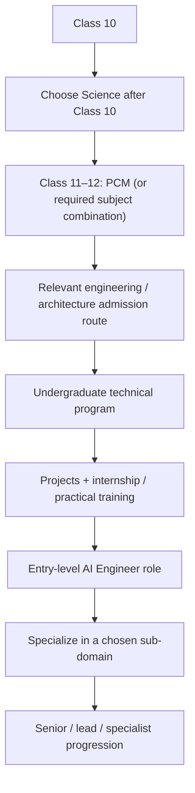

### Roadmap Steps

1. **Class 10**
2. **Choose Science after Class 10**
3. **Class 11–12: PCM (or required subject combination)**
4. **Relevant engineering / architecture admission route**
5. **Undergraduate technical program**
6. **Projects + internship / practical training**
7. **Entry-level AI Engineer role**
8. **Specialize in a chosen sub-domain**
9. **Senior / lead / specialist progression**

---

## 10. Machine Learning Engineer

**Catalog:** Science  
**Source Path:** Science → Machine Learning Engineer

### Detailed Career Roadmap

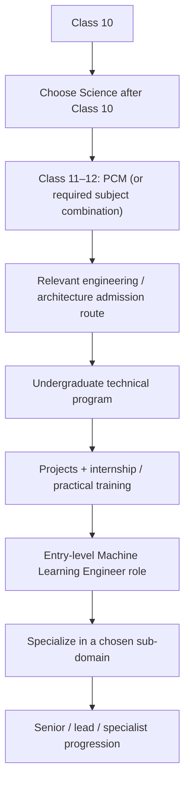

### Roadmap Steps

1. **Class 10**
2. **Choose Science after Class 10**
3. **Class 11–12: PCM (or required subject combination)**
4. **Relevant engineering / architecture admission route**
5. **Undergraduate technical program**
6. **Projects + internship / practical training**
7. **Entry-level Machine Learning Engineer role**
8. **Specialize in a chosen sub-domain**
9. **Senior / lead / specialist progression**

---

## 11. Deep Learning Engineer

**Catalog:** Science  
**Source Path:** Science → Deep Learning Engineer

### Detailed Career Roadmap

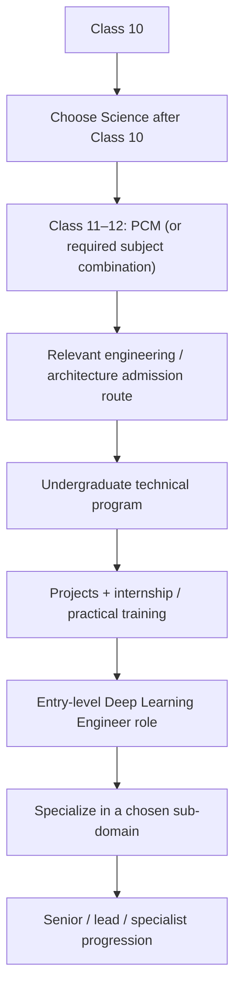

### Roadmap Steps

1. **Class 10**
2. **Choose Science after Class 10**
3. **Class 11–12: PCM (or required subject combination)**
4. **Relevant engineering / architecture admission route**
5. **Undergraduate technical program**
6. **Projects + internship / practical training**
7. **Entry-level Deep Learning Engineer role**
8. **Specialize in a chosen sub-domain**
9. **Senior / lead / specialist progression**

---

## 12. NLP Engineer

**Catalog:** Science  
**Source Path:** Science → NLP Engineer

### Detailed Career Roadmap


### Roadmap Steps

1. **Class 10**
2. **Choose Science after Class 10**
3. **Class 11–12: PCM (or required subject combination)**
4. **Relevant engineering / architecture admission route**
5. **Undergraduate technical program**
6. **Projects + internship / practical training**
7. **Entry-level NLP Engineer role**
8. **Specialize in a chosen sub-domain**
9. **Senior / lead / specialist progression**

---

## 13. Computer Vision Engineer

**Catalog:** Science  
**Source Path:** Science → Computer Vision Engineer

### Detailed Career Roadmap

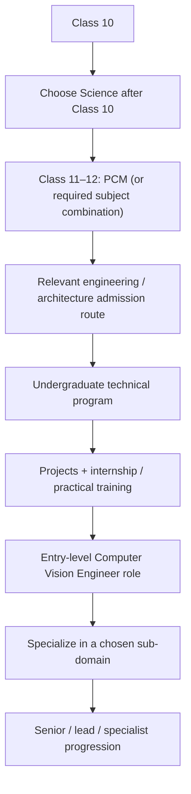

### Roadmap Steps

1. **Class 10**
2. **Choose Science after Class 10**
3. **Class 11–12: PCM (or required subject combination)**
4. **Relevant engineering / architecture admission route**
5. **Undergraduate technical program**
6. **Projects + internship / practical training**
7. **Entry-level Computer Vision Engineer role**
8. **Specialize in a chosen sub-domain**
9. **Senior / lead / specialist progression**

---

## 14. Prompt Engineer

**Catalog:** Science  
**Source Path:** Science → Prompt Engineer

### Detailed Career Roadmap

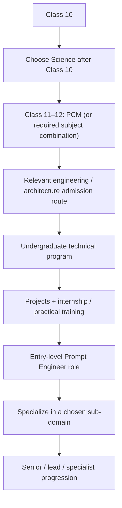

### Roadmap Steps

1. **Class 10**
2. **Choose Science after Class 10**
3. **Class 11–12: PCM (or required subject combination)**
4. **Relevant engineering / architecture admission route**
5. **Undergraduate technical program**
6. **Projects + internship / practical training**
7. **Entry-level Prompt Engineer role**
8. **Specialize in a chosen sub-domain**
9. **Senior / lead / specialist progression**

---

## 15. Data Scientist

**Catalog:** Science  
**Source Path:** Science → Data Scientist

### Detailed Career Roadmap


### Roadmap Steps

1. **Class 10**
2. **Choose Science after Class 10**
3. **Class 11–12: PCM (or required subject combination)**
4. **Relevant engineering / architecture admission route**
5. **Undergraduate technical program**
6. **Projects + internship / practical training**
7. **Entry-level Data Scientist role**
8. **Specialize in a chosen sub-domain**
9. **Senior / lead / specialist progression**

---

## 16. Data Engineer

**Catalog:** Science  
**Source Path:** Science → Data Engineer

### Detailed Career Roadmap


### Roadmap Steps

1. **Class 10**
2. **Choose Science after Class 10**
3. **Class 11–12: PCM (or required subject combination)**
4. **Relevant engineering / architecture admission route**
5. **Undergraduate technical program**
6. **Projects + internship / practical training**
7. **Entry-level Data Engineer role**
8. **Specialize in a chosen sub-domain**
9. **Senior / lead / specialist progression**

---

## 17. Cloud Engineer

**Catalog:** Science  
**Source Path:** Science → Cloud Engineer

### Detailed Career Roadmap

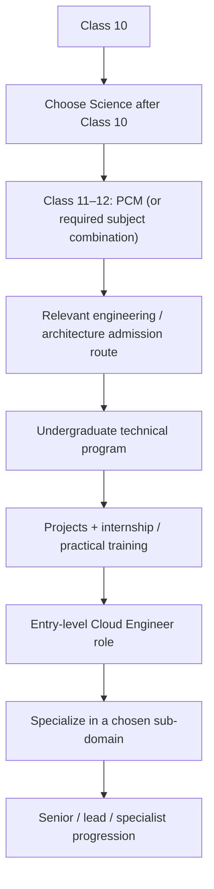

### Roadmap Steps

1. **Class 10**
2. **Choose Science after Class 10**
3. **Class 11–12: PCM (or required subject combination)**
4. **Relevant engineering / architecture admission route**
5. **Undergraduate technical program**
6. **Projects + internship / practical training**
7. **Entry-level Cloud Engineer role**
8. **Specialize in a chosen sub-domain**
9. **Senior / lead / specialist progression**

---

## 18. DevOps Engineer

**Catalog:** Science  
**Source Path:** Science → DevOps Engineer

### Detailed Career Roadmap

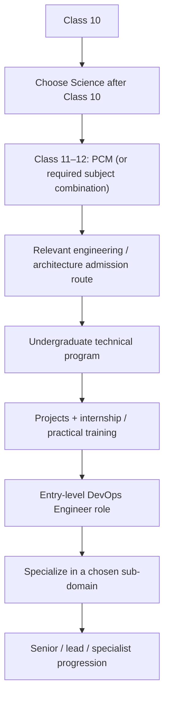

### Roadmap Steps

1. **Class 10**
2. **Choose Science after Class 10**
3. **Class 11–12: PCM (or required subject combination)**
4. **Relevant engineering / architecture admission route**
5. **Undergraduate technical program**
6. **Projects + internship / practical training**
7. **Entry-level DevOps Engineer role**
8. **Specialize in a chosen sub-domain**
9. **Senior / lead / specialist progression**

---

## 19. Platform Engineer

**Catalog:** Science  
**Source Path:** Science → Platform Engineer

### Detailed Career Roadmap


### Roadmap Steps

1. **Class 10**
2. **Choose Science after Class 10**
3. **Class 11–12: PCM (or required subject combination)**
4. **Relevant engineering / architecture admission route**
5. **Undergraduate technical program**
6. **Projects + internship / practical training**
7. **Entry-level Platform Engineer role**
8. **Specialize in a chosen sub-domain**
9. **Senior / lead / specialist progression**

---

## 20. Cyber Security Analyst

**Catalog:** Science  
**Source Path:** Science → Cyber Security Analyst

### Detailed Career Roadmap


### Roadmap Steps

1. **Class 10**
2. **Choose Science after Class 10**
3. **Class 11–12: PCM (or required subject combination)**
4. **Relevant engineering / architecture admission route**
5. **Undergraduate technical program**
6. **Projects + internship / practical training**
7. **Entry-level Cyber Security Analyst role**
8. **Specialize in a chosen sub-domain**
9. **Senior / lead / specialist progression**

---

## 21. Ethical Hacker

**Catalog:** Science  
**Source Path:** Science → Ethical Hacker

### Detailed Career Roadmap

```mermaid
flowchart TD
    c21s0["Class 10"]
    c21s1["Choose Science after Class 10"]
    c21s2["Class 11–12: appropriate Science subjects"]
    c21s3["Relevant undergraduate admission route"]
    c21s4["Relevant bachelor's / professional program"]
    c21s5["Projects / internship / practical training"]
    c21s6["Entry-level Ethical Hacker role"]
    c21s7["Specialize in a chosen sub-domain"]
    c21s8["Senior / lead / specialist progression"]
    c21s0 --> c21s1
    c21s1 --> c21s2
    c21s2 --> c21s3
    c21s3 --> c21s4
    c21s4 --> c21s5
    c21s5 --> c21s6
    c21s6 --> c21s7
    c21s7 --> c21s8
```

### Roadmap Steps

1. **Class 10**
2. **Choose Science after Class 10**
3. **Class 11–12: appropriate Science subjects**
4. **Relevant undergraduate admission route**
5. **Relevant bachelor's / professional program**
6. **Projects / internship / practical training**
7. **Entry-level Ethical Hacker role**
8. **Specialize in a chosen sub-domain**
9. **Senior / lead / specialist progression**

---

## 22. SOC Analyst

**Catalog:** Science  
**Source Path:** Science → SOC Analyst

### Detailed Career Roadmap

```mermaid
flowchart TD
    c22s0["Class 10"]
    c22s1["Choose Science after Class 10"]
    c22s2["Class 11–12: appropriate Science subjects"]
    c22s3["Relevant undergraduate admission route"]
    c22s4["Relevant bachelor's / professional program"]
    c22s5["Projects / internship / practical training"]
    c22s6["Entry-level SOC Analyst role"]
    c22s7["Specialize in a chosen sub-domain"]
    c22s8["Senior / lead / specialist progression"]
    c22s0 --> c22s1
    c22s1 --> c22s2
    c22s2 --> c22s3
    c22s3 --> c22s4
    c22s4 --> c22s5
    c22s5 --> c22s6
    c22s6 --> c22s7
    c22s7 --> c22s8
```

### Roadmap Steps

1. **Class 10**
2. **Choose Science after Class 10**
3. **Class 11–12: appropriate Science subjects**
4. **Relevant undergraduate admission route**
5. **Relevant bachelor's / professional program**
6. **Projects / internship / practical training**
7. **Entry-level SOC Analyst role**
8. **Specialize in a chosen sub-domain**
9. **Senior / lead / specialist progression**

---

## 23. Blockchain Developer

**Catalog:** Science  
**Source Path:** Science → Blockchain Developer

### Detailed Career Roadmap

```mermaid
flowchart TD
    c23s0["Class 10"]
    c23s1["Choose Science after Class 10"]
    c23s2["Class 11–12: PCM (or required subject combination)"]
    c23s3["Relevant engineering / architecture admission route"]
    c23s4["Undergraduate technical program"]
    c23s5["Projects + internship / practical training"]
    c23s6["Entry-level Blockchain Developer role"]
    c23s7["Specialize in a chosen sub-domain"]
    c23s8["Senior / lead / specialist progression"]
    c23s0 --> c23s1
    c23s1 --> c23s2
    c23s2 --> c23s3
    c23s3 --> c23s4
    c23s4 --> c23s5
    c23s5 --> c23s6
    c23s6 --> c23s7
    c23s7 --> c23s8
```

### Roadmap Steps

1. **Class 10**
2. **Choose Science after Class 10**
3. **Class 11–12: PCM (or required subject combination)**
4. **Relevant engineering / architecture admission route**
5. **Undergraduate technical program**
6. **Projects + internship / practical training**
7. **Entry-level Blockchain Developer role**
8. **Specialize in a chosen sub-domain**
9. **Senior / lead / specialist progression**

---

## 24. Game Developer

**Catalog:** Science  
**Source Path:** Science → Game Developer

### Detailed Career Roadmap

```mermaid
flowchart TD
    c24s0["Class 10"]
    c24s1["Choose Science after Class 10"]
    c24s2["Class 11–12: PCM (or required subject combination)"]
    c24s3["Relevant engineering / architecture admission route"]
    c24s4["Undergraduate technical program"]
    c24s5["Projects + internship / practical training"]
    c24s6["Entry-level Game Developer role"]
    c24s7["Specialize in a chosen sub-domain"]
    c24s8["Senior / lead / specialist progression"]
    c24s0 --> c24s1
    c24s1 --> c24s2
    c24s2 --> c24s3
    c24s3 --> c24s4
    c24s4 --> c24s5
    c24s5 --> c24s6
    c24s6 --> c24s7
    c24s7 --> c24s8
```

### Roadmap Steps

1. **Class 10**
2. **Choose Science after Class 10**
3. **Class 11–12: PCM (or required subject combination)**
4. **Relevant engineering / architecture admission route**
5. **Undergraduate technical program**
6. **Projects + internship / practical training**
7. **Entry-level Game Developer role**
8. **Specialize in a chosen sub-domain**
9. **Senior / lead / specialist progression**

---

## 25. AR/VR Developer

**Catalog:** Science  
**Source Path:** Science → AR/VR Developer

### Detailed Career Roadmap

```mermaid
flowchart TD
    c25s0["Class 10"]
    c25s1["Choose Science after Class 10"]
    c25s2["Class 11–12: PCM (or required subject combination)"]
    c25s3["Relevant engineering / architecture admission route"]
    c25s4["Undergraduate technical program"]
    c25s5["Projects + internship / practical training"]
    c25s6["Entry-level AR/VR Developer role"]
    c25s7["Specialize in a chosen sub-domain"]
    c25s8["Senior / lead / specialist progression"]
    c25s0 --> c25s1
    c25s1 --> c25s2
    c25s2 --> c25s3
    c25s3 --> c25s4
    c25s4 --> c25s5
    c25s5 --> c25s6
    c25s6 --> c25s7
    c25s7 --> c25s8
```

### Roadmap Steps

1. **Class 10**
2. **Choose Science after Class 10**
3. **Class 11–12: PCM (or required subject combination)**
4. **Relevant engineering / architecture admission route**
5. **Undergraduate technical program**
6. **Projects + internship / practical training**
7. **Entry-level AR/VR Developer role**
8. **Specialize in a chosen sub-domain**
9. **Senior / lead / specialist progression**

---

## 26. Robotics Engineer

**Catalog:** Science  
**Source Path:** Science → Robotics Engineer

### Detailed Career Roadmap

```mermaid
flowchart TD
    c26s0["Class 10"]
    c26s1["Choose Science after Class 10"]
    c26s2["Class 11–12: PCM (or required subject combination)"]
    c26s3["Relevant engineering / architecture admission route"]
    c26s4["Undergraduate technical program"]
    c26s5["Projects + internship / practical training"]
    c26s6["Entry-level Robotics Engineer role"]
    c26s7["Specialize in a chosen sub-domain"]
    c26s8["Senior / lead / specialist progression"]
    c26s0 --> c26s1
    c26s1 --> c26s2
    c26s2 --> c26s3
    c26s3 --> c26s4
    c26s4 --> c26s5
    c26s5 --> c26s6
    c26s6 --> c26s7
    c26s7 --> c26s8
```

### Roadmap Steps

1. **Class 10**
2. **Choose Science after Class 10**
3. **Class 11–12: PCM (or required subject combination)**
4. **Relevant engineering / architecture admission route**
5. **Undergraduate technical program**
6. **Projects + internship / practical training**
7. **Entry-level Robotics Engineer role**
8. **Specialize in a chosen sub-domain**
9. **Senior / lead / specialist progression**

---

## 27. IoT Engineer

**Catalog:** Science  
**Source Path:** Science → IoT Engineer

### Detailed Career Roadmap

```mermaid
flowchart TD
    c27s0["Class 10"]
    c27s1["Choose Science after Class 10"]
    c27s2["Class 11–12: PCM (or required subject combination)"]
    c27s3["Relevant engineering / architecture admission route"]
    c27s4["Undergraduate technical program"]
    c27s5["Projects + internship / practical training"]
    c27s6["Entry-level IoT Engineer role"]
    c27s7["Specialize in a chosen sub-domain"]
    c27s8["Senior / lead / specialist progression"]
    c27s0 --> c27s1
    c27s1 --> c27s2
    c27s2 --> c27s3
    c27s3 --> c27s4
    c27s4 --> c27s5
    c27s5 --> c27s6
    c27s6 --> c27s7
    c27s7 --> c27s8
```

### Roadmap Steps

1. **Class 10**
2. **Choose Science after Class 10**
3. **Class 11–12: PCM (or required subject combination)**
4. **Relevant engineering / architecture admission route**
5. **Undergraduate technical program**
6. **Projects + internship / practical training**
7. **Entry-level IoT Engineer role**
8. **Specialize in a chosen sub-domain**
9. **Senior / lead / specialist progression**

---

## 28. Embedded Engineer

**Catalog:** Science  
**Source Path:** Science → Embedded Engineer

### Detailed Career Roadmap

```mermaid
flowchart TD
    c28s0["Class 10"]
    c28s1["Choose Science after Class 10"]
    c28s2["Class 11–12: PCM (or required subject combination)"]
    c28s3["Relevant engineering / architecture admission route"]
    c28s4["Undergraduate technical program"]
    c28s5["Projects + internship / practical training"]
    c28s6["Entry-level Embedded Engineer role"]
    c28s7["Specialize in a chosen sub-domain"]
    c28s8["Senior / lead / specialist progression"]
    c28s0 --> c28s1
    c28s1 --> c28s2
    c28s2 --> c28s3
    c28s3 --> c28s4
    c28s4 --> c28s5
    c28s5 --> c28s6
    c28s6 --> c28s7
    c28s7 --> c28s8
```

### Roadmap Steps

1. **Class 10**
2. **Choose Science after Class 10**
3. **Class 11–12: PCM (or required subject combination)**
4. **Relevant engineering / architecture admission route**
5. **Undergraduate technical program**
6. **Projects + internship / practical training**
7. **Entry-level Embedded Engineer role**
8. **Specialize in a chosen sub-domain**
9. **Senior / lead / specialist progression**

---

## 29. Mobile App Developer

**Catalog:** Science  
**Source Path:** Science → Mobile App Developer

### Detailed Career Roadmap

```mermaid
flowchart TD
    c29s0["Class 10"]
    c29s1["Choose Science after Class 10"]
    c29s2["Class 11–12: PCM (or required subject combination)"]
    c29s3["Relevant engineering / architecture admission route"]
    c29s4["Undergraduate technical program"]
    c29s5["Projects + internship / practical training"]
    c29s6["Entry-level Mobile App Developer role"]
    c29s7["Specialize in a chosen sub-domain"]
    c29s8["Senior / lead / specialist progression"]
    c29s0 --> c29s1
    c29s1 --> c29s2
    c29s2 --> c29s3
    c29s3 --> c29s4
    c29s4 --> c29s5
    c29s5 --> c29s6
    c29s6 --> c29s7
    c29s7 --> c29s8
```

### Roadmap Steps

1. **Class 10**
2. **Choose Science after Class 10**
3. **Class 11–12: PCM (or required subject combination)**
4. **Relevant engineering / architecture admission route**
5. **Undergraduate technical program**
6. **Projects + internship / practical training**
7. **Entry-level Mobile App Developer role**
8. **Specialize in a chosen sub-domain**
9. **Senior / lead / specialist progression**

---

## 30. Full Stack Developer

**Catalog:** Science  
**Source Path:** Science → Full Stack Developer

### Detailed Career Roadmap

```mermaid
flowchart TD
    c30s0["Class 10"]
    c30s1["Choose Science after Class 10"]
    c30s2["Class 11–12: PCM (or required subject combination)"]
    c30s3["Relevant engineering / architecture admission route"]
    c30s4["Undergraduate technical program"]
    c30s5["Projects + internship / practical training"]
    c30s6["Entry-level Full Stack Developer role"]
    c30s7["Specialize in a chosen sub-domain"]
    c30s8["Senior / lead / specialist progression"]
    c30s0 --> c30s1
    c30s1 --> c30s2
    c30s2 --> c30s3
    c30s3 --> c30s4
    c30s4 --> c30s5
    c30s5 --> c30s6
    c30s6 --> c30s7
    c30s7 --> c30s8
```

### Roadmap Steps

1. **Class 10**
2. **Choose Science after Class 10**
3. **Class 11–12: PCM (or required subject combination)**
4. **Relevant engineering / architecture admission route**
5. **Undergraduate technical program**
6. **Projects + internship / practical training**
7. **Entry-level Full Stack Developer role**
8. **Specialize in a chosen sub-domain**
9. **Senior / lead / specialist progression**

---

## 31. Backend Developer

**Catalog:** Science  
**Source Path:** Science → Backend Developer

### Detailed Career Roadmap

```mermaid
flowchart TD
    c31s0["Class 10"]
    c31s1["Choose Science after Class 10"]
    c31s2["Class 11–12: PCM (or required subject combination)"]
    c31s3["Relevant engineering / architecture admission route"]
    c31s4["Undergraduate technical program"]
    c31s5["Projects + internship / practical training"]
    c31s6["Entry-level Backend Developer role"]
    c31s7["Specialize in a chosen sub-domain"]
    c31s8["Senior / lead / specialist progression"]
    c31s0 --> c31s1
    c31s1 --> c31s2
    c31s2 --> c31s3
    c31s3 --> c31s4
    c31s4 --> c31s5
    c31s5 --> c31s6
    c31s6 --> c31s7
    c31s7 --> c31s8
```

### Roadmap Steps

1. **Class 10**
2. **Choose Science after Class 10**
3. **Class 11–12: PCM (or required subject combination)**
4. **Relevant engineering / architecture admission route**
5. **Undergraduate technical program**
6. **Projects + internship / practical training**
7. **Entry-level Backend Developer role**
8. **Specialize in a chosen sub-domain**
9. **Senior / lead / specialist progression**

---

## 32. Frontend Developer

**Catalog:** Science  
**Source Path:** Science → Frontend Developer

### Detailed Career Roadmap

```mermaid
flowchart TD
    c32s0["Class 10"]
    c32s1["Choose Science after Class 10"]
    c32s2["Class 11–12: PCM (or required subject combination)"]
    c32s3["Relevant engineering / architecture admission route"]
    c32s4["Undergraduate technical program"]
    c32s5["Projects + internship / practical training"]
    c32s6["Entry-level Frontend Developer role"]
    c32s7["Specialize in a chosen sub-domain"]
    c32s8["Senior / lead / specialist progression"]
    c32s0 --> c32s1
    c32s1 --> c32s2
    c32s2 --> c32s3
    c32s3 --> c32s4
    c32s4 --> c32s5
    c32s5 --> c32s6
    c32s6 --> c32s7
    c32s7 --> c32s8
```

### Roadmap Steps

1. **Class 10**
2. **Choose Science after Class 10**
3. **Class 11–12: PCM (or required subject combination)**
4. **Relevant engineering / architecture admission route**
5. **Undergraduate technical program**
6. **Projects + internship / practical training**
7. **Entry-level Frontend Developer role**
8. **Specialize in a chosen sub-domain**
9. **Senior / lead / specialist progression**

---

## 33. Database Administrator

**Catalog:** Science  
**Source Path:** Science → Database Administrator

### Detailed Career Roadmap

```mermaid
flowchart TD
    c33s0["Class 10"]
    c33s1["Choose Science after Class 10"]
    c33s2["Class 11–12: PCM (or required subject combination)"]
    c33s3["Relevant engineering / architecture admission route"]
    c33s4["Undergraduate technical program"]
    c33s5["Projects + internship / practical training"]
    c33s6["Entry-level Database Administrator role"]
    c33s7["Specialize in a chosen sub-domain"]
    c33s8["Senior / lead / specialist progression"]
    c33s0 --> c33s1
    c33s1 --> c33s2
    c33s2 --> c33s3
    c33s3 --> c33s4
    c33s4 --> c33s5
    c33s5 --> c33s6
    c33s6 --> c33s7
    c33s7 --> c33s8
```

### Roadmap Steps

1. **Class 10**
2. **Choose Science after Class 10**
3. **Class 11–12: PCM (or required subject combination)**
4. **Relevant engineering / architecture admission route**
5. **Undergraduate technical program**
6. **Projects + internship / practical training**
7. **Entry-level Database Administrator role**
8. **Specialize in a chosen sub-domain**
9. **Senior / lead / specialist progression**

---

## 34. Solutions Architect

**Catalog:** Science  
**Source Path:** Science → Solutions Architect

### Detailed Career Roadmap

```mermaid
flowchart TD
    c34s0["Class 10"]
    c34s1["Choose Science after Class 10"]
    c34s2["Class 11–12: appropriate Science subjects"]
    c34s3["Relevant undergraduate admission route"]
    c34s4["Relevant bachelor's / professional program"]
    c34s5["Projects / internship / practical training"]
    c34s6["Entry-level Solutions Architect role"]
    c34s7["Specialize in a chosen sub-domain"]
    c34s8["Senior / lead / specialist progression"]
    c34s0 --> c34s1
    c34s1 --> c34s2
    c34s2 --> c34s3
    c34s3 --> c34s4
    c34s4 --> c34s5
    c34s5 --> c34s6
    c34s6 --> c34s7
    c34s7 --> c34s8
```

### Roadmap Steps

1. **Class 10**
2. **Choose Science after Class 10**
3. **Class 11–12: appropriate Science subjects**
4. **Relevant undergraduate admission route**
5. **Relevant bachelor's / professional program**
6. **Projects / internship / practical training**
7. **Entry-level Solutions Architect role**
8. **Specialize in a chosen sub-domain**
9. **Senior / lead / specialist progression**

---

## 35. Site Reliability Engineer

**Catalog:** Science  
**Source Path:** Science → Site Reliability Engineer

### Detailed Career Roadmap

```mermaid
flowchart TD
    c35s0["Class 10"]
    c35s1["Choose Science after Class 10"]
    c35s2["Class 11–12: PCM (or required subject combination)"]
    c35s3["Relevant engineering / architecture admission route"]
    c35s4["Undergraduate technical program"]
    c35s5["Projects + internship / practical training"]
    c35s6["Entry-level Site Reliability Engineer role"]
    c35s7["Specialize in a chosen sub-domain"]
    c35s8["Senior / lead / specialist progression"]
    c35s0 --> c35s1
    c35s1 --> c35s2
    c35s2 --> c35s3
    c35s3 --> c35s4
    c35s4 --> c35s5
    c35s5 --> c35s6
    c35s6 --> c35s7
    c35s7 --> c35s8
```

### Roadmap Steps

1. **Class 10**
2. **Choose Science after Class 10**
3. **Class 11–12: PCM (or required subject combination)**
4. **Relevant engineering / architecture admission route**
5. **Undergraduate technical program**
6. **Projects + internship / practical training**
7. **Entry-level Site Reliability Engineer role**
8. **Specialize in a chosen sub-domain**
9. **Senior / lead / specialist progression**

---

## 36. CTO (Career Growth)

**Catalog:** Science  
**Source Path:** Science → CTO (Career Growth)

### Detailed Career Roadmap

```mermaid
flowchart TD
    c36s0["Class 10"]
    c36s1["Choose Science after Class 10"]
    c36s2["Class 11–12: appropriate Science subjects"]
    c36s3["Relevant undergraduate admission route"]
    c36s4["Relevant bachelor's / professional program"]
    c36s5["Projects / internship / practical training"]
    c36s6["Entry-level CTO (Career Growth) role"]
    c36s7["Specialize in a chosen sub-domain"]
    c36s8["Senior / lead / specialist progression"]
    c36s0 --> c36s1
    c36s1 --> c36s2
    c36s2 --> c36s3
    c36s3 --> c36s4
    c36s4 --> c36s5
    c36s5 --> c36s6
    c36s6 --> c36s7
    c36s7 --> c36s8
```

### Roadmap Steps

1. **Class 10**
2. **Choose Science after Class 10**
3. **Class 11–12: appropriate Science subjects**
4. **Relevant undergraduate admission route**
5. **Relevant bachelor's / professional program**
6. **Projects / internship / practical training**
7. **Entry-level CTO (Career Growth) role**
8. **Specialize in a chosen sub-domain**
9. **Senior / lead / specialist progression**

---

## 37. B.Tech Mechanical

**Catalog:** Science  
**Source Path:** Science → B.Tech Mechanical

### Detailed Career Roadmap

```mermaid
flowchart TD
    c37s0["Class 10"]
    c37s1["Choose Science after Class 10"]
    c37s2["Class 11–12: PCM (or required subject combination)"]
    c37s3["Relevant engineering / architecture admission route"]
    c37s4["Undergraduate technical program"]
    c37s5["Projects + internship / practical training"]
    c37s6["Entry-level B.Tech Mechanical role"]
    c37s7["Specialize in a chosen sub-domain"]
    c37s8["Senior / lead / specialist progression"]
    c37s0 --> c37s1
    c37s1 --> c37s2
    c37s2 --> c37s3
    c37s3 --> c37s4
    c37s4 --> c37s5
    c37s5 --> c37s6
    c37s6 --> c37s7
    c37s7 --> c37s8
```

### Roadmap Steps

1. **Class 10**
2. **Choose Science after Class 10**
3. **Class 11–12: PCM (or required subject combination)**
4. **Relevant engineering / architecture admission route**
5. **Undergraduate technical program**
6. **Projects + internship / practical training**
7. **Entry-level B.Tech Mechanical role**
8. **Specialize in a chosen sub-domain**
9. **Senior / lead / specialist progression**

---

## 38. Mechanical Engineer

**Catalog:** Science  
**Source Path:** Science → Mechanical Engineer

### Detailed Career Roadmap

```mermaid
flowchart TD
    c38s0["Class 10"]
    c38s1["Choose Science after Class 10"]
    c38s2["Class 11–12: PCM (or required subject combination)"]
    c38s3["Relevant engineering / architecture admission route"]
    c38s4["Undergraduate technical program"]
    c38s5["Projects + internship / practical training"]
    c38s6["Entry-level Mechanical Engineer role"]
    c38s7["Specialize in a chosen sub-domain"]
    c38s8["Senior / lead / specialist progression"]
    c38s0 --> c38s1
    c38s1 --> c38s2
    c38s2 --> c38s3
    c38s3 --> c38s4
    c38s4 --> c38s5
    c38s5 --> c38s6
    c38s6 --> c38s7
    c38s7 --> c38s8
```

### Roadmap Steps

1. **Class 10**
2. **Choose Science after Class 10**
3. **Class 11–12: PCM (or required subject combination)**
4. **Relevant engineering / architecture admission route**
5. **Undergraduate technical program**
6. **Projects + internship / practical training**
7. **Entry-level Mechanical Engineer role**
8. **Specialize in a chosen sub-domain**
9. **Senior / lead / specialist progression**

---

## 39. CAD Engineer

**Catalog:** Science  
**Source Path:** Science → CAD Engineer

### Detailed Career Roadmap

```mermaid
flowchart TD
    c39s0["Class 10"]
    c39s1["Choose Science after Class 10"]
    c39s2["Class 11–12: PCM (or required subject combination)"]
    c39s3["Relevant engineering / architecture admission route"]
    c39s4["Undergraduate technical program"]
    c39s5["Projects + internship / practical training"]
    c39s6["Entry-level CAD Engineer role"]
    c39s7["Specialize in a chosen sub-domain"]
    c39s8["Senior / lead / specialist progression"]
    c39s0 --> c39s1
    c39s1 --> c39s2
    c39s2 --> c39s3
    c39s3 --> c39s4
    c39s4 --> c39s5
    c39s5 --> c39s6
    c39s6 --> c39s7
    c39s7 --> c39s8
```

### Roadmap Steps

1. **Class 10**
2. **Choose Science after Class 10**
3. **Class 11–12: PCM (or required subject combination)**
4. **Relevant engineering / architecture admission route**
5. **Undergraduate technical program**
6. **Projects + internship / practical training**
7. **Entry-level CAD Engineer role**
8. **Specialize in a chosen sub-domain**
9. **Senior / lead / specialist progression**

---

## 40. Design Engineer

**Catalog:** Science  
**Source Path:** Science → Design Engineer

### Detailed Career Roadmap

```mermaid
flowchart TD
    c40s0["Class 10"]
    c40s1["Choose Science after Class 10"]
    c40s2["Class 11–12: PCM (or required subject combination)"]
    c40s3["Relevant engineering / architecture admission route"]
    c40s4["Undergraduate technical program"]
    c40s5["Projects + internship / practical training"]
    c40s6["Entry-level Design Engineer role"]
    c40s7["Specialize in a chosen sub-domain"]
    c40s8["Senior / lead / specialist progression"]
    c40s0 --> c40s1
    c40s1 --> c40s2
    c40s2 --> c40s3
    c40s3 --> c40s4
    c40s4 --> c40s5
    c40s5 --> c40s6
    c40s6 --> c40s7
    c40s7 --> c40s8
```

### Roadmap Steps

1. **Class 10**
2. **Choose Science after Class 10**
3. **Class 11–12: PCM (or required subject combination)**
4. **Relevant engineering / architecture admission route**
5. **Undergraduate technical program**
6. **Projects + internship / practical training**
7. **Entry-level Design Engineer role**
8. **Specialize in a chosen sub-domain**
9. **Senior / lead / specialist progression**

---

## 41. Production Engineer

**Catalog:** Science  
**Source Path:** Science → Production Engineer

### Detailed Career Roadmap

```mermaid
flowchart TD
    c41s0["Class 10"]
    c41s1["Choose Science after Class 10"]
    c41s2["Class 11–12: PCM (or required subject combination)"]
    c41s3["Relevant engineering / architecture admission route"]
    c41s4["Undergraduate technical program"]
    c41s5["Projects + internship / practical training"]
    c41s6["Entry-level Production Engineer role"]
    c41s7["Specialize in a chosen sub-domain"]
    c41s8["Senior / lead / specialist progression"]
    c41s0 --> c41s1
    c41s1 --> c41s2
    c41s2 --> c41s3
    c41s3 --> c41s4
    c41s4 --> c41s5
    c41s5 --> c41s6
    c41s6 --> c41s7
    c41s7 --> c41s8
```

### Roadmap Steps

1. **Class 10**
2. **Choose Science after Class 10**
3. **Class 11–12: PCM (or required subject combination)**
4. **Relevant engineering / architecture admission route**
5. **Undergraduate technical program**
6. **Projects + internship / practical training**
7. **Entry-level Production Engineer role**
8. **Specialize in a chosen sub-domain**
9. **Senior / lead / specialist progression**

---

## 42. Manufacturing Engineer

**Catalog:** Science  
**Source Path:** Science → Manufacturing Engineer

### Detailed Career Roadmap

```mermaid
flowchart TD
    c42s0["Class 10"]
    c42s1["Choose Science after Class 10"]
    c42s2["Class 11–12: PCM (or required subject combination)"]
    c42s3["Relevant engineering / architecture admission route"]
    c42s4["Undergraduate technical program"]
    c42s5["Projects + internship / practical training"]
    c42s6["Entry-level Manufacturing Engineer role"]
    c42s7["Specialize in a chosen sub-domain"]
    c42s8["Senior / lead / specialist progression"]
    c42s0 --> c42s1
    c42s1 --> c42s2
    c42s2 --> c42s3
    c42s3 --> c42s4
    c42s4 --> c42s5
    c42s5 --> c42s6
    c42s6 --> c42s7
    c42s7 --> c42s8
```

### Roadmap Steps

1. **Class 10**
2. **Choose Science after Class 10**
3. **Class 11–12: PCM (or required subject combination)**
4. **Relevant engineering / architecture admission route**
5. **Undergraduate technical program**
6. **Projects + internship / practical training**
7. **Entry-level Manufacturing Engineer role**
8. **Specialize in a chosen sub-domain**
9. **Senior / lead / specialist progression**

---

## 43. Plant Engineer

**Catalog:** Science  
**Source Path:** Science → Plant Engineer

### Detailed Career Roadmap

```mermaid
flowchart TD
    c43s0["Class 10"]
    c43s1["Choose Science after Class 10"]
    c43s2["Class 11–12: PCM (or required subject combination)"]
    c43s3["Relevant engineering / architecture admission route"]
    c43s4["Undergraduate technical program"]
    c43s5["Projects + internship / practical training"]
    c43s6["Entry-level Plant Engineer role"]
    c43s7["Specialize in a chosen sub-domain"]
    c43s8["Senior / lead / specialist progression"]
    c43s0 --> c43s1
    c43s1 --> c43s2
    c43s2 --> c43s3
    c43s3 --> c43s4
    c43s4 --> c43s5
    c43s5 --> c43s6
    c43s6 --> c43s7
    c43s7 --> c43s8
```

### Roadmap Steps

1. **Class 10**
2. **Choose Science after Class 10**
3. **Class 11–12: PCM (or required subject combination)**
4. **Relevant engineering / architecture admission route**
5. **Undergraduate technical program**
6. **Projects + internship / practical training**
7. **Entry-level Plant Engineer role**
8. **Specialize in a chosen sub-domain**
9. **Senior / lead / specialist progression**

---

## 44. Quality Engineer

**Catalog:** Science  
**Source Path:** Science → Quality Engineer

### Detailed Career Roadmap

```mermaid
flowchart TD
    c44s0["Class 10"]
    c44s1["Choose Science after Class 10"]
    c44s2["Class 11–12: PCM (or required subject combination)"]
    c44s3["Relevant engineering / architecture admission route"]
    c44s4["Undergraduate technical program"]
    c44s5["Projects + internship / practical training"]
    c44s6["Entry-level Quality Engineer role"]
    c44s7["Specialize in a chosen sub-domain"]
    c44s8["Senior / lead / specialist progression"]
    c44s0 --> c44s1
    c44s1 --> c44s2
    c44s2 --> c44s3
    c44s3 --> c44s4
    c44s4 --> c44s5
    c44s5 --> c44s6
    c44s6 --> c44s7
    c44s7 --> c44s8
```

### Roadmap Steps

1. **Class 10**
2. **Choose Science after Class 10**
3. **Class 11–12: PCM (or required subject combination)**
4. **Relevant engineering / architecture admission route**
5. **Undergraduate technical program**
6. **Projects + internship / practical training**
7. **Entry-level Quality Engineer role**
8. **Specialize in a chosen sub-domain**
9. **Senior / lead / specialist progression**

---

## 45. Industrial Engineer

**Catalog:** Science  
**Source Path:** Science → Industrial Engineer

### Detailed Career Roadmap

```mermaid
flowchart TD
    c45s0["Class 10"]
    c45s1["Choose Science after Class 10"]
    c45s2["Class 11–12: PCM (or required subject combination)"]
    c45s3["Relevant engineering / architecture admission route"]
    c45s4["Undergraduate technical program"]
    c45s5["Projects + internship / practical training"]
    c45s6["Entry-level Industrial Engineer role"]
    c45s7["Specialize in a chosen sub-domain"]
    c45s8["Senior / lead / specialist progression"]
    c45s0 --> c45s1
    c45s1 --> c45s2
    c45s2 --> c45s3
    c45s3 --> c45s4
    c45s4 --> c45s5
    c45s5 --> c45s6
    c45s6 --> c45s7
    c45s7 --> c45s8
```

### Roadmap Steps

1. **Class 10**
2. **Choose Science after Class 10**
3. **Class 11–12: PCM (or required subject combination)**
4. **Relevant engineering / architecture admission route**
5. **Undergraduate technical program**
6. **Projects + internship / practical training**
7. **Entry-level Industrial Engineer role**
8. **Specialize in a chosen sub-domain**
9. **Senior / lead / specialist progression**

---

## 46. B.Tech Civil

**Catalog:** Science  
**Source Path:** Science → B.Tech Civil

### Detailed Career Roadmap

```mermaid
flowchart TD
    c46s0["Class 10"]
    c46s1["Choose Science after Class 10"]
    c46s2["Class 11–12: PCM (or required subject combination)"]
    c46s3["Relevant engineering / architecture admission route"]
    c46s4["Undergraduate technical program"]
    c46s5["Projects + internship / practical training"]
    c46s6["Entry-level B.Tech Civil role"]
    c46s7["Specialize in a chosen sub-domain"]
    c46s8["Senior / lead / specialist progression"]
    c46s0 --> c46s1
    c46s1 --> c46s2
    c46s2 --> c46s3
    c46s3 --> c46s4
    c46s4 --> c46s5
    c46s5 --> c46s6
    c46s6 --> c46s7
    c46s7 --> c46s8
```

### Roadmap Steps

1. **Class 10**
2. **Choose Science after Class 10**
3. **Class 11–12: PCM (or required subject combination)**
4. **Relevant engineering / architecture admission route**
5. **Undergraduate technical program**
6. **Projects + internship / practical training**
7. **Entry-level B.Tech Civil role**
8. **Specialize in a chosen sub-domain**
9. **Senior / lead / specialist progression**

---

## 47. Civil Engineer

**Catalog:** Science  
**Source Path:** Science → Civil Engineer

### Detailed Career Roadmap

```mermaid
flowchart TD
    c47s0["Class 10"]
    c47s1["Choose Science after Class 10"]
    c47s2["Class 11–12: PCM (or required subject combination)"]
    c47s3["Relevant engineering / architecture admission route"]
    c47s4["Undergraduate technical program"]
    c47s5["Projects + internship / practical training"]
    c47s6["Entry-level Civil Engineer role"]
    c47s7["Specialize in a chosen sub-domain"]
    c47s8["Senior / lead / specialist progression"]
    c47s0 --> c47s1
    c47s1 --> c47s2
    c47s2 --> c47s3
    c47s3 --> c47s4
    c47s4 --> c47s5
    c47s5 --> c47s6
    c47s6 --> c47s7
    c47s7 --> c47s8
```

### Roadmap Steps

1. **Class 10**
2. **Choose Science after Class 10**
3. **Class 11–12: PCM (or required subject combination)**
4. **Relevant engineering / architecture admission route**
5. **Undergraduate technical program**
6. **Projects + internship / practical training**
7. **Entry-level Civil Engineer role**
8. **Specialize in a chosen sub-domain**
9. **Senior / lead / specialist progression**

---

## 48. Structural Engineer

**Catalog:** Science  
**Source Path:** Science → Structural Engineer

### Detailed Career Roadmap

```mermaid
flowchart TD
    c48s0["Class 10"]
    c48s1["Choose Science after Class 10"]
    c48s2["Class 11–12: PCM (or required subject combination)"]
    c48s3["Relevant engineering / architecture admission route"]
    c48s4["Undergraduate technical program"]
    c48s5["Projects + internship / practical training"]
    c48s6["Entry-level Structural Engineer role"]
    c48s7["Specialize in a chosen sub-domain"]
    c48s8["Senior / lead / specialist progression"]
    c48s0 --> c48s1
    c48s1 --> c48s2
    c48s2 --> c48s3
    c48s3 --> c48s4
    c48s4 --> c48s5
    c48s5 --> c48s6
    c48s6 --> c48s7
    c48s7 --> c48s8
```

### Roadmap Steps

1. **Class 10**
2. **Choose Science after Class 10**
3. **Class 11–12: PCM (or required subject combination)**
4. **Relevant engineering / architecture admission route**
5. **Undergraduate technical program**
6. **Projects + internship / practical training**
7. **Entry-level Structural Engineer role**
8. **Specialize in a chosen sub-domain**
9. **Senior / lead / specialist progression**

---

## 49. Site Engineer

**Catalog:** Science  
**Source Path:** Science → Site Engineer

### Detailed Career Roadmap

```mermaid
flowchart TD
    c49s0["Class 10"]
    c49s1["Choose Science after Class 10"]
    c49s2["Class 11–12: PCM (or required subject combination)"]
    c49s3["Relevant engineering / architecture admission route"]
    c49s4["Undergraduate technical program"]
    c49s5["Projects + internship / practical training"]
    c49s6["Entry-level Site Engineer role"]
    c49s7["Specialize in a chosen sub-domain"]
    c49s8["Senior / lead / specialist progression"]
    c49s0 --> c49s1
    c49s1 --> c49s2
    c49s2 --> c49s3
    c49s3 --> c49s4
    c49s4 --> c49s5
    c49s5 --> c49s6
    c49s6 --> c49s7
    c49s7 --> c49s8
```

### Roadmap Steps

1. **Class 10**
2. **Choose Science after Class 10**
3. **Class 11–12: PCM (or required subject combination)**
4. **Relevant engineering / architecture admission route**
5. **Undergraduate technical program**
6. **Projects + internship / practical training**
7. **Entry-level Site Engineer role**
8. **Specialize in a chosen sub-domain**
9. **Senior / lead / specialist progression**

---

## 50. Construction Manager

**Catalog:** Science  
**Source Path:** Science → Construction Manager

### Detailed Career Roadmap

```mermaid
flowchart TD
    c50s0["Class 10"]
    c50s1["Choose Science after Class 10"]
    c50s2["Class 11–12: appropriate Science subjects"]
    c50s3["Relevant undergraduate admission route"]
    c50s4["Relevant bachelor's / professional program"]
    c50s5["Projects / internship / practical training"]
    c50s6["Entry-level Construction Manager role"]
    c50s7["Specialize in a chosen sub-domain"]
    c50s8["Senior / lead / specialist progression"]
    c50s0 --> c50s1
    c50s1 --> c50s2
    c50s2 --> c50s3
    c50s3 --> c50s4
    c50s4 --> c50s5
    c50s5 --> c50s6
    c50s6 --> c50s7
    c50s7 --> c50s8
```

### Roadmap Steps

1. **Class 10**
2. **Choose Science after Class 10**
3. **Class 11–12: appropriate Science subjects**
4. **Relevant undergraduate admission route**
5. **Relevant bachelor's / professional program**
6. **Projects / internship / practical training**
7. **Entry-level Construction Manager role**
8. **Specialize in a chosen sub-domain**
9. **Senior / lead / specialist progression**

---

## 51. Highway Engineer

**Catalog:** Science  
**Source Path:** Science → Highway Engineer

### Detailed Career Roadmap

```mermaid
flowchart TD
    c51s0["Class 10"]
    c51s1["Choose Science after Class 10"]
    c51s2["Class 11–12: PCM (or required subject combination)"]
    c51s3["Relevant engineering / architecture admission route"]
    c51s4["Undergraduate technical program"]
    c51s5["Projects + internship / practical training"]
    c51s6["Entry-level Highway Engineer role"]
    c51s7["Specialize in a chosen sub-domain"]
    c51s8["Senior / lead / specialist progression"]
    c51s0 --> c51s1
    c51s1 --> c51s2
    c51s2 --> c51s3
    c51s3 --> c51s4
    c51s4 --> c51s5
    c51s5 --> c51s6
    c51s6 --> c51s7
    c51s7 --> c51s8
```

### Roadmap Steps

1. **Class 10**
2. **Choose Science after Class 10**
3. **Class 11–12: PCM (or required subject combination)**
4. **Relevant engineering / architecture admission route**
5. **Undergraduate technical program**
6. **Projects + internship / practical training**
7. **Entry-level Highway Engineer role**
8. **Specialize in a chosen sub-domain**
9. **Senior / lead / specialist progression**

---

## 52. Bridge Engineer

**Catalog:** Science  
**Source Path:** Science → Bridge Engineer

### Detailed Career Roadmap

```mermaid
flowchart TD
    c52s0["Class 10"]
    c52s1["Choose Science after Class 10"]
    c52s2["Class 11–12: PCM (or required subject combination)"]
    c52s3["Relevant engineering / architecture admission route"]
    c52s4["Undergraduate technical program"]
    c52s5["Projects + internship / practical training"]
    c52s6["Entry-level Bridge Engineer role"]
    c52s7["Specialize in a chosen sub-domain"]
    c52s8["Senior / lead / specialist progression"]
    c52s0 --> c52s1
    c52s1 --> c52s2
    c52s2 --> c52s3
    c52s3 --> c52s4
    c52s4 --> c52s5
    c52s5 --> c52s6
    c52s6 --> c52s7
    c52s7 --> c52s8
```

### Roadmap Steps

1. **Class 10**
2. **Choose Science after Class 10**
3. **Class 11–12: PCM (or required subject combination)**
4. **Relevant engineering / architecture admission route**
5. **Undergraduate technical program**
6. **Projects + internship / practical training**
7. **Entry-level Bridge Engineer role**
8. **Specialize in a chosen sub-domain**
9. **Senior / lead / specialist progression**

---

## 53. Environmental Engineer

**Catalog:** Science  
**Source Path:** Science → Environmental Engineer

### Detailed Career Roadmap

```mermaid
flowchart TD
    c53s0["Class 10"]
    c53s1["Choose Science after Class 10"]
    c53s2["Class 11–12: PCM (or required subject combination)"]
    c53s3["Relevant engineering / architecture admission route"]
    c53s4["Undergraduate technical program"]
    c53s5["Projects + internship / practical training"]
    c53s6["Entry-level Environmental Engineer role"]
    c53s7["Specialize in a chosen sub-domain"]
    c53s8["Senior / lead / specialist progression"]
    c53s0 --> c53s1
    c53s1 --> c53s2
    c53s2 --> c53s3
    c53s3 --> c53s4
    c53s4 --> c53s5
    c53s5 --> c53s6
    c53s6 --> c53s7
    c53s7 --> c53s8
```

### Roadmap Steps

1. **Class 10**
2. **Choose Science after Class 10**
3. **Class 11–12: PCM (or required subject combination)**
4. **Relevant engineering / architecture admission route**
5. **Undergraduate technical program**
6. **Projects + internship / practical training**
7. **Entry-level Environmental Engineer role**
8. **Specialize in a chosen sub-domain**
9. **Senior / lead / specialist progression**

---

## 54. Quantity Surveyor

**Catalog:** Science  
**Source Path:** Science → Quantity Surveyor

### Detailed Career Roadmap

```mermaid
flowchart TD
    c54s0["Class 10"]
    c54s1["Choose Science after Class 10"]
    c54s2["Class 11–12: appropriate Science subjects"]
    c54s3["Relevant undergraduate admission route"]
    c54s4["Relevant bachelor's / professional program"]
    c54s5["Projects / internship / practical training"]
    c54s6["Entry-level Quantity Surveyor role"]
    c54s7["Specialize in a chosen sub-domain"]
    c54s8["Senior / lead / specialist progression"]
    c54s0 --> c54s1
    c54s1 --> c54s2
    c54s2 --> c54s3
    c54s3 --> c54s4
    c54s4 --> c54s5
    c54s5 --> c54s6
    c54s6 --> c54s7
    c54s7 --> c54s8
```

### Roadmap Steps

1. **Class 10**
2. **Choose Science after Class 10**
3. **Class 11–12: appropriate Science subjects**
4. **Relevant undergraduate admission route**
5. **Relevant bachelor's / professional program**
6. **Projects / internship / practical training**
7. **Entry-level Quantity Surveyor role**
8. **Specialize in a chosen sub-domain**
9. **Senior / lead / specialist progression**

---

## 55. B.Tech Electrical

**Catalog:** Science  
**Source Path:** Science → B.Tech Electrical

### Detailed Career Roadmap

```mermaid
flowchart TD
    c55s0["Class 10"]
    c55s1["Choose Science after Class 10"]
    c55s2["Class 11–12: PCM (or required subject combination)"]
    c55s3["Relevant engineering / architecture admission route"]
    c55s4["Undergraduate technical program"]
    c55s5["Projects + internship / practical training"]
    c55s6["Entry-level B.Tech Electrical role"]
    c55s7["Specialize in a chosen sub-domain"]
    c55s8["Senior / lead / specialist progression"]
    c55s0 --> c55s1
    c55s1 --> c55s2
    c55s2 --> c55s3
    c55s3 --> c55s4
    c55s4 --> c55s5
    c55s5 --> c55s6
    c55s6 --> c55s7
    c55s7 --> c55s8
```

### Roadmap Steps

1. **Class 10**
2. **Choose Science after Class 10**
3. **Class 11–12: PCM (or required subject combination)**
4. **Relevant engineering / architecture admission route**
5. **Undergraduate technical program**
6. **Projects + internship / practical training**
7. **Entry-level B.Tech Electrical role**
8. **Specialize in a chosen sub-domain**
9. **Senior / lead / specialist progression**

---

## 56. Electrical Engineer

**Catalog:** Science  
**Source Path:** Science → Electrical Engineer

### Detailed Career Roadmap

```mermaid
flowchart TD
    c56s0["Class 10"]
    c56s1["Choose Science after Class 10"]
    c56s2["Class 11–12: PCM (or required subject combination)"]
    c56s3["Relevant engineering / architecture admission route"]
    c56s4["Undergraduate technical program"]
    c56s5["Projects + internship / practical training"]
    c56s6["Entry-level Electrical Engineer role"]
    c56s7["Specialize in a chosen sub-domain"]
    c56s8["Senior / lead / specialist progression"]
    c56s0 --> c56s1
    c56s1 --> c56s2
    c56s2 --> c56s3
    c56s3 --> c56s4
    c56s4 --> c56s5
    c56s5 --> c56s6
    c56s6 --> c56s7
    c56s7 --> c56s8
```

### Roadmap Steps

1. **Class 10**
2. **Choose Science after Class 10**
3. **Class 11–12: PCM (or required subject combination)**
4. **Relevant engineering / architecture admission route**
5. **Undergraduate technical program**
6. **Projects + internship / practical training**
7. **Entry-level Electrical Engineer role**
8. **Specialize in a chosen sub-domain**
9. **Senior / lead / specialist progression**

---

## 57. Automation Engineer

**Catalog:** Science  
**Source Path:** Science → Automation Engineer

### Detailed Career Roadmap

```mermaid
flowchart TD
    c57s0["Class 10"]
    c57s1["Choose Science after Class 10"]
    c57s2["Class 11–12: PCM (or required subject combination)"]
    c57s3["Relevant engineering / architecture admission route"]
    c57s4["Undergraduate technical program"]
    c57s5["Projects + internship / practical training"]
    c57s6["Entry-level Automation Engineer role"]
    c57s7["Specialize in a chosen sub-domain"]
    c57s8["Senior / lead / specialist progression"]
    c57s0 --> c57s1
    c57s1 --> c57s2
    c57s2 --> c57s3
    c57s3 --> c57s4
    c57s4 --> c57s5
    c57s5 --> c57s6
    c57s6 --> c57s7
    c57s7 --> c57s8
```

### Roadmap Steps

1. **Class 10**
2. **Choose Science after Class 10**
3. **Class 11–12: PCM (or required subject combination)**
4. **Relevant engineering / architecture admission route**
5. **Undergraduate technical program**
6. **Projects + internship / practical training**
7. **Entry-level Automation Engineer role**
8. **Specialize in a chosen sub-domain**
9. **Senior / lead / specialist progression**

---

## 58. Renewable Energy Engineer

**Catalog:** Science  
**Source Path:** Science → Renewable Energy Engineer

### Detailed Career Roadmap

```mermaid
flowchart TD
    c58s0["Class 10"]
    c58s1["Choose Science after Class 10"]
    c58s2["Class 11–12: PCM (or required subject combination)"]
    c58s3["Relevant engineering / architecture admission route"]
    c58s4["Undergraduate technical program"]
    c58s5["Projects + internship / practical training"]
    c58s6["Entry-level Renewable Energy Engineer role"]
    c58s7["Specialize in a chosen sub-domain"]
    c58s8["Senior / lead / specialist progression"]
    c58s0 --> c58s1
    c58s1 --> c58s2
    c58s2 --> c58s3
    c58s3 --> c58s4
    c58s4 --> c58s5
    c58s5 --> c58s6
    c58s6 --> c58s7
    c58s7 --> c58s8
```

### Roadmap Steps

1. **Class 10**
2. **Choose Science after Class 10**
3. **Class 11–12: PCM (or required subject combination)**
4. **Relevant engineering / architecture admission route**
5. **Undergraduate technical program**
6. **Projects + internship / practical training**
7. **Entry-level Renewable Energy Engineer role**
8. **Specialize in a chosen sub-domain**
9. **Senior / lead / specialist progression**

---

## 59. Power Systems Engineer

**Catalog:** Science  
**Source Path:** Science → Power Systems Engineer

### Detailed Career Roadmap

```mermaid
flowchart TD
    c59s0["Class 10"]
    c59s1["Choose Science after Class 10"]
    c59s2["Class 11–12: PCM (or required subject combination)"]
    c59s3["Relevant engineering / architecture admission route"]
    c59s4["Undergraduate technical program"]
    c59s5["Projects + internship / practical training"]
    c59s6["Entry-level Power Systems Engineer role"]
    c59s7["Specialize in a chosen sub-domain"]
    c59s8["Senior / lead / specialist progression"]
    c59s0 --> c59s1
    c59s1 --> c59s2
    c59s2 --> c59s3
    c59s3 --> c59s4
    c59s4 --> c59s5
    c59s5 --> c59s6
    c59s6 --> c59s7
    c59s7 --> c59s8
```

### Roadmap Steps

1. **Class 10**
2. **Choose Science after Class 10**
3. **Class 11–12: PCM (or required subject combination)**
4. **Relevant engineering / architecture admission route**
5. **Undergraduate technical program**
6. **Projects + internship / practical training**
7. **Entry-level Power Systems Engineer role**
8. **Specialize in a chosen sub-domain**
9. **Senior / lead / specialist progression**

---

## 60. Control Systems Engineer

**Catalog:** Science  
**Source Path:** Science → Control Systems Engineer

### Detailed Career Roadmap

```mermaid
flowchart TD
    c60s0["Class 10"]
    c60s1["Choose Science after Class 10"]
    c60s2["Class 11–12: PCM (or required subject combination)"]
    c60s3["Relevant engineering / architecture admission route"]
    c60s4["Undergraduate technical program"]
    c60s5["Projects + internship / practical training"]
    c60s6["Entry-level Control Systems Engineer role"]
    c60s7["Specialize in a chosen sub-domain"]
    c60s8["Senior / lead / specialist progression"]
    c60s0 --> c60s1
    c60s1 --> c60s2
    c60s2 --> c60s3
    c60s3 --> c60s4
    c60s4 --> c60s5
    c60s5 --> c60s6
    c60s6 --> c60s7
    c60s7 --> c60s8
```

### Roadmap Steps

1. **Class 10**
2. **Choose Science after Class 10**
3. **Class 11–12: PCM (or required subject combination)**
4. **Relevant engineering / architecture admission route**
5. **Undergraduate technical program**
6. **Projects + internship / practical training**
7. **Entry-level Control Systems Engineer role**
8. **Specialize in a chosen sub-domain**
9. **Senior / lead / specialist progression**

---

## 61. B.Tech Electronics & Communication

**Catalog:** Science  
**Source Path:** Science → B.Tech Electronics & Communication

### Detailed Career Roadmap

```mermaid
flowchart TD
    c61s0["Class 10"]
    c61s1["Choose Science after Class 10"]
    c61s2["Class 11–12: PCM (or required subject combination)"]
    c61s3["Relevant engineering / architecture admission route"]
    c61s4["Undergraduate technical program"]
    c61s5["Projects + internship / practical training"]
    c61s6["Entry-level B.Tech Electronics & Communication role"]
    c61s7["Specialize in a chosen sub-domain"]
    c61s8["Senior / lead / specialist progression"]
    c61s0 --> c61s1
    c61s1 --> c61s2
    c61s2 --> c61s3
    c61s3 --> c61s4
    c61s4 --> c61s5
    c61s5 --> c61s6
    c61s6 --> c61s7
    c61s7 --> c61s8
```

### Roadmap Steps

1. **Class 10**
2. **Choose Science after Class 10**
3. **Class 11–12: PCM (or required subject combination)**
4. **Relevant engineering / architecture admission route**
5. **Undergraduate technical program**
6. **Projects + internship / practical training**
7. **Entry-level B.Tech Electronics & Communication role**
8. **Specialize in a chosen sub-domain**
9. **Senior / lead / specialist progression**

---

## 62. Electronics Engineer

**Catalog:** Science  
**Source Path:** Science → Electronics Engineer

### Detailed Career Roadmap

```mermaid
flowchart TD
    c62s0["Class 10"]
    c62s1["Choose Science after Class 10"]
    c62s2["Class 11–12: PCM (or required subject combination)"]
    c62s3["Relevant engineering / architecture admission route"]
    c62s4["Undergraduate technical program"]
    c62s5["Projects + internship / practical training"]
    c62s6["Entry-level Electronics Engineer role"]
    c62s7["Specialize in a chosen sub-domain"]
    c62s8["Senior / lead / specialist progression"]
    c62s0 --> c62s1
    c62s1 --> c62s2
    c62s2 --> c62s3
    c62s3 --> c62s4
    c62s4 --> c62s5
    c62s5 --> c62s6
    c62s6 --> c62s7
    c62s7 --> c62s8
```

### Roadmap Steps

1. **Class 10**
2. **Choose Science after Class 10**
3. **Class 11–12: PCM (or required subject combination)**
4. **Relevant engineering / architecture admission route**
5. **Undergraduate technical program**
6. **Projects + internship / practical training**
7. **Entry-level Electronics Engineer role**
8. **Specialize in a chosen sub-domain**
9. **Senior / lead / specialist progression**

---

## 63. VLSI Engineer

**Catalog:** Science  
**Source Path:** Science → VLSI Engineer

### Detailed Career Roadmap

```mermaid
flowchart TD
    c63s0["Class 10"]
    c63s1["Choose Science after Class 10"]
    c63s2["Class 11–12: PCM (or required subject combination)"]
    c63s3["Relevant engineering / architecture admission route"]
    c63s4["Undergraduate technical program"]
    c63s5["Projects + internship / practical training"]
    c63s6["Entry-level VLSI Engineer role"]
    c63s7["Specialize in a chosen sub-domain"]
    c63s8["Senior / lead / specialist progression"]
    c63s0 --> c63s1
    c63s1 --> c63s2
    c63s2 --> c63s3
    c63s3 --> c63s4
    c63s4 --> c63s5
    c63s5 --> c63s6
    c63s6 --> c63s7
    c63s7 --> c63s8
```

### Roadmap Steps

1. **Class 10**
2. **Choose Science after Class 10**
3. **Class 11–12: PCM (or required subject combination)**
4. **Relevant engineering / architecture admission route**
5. **Undergraduate technical program**
6. **Projects + internship / practical training**
7. **Entry-level VLSI Engineer role**
8. **Specialize in a chosen sub-domain**
9. **Senior / lead / specialist progression**

---

## 64. Semiconductor Engineer

**Catalog:** Science  
**Source Path:** Science → Semiconductor Engineer

### Detailed Career Roadmap

```mermaid
flowchart TD
    c64s0["Class 10"]
    c64s1["Choose Science after Class 10"]
    c64s2["Class 11–12: PCM (or required subject combination)"]
    c64s3["Relevant engineering / architecture admission route"]
    c64s4["Undergraduate technical program"]
    c64s5["Projects + internship / practical training"]
    c64s6["Entry-level Semiconductor Engineer role"]
    c64s7["Specialize in a chosen sub-domain"]
    c64s8["Senior / lead / specialist progression"]
    c64s0 --> c64s1
    c64s1 --> c64s2
    c64s2 --> c64s3
    c64s3 --> c64s4
    c64s4 --> c64s5
    c64s5 --> c64s6
    c64s6 --> c64s7
    c64s7 --> c64s8
```

### Roadmap Steps

1. **Class 10**
2. **Choose Science after Class 10**
3. **Class 11–12: PCM (or required subject combination)**
4. **Relevant engineering / architecture admission route**
5. **Undergraduate technical program**
6. **Projects + internship / practical training**
7. **Entry-level Semiconductor Engineer role**
8. **Specialize in a chosen sub-domain**
9. **Senior / lead / specialist progression**

---

## 65. PCB Designer

**Catalog:** Science  
**Source Path:** Science → PCB Designer

### Detailed Career Roadmap

```mermaid
flowchart TD
    c65s0["Class 10"]
    c65s1["Choose Science after Class 10"]
    c65s2["Class 11–12: appropriate Science subjects"]
    c65s3["Relevant undergraduate admission route"]
    c65s4["Relevant bachelor's / professional program"]
    c65s5["Projects / internship / practical training"]
    c65s6["Entry-level PCB Designer role"]
    c65s7["Specialize in a chosen sub-domain"]
    c65s8["Senior / lead / specialist progression"]
    c65s0 --> c65s1
    c65s1 --> c65s2
    c65s2 --> c65s3
    c65s3 --> c65s4
    c65s4 --> c65s5
    c65s5 --> c65s6
    c65s6 --> c65s7
    c65s7 --> c65s8
```

### Roadmap Steps

1. **Class 10**
2. **Choose Science after Class 10**
3. **Class 11–12: appropriate Science subjects**
4. **Relevant undergraduate admission route**
5. **Relevant bachelor's / professional program**
6. **Projects / internship / practical training**
7. **Entry-level PCB Designer role**
8. **Specialize in a chosen sub-domain**
9. **Senior / lead / specialist progression**

---

## 66. Communication Engineer

**Catalog:** Science  
**Source Path:** Science → Communication Engineer

### Detailed Career Roadmap

```mermaid
flowchart TD
    c66s0["Class 10"]
    c66s1["Choose Science after Class 10"]
    c66s2["Class 11–12: PCM (or required subject combination)"]
    c66s3["Relevant engineering / architecture admission route"]
    c66s4["Undergraduate technical program"]
    c66s5["Projects + internship / practical training"]
    c66s6["Entry-level Communication Engineer role"]
    c66s7["Specialize in a chosen sub-domain"]
    c66s8["Senior / lead / specialist progression"]
    c66s0 --> c66s1
    c66s1 --> c66s2
    c66s2 --> c66s3
    c66s3 --> c66s4
    c66s4 --> c66s5
    c66s5 --> c66s6
    c66s6 --> c66s7
    c66s7 --> c66s8
```

### Roadmap Steps

1. **Class 10**
2. **Choose Science after Class 10**
3. **Class 11–12: PCM (or required subject combination)**
4. **Relevant engineering / architecture admission route**
5. **Undergraduate technical program**
6. **Projects + internship / practical training**
7. **Entry-level Communication Engineer role**
8. **Specialize in a chosen sub-domain**
9. **Senior / lead / specialist progression**

---

## 67. Aerospace Engineering

**Catalog:** Science  
**Source Path:** Science → Aerospace Engineering

### Detailed Career Roadmap

```mermaid
flowchart TD
    c67s0["Class 10"]
    c67s1["Choose Science after Class 10"]
    c67s2["Class 11–12: PCM (or required subject combination)"]
    c67s3["Relevant engineering / architecture admission route"]
    c67s4["Undergraduate technical program"]
    c67s5["Projects + internship / practical training"]
    c67s6["Entry-level Aerospace Engineering role"]
    c67s7["Specialize in a chosen sub-domain"]
    c67s8["Senior / lead / specialist progression"]
    c67s0 --> c67s1
    c67s1 --> c67s2
    c67s2 --> c67s3
    c67s3 --> c67s4
    c67s4 --> c67s5
    c67s5 --> c67s6
    c67s6 --> c67s7
    c67s7 --> c67s8
```

### Roadmap Steps

1. **Class 10**
2. **Choose Science after Class 10**
3. **Class 11–12: PCM (or required subject combination)**
4. **Relevant engineering / architecture admission route**
5. **Undergraduate technical program**
6. **Projects + internship / practical training**
7. **Entry-level Aerospace Engineering role**
8. **Specialize in a chosen sub-domain**
9. **Senior / lead / specialist progression**

---

## 68. Aeronautical Engineering

**Catalog:** Science  
**Source Path:** Science → Aeronautical Engineering

### Detailed Career Roadmap

```mermaid
flowchart TD
    c68s0["Class 10"]
    c68s1["Choose Science after Class 10"]
    c68s2["Class 11–12: PCM (or required subject combination)"]
    c68s3["Relevant engineering / architecture admission route"]
    c68s4["Undergraduate technical program"]
    c68s5["Projects + internship / practical training"]
    c68s6["Entry-level Aeronautical Engineering role"]
    c68s7["Specialize in a chosen sub-domain"]
    c68s8["Senior / lead / specialist progression"]
    c68s0 --> c68s1
    c68s1 --> c68s2
    c68s2 --> c68s3
    c68s3 --> c68s4
    c68s4 --> c68s5
    c68s5 --> c68s6
    c68s6 --> c68s7
    c68s7 --> c68s8
```

### Roadmap Steps

1. **Class 10**
2. **Choose Science after Class 10**
3. **Class 11–12: PCM (or required subject combination)**
4. **Relevant engineering / architecture admission route**
5. **Undergraduate technical program**
6. **Projects + internship / practical training**
7. **Entry-level Aeronautical Engineering role**
8. **Specialize in a chosen sub-domain**
9. **Senior / lead / specialist progression**

---

## 69. Chemical Engineering

**Catalog:** Science  
**Source Path:** Science → Chemical Engineering

### Detailed Career Roadmap

```mermaid
flowchart TD
    c69s0["Class 10"]
    c69s1["Choose Science after Class 10"]
    c69s2["Class 11–12: PCM (or required subject combination)"]
    c69s3["Relevant engineering / architecture admission route"]
    c69s4["Undergraduate technical program"]
    c69s5["Projects + internship / practical training"]
    c69s6["Entry-level Chemical Engineering role"]
    c69s7["Specialize in a chosen sub-domain"]
    c69s8["Senior / lead / specialist progression"]
    c69s0 --> c69s1
    c69s1 --> c69s2
    c69s2 --> c69s3
    c69s3 --> c69s4
    c69s4 --> c69s5
    c69s5 --> c69s6
    c69s6 --> c69s7
    c69s7 --> c69s8
```

### Roadmap Steps

1. **Class 10**
2. **Choose Science after Class 10**
3. **Class 11–12: PCM (or required subject combination)**
4. **Relevant engineering / architecture admission route**
5. **Undergraduate technical program**
6. **Projects + internship / practical training**
7. **Entry-level Chemical Engineering role**
8. **Specialize in a chosen sub-domain**
9. **Senior / lead / specialist progression**

---

## 70. Automobile Engineering

**Catalog:** Science  
**Source Path:** Science → Automobile Engineering

### Detailed Career Roadmap

```mermaid
flowchart TD
    c70s0["Class 10"]
    c70s1["Choose Science after Class 10"]
    c70s2["Class 11–12: PCM (or required subject combination)"]
    c70s3["Relevant engineering / architecture admission route"]
    c70s4["Undergraduate technical program"]
    c70s5["Projects + internship / practical training"]
    c70s6["Entry-level Automobile Engineering role"]
    c70s7["Specialize in a chosen sub-domain"]
    c70s8["Senior / lead / specialist progression"]
    c70s0 --> c70s1
    c70s1 --> c70s2
    c70s2 --> c70s3
    c70s3 --> c70s4
    c70s4 --> c70s5
    c70s5 --> c70s6
    c70s6 --> c70s7
    c70s7 --> c70s8
```

### Roadmap Steps

1. **Class 10**
2. **Choose Science after Class 10**
3. **Class 11–12: PCM (or required subject combination)**
4. **Relevant engineering / architecture admission route**
5. **Undergraduate technical program**
6. **Projects + internship / practical training**
7. **Entry-level Automobile Engineering role**
8. **Specialize in a chosen sub-domain**
9. **Senior / lead / specialist progression**

---

## 71. Marine Engineering

**Catalog:** Science  
**Source Path:** Science → Marine Engineering

### Detailed Career Roadmap

```mermaid
flowchart TD
    c71s0["Class 10"]
    c71s1["Choose Science after Class 10"]
    c71s2["Class 11–12: PCM (or required subject combination)"]
    c71s3["Relevant engineering / architecture admission route"]
    c71s4["Undergraduate technical program"]
    c71s5["Projects + internship / practical training"]
    c71s6["Entry-level Marine Engineering role"]
    c71s7["Specialize in a chosen sub-domain"]
    c71s8["Senior / lead / specialist progression"]
    c71s0 --> c71s1
    c71s1 --> c71s2
    c71s2 --> c71s3
    c71s3 --> c71s4
    c71s4 --> c71s5
    c71s5 --> c71s6
    c71s6 --> c71s7
    c71s7 --> c71s8
```

### Roadmap Steps

1. **Class 10**
2. **Choose Science after Class 10**
3. **Class 11–12: PCM (or required subject combination)**
4. **Relevant engineering / architecture admission route**
5. **Undergraduate technical program**
6. **Projects + internship / practical training**
7. **Entry-level Marine Engineering role**
8. **Specialize in a chosen sub-domain**
9. **Senior / lead / specialist progression**

---

## 72. Petroleum Engineering

**Catalog:** Science  
**Source Path:** Science → Petroleum Engineering

### Detailed Career Roadmap

```mermaid
flowchart TD
    c72s0["Class 10"]
    c72s1["Choose Science after Class 10"]
    c72s2["Class 11–12: PCM (or required subject combination)"]
    c72s3["Relevant engineering / architecture admission route"]
    c72s4["Undergraduate technical program"]
    c72s5["Projects + internship / practical training"]
    c72s6["Entry-level Petroleum Engineering role"]
    c72s7["Specialize in a chosen sub-domain"]
    c72s8["Senior / lead / specialist progression"]
    c72s0 --> c72s1
    c72s1 --> c72s2
    c72s2 --> c72s3
    c72s3 --> c72s4
    c72s4 --> c72s5
    c72s5 --> c72s6
    c72s6 --> c72s7
    c72s7 --> c72s8
```

### Roadmap Steps

1. **Class 10**
2. **Choose Science after Class 10**
3. **Class 11–12: PCM (or required subject combination)**
4. **Relevant engineering / architecture admission route**
5. **Undergraduate technical program**
6. **Projects + internship / practical training**
7. **Entry-level Petroleum Engineering role**
8. **Specialize in a chosen sub-domain**
9. **Senior / lead / specialist progression**

---

## 73. Mining Engineering

**Catalog:** Science  
**Source Path:** Science → Mining Engineering

### Detailed Career Roadmap

```mermaid
flowchart TD
    c73s0["Class 10"]
    c73s1["Choose Science after Class 10"]
    c73s2["Class 11–12: PCM (or required subject combination)"]
    c73s3["Relevant engineering / architecture admission route"]
    c73s4["Undergraduate technical program"]
    c73s5["Projects + internship / practical training"]
    c73s6["Entry-level Mining Engineering role"]
    c73s7["Specialize in a chosen sub-domain"]
    c73s8["Senior / lead / specialist progression"]
    c73s0 --> c73s1
    c73s1 --> c73s2
    c73s2 --> c73s3
    c73s3 --> c73s4
    c73s4 --> c73s5
    c73s5 --> c73s6
    c73s6 --> c73s7
    c73s7 --> c73s8
```

### Roadmap Steps

1. **Class 10**
2. **Choose Science after Class 10**
3. **Class 11–12: PCM (or required subject combination)**
4. **Relevant engineering / architecture admission route**
5. **Undergraduate technical program**
6. **Projects + internship / practical training**
7. **Entry-level Mining Engineering role**
8. **Specialize in a chosen sub-domain**
9. **Senior / lead / specialist progression**

---

## 74. Architect

**Catalog:** Science  
**Source Path:** Science → Architect

### Detailed Career Roadmap

```mermaid
flowchart TD
    c74s0["Class 10"]
    c74s1["Choose Science after Class 10"]
    c74s2["Class 11–12: appropriate Science subjects"]
    c74s3["Relevant undergraduate admission route"]
    c74s4["Relevant bachelor's / professional program"]
    c74s5["Projects / internship / practical training"]
    c74s6["Entry-level Architect role"]
    c74s7["Specialize in a chosen sub-domain"]
    c74s8["Senior / lead / specialist progression"]
    c74s0 --> c74s1
    c74s1 --> c74s2
    c74s2 --> c74s3
    c74s3 --> c74s4
    c74s4 --> c74s5
    c74s5 --> c74s6
    c74s6 --> c74s7
    c74s7 --> c74s8
```

### Roadmap Steps

1. **Class 10**
2. **Choose Science after Class 10**
3. **Class 11–12: appropriate Science subjects**
4. **Relevant undergraduate admission route**
5. **Relevant bachelor's / professional program**
6. **Projects / internship / practical training**
7. **Entry-level Architect role**
8. **Specialize in a chosen sub-domain**
9. **Senior / lead / specialist progression**

---

## 75. Urban Planner

**Catalog:** Science  
**Source Path:** Science → Urban Planner

### Detailed Career Roadmap

```mermaid
flowchart TD
    c75s0["Class 10"]
    c75s1["Choose Science after Class 10"]
    c75s2["Class 11–12: appropriate Science subjects"]
    c75s3["Relevant undergraduate admission route"]
    c75s4["Relevant bachelor's / professional program"]
    c75s5["Projects / internship / practical training"]
    c75s6["Entry-level Urban Planner role"]
    c75s7["Specialize in a chosen sub-domain"]
    c75s8["Senior / lead / specialist progression"]
    c75s0 --> c75s1
    c75s1 --> c75s2
    c75s2 --> c75s3
    c75s3 --> c75s4
    c75s4 --> c75s5
    c75s5 --> c75s6
    c75s6 --> c75s7
    c75s7 --> c75s8
```

### Roadmap Steps

1. **Class 10**
2. **Choose Science after Class 10**
3. **Class 11–12: appropriate Science subjects**
4. **Relevant undergraduate admission route**
5. **Relevant bachelor's / professional program**
6. **Projects / internship / practical training**
7. **Entry-level Urban Planner role**
8. **Specialize in a chosen sub-domain**
9. **Senior / lead / specialist progression**

---

## 76. Landscape Architect

**Catalog:** Science  
**Source Path:** Science → Landscape Architect

### Detailed Career Roadmap

```mermaid
flowchart TD
    c76s0["Class 10"]
    c76s1["Choose Science after Class 10"]
    c76s2["Class 11–12: appropriate Science subjects"]
    c76s3["Relevant undergraduate admission route"]
    c76s4["Relevant bachelor's / professional program"]
    c76s5["Projects / internship / practical training"]
    c76s6["Entry-level Landscape Architect role"]
    c76s7["Specialize in a chosen sub-domain"]
    c76s8["Senior / lead / specialist progression"]
    c76s0 --> c76s1
    c76s1 --> c76s2
    c76s2 --> c76s3
    c76s3 --> c76s4
    c76s4 --> c76s5
    c76s5 --> c76s6
    c76s6 --> c76s7
    c76s7 --> c76s8
```

### Roadmap Steps

1. **Class 10**
2. **Choose Science after Class 10**
3. **Class 11–12: appropriate Science subjects**
4. **Relevant undergraduate admission route**
5. **Relevant bachelor's / professional program**
6. **Projects / internship / practical training**
7. **Entry-level Landscape Architect role**
8. **Specialize in a chosen sub-domain**
9. **Senior / lead / specialist progression**

---

## 77. Interior Architect

**Catalog:** Science  
**Source Path:** Science → Interior Architect

### Detailed Career Roadmap

```mermaid
flowchart TD
    c77s0["Class 10"]
    c77s1["Choose Science after Class 10"]
    c77s2["Class 11–12: appropriate Science subjects"]
    c77s3["Relevant undergraduate admission route"]
    c77s4["Relevant bachelor's / professional program"]
    c77s5["Projects / internship / practical training"]
    c77s6["Entry-level Interior Architect role"]
    c77s7["Specialize in a chosen sub-domain"]
    c77s8["Senior / lead / specialist progression"]
    c77s0 --> c77s1
    c77s1 --> c77s2
    c77s2 --> c77s3
    c77s3 --> c77s4
    c77s4 --> c77s5
    c77s5 --> c77s6
    c77s6 --> c77s7
    c77s7 --> c77s8
```

### Roadmap Steps

1. **Class 10**
2. **Choose Science after Class 10**
3. **Class 11–12: appropriate Science subjects**
4. **Relevant undergraduate admission route**
5. **Relevant bachelor's / professional program**
6. **Projects / internship / practical training**
7. **Entry-level Interior Architect role**
8. **Specialize in a chosen sub-domain**
9. **Senior / lead / specialist progression**

---

## 78. General Physician

**Catalog:** Science  
**Source Path:** Science → General Physician

### Detailed Career Roadmap

```mermaid
flowchart TD
    c78s0["Class 10"]
    c78s1["Choose Science after Class 10"]
    c78s2["Class 11–12: PCB"]
    c78s3["Relevant entrance/admission route"]
    c78s4["Undergraduate health-profession program"]
    c78s5["Clinical / practical training"]
    c78s6["Entry-level General Physician role"]
    c78s7["Specialize in a chosen sub-domain"]
    c78s8["Senior / lead / specialist progression"]
    c78s0 --> c78s1
    c78s1 --> c78s2
    c78s2 --> c78s3
    c78s3 --> c78s4
    c78s4 --> c78s5
    c78s5 --> c78s6
    c78s6 --> c78s7
    c78s7 --> c78s8
```

### Roadmap Steps

1. **Class 10**
2. **Choose Science after Class 10**
3. **Class 11–12: PCB**
4. **Relevant entrance/admission route**
5. **Undergraduate health-profession program**
6. **Clinical / practical training**
7. **Entry-level General Physician role**
8. **Specialize in a chosen sub-domain**
9. **Senior / lead / specialist progression**

---

## 79. Surgeon

**Catalog:** Science  
**Source Path:** Science → Surgeon

### Detailed Career Roadmap

```mermaid
flowchart TD
    c79s0["Class 10"]
    c79s1["Choose Science after Class 10"]
    c79s2["Class 11–12: PCB"]
    c79s3["Relevant entrance/admission route"]
    c79s4["Undergraduate health-profession program"]
    c79s5["Clinical / practical training"]
    c79s6["Entry-level Surgeon role"]
    c79s7["Specialize in a chosen sub-domain"]
    c79s8["Senior / lead / specialist progression"]
    c79s0 --> c79s1
    c79s1 --> c79s2
    c79s2 --> c79s3
    c79s3 --> c79s4
    c79s4 --> c79s5
    c79s5 --> c79s6
    c79s6 --> c79s7
    c79s7 --> c79s8
```

### Roadmap Steps

1. **Class 10**
2. **Choose Science after Class 10**
3. **Class 11–12: PCB**
4. **Relevant entrance/admission route**
5. **Undergraduate health-profession program**
6. **Clinical / practical training**
7. **Entry-level Surgeon role**
8. **Specialize in a chosen sub-domain**
9. **Senior / lead / specialist progression**

---

## 80. Cardiologist

**Catalog:** Science  
**Source Path:** Science → Cardiologist

### Detailed Career Roadmap

```mermaid
flowchart TD
    c80s0["Class 10"]
    c80s1["Choose Science after Class 10"]
    c80s2["Class 11–12: PCB"]
    c80s3["Relevant entrance/admission route"]
    c80s4["Undergraduate health-profession program"]
    c80s5["Clinical / practical training"]
    c80s6["Entry-level Cardiologist role"]
    c80s7["Specialize in a chosen sub-domain"]
    c80s8["Senior / lead / specialist progression"]
    c80s0 --> c80s1
    c80s1 --> c80s2
    c80s2 --> c80s3
    c80s3 --> c80s4
    c80s4 --> c80s5
    c80s5 --> c80s6
    c80s6 --> c80s7
    c80s7 --> c80s8
```

### Roadmap Steps

1. **Class 10**
2. **Choose Science after Class 10**
3. **Class 11–12: PCB**
4. **Relevant entrance/admission route**
5. **Undergraduate health-profession program**
6. **Clinical / practical training**
7. **Entry-level Cardiologist role**
8. **Specialize in a chosen sub-domain**
9. **Senior / lead / specialist progression**

---

## 81. Neurologist

**Catalog:** Science  
**Source Path:** Science → Neurologist

### Detailed Career Roadmap

```mermaid
flowchart TD
    c81s0["Class 10"]
    c81s1["Choose Science after Class 10"]
    c81s2["Class 11–12: PCB"]
    c81s3["Relevant entrance/admission route"]
    c81s4["Undergraduate health-profession program"]
    c81s5["Clinical / practical training"]
    c81s6["Entry-level Neurologist role"]
    c81s7["Specialize in a chosen sub-domain"]
    c81s8["Senior / lead / specialist progression"]
    c81s0 --> c81s1
    c81s1 --> c81s2
    c81s2 --> c81s3
    c81s3 --> c81s4
    c81s4 --> c81s5
    c81s5 --> c81s6
    c81s6 --> c81s7
    c81s7 --> c81s8
```

### Roadmap Steps

1. **Class 10**
2. **Choose Science after Class 10**
3. **Class 11–12: PCB**
4. **Relevant entrance/admission route**
5. **Undergraduate health-profession program**
6. **Clinical / practical training**
7. **Entry-level Neurologist role**
8. **Specialize in a chosen sub-domain**
9. **Senior / lead / specialist progression**

---

## 82. Pediatrician

**Catalog:** Science  
**Source Path:** Science → Pediatrician

### Detailed Career Roadmap

```mermaid
flowchart TD
    c82s0["Class 10"]
    c82s1["Choose Science after Class 10"]
    c82s2["Class 11–12: PCB"]
    c82s3["Relevant entrance/admission route"]
    c82s4["Undergraduate health-profession program"]
    c82s5["Clinical / practical training"]
    c82s6["Entry-level Pediatrician role"]
    c82s7["Specialize in a chosen sub-domain"]
    c82s8["Senior / lead / specialist progression"]
    c82s0 --> c82s1
    c82s1 --> c82s2
    c82s2 --> c82s3
    c82s3 --> c82s4
    c82s4 --> c82s5
    c82s5 --> c82s6
    c82s6 --> c82s7
    c82s7 --> c82s8
```

### Roadmap Steps

1. **Class 10**
2. **Choose Science after Class 10**
3. **Class 11–12: PCB**
4. **Relevant entrance/admission route**
5. **Undergraduate health-profession program**
6. **Clinical / practical training**
7. **Entry-level Pediatrician role**
8. **Specialize in a chosen sub-domain**
9. **Senior / lead / specialist progression**

---

## 83. Psychiatrist

**Catalog:** Science  
**Source Path:** Science → Psychiatrist

### Detailed Career Roadmap

```mermaid
flowchart TD
    c83s0["Class 10"]
    c83s1["Choose Science after Class 10"]
    c83s2["Class 11–12: PCB"]
    c83s3["Relevant entrance/admission route"]
    c83s4["Undergraduate health-profession program"]
    c83s5["Clinical / practical training"]
    c83s6["Entry-level Psychiatrist role"]
    c83s7["Specialize in a chosen sub-domain"]
    c83s8["Senior / lead / specialist progression"]
    c83s0 --> c83s1
    c83s1 --> c83s2
    c83s2 --> c83s3
    c83s3 --> c83s4
    c83s4 --> c83s5
    c83s5 --> c83s6
    c83s6 --> c83s7
    c83s7 --> c83s8
```

### Roadmap Steps

1. **Class 10**
2. **Choose Science after Class 10**
3. **Class 11–12: PCB**
4. **Relevant entrance/admission route**
5. **Undergraduate health-profession program**
6. **Clinical / practical training**
7. **Entry-level Psychiatrist role**
8. **Specialize in a chosen sub-domain**
9. **Senior / lead / specialist progression**

---

## 84. Radiologist

**Catalog:** Science  
**Source Path:** Science → Radiologist

### Detailed Career Roadmap

```mermaid
flowchart TD
    c84s0["Class 10"]
    c84s1["Choose Science after Class 10"]
    c84s2["Class 11–12: PCB"]
    c84s3["Relevant entrance/admission route"]
    c84s4["Undergraduate health-profession program"]
    c84s5["Clinical / practical training"]
    c84s6["Entry-level Radiologist role"]
    c84s7["Specialize in a chosen sub-domain"]
    c84s8["Senior / lead / specialist progression"]
    c84s0 --> c84s1
    c84s1 --> c84s2
    c84s2 --> c84s3
    c84s3 --> c84s4
    c84s4 --> c84s5
    c84s5 --> c84s6
    c84s6 --> c84s7
    c84s7 --> c84s8
```

### Roadmap Steps

1. **Class 10**
2. **Choose Science after Class 10**
3. **Class 11–12: PCB**
4. **Relevant entrance/admission route**
5. **Undergraduate health-profession program**
6. **Clinical / practical training**
7. **Entry-level Radiologist role**
8. **Specialize in a chosen sub-domain**
9. **Senior / lead / specialist progression**

---

## 85. Dermatologist

**Catalog:** Science  
**Source Path:** Science → Dermatologist

### Detailed Career Roadmap

```mermaid
flowchart TD
    c85s0["Class 10"]
    c85s1["Choose Science after Class 10"]
    c85s2["Class 11–12: PCB"]
    c85s3["Relevant entrance/admission route"]
    c85s4["Undergraduate health-profession program"]
    c85s5["Clinical / practical training"]
    c85s6["Entry-level Dermatologist role"]
    c85s7["Specialize in a chosen sub-domain"]
    c85s8["Senior / lead / specialist progression"]
    c85s0 --> c85s1
    c85s1 --> c85s2
    c85s2 --> c85s3
    c85s3 --> c85s4
    c85s4 --> c85s5
    c85s5 --> c85s6
    c85s6 --> c85s7
    c85s7 --> c85s8
```

### Roadmap Steps

1. **Class 10**
2. **Choose Science after Class 10**
3. **Class 11–12: PCB**
4. **Relevant entrance/admission route**
5. **Undergraduate health-profession program**
6. **Clinical / practical training**
7. **Entry-level Dermatologist role**
8. **Specialize in a chosen sub-domain**
9. **Senior / lead / specialist progression**

---

## 86. Oncologist

**Catalog:** Science  
**Source Path:** Science → Oncologist

### Detailed Career Roadmap

```mermaid
flowchart TD
    c86s0["Class 10"]
    c86s1["Choose Science after Class 10"]
    c86s2["Class 11–12: PCB"]
    c86s3["Relevant entrance/admission route"]
    c86s4["Undergraduate health-profession program"]
    c86s5["Clinical / practical training"]
    c86s6["Entry-level Oncologist role"]
    c86s7["Specialize in a chosen sub-domain"]
    c86s8["Senior / lead / specialist progression"]
    c86s0 --> c86s1
    c86s1 --> c86s2
    c86s2 --> c86s3
    c86s3 --> c86s4
    c86s4 --> c86s5
    c86s5 --> c86s6
    c86s6 --> c86s7
    c86s7 --> c86s8
```

### Roadmap Steps

1. **Class 10**
2. **Choose Science after Class 10**
3. **Class 11–12: PCB**
4. **Relevant entrance/admission route**
5. **Undergraduate health-profession program**
6. **Clinical / practical training**
7. **Entry-level Oncologist role**
8. **Specialize in a chosen sub-domain**
9. **Senior / lead / specialist progression**

---

## 87. Biomedical Engineering

**Catalog:** Science  
**Source Path:** Science → PCMB → Biomedical Engineering

### Detailed Career Roadmap

```mermaid
flowchart TD
    c87s0["Class 10"]
    c87s1["Choose Science after Class 10"]
    c87s2["Class 11–12: PCM (or required subject combination)"]
    c87s3["Relevant engineering / architecture admission route"]
    c87s4["Undergraduate technical program"]
    c87s5["Projects + internship / practical training"]
    c87s6["Entry-level Biomedical Engineering role"]
    c87s7["Specialize in a chosen sub-domain"]
    c87s8["Senior / lead / specialist progression"]
    c87s0 --> c87s1
    c87s1 --> c87s2
    c87s2 --> c87s3
    c87s3 --> c87s4
    c87s4 --> c87s5
    c87s5 --> c87s6
    c87s6 --> c87s7
    c87s7 --> c87s8
```

### Roadmap Steps

1. **Class 10**
2. **Choose Science after Class 10**
3. **Class 11–12: PCM (or required subject combination)**
4. **Relevant engineering / architecture admission route**
5. **Undergraduate technical program**
6. **Projects + internship / practical training**
7. **Entry-level Biomedical Engineering role**
8. **Specialize in a chosen sub-domain**
9. **Senior / lead / specialist progression**

---

## 88. Bioinformatics

**Catalog:** Science  
**Source Path:** Science → PCMB → Bioinformatics

### Detailed Career Roadmap

```mermaid
flowchart TD
    c88s0["Class 10"]
    c88s1["Choose Science after Class 10"]
    c88s2["Class 11–12: PCB/PCMB as required"]
    c88s3["Relevant undergraduate admission route"]
    c88s4["Relevant life-science / health / technology degree"]
    c88s5["Laboratory / project / internship experience"]
    c88s6["Entry-level Bioinformatics role"]
    c88s7["Specialize in a chosen sub-domain"]
    c88s8["Senior / lead / specialist progression"]
    c88s0 --> c88s1
    c88s1 --> c88s2
    c88s2 --> c88s3
    c88s3 --> c88s4
    c88s4 --> c88s5
    c88s5 --> c88s6
    c88s6 --> c88s7
    c88s7 --> c88s8
```

### Roadmap Steps

1. **Class 10**
2. **Choose Science after Class 10**
3. **Class 11–12: PCB/PCMB as required**
4. **Relevant undergraduate admission route**
5. **Relevant life-science / health / technology degree**
6. **Laboratory / project / internship experience**
7. **Entry-level Bioinformatics role**
8. **Specialize in a chosen sub-domain**
9. **Senior / lead / specialist progression**

---

## 89. Medical AI

**Catalog:** Science  
**Source Path:** Science → PCMB → Medical AI

### Detailed Career Roadmap

```mermaid
flowchart TD
    c89s0["Class 10"]
    c89s1["Choose Science after Class 10"]
    c89s2["Class 11–12: appropriate Science subjects"]
    c89s3["Relevant undergraduate admission route"]
    c89s4["Relevant bachelor's / professional program"]
    c89s5["Projects / internship / practical training"]
    c89s6["Entry-level Medical AI role"]
    c89s7["Specialize in a chosen sub-domain"]
    c89s8["Senior / lead / specialist progression"]
    c89s0 --> c89s1
    c89s1 --> c89s2
    c89s2 --> c89s3
    c89s3 --> c89s4
    c89s4 --> c89s5
    c89s5 --> c89s6
    c89s6 --> c89s7
    c89s7 --> c89s8
```

### Roadmap Steps

1. **Class 10**
2. **Choose Science after Class 10**
3. **Class 11–12: appropriate Science subjects**
4. **Relevant undergraduate admission route**
5. **Relevant bachelor's / professional program**
6. **Projects / internship / practical training**
7. **Entry-level Medical AI role**
8. **Specialize in a chosen sub-domain**
9. **Senior / lead / specialist progression**

---

## 90. Medical Robotics

**Catalog:** Science  
**Source Path:** Science → PCMB → Medical Robotics

### Detailed Career Roadmap

```mermaid
flowchart TD
    c90s0["Class 10"]
    c90s1["Choose Science after Class 10"]
    c90s2["Class 11–12: PCM (or required subject combination)"]
    c90s3["Relevant engineering / architecture admission route"]
    c90s4["Undergraduate technical program"]
    c90s5["Projects + internship / practical training"]
    c90s6["Entry-level Medical Robotics role"]
    c90s7["Specialize in a chosen sub-domain"]
    c90s8["Senior / lead / specialist progression"]
    c90s0 --> c90s1
    c90s1 --> c90s2
    c90s2 --> c90s3
    c90s3 --> c90s4
    c90s4 --> c90s5
    c90s5 --> c90s6
    c90s6 --> c90s7
    c90s7 --> c90s8
```

### Roadmap Steps

1. **Class 10**
2. **Choose Science after Class 10**
3. **Class 11–12: PCM (or required subject combination)**
4. **Relevant engineering / architecture admission route**
5. **Undergraduate technical program**
6. **Projects + internship / practical training**
7. **Entry-level Medical Robotics role**
8. **Specialize in a chosen sub-domain**
9. **Senior / lead / specialist progression**

---

## 91. Healthcare Data Science

**Catalog:** Science  
**Source Path:** Science → PCMB → Healthcare Data Science

### Detailed Career Roadmap

```mermaid
flowchart TD
    c91s0["Class 10"]
    c91s1["Choose Science after Class 10"]
    c91s2["Class 11–12: PCM (or required subject combination)"]
    c91s3["Relevant engineering / architecture admission route"]
    c91s4["Undergraduate technical program"]
    c91s5["Projects + internship / practical training"]
    c91s6["Entry-level Healthcare Data Science role"]
    c91s7["Specialize in a chosen sub-domain"]
    c91s8["Senior / lead / specialist progression"]
    c91s0 --> c91s1
    c91s1 --> c91s2
    c91s2 --> c91s3
    c91s3 --> c91s4
    c91s4 --> c91s5
    c91s5 --> c91s6
    c91s6 --> c91s7
    c91s7 --> c91s8
```

### Roadmap Steps

1. **Class 10**
2. **Choose Science after Class 10**
3. **Class 11–12: PCM (or required subject combination)**
4. **Relevant engineering / architecture admission route**
5. **Undergraduate technical program**
6. **Projects + internship / practical training**
7. **Entry-level Healthcare Data Science role**
8. **Specialize in a chosen sub-domain**
9. **Senior / lead / specialist progression**

---

## 92. Computational Biology

**Catalog:** Science  
**Source Path:** Science → PCMB → Computational Biology

### Detailed Career Roadmap

```mermaid
flowchart TD
    c92s0["Class 10"]
    c92s1["Choose Science after Class 10"]
    c92s2["Class 11–12: PCB/PCMB as required"]
    c92s3["Relevant undergraduate admission route"]
    c92s4["Relevant life-science / health / technology degree"]
    c92s5["Laboratory / project / internship experience"]
    c92s6["Entry-level Computational Biology role"]
    c92s7["Specialize in a chosen sub-domain"]
    c92s8["Senior / lead / specialist progression"]
    c92s0 --> c92s1
    c92s1 --> c92s2
    c92s2 --> c92s3
    c92s3 --> c92s4
    c92s4 --> c92s5
    c92s5 --> c92s6
    c92s6 --> c92s7
    c92s7 --> c92s8
```

### Roadmap Steps

1. **Class 10**
2. **Choose Science after Class 10**
3. **Class 11–12: PCB/PCMB as required**
4. **Relevant undergraduate admission route**
5. **Relevant life-science / health / technology degree**
6. **Laboratory / project / internship experience**
7. **Entry-level Computational Biology role**
8. **Specialize in a chosen sub-domain**
9. **Senior / lead / specialist progression**

---

## 93. Precision Medicine

**Catalog:** Science  
**Source Path:** Science → PCMB → Precision Medicine

### Detailed Career Roadmap

```mermaid
flowchart TD
    c93s0["Class 10"]
    c93s1["Choose Science after Class 10"]
    c93s2["Class 11–12: PCB/PCMB as required"]
    c93s3["Relevant undergraduate admission route"]
    c93s4["Relevant life-science / health / technology degree"]
    c93s5["Laboratory / project / internship experience"]
    c93s6["Entry-level Precision Medicine role"]
    c93s7["Specialize in a chosen sub-domain"]
    c93s8["Senior / lead / specialist progression"]
    c93s0 --> c93s1
    c93s1 --> c93s2
    c93s2 --> c93s3
    c93s3 --> c93s4
    c93s4 --> c93s5
    c93s5 --> c93s6
    c93s6 --> c93s7
    c93s7 --> c93s8
```

### Roadmap Steps

1. **Class 10**
2. **Choose Science after Class 10**
3. **Class 11–12: PCB/PCMB as required**
4. **Relevant undergraduate admission route**
5. **Relevant life-science / health / technology degree**
6. **Laboratory / project / internship experience**
7. **Entry-level Precision Medicine role**
8. **Specialize in a chosen sub-domain**
9. **Senior / lead / specialist progression**

---

## 94. Biomedical Research

**Catalog:** Science  
**Source Path:** Science → PCMB → Biomedical Research

### Detailed Career Roadmap

```mermaid
flowchart TD
    c94s0["Class 10"]
    c94s1["Choose Science after Class 10"]
    c94s2["Class 11–12: PCB/PCMB as required"]
    c94s3["Relevant undergraduate admission route"]
    c94s4["Relevant life-science / health / technology degree"]
    c94s5["Laboratory / project / internship experience"]
    c94s6["Entry-level Biomedical Research role"]
    c94s7["Specialize in a chosen sub-domain"]
    c94s8["Senior / lead / specialist progression"]
    c94s0 --> c94s1
    c94s1 --> c94s2
    c94s2 --> c94s3
    c94s3 --> c94s4
    c94s4 --> c94s5
    c94s5 --> c94s6
    c94s6 --> c94s7
    c94s7 --> c94s8
```

### Roadmap Steps

1. **Class 10**
2. **Choose Science after Class 10**
3. **Class 11–12: PCB/PCMB as required**
4. **Relevant undergraduate admission route**
5. **Relevant life-science / health / technology degree**
6. **Laboratory / project / internship experience**
7. **Entry-level Biomedical Research role**
8. **Specialize in a chosen sub-domain**
9. **Senior / lead / specialist progression**

---

# Commerce

## 95. Students interested in Business

**Catalog:** Commerce  
**Source Path:** Commerce → Students interested in Business

### Detailed Career Roadmap

```mermaid
flowchart TD
    c95s0["Class 10"]
    c95s1["Choose Commerce after Class 10"]
    c95s2["Class 11–12: Commerce"]
    c95s3["Relevant bachelor's degree / professional qualification"]
    c95s4["Internship / portfolio / practical exposure"]
    c95s5["Entry-level role"]
    c95s6["Progress to Students interested in Business"]
    c95s7["Specialization / postgraduate study"]
    c95s8["Senior / leadership progression"]
    c95s0 --> c95s1
    c95s1 --> c95s2
    c95s2 --> c95s3
    c95s3 --> c95s4
    c95s4 --> c95s5
    c95s5 --> c95s6
    c95s6 --> c95s7
    c95s7 --> c95s8
```

### Roadmap Steps

1. **Class 10**
2. **Choose Commerce after Class 10**
3. **Class 11–12: Commerce**
4. **Relevant bachelor's degree / professional qualification**
5. **Internship / portfolio / practical exposure**
6. **Entry-level role**
7. **Progress to Students interested in Business**
8. **Specialization / postgraduate study**
9. **Senior / leadership progression**

---

## 96. Accounting

**Catalog:** Commerce  
**Source Path:** Commerce → Accounting

### Detailed Career Roadmap

```mermaid
flowchart TD
    c96s0["Class 10"]
    c96s1["Choose Commerce after Class 10"]
    c96s2["Class 11–12: Commerce"]
    c96s3["Bachelor's degree in commerce / finance / economics or applicable professional course"]
    c96s4["Internship / practical exposure"]
    c96s5["Entry-level finance / banking / accounting role"]
    c96s6["Progress to Accounting"]
    c96s7["Specialize in a finance function"]
    c96s8["Senior / managerial progression"]
    c96s0 --> c96s1
    c96s1 --> c96s2
    c96s2 --> c96s3
    c96s3 --> c96s4
    c96s4 --> c96s5
    c96s5 --> c96s6
    c96s6 --> c96s7
    c96s7 --> c96s8
```

### Roadmap Steps

1. **Class 10**
2. **Choose Commerce after Class 10**
3. **Class 11–12: Commerce**
4. **Bachelor's degree in commerce / finance / economics or applicable professional course**
5. **Internship / practical exposure**
6. **Entry-level finance / banking / accounting role**
7. **Progress to Accounting**
8. **Specialize in a finance function**
9. **Senior / managerial progression**

---

## 97. Management

**Catalog:** Commerce  
**Source Path:** Commerce → Management

### Detailed Career Roadmap

```mermaid
flowchart TD
    c97s0["Class 10"]
    c97s1["Choose Commerce after Class 10"]
    c97s2["Class 11–12: Commerce"]
    c97s3["Relevant bachelor's degree / professional qualification"]
    c97s4["Internship / portfolio / practical exposure"]
    c97s5["Entry-level role"]
    c97s6["Progress to Management"]
    c97s7["Specialization / postgraduate study"]
    c97s8["Senior / leadership progression"]
    c97s0 --> c97s1
    c97s1 --> c97s2
    c97s2 --> c97s3
    c97s3 --> c97s4
    c97s4 --> c97s5
    c97s5 --> c97s6
    c97s6 --> c97s7
    c97s7 --> c97s8
```

### Roadmap Steps

1. **Class 10**
2. **Choose Commerce after Class 10**
3. **Class 11–12: Commerce**
4. **Relevant bachelor's degree / professional qualification**
5. **Internship / portfolio / practical exposure**
6. **Entry-level role**
7. **Progress to Management**
8. **Specialization / postgraduate study**
9. **Senior / leadership progression**

---

## 98. Accountancy

**Catalog:** Commerce  
**Source Path:** Commerce → Accountancy

### Detailed Career Roadmap

```mermaid
flowchart TD
    c98s0["Class 10"]
    c98s1["Choose Commerce after Class 10"]
    c98s2["Class 11–12: Commerce"]
    c98s3["Bachelor's degree in commerce / finance / economics or applicable professional course"]
    c98s4["Internship / practical exposure"]
    c98s5["Entry-level finance / banking / accounting role"]
    c98s6["Progress to Accountancy"]
    c98s7["Specialize in a finance function"]
    c98s8["Senior / managerial progression"]
    c98s0 --> c98s1
    c98s1 --> c98s2
    c98s2 --> c98s3
    c98s3 --> c98s4
    c98s4 --> c98s5
    c98s5 --> c98s6
    c98s6 --> c98s7
    c98s7 --> c98s8
```

### Roadmap Steps

1. **Class 10**
2. **Choose Commerce after Class 10**
3. **Class 11–12: Commerce**
4. **Bachelor's degree in commerce / finance / economics or applicable professional course**
5. **Internship / practical exposure**
6. **Entry-level finance / banking / accounting role**
7. **Progress to Accountancy**
8. **Specialize in a finance function**
9. **Senior / managerial progression**

---

## 99. Business Studies

**Catalog:** Commerce  
**Source Path:** Commerce → Business Studies

### Detailed Career Roadmap

```mermaid
flowchart TD
    c99s0["Class 10"]
    c99s1["Choose Commerce after Class 10"]
    c99s2["Class 11–12: Commerce"]
    c99s3["Relevant bachelor's degree / professional qualification"]
    c99s4["Internship / portfolio / practical exposure"]
    c99s5["Entry-level role"]
    c99s6["Progress to Business Studies"]
    c99s7["Specialization / postgraduate study"]
    c99s8["Senior / leadership progression"]
    c99s0 --> c99s1
    c99s1 --> c99s2
    c99s2 --> c99s3
    c99s3 --> c99s4
    c99s4 --> c99s5
    c99s5 --> c99s6
    c99s6 --> c99s7
    c99s7 --> c99s8
```

### Roadmap Steps

1. **Class 10**
2. **Choose Commerce after Class 10**
3. **Class 11–12: Commerce**
4. **Relevant bachelor's degree / professional qualification**
5. **Internship / portfolio / practical exposure**
6. **Entry-level role**
7. **Progress to Business Studies**
8. **Specialization / postgraduate study**
9. **Senior / leadership progression**

---

## 100. Mathematics (Optional)

**Catalog:** Commerce  
**Source Path:** Commerce → Mathematics (Optional)

### Detailed Career Roadmap

```mermaid
flowchart TD
    c100s0["Class 10"]
    c100s1["Choose Commerce after Class 10"]
    c100s2["Class 11–12: Commerce"]
    c100s3["Relevant bachelor's degree / professional qualification"]
    c100s4["Internship / portfolio / practical exposure"]
    c100s5["Entry-level role"]
    c100s6["Progress to Mathematics (Optional)"]
    c100s7["Specialization / postgraduate study"]
    c100s8["Senior / leadership progression"]
    c100s0 --> c100s1
    c100s1 --> c100s2
    c100s2 --> c100s3
    c100s3 --> c100s4
    c100s4 --> c100s5
    c100s5 --> c100s6
    c100s6 --> c100s7
    c100s7 --> c100s8
```

### Roadmap Steps

1. **Class 10**
2. **Choose Commerce after Class 10**
3. **Class 11–12: Commerce**
4. **Relevant bachelor's degree / professional qualification**
5. **Internship / portfolio / practical exposure**
6. **Entry-level role**
7. **Progress to Mathematics (Optional)**
8. **Specialization / postgraduate study**
9. **Senior / leadership progression**

---

## 101. Statistics

**Catalog:** Commerce  
**Source Path:** Commerce → Statistics

### Detailed Career Roadmap

```mermaid
flowchart TD
    c101s0["Class 10"]
    c101s1["Choose Commerce after Class 10"]
    c101s2["Class 11–12: Commerce"]
    c101s3["Relevant bachelor's degree / professional qualification"]
    c101s4["Internship / portfolio / practical exposure"]
    c101s5["Entry-level role"]
    c101s6["Progress to Statistics"]
    c101s7["Specialization / postgraduate study"]
    c101s8["Senior / leadership progression"]
    c101s0 --> c101s1
    c101s1 --> c101s2
    c101s2 --> c101s3
    c101s3 --> c101s4
    c101s4 --> c101s5
    c101s5 --> c101s6
    c101s6 --> c101s7
    c101s7 --> c101s8
```

### Roadmap Steps

1. **Class 10**
2. **Choose Commerce after Class 10**
3. **Class 11–12: Commerce**
4. **Relevant bachelor's degree / professional qualification**
5. **Internship / portfolio / practical exposure**
6. **Entry-level role**
7. **Progress to Statistics**
8. **Specialization / postgraduate study**
9. **Senior / leadership progression**

---

## 102. Informatics Practices

**Catalog:** Commerce  
**Source Path:** Commerce → Informatics Practices

### Detailed Career Roadmap

```mermaid
flowchart TD
    c102s0["Class 10"]
    c102s1["Choose Commerce after Class 10"]
    c102s2["Class 11–12: Commerce"]
    c102s3["Relevant bachelor's degree / professional qualification"]
    c102s4["Internship / portfolio / practical exposure"]
    c102s5["Entry-level role"]
    c102s6["Progress to Informatics Practices"]
    c102s7["Specialization / postgraduate study"]
    c102s8["Senior / leadership progression"]
    c102s0 --> c102s1
    c102s1 --> c102s2
    c102s2 --> c102s3
    c102s3 --> c102s4
    c102s4 --> c102s5
    c102s5 --> c102s6
    c102s6 --> c102s7
    c102s7 --> c102s8
```

### Roadmap Steps

1. **Class 10**
2. **Choose Commerce after Class 10**
3. **Class 11–12: Commerce**
4. **Relevant bachelor's degree / professional qualification**
5. **Internship / portfolio / practical exposure**
6. **Entry-level role**
7. **Progress to Informatics Practices**
8. **Specialization / postgraduate study**
9. **Senior / leadership progression**

---

## 103. English

**Catalog:** Commerce  
**Source Path:** Commerce → English

### Detailed Career Roadmap

```mermaid
flowchart TD
    c103s0["Class 10"]
    c103s1["Choose Commerce after Class 10"]
    c103s2["Class 11–12: Commerce"]
    c103s3["Relevant bachelor's degree / professional qualification"]
    c103s4["Internship / portfolio / practical exposure"]
    c103s5["Entry-level role"]
    c103s6["Progress to English"]
    c103s7["Specialization / postgraduate study"]
    c103s8["Senior / leadership progression"]
    c103s0 --> c103s1
    c103s1 --> c103s2
    c103s2 --> c103s3
    c103s3 --> c103s4
    c103s4 --> c103s5
    c103s5 --> c103s6
    c103s6 --> c103s7
    c103s7 --> c103s8
```

### Roadmap Steps

1. **Class 10**
2. **Choose Commerce after Class 10**
3. **Class 11–12: Commerce**
4. **Relevant bachelor's degree / professional qualification**
5. **Internship / portfolio / practical exposure**
6. **Entry-level role**
7. **Progress to English**
8. **Specialization / postgraduate study**
9. **Senior / leadership progression**

---

## 104. B.Com

**Catalog:** Commerce  
**Source Path:** Commerce → B.Com

### Detailed Career Roadmap

```mermaid
flowchart TD
    c104s0["Class 10"]
    c104s1["Choose Commerce after Class 10"]
    c104s2["Class 11–12: Commerce"]
    c104s3["Relevant bachelor's degree / professional qualification"]
    c104s4["Internship / portfolio / practical exposure"]
    c104s5["Entry-level role"]
    c104s6["Progress to B.Com"]
    c104s7["Specialization / postgraduate study"]
    c104s8["Senior / leadership progression"]
    c104s0 --> c104s1
    c104s1 --> c104s2
    c104s2 --> c104s3
    c104s3 --> c104s4
    c104s4 --> c104s5
    c104s5 --> c104s6
    c104s6 --> c104s7
    c104s7 --> c104s8
```

### Roadmap Steps

1. **Class 10**
2. **Choose Commerce after Class 10**
3. **Class 11–12: Commerce**
4. **Relevant bachelor's degree / professional qualification**
5. **Internship / portfolio / practical exposure**
6. **Entry-level role**
7. **Progress to B.Com**
8. **Specialization / postgraduate study**
9. **Senior / leadership progression**

---

## 105. Chartered Accountant

**Catalog:** Commerce  
**Source Path:** Commerce → Chartered Accountant

### Detailed Career Roadmap

```mermaid
flowchart TD
    c105s0["Class 10"]
    c105s1["Choose Commerce after Class 10"]
    c105s2["Class 11–12: Commerce"]
    c105s3["CA Foundation route after Class 12"]
    c105s4["CA Intermediate"]
    c105s5["ICITSS / required training stages"]
    c105s6["Three-year practical training"]
    c105s7["CA Final"]
    c105s8["Chartered Accountant"]
    c105s9["Specialize in audit / tax / finance / advisory"]
    c105s0 --> c105s1
    c105s1 --> c105s2
    c105s2 --> c105s3
    c105s3 --> c105s4
    c105s4 --> c105s5
    c105s5 --> c105s6
    c105s6 --> c105s7
    c105s7 --> c105s8
    c105s8 --> c105s9
```

### Roadmap Steps

1. **Class 10**
2. **Choose Commerce after Class 10**
3. **Class 11–12: Commerce**
4. **CA Foundation route after Class 12**
5. **CA Intermediate**
6. **ICITSS / required training stages**
7. **Three-year practical training**
8. **CA Final**
9. **Chartered Accountant**
10. **Specialize in audit / tax / finance / advisory**

---

## 106. Accountant

**Catalog:** Commerce  
**Source Path:** Commerce → Accountant

### Detailed Career Roadmap

```mermaid
flowchart TD
    c106s0["Class 10"]
    c106s1["Choose Commerce after Class 10"]
    c106s2["Class 11–12: Commerce"]
    c106s3["Bachelor's degree in commerce / finance / economics or applicable professional course"]
    c106s4["Internship / practical exposure"]
    c106s5["Entry-level finance / banking / accounting role"]
    c106s6["Progress to Accountant"]
    c106s7["Specialize in a finance function"]
    c106s8["Senior / managerial progression"]
    c106s0 --> c106s1
    c106s1 --> c106s2
    c106s2 --> c106s3
    c106s3 --> c106s4
    c106s4 --> c106s5
    c106s5 --> c106s6
    c106s6 --> c106s7
    c106s7 --> c106s8
```

### Roadmap Steps

1. **Class 10**
2. **Choose Commerce after Class 10**
3. **Class 11–12: Commerce**
4. **Bachelor's degree in commerce / finance / economics or applicable professional course**
5. **Internship / practical exposure**
6. **Entry-level finance / banking / accounting role**
7. **Progress to Accountant**
8. **Specialize in a finance function**
9. **Senior / managerial progression**

---

## 107. Auditor

**Catalog:** Commerce  
**Source Path:** Commerce → Auditor

### Detailed Career Roadmap

```mermaid
flowchart TD
    c107s0["Class 10"]
    c107s1["Choose Commerce after Class 10"]
    c107s2["Class 11–12: Commerce"]
    c107s3["Bachelor's degree in commerce / finance / economics or applicable professional course"]
    c107s4["Internship / practical exposure"]
    c107s5["Entry-level finance / banking / accounting role"]
    c107s6["Progress to Auditor"]
    c107s7["Specialize in a finance function"]
    c107s8["Senior / managerial progression"]
    c107s0 --> c107s1
    c107s1 --> c107s2
    c107s2 --> c107s3
    c107s3 --> c107s4
    c107s4 --> c107s5
    c107s5 --> c107s6
    c107s6 --> c107s7
    c107s7 --> c107s8
```

### Roadmap Steps

1. **Class 10**
2. **Choose Commerce after Class 10**
3. **Class 11–12: Commerce**
4. **Bachelor's degree in commerce / finance / economics or applicable professional course**
5. **Internship / practical exposure**
6. **Entry-level finance / banking / accounting role**
7. **Progress to Auditor**
8. **Specialize in a finance function**
9. **Senior / managerial progression**

---

## 108. Financial Analyst

**Catalog:** Commerce  
**Source Path:** Commerce → Financial Analyst

### Detailed Career Roadmap

```mermaid
flowchart TD
    c108s0["Class 10"]
    c108s1["Choose Commerce after Class 10"]
    c108s2["Class 11–12: Commerce"]
    c108s3["Bachelor's degree in commerce / finance / economics or applicable professional course"]
    c108s4["Internship / practical exposure"]
    c108s5["Entry-level finance / banking / accounting role"]
    c108s6["Progress to Financial Analyst"]
    c108s7["Specialize in a finance function"]
    c108s8["Senior / managerial progression"]
    c108s0 --> c108s1
    c108s1 --> c108s2
    c108s2 --> c108s3
    c108s3 --> c108s4
    c108s4 --> c108s5
    c108s5 --> c108s6
    c108s6 --> c108s7
    c108s7 --> c108s8
```

### Roadmap Steps

1. **Class 10**
2. **Choose Commerce after Class 10**
3. **Class 11–12: Commerce**
4. **Bachelor's degree in commerce / finance / economics or applicable professional course**
5. **Internship / practical exposure**
6. **Entry-level finance / banking / accounting role**
7. **Progress to Financial Analyst**
8. **Specialize in a finance function**
9. **Senior / managerial progression**

---

## 109. Tax Consultant

**Catalog:** Commerce  
**Source Path:** Commerce → Tax Consultant

### Detailed Career Roadmap

```mermaid
flowchart TD
    c109s0["Class 10"]
    c109s1["Choose Commerce after Class 10"]
    c109s2["Class 11–12: Commerce"]
    c109s3["Bachelor's degree in commerce / finance / economics or applicable professional course"]
    c109s4["Internship / practical exposure"]
    c109s5["Entry-level finance / banking / accounting role"]
    c109s6["Progress to Tax Consultant"]
    c109s7["Specialize in a finance function"]
    c109s8["Senior / managerial progression"]
    c109s0 --> c109s1
    c109s1 --> c109s2
    c109s2 --> c109s3
    c109s3 --> c109s4
    c109s4 --> c109s5
    c109s5 --> c109s6
    c109s6 --> c109s7
    c109s7 --> c109s8
```

### Roadmap Steps

1. **Class 10**
2. **Choose Commerce after Class 10**
3. **Class 11–12: Commerce**
4. **Bachelor's degree in commerce / finance / economics or applicable professional course**
5. **Internship / practical exposure**
6. **Entry-level finance / banking / accounting role**
7. **Progress to Tax Consultant**
8. **Specialize in a finance function**
9. **Senior / managerial progression**

---

## 110. GST Consultant

**Catalog:** Commerce  
**Source Path:** Commerce → GST Consultant

### Detailed Career Roadmap

```mermaid
flowchart TD
    c110s0["Class 10"]
    c110s1["Choose Commerce after Class 10"]
    c110s2["Class 11–12: Commerce"]
    c110s3["BBA / BMS / B.Com or relevant bachelor's degree"]
    c110s4["Internship + business projects"]
    c110s5["Entry-level business / management role"]
    c110s6["Progress to GST Consultant"]
    c110s7["Build leadership and domain specialization"]
    c110s8["Senior manager / business leader / founder path"]
    c110s0 --> c110s1
    c110s1 --> c110s2
    c110s2 --> c110s3
    c110s3 --> c110s4
    c110s4 --> c110s5
    c110s5 --> c110s6
    c110s6 --> c110s7
    c110s7 --> c110s8
```

### Roadmap Steps

1. **Class 10**
2. **Choose Commerce after Class 10**
3. **Class 11–12: Commerce**
4. **BBA / BMS / B.Com or relevant bachelor's degree**
5. **Internship + business projects**
6. **Entry-level business / management role**
7. **Progress to GST Consultant**
8. **Build leadership and domain specialization**
9. **Senior manager / business leader / founder path**

---

## 111. Banking Officer

**Catalog:** Commerce  
**Source Path:** Commerce → Banking Officer

### Detailed Career Roadmap

```mermaid
flowchart TD
    c111s0["Class 10"]
    c111s1["Choose Commerce after Class 10"]
    c111s2["Class 11–12: Commerce"]
    c111s3["Bachelor's degree in commerce / finance / economics or applicable professional course"]
    c111s4["Internship / practical exposure"]
    c111s5["Entry-level finance / banking / accounting role"]
    c111s6["Progress to Banking Officer"]
    c111s7["Specialize in a finance function"]
    c111s8["Senior / managerial progression"]
    c111s0 --> c111s1
    c111s1 --> c111s2
    c111s2 --> c111s3
    c111s3 --> c111s4
    c111s4 --> c111s5
    c111s5 --> c111s6
    c111s6 --> c111s7
    c111s7 --> c111s8
```

### Roadmap Steps

1. **Class 10**
2. **Choose Commerce after Class 10**
3. **Class 11–12: Commerce**
4. **Bachelor's degree in commerce / finance / economics or applicable professional course**
5. **Internship / practical exposure**
6. **Entry-level finance / banking / accounting role**
7. **Progress to Banking Officer**
8. **Specialize in a finance function**
9. **Senior / managerial progression**

---

## 112. Treasury Executive

**Catalog:** Commerce  
**Source Path:** Commerce → Treasury Executive

### Detailed Career Roadmap

```mermaid
flowchart TD
    c112s0["Class 10"]
    c112s1["Choose Commerce after Class 10"]
    c112s2["Class 11–12: Commerce"]
    c112s3["Bachelor's degree in commerce / finance / economics or applicable professional course"]
    c112s4["Internship / practical exposure"]
    c112s5["Entry-level finance / banking / accounting role"]
    c112s6["Progress to Treasury Executive"]
    c112s7["Specialize in a finance function"]
    c112s8["Senior / managerial progression"]
    c112s0 --> c112s1
    c112s1 --> c112s2
    c112s2 --> c112s3
    c112s3 --> c112s4
    c112s4 --> c112s5
    c112s5 --> c112s6
    c112s6 --> c112s7
    c112s7 --> c112s8
```

### Roadmap Steps

1. **Class 10**
2. **Choose Commerce after Class 10**
3. **Class 11–12: Commerce**
4. **Bachelor's degree in commerce / finance / economics or applicable professional course**
5. **Internship / practical exposure**
6. **Entry-level finance / banking / accounting role**
7. **Progress to Treasury Executive**
8. **Specialize in a finance function**
9. **Senior / managerial progression**

---

## 113. Investment Analyst

**Catalog:** Commerce  
**Source Path:** Commerce → Investment Analyst

### Detailed Career Roadmap

```mermaid
flowchart TD
    c113s0["Class 10"]
    c113s1["Choose Commerce after Class 10"]
    c113s2["Class 11–12: Commerce"]
    c113s3["Bachelor's degree in commerce / finance / economics or applicable professional course"]
    c113s4["Internship / practical exposure"]
    c113s5["Entry-level finance / banking / accounting role"]
    c113s6["Progress to Investment Analyst"]
    c113s7["Specialize in a finance function"]
    c113s8["Senior / managerial progression"]
    c113s0 --> c113s1
    c113s1 --> c113s2
    c113s2 --> c113s3
    c113s3 --> c113s4
    c113s4 --> c113s5
    c113s5 --> c113s6
    c113s6 --> c113s7
    c113s7 --> c113s8
```

### Roadmap Steps

1. **Class 10**
2. **Choose Commerce after Class 10**
3. **Class 11–12: Commerce**
4. **Bachelor's degree in commerce / finance / economics or applicable professional course**
5. **Internship / practical exposure**
6. **Entry-level finance / banking / accounting role**
7. **Progress to Investment Analyst**
8. **Specialize in a finance function**
9. **Senior / managerial progression**

---

## 114. Equity Research Analyst

**Catalog:** Commerce  
**Source Path:** Commerce → Equity Research Analyst

### Detailed Career Roadmap

```mermaid
flowchart TD
    c114s0["Class 10"]
    c114s1["Choose Commerce after Class 10"]
    c114s2["Class 11–12: Commerce"]
    c114s3["Bachelor's degree in commerce / finance / economics or applicable professional course"]
    c114s4["Internship / practical exposure"]
    c114s5["Entry-level finance / banking / accounting role"]
    c114s6["Progress to Equity Research Analyst"]
    c114s7["Specialize in a finance function"]
    c114s8["Senior / managerial progression"]
    c114s0 --> c114s1
    c114s1 --> c114s2
    c114s2 --> c114s3
    c114s3 --> c114s4
    c114s4 --> c114s5
    c114s5 --> c114s6
    c114s6 --> c114s7
    c114s7 --> c114s8
```

### Roadmap Steps

1. **Class 10**
2. **Choose Commerce after Class 10**
3. **Class 11–12: Commerce**
4. **Bachelor's degree in commerce / finance / economics or applicable professional course**
5. **Internship / practical exposure**
6. **Entry-level finance / banking / accounting role**
7. **Progress to Equity Research Analyst**
8. **Specialize in a finance function**
9. **Senior / managerial progression**

---

## 115. Credit Analyst

**Catalog:** Commerce  
**Source Path:** Commerce → Credit Analyst

### Detailed Career Roadmap

```mermaid
flowchart TD
    c115s0["Class 10"]
    c115s1["Choose Commerce after Class 10"]
    c115s2["Class 11–12: Commerce"]
    c115s3["Bachelor's degree in commerce / finance / economics or applicable professional course"]
    c115s4["Internship / practical exposure"]
    c115s5["Entry-level finance / banking / accounting role"]
    c115s6["Progress to Credit Analyst"]
    c115s7["Specialize in a finance function"]
    c115s8["Senior / managerial progression"]
    c115s0 --> c115s1
    c115s1 --> c115s2
    c115s2 --> c115s3
    c115s3 --> c115s4
    c115s4 --> c115s5
    c115s5 --> c115s6
    c115s6 --> c115s7
    c115s7 --> c115s8
```

### Roadmap Steps

1. **Class 10**
2. **Choose Commerce after Class 10**
3. **Class 11–12: Commerce**
4. **Bachelor's degree in commerce / finance / economics or applicable professional course**
5. **Internship / practical exposure**
6. **Entry-level finance / banking / accounting role**
7. **Progress to Credit Analyst**
8. **Specialize in a finance function**
9. **Senior / managerial progression**

---

## 116. Risk Analyst

**Catalog:** Commerce  
**Source Path:** Commerce → Risk Analyst

### Detailed Career Roadmap

```mermaid
flowchart TD
    c116s0["Class 10"]
    c116s1["Choose Commerce after Class 10"]
    c116s2["Class 11–12: Commerce"]
    c116s3["Bachelor's degree in commerce / finance / economics or applicable professional course"]
    c116s4["Internship / practical exposure"]
    c116s5["Entry-level finance / banking / accounting role"]
    c116s6["Progress to Risk Analyst"]
    c116s7["Specialize in a finance function"]
    c116s8["Senior / managerial progression"]
    c116s0 --> c116s1
    c116s1 --> c116s2
    c116s2 --> c116s3
    c116s3 --> c116s4
    c116s4 --> c116s5
    c116s5 --> c116s6
    c116s6 --> c116s7
    c116s7 --> c116s8
```

### Roadmap Steps

1. **Class 10**
2. **Choose Commerce after Class 10**
3. **Class 11–12: Commerce**
4. **Bachelor's degree in commerce / finance / economics or applicable professional course**
5. **Internship / practical exposure**
6. **Entry-level finance / banking / accounting role**
7. **Progress to Risk Analyst**
8. **Specialize in a finance function**
9. **Senior / managerial progression**

---

## 117. Budget Analyst

**Catalog:** Commerce  
**Source Path:** Commerce → Budget Analyst

### Detailed Career Roadmap

```mermaid
flowchart TD
    c117s0["Class 10"]
    c117s1["Choose Commerce after Class 10"]
    c117s2["Class 11–12: Commerce"]
    c117s3["Relevant bachelor's degree / professional qualification"]
    c117s4["Internship / portfolio / practical exposure"]
    c117s5["Entry-level role"]
    c117s6["Progress to Budget Analyst"]
    c117s7["Specialization / postgraduate study"]
    c117s8["Senior / leadership progression"]
    c117s0 --> c117s1
    c117s1 --> c117s2
    c117s2 --> c117s3
    c117s3 --> c117s4
    c117s4 --> c117s5
    c117s5 --> c117s6
    c117s6 --> c117s7
    c117s7 --> c117s8
```

### Roadmap Steps

1. **Class 10**
2. **Choose Commerce after Class 10**
3. **Class 11–12: Commerce**
4. **Relevant bachelor's degree / professional qualification**
5. **Internship / portfolio / practical exposure**
6. **Entry-level role**
7. **Progress to Budget Analyst**
8. **Specialization / postgraduate study**
9. **Senior / leadership progression**

---

## 118. Payroll Manager

**Catalog:** Commerce  
**Source Path:** Commerce → Payroll Manager

### Detailed Career Roadmap

```mermaid
flowchart TD
    c118s0["Class 10"]
    c118s1["Choose Commerce after Class 10"]
    c118s2["Class 11–12: Commerce"]
    c118s3["BBA / BMS / B.Com or relevant bachelor's degree"]
    c118s4["Internship + business projects"]
    c118s5["Entry-level business / management role"]
    c118s6["Progress to Payroll Manager"]
    c118s7["Build leadership and domain specialization"]
    c118s8["Senior manager / business leader / founder path"]
    c118s0 --> c118s1
    c118s1 --> c118s2
    c118s2 --> c118s3
    c118s3 --> c118s4
    c118s4 --> c118s5
    c118s5 --> c118s6
    c118s6 --> c118s7
    c118s7 --> c118s8
```

### Roadmap Steps

1. **Class 10**
2. **Choose Commerce after Class 10**
3. **Class 11–12: Commerce**
4. **BBA / BMS / B.Com or relevant bachelor's degree**
5. **Internship + business projects**
6. **Entry-level business / management role**
7. **Progress to Payroll Manager**
8. **Build leadership and domain specialization**
9. **Senior manager / business leader / founder path**

---

## 119. Accounts Manager

**Catalog:** Commerce  
**Source Path:** Commerce → Accounts Manager

### Detailed Career Roadmap

```mermaid
flowchart TD
    c119s0["Class 10"]
    c119s1["Choose Commerce after Class 10"]
    c119s2["Class 11–12: Commerce"]
    c119s3["Bachelor's degree in commerce / finance / economics or applicable professional course"]
    c119s4["Internship / practical exposure"]
    c119s5["Entry-level finance / banking / accounting role"]
    c119s6["Progress to Accounts Manager"]
    c119s7["Specialize in a finance function"]
    c119s8["Senior / managerial progression"]
    c119s0 --> c119s1
    c119s1 --> c119s2
    c119s2 --> c119s3
    c119s3 --> c119s4
    c119s4 --> c119s5
    c119s5 --> c119s6
    c119s6 --> c119s7
    c119s7 --> c119s8
```

### Roadmap Steps

1. **Class 10**
2. **Choose Commerce after Class 10**
3. **Class 11–12: Commerce**
4. **Bachelor's degree in commerce / finance / economics or applicable professional course**
5. **Internship / practical exposure**
6. **Entry-level finance / banking / accounting role**
7. **Progress to Accounts Manager**
8. **Specialize in a finance function**
9. **Senior / managerial progression**

---

## 120. Finance Executive

**Catalog:** Commerce  
**Source Path:** Commerce → Finance Executive

### Detailed Career Roadmap

```mermaid
flowchart TD
    c120s0["Class 10"]
    c120s1["Choose Commerce after Class 10"]
    c120s2["Class 11–12: Commerce"]
    c120s3["Bachelor's degree in commerce / finance / economics or applicable professional course"]
    c120s4["Internship / practical exposure"]
    c120s5["Entry-level finance / banking / accounting role"]
    c120s6["Progress to Finance Executive"]
    c120s7["Specialize in a finance function"]
    c120s8["Senior / managerial progression"]
    c120s0 --> c120s1
    c120s1 --> c120s2
    c120s2 --> c120s3
    c120s3 --> c120s4
    c120s4 --> c120s5
    c120s5 --> c120s6
    c120s6 --> c120s7
    c120s7 --> c120s8
```

### Roadmap Steps

1. **Class 10**
2. **Choose Commerce after Class 10**
3. **Class 11–12: Commerce**
4. **Bachelor's degree in commerce / finance / economics or applicable professional course**
5. **Internship / practical exposure**
6. **Entry-level finance / banking / accounting role**
7. **Progress to Finance Executive**
8. **Specialize in a finance function**
9. **Senior / managerial progression**

---

## 121. BBA

**Catalog:** Commerce  
**Source Path:** Commerce → BBA

### Detailed Career Roadmap

```mermaid
flowchart TD
    c121s0["Class 10"]
    c121s1["Choose Commerce after Class 10"]
    c121s2["Class 11–12: Commerce"]
    c121s3["Relevant bachelor's degree / professional qualification"]
    c121s4["Internship / portfolio / practical exposure"]
    c121s5["Entry-level role"]
    c121s6["Progress to BBA"]
    c121s7["Specialization / postgraduate study"]
    c121s8["Senior / leadership progression"]
    c121s0 --> c121s1
    c121s1 --> c121s2
    c121s2 --> c121s3
    c121s3 --> c121s4
    c121s4 --> c121s5
    c121s5 --> c121s6
    c121s6 --> c121s7
    c121s7 --> c121s8
```

### Roadmap Steps

1. **Class 10**
2. **Choose Commerce after Class 10**
3. **Class 11–12: Commerce**
4. **Relevant bachelor's degree / professional qualification**
5. **Internship / portfolio / practical exposure**
6. **Entry-level role**
7. **Progress to BBA**
8. **Specialization / postgraduate study**
9. **Senior / leadership progression**

---

## 122. Business Analyst

**Catalog:** Commerce  
**Source Path:** Commerce → Business Analyst

### Detailed Career Roadmap

```mermaid
flowchart TD
    c122s0["Class 10"]
    c122s1["Choose Commerce after Class 10"]
    c122s2["Class 11–12: Commerce"]
    c122s3["Relevant bachelor's degree / professional qualification"]
    c122s4["Internship / portfolio / practical exposure"]
    c122s5["Entry-level role"]
    c122s6["Progress to Business Analyst"]
    c122s7["Specialization / postgraduate study"]
    c122s8["Senior / leadership progression"]
    c122s0 --> c122s1
    c122s1 --> c122s2
    c122s2 --> c122s3
    c122s3 --> c122s4
    c122s4 --> c122s5
    c122s5 --> c122s6
    c122s6 --> c122s7
    c122s7 --> c122s8
```

### Roadmap Steps

1. **Class 10**
2. **Choose Commerce after Class 10**
3. **Class 11–12: Commerce**
4. **Relevant bachelor's degree / professional qualification**
5. **Internship / portfolio / practical exposure**
6. **Entry-level role**
7. **Progress to Business Analyst**
8. **Specialization / postgraduate study**
9. **Senior / leadership progression**

---

## 123. Product Manager

**Catalog:** Commerce  
**Source Path:** Commerce → Product Manager

### Detailed Career Roadmap

```mermaid
flowchart TD
    c123s0["Class 10"]
    c123s1["Choose Commerce after Class 10"]
    c123s2["Class 11–12: Commerce"]
    c123s3["BBA / BMS / B.Com or relevant bachelor's degree"]
    c123s4["Internship + business projects"]
    c123s5["Entry-level business / management role"]
    c123s6["Progress to Product Manager"]
    c123s7["Build leadership and domain specialization"]
    c123s8["Senior manager / business leader / founder path"]
    c123s0 --> c123s1
    c123s1 --> c123s2
    c123s2 --> c123s3
    c123s3 --> c123s4
    c123s4 --> c123s5
    c123s5 --> c123s6
    c123s6 --> c123s7
    c123s7 --> c123s8
```

### Roadmap Steps

1. **Class 10**
2. **Choose Commerce after Class 10**
3. **Class 11–12: Commerce**
4. **BBA / BMS / B.Com or relevant bachelor's degree**
5. **Internship + business projects**
6. **Entry-level business / management role**
7. **Progress to Product Manager**
8. **Build leadership and domain specialization**
9. **Senior manager / business leader / founder path**

---

## 124. Marketing Manager

**Catalog:** Commerce  
**Source Path:** Commerce → Marketing Manager

### Detailed Career Roadmap

```mermaid
flowchart TD
    c124s0["Class 10"]
    c124s1["Choose Commerce after Class 10"]
    c124s2["Class 11–12: Commerce"]
    c124s3["BBA / BMS / B.Com or relevant bachelor's degree"]
    c124s4["Internship + business projects"]
    c124s5["Entry-level business / management role"]
    c124s6["Progress to Marketing Manager"]
    c124s7["Build leadership and domain specialization"]
    c124s8["Senior manager / business leader / founder path"]
    c124s0 --> c124s1
    c124s1 --> c124s2
    c124s2 --> c124s3
    c124s3 --> c124s4
    c124s4 --> c124s5
    c124s5 --> c124s6
    c124s6 --> c124s7
    c124s7 --> c124s8
```

### Roadmap Steps

1. **Class 10**
2. **Choose Commerce after Class 10**
3. **Class 11–12: Commerce**
4. **BBA / BMS / B.Com or relevant bachelor's degree**
5. **Internship + business projects**
6. **Entry-level business / management role**
7. **Progress to Marketing Manager**
8. **Build leadership and domain specialization**
9. **Senior manager / business leader / founder path**

---

## 125. HR Manager

**Catalog:** Commerce  
**Source Path:** Commerce → HR Manager

### Detailed Career Roadmap

```mermaid
flowchart TD
    c125s0["Class 10"]
    c125s1["Choose Commerce after Class 10"]
    c125s2["Class 11–12: Commerce"]
    c125s3["BBA / BMS / B.Com or relevant bachelor's degree"]
    c125s4["Internship + business projects"]
    c125s5["Entry-level business / management role"]
    c125s6["Progress to HR Manager"]
    c125s7["Build leadership and domain specialization"]
    c125s8["Senior manager / business leader / founder path"]
    c125s0 --> c125s1
    c125s1 --> c125s2
    c125s2 --> c125s3
    c125s3 --> c125s4
    c125s4 --> c125s5
    c125s5 --> c125s6
    c125s6 --> c125s7
    c125s7 --> c125s8
```

### Roadmap Steps

1. **Class 10**
2. **Choose Commerce after Class 10**
3. **Class 11–12: Commerce**
4. **BBA / BMS / B.Com or relevant bachelor's degree**
5. **Internship + business projects**
6. **Entry-level business / management role**
7. **Progress to HR Manager**
8. **Build leadership and domain specialization**
9. **Senior manager / business leader / founder path**

---

## 126. Operations Manager

**Catalog:** Commerce  
**Source Path:** Commerce → Operations Manager

### Detailed Career Roadmap

```mermaid
flowchart TD
    c126s0["Class 10"]
    c126s1["Choose Commerce after Class 10"]
    c126s2["Class 11–12: Commerce"]
    c126s3["BBA / BMS / B.Com or relevant bachelor's degree"]
    c126s4["Internship + business projects"]
    c126s5["Entry-level business / management role"]
    c126s6["Progress to Operations Manager"]
    c126s7["Build leadership and domain specialization"]
    c126s8["Senior manager / business leader / founder path"]
    c126s0 --> c126s1
    c126s1 --> c126s2
    c126s2 --> c126s3
    c126s3 --> c126s4
    c126s4 --> c126s5
    c126s5 --> c126s6
    c126s6 --> c126s7
    c126s7 --> c126s8
```

### Roadmap Steps

1. **Class 10**
2. **Choose Commerce after Class 10**
3. **Class 11–12: Commerce**
4. **BBA / BMS / B.Com or relevant bachelor's degree**
5. **Internship + business projects**
6. **Entry-level business / management role**
7. **Progress to Operations Manager**
8. **Build leadership and domain specialization**
9. **Senior manager / business leader / founder path**

---

## 127. Supply Chain Manager

**Catalog:** Commerce  
**Source Path:** Commerce → Supply Chain Manager

### Detailed Career Roadmap

```mermaid
flowchart TD
    c127s0["Class 10"]
    c127s1["Choose Commerce after Class 10"]
    c127s2["Class 11–12: Commerce"]
    c127s3["BBA / BMS / B.Com or relevant bachelor's degree"]
    c127s4["Internship + business projects"]
    c127s5["Entry-level business / management role"]
    c127s6["Progress to Supply Chain Manager"]
    c127s7["Build leadership and domain specialization"]
    c127s8["Senior manager / business leader / founder path"]
    c127s0 --> c127s1
    c127s1 --> c127s2
    c127s2 --> c127s3
    c127s3 --> c127s4
    c127s4 --> c127s5
    c127s5 --> c127s6
    c127s6 --> c127s7
    c127s7 --> c127s8
```

### Roadmap Steps

1. **Class 10**
2. **Choose Commerce after Class 10**
3. **Class 11–12: Commerce**
4. **BBA / BMS / B.Com or relevant bachelor's degree**
5. **Internship + business projects**
6. **Entry-level business / management role**
7. **Progress to Supply Chain Manager**
8. **Build leadership and domain specialization**
9. **Senior manager / business leader / founder path**

---

## 128. Project Coordinator

**Catalog:** Commerce  
**Source Path:** Commerce → Project Coordinator

### Detailed Career Roadmap

```mermaid
flowchart TD
    c128s0["Class 10"]
    c128s1["Choose Commerce after Class 10"]
    c128s2["Class 11–12: Commerce"]
    c128s3["Relevant bachelor's degree / professional qualification"]
    c128s4["Internship / portfolio / practical exposure"]
    c128s5["Entry-level role"]
    c128s6["Progress to Project Coordinator"]
    c128s7["Specialization / postgraduate study"]
    c128s8["Senior / leadership progression"]
    c128s0 --> c128s1
    c128s1 --> c128s2
    c128s2 --> c128s3
    c128s3 --> c128s4
    c128s4 --> c128s5
    c128s5 --> c128s6
    c128s6 --> c128s7
    c128s7 --> c128s8
```

### Roadmap Steps

1. **Class 10**
2. **Choose Commerce after Class 10**
3. **Class 11–12: Commerce**
4. **Relevant bachelor's degree / professional qualification**
5. **Internship / portfolio / practical exposure**
6. **Entry-level role**
7. **Progress to Project Coordinator**
8. **Specialization / postgraduate study**
9. **Senior / leadership progression**

---

## 129. Sales Manager

**Catalog:** Commerce  
**Source Path:** Commerce → Sales Manager

### Detailed Career Roadmap

```mermaid
flowchart TD
    c129s0["Class 10"]
    c129s1["Choose Commerce after Class 10"]
    c129s2["Class 11–12: Commerce"]
    c129s3["BBA / BMS / B.Com or relevant bachelor's degree"]
    c129s4["Internship + business projects"]
    c129s5["Entry-level business / management role"]
    c129s6["Progress to Sales Manager"]
    c129s7["Build leadership and domain specialization"]
    c129s8["Senior manager / business leader / founder path"]
    c129s0 --> c129s1
    c129s1 --> c129s2
    c129s2 --> c129s3
    c129s3 --> c129s4
    c129s4 --> c129s5
    c129s5 --> c129s6
    c129s6 --> c129s7
    c129s7 --> c129s8
```

### Roadmap Steps

1. **Class 10**
2. **Choose Commerce after Class 10**
3. **Class 11–12: Commerce**
4. **BBA / BMS / B.Com or relevant bachelor's degree**
5. **Internship + business projects**
6. **Entry-level business / management role**
7. **Progress to Sales Manager**
8. **Build leadership and domain specialization**
9. **Senior manager / business leader / founder path**

---

## 130. Brand Manager

**Catalog:** Commerce  
**Source Path:** Commerce → Brand Manager

### Detailed Career Roadmap

```mermaid
flowchart TD
    c130s0["Class 10"]
    c130s1["Choose Commerce after Class 10"]
    c130s2["Class 11–12: Commerce"]
    c130s3["BBA / BMS / B.Com or relevant bachelor's degree"]
    c130s4["Internship + business projects"]
    c130s5["Entry-level business / management role"]
    c130s6["Progress to Brand Manager"]
    c130s7["Build leadership and domain specialization"]
    c130s8["Senior manager / business leader / founder path"]
    c130s0 --> c130s1
    c130s1 --> c130s2
    c130s2 --> c130s3
    c130s3 --> c130s4
    c130s4 --> c130s5
    c130s5 --> c130s6
    c130s6 --> c130s7
    c130s7 --> c130s8
```

### Roadmap Steps

1. **Class 10**
2. **Choose Commerce after Class 10**
3. **Class 11–12: Commerce**
4. **BBA / BMS / B.Com or relevant bachelor's degree**
5. **Internship + business projects**
6. **Entry-level business / management role**
7. **Progress to Brand Manager**
8. **Build leadership and domain specialization**
9. **Senior manager / business leader / founder path**

---

## 131. Business Development Executive

**Catalog:** Commerce  
**Source Path:** Commerce → Business Development Executive

### Detailed Career Roadmap

```mermaid
flowchart TD
    c131s0["Class 10"]
    c131s1["Choose Commerce after Class 10"]
    c131s2["Class 11–12: Commerce"]
    c131s3["BBA / BMS / B.Com or relevant bachelor's degree"]
    c131s4["Internship + business projects"]
    c131s5["Entry-level business / management role"]
    c131s6["Progress to Business Development Executive"]
    c131s7["Build leadership and domain specialization"]
    c131s8["Senior manager / business leader / founder path"]
    c131s0 --> c131s1
    c131s1 --> c131s2
    c131s2 --> c131s3
    c131s3 --> c131s4
    c131s4 --> c131s5
    c131s5 --> c131s6
    c131s6 --> c131s7
    c131s7 --> c131s8
```

### Roadmap Steps

1. **Class 10**
2. **Choose Commerce after Class 10**
3. **Class 11–12: Commerce**
4. **BBA / BMS / B.Com or relevant bachelor's degree**
5. **Internship + business projects**
6. **Entry-level business / management role**
7. **Progress to Business Development Executive**
8. **Build leadership and domain specialization**
9. **Senior manager / business leader / founder path**

---

## 132. Startup Founder

**Catalog:** Commerce  
**Source Path:** Commerce → Startup Founder

### Detailed Career Roadmap

```mermaid
flowchart TD
    c132s0["Class 10"]
    c132s1["Choose Commerce after Class 10"]
    c132s2["Class 11–12: Commerce"]
    c132s3["BBA / BMS / B.Com or relevant bachelor's degree"]
    c132s4["Internship + business projects"]
    c132s5["Entry-level business / management role"]
    c132s6["Progress to Startup Founder"]
    c132s7["Build leadership and domain specialization"]
    c132s8["Senior manager / business leader / founder path"]
    c132s0 --> c132s1
    c132s1 --> c132s2
    c132s2 --> c132s3
    c132s3 --> c132s4
    c132s4 --> c132s5
    c132s5 --> c132s6
    c132s6 --> c132s7
    c132s7 --> c132s8
```

### Roadmap Steps

1. **Class 10**
2. **Choose Commerce after Class 10**
3. **Class 11–12: Commerce**
4. **BBA / BMS / B.Com or relevant bachelor's degree**
5. **Internship + business projects**
6. **Entry-level business / management role**
7. **Progress to Startup Founder**
8. **Build leadership and domain specialization**
9. **Senior manager / business leader / founder path**

---

## 133. Entrepreneur

**Catalog:** Commerce  
**Source Path:** Commerce → Entrepreneur

### Detailed Career Roadmap

```mermaid
flowchart TD
    c133s0["Class 10"]
    c133s1["Choose Commerce after Class 10"]
    c133s2["Class 11–12: Commerce"]
    c133s3["BBA / BMS / B.Com or relevant bachelor's degree"]
    c133s4["Internship + business projects"]
    c133s5["Entry-level business / management role"]
    c133s6["Progress to Entrepreneur"]
    c133s7["Build leadership and domain specialization"]
    c133s8["Senior manager / business leader / founder path"]
    c133s0 --> c133s1
    c133s1 --> c133s2
    c133s2 --> c133s3
    c133s3 --> c133s4
    c133s4 --> c133s5
    c133s5 --> c133s6
    c133s6 --> c133s7
    c133s7 --> c133s8
```

### Roadmap Steps

1. **Class 10**
2. **Choose Commerce after Class 10**
3. **Class 11–12: Commerce**
4. **BBA / BMS / B.Com or relevant bachelor's degree**
5. **Internship + business projects**
6. **Entry-level business / management role**
7. **Progress to Entrepreneur**
8. **Build leadership and domain specialization**
9. **Senior manager / business leader / founder path**

---

## 134. BMS

**Catalog:** Commerce  
**Source Path:** Commerce → BMS

### Detailed Career Roadmap

```mermaid
flowchart TD
    c134s0["Class 10"]
    c134s1["Choose Commerce after Class 10"]
    c134s2["Class 11–12: Commerce"]
    c134s3["Relevant bachelor's degree / professional qualification"]
    c134s4["Internship / portfolio / practical exposure"]
    c134s5["Entry-level role"]
    c134s6["Progress to BMS"]
    c134s7["Specialization / postgraduate study"]
    c134s8["Senior / leadership progression"]
    c134s0 --> c134s1
    c134s1 --> c134s2
    c134s2 --> c134s3
    c134s3 --> c134s4
    c134s4 --> c134s5
    c134s5 --> c134s6
    c134s6 --> c134s7
    c134s7 --> c134s8
```

### Roadmap Steps

1. **Class 10**
2. **Choose Commerce after Class 10**
3. **Class 11–12: Commerce**
4. **Relevant bachelor's degree / professional qualification**
5. **Internship / portfolio / practical exposure**
6. **Entry-level role**
7. **Progress to BMS**
8. **Specialization / postgraduate study**
9. **Senior / leadership progression**

---

## 135. Management Consultant

**Catalog:** Commerce  
**Source Path:** Commerce → Management Consultant

### Detailed Career Roadmap

```mermaid
flowchart TD
    c135s0["Class 10"]
    c135s1["Choose Commerce after Class 10"]
    c135s2["Class 11–12: Commerce"]
    c135s3["BBA / BMS / B.Com or relevant bachelor's degree"]
    c135s4["Internship + business projects"]
    c135s5["Entry-level business / management role"]
    c135s6["Progress to Management Consultant"]
    c135s7["Build leadership and domain specialization"]
    c135s8["Senior manager / business leader / founder path"]
    c135s0 --> c135s1
    c135s1 --> c135s2
    c135s2 --> c135s3
    c135s3 --> c135s4
    c135s4 --> c135s5
    c135s5 --> c135s6
    c135s6 --> c135s7
    c135s7 --> c135s8
```

### Roadmap Steps

1. **Class 10**
2. **Choose Commerce after Class 10**
3. **Class 11–12: Commerce**
4. **BBA / BMS / B.Com or relevant bachelor's degree**
5. **Internship + business projects**
6. **Entry-level business / management role**
7. **Progress to Management Consultant**
8. **Build leadership and domain specialization**
9. **Senior manager / business leader / founder path**

---

## 136. Strategy Consultant

**Catalog:** Commerce  
**Source Path:** Commerce → Strategy Consultant

### Detailed Career Roadmap

```mermaid
flowchart TD
    c136s0["Class 10"]
    c136s1["Choose Commerce after Class 10"]
    c136s2["Class 11–12: Commerce"]
    c136s3["BBA / BMS / B.Com or relevant bachelor's degree"]
    c136s4["Internship + business projects"]
    c136s5["Entry-level business / management role"]
    c136s6["Progress to Strategy Consultant"]
    c136s7["Build leadership and domain specialization"]
    c136s8["Senior manager / business leader / founder path"]
    c136s0 --> c136s1
    c136s1 --> c136s2
    c136s2 --> c136s3
    c136s3 --> c136s4
    c136s4 --> c136s5
    c136s5 --> c136s6
    c136s6 --> c136s7
    c136s7 --> c136s8
```

### Roadmap Steps

1. **Class 10**
2. **Choose Commerce after Class 10**
3. **Class 11–12: Commerce**
4. **BBA / BMS / B.Com or relevant bachelor's degree**
5. **Internship + business projects**
6. **Entry-level business / management role**
7. **Progress to Strategy Consultant**
8. **Build leadership and domain specialization**
9. **Senior manager / business leader / founder path**

---

## 137. Operations Executive

**Catalog:** Commerce  
**Source Path:** Commerce → Operations Executive

### Detailed Career Roadmap

```mermaid
flowchart TD
    c137s0["Class 10"]
    c137s1["Choose Commerce after Class 10"]
    c137s2["Class 11–12: Commerce"]
    c137s3["BBA / BMS / B.Com or relevant bachelor's degree"]
    c137s4["Internship + business projects"]
    c137s5["Entry-level business / management role"]
    c137s6["Progress to Operations Executive"]
    c137s7["Build leadership and domain specialization"]
    c137s8["Senior manager / business leader / founder path"]
    c137s0 --> c137s1
    c137s1 --> c137s2
    c137s2 --> c137s3
    c137s3 --> c137s4
    c137s4 --> c137s5
    c137s5 --> c137s6
    c137s6 --> c137s7
    c137s7 --> c137s8
```

### Roadmap Steps

1. **Class 10**
2. **Choose Commerce after Class 10**
3. **Class 11–12: Commerce**
4. **BBA / BMS / B.Com or relevant bachelor's degree**
5. **Internship + business projects**
6. **Entry-level business / management role**
7. **Progress to Operations Executive**
8. **Build leadership and domain specialization**
9. **Senior manager / business leader / founder path**

---

## 138. Business Planner

**Catalog:** Commerce  
**Source Path:** Commerce → Business Planner

### Detailed Career Roadmap

```mermaid
flowchart TD
    c138s0["Class 10"]
    c138s1["Choose Commerce after Class 10"]
    c138s2["Class 11–12: Commerce"]
    c138s3["Relevant bachelor's degree / professional qualification"]
    c138s4["Internship / portfolio / practical exposure"]
    c138s5["Entry-level role"]
    c138s6["Progress to Business Planner"]
    c138s7["Specialization / postgraduate study"]
    c138s8["Senior / leadership progression"]
    c138s0 --> c138s1
    c138s1 --> c138s2
    c138s2 --> c138s3
    c138s3 --> c138s4
    c138s4 --> c138s5
    c138s5 --> c138s6
    c138s6 --> c138s7
    c138s7 --> c138s8
```

### Roadmap Steps

1. **Class 10**
2. **Choose Commerce after Class 10**
3. **Class 11–12: Commerce**
4. **Relevant bachelor's degree / professional qualification**
5. **Internship / portfolio / practical exposure**
6. **Entry-level role**
7. **Progress to Business Planner**
8. **Specialization / postgraduate study**
9. **Senior / leadership progression**

---

## 139. Corporate Manager

**Catalog:** Commerce  
**Source Path:** Commerce → Corporate Manager

### Detailed Career Roadmap

```mermaid
flowchart TD
    c139s0["Class 10"]
    c139s1["Choose Commerce after Class 10"]
    c139s2["Class 11–12: Commerce"]
    c139s3["BBA / BMS / B.Com or relevant bachelor's degree"]
    c139s4["Internship + business projects"]
    c139s5["Entry-level business / management role"]
    c139s6["Progress to Corporate Manager"]
    c139s7["Build leadership and domain specialization"]
    c139s8["Senior manager / business leader / founder path"]
    c139s0 --> c139s1
    c139s1 --> c139s2
    c139s2 --> c139s3
    c139s3 --> c139s4
    c139s4 --> c139s5
    c139s5 --> c139s6
    c139s6 --> c139s7
    c139s7 --> c139s8
```

### Roadmap Steps

1. **Class 10**
2. **Choose Commerce after Class 10**
3. **Class 11–12: Commerce**
4. **BBA / BMS / B.Com or relevant bachelor's degree**
5. **Internship + business projects**
6. **Entry-level business / management role**
7. **Progress to Corporate Manager**
8. **Build leadership and domain specialization**
9. **Senior manager / business leader / founder path**

---

## 140. Program Manager

**Catalog:** Commerce  
**Source Path:** Commerce → Program Manager

### Detailed Career Roadmap

```mermaid
flowchart TD
    c140s0["Class 10"]
    c140s1["Choose Commerce after Class 10"]
    c140s2["Class 11–12: Commerce"]
    c140s3["BBA / BMS / B.Com or relevant bachelor's degree"]
    c140s4["Internship + business projects"]
    c140s5["Entry-level business / management role"]
    c140s6["Progress to Program Manager"]
    c140s7["Build leadership and domain specialization"]
    c140s8["Senior manager / business leader / founder path"]
    c140s0 --> c140s1
    c140s1 --> c140s2
    c140s2 --> c140s3
    c140s3 --> c140s4
    c140s4 --> c140s5
    c140s5 --> c140s6
    c140s6 --> c140s7
    c140s7 --> c140s8
```

### Roadmap Steps

1. **Class 10**
2. **Choose Commerce after Class 10**
3. **Class 11–12: Commerce**
4. **BBA / BMS / B.Com or relevant bachelor's degree**
5. **Internship + business projects**
6. **Entry-level business / management role**
7. **Progress to Program Manager**
8. **Build leadership and domain specialization**
9. **Senior manager / business leader / founder path**

---

## 141. Chartered Accountancy (CA)

**Catalog:** Commerce  
**Source Path:** Commerce → Chartered Accountancy (CA)

### Detailed Career Roadmap

```mermaid
flowchart TD
    c141s0["Class 10"]
    c141s1["Choose Commerce after Class 10"]
    c141s2["Class 11–12: Commerce"]
    c141s3["Bachelor's degree in commerce / finance / economics or applicable professional course"]
    c141s4["Internship / practical exposure"]
    c141s5["Entry-level finance / banking / accounting role"]
    c141s6["Progress to Chartered Accountancy (CA)"]
    c141s7["Specialize in a finance function"]
    c141s8["Senior / managerial progression"]
    c141s0 --> c141s1
    c141s1 --> c141s2
    c141s2 --> c141s3
    c141s3 --> c141s4
    c141s4 --> c141s5
    c141s5 --> c141s6
    c141s6 --> c141s7
    c141s7 --> c141s8
```

### Roadmap Steps

1. **Class 10**
2. **Choose Commerce after Class 10**
3. **Class 11–12: Commerce**
4. **Bachelor's degree in commerce / finance / economics or applicable professional course**
5. **Internship / practical exposure**
6. **Entry-level finance / banking / accounting role**
7. **Progress to Chartered Accountancy (CA)**
8. **Specialize in a finance function**
9. **Senior / managerial progression**

---

## 142. Audit Partner

**Catalog:** Commerce  
**Source Path:** Commerce → Audit Partner

### Detailed Career Roadmap

```mermaid
flowchart TD
    c142s0["Class 10"]
    c142s1["Choose Commerce after Class 10"]
    c142s2["Class 11–12: Commerce"]
    c142s3["Bachelor's degree in commerce / finance / economics or applicable professional course"]
    c142s4["Internship / practical exposure"]
    c142s5["Entry-level finance / banking / accounting role"]
    c142s6["Progress to Audit Partner"]
    c142s7["Specialize in a finance function"]
    c142s8["Senior / managerial progression"]
    c142s0 --> c142s1
    c142s1 --> c142s2
    c142s2 --> c142s3
    c142s3 --> c142s4
    c142s4 --> c142s5
    c142s5 --> c142s6
    c142s6 --> c142s7
    c142s7 --> c142s8
```

### Roadmap Steps

1. **Class 10**
2. **Choose Commerce after Class 10**
3. **Class 11–12: Commerce**
4. **Bachelor's degree in commerce / finance / economics or applicable professional course**
5. **Internship / practical exposure**
6. **Entry-level finance / banking / accounting role**
7. **Progress to Audit Partner**
8. **Specialize in a finance function**
9. **Senior / managerial progression**

---

## 143. Tax Advisor

**Catalog:** Commerce  
**Source Path:** Commerce → Tax Advisor

### Detailed Career Roadmap

```mermaid
flowchart TD
    c143s0["Class 10"]
    c143s1["Choose Commerce after Class 10"]
    c143s2["Class 11–12: Commerce"]
    c143s3["Bachelor's degree in commerce / finance / economics or applicable professional course"]
    c143s4["Internship / practical exposure"]
    c143s5["Entry-level finance / banking / accounting role"]
    c143s6["Progress to Tax Advisor"]
    c143s7["Specialize in a finance function"]
    c143s8["Senior / managerial progression"]
    c143s0 --> c143s1
    c143s1 --> c143s2
    c143s2 --> c143s3
    c143s3 --> c143s4
    c143s4 --> c143s5
    c143s5 --> c143s6
    c143s6 --> c143s7
    c143s7 --> c143s8
```

### Roadmap Steps

1. **Class 10**
2. **Choose Commerce after Class 10**
3. **Class 11–12: Commerce**
4. **Bachelor's degree in commerce / finance / economics or applicable professional course**
5. **Internship / practical exposure**
6. **Entry-level finance / banking / accounting role**
7. **Progress to Tax Advisor**
8. **Specialize in a finance function**
9. **Senior / managerial progression**

---

## 144. Internal Auditor

**Catalog:** Commerce  
**Source Path:** Commerce → Internal Auditor

### Detailed Career Roadmap

```mermaid
flowchart TD
    c144s0["Class 10"]
    c144s1["Choose Commerce after Class 10"]
    c144s2["Class 11–12: Commerce"]
    c144s3["Bachelor's degree in commerce / finance / economics or applicable professional course"]
    c144s4["Internship / practical exposure"]
    c144s5["Entry-level finance / banking / accounting role"]
    c144s6["Progress to Internal Auditor"]
    c144s7["Specialize in a finance function"]
    c144s8["Senior / managerial progression"]
    c144s0 --> c144s1
    c144s1 --> c144s2
    c144s2 --> c144s3
    c144s3 --> c144s4
    c144s4 --> c144s5
    c144s5 --> c144s6
    c144s6 --> c144s7
    c144s7 --> c144s8
```

### Roadmap Steps

1. **Class 10**
2. **Choose Commerce after Class 10**
3. **Class 11–12: Commerce**
4. **Bachelor's degree in commerce / finance / economics or applicable professional course**
5. **Internship / practical exposure**
6. **Entry-level finance / banking / accounting role**
7. **Progress to Internal Auditor**
8. **Specialize in a finance function**
9. **Senior / managerial progression**

---

## 145. Compliance Consultant

**Catalog:** Commerce  
**Source Path:** Commerce → Compliance Consultant

### Detailed Career Roadmap

```mermaid
flowchart TD
    c145s0["Class 10"]
    c145s1["Choose Commerce after Class 10"]
    c145s2["Class 11–12: Commerce"]
    c145s3["BBA / BMS / B.Com or relevant bachelor's degree"]
    c145s4["Internship + business projects"]
    c145s5["Entry-level business / management role"]
    c145s6["Progress to Compliance Consultant"]
    c145s7["Build leadership and domain specialization"]
    c145s8["Senior manager / business leader / founder path"]
    c145s0 --> c145s1
    c145s1 --> c145s2
    c145s2 --> c145s3
    c145s3 --> c145s4
    c145s4 --> c145s5
    c145s5 --> c145s6
    c145s6 --> c145s7
    c145s7 --> c145s8
```

### Roadmap Steps

1. **Class 10**
2. **Choose Commerce after Class 10**
3. **Class 11–12: Commerce**
4. **BBA / BMS / B.Com or relevant bachelor's degree**
5. **Internship + business projects**
6. **Entry-level business / management role**
7. **Progress to Compliance Consultant**
8. **Build leadership and domain specialization**
9. **Senior manager / business leader / founder path**

---

## 146. Corporate Finance Manager

**Catalog:** Commerce  
**Source Path:** Commerce → Corporate Finance Manager

### Detailed Career Roadmap

```mermaid
flowchart TD
    c146s0["Class 10"]
    c146s1["Choose Commerce after Class 10"]
    c146s2["Class 11–12: Commerce"]
    c146s3["Bachelor's degree in commerce / finance / economics or applicable professional course"]
    c146s4["Internship / practical exposure"]
    c146s5["Entry-level finance / banking / accounting role"]
    c146s6["Progress to Corporate Finance Manager"]
    c146s7["Specialize in a finance function"]
    c146s8["Senior / managerial progression"]
    c146s0 --> c146s1
    c146s1 --> c146s2
    c146s2 --> c146s3
    c146s3 --> c146s4
    c146s4 --> c146s5
    c146s5 --> c146s6
    c146s6 --> c146s7
    c146s7 --> c146s8
```

### Roadmap Steps

1. **Class 10**
2. **Choose Commerce after Class 10**
3. **Class 11–12: Commerce**
4. **Bachelor's degree in commerce / finance / economics or applicable professional course**
5. **Internship / practical exposure**
6. **Entry-level finance / banking / accounting role**
7. **Progress to Corporate Finance Manager**
8. **Specialize in a finance function**
9. **Senior / managerial progression**

---

## 147. CFO

**Catalog:** Commerce  
**Source Path:** Commerce → CFO

### Detailed Career Roadmap

```mermaid
flowchart TD
    c147s0["Class 10"]
    c147s1["Choose Commerce after Class 10"]
    c147s2["Class 11–12: Commerce"]
    c147s3["Relevant bachelor's degree / professional qualification"]
    c147s4["Internship / portfolio / practical exposure"]
    c147s5["Entry-level role"]
    c147s6["Progress to CFO"]
    c147s7["Specialization / postgraduate study"]
    c147s8["Senior / leadership progression"]
    c147s0 --> c147s1
    c147s1 --> c147s2
    c147s2 --> c147s3
    c147s3 --> c147s4
    c147s4 --> c147s5
    c147s5 --> c147s6
    c147s6 --> c147s7
    c147s7 --> c147s8
```

### Roadmap Steps

1. **Class 10**
2. **Choose Commerce after Class 10**
3. **Class 11–12: Commerce**
4. **Relevant bachelor's degree / professional qualification**
5. **Internship / portfolio / practical exposure**
6. **Entry-level role**
7. **Progress to CFO**
8. **Specialization / postgraduate study**
9. **Senior / leadership progression**

---

## 148. Financial Consultant

**Catalog:** Commerce  
**Source Path:** Commerce → Financial Consultant

### Detailed Career Roadmap

```mermaid
flowchart TD
    c148s0["Class 10"]
    c148s1["Choose Commerce after Class 10"]
    c148s2["Class 11–12: Commerce"]
    c148s3["Bachelor's degree in commerce / finance / economics or applicable professional course"]
    c148s4["Internship / practical exposure"]
    c148s5["Entry-level finance / banking / accounting role"]
    c148s6["Progress to Financial Consultant"]
    c148s7["Specialize in a finance function"]
    c148s8["Senior / managerial progression"]
    c148s0 --> c148s1
    c148s1 --> c148s2
    c148s2 --> c148s3
    c148s3 --> c148s4
    c148s4 --> c148s5
    c148s5 --> c148s6
    c148s6 --> c148s7
    c148s7 --> c148s8
```

### Roadmap Steps

1. **Class 10**
2. **Choose Commerce after Class 10**
3. **Class 11–12: Commerce**
4. **Bachelor's degree in commerce / finance / economics or applicable professional course**
5. **Internship / practical exposure**
6. **Entry-level finance / banking / accounting role**
7. **Progress to Financial Consultant**
8. **Specialize in a finance function**
9. **Senior / managerial progression**

---

## 149. Company Secretary (CS)

**Catalog:** Commerce  
**Source Path:** Commerce → Company Secretary (CS)

### Detailed Career Roadmap

```mermaid
flowchart TD
    c149s0["Class 10"]
    c149s1["Choose Commerce after Class 10"]
    c149s2["Class 11–12: Commerce"]
    c149s3["CSEET (current ICSI route; check the latest session rules)"]
    c149s4["CS Executive"]
    c149s5["Required training / development stages"]
    c149s6["CS Professional"]
    c149s7["Company Secretary"]
    c149s8["Specialize in governance / compliance / advisory"]
    c149s0 --> c149s1
    c149s1 --> c149s2
    c149s2 --> c149s3
    c149s3 --> c149s4
    c149s4 --> c149s5
    c149s5 --> c149s6
    c149s6 --> c149s7
    c149s7 --> c149s8
```

### Roadmap Steps

1. **Class 10**
2. **Choose Commerce after Class 10**
3. **Class 11–12: Commerce**
4. **CSEET (current ICSI route; check the latest session rules)**
5. **CS Executive**
6. **Required training / development stages**
7. **CS Professional**
8. **Company Secretary**
9. **Specialize in governance / compliance / advisory**

---

## 150. Company Secretary

**Catalog:** Commerce  
**Source Path:** Commerce → Company Secretary

### Detailed Career Roadmap

```mermaid
flowchart TD
    c150s0["Class 10"]
    c150s1["Choose Commerce after Class 10"]
    c150s2["Class 11–12: Commerce"]
    c150s3["CSEET (current ICSI route; check the latest session rules)"]
    c150s4["CS Executive"]
    c150s5["Required training / development stages"]
    c150s6["CS Professional"]
    c150s7["Company Secretary"]
    c150s8["Specialize in governance / compliance / advisory"]
    c150s0 --> c150s1
    c150s1 --> c150s2
    c150s2 --> c150s3
    c150s3 --> c150s4
    c150s4 --> c150s5
    c150s5 --> c150s6
    c150s6 --> c150s7
    c150s7 --> c150s8
```

### Roadmap Steps

1. **Class 10**
2. **Choose Commerce after Class 10**
3. **Class 11–12: Commerce**
4. **CSEET (current ICSI route; check the latest session rules)**
5. **CS Executive**
6. **Required training / development stages**
7. **CS Professional**
8. **Company Secretary**
9. **Specialize in governance / compliance / advisory**

---

## 151. Corporate Governance Officer

**Catalog:** Commerce  
**Source Path:** Commerce → Corporate Governance Officer

### Detailed Career Roadmap

```mermaid
flowchart TD
    c151s0["Class 10"]
    c151s1["Choose Commerce after Class 10"]
    c151s2["Class 11–12: Commerce"]
    c151s3["Relevant bachelor's degree / professional qualification"]
    c151s4["Internship / portfolio / practical exposure"]
    c151s5["Entry-level role"]
    c151s6["Progress to Corporate Governance Officer"]
    c151s7["Specialization / postgraduate study"]
    c151s8["Senior / leadership progression"]
    c151s0 --> c151s1
    c151s1 --> c151s2
    c151s2 --> c151s3
    c151s3 --> c151s4
    c151s4 --> c151s5
    c151s5 --> c151s6
    c151s6 --> c151s7
    c151s7 --> c151s8
```

### Roadmap Steps

1. **Class 10**
2. **Choose Commerce after Class 10**
3. **Class 11–12: Commerce**
4. **Relevant bachelor's degree / professional qualification**
5. **Internship / portfolio / practical exposure**
6. **Entry-level role**
7. **Progress to Corporate Governance Officer**
8. **Specialization / postgraduate study**
9. **Senior / leadership progression**

---

## 152. Legal Compliance Officer

**Catalog:** Commerce  
**Source Path:** Commerce → Legal Compliance Officer

### Detailed Career Roadmap

```mermaid
flowchart TD
    c152s0["Class 10"]
    c152s1["Choose Commerce after Class 10"]
    c152s2["Class 11–12: Commerce"]
    c152s3["Relevant bachelor's degree / professional qualification"]
    c152s4["Internship / portfolio / practical exposure"]
    c152s5["Entry-level role"]
    c152s6["Progress to Legal Compliance Officer"]
    c152s7["Specialization / postgraduate study"]
    c152s8["Senior / leadership progression"]
    c152s0 --> c152s1
    c152s1 --> c152s2
    c152s2 --> c152s3
    c152s3 --> c152s4
    c152s4 --> c152s5
    c152s5 --> c152s6
    c152s6 --> c152s7
    c152s7 --> c152s8
```

### Roadmap Steps

1. **Class 10**
2. **Choose Commerce after Class 10**
3. **Class 11–12: Commerce**
4. **Relevant bachelor's degree / professional qualification**
5. **Internship / portfolio / practical exposure**
6. **Entry-level role**
7. **Progress to Legal Compliance Officer**
8. **Specialization / postgraduate study**
9. **Senior / leadership progression**

---

## 153. Corporate Advisor

**Catalog:** Commerce  
**Source Path:** Commerce → Corporate Advisor

### Detailed Career Roadmap

```mermaid
flowchart TD
    c153s0["Class 10"]
    c153s1["Choose Commerce after Class 10"]
    c153s2["Class 11–12: Commerce"]
    c153s3["Relevant bachelor's degree / professional qualification"]
    c153s4["Internship / portfolio / practical exposure"]
    c153s5["Entry-level role"]
    c153s6["Progress to Corporate Advisor"]
    c153s7["Specialization / postgraduate study"]
    c153s8["Senior / leadership progression"]
    c153s0 --> c153s1
    c153s1 --> c153s2
    c153s2 --> c153s3
    c153s3 --> c153s4
    c153s4 --> c153s5
    c153s5 --> c153s6
    c153s6 --> c153s7
    c153s7 --> c153s8
```

### Roadmap Steps

1. **Class 10**
2. **Choose Commerce after Class 10**
3. **Class 11–12: Commerce**
4. **Relevant bachelor's degree / professional qualification**
5. **Internship / portfolio / practical exposure**
6. **Entry-level role**
7. **Progress to Corporate Advisor**
8. **Specialization / postgraduate study**
9. **Senior / leadership progression**

---

## 154. Secretarial Auditor

**Catalog:** Commerce  
**Source Path:** Commerce → Secretarial Auditor

### Detailed Career Roadmap

```mermaid
flowchart TD
    c154s0["Class 10"]
    c154s1["Choose Commerce after Class 10"]
    c154s2["Class 11–12: Commerce"]
    c154s3["Bachelor's degree in commerce / finance / economics or applicable professional course"]
    c154s4["Internship / practical exposure"]
    c154s5["Entry-level finance / banking / accounting role"]
    c154s6["Progress to Secretarial Auditor"]
    c154s7["Specialize in a finance function"]
    c154s8["Senior / managerial progression"]
    c154s0 --> c154s1
    c154s1 --> c154s2
    c154s2 --> c154s3
    c154s3 --> c154s4
    c154s4 --> c154s5
    c154s5 --> c154s6
    c154s6 --> c154s7
    c154s7 --> c154s8
```

### Roadmap Steps

1. **Class 10**
2. **Choose Commerce after Class 10**
3. **Class 11–12: Commerce**
4. **Bachelor's degree in commerce / finance / economics or applicable professional course**
5. **Internship / practical exposure**
6. **Entry-level finance / banking / accounting role**
7. **Progress to Secretarial Auditor**
8. **Specialize in a finance function**
9. **Senior / managerial progression**

---

## 155. Compliance Manager

**Catalog:** Commerce  
**Source Path:** Commerce → Compliance Manager

### Detailed Career Roadmap

```mermaid
flowchart TD
    c155s0["Class 10"]
    c155s1["Choose Commerce after Class 10"]
    c155s2["Class 11–12: Commerce"]
    c155s3["BBA / BMS / B.Com or relevant bachelor's degree"]
    c155s4["Internship + business projects"]
    c155s5["Entry-level business / management role"]
    c155s6["Progress to Compliance Manager"]
    c155s7["Build leadership and domain specialization"]
    c155s8["Senior manager / business leader / founder path"]
    c155s0 --> c155s1
    c155s1 --> c155s2
    c155s2 --> c155s3
    c155s3 --> c155s4
    c155s4 --> c155s5
    c155s5 --> c155s6
    c155s6 --> c155s7
    c155s7 --> c155s8
```

### Roadmap Steps

1. **Class 10**
2. **Choose Commerce after Class 10**
3. **Class 11–12: Commerce**
4. **BBA / BMS / B.Com or relevant bachelor's degree**
5. **Internship + business projects**
6. **Entry-level business / management role**
7. **Progress to Compliance Manager**
8. **Build leadership and domain specialization**
9. **Senior manager / business leader / founder path**

---

## 156. CMA

**Catalog:** Commerce  
**Source Path:** Commerce → CMA

### Detailed Career Roadmap

```mermaid
flowchart TD
    c156s0["Class 10"]
    c156s1["Choose Commerce after Class 10"]
    c156s2["Class 11–12: Commerce"]
    c156s3["Relevant bachelor's degree / professional qualification"]
    c156s4["Internship / portfolio / practical exposure"]
    c156s5["Entry-level role"]
    c156s6["Progress to CMA"]
    c156s7["Specialization / postgraduate study"]
    c156s8["Senior / leadership progression"]
    c156s0 --> c156s1
    c156s1 --> c156s2
    c156s2 --> c156s3
    c156s3 --> c156s4
    c156s4 --> c156s5
    c156s5 --> c156s6
    c156s6 --> c156s7
    c156s7 --> c156s8
```

### Roadmap Steps

1. **Class 10**
2. **Choose Commerce after Class 10**
3. **Class 11–12: Commerce**
4. **Relevant bachelor's degree / professional qualification**
5. **Internship / portfolio / practical exposure**
6. **Entry-level role**
7. **Progress to CMA**
8. **Specialization / postgraduate study**
9. **Senior / leadership progression**

---

## 157. Cost Accountant

**Catalog:** Commerce  
**Source Path:** Commerce → Cost Accountant

### Detailed Career Roadmap

```mermaid
flowchart TD
    c157s0["Class 10"]
    c157s1["Choose Commerce after Class 10"]
    c157s2["Class 11–12: Commerce"]
    c157s3["CMA Foundation or applicable entry route"]
    c157s4["CMA Intermediate"]
    c157s5["Training / industry exposure as required"]
    c157s6["CMA Final"]
    c157s7["Cost & Management Accountant"]
    c157s8["Specialize in costing / FP&A / audit / strategy"]
    c157s0 --> c157s1
    c157s1 --> c157s2
    c157s2 --> c157s3
    c157s3 --> c157s4
    c157s4 --> c157s5
    c157s5 --> c157s6
    c157s6 --> c157s7
    c157s7 --> c157s8
```

### Roadmap Steps

1. **Class 10**
2. **Choose Commerce after Class 10**
3. **Class 11–12: Commerce**
4. **CMA Foundation or applicable entry route**
5. **CMA Intermediate**
6. **Training / industry exposure as required**
7. **CMA Final**
8. **Cost & Management Accountant**
9. **Specialize in costing / FP&A / audit / strategy**

---

## 158. Cost Auditor

**Catalog:** Commerce  
**Source Path:** Commerce → Cost Auditor

### Detailed Career Roadmap

```mermaid
flowchart TD
    c158s0["Class 10"]
    c158s1["Choose Commerce after Class 10"]
    c158s2["Class 11–12: Commerce"]
    c158s3["CMA Foundation or applicable entry route"]
    c158s4["CMA Intermediate"]
    c158s5["Training / industry exposure as required"]
    c158s6["CMA Final"]
    c158s7["Cost & Management Accountant"]
    c158s8["Specialize in costing / FP&A / audit / strategy"]
    c158s0 --> c158s1
    c158s1 --> c158s2
    c158s2 --> c158s3
    c158s3 --> c158s4
    c158s4 --> c158s5
    c158s5 --> c158s6
    c158s6 --> c158s7
    c158s7 --> c158s8
```

### Roadmap Steps

1. **Class 10**
2. **Choose Commerce after Class 10**
3. **Class 11–12: Commerce**
4. **CMA Foundation or applicable entry route**
5. **CMA Intermediate**
6. **Training / industry exposure as required**
7. **CMA Final**
8. **Cost & Management Accountant**
9. **Specialize in costing / FP&A / audit / strategy**

---

## 159. Budget Controller

**Catalog:** Commerce  
**Source Path:** Commerce → Budget Controller

### Detailed Career Roadmap

```mermaid
flowchart TD
    c159s0["Class 10"]
    c159s1["Choose Commerce after Class 10"]
    c159s2["Class 11–12: Commerce"]
    c159s3["Relevant bachelor's degree / professional qualification"]
    c159s4["Internship / portfolio / practical exposure"]
    c159s5["Entry-level role"]
    c159s6["Progress to Budget Controller"]
    c159s7["Specialization / postgraduate study"]
    c159s8["Senior / leadership progression"]
    c159s0 --> c159s1
    c159s1 --> c159s2
    c159s2 --> c159s3
    c159s3 --> c159s4
    c159s4 --> c159s5
    c159s5 --> c159s6
    c159s6 --> c159s7
    c159s7 --> c159s8
```

### Roadmap Steps

1. **Class 10**
2. **Choose Commerce after Class 10**
3. **Class 11–12: Commerce**
4. **Relevant bachelor's degree / professional qualification**
5. **Internship / portfolio / practical exposure**
6. **Entry-level role**
7. **Progress to Budget Controller**
8. **Specialization / postgraduate study**
9. **Senior / leadership progression**

---

## 160. Pricing Analyst

**Catalog:** Commerce  
**Source Path:** Commerce → Pricing Analyst

### Detailed Career Roadmap

```mermaid
flowchart TD
    c160s0["Class 10"]
    c160s1["Choose Commerce after Class 10"]
    c160s2["Class 11–12: Commerce"]
    c160s3["Relevant bachelor's degree / professional qualification"]
    c160s4["Internship / portfolio / practical exposure"]
    c160s5["Entry-level role"]
    c160s6["Progress to Pricing Analyst"]
    c160s7["Specialization / postgraduate study"]
    c160s8["Senior / leadership progression"]
    c160s0 --> c160s1
    c160s1 --> c160s2
    c160s2 --> c160s3
    c160s3 --> c160s4
    c160s4 --> c160s5
    c160s5 --> c160s6
    c160s6 --> c160s7
    c160s7 --> c160s8
```

### Roadmap Steps

1. **Class 10**
2. **Choose Commerce after Class 10**
3. **Class 11–12: Commerce**
4. **Relevant bachelor's degree / professional qualification**
5. **Internship / portfolio / practical exposure**
6. **Entry-level role**
7. **Progress to Pricing Analyst**
8. **Specialization / postgraduate study**
9. **Senior / leadership progression**

---

## 161. Financial Controller

**Catalog:** Commerce  
**Source Path:** Commerce → Financial Controller

### Detailed Career Roadmap

```mermaid
flowchart TD
    c161s0["Class 10"]
    c161s1["Choose Commerce after Class 10"]
    c161s2["Class 11–12: Commerce"]
    c161s3["Bachelor's degree in commerce / finance / economics or applicable professional course"]
    c161s4["Internship / practical exposure"]
    c161s5["Entry-level finance / banking / accounting role"]
    c161s6["Progress to Financial Controller"]
    c161s7["Specialize in a finance function"]
    c161s8["Senior / managerial progression"]
    c161s0 --> c161s1
    c161s1 --> c161s2
    c161s2 --> c161s3
    c161s3 --> c161s4
    c161s4 --> c161s5
    c161s5 --> c161s6
    c161s6 --> c161s7
    c161s7 --> c161s8
```

### Roadmap Steps

1. **Class 10**
2. **Choose Commerce after Class 10**
3. **Class 11–12: Commerce**
4. **Bachelor's degree in commerce / finance / economics or applicable professional course**
5. **Internship / practical exposure**
6. **Entry-level finance / banking / accounting role**
7. **Progress to Financial Controller**
8. **Specialize in a finance function**
9. **Senior / managerial progression**

---

## 162. Cost Consultant

**Catalog:** Commerce  
**Source Path:** Commerce → Cost Consultant

### Detailed Career Roadmap

```mermaid
flowchart TD
    c162s0["Class 10"]
    c162s1["Choose Commerce after Class 10"]
    c162s2["Class 11–12: Commerce"]
    c162s3["BBA / BMS / B.Com or relevant bachelor's degree"]
    c162s4["Internship + business projects"]
    c162s5["Entry-level business / management role"]
    c162s6["Progress to Cost Consultant"]
    c162s7["Build leadership and domain specialization"]
    c162s8["Senior manager / business leader / founder path"]
    c162s0 --> c162s1
    c162s1 --> c162s2
    c162s2 --> c162s3
    c162s3 --> c162s4
    c162s4 --> c162s5
    c162s5 --> c162s6
    c162s6 --> c162s7
    c162s7 --> c162s8
```

### Roadmap Steps

1. **Class 10**
2. **Choose Commerce after Class 10**
3. **Class 11–12: Commerce**
4. **BBA / BMS / B.Com or relevant bachelor's degree**
5. **Internship + business projects**
6. **Entry-level business / management role**
7. **Progress to Cost Consultant**
8. **Build leadership and domain specialization**
9. **Senior manager / business leader / founder path**

---

## 163. Economist

**Catalog:** Commerce  
**Source Path:** Commerce → Economist

### Detailed Career Roadmap

```mermaid
flowchart TD
    c163s0["Class 10"]
    c163s1["Choose Commerce after Class 10"]
    c163s2["Class 11–12: Commerce"]
    c163s3["Relevant bachelor's degree / professional qualification"]
    c163s4["Internship / portfolio / practical exposure"]
    c163s5["Entry-level role"]
    c163s6["Progress to Economist"]
    c163s7["Specialization / postgraduate study"]
    c163s8["Senior / leadership progression"]
    c163s0 --> c163s1
    c163s1 --> c163s2
    c163s2 --> c163s3
    c163s3 --> c163s4
    c163s4 --> c163s5
    c163s5 --> c163s6
    c163s6 --> c163s7
    c163s7 --> c163s8
```

### Roadmap Steps

1. **Class 10**
2. **Choose Commerce after Class 10**
3. **Class 11–12: Commerce**
4. **Relevant bachelor's degree / professional qualification**
5. **Internship / portfolio / practical exposure**
6. **Entry-level role**
7. **Progress to Economist**
8. **Specialization / postgraduate study**
9. **Senior / leadership progression**

---

## 164. Economic Researcher

**Catalog:** Commerce  
**Source Path:** Commerce → Economic Researcher

### Detailed Career Roadmap

```mermaid
flowchart TD
    c164s0["Class 10"]
    c164s1["Choose Commerce after Class 10"]
    c164s2["Class 11–12: Commerce"]
    c164s3["Relevant bachelor's degree / professional qualification"]
    c164s4["Internship / portfolio / practical exposure"]
    c164s5["Entry-level role"]
    c164s6["Progress to Economic Researcher"]
    c164s7["Specialization / postgraduate study"]
    c164s8["Senior / leadership progression"]
    c164s0 --> c164s1
    c164s1 --> c164s2
    c164s2 --> c164s3
    c164s3 --> c164s4
    c164s4 --> c164s5
    c164s5 --> c164s6
    c164s6 --> c164s7
    c164s7 --> c164s8
```

### Roadmap Steps

1. **Class 10**
2. **Choose Commerce after Class 10**
3. **Class 11–12: Commerce**
4. **Relevant bachelor's degree / professional qualification**
5. **Internship / portfolio / practical exposure**
6. **Entry-level role**
7. **Progress to Economic Researcher**
8. **Specialization / postgraduate study**
9. **Senior / leadership progression**

---

## 165. Policy Analyst

**Catalog:** Commerce  
**Source Path:** Commerce → Policy Analyst

### Detailed Career Roadmap

```mermaid
flowchart TD
    c165s0["Class 10"]
    c165s1["Choose Commerce after Class 10"]
    c165s2["Class 11–12: Commerce"]
    c165s3["Relevant bachelor's degree / professional qualification"]
    c165s4["Internship / portfolio / practical exposure"]
    c165s5["Entry-level role"]
    c165s6["Progress to Policy Analyst"]
    c165s7["Specialization / postgraduate study"]
    c165s8["Senior / leadership progression"]
    c165s0 --> c165s1
    c165s1 --> c165s2
    c165s2 --> c165s3
    c165s3 --> c165s4
    c165s4 --> c165s5
    c165s5 --> c165s6
    c165s6 --> c165s7
    c165s7 --> c165s8
```

### Roadmap Steps

1. **Class 10**
2. **Choose Commerce after Class 10**
3. **Class 11–12: Commerce**
4. **Relevant bachelor's degree / professional qualification**
5. **Internship / portfolio / practical exposure**
6. **Entry-level role**
7. **Progress to Policy Analyst**
8. **Specialization / postgraduate study**
9. **Senior / leadership progression**

---

## 166. Development Economist

**Catalog:** Commerce  
**Source Path:** Commerce → Development Economist

### Detailed Career Roadmap

```mermaid
flowchart TD
    c166s0["Class 10"]
    c166s1["Choose Commerce after Class 10"]
    c166s2["Class 11–12: Commerce"]
    c166s3["Relevant bachelor's degree / professional qualification"]
    c166s4["Internship / portfolio / practical exposure"]
    c166s5["Entry-level role"]
    c166s6["Progress to Development Economist"]
    c166s7["Specialization / postgraduate study"]
    c166s8["Senior / leadership progression"]
    c166s0 --> c166s1
    c166s1 --> c166s2
    c166s2 --> c166s3
    c166s3 --> c166s4
    c166s4 --> c166s5
    c166s5 --> c166s6
    c166s6 --> c166s7
    c166s7 --> c166s8
```

### Roadmap Steps

1. **Class 10**
2. **Choose Commerce after Class 10**
3. **Class 11–12: Commerce**
4. **Relevant bachelor's degree / professional qualification**
5. **Internship / portfolio / practical exposure**
6. **Entry-level role**
7. **Progress to Development Economist**
8. **Specialization / postgraduate study**
9. **Senior / leadership progression**

---

## 167. Market Research Analyst

**Catalog:** Commerce  
**Source Path:** Commerce → Market Research Analyst

### Detailed Career Roadmap

```mermaid
flowchart TD
    c167s0["Class 10"]
    c167s1["Choose Commerce after Class 10"]
    c167s2["Class 11–12: Commerce"]
    c167s3["Relevant bachelor's degree / professional qualification"]
    c167s4["Internship / portfolio / practical exposure"]
    c167s5["Entry-level role"]
    c167s6["Progress to Market Research Analyst"]
    c167s7["Specialization / postgraduate study"]
    c167s8["Senior / leadership progression"]
    c167s0 --> c167s1
    c167s1 --> c167s2
    c167s2 --> c167s3
    c167s3 --> c167s4
    c167s4 --> c167s5
    c167s5 --> c167s6
    c167s6 --> c167s7
    c167s7 --> c167s8
```

### Roadmap Steps

1. **Class 10**
2. **Choose Commerce after Class 10**
3. **Class 11–12: Commerce**
4. **Relevant bachelor's degree / professional qualification**
5. **Internship / portfolio / practical exposure**
6. **Entry-level role**
7. **Progress to Market Research Analyst**
8. **Specialization / postgraduate study**
9. **Senior / leadership progression**

---

## 168. Data Analyst

**Catalog:** Commerce  
**Source Path:** Commerce → Data Analyst

### Detailed Career Roadmap

```mermaid
flowchart TD
    c168s0["Class 10"]
    c168s1["Choose Commerce after Class 10"]
    c168s2["Class 11–12: Commerce"]
    c168s3["Relevant bachelor's degree / professional qualification"]
    c168s4["Internship / portfolio / practical exposure"]
    c168s5["Entry-level role"]
    c168s6["Progress to Data Analyst"]
    c168s7["Specialization / postgraduate study"]
    c168s8["Senior / leadership progression"]
    c168s0 --> c168s1
    c168s1 --> c168s2
    c168s2 --> c168s3
    c168s3 --> c168s4
    c168s4 --> c168s5
    c168s5 --> c168s6
    c168s6 --> c168s7
    c168s7 --> c168s8
```

### Roadmap Steps

1. **Class 10**
2. **Choose Commerce after Class 10**
3. **Class 11–12: Commerce**
4. **Relevant bachelor's degree / professional qualification**
5. **Internship / portfolio / practical exposure**
6. **Entry-level role**
7. **Progress to Data Analyst**
8. **Specialization / postgraduate study**
9. **Senior / leadership progression**

---

## 169. Economic Consultant

**Catalog:** Commerce  
**Source Path:** Commerce → Economic Consultant

### Detailed Career Roadmap

```mermaid
flowchart TD
    c169s0["Class 10"]
    c169s1["Choose Commerce after Class 10"]
    c169s2["Class 11–12: Commerce"]
    c169s3["BBA / BMS / B.Com or relevant bachelor's degree"]
    c169s4["Internship + business projects"]
    c169s5["Entry-level business / management role"]
    c169s6["Progress to Economic Consultant"]
    c169s7["Build leadership and domain specialization"]
    c169s8["Senior manager / business leader / founder path"]
    c169s0 --> c169s1
    c169s1 --> c169s2
    c169s2 --> c169s3
    c169s3 --> c169s4
    c169s4 --> c169s5
    c169s5 --> c169s6
    c169s6 --> c169s7
    c169s7 --> c169s8
```

### Roadmap Steps

1. **Class 10**
2. **Choose Commerce after Class 10**
3. **Class 11–12: Commerce**
4. **BBA / BMS / B.Com or relevant bachelor's degree**
5. **Internship + business projects**
6. **Entry-level business / management role**
7. **Progress to Economic Consultant**
8. **Build leadership and domain specialization**
9. **Senior manager / business leader / founder path**

---

## 170. Investment Banker

**Catalog:** Commerce  
**Source Path:** Commerce → Investment Banker

### Detailed Career Roadmap

```mermaid
flowchart TD
    c170s0["Class 10"]
    c170s1["Choose Commerce after Class 10"]
    c170s2["Class 11–12: Commerce"]
    c170s3["Bachelor's degree in commerce / finance / economics or applicable professional course"]
    c170s4["Internship / practical exposure"]
    c170s5["Entry-level finance / banking / accounting role"]
    c170s6["Progress to Investment Banker"]
    c170s7["Specialize in a finance function"]
    c170s8["Senior / managerial progression"]
    c170s0 --> c170s1
    c170s1 --> c170s2
    c170s2 --> c170s3
    c170s3 --> c170s4
    c170s4 --> c170s5
    c170s5 --> c170s6
    c170s6 --> c170s7
    c170s7 --> c170s8
```

### Roadmap Steps

1. **Class 10**
2. **Choose Commerce after Class 10**
3. **Class 11–12: Commerce**
4. **Bachelor's degree in commerce / finance / economics or applicable professional course**
5. **Internship / practical exposure**
6. **Entry-level finance / banking / accounting role**
7. **Progress to Investment Banker**
8. **Specialize in a finance function**
9. **Senior / managerial progression**

---

## 171. Portfolio Manager

**Catalog:** Commerce  
**Source Path:** Commerce → Portfolio Manager

### Detailed Career Roadmap

```mermaid
flowchart TD
    c171s0["Class 10"]
    c171s1["Choose Commerce after Class 10"]
    c171s2["Class 11–12: Commerce"]
    c171s3["Bachelor's degree in commerce / finance / economics or applicable professional course"]
    c171s4["Internship / practical exposure"]
    c171s5["Entry-level finance / banking / accounting role"]
    c171s6["Progress to Portfolio Manager"]
    c171s7["Specialize in a finance function"]
    c171s8["Senior / managerial progression"]
    c171s0 --> c171s1
    c171s1 --> c171s2
    c171s2 --> c171s3
    c171s3 --> c171s4
    c171s4 --> c171s5
    c171s5 --> c171s6
    c171s6 --> c171s7
    c171s7 --> c171s8
```

### Roadmap Steps

1. **Class 10**
2. **Choose Commerce after Class 10**
3. **Class 11–12: Commerce**
4. **Bachelor's degree in commerce / finance / economics or applicable professional course**
5. **Internship / practical exposure**
6. **Entry-level finance / banking / accounting role**
7. **Progress to Portfolio Manager**
8. **Specialize in a finance function**
9. **Senior / managerial progression**

---

## 172. Wealth Manager

**Catalog:** Commerce  
**Source Path:** Commerce → Wealth Manager

### Detailed Career Roadmap

```mermaid
flowchart TD
    c172s0["Class 10"]
    c172s1["Choose Commerce after Class 10"]
    c172s2["Class 11–12: Commerce"]
    c172s3["BBA / BMS / B.Com or relevant bachelor's degree"]
    c172s4["Internship + business projects"]
    c172s5["Entry-level business / management role"]
    c172s6["Progress to Wealth Manager"]
    c172s7["Build leadership and domain specialization"]
    c172s8["Senior manager / business leader / founder path"]
    c172s0 --> c172s1
    c172s1 --> c172s2
    c172s2 --> c172s3
    c172s3 --> c172s4
    c172s4 --> c172s5
    c172s5 --> c172s6
    c172s6 --> c172s7
    c172s7 --> c172s8
```

### Roadmap Steps

1. **Class 10**
2. **Choose Commerce after Class 10**
3. **Class 11–12: Commerce**
4. **BBA / BMS / B.Com or relevant bachelor's degree**
5. **Internship + business projects**
6. **Entry-level business / management role**
7. **Progress to Wealth Manager**
8. **Build leadership and domain specialization**
9. **Senior manager / business leader / founder path**

---

## 173. Mutual Fund Manager

**Catalog:** Commerce  
**Source Path:** Commerce → Mutual Fund Manager

### Detailed Career Roadmap

```mermaid
flowchart TD
    c173s0["Class 10"]
    c173s1["Choose Commerce after Class 10"]
    c173s2["Class 11–12: Commerce"]
    c173s3["BBA / BMS / B.Com or relevant bachelor's degree"]
    c173s4["Internship + business projects"]
    c173s5["Entry-level business / management role"]
    c173s6["Progress to Mutual Fund Manager"]
    c173s7["Build leadership and domain specialization"]
    c173s8["Senior manager / business leader / founder path"]
    c173s0 --> c173s1
    c173s1 --> c173s2
    c173s2 --> c173s3
    c173s3 --> c173s4
    c173s4 --> c173s5
    c173s5 --> c173s6
    c173s6 --> c173s7
    c173s7 --> c173s8
```

### Roadmap Steps

1. **Class 10**
2. **Choose Commerce after Class 10**
3. **Class 11–12: Commerce**
4. **BBA / BMS / B.Com or relevant bachelor's degree**
5. **Internship + business projects**
6. **Entry-level business / management role**
7. **Progress to Mutual Fund Manager**
8. **Build leadership and domain specialization**
9. **Senior manager / business leader / founder path**

---

## 174. Financial Planner

**Catalog:** Commerce  
**Source Path:** Commerce → Financial Planner

### Detailed Career Roadmap

```mermaid
flowchart TD
    c174s0["Class 10"]
    c174s1["Choose Commerce after Class 10"]
    c174s2["Class 11–12: Commerce"]
    c174s3["Bachelor's degree in commerce / finance / economics or applicable professional course"]
    c174s4["Internship / practical exposure"]
    c174s5["Entry-level finance / banking / accounting role"]
    c174s6["Progress to Financial Planner"]
    c174s7["Specialize in a finance function"]
    c174s8["Senior / managerial progression"]
    c174s0 --> c174s1
    c174s1 --> c174s2
    c174s2 --> c174s3
    c174s3 --> c174s4
    c174s4 --> c174s5
    c174s5 --> c174s6
    c174s6 --> c174s7
    c174s7 --> c174s8
```

### Roadmap Steps

1. **Class 10**
2. **Choose Commerce after Class 10**
3. **Class 11–12: Commerce**
4. **Bachelor's degree in commerce / finance / economics or applicable professional course**
5. **Internship / practical exposure**
6. **Entry-level finance / banking / accounting role**
7. **Progress to Financial Planner**
8. **Specialize in a finance function**
9. **Senior / managerial progression**

---

## 175. Equity Dealer

**Catalog:** Commerce  
**Source Path:** Commerce → Equity Dealer

### Detailed Career Roadmap

```mermaid
flowchart TD
    c175s0["Class 10"]
    c175s1["Choose Commerce after Class 10"]
    c175s2["Class 11–12: Commerce"]
    c175s3["Bachelor's degree in commerce / finance / economics or applicable professional course"]
    c175s4["Internship / practical exposure"]
    c175s5["Entry-level finance / banking / accounting role"]
    c175s6["Progress to Equity Dealer"]
    c175s7["Specialize in a finance function"]
    c175s8["Senior / managerial progression"]
    c175s0 --> c175s1
    c175s1 --> c175s2
    c175s2 --> c175s3
    c175s3 --> c175s4
    c175s4 --> c175s5
    c175s5 --> c175s6
    c175s6 --> c175s7
    c175s7 --> c175s8
```

### Roadmap Steps

1. **Class 10**
2. **Choose Commerce after Class 10**
3. **Class 11–12: Commerce**
4. **Bachelor's degree in commerce / finance / economics or applicable professional course**
5. **Internship / practical exposure**
6. **Entry-level finance / banking / accounting role**
7. **Progress to Equity Dealer**
8. **Specialize in a finance function**
9. **Senior / managerial progression**

---

## 176. Stock Broker

**Catalog:** Commerce  
**Source Path:** Commerce → Stock Broker

### Detailed Career Roadmap

```mermaid
flowchart TD
    c176s0["Class 10"]
    c176s1["Choose Commerce after Class 10"]
    c176s2["Class 11–12: Commerce"]
    c176s3["Relevant bachelor's degree / professional qualification"]
    c176s4["Internship / portfolio / practical exposure"]
    c176s5["Entry-level role"]
    c176s6["Progress to Stock Broker"]
    c176s7["Specialization / postgraduate study"]
    c176s8["Senior / leadership progression"]
    c176s0 --> c176s1
    c176s1 --> c176s2
    c176s2 --> c176s3
    c176s3 --> c176s4
    c176s4 --> c176s5
    c176s5 --> c176s6
    c176s6 --> c176s7
    c176s7 --> c176s8
```

### Roadmap Steps

1. **Class 10**
2. **Choose Commerce after Class 10**
3. **Class 11–12: Commerce**
4. **Relevant bachelor's degree / professional qualification**
5. **Internship / portfolio / practical exposure**
6. **Entry-level role**
7. **Progress to Stock Broker**
8. **Specialization / postgraduate study**
9. **Senior / leadership progression**

---

## 177. Credit Manager

**Catalog:** Commerce  
**Source Path:** Commerce → Credit Manager

### Detailed Career Roadmap

```mermaid
flowchart TD
    c177s0["Class 10"]
    c177s1["Choose Commerce after Class 10"]
    c177s2["Class 11–12: Commerce"]
    c177s3["Bachelor's degree in commerce / finance / economics or applicable professional course"]
    c177s4["Internship / practical exposure"]
    c177s5["Entry-level finance / banking / accounting role"]
    c177s6["Progress to Credit Manager"]
    c177s7["Specialize in a finance function"]
    c177s8["Senior / managerial progression"]
    c177s0 --> c177s1
    c177s1 --> c177s2
    c177s2 --> c177s3
    c177s3 --> c177s4
    c177s4 --> c177s5
    c177s5 --> c177s6
    c177s6 --> c177s7
    c177s7 --> c177s8
```

### Roadmap Steps

1. **Class 10**
2. **Choose Commerce after Class 10**
3. **Class 11–12: Commerce**
4. **Bachelor's degree in commerce / finance / economics or applicable professional course**
5. **Internship / practical exposure**
6. **Entry-level finance / banking / accounting role**
7. **Progress to Credit Manager**
8. **Specialize in a finance function**
9. **Senior / managerial progression**

---

## 178. Treasury Analyst

**Catalog:** Commerce  
**Source Path:** Commerce → Treasury Analyst

### Detailed Career Roadmap

```mermaid
flowchart TD
    c178s0["Class 10"]
    c178s1["Choose Commerce after Class 10"]
    c178s2["Class 11–12: Commerce"]
    c178s3["Bachelor's degree in commerce / finance / economics or applicable professional course"]
    c178s4["Internship / practical exposure"]
    c178s5["Entry-level finance / banking / accounting role"]
    c178s6["Progress to Treasury Analyst"]
    c178s7["Specialize in a finance function"]
    c178s8["Senior / managerial progression"]
    c178s0 --> c178s1
    c178s1 --> c178s2
    c178s2 --> c178s3
    c178s3 --> c178s4
    c178s4 --> c178s5
    c178s5 --> c178s6
    c178s6 --> c178s7
    c178s7 --> c178s8
```

### Roadmap Steps

1. **Class 10**
2. **Choose Commerce after Class 10**
3. **Class 11–12: Commerce**
4. **Bachelor's degree in commerce / finance / economics or applicable professional course**
5. **Internship / practical exposure**
6. **Entry-level finance / banking / accounting role**
7. **Progress to Treasury Analyst**
8. **Specialize in a finance function**
9. **Senior / managerial progression**

---

## 179. Venture Capital Analyst

**Catalog:** Commerce  
**Source Path:** Commerce → Venture Capital Analyst

### Detailed Career Roadmap

```mermaid
flowchart TD
    c179s0["Class 10"]
    c179s1["Choose Commerce after Class 10"]
    c179s2["Class 11–12: Commerce"]
    c179s3["Relevant bachelor's degree / professional qualification"]
    c179s4["Internship / portfolio / practical exposure"]
    c179s5["Entry-level role"]
    c179s6["Progress to Venture Capital Analyst"]
    c179s7["Specialization / postgraduate study"]
    c179s8["Senior / leadership progression"]
    c179s0 --> c179s1
    c179s1 --> c179s2
    c179s2 --> c179s3
    c179s3 --> c179s4
    c179s4 --> c179s5
    c179s5 --> c179s6
    c179s6 --> c179s7
    c179s7 --> c179s8
```

### Roadmap Steps

1. **Class 10**
2. **Choose Commerce after Class 10**
3. **Class 11–12: Commerce**
4. **Relevant bachelor's degree / professional qualification**
5. **Internship / portfolio / practical exposure**
6. **Entry-level role**
7. **Progress to Venture Capital Analyst**
8. **Specialization / postgraduate study**
9. **Senior / leadership progression**

---

## 180. Bank PO

**Catalog:** Commerce  
**Source Path:** Commerce → Bank PO

### Detailed Career Roadmap

```mermaid
flowchart TD
    c180s0["Class 10"]
    c180s1["Choose Commerce after Class 10"]
    c180s2["Class 11–12: Commerce"]
    c180s3["Bachelor's degree in commerce / finance / economics or applicable professional course"]
    c180s4["Internship / practical exposure"]
    c180s5["Entry-level finance / banking / accounting role"]
    c180s6["Progress to Bank PO"]
    c180s7["Specialize in a finance function"]
    c180s8["Senior / managerial progression"]
    c180s0 --> c180s1
    c180s1 --> c180s2
    c180s2 --> c180s3
    c180s3 --> c180s4
    c180s4 --> c180s5
    c180s5 --> c180s6
    c180s6 --> c180s7
    c180s7 --> c180s8
```

### Roadmap Steps

1. **Class 10**
2. **Choose Commerce after Class 10**
3. **Class 11–12: Commerce**
4. **Bachelor's degree in commerce / finance / economics or applicable professional course**
5. **Internship / practical exposure**
6. **Entry-level finance / banking / accounting role**
7. **Progress to Bank PO**
8. **Specialize in a finance function**
9. **Senior / managerial progression**

---

## 181. Relationship Manager

**Catalog:** Commerce  
**Source Path:** Commerce → Relationship Manager

### Detailed Career Roadmap

```mermaid
flowchart TD
    c181s0["Class 10"]
    c181s1["Choose Commerce after Class 10"]
    c181s2["Class 11–12: Commerce"]
    c181s3["BBA / BMS / B.Com or relevant bachelor's degree"]
    c181s4["Internship + business projects"]
    c181s5["Entry-level business / management role"]
    c181s6["Progress to Relationship Manager"]
    c181s7["Build leadership and domain specialization"]
    c181s8["Senior manager / business leader / founder path"]
    c181s0 --> c181s1
    c181s1 --> c181s2
    c181s2 --> c181s3
    c181s3 --> c181s4
    c181s4 --> c181s5
    c181s5 --> c181s6
    c181s6 --> c181s7
    c181s7 --> c181s8
```

### Roadmap Steps

1. **Class 10**
2. **Choose Commerce after Class 10**
3. **Class 11–12: Commerce**
4. **BBA / BMS / B.Com or relevant bachelor's degree**
5. **Internship + business projects**
6. **Entry-level business / management role**
7. **Progress to Relationship Manager**
8. **Build leadership and domain specialization**
9. **Senior manager / business leader / founder path**

---

## 182. Branch Manager

**Catalog:** Commerce  
**Source Path:** Commerce → Branch Manager

### Detailed Career Roadmap

```mermaid
flowchart TD
    c182s0["Class 10"]
    c182s1["Choose Commerce after Class 10"]
    c182s2["Class 11–12: Commerce"]
    c182s3["BBA / BMS / B.Com or relevant bachelor's degree"]
    c182s4["Internship + business projects"]
    c182s5["Entry-level business / management role"]
    c182s6["Progress to Branch Manager"]
    c182s7["Build leadership and domain specialization"]
    c182s8["Senior manager / business leader / founder path"]
    c182s0 --> c182s1
    c182s1 --> c182s2
    c182s2 --> c182s3
    c182s3 --> c182s4
    c182s4 --> c182s5
    c182s5 --> c182s6
    c182s6 --> c182s7
    c182s7 --> c182s8
```

### Roadmap Steps

1. **Class 10**
2. **Choose Commerce after Class 10**
3. **Class 11–12: Commerce**
4. **BBA / BMS / B.Com or relevant bachelor's degree**
5. **Internship + business projects**
6. **Entry-level business / management role**
7. **Progress to Branch Manager**
8. **Build leadership and domain specialization**
9. **Senior manager / business leader / founder path**

---

## 183. Loan Officer

**Catalog:** Commerce  
**Source Path:** Commerce → Loan Officer

### Detailed Career Roadmap

```mermaid
flowchart TD
    c183s0["Class 10"]
    c183s1["Choose Commerce after Class 10"]
    c183s2["Class 11–12: Commerce"]
    c183s3["Relevant bachelor's degree / professional qualification"]
    c183s4["Internship / portfolio / practical exposure"]
    c183s5["Entry-level role"]
    c183s6["Progress to Loan Officer"]
    c183s7["Specialization / postgraduate study"]
    c183s8["Senior / leadership progression"]
    c183s0 --> c183s1
    c183s1 --> c183s2
    c183s2 --> c183s3
    c183s3 --> c183s4
    c183s4 --> c183s5
    c183s5 --> c183s6
    c183s6 --> c183s7
    c183s7 --> c183s8
```

### Roadmap Steps

1. **Class 10**
2. **Choose Commerce after Class 10**
3. **Class 11–12: Commerce**
4. **Relevant bachelor's degree / professional qualification**
5. **Internship / portfolio / practical exposure**
6. **Entry-level role**
7. **Progress to Loan Officer**
8. **Specialization / postgraduate study**
9. **Senior / leadership progression**

---

## 184. Credit Officer

**Catalog:** Commerce  
**Source Path:** Commerce → Credit Officer

### Detailed Career Roadmap

```mermaid
flowchart TD
    c184s0["Class 10"]
    c184s1["Choose Commerce after Class 10"]
    c184s2["Class 11–12: Commerce"]
    c184s3["Bachelor's degree in commerce / finance / economics or applicable professional course"]
    c184s4["Internship / practical exposure"]
    c184s5["Entry-level finance / banking / accounting role"]
    c184s6["Progress to Credit Officer"]
    c184s7["Specialize in a finance function"]
    c184s8["Senior / managerial progression"]
    c184s0 --> c184s1
    c184s1 --> c184s2
    c184s2 --> c184s3
    c184s3 --> c184s4
    c184s4 --> c184s5
    c184s5 --> c184s6
    c184s6 --> c184s7
    c184s7 --> c184s8
```

### Roadmap Steps

1. **Class 10**
2. **Choose Commerce after Class 10**
3. **Class 11–12: Commerce**
4. **Bachelor's degree in commerce / finance / economics or applicable professional course**
5. **Internship / practical exposure**
6. **Entry-level finance / banking / accounting role**
7. **Progress to Credit Officer**
8. **Specialize in a finance function**
9. **Senior / managerial progression**

---

## 185. Investment Advisor

**Catalog:** Commerce  
**Source Path:** Commerce → Investment Advisor

### Detailed Career Roadmap

```mermaid
flowchart TD
    c185s0["Class 10"]
    c185s1["Choose Commerce after Class 10"]
    c185s2["Class 11–12: Commerce"]
    c185s3["Bachelor's degree in commerce / finance / economics or applicable professional course"]
    c185s4["Internship / practical exposure"]
    c185s5["Entry-level finance / banking / accounting role"]
    c185s6["Progress to Investment Advisor"]
    c185s7["Specialize in a finance function"]
    c185s8["Senior / managerial progression"]
    c185s0 --> c185s1
    c185s1 --> c185s2
    c185s2 --> c185s3
    c185s3 --> c185s4
    c185s4 --> c185s5
    c185s5 --> c185s6
    c185s6 --> c185s7
    c185s7 --> c185s8
```

### Roadmap Steps

1. **Class 10**
2. **Choose Commerce after Class 10**
3. **Class 11–12: Commerce**
4. **Bachelor's degree in commerce / finance / economics or applicable professional course**
5. **Internship / practical exposure**
6. **Entry-level finance / banking / accounting role**
7. **Progress to Investment Advisor**
8. **Specialize in a finance function**
9. **Senior / managerial progression**

---

## 186. Retail Banker

**Catalog:** Commerce  
**Source Path:** Commerce → Retail Banker

### Detailed Career Roadmap

```mermaid
flowchart TD
    c186s0["Class 10"]
    c186s1["Choose Commerce after Class 10"]
    c186s2["Class 11–12: Commerce"]
    c186s3["Bachelor's degree in commerce / finance / economics or applicable professional course"]
    c186s4["Internship / practical exposure"]
    c186s5["Entry-level finance / banking / accounting role"]
    c186s6["Progress to Retail Banker"]
    c186s7["Specialize in a finance function"]
    c186s8["Senior / managerial progression"]
    c186s0 --> c186s1
    c186s1 --> c186s2
    c186s2 --> c186s3
    c186s3 --> c186s4
    c186s4 --> c186s5
    c186s5 --> c186s6
    c186s6 --> c186s7
    c186s7 --> c186s8
```

### Roadmap Steps

1. **Class 10**
2. **Choose Commerce after Class 10**
3. **Class 11–12: Commerce**
4. **Bachelor's degree in commerce / finance / economics or applicable professional course**
5. **Internship / practical exposure**
6. **Entry-level finance / banking / accounting role**
7. **Progress to Retail Banker**
8. **Specialize in a finance function**
9. **Senior / managerial progression**

---

## 187. Export Manager

**Catalog:** Commerce  
**Source Path:** Commerce → Export Manager

### Detailed Career Roadmap

```mermaid
flowchart TD
    c187s0["Class 10"]
    c187s1["Choose Commerce after Class 10"]
    c187s2["Class 11–12: Commerce"]
    c187s3["BBA / BMS / B.Com or relevant bachelor's degree"]
    c187s4["Internship + business projects"]
    c187s5["Entry-level business / management role"]
    c187s6["Progress to Export Manager"]
    c187s7["Build leadership and domain specialization"]
    c187s8["Senior manager / business leader / founder path"]
    c187s0 --> c187s1
    c187s1 --> c187s2
    c187s2 --> c187s3
    c187s3 --> c187s4
    c187s4 --> c187s5
    c187s5 --> c187s6
    c187s6 --> c187s7
    c187s7 --> c187s8
```

### Roadmap Steps

1. **Class 10**
2. **Choose Commerce after Class 10**
3. **Class 11–12: Commerce**
4. **BBA / BMS / B.Com or relevant bachelor's degree**
5. **Internship + business projects**
6. **Entry-level business / management role**
7. **Progress to Export Manager**
8. **Build leadership and domain specialization**
9. **Senior manager / business leader / founder path**

---

## 188. Import Manager

**Catalog:** Commerce  
**Source Path:** Commerce → Import Manager

### Detailed Career Roadmap

```mermaid
flowchart TD
    c188s0["Class 10"]
    c188s1["Choose Commerce after Class 10"]
    c188s2["Class 11–12: Commerce"]
    c188s3["BBA / BMS / B.Com or relevant bachelor's degree"]
    c188s4["Internship + business projects"]
    c188s5["Entry-level business / management role"]
    c188s6["Progress to Import Manager"]
    c188s7["Build leadership and domain specialization"]
    c188s8["Senior manager / business leader / founder path"]
    c188s0 --> c188s1
    c188s1 --> c188s2
    c188s2 --> c188s3
    c188s3 --> c188s4
    c188s4 --> c188s5
    c188s5 --> c188s6
    c188s6 --> c188s7
    c188s7 --> c188s8
```

### Roadmap Steps

1. **Class 10**
2. **Choose Commerce after Class 10**
3. **Class 11–12: Commerce**
4. **BBA / BMS / B.Com or relevant bachelor's degree**
5. **Internship + business projects**
6. **Entry-level business / management role**
7. **Progress to Import Manager**
8. **Build leadership and domain specialization**
9. **Senior manager / business leader / founder path**

---

## 189. Trade Analyst

**Catalog:** Commerce  
**Source Path:** Commerce → Trade Analyst

### Detailed Career Roadmap

```mermaid
flowchart TD
    c189s0["Class 10"]
    c189s1["Choose Commerce after Class 10"]
    c189s2["Class 11–12: Commerce"]
    c189s3["Relevant bachelor's degree / professional qualification"]
    c189s4["Internship / portfolio / practical exposure"]
    c189s5["Entry-level role"]
    c189s6["Progress to Trade Analyst"]
    c189s7["Specialization / postgraduate study"]
    c189s8["Senior / leadership progression"]
    c189s0 --> c189s1
    c189s1 --> c189s2
    c189s2 --> c189s3
    c189s3 --> c189s4
    c189s4 --> c189s5
    c189s5 --> c189s6
    c189s6 --> c189s7
    c189s7 --> c189s8
```

### Roadmap Steps

1. **Class 10**
2. **Choose Commerce after Class 10**
3. **Class 11–12: Commerce**
4. **Relevant bachelor's degree / professional qualification**
5. **Internship / portfolio / practical exposure**
6. **Entry-level role**
7. **Progress to Trade Analyst**
8. **Specialization / postgraduate study**
9. **Senior / leadership progression**

---

## 190. Global Supply Chain Manager

**Catalog:** Commerce  
**Source Path:** Commerce → Global Supply Chain Manager

### Detailed Career Roadmap

```mermaid
flowchart TD
    c190s0["Class 10"]
    c190s1["Choose Commerce after Class 10"]
    c190s2["Class 11–12: Commerce"]
    c190s3["BBA / BMS / B.Com or relevant bachelor's degree"]
    c190s4["Internship + business projects"]
    c190s5["Entry-level business / management role"]
    c190s6["Progress to Global Supply Chain Manager"]
    c190s7["Build leadership and domain specialization"]
    c190s8["Senior manager / business leader / founder path"]
    c190s0 --> c190s1
    c190s1 --> c190s2
    c190s2 --> c190s3
    c190s3 --> c190s4
    c190s4 --> c190s5
    c190s5 --> c190s6
    c190s6 --> c190s7
    c190s7 --> c190s8
```

### Roadmap Steps

1. **Class 10**
2. **Choose Commerce after Class 10**
3. **Class 11–12: Commerce**
4. **BBA / BMS / B.Com or relevant bachelor's degree**
5. **Internship + business projects**
6. **Entry-level business / management role**
7. **Progress to Global Supply Chain Manager**
8. **Build leadership and domain specialization**
9. **Senior manager / business leader / founder path**

---

## 191. International Marketing Manager

**Catalog:** Commerce  
**Source Path:** Commerce → International Marketing Manager

### Detailed Career Roadmap

```mermaid
flowchart TD
    c191s0["Class 10"]
    c191s1["Choose Commerce after Class 10"]
    c191s2["Class 11–12: Commerce"]
    c191s3["BBA / BMS / B.Com or relevant bachelor's degree"]
    c191s4["Internship + business projects"]
    c191s5["Entry-level business / management role"]
    c191s6["Progress to International Marketing Manager"]
    c191s7["Build leadership and domain specialization"]
    c191s8["Senior manager / business leader / founder path"]
    c191s0 --> c191s1
    c191s1 --> c191s2
    c191s2 --> c191s3
    c191s3 --> c191s4
    c191s4 --> c191s5
    c191s5 --> c191s6
    c191s6 --> c191s7
    c191s7 --> c191s8
```

### Roadmap Steps

1. **Class 10**
2. **Choose Commerce after Class 10**
3. **Class 11–12: Commerce**
4. **BBA / BMS / B.Com or relevant bachelor's degree**
5. **Internship + business projects**
6. **Entry-level business / management role**
7. **Progress to International Marketing Manager**
8. **Build leadership and domain specialization**
9. **Senior manager / business leader / founder path**

---

## 192. International Business Consultant

**Catalog:** Commerce  
**Source Path:** Commerce → International Business Consultant

### Detailed Career Roadmap

```mermaid
flowchart TD
    c192s0["Class 10"]
    c192s1["Choose Commerce after Class 10"]
    c192s2["Class 11–12: Commerce"]
    c192s3["BBA / BMS / B.Com or relevant bachelor's degree"]
    c192s4["Internship + business projects"]
    c192s5["Entry-level business / management role"]
    c192s6["Progress to International Business Consultant"]
    c192s7["Build leadership and domain specialization"]
    c192s8["Senior manager / business leader / founder path"]
    c192s0 --> c192s1
    c192s1 --> c192s2
    c192s2 --> c192s3
    c192s3 --> c192s4
    c192s4 --> c192s5
    c192s5 --> c192s6
    c192s6 --> c192s7
    c192s7 --> c192s8
```

### Roadmap Steps

1. **Class 10**
2. **Choose Commerce after Class 10**
3. **Class 11–12: Commerce**
4. **BBA / BMS / B.Com or relevant bachelor's degree**
5. **Internship + business projects**
6. **Entry-level business / management role**
7. **Progress to International Business Consultant**
8. **Build leadership and domain specialization**
9. **Senior manager / business leader / founder path**

---

## 193. Digital Marketing Manager

**Catalog:** Commerce  
**Source Path:** Commerce → Digital Marketing Manager

### Detailed Career Roadmap

```mermaid
flowchart TD
    c193s0["Class 10"]
    c193s1["Choose Commerce after Class 10"]
    c193s2["Class 11–12: Commerce"]
    c193s3["BBA / BMS / B.Com or relevant bachelor's degree"]
    c193s4["Internship + business projects"]
    c193s5["Entry-level business / management role"]
    c193s6["Progress to Digital Marketing Manager"]
    c193s7["Build leadership and domain specialization"]
    c193s8["Senior manager / business leader / founder path"]
    c193s0 --> c193s1
    c193s1 --> c193s2
    c193s2 --> c193s3
    c193s3 --> c193s4
    c193s4 --> c193s5
    c193s5 --> c193s6
    c193s6 --> c193s7
    c193s7 --> c193s8
```

### Roadmap Steps

1. **Class 10**
2. **Choose Commerce after Class 10**
3. **Class 11–12: Commerce**
4. **BBA / BMS / B.Com or relevant bachelor's degree**
5. **Internship + business projects**
6. **Entry-level business / management role**
7. **Progress to Digital Marketing Manager**
8. **Build leadership and domain specialization**
9. **Senior manager / business leader / founder path**

---

## 194. SEO Specialist

**Catalog:** Commerce  
**Source Path:** Commerce → SEO Specialist

### Detailed Career Roadmap

```mermaid
flowchart TD
    c194s0["Class 10"]
    c194s1["Choose Commerce after Class 10"]
    c194s2["Class 11–12: Commerce"]
    c194s3["Relevant bachelor's degree / professional qualification"]
    c194s4["Internship / portfolio / practical exposure"]
    c194s5["Entry-level role"]
    c194s6["Progress to SEO Specialist"]
    c194s7["Specialization / postgraduate study"]
    c194s8["Senior / leadership progression"]
    c194s0 --> c194s1
    c194s1 --> c194s2
    c194s2 --> c194s3
    c194s3 --> c194s4
    c194s4 --> c194s5
    c194s5 --> c194s6
    c194s6 --> c194s7
    c194s7 --> c194s8
```

### Roadmap Steps

1. **Class 10**
2. **Choose Commerce after Class 10**
3. **Class 11–12: Commerce**
4. **Relevant bachelor's degree / professional qualification**
5. **Internship / portfolio / practical exposure**
6. **Entry-level role**
7. **Progress to SEO Specialist**
8. **Specialization / postgraduate study**
9. **Senior / leadership progression**

---

## 195. SEM Specialist

**Catalog:** Commerce  
**Source Path:** Commerce → SEM Specialist

### Detailed Career Roadmap

```mermaid
flowchart TD
    c195s0["Class 10"]
    c195s1["Choose Commerce after Class 10"]
    c195s2["Class 11–12: Commerce"]
    c195s3["Relevant bachelor's degree / professional qualification"]
    c195s4["Internship / portfolio / practical exposure"]
    c195s5["Entry-level role"]
    c195s6["Progress to SEM Specialist"]
    c195s7["Specialization / postgraduate study"]
    c195s8["Senior / leadership progression"]
    c195s0 --> c195s1
    c195s1 --> c195s2
    c195s2 --> c195s3
    c195s3 --> c195s4
    c195s4 --> c195s5
    c195s5 --> c195s6
    c195s6 --> c195s7
    c195s7 --> c195s8
```

### Roadmap Steps

1. **Class 10**
2. **Choose Commerce after Class 10**
3. **Class 11–12: Commerce**
4. **Relevant bachelor's degree / professional qualification**
5. **Internship / portfolio / practical exposure**
6. **Entry-level role**
7. **Progress to SEM Specialist**
8. **Specialization / postgraduate study**
9. **Senior / leadership progression**

---

## 196. Social Media Manager

**Catalog:** Commerce  
**Source Path:** Commerce → Social Media Manager

### Detailed Career Roadmap

```mermaid
flowchart TD
    c196s0["Class 10"]
    c196s1["Choose Commerce after Class 10"]
    c196s2["Class 11–12: Commerce"]
    c196s3["BBA / BMS / B.Com or relevant bachelor's degree"]
    c196s4["Internship + business projects"]
    c196s5["Entry-level business / management role"]
    c196s6["Progress to Social Media Manager"]
    c196s7["Build leadership and domain specialization"]
    c196s8["Senior manager / business leader / founder path"]
    c196s0 --> c196s1
    c196s1 --> c196s2
    c196s2 --> c196s3
    c196s3 --> c196s4
    c196s4 --> c196s5
    c196s5 --> c196s6
    c196s6 --> c196s7
    c196s7 --> c196s8
```

### Roadmap Steps

1. **Class 10**
2. **Choose Commerce after Class 10**
3. **Class 11–12: Commerce**
4. **BBA / BMS / B.Com or relevant bachelor's degree**
5. **Internship + business projects**
6. **Entry-level business / management role**
7. **Progress to Social Media Manager**
8. **Build leadership and domain specialization**
9. **Senior manager / business leader / founder path**

---

## 197. Content Strategist

**Catalog:** Commerce  
**Source Path:** Commerce → Content Strategist

### Detailed Career Roadmap

```mermaid
flowchart TD
    c197s0["Class 10"]
    c197s1["Choose Commerce after Class 10"]
    c197s2["Class 11–12: Commerce"]
    c197s3["Relevant bachelor's degree / professional qualification"]
    c197s4["Internship / portfolio / practical exposure"]
    c197s5["Entry-level role"]
    c197s6["Progress to Content Strategist"]
    c197s7["Specialization / postgraduate study"]
    c197s8["Senior / leadership progression"]
    c197s0 --> c197s1
    c197s1 --> c197s2
    c197s2 --> c197s3
    c197s3 --> c197s4
    c197s4 --> c197s5
    c197s5 --> c197s6
    c197s6 --> c197s7
    c197s7 --> c197s8
```

### Roadmap Steps

1. **Class 10**
2. **Choose Commerce after Class 10**
3. **Class 11–12: Commerce**
4. **Relevant bachelor's degree / professional qualification**
5. **Internship / portfolio / practical exposure**
6. **Entry-level role**
7. **Progress to Content Strategist**
8. **Specialization / postgraduate study**
9. **Senior / leadership progression**

---

## 198. Performance Marketer

**Catalog:** Commerce  
**Source Path:** Commerce → Performance Marketer

### Detailed Career Roadmap

```mermaid
flowchart TD
    c198s0["Class 10"]
    c198s1["Choose Commerce after Class 10"]
    c198s2["Class 11–12: Commerce"]
    c198s3["Relevant bachelor's degree / professional qualification"]
    c198s4["Internship / portfolio / practical exposure"]
    c198s5["Entry-level role"]
    c198s6["Progress to Performance Marketer"]
    c198s7["Specialization / postgraduate study"]
    c198s8["Senior / leadership progression"]
    c198s0 --> c198s1
    c198s1 --> c198s2
    c198s2 --> c198s3
    c198s3 --> c198s4
    c198s4 --> c198s5
    c198s5 --> c198s6
    c198s6 --> c198s7
    c198s7 --> c198s8
```

### Roadmap Steps

1. **Class 10**
2. **Choose Commerce after Class 10**
3. **Class 11–12: Commerce**
4. **Relevant bachelor's degree / professional qualification**
5. **Internship / portfolio / practical exposure**
6. **Entry-level role**
7. **Progress to Performance Marketer**
8. **Specialization / postgraduate study**
9. **Senior / leadership progression**

---

## 199. CRM Manager

**Catalog:** Commerce  
**Source Path:** Commerce → CRM Manager

### Detailed Career Roadmap

```mermaid
flowchart TD
    c199s0["Class 10"]
    c199s1["Choose Commerce after Class 10"]
    c199s2["Class 11–12: Commerce"]
    c199s3["BBA / BMS / B.Com or relevant bachelor's degree"]
    c199s4["Internship + business projects"]
    c199s5["Entry-level business / management role"]
    c199s6["Progress to CRM Manager"]
    c199s7["Build leadership and domain specialization"]
    c199s8["Senior manager / business leader / founder path"]
    c199s0 --> c199s1
    c199s1 --> c199s2
    c199s2 --> c199s3
    c199s3 --> c199s4
    c199s4 --> c199s5
    c199s5 --> c199s6
    c199s6 --> c199s7
    c199s7 --> c199s8
```

### Roadmap Steps

1. **Class 10**
2. **Choose Commerce after Class 10**
3. **Class 11–12: Commerce**
4. **BBA / BMS / B.Com or relevant bachelor's degree**
5. **Internship + business projects**
6. **Entry-level business / management role**
7. **Progress to CRM Manager**
8. **Build leadership and domain specialization**
9. **Senior manager / business leader / founder path**

---

## 200. E-commerce Manager

**Catalog:** Commerce  
**Source Path:** Commerce → E-commerce Manager

### Detailed Career Roadmap

```mermaid
flowchart TD
    c200s0["Class 10"]
    c200s1["Choose Commerce after Class 10"]
    c200s2["Class 11–12: Commerce"]
    c200s3["BBA / BMS / B.Com or relevant bachelor's degree"]
    c200s4["Internship + business projects"]
    c200s5["Entry-level business / management role"]
    c200s6["Progress to E-commerce Manager"]
    c200s7["Build leadership and domain specialization"]
    c200s8["Senior manager / business leader / founder path"]
    c200s0 --> c200s1
    c200s1 --> c200s2
    c200s2 --> c200s3
    c200s3 --> c200s4
    c200s4 --> c200s5
    c200s5 --> c200s6
    c200s6 --> c200s7
    c200s7 --> c200s8
```

### Roadmap Steps

1. **Class 10**
2. **Choose Commerce after Class 10**
3. **Class 11–12: Commerce**
4. **BBA / BMS / B.Com or relevant bachelor's degree**
5. **Internship + business projects**
6. **Entry-level business / management role**
7. **Progress to E-commerce Manager**
8. **Build leadership and domain specialization**
9. **Senior manager / business leader / founder path**

---

## 201. Marketplace Manager

**Catalog:** Commerce  
**Source Path:** Commerce → Marketplace Manager

### Detailed Career Roadmap

```mermaid
flowchart TD
    c201s0["Class 10"]
    c201s1["Choose Commerce after Class 10"]
    c201s2["Class 11–12: Commerce"]
    c201s3["BBA / BMS / B.Com or relevant bachelor's degree"]
    c201s4["Internship + business projects"]
    c201s5["Entry-level business / management role"]
    c201s6["Progress to Marketplace Manager"]
    c201s7["Build leadership and domain specialization"]
    c201s8["Senior manager / business leader / founder path"]
    c201s0 --> c201s1
    c201s1 --> c201s2
    c201s2 --> c201s3
    c201s3 --> c201s4
    c201s4 --> c201s5
    c201s5 --> c201s6
    c201s6 --> c201s7
    c201s7 --> c201s8
```

### Roadmap Steps

1. **Class 10**
2. **Choose Commerce after Class 10**
3. **Class 11–12: Commerce**
4. **BBA / BMS / B.Com or relevant bachelor's degree**
5. **Internship + business projects**
6. **Entry-level business / management role**
7. **Progress to Marketplace Manager**
8. **Build leadership and domain specialization**
9. **Senior manager / business leader / founder path**

---

## 202. Affiliate Marketing Manager

**Catalog:** Commerce  
**Source Path:** Commerce → Affiliate Marketing Manager

### Detailed Career Roadmap

```mermaid
flowchart TD
    c202s0["Class 10"]
    c202s1["Choose Commerce after Class 10"]
    c202s2["Class 11–12: Commerce"]
    c202s3["BBA / BMS / B.Com or relevant bachelor's degree"]
    c202s4["Internship + business projects"]
    c202s5["Entry-level business / management role"]
    c202s6["Progress to Affiliate Marketing Manager"]
    c202s7["Build leadership and domain specialization"]
    c202s8["Senior manager / business leader / founder path"]
    c202s0 --> c202s1
    c202s1 --> c202s2
    c202s2 --> c202s3
    c202s3 --> c202s4
    c202s4 --> c202s5
    c202s5 --> c202s6
    c202s6 --> c202s7
    c202s7 --> c202s8
```

### Roadmap Steps

1. **Class 10**
2. **Choose Commerce after Class 10**
3. **Class 11–12: Commerce**
4. **BBA / BMS / B.Com or relevant bachelor's degree**
5. **Internship + business projects**
6. **Entry-level business / management role**
7. **Progress to Affiliate Marketing Manager**
8. **Build leadership and domain specialization**
9. **Senior manager / business leader / founder path**

---

## 203. Growth Marketer

**Catalog:** Commerce  
**Source Path:** Commerce → Growth Marketer

### Detailed Career Roadmap

```mermaid
flowchart TD
    c203s0["Class 10"]
    c203s1["Choose Commerce after Class 10"]
    c203s2["Class 11–12: Commerce"]
    c203s3["Relevant bachelor's degree / professional qualification"]
    c203s4["Internship / portfolio / practical exposure"]
    c203s5["Entry-level role"]
    c203s6["Progress to Growth Marketer"]
    c203s7["Specialization / postgraduate study"]
    c203s8["Senior / leadership progression"]
    c203s0 --> c203s1
    c203s1 --> c203s2
    c203s2 --> c203s3
    c203s3 --> c203s4
    c203s4 --> c203s5
    c203s5 --> c203s6
    c203s6 --> c203s7
    c203s7 --> c203s8
```

### Roadmap Steps

1. **Class 10**
2. **Choose Commerce after Class 10**
3. **Class 11–12: Commerce**
4. **Relevant bachelor's degree / professional qualification**
5. **Internship / portfolio / practical exposure**
6. **Entry-level role**
7. **Progress to Growth Marketer**
8. **Specialization / postgraduate study**
9. **Senior / leadership progression**

---

## 204. FinTech Product Manager

**Catalog:** Commerce  
**Source Path:** Commerce → FinTech Product Manager

### Detailed Career Roadmap

```mermaid
flowchart TD
    c204s0["Class 10"]
    c204s1["Choose Commerce after Class 10"]
    c204s2["Class 11–12: Commerce"]
    c204s3["BBA / BMS / B.Com or relevant bachelor's degree"]
    c204s4["Internship + business projects"]
    c204s5["Entry-level business / management role"]
    c204s6["Progress to FinTech Product Manager"]
    c204s7["Build leadership and domain specialization"]
    c204s8["Senior manager / business leader / founder path"]
    c204s0 --> c204s1
    c204s1 --> c204s2
    c204s2 --> c204s3
    c204s3 --> c204s4
    c204s4 --> c204s5
    c204s5 --> c204s6
    c204s6 --> c204s7
    c204s7 --> c204s8
```

### Roadmap Steps

1. **Class 10**
2. **Choose Commerce after Class 10**
3. **Class 11–12: Commerce**
4. **BBA / BMS / B.Com or relevant bachelor's degree**
5. **Internship + business projects**
6. **Entry-level business / management role**
7. **Progress to FinTech Product Manager**
8. **Build leadership and domain specialization**
9. **Senior manager / business leader / founder path**

---

## 205. Digital Payments Analyst

**Catalog:** Commerce  
**Source Path:** Commerce → Digital Payments Analyst

### Detailed Career Roadmap

```mermaid
flowchart TD
    c205s0["Class 10"]
    c205s1["Choose Commerce after Class 10"]
    c205s2["Class 11–12: Commerce"]
    c205s3["Relevant bachelor's degree / professional qualification"]
    c205s4["Internship / portfolio / practical exposure"]
    c205s5["Entry-level role"]
    c205s6["Progress to Digital Payments Analyst"]
    c205s7["Specialization / postgraduate study"]
    c205s8["Senior / leadership progression"]
    c205s0 --> c205s1
    c205s1 --> c205s2
    c205s2 --> c205s3
    c205s3 --> c205s4
    c205s4 --> c205s5
    c205s5 --> c205s6
    c205s6 --> c205s7
    c205s7 --> c205s8
```

### Roadmap Steps

1. **Class 10**
2. **Choose Commerce after Class 10**
3. **Class 11–12: Commerce**
4. **Relevant bachelor's degree / professional qualification**
5. **Internship / portfolio / practical exposure**
6. **Entry-level role**
7. **Progress to Digital Payments Analyst**
8. **Specialization / postgraduate study**
9. **Senior / leadership progression**

---

## 206. Blockchain Finance Analyst

**Catalog:** Commerce  
**Source Path:** Commerce → Blockchain Finance Analyst

### Detailed Career Roadmap

```mermaid
flowchart TD
    c206s0["Class 10"]
    c206s1["Choose Commerce after Class 10"]
    c206s2["Class 11–12: Commerce"]
    c206s3["Bachelor's degree in commerce / finance / economics or applicable professional course"]
    c206s4["Internship / practical exposure"]
    c206s5["Entry-level finance / banking / accounting role"]
    c206s6["Progress to Blockchain Finance Analyst"]
    c206s7["Specialize in a finance function"]
    c206s8["Senior / managerial progression"]
    c206s0 --> c206s1
    c206s1 --> c206s2
    c206s2 --> c206s3
    c206s3 --> c206s4
    c206s4 --> c206s5
    c206s5 --> c206s6
    c206s6 --> c206s7
    c206s7 --> c206s8
```

### Roadmap Steps

1. **Class 10**
2. **Choose Commerce after Class 10**
3. **Class 11–12: Commerce**
4. **Bachelor's degree in commerce / finance / economics or applicable professional course**
5. **Internship / practical exposure**
6. **Entry-level finance / banking / accounting role**
7. **Progress to Blockchain Finance Analyst**
8. **Specialize in a finance function**
9. **Senior / managerial progression**

---

## 207. Financial Data Analyst

**Catalog:** Commerce  
**Source Path:** Commerce → Financial Data Analyst

### Detailed Career Roadmap

```mermaid
flowchart TD
    c207s0["Class 10"]
    c207s1["Choose Commerce after Class 10"]
    c207s2["Class 11–12: Commerce"]
    c207s3["Bachelor's degree in commerce / finance / economics or applicable professional course"]
    c207s4["Internship / practical exposure"]
    c207s5["Entry-level finance / banking / accounting role"]
    c207s6["Progress to Financial Data Analyst"]
    c207s7["Specialize in a finance function"]
    c207s8["Senior / managerial progression"]
    c207s0 --> c207s1
    c207s1 --> c207s2
    c207s2 --> c207s3
    c207s3 --> c207s4
    c207s4 --> c207s5
    c207s5 --> c207s6
    c207s6 --> c207s7
    c207s7 --> c207s8
```

### Roadmap Steps

1. **Class 10**
2. **Choose Commerce after Class 10**
3. **Class 11–12: Commerce**
4. **Bachelor's degree in commerce / finance / economics or applicable professional course**
5. **Internship / practical exposure**
6. **Entry-level finance / banking / accounting role**
7. **Progress to Financial Data Analyst**
8. **Specialize in a finance function**
9. **Senior / managerial progression**

---

## 208. Risk Technology Specialist

**Catalog:** Commerce  
**Source Path:** Commerce → Risk Technology Specialist

### Detailed Career Roadmap

```mermaid
flowchart TD
    c208s0["Class 10"]
    c208s1["Choose Commerce after Class 10"]
    c208s2["Class 11–12: Commerce"]
    c208s3["Bachelor's degree in commerce / finance / economics or applicable professional course"]
    c208s4["Internship / practical exposure"]
    c208s5["Entry-level finance / banking / accounting role"]
    c208s6["Progress to Risk Technology Specialist"]
    c208s7["Specialize in a finance function"]
    c208s8["Senior / managerial progression"]
    c208s0 --> c208s1
    c208s1 --> c208s2
    c208s2 --> c208s3
    c208s3 --> c208s4
    c208s4 --> c208s5
    c208s5 --> c208s6
    c208s6 --> c208s7
    c208s7 --> c208s8
```

### Roadmap Steps

1. **Class 10**
2. **Choose Commerce after Class 10**
3. **Class 11–12: Commerce**
4. **Bachelor's degree in commerce / finance / economics or applicable professional course**
5. **Internship / practical exposure**
6. **Entry-level finance / banking / accounting role**
7. **Progress to Risk Technology Specialist**
8. **Specialize in a finance function**
9. **Senior / managerial progression**

---

## 209. Financial Software Consultant

**Catalog:** Commerce  
**Source Path:** Commerce → Financial Software Consultant

### Detailed Career Roadmap

```mermaid
flowchart TD
    c209s0["Class 10"]
    c209s1["Choose Commerce after Class 10"]
    c209s2["Class 11–12: Commerce"]
    c209s3["Bachelor's degree in commerce / finance / economics or applicable professional course"]
    c209s4["Internship / practical exposure"]
    c209s5["Entry-level finance / banking / accounting role"]
    c209s6["Progress to Financial Software Consultant"]
    c209s7["Specialize in a finance function"]
    c209s8["Senior / managerial progression"]
    c209s0 --> c209s1
    c209s1 --> c209s2
    c209s2 --> c209s3
    c209s3 --> c209s4
    c209s4 --> c209s5
    c209s5 --> c209s6
    c209s6 --> c209s7
    c209s7 --> c209s8
```

### Roadmap Steps

1. **Class 10**
2. **Choose Commerce after Class 10**
3. **Class 11–12: Commerce**
4. **Bachelor's degree in commerce / finance / economics or applicable professional course**
5. **Internship / practical exposure**
6. **Entry-level finance / banking / accounting role**
7. **Progress to Financial Software Consultant**
8. **Specialize in a finance function**
9. **Senior / managerial progression**

---

## 210. Business Intelligence Analyst

**Catalog:** Commerce  
**Source Path:** Commerce → Business Intelligence Analyst

### Detailed Career Roadmap

```mermaid
flowchart TD
    c210s0["Class 10"]
    c210s1["Choose Commerce after Class 10"]
    c210s2["Class 11–12: Commerce"]
    c210s3["Relevant bachelor's degree / professional qualification"]
    c210s4["Internship / portfolio / practical exposure"]
    c210s5["Entry-level role"]
    c210s6["Progress to Business Intelligence Analyst"]
    c210s7["Specialization / postgraduate study"]
    c210s8["Senior / leadership progression"]
    c210s0 --> c210s1
    c210s1 --> c210s2
    c210s2 --> c210s3
    c210s3 --> c210s4
    c210s4 --> c210s5
    c210s5 --> c210s6
    c210s6 --> c210s7
    c210s7 --> c210s8
```

### Roadmap Steps

1. **Class 10**
2. **Choose Commerce after Class 10**
3. **Class 11–12: Commerce**
4. **Relevant bachelor's degree / professional qualification**
5. **Internship / portfolio / practical exposure**
6. **Entry-level role**
7. **Progress to Business Intelligence Analyst**
8. **Specialization / postgraduate study**
9. **Senior / leadership progression**

---

## 211. Data Visualization Specialist

**Catalog:** Commerce  
**Source Path:** Commerce → Data Visualization Specialist

### Detailed Career Roadmap

```mermaid
flowchart TD
    c211s0["Class 10"]
    c211s1["Choose Commerce after Class 10"]
    c211s2["Class 11–12: Commerce"]
    c211s3["Relevant bachelor's degree / professional qualification"]
    c211s4["Internship / portfolio / practical exposure"]
    c211s5["Entry-level role"]
    c211s6["Progress to Data Visualization Specialist"]
    c211s7["Specialization / postgraduate study"]
    c211s8["Senior / leadership progression"]
    c211s0 --> c211s1
    c211s1 --> c211s2
    c211s2 --> c211s3
    c211s3 --> c211s4
    c211s4 --> c211s5
    c211s5 --> c211s6
    c211s6 --> c211s7
    c211s7 --> c211s8
```

### Roadmap Steps

1. **Class 10**
2. **Choose Commerce after Class 10**
3. **Class 11–12: Commerce**
4. **Relevant bachelor's degree / professional qualification**
5. **Internship / portfolio / practical exposure**
6. **Entry-level role**
7. **Progress to Data Visualization Specialist**
8. **Specialization / postgraduate study**
9. **Senior / leadership progression**

---

## 212. Operations Analyst

**Catalog:** Commerce  
**Source Path:** Commerce → Operations Analyst

### Detailed Career Roadmap

```mermaid
flowchart TD
    c212s0["Class 10"]
    c212s1["Choose Commerce after Class 10"]
    c212s2["Class 11–12: Commerce"]
    c212s3["BBA / BMS / B.Com or relevant bachelor's degree"]
    c212s4["Internship + business projects"]
    c212s5["Entry-level business / management role"]
    c212s6["Progress to Operations Analyst"]
    c212s7["Build leadership and domain specialization"]
    c212s8["Senior manager / business leader / founder path"]
    c212s0 --> c212s1
    c212s1 --> c212s2
    c212s2 --> c212s3
    c212s3 --> c212s4
    c212s4 --> c212s5
    c212s5 --> c212s6
    c212s6 --> c212s7
    c212s7 --> c212s8
```

### Roadmap Steps

1. **Class 10**
2. **Choose Commerce after Class 10**
3. **Class 11–12: Commerce**
4. **BBA / BMS / B.Com or relevant bachelor's degree**
5. **Internship + business projects**
6. **Entry-level business / management role**
7. **Progress to Operations Analyst**
8. **Build leadership and domain specialization**
9. **Senior manager / business leader / founder path**

---

## 213. Decision Analyst

**Catalog:** Commerce  
**Source Path:** Commerce → Decision Analyst

### Detailed Career Roadmap

```mermaid
flowchart TD
    c213s0["Class 10"]
    c213s1["Choose Commerce after Class 10"]
    c213s2["Class 11–12: Commerce"]
    c213s3["Relevant bachelor's degree / professional qualification"]
    c213s4["Internship / portfolio / practical exposure"]
    c213s5["Entry-level role"]
    c213s6["Progress to Decision Analyst"]
    c213s7["Specialization / postgraduate study"]
    c213s8["Senior / leadership progression"]
    c213s0 --> c213s1
    c213s1 --> c213s2
    c213s2 --> c213s3
    c213s3 --> c213s4
    c213s4 --> c213s5
    c213s5 --> c213s6
    c213s6 --> c213s7
    c213s7 --> c213s8
```

### Roadmap Steps

1. **Class 10**
2. **Choose Commerce after Class 10**
3. **Class 11–12: Commerce**
4. **Relevant bachelor's degree / professional qualification**
5. **Internship / portfolio / practical exposure**
6. **Entry-level role**
7. **Progress to Decision Analyst**
8. **Specialization / postgraduate study**
9. **Senior / leadership progression**

---

## 214. Strategy Analyst

**Catalog:** Commerce  
**Source Path:** Commerce → Strategy Analyst

### Detailed Career Roadmap

```mermaid
flowchart TD
    c214s0["Class 10"]
    c214s1["Choose Commerce after Class 10"]
    c214s2["Class 11–12: Commerce"]
    c214s3["Relevant bachelor's degree / professional qualification"]
    c214s4["Internship / portfolio / practical exposure"]
    c214s5["Entry-level role"]
    c214s6["Progress to Strategy Analyst"]
    c214s7["Specialization / postgraduate study"]
    c214s8["Senior / leadership progression"]
    c214s0 --> c214s1
    c214s1 --> c214s2
    c214s2 --> c214s3
    c214s3 --> c214s4
    c214s4 --> c214s5
    c214s5 --> c214s6
    c214s6 --> c214s7
    c214s7 --> c214s8
```

### Roadmap Steps

1. **Class 10**
2. **Choose Commerce after Class 10**
3. **Class 11–12: Commerce**
4. **Relevant bachelor's degree / professional qualification**
5. **Internship / portfolio / practical exposure**
6. **Entry-level role**
7. **Progress to Strategy Analyst**
8. **Specialization / postgraduate study**
9. **Senior / leadership progression**

---

## 215. Startup Founder

**Catalog:** Commerce  
**Source Path:** Commerce → Entrepreneurship → Startup Founder

### Detailed Career Roadmap

```mermaid
flowchart TD
    c215s0["Class 10"]
    c215s1["Choose Commerce after Class 10"]
    c215s2["Class 11–12: Commerce"]
    c215s3["BBA / BMS / B.Com or relevant bachelor's degree"]
    c215s4["Internship + business projects"]
    c215s5["Entry-level business / management role"]
    c215s6["Progress to Startup Founder"]
    c215s7["Build leadership and domain specialization"]
    c215s8["Senior manager / business leader / founder path"]
    c215s0 --> c215s1
    c215s1 --> c215s2
    c215s2 --> c215s3
    c215s3 --> c215s4
    c215s4 --> c215s5
    c215s5 --> c215s6
    c215s6 --> c215s7
    c215s7 --> c215s8
```

### Roadmap Steps

1. **Class 10**
2. **Choose Commerce after Class 10**
3. **Class 11–12: Commerce**
4. **BBA / BMS / B.Com or relevant bachelor's degree**
5. **Internship + business projects**
6. **Entry-level business / management role**
7. **Progress to Startup Founder**
8. **Build leadership and domain specialization**
9. **Senior manager / business leader / founder path**

---

## 216. Small Business Owner

**Catalog:** Commerce  
**Source Path:** Commerce → Entrepreneurship → Small Business Owner

### Detailed Career Roadmap

```mermaid
flowchart TD
    c216s0["Class 10"]
    c216s1["Choose Commerce after Class 10"]
    c216s2["Class 11–12: Commerce"]
    c216s3["Relevant bachelor's degree / professional qualification"]
    c216s4["Internship / portfolio / practical exposure"]
    c216s5["Entry-level role"]
    c216s6["Progress to Small Business Owner"]
    c216s7["Specialization / postgraduate study"]
    c216s8["Senior / leadership progression"]
    c216s0 --> c216s1
    c216s1 --> c216s2
    c216s2 --> c216s3
    c216s3 --> c216s4
    c216s4 --> c216s5
    c216s5 --> c216s6
    c216s6 --> c216s7
    c216s7 --> c216s8
```

### Roadmap Steps

1. **Class 10**
2. **Choose Commerce after Class 10**
3. **Class 11–12: Commerce**
4. **Relevant bachelor's degree / professional qualification**
5. **Internship / portfolio / practical exposure**
6. **Entry-level role**
7. **Progress to Small Business Owner**
8. **Specialization / postgraduate study**
9. **Senior / leadership progression**

---

## 217. Franchise Owner

**Catalog:** Commerce  
**Source Path:** Commerce → Entrepreneurship → Franchise Owner

### Detailed Career Roadmap

```mermaid
flowchart TD
    c217s0["Class 10"]
    c217s1["Choose Commerce after Class 10"]
    c217s2["Class 11–12: Commerce"]
    c217s3["Relevant bachelor's degree / professional qualification"]
    c217s4["Internship / portfolio / practical exposure"]
    c217s5["Entry-level role"]
    c217s6["Progress to Franchise Owner"]
    c217s7["Specialization / postgraduate study"]
    c217s8["Senior / leadership progression"]
    c217s0 --> c217s1
    c217s1 --> c217s2
    c217s2 --> c217s3
    c217s3 --> c217s4
    c217s4 --> c217s5
    c217s5 --> c217s6
    c217s6 --> c217s7
    c217s7 --> c217s8
```

### Roadmap Steps

1. **Class 10**
2. **Choose Commerce after Class 10**
3. **Class 11–12: Commerce**
4. **Relevant bachelor's degree / professional qualification**
5. **Internship / portfolio / practical exposure**
6. **Entry-level role**
7. **Progress to Franchise Owner**
8. **Specialization / postgraduate study**
9. **Senior / leadership progression**

---

## 218. E-commerce Entrepreneur

**Catalog:** Commerce  
**Source Path:** Commerce → Entrepreneurship → E-commerce Entrepreneur

### Detailed Career Roadmap

```mermaid
flowchart TD
    c218s0["Class 10"]
    c218s1["Choose Commerce after Class 10"]
    c218s2["Class 11–12: Commerce"]
    c218s3["BBA / BMS / B.Com or relevant bachelor's degree"]
    c218s4["Internship + business projects"]
    c218s5["Entry-level business / management role"]
    c218s6["Progress to E-commerce Entrepreneur"]
    c218s7["Build leadership and domain specialization"]
    c218s8["Senior manager / business leader / founder path"]
    c218s0 --> c218s1
    c218s1 --> c218s2
    c218s2 --> c218s3
    c218s3 --> c218s4
    c218s4 --> c218s5
    c218s5 --> c218s6
    c218s6 --> c218s7
    c218s7 --> c218s8
```

### Roadmap Steps

1. **Class 10**
2. **Choose Commerce after Class 10**
3. **Class 11–12: Commerce**
4. **BBA / BMS / B.Com or relevant bachelor's degree**
5. **Internship + business projects**
6. **Entry-level business / management role**
7. **Progress to E-commerce Entrepreneur**
8. **Build leadership and domain specialization**
9. **Senior manager / business leader / founder path**

---

## 219. Consulting Firm Owner

**Catalog:** Commerce  
**Source Path:** Commerce → Entrepreneurship → Consulting Firm Owner

### Detailed Career Roadmap

```mermaid
flowchart TD
    c219s0["Class 10"]
    c219s1["Choose Commerce after Class 10"]
    c219s2["Class 11–12: Commerce"]
    c219s3["Relevant bachelor's degree / professional qualification"]
    c219s4["Internship / portfolio / practical exposure"]
    c219s5["Entry-level role"]
    c219s6["Progress to Consulting Firm Owner"]
    c219s7["Specialization / postgraduate study"]
    c219s8["Senior / leadership progression"]
    c219s0 --> c219s1
    c219s1 --> c219s2
    c219s2 --> c219s3
    c219s3 --> c219s4
    c219s4 --> c219s5
    c219s5 --> c219s6
    c219s6 --> c219s7
    c219s7 --> c219s8
```

### Roadmap Steps

1. **Class 10**
2. **Choose Commerce after Class 10**
3. **Class 11–12: Commerce**
4. **Relevant bachelor's degree / professional qualification**
5. **Internship / portfolio / practical exposure**
6. **Entry-level role**
7. **Progress to Consulting Firm Owner**
8. **Specialization / postgraduate study**
9. **Senior / leadership progression**

---

## 220. Agency Founder

**Catalog:** Commerce  
**Source Path:** Commerce → Entrepreneurship → Agency Founder

### Detailed Career Roadmap

```mermaid
flowchart TD
    c220s0["Class 10"]
    c220s1["Choose Commerce after Class 10"]
    c220s2["Class 11–12: Commerce"]
    c220s3["BBA / BMS / B.Com or relevant bachelor's degree"]
    c220s4["Internship + business projects"]
    c220s5["Entry-level business / management role"]
    c220s6["Progress to Agency Founder"]
    c220s7["Build leadership and domain specialization"]
    c220s8["Senior manager / business leader / founder path"]
    c220s0 --> c220s1
    c220s1 --> c220s2
    c220s2 --> c220s3
    c220s3 --> c220s4
    c220s4 --> c220s5
    c220s5 --> c220s6
    c220s6 --> c220s7
    c220s7 --> c220s8
```

### Roadmap Steps

1. **Class 10**
2. **Choose Commerce after Class 10**
3. **Class 11–12: Commerce**
4. **BBA / BMS / B.Com or relevant bachelor's degree**
5. **Internship + business projects**
6. **Entry-level business / management role**
7. **Progress to Agency Founder**
8. **Build leadership and domain specialization**
9. **Senior manager / business leader / founder path**

---

## 221. FinTech Startup Founder

**Catalog:** Commerce  
**Source Path:** Commerce → Entrepreneurship → FinTech Startup Founder

### Detailed Career Roadmap

```mermaid
flowchart TD
    c221s0["Class 10"]
    c221s1["Choose Commerce after Class 10"]
    c221s2["Class 11–12: Commerce"]
    c221s3["BBA / BMS / B.Com or relevant bachelor's degree"]
    c221s4["Internship + business projects"]
    c221s5["Entry-level business / management role"]
    c221s6["Progress to FinTech Startup Founder"]
    c221s7["Build leadership and domain specialization"]
    c221s8["Senior manager / business leader / founder path"]
    c221s0 --> c221s1
    c221s1 --> c221s2
    c221s2 --> c221s3
    c221s3 --> c221s4
    c221s4 --> c221s5
    c221s5 --> c221s6
    c221s6 --> c221s7
    c221s7 --> c221s8
```

### Roadmap Steps

1. **Class 10**
2. **Choose Commerce after Class 10**
3. **Class 11–12: Commerce**
4. **BBA / BMS / B.Com or relevant bachelor's degree**
5. **Internship + business projects**
6. **Entry-level business / management role**
7. **Progress to FinTech Startup Founder**
8. **Build leadership and domain specialization**
9. **Senior manager / business leader / founder path**

---

## 222. SaaS Entrepreneur

**Catalog:** Commerce  
**Source Path:** Commerce → Entrepreneurship → SaaS Entrepreneur

### Detailed Career Roadmap

```mermaid
flowchart TD
    c222s0["Class 10"]
    c222s1["Choose Commerce after Class 10"]
    c222s2["Class 11–12: Commerce"]
    c222s3["BBA / BMS / B.Com or relevant bachelor's degree"]
    c222s4["Internship + business projects"]
    c222s5["Entry-level business / management role"]
    c222s6["Progress to SaaS Entrepreneur"]
    c222s7["Build leadership and domain specialization"]
    c222s8["Senior manager / business leader / founder path"]
    c222s0 --> c222s1
    c222s1 --> c222s2
    c222s2 --> c222s3
    c222s3 --> c222s4
    c222s4 --> c222s5
    c222s5 --> c222s6
    c222s6 --> c222s7
    c222s7 --> c222s8
```

### Roadmap Steps

1. **Class 10**
2. **Choose Commerce after Class 10**
3. **Class 11–12: Commerce**
4. **BBA / BMS / B.Com or relevant bachelor's degree**
5. **Internship + business projects**
6. **Entry-level business / management role**
7. **Progress to SaaS Entrepreneur**
8. **Build leadership and domain specialization**
9. **Senior manager / business leader / founder path**

---

## 223. Retail Business Owner

**Catalog:** Commerce  
**Source Path:** Commerce → Entrepreneurship → Retail Business Owner

### Detailed Career Roadmap

```mermaid
flowchart TD
    c223s0["Class 10"]
    c223s1["Choose Commerce after Class 10"]
    c223s2["Class 11–12: Commerce"]
    c223s3["Relevant bachelor's degree / professional qualification"]
    c223s4["Internship / portfolio / practical exposure"]
    c223s5["Entry-level role"]
    c223s6["Progress to Retail Business Owner"]
    c223s7["Specialization / postgraduate study"]
    c223s8["Senior / leadership progression"]
    c223s0 --> c223s1
    c223s1 --> c223s2
    c223s2 --> c223s3
    c223s3 --> c223s4
    c223s4 --> c223s5
    c223s5 --> c223s6
    c223s6 --> c223s7
    c223s7 --> c223s8
```

### Roadmap Steps

1. **Class 10**
2. **Choose Commerce after Class 10**
3. **Class 11–12: Commerce**
4. **Relevant bachelor's degree / professional qualification**
5. **Internship / portfolio / practical exposure**
6. **Entry-level role**
7. **Progress to Retail Business Owner**
8. **Specialization / postgraduate study**
9. **Senior / leadership progression**

---

## 224. Family Business Successor

**Catalog:** Commerce  
**Source Path:** Commerce → Entrepreneurship → Family Business Successor

### Detailed Career Roadmap

```mermaid
flowchart TD
    c224s0["Class 10"]
    c224s1["Choose Commerce after Class 10"]
    c224s2["Class 11–12: Commerce"]
    c224s3["Relevant bachelor's degree / professional qualification"]
    c224s4["Internship / portfolio / practical exposure"]
    c224s5["Entry-level role"]
    c224s6["Progress to Family Business Successor"]
    c224s7["Specialization / postgraduate study"]
    c224s8["Senior / leadership progression"]
    c224s0 --> c224s1
    c224s1 --> c224s2
    c224s2 --> c224s3
    c224s3 --> c224s4
    c224s4 --> c224s5
    c224s5 --> c224s6
    c224s6 --> c224s7
    c224s7 --> c224s8
```

### Roadmap Steps

1. **Class 10**
2. **Choose Commerce after Class 10**
3. **Class 11–12: Commerce**
4. **Relevant bachelor's degree / professional qualification**
5. **Internship / portfolio / practical exposure**
6. **Entry-level role**
7. **Progress to Family Business Successor**
8. **Specialization / postgraduate study**
9. **Senior / leadership progression**

---

# Arts & Humanities

## 225. Best For

**Catalog:** Arts & Humanities  
**Source Path:** Arts & Humanities → Best For

### Detailed Career Roadmap

```mermaid
flowchart TD
    c225s0["Class 10"]
    c225s1["Choose Arts & Humanities after Class 10"]
    c225s2["Class 11–12: relevant humanities subjects"]
    c225s3["Relevant bachelor's degree"]
    c225s4["Internship / fieldwork / portfolio as applicable"]
    c225s5["Entry-level role in the domain"]
    c225s6["Progress toward Best For"]
    c225s7["Specialization / master's"]
    c225s8["Senior / specialist / leadership progression"]
    c225s0 --> c225s1
    c225s1 --> c225s2
    c225s2 --> c225s3
    c225s3 --> c225s4
    c225s4 --> c225s5
    c225s5 --> c225s6
    c225s6 --> c225s7
    c225s7 --> c225s8
```

### Roadmap Steps

1. **Class 10**
2. **Choose Arts & Humanities after Class 10**
3. **Class 11–12: relevant humanities subjects**
4. **Relevant bachelor's degree**
5. **Internship / fieldwork / portfolio as applicable**
6. **Entry-level role in the domain**
7. **Progress toward Best For**
8. **Specialization / master's**
9. **Senior / specialist / leadership progression**

---

## 226. Creativity

**Catalog:** Arts & Humanities  
**Source Path:** Arts & Humanities → Creativity

### Detailed Career Roadmap

```mermaid
flowchart TD
    c226s0["Class 10"]
    c226s1["Choose Arts & Humanities after Class 10"]
    c226s2["Class 11–12: relevant humanities subjects"]
    c226s3["Relevant bachelor's degree"]
    c226s4["Internship / fieldwork / portfolio as applicable"]
    c226s5["Entry-level role in the domain"]
    c226s6["Progress toward Creativity"]
    c226s7["Specialization / master's"]
    c226s8["Senior / specialist / leadership progression"]
    c226s0 --> c226s1
    c226s1 --> c226s2
    c226s2 --> c226s3
    c226s3 --> c226s4
    c226s4 --> c226s5
    c226s5 --> c226s6
    c226s6 --> c226s7
    c226s7 --> c226s8
```

### Roadmap Steps

1. **Class 10**
2. **Choose Arts & Humanities after Class 10**
3. **Class 11–12: relevant humanities subjects**
4. **Relevant bachelor's degree**
5. **Internship / fieldwork / portfolio as applicable**
6. **Entry-level role in the domain**
7. **Progress toward Creativity**
8. **Specialization / master's**
9. **Senior / specialist / leadership progression**

---

## 227. Communication

**Catalog:** Arts & Humanities  
**Source Path:** Arts & Humanities → Communication

### Detailed Career Roadmap

```mermaid
flowchart TD
    c227s0["Class 10"]
    c227s1["Choose Arts & Humanities after Class 10"]
    c227s2["Class 11–12: relevant humanities subjects"]
    c227s3["Relevant bachelor's degree"]
    c227s4["Internship / fieldwork / portfolio as applicable"]
    c227s5["Entry-level role in the domain"]
    c227s6["Progress toward Communication"]
    c227s7["Specialization / master's"]
    c227s8["Senior / specialist / leadership progression"]
    c227s0 --> c227s1
    c227s1 --> c227s2
    c227s2 --> c227s3
    c227s3 --> c227s4
    c227s4 --> c227s5
    c227s5 --> c227s6
    c227s6 --> c227s7
    c227s7 --> c227s8
```

### Roadmap Steps

1. **Class 10**
2. **Choose Arts & Humanities after Class 10**
3. **Class 11–12: relevant humanities subjects**
4. **Relevant bachelor's degree**
5. **Internship / fieldwork / portfolio as applicable**
6. **Entry-level role in the domain**
7. **Progress toward Communication**
8. **Specialization / master's**
9. **Senior / specialist / leadership progression**

---

## 228. Law

**Catalog:** Arts & Humanities  
**Source Path:** Arts & Humanities → Law

### Detailed Career Roadmap

```mermaid
flowchart TD
    c228s0["Class 10"]
    c228s1["Choose Arts & Humanities after Class 10"]
    c228s2["Class 11–12: relevant humanities subjects"]
    c228s3["Relevant bachelor's degree"]
    c228s4["Internship / fieldwork / portfolio as applicable"]
    c228s5["Entry-level role in the domain"]
    c228s6["Progress toward Law"]
    c228s7["Specialization / master's"]
    c228s8["Senior / specialist / leadership progression"]
    c228s0 --> c228s1
    c228s1 --> c228s2
    c228s2 --> c228s3
    c228s3 --> c228s4
    c228s4 --> c228s5
    c228s5 --> c228s6
    c228s6 --> c228s7
    c228s7 --> c228s8
```

### Roadmap Steps

1. **Class 10**
2. **Choose Arts & Humanities after Class 10**
3. **Class 11–12: relevant humanities subjects**
4. **Relevant bachelor's degree**
5. **Internship / fieldwork / portfolio as applicable**
6. **Entry-level role in the domain**
7. **Progress toward Law**
8. **Specialization / master's**
9. **Senior / specialist / leadership progression**

---

## 229. Public Service

**Catalog:** Arts & Humanities  
**Source Path:** Arts & Humanities → Public Service

### Detailed Career Roadmap

```mermaid
flowchart TD
    c229s0["Class 10"]
    c229s1["Choose Arts & Humanities after Class 10"]
    c229s2["Class 11–12: relevant humanities subjects"]
    c229s3["Relevant bachelor's degree"]
    c229s4["Internship / fieldwork / portfolio as applicable"]
    c229s5["Entry-level role in the domain"]
    c229s6["Progress toward Public Service"]
    c229s7["Specialization / master's"]
    c229s8["Senior / specialist / leadership progression"]
    c229s0 --> c229s1
    c229s1 --> c229s2
    c229s2 --> c229s3
    c229s3 --> c229s4
    c229s4 --> c229s5
    c229s5 --> c229s6
    c229s6 --> c229s7
    c229s7 --> c229s8
```

### Roadmap Steps

1. **Class 10**
2. **Choose Arts & Humanities after Class 10**
3. **Class 11–12: relevant humanities subjects**
4. **Relevant bachelor's degree**
5. **Internship / fieldwork / portfolio as applicable**
6. **Entry-level role in the domain**
7. **Progress toward Public Service**
8. **Specialization / master's**
9. **Senior / specialist / leadership progression**

---

## 230. Psychology

**Catalog:** Arts & Humanities  
**Source Path:** Arts & Humanities → Psychology

### Detailed Career Roadmap

```mermaid
flowchart TD
    c230s0["Class 10"]
    c230s1["Choose Arts & Humanities after Class 10"]
    c230s2["Class 11–12: relevant humanities subjects"]
    c230s3["Relevant bachelor's degree"]
    c230s4["Internship / fieldwork / portfolio as applicable"]
    c230s5["Entry-level role in the domain"]
    c230s6["Progress toward Psychology"]
    c230s7["Specialization / master's"]
    c230s8["Senior / specialist / leadership progression"]
    c230s0 --> c230s1
    c230s1 --> c230s2
    c230s2 --> c230s3
    c230s3 --> c230s4
    c230s4 --> c230s5
    c230s5 --> c230s6
    c230s6 --> c230s7
    c230s7 --> c230s8
```

### Roadmap Steps

1. **Class 10**
2. **Choose Arts & Humanities after Class 10**
3. **Class 11–12: relevant humanities subjects**
4. **Relevant bachelor's degree**
5. **Internship / fieldwork / portfolio as applicable**
6. **Entry-level role in the domain**
7. **Progress toward Psychology**
8. **Specialization / master's**
9. **Senior / specialist / leadership progression**

---

## 231. Social Sciences

**Catalog:** Arts & Humanities  
**Source Path:** Arts & Humanities → Social Sciences

### Detailed Career Roadmap

```mermaid
flowchart TD
    c231s0["Class 10"]
    c231s1["Choose Arts & Humanities after Class 10"]
    c231s2["Class 11–12: relevant humanities subjects"]
    c231s3["Relevant bachelor's degree"]
    c231s4["Internship / fieldwork / portfolio as applicable"]
    c231s5["Entry-level role in the domain"]
    c231s6["Progress toward Social Sciences"]
    c231s7["Specialization / master's"]
    c231s8["Senior / specialist / leadership progression"]
    c231s0 --> c231s1
    c231s1 --> c231s2
    c231s2 --> c231s3
    c231s3 --> c231s4
    c231s4 --> c231s5
    c231s5 --> c231s6
    c231s6 --> c231s7
    c231s7 --> c231s8
```

### Roadmap Steps

1. **Class 10**
2. **Choose Arts & Humanities after Class 10**
3. **Class 11–12: relevant humanities subjects**
4. **Relevant bachelor's degree**
5. **Internship / fieldwork / portfolio as applicable**
6. **Entry-level role in the domain**
7. **Progress toward Social Sciences**
8. **Specialization / master's**
9. **Senior / specialist / leadership progression**

---

## 232. BA Psychology

**Catalog:** Arts & Humanities  
**Source Path:** Arts & Humanities → BA Psychology

### Detailed Career Roadmap

```mermaid
flowchart TD
    c232s0["Class 10"]
    c232s1["Choose Arts & Humanities after Class 10"]
    c232s2["Class 11–12: relevant humanities subjects"]
    c232s3["Relevant bachelor's degree"]
    c232s4["Internship / fieldwork / portfolio as applicable"]
    c232s5["Entry-level role in the domain"]
    c232s6["Progress toward BA Psychology"]
    c232s7["Specialization / master's"]
    c232s8["Senior / specialist / leadership progression"]
    c232s0 --> c232s1
    c232s1 --> c232s2
    c232s2 --> c232s3
    c232s3 --> c232s4
    c232s4 --> c232s5
    c232s5 --> c232s6
    c232s6 --> c232s7
    c232s7 --> c232s8
```

### Roadmap Steps

1. **Class 10**
2. **Choose Arts & Humanities after Class 10**
3. **Class 11–12: relevant humanities subjects**
4. **Relevant bachelor's degree**
5. **Internship / fieldwork / portfolio as applicable**
6. **Entry-level role in the domain**
7. **Progress toward BA Psychology**
8. **Specialization / master's**
9. **Senior / specialist / leadership progression**

---

## 233. Clinical Psychologist

**Catalog:** Arts & Humanities  
**Source Path:** Arts & Humanities → Clinical Psychologist

### Detailed Career Roadmap

```mermaid
flowchart TD
    c233s0["Class 10"]
    c233s1["Choose Arts & Humanities after Class 10"]
    c233s2["Class 11–12: relevant humanities subjects"]
    c233s3["Bachelor's degree in psychology or related field"]
    c233s4["Relevant master's / supervised professional training where required"]
    c233s5["Meet applicable professional / regulatory requirements"]
    c233s6["Begin practice / support role"]
    c233s7["Progress toward Clinical Psychologist"]
    c233s8["Specialize in clinical / counseling / organizational / sports pathways"]
    c233s0 --> c233s1
    c233s1 --> c233s2
    c233s2 --> c233s3
    c233s3 --> c233s4
    c233s4 --> c233s5
    c233s5 --> c233s6
    c233s6 --> c233s7
    c233s7 --> c233s8
```

### Roadmap Steps

1. **Class 10**
2. **Choose Arts & Humanities after Class 10**
3. **Class 11–12: relevant humanities subjects**
4. **Bachelor's degree in psychology or related field**
5. **Relevant master's / supervised professional training where required**
6. **Meet applicable professional / regulatory requirements**
7. **Begin practice / support role**
8. **Progress toward Clinical Psychologist**
9. **Specialize in clinical / counseling / organizational / sports pathways**

---

## 234. Counseling Psychologist

**Catalog:** Arts & Humanities  
**Source Path:** Arts & Humanities → Counseling Psychologist

### Detailed Career Roadmap

```mermaid
flowchart TD
    c234s0["Class 10"]
    c234s1["Choose Arts & Humanities after Class 10"]
    c234s2["Class 11–12: relevant humanities subjects"]
    c234s3["Bachelor's degree in psychology or related field"]
    c234s4["Relevant master's / supervised professional training where required"]
    c234s5["Meet applicable professional / regulatory requirements"]
    c234s6["Begin practice / support role"]
    c234s7["Progress toward Counseling Psychologist"]
    c234s8["Specialize in clinical / counseling / organizational / sports pathways"]
    c234s0 --> c234s1
    c234s1 --> c234s2
    c234s2 --> c234s3
    c234s3 --> c234s4
    c234s4 --> c234s5
    c234s5 --> c234s6
    c234s6 --> c234s7
    c234s7 --> c234s8
```

### Roadmap Steps

1. **Class 10**
2. **Choose Arts & Humanities after Class 10**
3. **Class 11–12: relevant humanities subjects**
4. **Bachelor's degree in psychology or related field**
5. **Relevant master's / supervised professional training where required**
6. **Meet applicable professional / regulatory requirements**
7. **Begin practice / support role**
8. **Progress toward Counseling Psychologist**
9. **Specialize in clinical / counseling / organizational / sports pathways**

---

## 235. Child Psychologist

**Catalog:** Arts & Humanities  
**Source Path:** Arts & Humanities → Child Psychologist

### Detailed Career Roadmap

```mermaid
flowchart TD
    c235s0["Class 10"]
    c235s1["Choose Arts & Humanities after Class 10"]
    c235s2["Class 11–12: relevant humanities subjects"]
    c235s3["Bachelor's degree in psychology or related field"]
    c235s4["Relevant master's / supervised professional training where required"]
    c235s5["Meet applicable professional / regulatory requirements"]
    c235s6["Begin practice / support role"]
    c235s7["Progress toward Child Psychologist"]
    c235s8["Specialize in clinical / counseling / organizational / sports pathways"]
    c235s0 --> c235s1
    c235s1 --> c235s2
    c235s2 --> c235s3
    c235s3 --> c235s4
    c235s4 --> c235s5
    c235s5 --> c235s6
    c235s6 --> c235s7
    c235s7 --> c235s8
```

### Roadmap Steps

1. **Class 10**
2. **Choose Arts & Humanities after Class 10**
3. **Class 11–12: relevant humanities subjects**
4. **Bachelor's degree in psychology or related field**
5. **Relevant master's / supervised professional training where required**
6. **Meet applicable professional / regulatory requirements**
7. **Begin practice / support role**
8. **Progress toward Child Psychologist**
9. **Specialize in clinical / counseling / organizational / sports pathways**

---

## 236. Industrial Psychologist

**Catalog:** Arts & Humanities  
**Source Path:** Arts & Humanities → Industrial Psychologist

### Detailed Career Roadmap

```mermaid
flowchart TD
    c236s0["Class 10"]
    c236s1["Choose Arts & Humanities after Class 10"]
    c236s2["Class 11–12: relevant humanities subjects"]
    c236s3["Bachelor's degree in psychology or related field"]
    c236s4["Relevant master's / supervised professional training where required"]
    c236s5["Meet applicable professional / regulatory requirements"]
    c236s6["Begin practice / support role"]
    c236s7["Progress toward Industrial Psychologist"]
    c236s8["Specialize in clinical / counseling / organizational / sports pathways"]
    c236s0 --> c236s1
    c236s1 --> c236s2
    c236s2 --> c236s3
    c236s3 --> c236s4
    c236s4 --> c236s5
    c236s5 --> c236s6
    c236s6 --> c236s7
    c236s7 --> c236s8
```

### Roadmap Steps

1. **Class 10**
2. **Choose Arts & Humanities after Class 10**
3. **Class 11–12: relevant humanities subjects**
4. **Bachelor's degree in psychology or related field**
5. **Relevant master's / supervised professional training where required**
6. **Meet applicable professional / regulatory requirements**
7. **Begin practice / support role**
8. **Progress toward Industrial Psychologist**
9. **Specialize in clinical / counseling / organizational / sports pathways**

---

## 237. Sports Psychologist

**Catalog:** Arts & Humanities  
**Source Path:** Arts & Humanities → Sports Psychologist

### Detailed Career Roadmap

```mermaid
flowchart TD
    c237s0["Class 10"]
    c237s1["Choose Arts & Humanities after Class 10"]
    c237s2["Class 11–12: relevant humanities subjects"]
    c237s3["Bachelor's degree in psychology or related field"]
    c237s4["Relevant master's / supervised professional training where required"]
    c237s5["Meet applicable professional / regulatory requirements"]
    c237s6["Begin practice / support role"]
    c237s7["Progress toward Sports Psychologist"]
    c237s8["Specialize in clinical / counseling / organizational / sports pathways"]
    c237s0 --> c237s1
    c237s1 --> c237s2
    c237s2 --> c237s3
    c237s3 --> c237s4
    c237s4 --> c237s5
    c237s5 --> c237s6
    c237s6 --> c237s7
    c237s7 --> c237s8
```

### Roadmap Steps

1. **Class 10**
2. **Choose Arts & Humanities after Class 10**
3. **Class 11–12: relevant humanities subjects**
4. **Bachelor's degree in psychology or related field**
5. **Relevant master's / supervised professional training where required**
6. **Meet applicable professional / regulatory requirements**
7. **Begin practice / support role**
8. **Progress toward Sports Psychologist**
9. **Specialize in clinical / counseling / organizational / sports pathways**

---

## 238. Organizational Psychologist

**Catalog:** Arts & Humanities  
**Source Path:** Arts & Humanities → Organizational Psychologist

### Detailed Career Roadmap

```mermaid
flowchart TD
    c238s0["Class 10"]
    c238s1["Choose Arts & Humanities after Class 10"]
    c238s2["Class 11–12: relevant humanities subjects"]
    c238s3["Bachelor's degree in psychology or related field"]
    c238s4["Relevant master's / supervised professional training where required"]
    c238s5["Meet applicable professional / regulatory requirements"]
    c238s6["Begin practice / support role"]
    c238s7["Progress toward Organizational Psychologist"]
    c238s8["Specialize in clinical / counseling / organizational / sports pathways"]
    c238s0 --> c238s1
    c238s1 --> c238s2
    c238s2 --> c238s3
    c238s3 --> c238s4
    c238s4 --> c238s5
    c238s5 --> c238s6
    c238s6 --> c238s7
    c238s7 --> c238s8
```

### Roadmap Steps

1. **Class 10**
2. **Choose Arts & Humanities after Class 10**
3. **Class 11–12: relevant humanities subjects**
4. **Bachelor's degree in psychology or related field**
5. **Relevant master's / supervised professional training where required**
6. **Meet applicable professional / regulatory requirements**
7. **Begin practice / support role**
8. **Progress toward Organizational Psychologist**
9. **Specialize in clinical / counseling / organizational / sports pathways**

---

## 239. Career Counselor

**Catalog:** Arts & Humanities  
**Source Path:** Arts & Humanities → Career Counselor

### Detailed Career Roadmap

```mermaid
flowchart TD
    c239s0["Class 10"]
    c239s1["Choose Arts & Humanities after Class 10"]
    c239s2["Class 11–12: relevant humanities subjects"]
    c239s3["Bachelor's degree in psychology or related field"]
    c239s4["Relevant master's / supervised professional training where required"]
    c239s5["Meet applicable professional / regulatory requirements"]
    c239s6["Begin practice / support role"]
    c239s7["Progress toward Career Counselor"]
    c239s8["Specialize in clinical / counseling / organizational / sports pathways"]
    c239s0 --> c239s1
    c239s1 --> c239s2
    c239s2 --> c239s3
    c239s3 --> c239s4
    c239s4 --> c239s5
    c239s5 --> c239s6
    c239s6 --> c239s7
    c239s7 --> c239s8
```

### Roadmap Steps

1. **Class 10**
2. **Choose Arts & Humanities after Class 10**
3. **Class 11–12: relevant humanities subjects**
4. **Bachelor's degree in psychology or related field**
5. **Relevant master's / supervised professional training where required**
6. **Meet applicable professional / regulatory requirements**
7. **Begin practice / support role**
8. **Progress toward Career Counselor**
9. **Specialize in clinical / counseling / organizational / sports pathways**

---

## 240. School Counselor

**Catalog:** Arts & Humanities  
**Source Path:** Arts & Humanities → School Counselor

### Detailed Career Roadmap

```mermaid
flowchart TD
    c240s0["Class 10"]
    c240s1["Choose Arts & Humanities after Class 10"]
    c240s2["Class 11–12: relevant humanities subjects"]
    c240s3["Bachelor's degree in psychology or related field"]
    c240s4["Relevant master's / supervised professional training where required"]
    c240s5["Meet applicable professional / regulatory requirements"]
    c240s6["Begin practice / support role"]
    c240s7["Progress toward School Counselor"]
    c240s8["Specialize in clinical / counseling / organizational / sports pathways"]
    c240s0 --> c240s1
    c240s1 --> c240s2
    c240s2 --> c240s3
    c240s3 --> c240s4
    c240s4 --> c240s5
    c240s5 --> c240s6
    c240s6 --> c240s7
    c240s7 --> c240s8
```

### Roadmap Steps

1. **Class 10**
2. **Choose Arts & Humanities after Class 10**
3. **Class 11–12: relevant humanities subjects**
4. **Bachelor's degree in psychology or related field**
5. **Relevant master's / supervised professional training where required**
6. **Meet applicable professional / regulatory requirements**
7. **Begin practice / support role**
8. **Progress toward School Counselor**
9. **Specialize in clinical / counseling / organizational / sports pathways**

---

## 241. Behavioral Researcher

**Catalog:** Arts & Humanities  
**Source Path:** Arts & Humanities → Behavioral Researcher

### Detailed Career Roadmap

```mermaid
flowchart TD
    c241s0["Class 10"]
    c241s1["Choose Arts & Humanities after Class 10"]
    c241s2["Class 11–12: relevant humanities subjects"]
    c241s3["Relevant bachelor's degree"]
    c241s4["Internship / fieldwork / portfolio as applicable"]
    c241s5["Entry-level role in the domain"]
    c241s6["Progress toward Behavioral Researcher"]
    c241s7["Specialization / master's"]
    c241s8["Senior / specialist / leadership progression"]
    c241s0 --> c241s1
    c241s1 --> c241s2
    c241s2 --> c241s3
    c241s3 --> c241s4
    c241s4 --> c241s5
    c241s5 --> c241s6
    c241s6 --> c241s7
    c241s7 --> c241s8
```

### Roadmap Steps

1. **Class 10**
2. **Choose Arts & Humanities after Class 10**
3. **Class 11–12: relevant humanities subjects**
4. **Relevant bachelor's degree**
5. **Internship / fieldwork / portfolio as applicable**
6. **Entry-level role in the domain**
7. **Progress toward Behavioral Researcher**
8. **Specialization / master's**
9. **Senior / specialist / leadership progression**

---

## 242. BA Political Science

**Catalog:** Arts & Humanities  
**Source Path:** Arts & Humanities → BA Political Science

### Detailed Career Roadmap

```mermaid
flowchart TD
    c242s0["Class 10"]
    c242s1["Choose Arts & Humanities after Class 10"]
    c242s2["Class 11–12: relevant humanities subjects"]
    c242s3["Relevant bachelor's degree"]
    c242s4["Internship / fieldwork / portfolio as applicable"]
    c242s5["Entry-level role in the domain"]
    c242s6["Progress toward BA Political Science"]
    c242s7["Specialization / master's"]
    c242s8["Senior / specialist / leadership progression"]
    c242s0 --> c242s1
    c242s1 --> c242s2
    c242s2 --> c242s3
    c242s3 --> c242s4
    c242s4 --> c242s5
    c242s5 --> c242s6
    c242s6 --> c242s7
    c242s7 --> c242s8
```

### Roadmap Steps

1. **Class 10**
2. **Choose Arts & Humanities after Class 10**
3. **Class 11–12: relevant humanities subjects**
4. **Relevant bachelor's degree**
5. **Internship / fieldwork / portfolio as applicable**
6. **Entry-level role in the domain**
7. **Progress toward BA Political Science**
8. **Specialization / master's**
9. **Senior / specialist / leadership progression**

---

## 243. IAS Officer

**Catalog:** Arts & Humanities  
**Source Path:** Arts & Humanities → IAS Officer

### Detailed Career Roadmap

```mermaid
flowchart TD
    c243s0["Class 10"]
    c243s1["Choose Arts & Humanities after Class 10"]
    c243s2["Class 11–12: relevant humanities subjects"]
    c243s3["Relevant bachelor's degree"]
    c243s4["Internship / fieldwork / portfolio as applicable"]
    c243s5["Entry-level role in the domain"]
    c243s6["Progress toward IAS Officer"]
    c243s7["Specialization / master's"]
    c243s8["Senior / specialist / leadership progression"]
    c243s0 --> c243s1
    c243s1 --> c243s2
    c243s2 --> c243s3
    c243s3 --> c243s4
    c243s4 --> c243s5
    c243s5 --> c243s6
    c243s6 --> c243s7
    c243s7 --> c243s8
```

### Roadmap Steps

1. **Class 10**
2. **Choose Arts & Humanities after Class 10**
3. **Class 11–12: relevant humanities subjects**
4. **Relevant bachelor's degree**
5. **Internship / fieldwork / portfolio as applicable**
6. **Entry-level role in the domain**
7. **Progress toward IAS Officer**
8. **Specialization / master's**
9. **Senior / specialist / leadership progression**

---

## 244. IPS Officer

**Catalog:** Arts & Humanities  
**Source Path:** Arts & Humanities → IPS Officer

### Detailed Career Roadmap

```mermaid
flowchart TD
    c244s0["Class 10"]
    c244s1["Choose Arts & Humanities after Class 10"]
    c244s2["Class 11–12: relevant humanities subjects"]
    c244s3["Relevant bachelor's degree"]
    c244s4["Internship / fieldwork / portfolio as applicable"]
    c244s5["Entry-level role in the domain"]
    c244s6["Progress toward IPS Officer"]
    c244s7["Specialization / master's"]
    c244s8["Senior / specialist / leadership progression"]
    c244s0 --> c244s1
    c244s1 --> c244s2
    c244s2 --> c244s3
    c244s3 --> c244s4
    c244s4 --> c244s5
    c244s5 --> c244s6
    c244s6 --> c244s7
    c244s7 --> c244s8
```

### Roadmap Steps

1. **Class 10**
2. **Choose Arts & Humanities after Class 10**
3. **Class 11–12: relevant humanities subjects**
4. **Relevant bachelor's degree**
5. **Internship / fieldwork / portfolio as applicable**
6. **Entry-level role in the domain**
7. **Progress toward IPS Officer**
8. **Specialization / master's**
9. **Senior / specialist / leadership progression**

---

## 245. IFS Officer

**Catalog:** Arts & Humanities  
**Source Path:** Arts & Humanities → IFS Officer

### Detailed Career Roadmap

```mermaid
flowchart TD
    c245s0["Class 10"]
    c245s1["Choose Arts & Humanities after Class 10"]
    c245s2["Class 11–12: relevant humanities subjects"]
    c245s3["Relevant bachelor's degree"]
    c245s4["Internship / fieldwork / portfolio as applicable"]
    c245s5["Entry-level role in the domain"]
    c245s6["Progress toward IFS Officer"]
    c245s7["Specialization / master's"]
    c245s8["Senior / specialist / leadership progression"]
    c245s0 --> c245s1
    c245s1 --> c245s2
    c245s2 --> c245s3
    c245s3 --> c245s4
    c245s4 --> c245s5
    c245s5 --> c245s6
    c245s6 --> c245s7
    c245s7 --> c245s8
```

### Roadmap Steps

1. **Class 10**
2. **Choose Arts & Humanities after Class 10**
3. **Class 11–12: relevant humanities subjects**
4. **Relevant bachelor's degree**
5. **Internship / fieldwork / portfolio as applicable**
6. **Entry-level role in the domain**
7. **Progress toward IFS Officer**
8. **Specialization / master's**
9. **Senior / specialist / leadership progression**

---

## 246. Political Analyst

**Catalog:** Arts & Humanities  
**Source Path:** Arts & Humanities → Political Analyst

### Detailed Career Roadmap

```mermaid
flowchart TD
    c246s0["Class 10"]
    c246s1["Choose Arts & Humanities after Class 10"]
    c246s2["Class 11–12: relevant humanities subjects"]
    c246s3["Relevant bachelor's degree"]
    c246s4["Internship / fieldwork / portfolio as applicable"]
    c246s5["Entry-level role in the domain"]
    c246s6["Progress toward Political Analyst"]
    c246s7["Specialization / master's"]
    c246s8["Senior / specialist / leadership progression"]
    c246s0 --> c246s1
    c246s1 --> c246s2
    c246s2 --> c246s3
    c246s3 --> c246s4
    c246s4 --> c246s5
    c246s5 --> c246s6
    c246s6 --> c246s7
    c246s7 --> c246s8
```

### Roadmap Steps

1. **Class 10**
2. **Choose Arts & Humanities after Class 10**
3. **Class 11–12: relevant humanities subjects**
4. **Relevant bachelor's degree**
5. **Internship / fieldwork / portfolio as applicable**
6. **Entry-level role in the domain**
7. **Progress toward Political Analyst**
8. **Specialization / master's**
9. **Senior / specialist / leadership progression**

---

## 247. Policy Advisor

**Catalog:** Arts & Humanities  
**Source Path:** Arts & Humanities → Policy Advisor

### Detailed Career Roadmap

```mermaid
flowchart TD
    c247s0["Class 10"]
    c247s1["Choose Arts & Humanities after Class 10"]
    c247s2["Class 11–12: relevant humanities subjects"]
    c247s3["Relevant bachelor's degree"]
    c247s4["Internship / fieldwork / portfolio as applicable"]
    c247s5["Entry-level role in the domain"]
    c247s6["Progress toward Policy Advisor"]
    c247s7["Specialization / master's"]
    c247s8["Senior / specialist / leadership progression"]
    c247s0 --> c247s1
    c247s1 --> c247s2
    c247s2 --> c247s3
    c247s3 --> c247s4
    c247s4 --> c247s5
    c247s5 --> c247s6
    c247s6 --> c247s7
    c247s7 --> c247s8
```

### Roadmap Steps

1. **Class 10**
2. **Choose Arts & Humanities after Class 10**
3. **Class 11–12: relevant humanities subjects**
4. **Relevant bachelor's degree**
5. **Internship / fieldwork / portfolio as applicable**
6. **Entry-level role in the domain**
7. **Progress toward Policy Advisor**
8. **Specialization / master's**
9. **Senior / specialist / leadership progression**

---

## 248. Legislative Assistant

**Catalog:** Arts & Humanities  
**Source Path:** Arts & Humanities → Legislative Assistant

### Detailed Career Roadmap

```mermaid
flowchart TD
    c248s0["Class 10"]
    c248s1["Choose Arts & Humanities after Class 10"]
    c248s2["Class 11–12: relevant humanities subjects"]
    c248s3["Relevant bachelor's degree"]
    c248s4["Internship / fieldwork / portfolio as applicable"]
    c248s5["Entry-level role in the domain"]
    c248s6["Progress toward Legislative Assistant"]
    c248s7["Specialization / master's"]
    c248s8["Senior / specialist / leadership progression"]
    c248s0 --> c248s1
    c248s1 --> c248s2
    c248s2 --> c248s3
    c248s3 --> c248s4
    c248s4 --> c248s5
    c248s5 --> c248s6
    c248s6 --> c248s7
    c248s7 --> c248s8
```

### Roadmap Steps

1. **Class 10**
2. **Choose Arts & Humanities after Class 10**
3. **Class 11–12: relevant humanities subjects**
4. **Relevant bachelor's degree**
5. **Internship / fieldwork / portfolio as applicable**
6. **Entry-level role in the domain**
7. **Progress toward Legislative Assistant**
8. **Specialization / master's**
9. **Senior / specialist / leadership progression**

---

## 249. Public Administrator

**Catalog:** Arts & Humanities  
**Source Path:** Arts & Humanities → Public Administrator

### Detailed Career Roadmap

```mermaid
flowchart TD
    c249s0["Class 10"]
    c249s1["Choose Arts & Humanities after Class 10"]
    c249s2["Class 11–12: relevant humanities subjects"]
    c249s3["Relevant bachelor's degree"]
    c249s4["Internship / fieldwork / portfolio as applicable"]
    c249s5["Entry-level role in the domain"]
    c249s6["Progress toward Public Administrator"]
    c249s7["Specialization / master's"]
    c249s8["Senior / specialist / leadership progression"]
    c249s0 --> c249s1
    c249s1 --> c249s2
    c249s2 --> c249s3
    c249s3 --> c249s4
    c249s4 --> c249s5
    c249s5 --> c249s6
    c249s6 --> c249s7
    c249s7 --> c249s8
```

### Roadmap Steps

1. **Class 10**
2. **Choose Arts & Humanities after Class 10**
3. **Class 11–12: relevant humanities subjects**
4. **Relevant bachelor's degree**
5. **Internship / fieldwork / portfolio as applicable**
6. **Entry-level role in the domain**
7. **Progress toward Public Administrator**
8. **Specialization / master's**
9. **Senior / specialist / leadership progression**

---

## 250. Diplomat

**Catalog:** Arts & Humanities  
**Source Path:** Arts & Humanities → Diplomat

### Detailed Career Roadmap

```mermaid
flowchart TD
    c250s0["Class 10"]
    c250s1["Choose Arts & Humanities after Class 10"]
    c250s2["Class 11–12: relevant humanities subjects"]
    c250s3["Relevant bachelor's degree"]
    c250s4["Internship / fieldwork / portfolio as applicable"]
    c250s5["Entry-level role in the domain"]
    c250s6["Progress toward Diplomat"]
    c250s7["Specialization / master's"]
    c250s8["Senior / specialist / leadership progression"]
    c250s0 --> c250s1
    c250s1 --> c250s2
    c250s2 --> c250s3
    c250s3 --> c250s4
    c250s4 --> c250s5
    c250s5 --> c250s6
    c250s6 --> c250s7
    c250s7 --> c250s8
```

### Roadmap Steps

1. **Class 10**
2. **Choose Arts & Humanities after Class 10**
3. **Class 11–12: relevant humanities subjects**
4. **Relevant bachelor's degree**
5. **Internship / fieldwork / portfolio as applicable**
6. **Entry-level role in the domain**
7. **Progress toward Diplomat**
8. **Specialization / master's**
9. **Senior / specialist / leadership progression**

---

## 251. BA Sociology

**Catalog:** Arts & Humanities  
**Source Path:** Arts & Humanities → BA Sociology

### Detailed Career Roadmap

```mermaid
flowchart TD
    c251s0["Class 10"]
    c251s1["Choose Arts & Humanities after Class 10"]
    c251s2["Class 11–12: relevant humanities subjects"]
    c251s3["Relevant bachelor's degree"]
    c251s4["Internship / fieldwork / portfolio as applicable"]
    c251s5["Entry-level role in the domain"]
    c251s6["Progress toward BA Sociology"]
    c251s7["Specialization / master's"]
    c251s8["Senior / specialist / leadership progression"]
    c251s0 --> c251s1
    c251s1 --> c251s2
    c251s2 --> c251s3
    c251s3 --> c251s4
    c251s4 --> c251s5
    c251s5 --> c251s6
    c251s6 --> c251s7
    c251s7 --> c251s8
```

### Roadmap Steps

1. **Class 10**
2. **Choose Arts & Humanities after Class 10**
3. **Class 11–12: relevant humanities subjects**
4. **Relevant bachelor's degree**
5. **Internship / fieldwork / portfolio as applicable**
6. **Entry-level role in the domain**
7. **Progress toward BA Sociology**
8. **Specialization / master's**
9. **Senior / specialist / leadership progression**

---

## 252. Sociologist

**Catalog:** Arts & Humanities  
**Source Path:** Arts & Humanities → Sociologist

### Detailed Career Roadmap

```mermaid
flowchart TD
    c252s0["Class 10"]
    c252s1["Choose Arts & Humanities after Class 10"]
    c252s2["Class 11–12: relevant humanities subjects"]
    c252s3["Relevant bachelor's degree"]
    c252s4["Internship / fieldwork / portfolio as applicable"]
    c252s5["Entry-level role in the domain"]
    c252s6["Progress toward Sociologist"]
    c252s7["Specialization / master's"]
    c252s8["Senior / specialist / leadership progression"]
    c252s0 --> c252s1
    c252s1 --> c252s2
    c252s2 --> c252s3
    c252s3 --> c252s4
    c252s4 --> c252s5
    c252s5 --> c252s6
    c252s6 --> c252s7
    c252s7 --> c252s8
```

### Roadmap Steps

1. **Class 10**
2. **Choose Arts & Humanities after Class 10**
3. **Class 11–12: relevant humanities subjects**
4. **Relevant bachelor's degree**
5. **Internship / fieldwork / portfolio as applicable**
6. **Entry-level role in the domain**
7. **Progress toward Sociologist**
8. **Specialization / master's**
9. **Senior / specialist / leadership progression**

---

## 253. NGO Program Manager

**Catalog:** Arts & Humanities  
**Source Path:** Arts & Humanities → NGO Program Manager

### Detailed Career Roadmap

```mermaid
flowchart TD
    c253s0["Class 10"]
    c253s1["Choose Arts & Humanities after Class 10"]
    c253s2["Class 11–12: relevant humanities subjects"]
    c253s3["Relevant bachelor's degree"]
    c253s4["Internship / fieldwork / portfolio as applicable"]
    c253s5["Entry-level role in the domain"]
    c253s6["Progress toward NGO Program Manager"]
    c253s7["Specialization / master's"]
    c253s8["Senior / specialist / leadership progression"]
    c253s0 --> c253s1
    c253s1 --> c253s2
    c253s2 --> c253s3
    c253s3 --> c253s4
    c253s4 --> c253s5
    c253s5 --> c253s6
    c253s6 --> c253s7
    c253s7 --> c253s8
```

### Roadmap Steps

1. **Class 10**
2. **Choose Arts & Humanities after Class 10**
3. **Class 11–12: relevant humanities subjects**
4. **Relevant bachelor's degree**
5. **Internship / fieldwork / portfolio as applicable**
6. **Entry-level role in the domain**
7. **Progress toward NGO Program Manager**
8. **Specialization / master's**
9. **Senior / specialist / leadership progression**

---

## 254. Social Researcher

**Catalog:** Arts & Humanities  
**Source Path:** Arts & Humanities → Social Researcher

### Detailed Career Roadmap

```mermaid
flowchart TD
    c254s0["Class 10"]
    c254s1["Choose Arts & Humanities after Class 10"]
    c254s2["Class 11–12: relevant humanities subjects"]
    c254s3["Relevant bachelor's degree"]
    c254s4["Internship / fieldwork / portfolio as applicable"]
    c254s5["Entry-level role in the domain"]
    c254s6["Progress toward Social Researcher"]
    c254s7["Specialization / master's"]
    c254s8["Senior / specialist / leadership progression"]
    c254s0 --> c254s1
    c254s1 --> c254s2
    c254s2 --> c254s3
    c254s3 --> c254s4
    c254s4 --> c254s5
    c254s5 --> c254s6
    c254s6 --> c254s7
    c254s7 --> c254s8
```

### Roadmap Steps

1. **Class 10**
2. **Choose Arts & Humanities after Class 10**
3. **Class 11–12: relevant humanities subjects**
4. **Relevant bachelor's degree**
5. **Internship / fieldwork / portfolio as applicable**
6. **Entry-level role in the domain**
7. **Progress toward Social Researcher**
8. **Specialization / master's**
9. **Senior / specialist / leadership progression**

---

## 255. Community Development Officer

**Catalog:** Arts & Humanities  
**Source Path:** Arts & Humanities → Community Development Officer

### Detailed Career Roadmap

```mermaid
flowchart TD
    c255s0["Class 10"]
    c255s1["Choose Arts & Humanities after Class 10"]
    c255s2["Class 11–12: relevant humanities subjects"]
    c255s3["Relevant bachelor's degree"]
    c255s4["Internship / fieldwork / portfolio as applicable"]
    c255s5["Entry-level role in the domain"]
    c255s6["Progress toward Community Development Officer"]
    c255s7["Specialization / master's"]
    c255s8["Senior / specialist / leadership progression"]
    c255s0 --> c255s1
    c255s1 --> c255s2
    c255s2 --> c255s3
    c255s3 --> c255s4
    c255s4 --> c255s5
    c255s5 --> c255s6
    c255s6 --> c255s7
    c255s7 --> c255s8
```

### Roadmap Steps

1. **Class 10**
2. **Choose Arts & Humanities after Class 10**
3. **Class 11–12: relevant humanities subjects**
4. **Relevant bachelor's degree**
5. **Internship / fieldwork / portfolio as applicable**
6. **Entry-level role in the domain**
7. **Progress toward Community Development Officer**
8. **Specialization / master's**
9. **Senior / specialist / leadership progression**

---

## 256. CSR Manager

**Catalog:** Arts & Humanities  
**Source Path:** Arts & Humanities → CSR Manager

### Detailed Career Roadmap

```mermaid
flowchart TD
    c256s0["Class 10"]
    c256s1["Choose Arts & Humanities after Class 10"]
    c256s2["Class 11–12: relevant humanities subjects"]
    c256s3["Relevant bachelor's degree"]
    c256s4["Internship / fieldwork / portfolio as applicable"]
    c256s5["Entry-level role in the domain"]
    c256s6["Progress toward CSR Manager"]
    c256s7["Specialization / master's"]
    c256s8["Senior / specialist / leadership progression"]
    c256s0 --> c256s1
    c256s1 --> c256s2
    c256s2 --> c256s3
    c256s3 --> c256s4
    c256s4 --> c256s5
    c256s5 --> c256s6
    c256s6 --> c256s7
    c256s7 --> c256s8
```

### Roadmap Steps

1. **Class 10**
2. **Choose Arts & Humanities after Class 10**
3. **Class 11–12: relevant humanities subjects**
4. **Relevant bachelor's degree**
5. **Internship / fieldwork / portfolio as applicable**
6. **Entry-level role in the domain**
7. **Progress toward CSR Manager**
8. **Specialization / master's**
9. **Senior / specialist / leadership progression**

---

## 257. Welfare Officer

**Catalog:** Arts & Humanities  
**Source Path:** Arts & Humanities → Welfare Officer

### Detailed Career Roadmap

```mermaid
flowchart TD
    c257s0["Class 10"]
    c257s1["Choose Arts & Humanities after Class 10"]
    c257s2["Class 11–12: relevant humanities subjects"]
    c257s3["Relevant bachelor's degree"]
    c257s4["Internship / fieldwork / portfolio as applicable"]
    c257s5["Entry-level role in the domain"]
    c257s6["Progress toward Welfare Officer"]
    c257s7["Specialization / master's"]
    c257s8["Senior / specialist / leadership progression"]
    c257s0 --> c257s1
    c257s1 --> c257s2
    c257s2 --> c257s3
    c257s3 --> c257s4
    c257s4 --> c257s5
    c257s5 --> c257s6
    c257s6 --> c257s7
    c257s7 --> c257s8
```

### Roadmap Steps

1. **Class 10**
2. **Choose Arts & Humanities after Class 10**
3. **Class 11–12: relevant humanities subjects**
4. **Relevant bachelor's degree**
5. **Internship / fieldwork / portfolio as applicable**
6. **Entry-level role in the domain**
7. **Progress toward Welfare Officer**
8. **Specialization / master's**
9. **Senior / specialist / leadership progression**

---

## 258. BA History

**Catalog:** Arts & Humanities  
**Source Path:** Arts & Humanities → BA History

### Detailed Career Roadmap

```mermaid
flowchart TD
    c258s0["Class 10"]
    c258s1["Choose Arts & Humanities after Class 10"]
    c258s2["Class 11–12: relevant humanities subjects"]
    c258s3["Relevant bachelor's degree"]
    c258s4["Internship / fieldwork / portfolio as applicable"]
    c258s5["Entry-level role in the domain"]
    c258s6["Progress toward BA History"]
    c258s7["Specialization / master's"]
    c258s8["Senior / specialist / leadership progression"]
    c258s0 --> c258s1
    c258s1 --> c258s2
    c258s2 --> c258s3
    c258s3 --> c258s4
    c258s4 --> c258s5
    c258s5 --> c258s6
    c258s6 --> c258s7
    c258s7 --> c258s8
```

### Roadmap Steps

1. **Class 10**
2. **Choose Arts & Humanities after Class 10**
3. **Class 11–12: relevant humanities subjects**
4. **Relevant bachelor's degree**
5. **Internship / fieldwork / portfolio as applicable**
6. **Entry-level role in the domain**
7. **Progress toward BA History**
8. **Specialization / master's**
9. **Senior / specialist / leadership progression**

---

## 259. Historian

**Catalog:** Arts & Humanities  
**Source Path:** Arts & Humanities → Historian

### Detailed Career Roadmap

```mermaid
flowchart TD
    c259s0["Class 10"]
    c259s1["Choose Arts & Humanities after Class 10"]
    c259s2["Class 11–12: relevant humanities subjects"]
    c259s3["Relevant bachelor's degree"]
    c259s4["Internship / fieldwork / portfolio as applicable"]
    c259s5["Entry-level role in the domain"]
    c259s6["Progress toward Historian"]
    c259s7["Specialization / master's"]
    c259s8["Senior / specialist / leadership progression"]
    c259s0 --> c259s1
    c259s1 --> c259s2
    c259s2 --> c259s3
    c259s3 --> c259s4
    c259s4 --> c259s5
    c259s5 --> c259s6
    c259s6 --> c259s7
    c259s7 --> c259s8
```

### Roadmap Steps

1. **Class 10**
2. **Choose Arts & Humanities after Class 10**
3. **Class 11–12: relevant humanities subjects**
4. **Relevant bachelor's degree**
5. **Internship / fieldwork / portfolio as applicable**
6. **Entry-level role in the domain**
7. **Progress toward Historian**
8. **Specialization / master's**
9. **Senior / specialist / leadership progression**

---

## 260. Archaeologist

**Catalog:** Arts & Humanities  
**Source Path:** Arts & Humanities → Archaeologist

### Detailed Career Roadmap

```mermaid
flowchart TD
    c260s0["Class 10"]
    c260s1["Choose Arts & Humanities after Class 10"]
    c260s2["Class 11–12: relevant humanities subjects"]
    c260s3["Relevant bachelor's degree"]
    c260s4["Internship / fieldwork / portfolio as applicable"]
    c260s5["Entry-level role in the domain"]
    c260s6["Progress toward Archaeologist"]
    c260s7["Specialization / master's"]
    c260s8["Senior / specialist / leadership progression"]
    c260s0 --> c260s1
    c260s1 --> c260s2
    c260s2 --> c260s3
    c260s3 --> c260s4
    c260s4 --> c260s5
    c260s5 --> c260s6
    c260s6 --> c260s7
    c260s7 --> c260s8
```

### Roadmap Steps

1. **Class 10**
2. **Choose Arts & Humanities after Class 10**
3. **Class 11–12: relevant humanities subjects**
4. **Relevant bachelor's degree**
5. **Internship / fieldwork / portfolio as applicable**
6. **Entry-level role in the domain**
7. **Progress toward Archaeologist**
8. **Specialization / master's**
9. **Senior / specialist / leadership progression**

---

## 261. Museum Curator

**Catalog:** Arts & Humanities  
**Source Path:** Arts & Humanities → Museum Curator

### Detailed Career Roadmap

```mermaid
flowchart TD
    c261s0["Class 10"]
    c261s1["Choose Arts & Humanities after Class 10"]
    c261s2["Class 11–12: relevant humanities subjects"]
    c261s3["Relevant bachelor's degree"]
    c261s4["Internship / fieldwork / portfolio as applicable"]
    c261s5["Entry-level role in the domain"]
    c261s6["Progress toward Museum Curator"]
    c261s7["Specialization / master's"]
    c261s8["Senior / specialist / leadership progression"]
    c261s0 --> c261s1
    c261s1 --> c261s2
    c261s2 --> c261s3
    c261s3 --> c261s4
    c261s4 --> c261s5
    c261s5 --> c261s6
    c261s6 --> c261s7
    c261s7 --> c261s8
```

### Roadmap Steps

1. **Class 10**
2. **Choose Arts & Humanities after Class 10**
3. **Class 11–12: relevant humanities subjects**
4. **Relevant bachelor's degree**
5. **Internship / fieldwork / portfolio as applicable**
6. **Entry-level role in the domain**
7. **Progress toward Museum Curator**
8. **Specialization / master's**
9. **Senior / specialist / leadership progression**

---

## 262. Archivist

**Catalog:** Arts & Humanities  
**Source Path:** Arts & Humanities → Archivist

### Detailed Career Roadmap

```mermaid
flowchart TD
    c262s0["Class 10"]
    c262s1["Choose Arts & Humanities after Class 10"]
    c262s2["Class 11–12: relevant humanities subjects"]
    c262s3["Relevant bachelor's degree"]
    c262s4["Internship / fieldwork / portfolio as applicable"]
    c262s5["Entry-level role in the domain"]
    c262s6["Progress toward Archivist"]
    c262s7["Specialization / master's"]
    c262s8["Senior / specialist / leadership progression"]
    c262s0 --> c262s1
    c262s1 --> c262s2
    c262s2 --> c262s3
    c262s3 --> c262s4
    c262s4 --> c262s5
    c262s5 --> c262s6
    c262s6 --> c262s7
    c262s7 --> c262s8
```

### Roadmap Steps

1. **Class 10**
2. **Choose Arts & Humanities after Class 10**
3. **Class 11–12: relevant humanities subjects**
4. **Relevant bachelor's degree**
5. **Internship / fieldwork / portfolio as applicable**
6. **Entry-level role in the domain**
7. **Progress toward Archivist**
8. **Specialization / master's**
9. **Senior / specialist / leadership progression**

---

## 263. Heritage Consultant

**Catalog:** Arts & Humanities  
**Source Path:** Arts & Humanities → Heritage Consultant

### Detailed Career Roadmap

```mermaid
flowchart TD
    c263s0["Class 10"]
    c263s1["Choose Arts & Humanities after Class 10"]
    c263s2["Class 11–12: relevant humanities subjects"]
    c263s3["Relevant bachelor's degree"]
    c263s4["Internship / fieldwork / portfolio as applicable"]
    c263s5["Entry-level role in the domain"]
    c263s6["Progress toward Heritage Consultant"]
    c263s7["Specialization / master's"]
    c263s8["Senior / specialist / leadership progression"]
    c263s0 --> c263s1
    c263s1 --> c263s2
    c263s2 --> c263s3
    c263s3 --> c263s4
    c263s4 --> c263s5
    c263s5 --> c263s6
    c263s6 --> c263s7
    c263s7 --> c263s8
```

### Roadmap Steps

1. **Class 10**
2. **Choose Arts & Humanities after Class 10**
3. **Class 11–12: relevant humanities subjects**
4. **Relevant bachelor's degree**
5. **Internship / fieldwork / portfolio as applicable**
6. **Entry-level role in the domain**
7. **Progress toward Heritage Consultant**
8. **Specialization / master's**
9. **Senior / specialist / leadership progression**

---

## 264. History Professor

**Catalog:** Arts & Humanities  
**Source Path:** Arts & Humanities → History Professor

### Detailed Career Roadmap

```mermaid
flowchart TD
    c264s0["Class 10"]
    c264s1["Choose Arts & Humanities after Class 10"]
    c264s2["Class 11–12: relevant humanities subjects"]
    c264s3["Bachelor's degree in the teaching subject / field"]
    c264s4["Teacher education qualification where applicable"]
    c264s5["Required eligibility / recruitment examinations where applicable"]
    c264s6["Begin teaching / academic role"]
    c264s7["Progress toward History Professor"]
    c264s8["Postgraduate study and academic leadership"]
    c264s0 --> c264s1
    c264s1 --> c264s2
    c264s2 --> c264s3
    c264s3 --> c264s4
    c264s4 --> c264s5
    c264s5 --> c264s6
    c264s6 --> c264s7
    c264s7 --> c264s8
```

### Roadmap Steps

1. **Class 10**
2. **Choose Arts & Humanities after Class 10**
3. **Class 11–12: relevant humanities subjects**
4. **Bachelor's degree in the teaching subject / field**
5. **Teacher education qualification where applicable**
6. **Required eligibility / recruitment examinations where applicable**
7. **Begin teaching / academic role**
8. **Progress toward History Professor**
9. **Postgraduate study and academic leadership**

---

## 265. BA Geography

**Catalog:** Arts & Humanities  
**Source Path:** Arts & Humanities → BA Geography

### Detailed Career Roadmap

```mermaid
flowchart TD
    c265s0["Class 10"]
    c265s1["Choose Arts & Humanities after Class 10"]
    c265s2["Class 11–12: relevant humanities subjects"]
    c265s3["Relevant bachelor's degree"]
    c265s4["Internship / fieldwork / portfolio as applicable"]
    c265s5["Entry-level role in the domain"]
    c265s6["Progress toward BA Geography"]
    c265s7["Specialization / master's"]
    c265s8["Senior / specialist / leadership progression"]
    c265s0 --> c265s1
    c265s1 --> c265s2
    c265s2 --> c265s3
    c265s3 --> c265s4
    c265s4 --> c265s5
    c265s5 --> c265s6
    c265s6 --> c265s7
    c265s7 --> c265s8
```

### Roadmap Steps

1. **Class 10**
2. **Choose Arts & Humanities after Class 10**
3. **Class 11–12: relevant humanities subjects**
4. **Relevant bachelor's degree**
5. **Internship / fieldwork / portfolio as applicable**
6. **Entry-level role in the domain**
7. **Progress toward BA Geography**
8. **Specialization / master's**
9. **Senior / specialist / leadership progression**

---

## 266. GIS Analyst

**Catalog:** Arts & Humanities  
**Source Path:** Arts & Humanities → GIS Analyst

### Detailed Career Roadmap

```mermaid
flowchart TD
    c266s0["Class 10"]
    c266s1["Choose Arts & Humanities after Class 10"]
    c266s2["Class 11–12: relevant humanities subjects"]
    c266s3["Relevant bachelor's degree"]
    c266s4["Internship / fieldwork / portfolio as applicable"]
    c266s5["Entry-level role in the domain"]
    c266s6["Progress toward GIS Analyst"]
    c266s7["Specialization / master's"]
    c266s8["Senior / specialist / leadership progression"]
    c266s0 --> c266s1
    c266s1 --> c266s2
    c266s2 --> c266s3
    c266s3 --> c266s4
    c266s4 --> c266s5
    c266s5 --> c266s6
    c266s6 --> c266s7
    c266s7 --> c266s8
```

### Roadmap Steps

1. **Class 10**
2. **Choose Arts & Humanities after Class 10**
3. **Class 11–12: relevant humanities subjects**
4. **Relevant bachelor's degree**
5. **Internship / fieldwork / portfolio as applicable**
6. **Entry-level role in the domain**
7. **Progress toward GIS Analyst**
8. **Specialization / master's**
9. **Senior / specialist / leadership progression**

---

## 267. Cartographer

**Catalog:** Arts & Humanities  
**Source Path:** Arts & Humanities → Cartographer

### Detailed Career Roadmap

```mermaid
flowchart TD
    c267s0["Class 10"]
    c267s1["Choose Arts & Humanities after Class 10"]
    c267s2["Class 11–12: relevant humanities subjects"]
    c267s3["Relevant bachelor's degree"]
    c267s4["Internship / fieldwork / portfolio as applicable"]
    c267s5["Entry-level role in the domain"]
    c267s6["Progress toward Cartographer"]
    c267s7["Specialization / master's"]
    c267s8["Senior / specialist / leadership progression"]
    c267s0 --> c267s1
    c267s1 --> c267s2
    c267s2 --> c267s3
    c267s3 --> c267s4
    c267s4 --> c267s5
    c267s5 --> c267s6
    c267s6 --> c267s7
    c267s7 --> c267s8
```

### Roadmap Steps

1. **Class 10**
2. **Choose Arts & Humanities after Class 10**
3. **Class 11–12: relevant humanities subjects**
4. **Relevant bachelor's degree**
5. **Internship / fieldwork / portfolio as applicable**
6. **Entry-level role in the domain**
7. **Progress toward Cartographer**
8. **Specialization / master's**
9. **Senior / specialist / leadership progression**

---

## 268. Urban Planner

**Catalog:** Arts & Humanities  
**Source Path:** Arts & Humanities → Urban Planner

### Detailed Career Roadmap

```mermaid
flowchart TD
    c268s0["Class 10"]
    c268s1["Choose Arts & Humanities after Class 10"]
    c268s2["Class 11–12: relevant humanities subjects"]
    c268s3["Relevant bachelor's degree"]
    c268s4["Internship / fieldwork / portfolio as applicable"]
    c268s5["Entry-level role in the domain"]
    c268s6["Progress toward Urban Planner"]
    c268s7["Specialization / master's"]
    c268s8["Senior / specialist / leadership progression"]
    c268s0 --> c268s1
    c268s1 --> c268s2
    c268s2 --> c268s3
    c268s3 --> c268s4
    c268s4 --> c268s5
    c268s5 --> c268s6
    c268s6 --> c268s7
    c268s7 --> c268s8
```

### Roadmap Steps

1. **Class 10**
2. **Choose Arts & Humanities after Class 10**
3. **Class 11–12: relevant humanities subjects**
4. **Relevant bachelor's degree**
5. **Internship / fieldwork / portfolio as applicable**
6. **Entry-level role in the domain**
7. **Progress toward Urban Planner**
8. **Specialization / master's**
9. **Senior / specialist / leadership progression**

---

## 269. Disaster Management Specialist

**Catalog:** Arts & Humanities  
**Source Path:** Arts & Humanities → Disaster Management Specialist

### Detailed Career Roadmap

```mermaid
flowchart TD
    c269s0["Class 10"]
    c269s1["Choose Arts & Humanities after Class 10"]
    c269s2["Class 11–12: relevant humanities subjects"]
    c269s3["Relevant bachelor's degree"]
    c269s4["Internship / fieldwork / portfolio as applicable"]
    c269s5["Entry-level role in the domain"]
    c269s6["Progress toward Disaster Management Specialist"]
    c269s7["Specialization / master's"]
    c269s8["Senior / specialist / leadership progression"]
    c269s0 --> c269s1
    c269s1 --> c269s2
    c269s2 --> c269s3
    c269s3 --> c269s4
    c269s4 --> c269s5
    c269s5 --> c269s6
    c269s6 --> c269s7
    c269s7 --> c269s8
```

### Roadmap Steps

1. **Class 10**
2. **Choose Arts & Humanities after Class 10**
3. **Class 11–12: relevant humanities subjects**
4. **Relevant bachelor's degree**
5. **Internship / fieldwork / portfolio as applicable**
6. **Entry-level role in the domain**
7. **Progress toward Disaster Management Specialist**
8. **Specialization / master's**
9. **Senior / specialist / leadership progression**

---

## 270. Environmental Planner

**Catalog:** Arts & Humanities  
**Source Path:** Arts & Humanities → Environmental Planner

### Detailed Career Roadmap

```mermaid
flowchart TD
    c270s0["Class 10"]
    c270s1["Choose Arts & Humanities after Class 10"]
    c270s2["Class 11–12: relevant humanities subjects"]
    c270s3["Relevant bachelor's degree"]
    c270s4["Internship / fieldwork / portfolio as applicable"]
    c270s5["Entry-level role in the domain"]
    c270s6["Progress toward Environmental Planner"]
    c270s7["Specialization / master's"]
    c270s8["Senior / specialist / leadership progression"]
    c270s0 --> c270s1
    c270s1 --> c270s2
    c270s2 --> c270s3
    c270s3 --> c270s4
    c270s4 --> c270s5
    c270s5 --> c270s6
    c270s6 --> c270s7
    c270s7 --> c270s8
```

### Roadmap Steps

1. **Class 10**
2. **Choose Arts & Humanities after Class 10**
3. **Class 11–12: relevant humanities subjects**
4. **Relevant bachelor's degree**
5. **Internship / fieldwork / portfolio as applicable**
6. **Entry-level role in the domain**
7. **Progress toward Environmental Planner**
8. **Specialization / master's**
9. **Senior / specialist / leadership progression**

---

## 271. Remote Sensing Analyst

**Catalog:** Arts & Humanities  
**Source Path:** Arts & Humanities → Remote Sensing Analyst

### Detailed Career Roadmap

```mermaid
flowchart TD
    c271s0["Class 10"]
    c271s1["Choose Arts & Humanities after Class 10"]
    c271s2["Class 11–12: relevant humanities subjects"]
    c271s3["Relevant bachelor's degree"]
    c271s4["Internship / fieldwork / portfolio as applicable"]
    c271s5["Entry-level role in the domain"]
    c271s6["Progress toward Remote Sensing Analyst"]
    c271s7["Specialization / master's"]
    c271s8["Senior / specialist / leadership progression"]
    c271s0 --> c271s1
    c271s1 --> c271s2
    c271s2 --> c271s3
    c271s3 --> c271s4
    c271s4 --> c271s5
    c271s5 --> c271s6
    c271s6 --> c271s7
    c271s7 --> c271s8
```

### Roadmap Steps

1. **Class 10**
2. **Choose Arts & Humanities after Class 10**
3. **Class 11–12: relevant humanities subjects**
4. **Relevant bachelor's degree**
5. **Internship / fieldwork / portfolio as applicable**
6. **Entry-level role in the domain**
7. **Progress toward Remote Sensing Analyst**
8. **Specialization / master's**
9. **Senior / specialist / leadership progression**

---

## 272. BA English

**Catalog:** Arts & Humanities  
**Source Path:** Arts & Humanities → BA English

### Detailed Career Roadmap

```mermaid
flowchart TD
    c272s0["Class 10"]
    c272s1["Choose Arts & Humanities after Class 10"]
    c272s2["Class 11–12: relevant humanities subjects"]
    c272s3["Relevant bachelor's degree"]
    c272s4["Internship / fieldwork / portfolio as applicable"]
    c272s5["Entry-level role in the domain"]
    c272s6["Progress toward BA English"]
    c272s7["Specialization / master's"]
    c272s8["Senior / specialist / leadership progression"]
    c272s0 --> c272s1
    c272s1 --> c272s2
    c272s2 --> c272s3
    c272s3 --> c272s4
    c272s4 --> c272s5
    c272s5 --> c272s6
    c272s6 --> c272s7
    c272s7 --> c272s8
```

### Roadmap Steps

1. **Class 10**
2. **Choose Arts & Humanities after Class 10**
3. **Class 11–12: relevant humanities subjects**
4. **Relevant bachelor's degree**
5. **Internship / fieldwork / portfolio as applicable**
6. **Entry-level role in the domain**
7. **Progress toward BA English**
8. **Specialization / master's**
9. **Senior / specialist / leadership progression**

---

## 273. Content Writer

**Catalog:** Arts & Humanities  
**Source Path:** Arts & Humanities → Content Writer

### Detailed Career Roadmap

```mermaid
flowchart TD
    c273s0["Class 10"]
    c273s1["Choose Arts & Humanities after Class 10"]
    c273s2["Class 11–12: relevant humanities subjects"]
    c273s3["Relevant bachelor's / professional design or media program"]
    c273s4["Portfolio development + practical projects"]
    c273s5["Internship / apprenticeship / freelance experience"]
    c273s6["Begin professional work as Content Writer"]
    c273s7["Build a strong portfolio / specialization"]
    c273s8["Senior creative / independent / studio or agency progression"]
    c273s0 --> c273s1
    c273s1 --> c273s2
    c273s2 --> c273s3
    c273s3 --> c273s4
    c273s4 --> c273s5
    c273s5 --> c273s6
    c273s6 --> c273s7
    c273s7 --> c273s8
```

### Roadmap Steps

1. **Class 10**
2. **Choose Arts & Humanities after Class 10**
3. **Class 11–12: relevant humanities subjects**
4. **Relevant bachelor's / professional design or media program**
5. **Portfolio development + practical projects**
6. **Internship / apprenticeship / freelance experience**
7. **Begin professional work as Content Writer**
8. **Build a strong portfolio / specialization**
9. **Senior creative / independent / studio or agency progression**

---

## 274. Technical Writer

**Catalog:** Arts & Humanities  
**Source Path:** Arts & Humanities → Technical Writer

### Detailed Career Roadmap

```mermaid
flowchart TD
    c274s0["Class 10"]
    c274s1["Choose Arts & Humanities after Class 10"]
    c274s2["Class 11–12: relevant humanities subjects"]
    c274s3["Relevant bachelor's / professional design or media program"]
    c274s4["Portfolio development + practical projects"]
    c274s5["Internship / apprenticeship / freelance experience"]
    c274s6["Begin professional work as Technical Writer"]
    c274s7["Build a strong portfolio / specialization"]
    c274s8["Senior creative / independent / studio or agency progression"]
    c274s0 --> c274s1
    c274s1 --> c274s2
    c274s2 --> c274s3
    c274s3 --> c274s4
    c274s4 --> c274s5
    c274s5 --> c274s6
    c274s6 --> c274s7
    c274s7 --> c274s8
```

### Roadmap Steps

1. **Class 10**
2. **Choose Arts & Humanities after Class 10**
3. **Class 11–12: relevant humanities subjects**
4. **Relevant bachelor's / professional design or media program**
5. **Portfolio development + practical projects**
6. **Internship / apprenticeship / freelance experience**
7. **Begin professional work as Technical Writer**
8. **Build a strong portfolio / specialization**
9. **Senior creative / independent / studio or agency progression**

---

## 275. Copywriter

**Catalog:** Arts & Humanities  
**Source Path:** Arts & Humanities → Copywriter

### Detailed Career Roadmap

```mermaid
flowchart TD
    c275s0["Class 10"]
    c275s1["Choose Arts & Humanities after Class 10"]
    c275s2["Class 11–12: relevant humanities subjects"]
    c275s3["Relevant bachelor's / professional design or media program"]
    c275s4["Portfolio development + practical projects"]
    c275s5["Internship / apprenticeship / freelance experience"]
    c275s6["Begin professional work as Copywriter"]
    c275s7["Build a strong portfolio / specialization"]
    c275s8["Senior creative / independent / studio or agency progression"]
    c275s0 --> c275s1
    c275s1 --> c275s2
    c275s2 --> c275s3
    c275s3 --> c275s4
    c275s4 --> c275s5
    c275s5 --> c275s6
    c275s6 --> c275s7
    c275s7 --> c275s8
```

### Roadmap Steps

1. **Class 10**
2. **Choose Arts & Humanities after Class 10**
3. **Class 11–12: relevant humanities subjects**
4. **Relevant bachelor's / professional design or media program**
5. **Portfolio development + practical projects**
6. **Internship / apprenticeship / freelance experience**
7. **Begin professional work as Copywriter**
8. **Build a strong portfolio / specialization**
9. **Senior creative / independent / studio or agency progression**

---

## 276. Editor

**Catalog:** Arts & Humanities  
**Source Path:** Arts & Humanities → Editor

### Detailed Career Roadmap

```mermaid
flowchart TD
    c276s0["Class 10"]
    c276s1["Choose Arts & Humanities after Class 10"]
    c276s2["Class 11–12: relevant humanities subjects"]
    c276s3["Relevant bachelor's degree"]
    c276s4["Internship / fieldwork / portfolio as applicable"]
    c276s5["Entry-level role in the domain"]
    c276s6["Progress toward Editor"]
    c276s7["Specialization / master's"]
    c276s8["Senior / specialist / leadership progression"]
    c276s0 --> c276s1
    c276s1 --> c276s2
    c276s2 --> c276s3
    c276s3 --> c276s4
    c276s4 --> c276s5
    c276s5 --> c276s6
    c276s6 --> c276s7
    c276s7 --> c276s8
```

### Roadmap Steps

1. **Class 10**
2. **Choose Arts & Humanities after Class 10**
3. **Class 11–12: relevant humanities subjects**
4. **Relevant bachelor's degree**
5. **Internship / fieldwork / portfolio as applicable**
6. **Entry-level role in the domain**
7. **Progress toward Editor**
8. **Specialization / master's**
9. **Senior / specialist / leadership progression**

---

## 277. Author

**Catalog:** Arts & Humanities  
**Source Path:** Arts & Humanities → Author

### Detailed Career Roadmap

```mermaid
flowchart TD
    c277s0["Class 10"]
    c277s1["Choose Arts & Humanities after Class 10"]
    c277s2["Class 11–12: relevant humanities subjects"]
    c277s3["Relevant bachelor's degree"]
    c277s4["Internship / fieldwork / portfolio as applicable"]
    c277s5["Entry-level role in the domain"]
    c277s6["Progress toward Author"]
    c277s7["Specialization / master's"]
    c277s8["Senior / specialist / leadership progression"]
    c277s0 --> c277s1
    c277s1 --> c277s2
    c277s2 --> c277s3
    c277s3 --> c277s4
    c277s4 --> c277s5
    c277s5 --> c277s6
    c277s6 --> c277s7
    c277s7 --> c277s8
```

### Roadmap Steps

1. **Class 10**
2. **Choose Arts & Humanities after Class 10**
3. **Class 11–12: relevant humanities subjects**
4. **Relevant bachelor's degree**
5. **Internship / fieldwork / portfolio as applicable**
6. **Entry-level role in the domain**
7. **Progress toward Author**
8. **Specialization / master's**
9. **Senior / specialist / leadership progression**

---

## 278. Publisher

**Catalog:** Arts & Humanities  
**Source Path:** Arts & Humanities → Publisher

### Detailed Career Roadmap

```mermaid
flowchart TD
    c278s0["Class 10"]
    c278s1["Choose Arts & Humanities after Class 10"]
    c278s2["Class 11–12: relevant humanities subjects"]
    c278s3["Relevant bachelor's degree"]
    c278s4["Internship / fieldwork / portfolio as applicable"]
    c278s5["Entry-level role in the domain"]
    c278s6["Progress toward Publisher"]
    c278s7["Specialization / master's"]
    c278s8["Senior / specialist / leadership progression"]
    c278s0 --> c278s1
    c278s1 --> c278s2
    c278s2 --> c278s3
    c278s3 --> c278s4
    c278s4 --> c278s5
    c278s5 --> c278s6
    c278s6 --> c278s7
    c278s7 --> c278s8
```

### Roadmap Steps

1. **Class 10**
2. **Choose Arts & Humanities after Class 10**
3. **Class 11–12: relevant humanities subjects**
4. **Relevant bachelor's degree**
5. **Internship / fieldwork / portfolio as applicable**
6. **Entry-level role in the domain**
7. **Progress toward Publisher**
8. **Specialization / master's**
9. **Senior / specialist / leadership progression**

---

## 279. Translator

**Catalog:** Arts & Humanities  
**Source Path:** Arts & Humanities → Translator

### Detailed Career Roadmap

```mermaid
flowchart TD
    c279s0["Class 10"]
    c279s1["Choose Arts & Humanities after Class 10"]
    c279s2["Class 11–12: relevant humanities subjects"]
    c279s3["Relevant bachelor's degree"]
    c279s4["Internship / fieldwork / portfolio as applicable"]
    c279s5["Entry-level role in the domain"]
    c279s6["Progress toward Translator"]
    c279s7["Specialization / master's"]
    c279s8["Senior / specialist / leadership progression"]
    c279s0 --> c279s1
    c279s1 --> c279s2
    c279s2 --> c279s3
    c279s3 --> c279s4
    c279s4 --> c279s5
    c279s5 --> c279s6
    c279s6 --> c279s7
    c279s7 --> c279s8
```

### Roadmap Steps

1. **Class 10**
2. **Choose Arts & Humanities after Class 10**
3. **Class 11–12: relevant humanities subjects**
4. **Relevant bachelor's degree**
5. **Internship / fieldwork / portfolio as applicable**
6. **Entry-level role in the domain**
7. **Progress toward Translator**
8. **Specialization / master's**
9. **Senior / specialist / leadership progression**

---

## 280. Communications Specialist

**Catalog:** Arts & Humanities  
**Source Path:** Arts & Humanities → Communications Specialist

### Detailed Career Roadmap

```mermaid
flowchart TD
    c280s0["Class 10"]
    c280s1["Choose Arts & Humanities after Class 10"]
    c280s2["Class 11–12: relevant humanities subjects"]
    c280s3["Relevant bachelor's degree"]
    c280s4["Internship / fieldwork / portfolio as applicable"]
    c280s5["Entry-level role in the domain"]
    c280s6["Progress toward Communications Specialist"]
    c280s7["Specialization / master's"]
    c280s8["Senior / specialist / leadership progression"]
    c280s0 --> c280s1
    c280s1 --> c280s2
    c280s2 --> c280s3
    c280s3 --> c280s4
    c280s4 --> c280s5
    c280s5 --> c280s6
    c280s6 --> c280s7
    c280s7 --> c280s8
```

### Roadmap Steps

1. **Class 10**
2. **Choose Arts & Humanities after Class 10**
3. **Class 11–12: relevant humanities subjects**
4. **Relevant bachelor's degree**
5. **Internship / fieldwork / portfolio as applicable**
6. **Entry-level role in the domain**
7. **Progress toward Communications Specialist**
8. **Specialization / master's**
9. **Senior / specialist / leadership progression**

---

## 281. Journalist

**Catalog:** Arts & Humanities  
**Source Path:** Arts & Humanities → Journalist

### Detailed Career Roadmap

```mermaid
flowchart TD
    c281s0["Class 10"]
    c281s1["Choose Arts & Humanities after Class 10"]
    c281s2["Class 11–12: relevant humanities subjects"]
    c281s3["Relevant bachelor's / professional design or media program"]
    c281s4["Portfolio development + practical projects"]
    c281s5["Internship / apprenticeship / freelance experience"]
    c281s6["Begin professional work as Journalist"]
    c281s7["Build a strong portfolio / specialization"]
    c281s8["Senior creative / independent / studio or agency progression"]
    c281s0 --> c281s1
    c281s1 --> c281s2
    c281s2 --> c281s3
    c281s3 --> c281s4
    c281s4 --> c281s5
    c281s5 --> c281s6
    c281s6 --> c281s7
    c281s7 --> c281s8
```

### Roadmap Steps

1. **Class 10**
2. **Choose Arts & Humanities after Class 10**
3. **Class 11–12: relevant humanities subjects**
4. **Relevant bachelor's / professional design or media program**
5. **Portfolio development + practical projects**
6. **Internship / apprenticeship / freelance experience**
7. **Begin professional work as Journalist**
8. **Build a strong portfolio / specialization**
9. **Senior creative / independent / studio or agency progression**

---

## 282. News Reporter

**Catalog:** Arts & Humanities  
**Source Path:** Arts & Humanities → News Reporter

### Detailed Career Roadmap

```mermaid
flowchart TD
    c282s0["Class 10"]
    c282s1["Choose Arts & Humanities after Class 10"]
    c282s2["Class 11–12: relevant humanities subjects"]
    c282s3["Relevant bachelor's degree"]
    c282s4["Internship / fieldwork / portfolio as applicable"]
    c282s5["Entry-level role in the domain"]
    c282s6["Progress toward News Reporter"]
    c282s7["Specialization / master's"]
    c282s8["Senior / specialist / leadership progression"]
    c282s0 --> c282s1
    c282s1 --> c282s2
    c282s2 --> c282s3
    c282s3 --> c282s4
    c282s4 --> c282s5
    c282s5 --> c282s6
    c282s6 --> c282s7
    c282s7 --> c282s8
```

### Roadmap Steps

1. **Class 10**
2. **Choose Arts & Humanities after Class 10**
3. **Class 11–12: relevant humanities subjects**
4. **Relevant bachelor's degree**
5. **Internship / fieldwork / portfolio as applicable**
6. **Entry-level role in the domain**
7. **Progress toward News Reporter**
8. **Specialization / master's**
9. **Senior / specialist / leadership progression**

---

## 283. News Anchor

**Catalog:** Arts & Humanities  
**Source Path:** Arts & Humanities → News Anchor

### Detailed Career Roadmap

```mermaid
flowchart TD
    c283s0["Class 10"]
    c283s1["Choose Arts & Humanities after Class 10"]
    c283s2["Class 11–12: relevant humanities subjects"]
    c283s3["Relevant bachelor's degree"]
    c283s4["Internship / fieldwork / portfolio as applicable"]
    c283s5["Entry-level role in the domain"]
    c283s6["Progress toward News Anchor"]
    c283s7["Specialization / master's"]
    c283s8["Senior / specialist / leadership progression"]
    c283s0 --> c283s1
    c283s1 --> c283s2
    c283s2 --> c283s3
    c283s3 --> c283s4
    c283s4 --> c283s5
    c283s5 --> c283s6
    c283s6 --> c283s7
    c283s7 --> c283s8
```

### Roadmap Steps

1. **Class 10**
2. **Choose Arts & Humanities after Class 10**
3. **Class 11–12: relevant humanities subjects**
4. **Relevant bachelor's degree**
5. **Internship / fieldwork / portfolio as applicable**
6. **Entry-level role in the domain**
7. **Progress toward News Anchor**
8. **Specialization / master's**
9. **Senior / specialist / leadership progression**

---

## 284. Investigative Journalist

**Catalog:** Arts & Humanities  
**Source Path:** Arts & Humanities → Investigative Journalist

### Detailed Career Roadmap

```mermaid
flowchart TD
    c284s0["Class 10"]
    c284s1["Choose Arts & Humanities after Class 10"]
    c284s2["Class 11–12: relevant humanities subjects"]
    c284s3["Relevant bachelor's / professional design or media program"]
    c284s4["Portfolio development + practical projects"]
    c284s5["Internship / apprenticeship / freelance experience"]
    c284s6["Begin professional work as Investigative Journalist"]
    c284s7["Build a strong portfolio / specialization"]
    c284s8["Senior creative / independent / studio or agency progression"]
    c284s0 --> c284s1
    c284s1 --> c284s2
    c284s2 --> c284s3
    c284s3 --> c284s4
    c284s4 --> c284s5
    c284s5 --> c284s6
    c284s6 --> c284s7
    c284s7 --> c284s8
```

### Roadmap Steps

1. **Class 10**
2. **Choose Arts & Humanities after Class 10**
3. **Class 11–12: relevant humanities subjects**
4. **Relevant bachelor's / professional design or media program**
5. **Portfolio development + practical projects**
6. **Internship / apprenticeship / freelance experience**
7. **Begin professional work as Investigative Journalist**
8. **Build a strong portfolio / specialization**
9. **Senior creative / independent / studio or agency progression**

---

## 285. Broadcast Producer

**Catalog:** Arts & Humanities  
**Source Path:** Arts & Humanities → Broadcast Producer

### Detailed Career Roadmap

```mermaid
flowchart TD
    c285s0["Class 10"]
    c285s1["Choose Arts & Humanities after Class 10"]
    c285s2["Class 11–12: relevant humanities subjects"]
    c285s3["Relevant bachelor's degree"]
    c285s4["Internship / fieldwork / portfolio as applicable"]
    c285s5["Entry-level role in the domain"]
    c285s6["Progress toward Broadcast Producer"]
    c285s7["Specialization / master's"]
    c285s8["Senior / specialist / leadership progression"]
    c285s0 --> c285s1
    c285s1 --> c285s2
    c285s2 --> c285s3
    c285s3 --> c285s4
    c285s4 --> c285s5
    c285s5 --> c285s6
    c285s6 --> c285s7
    c285s7 --> c285s8
```

### Roadmap Steps

1. **Class 10**
2. **Choose Arts & Humanities after Class 10**
3. **Class 11–12: relevant humanities subjects**
4. **Relevant bachelor's degree**
5. **Internship / fieldwork / portfolio as applicable**
6. **Entry-level role in the domain**
7. **Progress toward Broadcast Producer**
8. **Specialization / master's**
9. **Senior / specialist / leadership progression**

---

## 286. Digital Media Editor

**Catalog:** Arts & Humanities  
**Source Path:** Arts & Humanities → Digital Media Editor

### Detailed Career Roadmap

```mermaid
flowchart TD
    c286s0["Class 10"]
    c286s1["Choose Arts & Humanities after Class 10"]
    c286s2["Class 11–12: relevant humanities subjects"]
    c286s3["Relevant bachelor's / professional design or media program"]
    c286s4["Portfolio development + practical projects"]
    c286s5["Internship / apprenticeship / freelance experience"]
    c286s6["Begin professional work as Digital Media Editor"]
    c286s7["Build a strong portfolio / specialization"]
    c286s8["Senior creative / independent / studio or agency progression"]
    c286s0 --> c286s1
    c286s1 --> c286s2
    c286s2 --> c286s3
    c286s3 --> c286s4
    c286s4 --> c286s5
    c286s5 --> c286s6
    c286s6 --> c286s7
    c286s7 --> c286s8
```

### Roadmap Steps

1. **Class 10**
2. **Choose Arts & Humanities after Class 10**
3. **Class 11–12: relevant humanities subjects**
4. **Relevant bachelor's / professional design or media program**
5. **Portfolio development + practical projects**
6. **Internship / apprenticeship / freelance experience**
7. **Begin professional work as Digital Media Editor**
8. **Build a strong portfolio / specialization**
9. **Senior creative / independent / studio or agency progression**

---

## 287. Podcast Producer

**Catalog:** Arts & Humanities  
**Source Path:** Arts & Humanities → Podcast Producer

### Detailed Career Roadmap

```mermaid
flowchart TD
    c287s0["Class 10"]
    c287s1["Choose Arts & Humanities after Class 10"]
    c287s2["Class 11–12: relevant humanities subjects"]
    c287s3["Relevant bachelor's degree"]
    c287s4["Internship / fieldwork / portfolio as applicable"]
    c287s5["Entry-level role in the domain"]
    c287s6["Progress toward Podcast Producer"]
    c287s7["Specialization / master's"]
    c287s8["Senior / specialist / leadership progression"]
    c287s0 --> c287s1
    c287s1 --> c287s2
    c287s2 --> c287s3
    c287s3 --> c287s4
    c287s4 --> c287s5
    c287s5 --> c287s6
    c287s6 --> c287s7
    c287s7 --> c287s8
```

### Roadmap Steps

1. **Class 10**
2. **Choose Arts & Humanities after Class 10**
3. **Class 11–12: relevant humanities subjects**
4. **Relevant bachelor's degree**
5. **Internship / fieldwork / portfolio as applicable**
6. **Entry-level role in the domain**
7. **Progress toward Podcast Producer**
8. **Specialization / master's**
9. **Senior / specialist / leadership progression**

---

## 288. Content Strategist

**Catalog:** Arts & Humanities  
**Source Path:** Arts & Humanities → Content Strategist

### Detailed Career Roadmap

```mermaid
flowchart TD
    c288s0["Class 10"]
    c288s1["Choose Arts & Humanities after Class 10"]
    c288s2["Class 11–12: relevant humanities subjects"]
    c288s3["Relevant bachelor's degree"]
    c288s4["Internship / fieldwork / portfolio as applicable"]
    c288s5["Entry-level role in the domain"]
    c288s6["Progress toward Content Strategist"]
    c288s7["Specialization / master's"]
    c288s8["Senior / specialist / leadership progression"]
    c288s0 --> c288s1
    c288s1 --> c288s2
    c288s2 --> c288s3
    c288s3 --> c288s4
    c288s4 --> c288s5
    c288s5 --> c288s6
    c288s6 --> c288s7
    c288s7 --> c288s8
```

### Roadmap Steps

1. **Class 10**
2. **Choose Arts & Humanities after Class 10**
3. **Class 11–12: relevant humanities subjects**
4. **Relevant bachelor's degree**
5. **Internship / fieldwork / portfolio as applicable**
6. **Entry-level role in the domain**
7. **Progress toward Content Strategist**
8. **Specialization / master's**
9. **Senior / specialist / leadership progression**

---

## 289. Media Consultant

**Catalog:** Arts & Humanities  
**Source Path:** Arts & Humanities → Media Consultant

### Detailed Career Roadmap

```mermaid
flowchart TD
    c289s0["Class 10"]
    c289s1["Choose Arts & Humanities after Class 10"]
    c289s2["Class 11–12: relevant humanities subjects"]
    c289s3["Relevant bachelor's / professional design or media program"]
    c289s4["Portfolio development + practical projects"]
    c289s5["Internship / apprenticeship / freelance experience"]
    c289s6["Begin professional work as Media Consultant"]
    c289s7["Build a strong portfolio / specialization"]
    c289s8["Senior creative / independent / studio or agency progression"]
    c289s0 --> c289s1
    c289s1 --> c289s2
    c289s2 --> c289s3
    c289s3 --> c289s4
    c289s4 --> c289s5
    c289s5 --> c289s6
    c289s6 --> c289s7
    c289s7 --> c289s8
```

### Roadmap Steps

1. **Class 10**
2. **Choose Arts & Humanities after Class 10**
3. **Class 11–12: relevant humanities subjects**
4. **Relevant bachelor's / professional design or media program**
5. **Portfolio development + practical projects**
6. **Internship / apprenticeship / freelance experience**
7. **Begin professional work as Media Consultant**
8. **Build a strong portfolio / specialization**
9. **Senior creative / independent / studio or agency progression**

---

## 290. Advocate

**Catalog:** Arts & Humanities  
**Source Path:** Arts & Humanities → Advocate

### Detailed Career Roadmap

```mermaid
flowchart TD
    c290s0["Class 10"]
    c290s1["Choose Arts & Humanities after Class 10"]
    c290s2["Class 11–12: relevant humanities subjects"]
    c290s3["5-year integrated LL.B. or other applicable law-entry route"]
    c290s4["Law internships + practical legal training"]
    c290s5["Bar / judicial / recruitment requirements as applicable"]
    c290s6["Begin as a legal professional"]
    c290s7["Progress toward Advocate"]
    c290s8["Specialize in a legal practice area"]
    c290s0 --> c290s1
    c290s1 --> c290s2
    c290s2 --> c290s3
    c290s3 --> c290s4
    c290s4 --> c290s5
    c290s5 --> c290s6
    c290s6 --> c290s7
    c290s7 --> c290s8
```

### Roadmap Steps

1. **Class 10**
2. **Choose Arts & Humanities after Class 10**
3. **Class 11–12: relevant humanities subjects**
4. **5-year integrated LL.B. or other applicable law-entry route**
5. **Law internships + practical legal training**
6. **Bar / judicial / recruitment requirements as applicable**
7. **Begin as a legal professional**
8. **Progress toward Advocate**
9. **Specialize in a legal practice area**

---

## 291. Corporate Lawyer

**Catalog:** Arts & Humanities  
**Source Path:** Arts & Humanities → Corporate Lawyer

### Detailed Career Roadmap

```mermaid
flowchart TD
    c291s0["Class 10"]
    c291s1["Choose Arts & Humanities after Class 10"]
    c291s2["Class 11–12: relevant humanities subjects"]
    c291s3["5-year integrated LL.B. or other applicable law-entry route"]
    c291s4["Law internships + practical legal training"]
    c291s5["Bar / judicial / recruitment requirements as applicable"]
    c291s6["Begin as a legal professional"]
    c291s7["Progress toward Corporate Lawyer"]
    c291s8["Specialize in a legal practice area"]
    c291s0 --> c291s1
    c291s1 --> c291s2
    c291s2 --> c291s3
    c291s3 --> c291s4
    c291s4 --> c291s5
    c291s5 --> c291s6
    c291s6 --> c291s7
    c291s7 --> c291s8
```

### Roadmap Steps

1. **Class 10**
2. **Choose Arts & Humanities after Class 10**
3. **Class 11–12: relevant humanities subjects**
4. **5-year integrated LL.B. or other applicable law-entry route**
5. **Law internships + practical legal training**
6. **Bar / judicial / recruitment requirements as applicable**
7. **Begin as a legal professional**
8. **Progress toward Corporate Lawyer**
9. **Specialize in a legal practice area**

---

## 292. Criminal Lawyer

**Catalog:** Arts & Humanities  
**Source Path:** Arts & Humanities → Criminal Lawyer

### Detailed Career Roadmap

```mermaid
flowchart TD
    c292s0["Class 10"]
    c292s1["Choose Arts & Humanities after Class 10"]
    c292s2["Class 11–12: relevant humanities subjects"]
    c292s3["5-year integrated LL.B. or other applicable law-entry route"]
    c292s4["Law internships + practical legal training"]
    c292s5["Bar / judicial / recruitment requirements as applicable"]
    c292s6["Begin as a legal professional"]
    c292s7["Progress toward Criminal Lawyer"]
    c292s8["Specialize in a legal practice area"]
    c292s0 --> c292s1
    c292s1 --> c292s2
    c292s2 --> c292s3
    c292s3 --> c292s4
    c292s4 --> c292s5
    c292s5 --> c292s6
    c292s6 --> c292s7
    c292s7 --> c292s8
```

### Roadmap Steps

1. **Class 10**
2. **Choose Arts & Humanities after Class 10**
3. **Class 11–12: relevant humanities subjects**
4. **5-year integrated LL.B. or other applicable law-entry route**
5. **Law internships + practical legal training**
6. **Bar / judicial / recruitment requirements as applicable**
7. **Begin as a legal professional**
8. **Progress toward Criminal Lawyer**
9. **Specialize in a legal practice area**

---

## 293. Civil Lawyer

**Catalog:** Arts & Humanities  
**Source Path:** Arts & Humanities → Civil Lawyer

### Detailed Career Roadmap

```mermaid
flowchart TD
    c293s0["Class 10"]
    c293s1["Choose Arts & Humanities after Class 10"]
    c293s2["Class 11–12: relevant humanities subjects"]
    c293s3["5-year integrated LL.B. or other applicable law-entry route"]
    c293s4["Law internships + practical legal training"]
    c293s5["Bar / judicial / recruitment requirements as applicable"]
    c293s6["Begin as a legal professional"]
    c293s7["Progress toward Civil Lawyer"]
    c293s8["Specialize in a legal practice area"]
    c293s0 --> c293s1
    c293s1 --> c293s2
    c293s2 --> c293s3
    c293s3 --> c293s4
    c293s4 --> c293s5
    c293s5 --> c293s6
    c293s6 --> c293s7
    c293s7 --> c293s8
```

### Roadmap Steps

1. **Class 10**
2. **Choose Arts & Humanities after Class 10**
3. **Class 11–12: relevant humanities subjects**
4. **5-year integrated LL.B. or other applicable law-entry route**
5. **Law internships + practical legal training**
6. **Bar / judicial / recruitment requirements as applicable**
7. **Begin as a legal professional**
8. **Progress toward Civil Lawyer**
9. **Specialize in a legal practice area**

---

## 294. Constitutional Lawyer

**Catalog:** Arts & Humanities  
**Source Path:** Arts & Humanities → Constitutional Lawyer

### Detailed Career Roadmap

```mermaid
flowchart TD
    c294s0["Class 10"]
    c294s1["Choose Arts & Humanities after Class 10"]
    c294s2["Class 11–12: relevant humanities subjects"]
    c294s3["5-year integrated LL.B. or other applicable law-entry route"]
    c294s4["Law internships + practical legal training"]
    c294s5["Bar / judicial / recruitment requirements as applicable"]
    c294s6["Begin as a legal professional"]
    c294s7["Progress toward Constitutional Lawyer"]
    c294s8["Specialize in a legal practice area"]
    c294s0 --> c294s1
    c294s1 --> c294s2
    c294s2 --> c294s3
    c294s3 --> c294s4
    c294s4 --> c294s5
    c294s5 --> c294s6
    c294s6 --> c294s7
    c294s7 --> c294s8
```

### Roadmap Steps

1. **Class 10**
2. **Choose Arts & Humanities after Class 10**
3. **Class 11–12: relevant humanities subjects**
4. **5-year integrated LL.B. or other applicable law-entry route**
5. **Law internships + practical legal training**
6. **Bar / judicial / recruitment requirements as applicable**
7. **Begin as a legal professional**
8. **Progress toward Constitutional Lawyer**
9. **Specialize in a legal practice area**

---

## 295. Legal Advisor

**Catalog:** Arts & Humanities  
**Source Path:** Arts & Humanities → Legal Advisor

### Detailed Career Roadmap

```mermaid
flowchart TD
    c295s0["Class 10"]
    c295s1["Choose Arts & Humanities after Class 10"]
    c295s2["Class 11–12: relevant humanities subjects"]
    c295s3["5-year integrated LL.B. or other applicable law-entry route"]
    c295s4["Law internships + practical legal training"]
    c295s5["Bar / judicial / recruitment requirements as applicable"]
    c295s6["Begin as a legal professional"]
    c295s7["Progress toward Legal Advisor"]
    c295s8["Specialize in a legal practice area"]
    c295s0 --> c295s1
    c295s1 --> c295s2
    c295s2 --> c295s3
    c295s3 --> c295s4
    c295s4 --> c295s5
    c295s5 --> c295s6
    c295s6 --> c295s7
    c295s7 --> c295s8
```

### Roadmap Steps

1. **Class 10**
2. **Choose Arts & Humanities after Class 10**
3. **Class 11–12: relevant humanities subjects**
4. **5-year integrated LL.B. or other applicable law-entry route**
5. **Law internships + practical legal training**
6. **Bar / judicial / recruitment requirements as applicable**
7. **Begin as a legal professional**
8. **Progress toward Legal Advisor**
9. **Specialize in a legal practice area**

---

## 296. Legal Consultant

**Catalog:** Arts & Humanities  
**Source Path:** Arts & Humanities → Legal Consultant

### Detailed Career Roadmap

```mermaid
flowchart TD
    c296s0["Class 10"]
    c296s1["Choose Arts & Humanities after Class 10"]
    c296s2["Class 11–12: relevant humanities subjects"]
    c296s3["5-year integrated LL.B. or other applicable law-entry route"]
    c296s4["Law internships + practical legal training"]
    c296s5["Bar / judicial / recruitment requirements as applicable"]
    c296s6["Begin as a legal professional"]
    c296s7["Progress toward Legal Consultant"]
    c296s8["Specialize in a legal practice area"]
    c296s0 --> c296s1
    c296s1 --> c296s2
    c296s2 --> c296s3
    c296s3 --> c296s4
    c296s4 --> c296s5
    c296s5 --> c296s6
    c296s6 --> c296s7
    c296s7 --> c296s8
```

### Roadmap Steps

1. **Class 10**
2. **Choose Arts & Humanities after Class 10**
3. **Class 11–12: relevant humanities subjects**
4. **5-year integrated LL.B. or other applicable law-entry route**
5. **Law internships + practical legal training**
6. **Bar / judicial / recruitment requirements as applicable**
7. **Begin as a legal professional**
8. **Progress toward Legal Consultant**
9. **Specialize in a legal practice area**

---

## 297. Public Prosecutor

**Catalog:** Arts & Humanities  
**Source Path:** Arts & Humanities → Public Prosecutor

### Detailed Career Roadmap

```mermaid
flowchart TD
    c297s0["Class 10"]
    c297s1["Choose Arts & Humanities after Class 10"]
    c297s2["Class 11–12: relevant humanities subjects"]
    c297s3["5-year integrated LL.B. or other applicable law-entry route"]
    c297s4["Law internships + practical legal training"]
    c297s5["Bar / judicial / recruitment requirements as applicable"]
    c297s6["Begin as a legal professional"]
    c297s7["Progress toward Public Prosecutor"]
    c297s8["Specialize in a legal practice area"]
    c297s0 --> c297s1
    c297s1 --> c297s2
    c297s2 --> c297s3
    c297s3 --> c297s4
    c297s4 --> c297s5
    c297s5 --> c297s6
    c297s6 --> c297s7
    c297s7 --> c297s8
```

### Roadmap Steps

1. **Class 10**
2. **Choose Arts & Humanities after Class 10**
3. **Class 11–12: relevant humanities subjects**
4. **5-year integrated LL.B. or other applicable law-entry route**
5. **Law internships + practical legal training**
6. **Bar / judicial / recruitment requirements as applicable**
7. **Begin as a legal professional**
8. **Progress toward Public Prosecutor**
9. **Specialize in a legal practice area**

---

## 298. Judge

**Catalog:** Arts & Humanities  
**Source Path:** Arts & Humanities → Judge

### Detailed Career Roadmap

```mermaid
flowchart TD
    c298s0["Class 10"]
    c298s1["Choose Arts & Humanities after Class 10"]
    c298s2["Class 11–12: relevant humanities subjects"]
    c298s3["5-year integrated LL.B. or other applicable law-entry route"]
    c298s4["Law internships + practical legal training"]
    c298s5["Bar / judicial / recruitment requirements as applicable"]
    c298s6["Begin as a legal professional"]
    c298s7["Progress toward Judge"]
    c298s8["Specialize in a legal practice area"]
    c298s0 --> c298s1
    c298s1 --> c298s2
    c298s2 --> c298s3
    c298s3 --> c298s4
    c298s4 --> c298s5
    c298s5 --> c298s6
    c298s6 --> c298s7
    c298s7 --> c298s8
```

### Roadmap Steps

1. **Class 10**
2. **Choose Arts & Humanities after Class 10**
3. **Class 11–12: relevant humanities subjects**
4. **5-year integrated LL.B. or other applicable law-entry route**
5. **Law internships + practical legal training**
6. **Bar / judicial / recruitment requirements as applicable**
7. **Begin as a legal professional**
8. **Progress toward Judge**
9. **Specialize in a legal practice area**

---

## 299. Legal Researcher

**Catalog:** Arts & Humanities  
**Source Path:** Arts & Humanities → Legal Researcher

### Detailed Career Roadmap

```mermaid
flowchart TD
    c299s0["Class 10"]
    c299s1["Choose Arts & Humanities after Class 10"]
    c299s2["Class 11–12: relevant humanities subjects"]
    c299s3["5-year integrated LL.B. or other applicable law-entry route"]
    c299s4["Law internships + practical legal training"]
    c299s5["Bar / judicial / recruitment requirements as applicable"]
    c299s6["Begin as a legal professional"]
    c299s7["Progress toward Legal Researcher"]
    c299s8["Specialize in a legal practice area"]
    c299s0 --> c299s1
    c299s1 --> c299s2
    c299s2 --> c299s3
    c299s3 --> c299s4
    c299s4 --> c299s5
    c299s5 --> c299s6
    c299s6 --> c299s7
    c299s7 --> c299s8
```

### Roadmap Steps

1. **Class 10**
2. **Choose Arts & Humanities after Class 10**
3. **Class 11–12: relevant humanities subjects**
4. **5-year integrated LL.B. or other applicable law-entry route**
5. **Law internships + practical legal training**
6. **Bar / judicial / recruitment requirements as applicable**
7. **Begin as a legal professional**
8. **Progress toward Legal Researcher**
9. **Specialize in a legal practice area**

---

## 300. Painter

**Catalog:** Arts & Humanities  
**Source Path:** Arts & Humanities → Painter

### Detailed Career Roadmap

```mermaid
flowchart TD
    c300s0["Class 10"]
    c300s1["Choose Arts & Humanities after Class 10"]
    c300s2["Class 11–12: relevant humanities subjects"]
    c300s3["Relevant bachelor's degree"]
    c300s4["Internship / fieldwork / portfolio as applicable"]
    c300s5["Entry-level role in the domain"]
    c300s6["Progress toward Painter"]
    c300s7["Specialization / master's"]
    c300s8["Senior / specialist / leadership progression"]
    c300s0 --> c300s1
    c300s1 --> c300s2
    c300s2 --> c300s3
    c300s3 --> c300s4
    c300s4 --> c300s5
    c300s5 --> c300s6
    c300s6 --> c300s7
    c300s7 --> c300s8
```

### Roadmap Steps

1. **Class 10**
2. **Choose Arts & Humanities after Class 10**
3. **Class 11–12: relevant humanities subjects**
4. **Relevant bachelor's degree**
5. **Internship / fieldwork / portfolio as applicable**
6. **Entry-level role in the domain**
7. **Progress toward Painter**
8. **Specialization / master's**
9. **Senior / specialist / leadership progression**

---

## 301. Illustrator

**Catalog:** Arts & Humanities  
**Source Path:** Arts & Humanities → Illustrator

### Detailed Career Roadmap

```mermaid
flowchart TD
    c301s0["Class 10"]
    c301s1["Choose Arts & Humanities after Class 10"]
    c301s2["Class 11–12: relevant humanities subjects"]
    c301s3["Relevant bachelor's / professional design or media program"]
    c301s4["Portfolio development + practical projects"]
    c301s5["Internship / apprenticeship / freelance experience"]
    c301s6["Begin professional work as Illustrator"]
    c301s7["Build a strong portfolio / specialization"]
    c301s8["Senior creative / independent / studio or agency progression"]
    c301s0 --> c301s1
    c301s1 --> c301s2
    c301s2 --> c301s3
    c301s3 --> c301s4
    c301s4 --> c301s5
    c301s5 --> c301s6
    c301s6 --> c301s7
    c301s7 --> c301s8
```

### Roadmap Steps

1. **Class 10**
2. **Choose Arts & Humanities after Class 10**
3. **Class 11–12: relevant humanities subjects**
4. **Relevant bachelor's / professional design or media program**
5. **Portfolio development + practical projects**
6. **Internship / apprenticeship / freelance experience**
7. **Begin professional work as Illustrator**
8. **Build a strong portfolio / specialization**
9. **Senior creative / independent / studio or agency progression**

---

## 302. Concept Artist

**Catalog:** Arts & Humanities  
**Source Path:** Arts & Humanities → Concept Artist

### Detailed Career Roadmap

```mermaid
flowchart TD
    c302s0["Class 10"]
    c302s1["Choose Arts & Humanities after Class 10"]
    c302s2["Class 11–12: relevant humanities subjects"]
    c302s3["Relevant bachelor's / professional design or media program"]
    c302s4["Portfolio development + practical projects"]
    c302s5["Internship / apprenticeship / freelance experience"]
    c302s6["Begin professional work as Concept Artist"]
    c302s7["Build a strong portfolio / specialization"]
    c302s8["Senior creative / independent / studio or agency progression"]
    c302s0 --> c302s1
    c302s1 --> c302s2
    c302s2 --> c302s3
    c302s3 --> c302s4
    c302s4 --> c302s5
    c302s5 --> c302s6
    c302s6 --> c302s7
    c302s7 --> c302s8
```

### Roadmap Steps

1. **Class 10**
2. **Choose Arts & Humanities after Class 10**
3. **Class 11–12: relevant humanities subjects**
4. **Relevant bachelor's / professional design or media program**
5. **Portfolio development + practical projects**
6. **Internship / apprenticeship / freelance experience**
7. **Begin professional work as Concept Artist**
8. **Build a strong portfolio / specialization**
9. **Senior creative / independent / studio or agency progression**

---

## 303. Art Director

**Catalog:** Arts & Humanities  
**Source Path:** Arts & Humanities → Art Director

### Detailed Career Roadmap

```mermaid
flowchart TD
    c303s0["Class 10"]
    c303s1["Choose Arts & Humanities after Class 10"]
    c303s2["Class 11–12: relevant humanities subjects"]
    c303s3["Relevant bachelor's degree"]
    c303s4["Internship / fieldwork / portfolio as applicable"]
    c303s5["Entry-level role in the domain"]
    c303s6["Progress toward Art Director"]
    c303s7["Specialization / master's"]
    c303s8["Senior / specialist / leadership progression"]
    c303s0 --> c303s1
    c303s1 --> c303s2
    c303s2 --> c303s3
    c303s3 --> c303s4
    c303s4 --> c303s5
    c303s5 --> c303s6
    c303s6 --> c303s7
    c303s7 --> c303s8
```

### Roadmap Steps

1. **Class 10**
2. **Choose Arts & Humanities after Class 10**
3. **Class 11–12: relevant humanities subjects**
4. **Relevant bachelor's degree**
5. **Internship / fieldwork / portfolio as applicable**
6. **Entry-level role in the domain**
7. **Progress toward Art Director**
8. **Specialization / master's**
9. **Senior / specialist / leadership progression**

---

## 304. Sculptor

**Catalog:** Arts & Humanities  
**Source Path:** Arts & Humanities → Sculptor

### Detailed Career Roadmap

```mermaid
flowchart TD
    c304s0["Class 10"]
    c304s1["Choose Arts & Humanities after Class 10"]
    c304s2["Class 11–12: relevant humanities subjects"]
    c304s3["Relevant bachelor's degree"]
    c304s4["Internship / fieldwork / portfolio as applicable"]
    c304s5["Entry-level role in the domain"]
    c304s6["Progress toward Sculptor"]
    c304s7["Specialization / master's"]
    c304s8["Senior / specialist / leadership progression"]
    c304s0 --> c304s1
    c304s1 --> c304s2
    c304s2 --> c304s3
    c304s3 --> c304s4
    c304s4 --> c304s5
    c304s5 --> c304s6
    c304s6 --> c304s7
    c304s7 --> c304s8
```

### Roadmap Steps

1. **Class 10**
2. **Choose Arts & Humanities after Class 10**
3. **Class 11–12: relevant humanities subjects**
4. **Relevant bachelor's degree**
5. **Internship / fieldwork / portfolio as applicable**
6. **Entry-level role in the domain**
7. **Progress toward Sculptor**
8. **Specialization / master's**
9. **Senior / specialist / leadership progression**

---

## 305. Mural Artist

**Catalog:** Arts & Humanities  
**Source Path:** Arts & Humanities → Mural Artist

### Detailed Career Roadmap

```mermaid
flowchart TD
    c305s0["Class 10"]
    c305s1["Choose Arts & Humanities after Class 10"]
    c305s2["Class 11–12: relevant humanities subjects"]
    c305s3["Relevant bachelor's / professional design or media program"]
    c305s4["Portfolio development + practical projects"]
    c305s5["Internship / apprenticeship / freelance experience"]
    c305s6["Begin professional work as Mural Artist"]
    c305s7["Build a strong portfolio / specialization"]
    c305s8["Senior creative / independent / studio or agency progression"]
    c305s0 --> c305s1
    c305s1 --> c305s2
    c305s2 --> c305s3
    c305s3 --> c305s4
    c305s4 --> c305s5
    c305s5 --> c305s6
    c305s6 --> c305s7
    c305s7 --> c305s8
```

### Roadmap Steps

1. **Class 10**
2. **Choose Arts & Humanities after Class 10**
3. **Class 11–12: relevant humanities subjects**
4. **Relevant bachelor's / professional design or media program**
5. **Portfolio development + practical projects**
6. **Internship / apprenticeship / freelance experience**
7. **Begin professional work as Mural Artist**
8. **Build a strong portfolio / specialization**
9. **Senior creative / independent / studio or agency progression**

---

## 306. Gallery Curator

**Catalog:** Arts & Humanities  
**Source Path:** Arts & Humanities → Gallery Curator

### Detailed Career Roadmap

```mermaid
flowchart TD
    c306s0["Class 10"]
    c306s1["Choose Arts & Humanities after Class 10"]
    c306s2["Class 11–12: relevant humanities subjects"]
    c306s3["Relevant bachelor's degree"]
    c306s4["Internship / fieldwork / portfolio as applicable"]
    c306s5["Entry-level role in the domain"]
    c306s6["Progress toward Gallery Curator"]
    c306s7["Specialization / master's"]
    c306s8["Senior / specialist / leadership progression"]
    c306s0 --> c306s1
    c306s1 --> c306s2
    c306s2 --> c306s3
    c306s3 --> c306s4
    c306s4 --> c306s5
    c306s5 --> c306s6
    c306s6 --> c306s7
    c306s7 --> c306s8
```

### Roadmap Steps

1. **Class 10**
2. **Choose Arts & Humanities after Class 10**
3. **Class 11–12: relevant humanities subjects**
4. **Relevant bachelor's degree**
5. **Internship / fieldwork / portfolio as applicable**
6. **Entry-level role in the domain**
7. **Progress toward Gallery Curator**
8. **Specialization / master's**
9. **Senior / specialist / leadership progression**

---

## 307. Art Teacher

**Catalog:** Arts & Humanities  
**Source Path:** Arts & Humanities → Art Teacher

### Detailed Career Roadmap

```mermaid
flowchart TD
    c307s0["Class 10"]
    c307s1["Choose Arts & Humanities after Class 10"]
    c307s2["Class 11–12: relevant humanities subjects"]
    c307s3["Bachelor's degree in the teaching subject / field"]
    c307s4["Teacher education qualification where applicable"]
    c307s5["Required eligibility / recruitment examinations where applicable"]
    c307s6["Begin teaching / academic role"]
    c307s7["Progress toward Art Teacher"]
    c307s8["Postgraduate study and academic leadership"]
    c307s0 --> c307s1
    c307s1 --> c307s2
    c307s2 --> c307s3
    c307s3 --> c307s4
    c307s4 --> c307s5
    c307s5 --> c307s6
    c307s6 --> c307s7
    c307s7 --> c307s8
```

### Roadmap Steps

1. **Class 10**
2. **Choose Arts & Humanities after Class 10**
3. **Class 11–12: relevant humanities subjects**
4. **Bachelor's degree in the teaching subject / field**
5. **Teacher education qualification where applicable**
6. **Required eligibility / recruitment examinations where applicable**
7. **Begin teaching / academic role**
8. **Progress toward Art Teacher**
9. **Postgraduate study and academic leadership**

---

## 308. Actor

**Catalog:** Arts & Humanities  
**Source Path:** Arts & Humanities → Actor

### Detailed Career Roadmap

```mermaid
flowchart TD
    c308s0["Class 10"]
    c308s1["Choose Arts & Humanities after Class 10"]
    c308s2["Class 11–12: relevant humanities subjects"]
    c308s3["Relevant bachelor's / professional design or media program"]
    c308s4["Portfolio development + practical projects"]
    c308s5["Internship / apprenticeship / freelance experience"]
    c308s6["Begin professional work as Actor"]
    c308s7["Build a strong portfolio / specialization"]
    c308s8["Senior creative / independent / studio or agency progression"]
    c308s0 --> c308s1
    c308s1 --> c308s2
    c308s2 --> c308s3
    c308s3 --> c308s4
    c308s4 --> c308s5
    c308s5 --> c308s6
    c308s6 --> c308s7
    c308s7 --> c308s8
```

### Roadmap Steps

1. **Class 10**
2. **Choose Arts & Humanities after Class 10**
3. **Class 11–12: relevant humanities subjects**
4. **Relevant bachelor's / professional design or media program**
5. **Portfolio development + practical projects**
6. **Internship / apprenticeship / freelance experience**
7. **Begin professional work as Actor**
8. **Build a strong portfolio / specialization**
9. **Senior creative / independent / studio or agency progression**

---

## 309. Theatre Artist

**Catalog:** Arts & Humanities  
**Source Path:** Arts & Humanities → Theatre Artist

### Detailed Career Roadmap

```mermaid
flowchart TD
    c309s0["Class 10"]
    c309s1["Choose Arts & Humanities after Class 10"]
    c309s2["Class 11–12: relevant humanities subjects"]
    c309s3["Relevant bachelor's / professional design or media program"]
    c309s4["Portfolio development + practical projects"]
    c309s5["Internship / apprenticeship / freelance experience"]
    c309s6["Begin professional work as Theatre Artist"]
    c309s7["Build a strong portfolio / specialization"]
    c309s8["Senior creative / independent / studio or agency progression"]
    c309s0 --> c309s1
    c309s1 --> c309s2
    c309s2 --> c309s3
    c309s3 --> c309s4
    c309s4 --> c309s5
    c309s5 --> c309s6
    c309s6 --> c309s7
    c309s7 --> c309s8
```

### Roadmap Steps

1. **Class 10**
2. **Choose Arts & Humanities after Class 10**
3. **Class 11–12: relevant humanities subjects**
4. **Relevant bachelor's / professional design or media program**
5. **Portfolio development + practical projects**
6. **Internship / apprenticeship / freelance experience**
7. **Begin professional work as Theatre Artist**
8. **Build a strong portfolio / specialization**
9. **Senior creative / independent / studio or agency progression**

---

## 310. Dancer

**Catalog:** Arts & Humanities  
**Source Path:** Arts & Humanities → Dancer

### Detailed Career Roadmap

```mermaid
flowchart TD
    c310s0["Class 10"]
    c310s1["Choose Arts & Humanities after Class 10"]
    c310s2["Class 11–12: relevant humanities subjects"]
    c310s3["Relevant bachelor's / professional design or media program"]
    c310s4["Portfolio development + practical projects"]
    c310s5["Internship / apprenticeship / freelance experience"]
    c310s6["Begin professional work as Dancer"]
    c310s7["Build a strong portfolio / specialization"]
    c310s8["Senior creative / independent / studio or agency progression"]
    c310s0 --> c310s1
    c310s1 --> c310s2
    c310s2 --> c310s3
    c310s3 --> c310s4
    c310s4 --> c310s5
    c310s5 --> c310s6
    c310s6 --> c310s7
    c310s7 --> c310s8
```

### Roadmap Steps

1. **Class 10**
2. **Choose Arts & Humanities after Class 10**
3. **Class 11–12: relevant humanities subjects**
4. **Relevant bachelor's / professional design or media program**
5. **Portfolio development + practical projects**
6. **Internship / apprenticeship / freelance experience**
7. **Begin professional work as Dancer**
8. **Build a strong portfolio / specialization**
9. **Senior creative / independent / studio or agency progression**

---

## 311. Choreographer

**Catalog:** Arts & Humanities  
**Source Path:** Arts & Humanities → Choreographer

### Detailed Career Roadmap

```mermaid
flowchart TD
    c311s0["Class 10"]
    c311s1["Choose Arts & Humanities after Class 10"]
    c311s2["Class 11–12: relevant humanities subjects"]
    c311s3["Relevant bachelor's degree"]
    c311s4["Internship / fieldwork / portfolio as applicable"]
    c311s5["Entry-level role in the domain"]
    c311s6["Progress toward Choreographer"]
    c311s7["Specialization / master's"]
    c311s8["Senior / specialist / leadership progression"]
    c311s0 --> c311s1
    c311s1 --> c311s2
    c311s2 --> c311s3
    c311s3 --> c311s4
    c311s4 --> c311s5
    c311s5 --> c311s6
    c311s6 --> c311s7
    c311s7 --> c311s8
```

### Roadmap Steps

1. **Class 10**
2. **Choose Arts & Humanities after Class 10**
3. **Class 11–12: relevant humanities subjects**
4. **Relevant bachelor's degree**
5. **Internship / fieldwork / portfolio as applicable**
6. **Entry-level role in the domain**
7. **Progress toward Choreographer**
8. **Specialization / master's**
9. **Senior / specialist / leadership progression**

---

## 312. Music Composer

**Catalog:** Arts & Humanities  
**Source Path:** Arts & Humanities → Music Composer

### Detailed Career Roadmap

```mermaid
flowchart TD
    c312s0["Class 10"]
    c312s1["Choose Arts & Humanities after Class 10"]
    c312s2["Class 11–12: relevant humanities subjects"]
    c312s3["Relevant bachelor's / professional design or media program"]
    c312s4["Portfolio development + practical projects"]
    c312s5["Internship / apprenticeship / freelance experience"]
    c312s6["Begin professional work as Music Composer"]
    c312s7["Build a strong portfolio / specialization"]
    c312s8["Senior creative / independent / studio or agency progression"]
    c312s0 --> c312s1
    c312s1 --> c312s2
    c312s2 --> c312s3
    c312s3 --> c312s4
    c312s4 --> c312s5
    c312s5 --> c312s6
    c312s6 --> c312s7
    c312s7 --> c312s8
```

### Roadmap Steps

1. **Class 10**
2. **Choose Arts & Humanities after Class 10**
3. **Class 11–12: relevant humanities subjects**
4. **Relevant bachelor's / professional design or media program**
5. **Portfolio development + practical projects**
6. **Internship / apprenticeship / freelance experience**
7. **Begin professional work as Music Composer**
8. **Build a strong portfolio / specialization**
9. **Senior creative / independent / studio or agency progression**

---

## 313. Singer

**Catalog:** Arts & Humanities  
**Source Path:** Arts & Humanities → Singer

### Detailed Career Roadmap

```mermaid
flowchart TD
    c313s0["Class 10"]
    c313s1["Choose Arts & Humanities after Class 10"]
    c313s2["Class 11–12: relevant humanities subjects"]
    c313s3["Relevant bachelor's / professional design or media program"]
    c313s4["Portfolio development + practical projects"]
    c313s5["Internship / apprenticeship / freelance experience"]
    c313s6["Begin professional work as Singer"]
    c313s7["Build a strong portfolio / specialization"]
    c313s8["Senior creative / independent / studio or agency progression"]
    c313s0 --> c313s1
    c313s1 --> c313s2
    c313s2 --> c313s3
    c313s3 --> c313s4
    c313s4 --> c313s5
    c313s5 --> c313s6
    c313s6 --> c313s7
    c313s7 --> c313s8
```

### Roadmap Steps

1. **Class 10**
2. **Choose Arts & Humanities after Class 10**
3. **Class 11–12: relevant humanities subjects**
4. **Relevant bachelor's / professional design or media program**
5. **Portfolio development + practical projects**
6. **Internship / apprenticeship / freelance experience**
7. **Begin professional work as Singer**
8. **Build a strong portfolio / specialization**
9. **Senior creative / independent / studio or agency progression**

---

## 314. Voice Artist

**Catalog:** Arts & Humanities  
**Source Path:** Arts & Humanities → Voice Artist

### Detailed Career Roadmap

```mermaid
flowchart TD
    c314s0["Class 10"]
    c314s1["Choose Arts & Humanities after Class 10"]
    c314s2["Class 11–12: relevant humanities subjects"]
    c314s3["Relevant bachelor's / professional design or media program"]
    c314s4["Portfolio development + practical projects"]
    c314s5["Internship / apprenticeship / freelance experience"]
    c314s6["Begin professional work as Voice Artist"]
    c314s7["Build a strong portfolio / specialization"]
    c314s8["Senior creative / independent / studio or agency progression"]
    c314s0 --> c314s1
    c314s1 --> c314s2
    c314s2 --> c314s3
    c314s3 --> c314s4
    c314s4 --> c314s5
    c314s5 --> c314s6
    c314s6 --> c314s7
    c314s7 --> c314s8
```

### Roadmap Steps

1. **Class 10**
2. **Choose Arts & Humanities after Class 10**
3. **Class 11–12: relevant humanities subjects**
4. **Relevant bachelor's / professional design or media program**
5. **Portfolio development + practical projects**
6. **Internship / apprenticeship / freelance experience**
7. **Begin professional work as Voice Artist**
8. **Build a strong portfolio / specialization**
9. **Senior creative / independent / studio or agency progression**

---

## 315. Drama Coach

**Catalog:** Arts & Humanities  
**Source Path:** Arts & Humanities → Drama Coach

### Detailed Career Roadmap

```mermaid
flowchart TD
    c315s0["Class 10"]
    c315s1["Choose Arts & Humanities after Class 10"]
    c315s2["Class 11–12: relevant humanities subjects"]
    c315s3["Relevant bachelor's degree"]
    c315s4["Internship / fieldwork / portfolio as applicable"]
    c315s5["Entry-level role in the domain"]
    c315s6["Progress toward Drama Coach"]
    c315s7["Specialization / master's"]
    c315s8["Senior / specialist / leadership progression"]
    c315s0 --> c315s1
    c315s1 --> c315s2
    c315s2 --> c315s3
    c315s3 --> c315s4
    c315s4 --> c315s5
    c315s5 --> c315s6
    c315s6 --> c315s7
    c315s7 --> c315s8
```

### Roadmap Steps

1. **Class 10**
2. **Choose Arts & Humanities after Class 10**
3. **Class 11–12: relevant humanities subjects**
4. **Relevant bachelor's degree**
5. **Internship / fieldwork / portfolio as applicable**
6. **Entry-level role in the domain**
7. **Progress toward Drama Coach**
8. **Specialization / master's**
9. **Senior / specialist / leadership progression**

---

## 316. Graphic Designer

**Catalog:** Arts & Humanities  
**Source Path:** Arts & Humanities → Graphic Designer

### Detailed Career Roadmap

```mermaid
flowchart TD
    c316s0["Class 10"]
    c316s1["Choose Arts & Humanities after Class 10"]
    c316s2["Class 11–12: relevant humanities subjects"]
    c316s3["Relevant bachelor's / professional design or media program"]
    c316s4["Portfolio development + practical projects"]
    c316s5["Internship / apprenticeship / freelance experience"]
    c316s6["Begin professional work as Graphic Designer"]
    c316s7["Build a strong portfolio / specialization"]
    c316s8["Senior creative / independent / studio or agency progression"]
    c316s0 --> c316s1
    c316s1 --> c316s2
    c316s2 --> c316s3
    c316s3 --> c316s4
    c316s4 --> c316s5
    c316s5 --> c316s6
    c316s6 --> c316s7
    c316s7 --> c316s8
```

### Roadmap Steps

1. **Class 10**
2. **Choose Arts & Humanities after Class 10**
3. **Class 11–12: relevant humanities subjects**
4. **Relevant bachelor's / professional design or media program**
5. **Portfolio development + practical projects**
6. **Internship / apprenticeship / freelance experience**
7. **Begin professional work as Graphic Designer**
8. **Build a strong portfolio / specialization**
9. **Senior creative / independent / studio or agency progression**

---

## 317. UI Designer

**Catalog:** Arts & Humanities  
**Source Path:** Arts & Humanities → UI Designer

### Detailed Career Roadmap

```mermaid
flowchart TD
    c317s0["Class 10"]
    c317s1["Choose Arts & Humanities after Class 10"]
    c317s2["Class 11–12: relevant humanities subjects"]
    c317s3["Relevant bachelor's / professional design or media program"]
    c317s4["Portfolio development + practical projects"]
    c317s5["Internship / apprenticeship / freelance experience"]
    c317s6["Begin professional work as UI Designer"]
    c317s7["Build a strong portfolio / specialization"]
    c317s8["Senior creative / independent / studio or agency progression"]
    c317s0 --> c317s1
    c317s1 --> c317s2
    c317s2 --> c317s3
    c317s3 --> c317s4
    c317s4 --> c317s5
    c317s5 --> c317s6
    c317s6 --> c317s7
    c317s7 --> c317s8
```

### Roadmap Steps

1. **Class 10**
2. **Choose Arts & Humanities after Class 10**
3. **Class 11–12: relevant humanities subjects**
4. **Relevant bachelor's / professional design or media program**
5. **Portfolio development + practical projects**
6. **Internship / apprenticeship / freelance experience**
7. **Begin professional work as UI Designer**
8. **Build a strong portfolio / specialization**
9. **Senior creative / independent / studio or agency progression**

---

## 318. UX Designer

**Catalog:** Arts & Humanities  
**Source Path:** Arts & Humanities → UX Designer

### Detailed Career Roadmap

```mermaid
flowchart TD
    c318s0["Class 10"]
    c318s1["Choose Arts & Humanities after Class 10"]
    c318s2["Class 11–12: relevant humanities subjects"]
    c318s3["Relevant bachelor's / professional design or media program"]
    c318s4["Portfolio development + practical projects"]
    c318s5["Internship / apprenticeship / freelance experience"]
    c318s6["Begin professional work as UX Designer"]
    c318s7["Build a strong portfolio / specialization"]
    c318s8["Senior creative / independent / studio or agency progression"]
    c318s0 --> c318s1
    c318s1 --> c318s2
    c318s2 --> c318s3
    c318s3 --> c318s4
    c318s4 --> c318s5
    c318s5 --> c318s6
    c318s6 --> c318s7
    c318s7 --> c318s8
```

### Roadmap Steps

1. **Class 10**
2. **Choose Arts & Humanities after Class 10**
3. **Class 11–12: relevant humanities subjects**
4. **Relevant bachelor's / professional design or media program**
5. **Portfolio development + practical projects**
6. **Internship / apprenticeship / freelance experience**
7. **Begin professional work as UX Designer**
8. **Build a strong portfolio / specialization**
9. **Senior creative / independent / studio or agency progression**

---

## 319. Motion Graphics Designer

**Catalog:** Arts & Humanities  
**Source Path:** Arts & Humanities → Motion Graphics Designer

### Detailed Career Roadmap

```mermaid
flowchart TD
    c319s0["Class 10"]
    c319s1["Choose Arts & Humanities after Class 10"]
    c319s2["Class 11–12: relevant humanities subjects"]
    c319s3["Relevant bachelor's / professional design or media program"]
    c319s4["Portfolio development + practical projects"]
    c319s5["Internship / apprenticeship / freelance experience"]
    c319s6["Begin professional work as Motion Graphics Designer"]
    c319s7["Build a strong portfolio / specialization"]
    c319s8["Senior creative / independent / studio or agency progression"]
    c319s0 --> c319s1
    c319s1 --> c319s2
    c319s2 --> c319s3
    c319s3 --> c319s4
    c319s4 --> c319s5
    c319s5 --> c319s6
    c319s6 --> c319s7
    c319s7 --> c319s8
```

### Roadmap Steps

1. **Class 10**
2. **Choose Arts & Humanities after Class 10**
3. **Class 11–12: relevant humanities subjects**
4. **Relevant bachelor's / professional design or media program**
5. **Portfolio development + practical projects**
6. **Internship / apprenticeship / freelance experience**
7. **Begin professional work as Motion Graphics Designer**
8. **Build a strong portfolio / specialization**
9. **Senior creative / independent / studio or agency progression**

---

## 320. Brand Designer

**Catalog:** Arts & Humanities  
**Source Path:** Arts & Humanities → Brand Designer

### Detailed Career Roadmap

```mermaid
flowchart TD
    c320s0["Class 10"]
    c320s1["Choose Arts & Humanities after Class 10"]
    c320s2["Class 11–12: relevant humanities subjects"]
    c320s3["Relevant bachelor's / professional design or media program"]
    c320s4["Portfolio development + practical projects"]
    c320s5["Internship / apprenticeship / freelance experience"]
    c320s6["Begin professional work as Brand Designer"]
    c320s7["Build a strong portfolio / specialization"]
    c320s8["Senior creative / independent / studio or agency progression"]
    c320s0 --> c320s1
    c320s1 --> c320s2
    c320s2 --> c320s3
    c320s3 --> c320s4
    c320s4 --> c320s5
    c320s5 --> c320s6
    c320s6 --> c320s7
    c320s7 --> c320s8
```

### Roadmap Steps

1. **Class 10**
2. **Choose Arts & Humanities after Class 10**
3. **Class 11–12: relevant humanities subjects**
4. **Relevant bachelor's / professional design or media program**
5. **Portfolio development + practical projects**
6. **Internship / apprenticeship / freelance experience**
7. **Begin professional work as Brand Designer**
8. **Build a strong portfolio / specialization**
9. **Senior creative / independent / studio or agency progression**

---

## 321. Product Designer

**Catalog:** Arts & Humanities  
**Source Path:** Arts & Humanities → Product Designer

### Detailed Career Roadmap

```mermaid
flowchart TD
    c321s0["Class 10"]
    c321s1["Choose Arts & Humanities after Class 10"]
    c321s2["Class 11–12: relevant humanities subjects"]
    c321s3["Relevant bachelor's / professional design or media program"]
    c321s4["Portfolio development + practical projects"]
    c321s5["Internship / apprenticeship / freelance experience"]
    c321s6["Begin professional work as Product Designer"]
    c321s7["Build a strong portfolio / specialization"]
    c321s8["Senior creative / independent / studio or agency progression"]
    c321s0 --> c321s1
    c321s1 --> c321s2
    c321s2 --> c321s3
    c321s3 --> c321s4
    c321s4 --> c321s5
    c321s5 --> c321s6
    c321s6 --> c321s7
    c321s7 --> c321s8
```

### Roadmap Steps

1. **Class 10**
2. **Choose Arts & Humanities after Class 10**
3. **Class 11–12: relevant humanities subjects**
4. **Relevant bachelor's / professional design or media program**
5. **Portfolio development + practical projects**
6. **Internship / apprenticeship / freelance experience**
7. **Begin professional work as Product Designer**
8. **Build a strong portfolio / specialization**
9. **Senior creative / independent / studio or agency progression**

---

## 322. Fashion Designer

**Catalog:** Arts & Humanities  
**Source Path:** Arts & Humanities → Fashion Designer

### Detailed Career Roadmap

```mermaid
flowchart TD
    c322s0["Class 10"]
    c322s1["Choose Arts & Humanities after Class 10"]
    c322s2["Class 11–12: relevant humanities subjects"]
    c322s3["Relevant bachelor's / professional design or media program"]
    c322s4["Portfolio development + practical projects"]
    c322s5["Internship / apprenticeship / freelance experience"]
    c322s6["Begin professional work as Fashion Designer"]
    c322s7["Build a strong portfolio / specialization"]
    c322s8["Senior creative / independent / studio or agency progression"]
    c322s0 --> c322s1
    c322s1 --> c322s2
    c322s2 --> c322s3
    c322s3 --> c322s4
    c322s4 --> c322s5
    c322s5 --> c322s6
    c322s6 --> c322s7
    c322s7 --> c322s8
```

### Roadmap Steps

1. **Class 10**
2. **Choose Arts & Humanities after Class 10**
3. **Class 11–12: relevant humanities subjects**
4. **Relevant bachelor's / professional design or media program**
5. **Portfolio development + practical projects**
6. **Internship / apprenticeship / freelance experience**
7. **Begin professional work as Fashion Designer**
8. **Build a strong portfolio / specialization**
9. **Senior creative / independent / studio or agency progression**

---

## 323. Interior Designer

**Catalog:** Arts & Humanities  
**Source Path:** Arts & Humanities → Interior Designer

### Detailed Career Roadmap

```mermaid
flowchart TD
    c323s0["Class 10"]
    c323s1["Choose Arts & Humanities after Class 10"]
    c323s2["Class 11–12: relevant humanities subjects"]
    c323s3["Relevant bachelor's / professional design or media program"]
    c323s4["Portfolio development + practical projects"]
    c323s5["Internship / apprenticeship / freelance experience"]
    c323s6["Begin professional work as Interior Designer"]
    c323s7["Build a strong portfolio / specialization"]
    c323s8["Senior creative / independent / studio or agency progression"]
    c323s0 --> c323s1
    c323s1 --> c323s2
    c323s2 --> c323s3
    c323s3 --> c323s4
    c323s4 --> c323s5
    c323s5 --> c323s6
    c323s6 --> c323s7
    c323s7 --> c323s8
```

### Roadmap Steps

1. **Class 10**
2. **Choose Arts & Humanities after Class 10**
3. **Class 11–12: relevant humanities subjects**
4. **Relevant bachelor's / professional design or media program**
5. **Portfolio development + practical projects**
6. **Internship / apprenticeship / freelance experience**
7. **Begin professional work as Interior Designer**
8. **Build a strong portfolio / specialization**
9. **Senior creative / independent / studio or agency progression**

---

## 324. Textile Designer

**Catalog:** Arts & Humanities  
**Source Path:** Arts & Humanities → Textile Designer

### Detailed Career Roadmap

```mermaid
flowchart TD
    c324s0["Class 10"]
    c324s1["Choose Arts & Humanities after Class 10"]
    c324s2["Class 11–12: relevant humanities subjects"]
    c324s3["Relevant bachelor's / professional design or media program"]
    c324s4["Portfolio development + practical projects"]
    c324s5["Internship / apprenticeship / freelance experience"]
    c324s6["Begin professional work as Textile Designer"]
    c324s7["Build a strong portfolio / specialization"]
    c324s8["Senior creative / independent / studio or agency progression"]
    c324s0 --> c324s1
    c324s1 --> c324s2
    c324s2 --> c324s3
    c324s3 --> c324s4
    c324s4 --> c324s5
    c324s5 --> c324s6
    c324s6 --> c324s7
    c324s7 --> c324s8
```

### Roadmap Steps

1. **Class 10**
2. **Choose Arts & Humanities after Class 10**
3. **Class 11–12: relevant humanities subjects**
4. **Relevant bachelor's / professional design or media program**
5. **Portfolio development + practical projects**
6. **Internship / apprenticeship / freelance experience**
7. **Begin professional work as Textile Designer**
8. **Build a strong portfolio / specialization**
9. **Senior creative / independent / studio or agency progression**

---

## 325. Jewelry Designer

**Catalog:** Arts & Humanities  
**Source Path:** Arts & Humanities → Jewelry Designer

### Detailed Career Roadmap

```mermaid
flowchart TD
    c325s0["Class 10"]
    c325s1["Choose Arts & Humanities after Class 10"]
    c325s2["Class 11–12: relevant humanities subjects"]
    c325s3["Relevant bachelor's / professional design or media program"]
    c325s4["Portfolio development + practical projects"]
    c325s5["Internship / apprenticeship / freelance experience"]
    c325s6["Begin professional work as Jewelry Designer"]
    c325s7["Build a strong portfolio / specialization"]
    c325s8["Senior creative / independent / studio or agency progression"]
    c325s0 --> c325s1
    c325s1 --> c325s2
    c325s2 --> c325s3
    c325s3 --> c325s4
    c325s4 --> c325s5
    c325s5 --> c325s6
    c325s6 --> c325s7
    c325s7 --> c325s8
```

### Roadmap Steps

1. **Class 10**
2. **Choose Arts & Humanities after Class 10**
3. **Class 11–12: relevant humanities subjects**
4. **Relevant bachelor's / professional design or media program**
5. **Portfolio development + practical projects**
6. **Internship / apprenticeship / freelance experience**
7. **Begin professional work as Jewelry Designer**
8. **Build a strong portfolio / specialization**
9. **Senior creative / independent / studio or agency progression**

---

## 326. Game Artist

**Catalog:** Arts & Humanities  
**Source Path:** Arts & Humanities → Game Artist

### Detailed Career Roadmap

```mermaid
flowchart TD
    c326s0["Class 10"]
    c326s1["Choose Arts & Humanities after Class 10"]
    c326s2["Class 11–12: relevant humanities subjects"]
    c326s3["Relevant bachelor's / professional design or media program"]
    c326s4["Portfolio development + practical projects"]
    c326s5["Internship / apprenticeship / freelance experience"]
    c326s6["Begin professional work as Game Artist"]
    c326s7["Build a strong portfolio / specialization"]
    c326s8["Senior creative / independent / studio or agency progression"]
    c326s0 --> c326s1
    c326s1 --> c326s2
    c326s2 --> c326s3
    c326s3 --> c326s4
    c326s4 --> c326s5
    c326s5 --> c326s6
    c326s6 --> c326s7
    c326s7 --> c326s8
```

### Roadmap Steps

1. **Class 10**
2. **Choose Arts & Humanities after Class 10**
3. **Class 11–12: relevant humanities subjects**
4. **Relevant bachelor's / professional design or media program**
5. **Portfolio development + practical projects**
6. **Internship / apprenticeship / freelance experience**
7. **Begin professional work as Game Artist**
8. **Build a strong portfolio / specialization**
9. **Senior creative / independent / studio or agency progression**

---

## 327. Visual Designer

**Catalog:** Arts & Humanities  
**Source Path:** Arts & Humanities → Visual Designer

### Detailed Career Roadmap

```mermaid
flowchart TD
    c327s0["Class 10"]
    c327s1["Choose Arts & Humanities after Class 10"]
    c327s2["Class 11–12: relevant humanities subjects"]
    c327s3["Relevant bachelor's / professional design or media program"]
    c327s4["Portfolio development + practical projects"]
    c327s5["Internship / apprenticeship / freelance experience"]
    c327s6["Begin professional work as Visual Designer"]
    c327s7["Build a strong portfolio / specialization"]
    c327s8["Senior creative / independent / studio or agency progression"]
    c327s0 --> c327s1
    c327s1 --> c327s2
    c327s2 --> c327s3
    c327s3 --> c327s4
    c327s4 --> c327s5
    c327s5 --> c327s6
    c327s6 --> c327s7
    c327s7 --> c327s8
```

### Roadmap Steps

1. **Class 10**
2. **Choose Arts & Humanities after Class 10**
3. **Class 11–12: relevant humanities subjects**
4. **Relevant bachelor's / professional design or media program**
5. **Portfolio development + practical projects**
6. **Internship / apprenticeship / freelance experience**
7. **Begin professional work as Visual Designer**
8. **Build a strong portfolio / specialization**
9. **Senior creative / independent / studio or agency progression**

---

## 328. Interpreter

**Catalog:** Arts & Humanities  
**Source Path:** Arts & Humanities → Interpreter

### Detailed Career Roadmap

```mermaid
flowchart TD
    c328s0["Class 10"]
    c328s1["Choose Arts & Humanities after Class 10"]
    c328s2["Class 11–12: relevant humanities subjects"]
    c328s3["Relevant bachelor's degree"]
    c328s4["Internship / fieldwork / portfolio as applicable"]
    c328s5["Entry-level role in the domain"]
    c328s6["Progress toward Interpreter"]
    c328s7["Specialization / master's"]
    c328s8["Senior / specialist / leadership progression"]
    c328s0 --> c328s1
    c328s1 --> c328s2
    c328s2 --> c328s3
    c328s3 --> c328s4
    c328s4 --> c328s5
    c328s5 --> c328s6
    c328s6 --> c328s7
    c328s7 --> c328s8
```

### Roadmap Steps

1. **Class 10**
2. **Choose Arts & Humanities after Class 10**
3. **Class 11–12: relevant humanities subjects**
4. **Relevant bachelor's degree**
5. **Internship / fieldwork / portfolio as applicable**
6. **Entry-level role in the domain**
7. **Progress toward Interpreter**
8. **Specialization / master's**
9. **Senior / specialist / leadership progression**

---

## 329. Language Trainer

**Catalog:** Arts & Humanities  
**Source Path:** Arts & Humanities → Language Trainer

### Detailed Career Roadmap

```mermaid
flowchart TD
    c329s0["Class 10"]
    c329s1["Choose Arts & Humanities after Class 10"]
    c329s2["Class 11–12: relevant humanities subjects"]
    c329s3["Relevant bachelor's degree"]
    c329s4["Internship / fieldwork / portfolio as applicable"]
    c329s5["Entry-level role in the domain"]
    c329s6["Progress toward Language Trainer"]
    c329s7["Specialization / master's"]
    c329s8["Senior / specialist / leadership progression"]
    c329s0 --> c329s1
    c329s1 --> c329s2
    c329s2 --> c329s3
    c329s3 --> c329s4
    c329s4 --> c329s5
    c329s5 --> c329s6
    c329s6 --> c329s7
    c329s7 --> c329s8
```

### Roadmap Steps

1. **Class 10**
2. **Choose Arts & Humanities after Class 10**
3. **Class 11–12: relevant humanities subjects**
4. **Relevant bachelor's degree**
5. **Internship / fieldwork / portfolio as applicable**
6. **Entry-level role in the domain**
7. **Progress toward Language Trainer**
8. **Specialization / master's**
9. **Senior / specialist / leadership progression**

---

## 330. Embassy Officer

**Catalog:** Arts & Humanities  
**Source Path:** Arts & Humanities → Embassy Officer

### Detailed Career Roadmap

```mermaid
flowchart TD
    c330s0["Class 10"]
    c330s1["Choose Arts & Humanities after Class 10"]
    c330s2["Class 11–12: relevant humanities subjects"]
    c330s3["Relevant bachelor's degree"]
    c330s4["Internship / fieldwork / portfolio as applicable"]
    c330s5["Entry-level role in the domain"]
    c330s6["Progress toward Embassy Officer"]
    c330s7["Specialization / master's"]
    c330s8["Senior / specialist / leadership progression"]
    c330s0 --> c330s1
    c330s1 --> c330s2
    c330s2 --> c330s3
    c330s3 --> c330s4
    c330s4 --> c330s5
    c330s5 --> c330s6
    c330s6 --> c330s7
    c330s7 --> c330s8
```

### Roadmap Steps

1. **Class 10**
2. **Choose Arts & Humanities after Class 10**
3. **Class 11–12: relevant humanities subjects**
4. **Relevant bachelor's degree**
5. **Internship / fieldwork / portfolio as applicable**
6. **Entry-level role in the domain**
7. **Progress toward Embassy Officer**
8. **Specialization / master's**
9. **Senior / specialist / leadership progression**

---

## 331. Localization Specialist

**Catalog:** Arts & Humanities  
**Source Path:** Arts & Humanities → Localization Specialist

### Detailed Career Roadmap

```mermaid
flowchart TD
    c331s0["Class 10"]
    c331s1["Choose Arts & Humanities after Class 10"]
    c331s2["Class 11–12: relevant humanities subjects"]
    c331s3["Relevant bachelor's degree"]
    c331s4["Internship / fieldwork / portfolio as applicable"]
    c331s5["Entry-level role in the domain"]
    c331s6["Progress toward Localization Specialist"]
    c331s7["Specialization / master's"]
    c331s8["Senior / specialist / leadership progression"]
    c331s0 --> c331s1
    c331s1 --> c331s2
    c331s2 --> c331s3
    c331s3 --> c331s4
    c331s4 --> c331s5
    c331s5 --> c331s6
    c331s6 --> c331s7
    c331s7 --> c331s8
```

### Roadmap Steps

1. **Class 10**
2. **Choose Arts & Humanities after Class 10**
3. **Class 11–12: relevant humanities subjects**
4. **Relevant bachelor's degree**
5. **Internship / fieldwork / portfolio as applicable**
6. **Entry-level role in the domain**
7. **Progress toward Localization Specialist**
8. **Specialization / master's**
9. **Senior / specialist / leadership progression**

---

## 332. International Relations Executive

**Catalog:** Arts & Humanities  
**Source Path:** Arts & Humanities → International Relations Executive

### Detailed Career Roadmap

```mermaid
flowchart TD
    c332s0["Class 10"]
    c332s1["Choose Arts & Humanities after Class 10"]
    c332s2["Class 11–12: relevant humanities subjects"]
    c332s3["Relevant bachelor's degree"]
    c332s4["Internship / fieldwork / portfolio as applicable"]
    c332s5["Entry-level role in the domain"]
    c332s6["Progress toward International Relations Executive"]
    c332s7["Specialization / master's"]
    c332s8["Senior / specialist / leadership progression"]
    c332s0 --> c332s1
    c332s1 --> c332s2
    c332s2 --> c332s3
    c332s3 --> c332s4
    c332s4 --> c332s5
    c332s5 --> c332s6
    c332s6 --> c332s7
    c332s7 --> c332s8
```

### Roadmap Steps

1. **Class 10**
2. **Choose Arts & Humanities after Class 10**
3. **Class 11–12: relevant humanities subjects**
4. **Relevant bachelor's degree**
5. **Internship / fieldwork / portfolio as applicable**
6. **Entry-level role in the domain**
7. **Progress toward International Relations Executive**
8. **Specialization / master's**
9. **Senior / specialist / leadership progression**

---

## 333. Social Worker

**Catalog:** Arts & Humanities  
**Source Path:** Arts & Humanities → Social Worker

### Detailed Career Roadmap

```mermaid
flowchart TD
    c333s0["Class 10"]
    c333s1["Choose Arts & Humanities after Class 10"]
    c333s2["Class 11–12: relevant humanities subjects"]
    c333s3["Relevant bachelor's degree"]
    c333s4["Internship / fieldwork / portfolio as applicable"]
    c333s5["Entry-level role in the domain"]
    c333s6["Progress toward Social Worker"]
    c333s7["Specialization / master's"]
    c333s8["Senior / specialist / leadership progression"]
    c333s0 --> c333s1
    c333s1 --> c333s2
    c333s2 --> c333s3
    c333s3 --> c333s4
    c333s4 --> c333s5
    c333s5 --> c333s6
    c333s6 --> c333s7
    c333s7 --> c333s8
```

### Roadmap Steps

1. **Class 10**
2. **Choose Arts & Humanities after Class 10**
3. **Class 11–12: relevant humanities subjects**
4. **Relevant bachelor's degree**
5. **Internship / fieldwork / portfolio as applicable**
6. **Entry-level role in the domain**
7. **Progress toward Social Worker**
8. **Specialization / master's**
9. **Senior / specialist / leadership progression**

---

## 334. NGO Coordinator

**Catalog:** Arts & Humanities  
**Source Path:** Arts & Humanities → NGO Coordinator

### Detailed Career Roadmap

```mermaid
flowchart TD
    c334s0["Class 10"]
    c334s1["Choose Arts & Humanities after Class 10"]
    c334s2["Class 11–12: relevant humanities subjects"]
    c334s3["Relevant bachelor's degree"]
    c334s4["Internship / fieldwork / portfolio as applicable"]
    c334s5["Entry-level role in the domain"]
    c334s6["Progress toward NGO Coordinator"]
    c334s7["Specialization / master's"]
    c334s8["Senior / specialist / leadership progression"]
    c334s0 --> c334s1
    c334s1 --> c334s2
    c334s2 --> c334s3
    c334s3 --> c334s4
    c334s4 --> c334s5
    c334s5 --> c334s6
    c334s6 --> c334s7
    c334s7 --> c334s8
```

### Roadmap Steps

1. **Class 10**
2. **Choose Arts & Humanities after Class 10**
3. **Class 11–12: relevant humanities subjects**
4. **Relevant bachelor's degree**
5. **Internship / fieldwork / portfolio as applicable**
6. **Entry-level role in the domain**
7. **Progress toward NGO Coordinator**
8. **Specialization / master's**
9. **Senior / specialist / leadership progression**

---

## 335. Child Welfare Officer

**Catalog:** Arts & Humanities  
**Source Path:** Arts & Humanities → Child Welfare Officer

### Detailed Career Roadmap

```mermaid
flowchart TD
    c335s0["Class 10"]
    c335s1["Choose Arts & Humanities after Class 10"]
    c335s2["Class 11–12: relevant humanities subjects"]
    c335s3["Relevant bachelor's degree"]
    c335s4["Internship / fieldwork / portfolio as applicable"]
    c335s5["Entry-level role in the domain"]
    c335s6["Progress toward Child Welfare Officer"]
    c335s7["Specialization / master's"]
    c335s8["Senior / specialist / leadership progression"]
    c335s0 --> c335s1
    c335s1 --> c335s2
    c335s2 --> c335s3
    c335s3 --> c335s4
    c335s4 --> c335s5
    c335s5 --> c335s6
    c335s6 --> c335s7
    c335s7 --> c335s8
```

### Roadmap Steps

1. **Class 10**
2. **Choose Arts & Humanities after Class 10**
3. **Class 11–12: relevant humanities subjects**
4. **Relevant bachelor's degree**
5. **Internship / fieldwork / portfolio as applicable**
6. **Entry-level role in the domain**
7. **Progress toward Child Welfare Officer**
8. **Specialization / master's**
9. **Senior / specialist / leadership progression**

---

## 336. Rehabilitation Officer

**Catalog:** Arts & Humanities  
**Source Path:** Arts & Humanities → Rehabilitation Officer

### Detailed Career Roadmap

```mermaid
flowchart TD
    c336s0["Class 10"]
    c336s1["Choose Arts & Humanities after Class 10"]
    c336s2["Class 11–12: relevant humanities subjects"]
    c336s3["Relevant bachelor's degree"]
    c336s4["Internship / fieldwork / portfolio as applicable"]
    c336s5["Entry-level role in the domain"]
    c336s6["Progress toward Rehabilitation Officer"]
    c336s7["Specialization / master's"]
    c336s8["Senior / specialist / leadership progression"]
    c336s0 --> c336s1
    c336s1 --> c336s2
    c336s2 --> c336s3
    c336s3 --> c336s4
    c336s4 --> c336s5
    c336s5 --> c336s6
    c336s6 --> c336s7
    c336s7 --> c336s8
```

### Roadmap Steps

1. **Class 10**
2. **Choose Arts & Humanities after Class 10**
3. **Class 11–12: relevant humanities subjects**
4. **Relevant bachelor's degree**
5. **Internship / fieldwork / portfolio as applicable**
6. **Entry-level role in the domain**
7. **Progress toward Rehabilitation Officer**
8. **Specialization / master's**
9. **Senior / specialist / leadership progression**

---

## 337. Community Health Worker

**Catalog:** Arts & Humanities  
**Source Path:** Arts & Humanities → Community Health Worker

### Detailed Career Roadmap

```mermaid
flowchart TD
    c337s0["Class 10"]
    c337s1["Choose Arts & Humanities after Class 10"]
    c337s2["Class 11–12: relevant humanities subjects"]
    c337s3["Relevant bachelor's degree"]
    c337s4["Internship / fieldwork / portfolio as applicable"]
    c337s5["Entry-level role in the domain"]
    c337s6["Progress toward Community Health Worker"]
    c337s7["Specialization / master's"]
    c337s8["Senior / specialist / leadership progression"]
    c337s0 --> c337s1
    c337s1 --> c337s2
    c337s2 --> c337s3
    c337s3 --> c337s4
    c337s4 --> c337s5
    c337s5 --> c337s6
    c337s6 --> c337s7
    c337s7 --> c337s8
```

### Roadmap Steps

1. **Class 10**
2. **Choose Arts & Humanities after Class 10**
3. **Class 11–12: relevant humanities subjects**
4. **Relevant bachelor's degree**
5. **Internship / fieldwork / portfolio as applicable**
6. **Entry-level role in the domain**
7. **Progress toward Community Health Worker**
8. **Specialization / master's**
9. **Senior / specialist / leadership progression**

---

## 338. CSR Executive

**Catalog:** Arts & Humanities  
**Source Path:** Arts & Humanities → CSR Executive

### Detailed Career Roadmap

```mermaid
flowchart TD
    c338s0["Class 10"]
    c338s1["Choose Arts & Humanities after Class 10"]
    c338s2["Class 11–12: relevant humanities subjects"]
    c338s3["Relevant bachelor's degree"]
    c338s4["Internship / fieldwork / portfolio as applicable"]
    c338s5["Entry-level role in the domain"]
    c338s6["Progress toward CSR Executive"]
    c338s7["Specialization / master's"]
    c338s8["Senior / specialist / leadership progression"]
    c338s0 --> c338s1
    c338s1 --> c338s2
    c338s2 --> c338s3
    c338s3 --> c338s4
    c338s4 --> c338s5
    c338s5 --> c338s6
    c338s6 --> c338s7
    c338s7 --> c338s8
```

### Roadmap Steps

1. **Class 10**
2. **Choose Arts & Humanities after Class 10**
3. **Class 11–12: relevant humanities subjects**
4. **Relevant bachelor's degree**
5. **Internship / fieldwork / portfolio as applicable**
6. **Entry-level role in the domain**
7. **Progress toward CSR Executive**
8. **Specialization / master's**
9. **Senior / specialist / leadership progression**

---

## 339. School Teacher

**Catalog:** Arts & Humanities  
**Source Path:** Arts & Humanities → Education → School Teacher

### Detailed Career Roadmap

```mermaid
flowchart TD
    c339s0["Class 10"]
    c339s1["Choose Arts & Humanities after Class 10"]
    c339s2["Class 11–12: relevant humanities subjects"]
    c339s3["Bachelor's degree in the teaching subject / field"]
    c339s4["Teacher education qualification where applicable"]
    c339s5["Required eligibility / recruitment examinations where applicable"]
    c339s6["Begin teaching / academic role"]
    c339s7["Progress toward School Teacher"]
    c339s8["Postgraduate study and academic leadership"]
    c339s0 --> c339s1
    c339s1 --> c339s2
    c339s2 --> c339s3
    c339s3 --> c339s4
    c339s4 --> c339s5
    c339s5 --> c339s6
    c339s6 --> c339s7
    c339s7 --> c339s8
```

### Roadmap Steps

1. **Class 10**
2. **Choose Arts & Humanities after Class 10**
3. **Class 11–12: relevant humanities subjects**
4. **Bachelor's degree in the teaching subject / field**
5. **Teacher education qualification where applicable**
6. **Required eligibility / recruitment examinations where applicable**
7. **Begin teaching / academic role**
8. **Progress toward School Teacher**
9. **Postgraduate study and academic leadership**

---

## 340. Lecturer

**Catalog:** Arts & Humanities  
**Source Path:** Arts & Humanities → Education → Lecturer

### Detailed Career Roadmap

```mermaid
flowchart TD
    c340s0["Class 10"]
    c340s1["Choose Arts & Humanities after Class 10"]
    c340s2["Class 11–12: relevant humanities subjects"]
    c340s3["Bachelor's degree in the teaching subject / field"]
    c340s4["Teacher education qualification where applicable"]
    c340s5["Required eligibility / recruitment examinations where applicable"]
    c340s6["Begin teaching / academic role"]
    c340s7["Progress toward Lecturer"]
    c340s8["Postgraduate study and academic leadership"]
    c340s0 --> c340s1
    c340s1 --> c340s2
    c340s2 --> c340s3
    c340s3 --> c340s4
    c340s4 --> c340s5
    c340s5 --> c340s6
    c340s6 --> c340s7
    c340s7 --> c340s8
```

### Roadmap Steps

1. **Class 10**
2. **Choose Arts & Humanities after Class 10**
3. **Class 11–12: relevant humanities subjects**
4. **Bachelor's degree in the teaching subject / field**
5. **Teacher education qualification where applicable**
6. **Required eligibility / recruitment examinations where applicable**
7. **Begin teaching / academic role**
8. **Progress toward Lecturer**
9. **Postgraduate study and academic leadership**

---

## 341. Professor

**Catalog:** Arts & Humanities  
**Source Path:** Arts & Humanities → Education → Professor

### Detailed Career Roadmap

```mermaid
flowchart TD
    c341s0["Class 10"]
    c341s1["Choose Arts & Humanities after Class 10"]
    c341s2["Class 11–12: relevant humanities subjects"]
    c341s3["Bachelor's degree in the teaching subject / field"]
    c341s4["Teacher education qualification where applicable"]
    c341s5["Required eligibility / recruitment examinations where applicable"]
    c341s6["Begin teaching / academic role"]
    c341s7["Progress toward Professor"]
    c341s8["Postgraduate study and academic leadership"]
    c341s0 --> c341s1
    c341s1 --> c341s2
    c341s2 --> c341s3
    c341s3 --> c341s4
    c341s4 --> c341s5
    c341s5 --> c341s6
    c341s6 --> c341s7
    c341s7 --> c341s8
```

### Roadmap Steps

1. **Class 10**
2. **Choose Arts & Humanities after Class 10**
3. **Class 11–12: relevant humanities subjects**
4. **Bachelor's degree in the teaching subject / field**
5. **Teacher education qualification where applicable**
6. **Required eligibility / recruitment examinations where applicable**
7. **Begin teaching / academic role**
8. **Progress toward Professor**
9. **Postgraduate study and academic leadership**

---

## 342. Academic Coordinator

**Catalog:** Arts & Humanities  
**Source Path:** Arts & Humanities → Education → Academic Coordinator

### Detailed Career Roadmap

```mermaid
flowchart TD
    c342s0["Class 10"]
    c342s1["Choose Arts & Humanities after Class 10"]
    c342s2["Class 11–12: relevant humanities subjects"]
    c342s3["Bachelor's degree in the teaching subject / field"]
    c342s4["Teacher education qualification where applicable"]
    c342s5["Required eligibility / recruitment examinations where applicable"]
    c342s6["Begin teaching / academic role"]
    c342s7["Progress toward Academic Coordinator"]
    c342s8["Postgraduate study and academic leadership"]
    c342s0 --> c342s1
    c342s1 --> c342s2
    c342s2 --> c342s3
    c342s3 --> c342s4
    c342s4 --> c342s5
    c342s5 --> c342s6
    c342s6 --> c342s7
    c342s7 --> c342s8
```

### Roadmap Steps

1. **Class 10**
2. **Choose Arts & Humanities after Class 10**
3. **Class 11–12: relevant humanities subjects**
4. **Bachelor's degree in the teaching subject / field**
5. **Teacher education qualification where applicable**
6. **Required eligibility / recruitment examinations where applicable**
7. **Begin teaching / academic role**
8. **Progress toward Academic Coordinator**
9. **Postgraduate study and academic leadership**

---

## 343. Curriculum Developer

**Catalog:** Arts & Humanities  
**Source Path:** Arts & Humanities → Education → Curriculum Developer

### Detailed Career Roadmap

```mermaid
flowchart TD
    c343s0["Class 10"]
    c343s1["Choose Arts & Humanities after Class 10"]
    c343s2["Class 11–12: relevant humanities subjects"]
    c343s3["Relevant bachelor's degree"]
    c343s4["Internship / fieldwork / portfolio as applicable"]
    c343s5["Entry-level role in the domain"]
    c343s6["Progress toward Curriculum Developer"]
    c343s7["Specialization / master's"]
    c343s8["Senior / specialist / leadership progression"]
    c343s0 --> c343s1
    c343s1 --> c343s2
    c343s2 --> c343s3
    c343s3 --> c343s4
    c343s4 --> c343s5
    c343s5 --> c343s6
    c343s6 --> c343s7
    c343s7 --> c343s8
```

### Roadmap Steps

1. **Class 10**
2. **Choose Arts & Humanities after Class 10**
3. **Class 11–12: relevant humanities subjects**
4. **Relevant bachelor's degree**
5. **Internship / fieldwork / portfolio as applicable**
6. **Entry-level role in the domain**
7. **Progress toward Curriculum Developer**
8. **Specialization / master's**
9. **Senior / specialist / leadership progression**

---

## 344. Educational Consultant

**Catalog:** Arts & Humanities  
**Source Path:** Arts & Humanities → Education → Educational Consultant

### Detailed Career Roadmap

```mermaid
flowchart TD
    c344s0["Class 10"]
    c344s1["Choose Arts & Humanities after Class 10"]
    c344s2["Class 11–12: relevant humanities subjects"]
    c344s3["Bachelor's degree in the teaching subject / field"]
    c344s4["Teacher education qualification where applicable"]
    c344s5["Required eligibility / recruitment examinations where applicable"]
    c344s6["Begin teaching / academic role"]
    c344s7["Progress toward Educational Consultant"]
    c344s8["Postgraduate study and academic leadership"]
    c344s0 --> c344s1
    c344s1 --> c344s2
    c344s2 --> c344s3
    c344s3 --> c344s4
    c344s4 --> c344s5
    c344s5 --> c344s6
    c344s6 --> c344s7
    c344s7 --> c344s8
```

### Roadmap Steps

1. **Class 10**
2. **Choose Arts & Humanities after Class 10**
3. **Class 11–12: relevant humanities subjects**
4. **Bachelor's degree in the teaching subject / field**
5. **Teacher education qualification where applicable**
6. **Required eligibility / recruitment examinations where applicable**
7. **Begin teaching / academic role**
8. **Progress toward Educational Consultant**
9. **Postgraduate study and academic leadership**

---

# Diploma

## 345. Duration: 3 Years

**Catalog:** Diploma  
**Source Path:** Diploma → Duration: 3 Years

### Detailed Career Roadmap

```mermaid
flowchart TD
    c345s0["Class 10"]
    c345s1["3-year Diploma in Diploma"]
    c345s2["Hands-on labs + practical training"]
    c345s3["Industry internship / project"]
    c345s4["Entry-level work in Duration: 3 Years"]
    c345s5["Optional lateral-entry bachelor's degree / advanced certification"]
    c345s6["Senior / specialist progression"]
    c345s0 --> c345s1
    c345s1 --> c345s2
    c345s2 --> c345s3
    c345s3 --> c345s4
    c345s4 --> c345s5
    c345s5 --> c345s6
```

### Roadmap Steps

1. **Class 10**
2. **3-year Diploma in Diploma**
3. **Hands-on labs + practical training**
4. **Industry internship / project**
5. **Entry-level work in Duration: 3 Years**
6. **Optional lateral-entry bachelor's degree / advanced certification**
7. **Senior / specialist progression**

---

## 346. Eligibility: Class 10 Pass

**Catalog:** Diploma  
**Source Path:** Diploma → Eligibility: Class 10 Pass

### Detailed Career Roadmap

```mermaid
flowchart TD
    c346s0["Class 10"]
    c346s1["3-year Diploma in Diploma"]
    c346s2["Hands-on labs + practical training"]
    c346s3["Industry internship / project"]
    c346s4["Entry-level work in Eligibility: Class 10 Pass"]
    c346s5["Optional lateral-entry bachelor's degree / advanced certification"]
    c346s6["Senior / specialist progression"]
    c346s0 --> c346s1
    c346s1 --> c346s2
    c346s2 --> c346s3
    c346s3 --> c346s4
    c346s4 --> c346s5
    c346s5 --> c346s6
```

### Roadmap Steps

1. **Class 10**
2. **3-year Diploma in Diploma**
3. **Hands-on labs + practical training**
4. **Industry internship / project**
5. **Entry-level work in Eligibility: Class 10 Pass**
6. **Optional lateral-entry bachelor's degree / advanced certification**
7. **Senior / specialist progression**

---

## 347. Admission: Merit / State Polytechnic Entrance

**Catalog:** Diploma  
**Source Path:** Diploma → Admission: Merit / State Polytechnic Entrance

### Detailed Career Roadmap

```mermaid
flowchart TD
    c347s0["Class 10"]
    c347s1["3-year Diploma in Diploma"]
    c347s2["Hands-on labs + practical training"]
    c347s3["Industry internship / project"]
    c347s4["Entry-level work in Admission: Merit / State Polytechnic Entrance"]
    c347s5["Optional lateral-entry bachelor's degree / advanced certification"]
    c347s6["Senior / specialist progression"]
    c347s0 --> c347s1
    c347s1 --> c347s2
    c347s2 --> c347s3
    c347s3 --> c347s4
    c347s4 --> c347s5
    c347s5 --> c347s6
```

### Roadmap Steps

1. **Class 10**
2. **3-year Diploma in Diploma**
3. **Hands-on labs + practical training**
4. **Industry internship / project**
5. **Entry-level work in Admission: Merit / State Polytechnic Entrance**
6. **Optional lateral-entry bachelor's degree / advanced certification**
7. **Senior / specialist progression**

---

## 348. Lateral Entry: Direct 2nd Year B.Tech/B.E.

**Catalog:** Diploma  
**Source Path:** Diploma → Lateral Entry: Direct 2nd Year B.Tech/B.E.

### Detailed Career Roadmap

```mermaid
flowchart TD
    c348s0["Class 10"]
    c348s1["3-year Diploma in Diploma"]
    c348s2["Hands-on labs + practical training"]
    c348s3["Industry internship / project"]
    c348s4["Entry-level work in Lateral Entry: Direct 2nd Year B.Tech/B.E."]
    c348s5["Optional lateral-entry bachelor's degree / advanced certification"]
    c348s6["Senior / specialist progression"]
    c348s0 --> c348s1
    c348s1 --> c348s2
    c348s2 --> c348s3
    c348s3 --> c348s4
    c348s4 --> c348s5
    c348s5 --> c348s6
```

### Roadmap Steps

1. **Class 10**
2. **3-year Diploma in Diploma**
3. **Hands-on labs + practical training**
4. **Industry internship / project**
5. **Entry-level work in Lateral Entry: Direct 2nd Year B.Tech/B.E.**
6. **Optional lateral-entry bachelor's degree / advanced certification**
7. **Senior / specialist progression**

---

## 349. Best For: Early industry exposure

**Catalog:** Diploma  
**Source Path:** Diploma → Best For: Early industry exposure

### Detailed Career Roadmap

```mermaid
flowchart TD
    c349s0["Class 10"]
    c349s1["3-year Diploma in Diploma"]
    c349s2["Hands-on labs + practical training"]
    c349s3["Industry internship / project"]
    c349s4["Entry-level work in Best For: Early industry exposure"]
    c349s5["Optional lateral-entry bachelor's degree / advanced certification"]
    c349s6["Senior / specialist progression"]
    c349s0 --> c349s1
    c349s1 --> c349s2
    c349s2 --> c349s3
    c349s3 --> c349s4
    c349s4 --> c349s5
    c349s5 --> c349s6
```

### Roadmap Steps

1. **Class 10**
2. **3-year Diploma in Diploma**
3. **Hands-on labs + practical training**
4. **Industry internship / project**
5. **Entry-level work in Best For: Early industry exposure**
6. **Optional lateral-entry bachelor's degree / advanced certification**
7. **Senior / specialist progression**

---

## 350. Computer Engineering

**Catalog:** Diploma  
**Source Path:** Diploma → Computer Engineering

### Detailed Career Roadmap

```mermaid
flowchart TD
    c350s0["Class 10"]
    c350s1["3-year Diploma in Diploma"]
    c350s2["Hands-on labs + practical training"]
    c350s3["Industry internship / project"]
    c350s4["Entry-level work in Computer Engineering"]
    c350s5["Optional lateral-entry bachelor's degree / advanced certification"]
    c350s6["Senior / specialist progression"]
    c350s0 --> c350s1
    c350s1 --> c350s2
    c350s2 --> c350s3
    c350s3 --> c350s4
    c350s4 --> c350s5
    c350s5 --> c350s6
```

### Roadmap Steps

1. **Class 10**
2. **3-year Diploma in Diploma**
3. **Hands-on labs + practical training**
4. **Industry internship / project**
5. **Entry-level work in Computer Engineering**
6. **Optional lateral-entry bachelor's degree / advanced certification**
7. **Senior / specialist progression**

---

## 351. Software Developer

**Catalog:** Diploma  
**Source Path:** Diploma → Software Developer

### Detailed Career Roadmap

```mermaid
flowchart TD
    c351s0["Class 10"]
    c351s1["3-year Diploma in Diploma"]
    c351s2["Hands-on labs + practical training"]
    c351s3["Industry internship / project"]
    c351s4["Entry-level work in Software Developer"]
    c351s5["Optional lateral-entry bachelor's degree / advanced certification"]
    c351s6["Senior / specialist progression"]
    c351s0 --> c351s1
    c351s1 --> c351s2
    c351s2 --> c351s3
    c351s3 --> c351s4
    c351s4 --> c351s5
    c351s5 --> c351s6
```

### Roadmap Steps

1. **Class 10**
2. **3-year Diploma in Diploma**
3. **Hands-on labs + practical training**
4. **Industry internship / project**
5. **Entry-level work in Software Developer**
6. **Optional lateral-entry bachelor's degree / advanced certification**
7. **Senior / specialist progression**

---

## 352. Full Stack Developer

**Catalog:** Diploma  
**Source Path:** Diploma → Full Stack Developer

### Detailed Career Roadmap

```mermaid
flowchart TD
    c352s0["Class 10"]
    c352s1["3-year Diploma in Diploma"]
    c352s2["Hands-on labs + practical training"]
    c352s3["Industry internship / project"]
    c352s4["Entry-level work in Full Stack Developer"]
    c352s5["Optional lateral-entry bachelor's degree / advanced certification"]
    c352s6["Senior / specialist progression"]
    c352s0 --> c352s1
    c352s1 --> c352s2
    c352s2 --> c352s3
    c352s3 --> c352s4
    c352s4 --> c352s5
    c352s5 --> c352s6
```

### Roadmap Steps

1. **Class 10**
2. **3-year Diploma in Diploma**
3. **Hands-on labs + practical training**
4. **Industry internship / project**
5. **Entry-level work in Full Stack Developer**
6. **Optional lateral-entry bachelor's degree / advanced certification**
7. **Senior / specialist progression**

---

## 353. Frontend Developer

**Catalog:** Diploma  
**Source Path:** Diploma → Frontend Developer

### Detailed Career Roadmap

```mermaid
flowchart TD
    c353s0["Class 10"]
    c353s1["3-year Diploma in Diploma"]
    c353s2["Hands-on labs + practical training"]
    c353s3["Industry internship / project"]
    c353s4["Entry-level work in Frontend Developer"]
    c353s5["Optional lateral-entry bachelor's degree / advanced certification"]
    c353s6["Senior / specialist progression"]
    c353s0 --> c353s1
    c353s1 --> c353s2
    c353s2 --> c353s3
    c353s3 --> c353s4
    c353s4 --> c353s5
    c353s5 --> c353s6
```

### Roadmap Steps

1. **Class 10**
2. **3-year Diploma in Diploma**
3. **Hands-on labs + practical training**
4. **Industry internship / project**
5. **Entry-level work in Frontend Developer**
6. **Optional lateral-entry bachelor's degree / advanced certification**
7. **Senior / specialist progression**

---

## 354. Backend Developer

**Catalog:** Diploma  
**Source Path:** Diploma → Backend Developer

### Detailed Career Roadmap

```mermaid
flowchart TD
    c354s0["Class 10"]
    c354s1["3-year Diploma in Diploma"]
    c354s2["Hands-on labs + practical training"]
    c354s3["Industry internship / project"]
    c354s4["Entry-level work in Backend Developer"]
    c354s5["Optional lateral-entry bachelor's degree / advanced certification"]
    c354s6["Senior / specialist progression"]
    c354s0 --> c354s1
    c354s1 --> c354s2
    c354s2 --> c354s3
    c354s3 --> c354s4
    c354s4 --> c354s5
    c354s5 --> c354s6
```

### Roadmap Steps

1. **Class 10**
2. **3-year Diploma in Diploma**
3. **Hands-on labs + practical training**
4. **Industry internship / project**
5. **Entry-level work in Backend Developer**
6. **Optional lateral-entry bachelor's degree / advanced certification**
7. **Senior / specialist progression**

---

## 355. Mobile App Developer

**Catalog:** Diploma  
**Source Path:** Diploma → Mobile App Developer

### Detailed Career Roadmap

```mermaid
flowchart TD
    c355s0["Class 10"]
    c355s1["3-year Diploma in Diploma"]
    c355s2["Hands-on labs + practical training"]
    c355s3["Industry internship / project"]
    c355s4["Entry-level work in Mobile App Developer"]
    c355s5["Optional lateral-entry bachelor's degree / advanced certification"]
    c355s6["Senior / specialist progression"]
    c355s0 --> c355s1
    c355s1 --> c355s2
    c355s2 --> c355s3
    c355s3 --> c355s4
    c355s4 --> c355s5
    c355s5 --> c355s6
```

### Roadmap Steps

1. **Class 10**
2. **3-year Diploma in Diploma**
3. **Hands-on labs + practical training**
4. **Industry internship / project**
5. **Entry-level work in Mobile App Developer**
6. **Optional lateral-entry bachelor's degree / advanced certification**
7. **Senior / specialist progression**

---

## 356. AI Developer

**Catalog:** Diploma  
**Source Path:** Diploma → AI Developer

### Detailed Career Roadmap

```mermaid
flowchart TD
    c356s0["Class 10"]
    c356s1["3-year Diploma in Diploma"]
    c356s2["Hands-on labs + practical training"]
    c356s3["Industry internship / project"]
    c356s4["Entry-level work in AI Developer"]
    c356s5["Optional lateral-entry bachelor's degree / advanced certification"]
    c356s6["Senior / specialist progression"]
    c356s0 --> c356s1
    c356s1 --> c356s2
    c356s2 --> c356s3
    c356s3 --> c356s4
    c356s4 --> c356s5
    c356s5 --> c356s6
```

### Roadmap Steps

1. **Class 10**
2. **3-year Diploma in Diploma**
3. **Hands-on labs + practical training**
4. **Industry internship / project**
5. **Entry-level work in AI Developer**
6. **Optional lateral-entry bachelor's degree / advanced certification**
7. **Senior / specialist progression**

---

## 357. ML Engineer

**Catalog:** Diploma  
**Source Path:** Diploma → ML Engineer

### Detailed Career Roadmap

```mermaid
flowchart TD
    c357s0["Class 10"]
    c357s1["3-year Diploma in Diploma"]
    c357s2["Hands-on labs + practical training"]
    c357s3["Industry internship / project"]
    c357s4["Entry-level work in ML Engineer"]
    c357s5["Optional lateral-entry bachelor's degree / advanced certification"]
    c357s6["Senior / specialist progression"]
    c357s0 --> c357s1
    c357s1 --> c357s2
    c357s2 --> c357s3
    c357s3 --> c357s4
    c357s4 --> c357s5
    c357s5 --> c357s6
```

### Roadmap Steps

1. **Class 10**
2. **3-year Diploma in Diploma**
3. **Hands-on labs + practical training**
4. **Industry internship / project**
5. **Entry-level work in ML Engineer**
6. **Optional lateral-entry bachelor's degree / advanced certification**
7. **Senior / specialist progression**

---

## 358. Data Analyst

**Catalog:** Diploma  
**Source Path:** Diploma → Data Analyst

### Detailed Career Roadmap

```mermaid
flowchart TD
    c358s0["Class 10"]
    c358s1["3-year Diploma in Diploma"]
    c358s2["Hands-on labs + practical training"]
    c358s3["Industry internship / project"]
    c358s4["Entry-level work in Data Analyst"]
    c358s5["Optional lateral-entry bachelor's degree / advanced certification"]
    c358s6["Senior / specialist progression"]
    c358s0 --> c358s1
    c358s1 --> c358s2
    c358s2 --> c358s3
    c358s3 --> c358s4
    c358s4 --> c358s5
    c358s5 --> c358s6
```

### Roadmap Steps

1. **Class 10**
2. **3-year Diploma in Diploma**
3. **Hands-on labs + practical training**
4. **Industry internship / project**
5. **Entry-level work in Data Analyst**
6. **Optional lateral-entry bachelor's degree / advanced certification**
7. **Senior / specialist progression**

---

## 359. Cloud Engineer

**Catalog:** Diploma  
**Source Path:** Diploma → Cloud Engineer

### Detailed Career Roadmap

```mermaid
flowchart TD
    c359s0["Class 10"]
    c359s1["3-year Diploma in Diploma"]
    c359s2["Hands-on labs + practical training"]
    c359s3["Industry internship / project"]
    c359s4["Entry-level work in Cloud Engineer"]
    c359s5["Optional lateral-entry bachelor's degree / advanced certification"]
    c359s6["Senior / specialist progression"]
    c359s0 --> c359s1
    c359s1 --> c359s2
    c359s2 --> c359s3
    c359s3 --> c359s4
    c359s4 --> c359s5
    c359s5 --> c359s6
```

### Roadmap Steps

1. **Class 10**
2. **3-year Diploma in Diploma**
3. **Hands-on labs + practical training**
4. **Industry internship / project**
5. **Entry-level work in Cloud Engineer**
6. **Optional lateral-entry bachelor's degree / advanced certification**
7. **Senior / specialist progression**

---

## 360. DevOps Engineer

**Catalog:** Diploma  
**Source Path:** Diploma → DevOps Engineer

### Detailed Career Roadmap

```mermaid
flowchart TD
    c360s0["Class 10"]
    c360s1["3-year Diploma in Diploma"]
    c360s2["Hands-on labs + practical training"]
    c360s3["Industry internship / project"]
    c360s4["Entry-level work in DevOps Engineer"]
    c360s5["Optional lateral-entry bachelor's degree / advanced certification"]
    c360s6["Senior / specialist progression"]
    c360s0 --> c360s1
    c360s1 --> c360s2
    c360s2 --> c360s3
    c360s3 --> c360s4
    c360s4 --> c360s5
    c360s5 --> c360s6
```

### Roadmap Steps

1. **Class 10**
2. **3-year Diploma in Diploma**
3. **Hands-on labs + practical training**
4. **Industry internship / project**
5. **Entry-level work in DevOps Engineer**
6. **Optional lateral-entry bachelor's degree / advanced certification**
7. **Senior / specialist progression**

---

## 361. Network Engineer

**Catalog:** Diploma  
**Source Path:** Diploma → Network Engineer

### Detailed Career Roadmap

```mermaid
flowchart TD
    c361s0["Class 10"]
    c361s1["3-year Diploma in Diploma"]
    c361s2["Hands-on labs + practical training"]
    c361s3["Industry internship / project"]
    c361s4["Entry-level work in Network Engineer"]
    c361s5["Optional lateral-entry bachelor's degree / advanced certification"]
    c361s6["Senior / specialist progression"]
    c361s0 --> c361s1
    c361s1 --> c361s2
    c361s2 --> c361s3
    c361s3 --> c361s4
    c361s4 --> c361s5
    c361s5 --> c361s6
```

### Roadmap Steps

1. **Class 10**
2. **3-year Diploma in Diploma**
3. **Hands-on labs + practical training**
4. **Industry internship / project**
5. **Entry-level work in Network Engineer**
6. **Optional lateral-entry bachelor's degree / advanced certification**
7. **Senior / specialist progression**

---

## 362. Database Administrator

**Catalog:** Diploma  
**Source Path:** Diploma → Database Administrator

### Detailed Career Roadmap

```mermaid
flowchart TD
    c362s0["Class 10"]
    c362s1["3-year Diploma in Diploma"]
    c362s2["Hands-on labs + practical training"]
    c362s3["Industry internship / project"]
    c362s4["Entry-level work in Database Administrator"]
    c362s5["Optional lateral-entry bachelor's degree / advanced certification"]
    c362s6["Senior / specialist progression"]
    c362s0 --> c362s1
    c362s1 --> c362s2
    c362s2 --> c362s3
    c362s3 --> c362s4
    c362s4 --> c362s5
    c362s5 --> c362s6
```

### Roadmap Steps

1. **Class 10**
2. **3-year Diploma in Diploma**
3. **Hands-on labs + practical training**
4. **Industry internship / project**
5. **Entry-level work in Database Administrator**
6. **Optional lateral-entry bachelor's degree / advanced certification**
7. **Senior / specialist progression**

---

## 363. Cyber Security Analyst

**Catalog:** Diploma  
**Source Path:** Diploma → Cyber Security Analyst

### Detailed Career Roadmap

```mermaid
flowchart TD
    c363s0["Class 10"]
    c363s1["3-year Diploma in Diploma"]
    c363s2["Hands-on labs + practical training"]
    c363s3["Industry internship / project"]
    c363s4["Entry-level work in Cyber Security Analyst"]
    c363s5["Optional lateral-entry bachelor's degree / advanced certification"]
    c363s6["Senior / specialist progression"]
    c363s0 --> c363s1
    c363s1 --> c363s2
    c363s2 --> c363s3
    c363s3 --> c363s4
    c363s4 --> c363s5
    c363s5 --> c363s6
```

### Roadmap Steps

1. **Class 10**
2. **3-year Diploma in Diploma**
3. **Hands-on labs + practical training**
4. **Industry internship / project**
5. **Entry-level work in Cyber Security Analyst**
6. **Optional lateral-entry bachelor's degree / advanced certification**
7. **Senior / specialist progression**

---

## 364. Ethical Hacker

**Catalog:** Diploma  
**Source Path:** Diploma → Ethical Hacker

### Detailed Career Roadmap

```mermaid
flowchart TD
    c364s0["Class 10"]
    c364s1["3-year Diploma in Diploma"]
    c364s2["Hands-on labs + practical training"]
    c364s3["Industry internship / project"]
    c364s4["Entry-level work in Ethical Hacker"]
    c364s5["Optional lateral-entry bachelor's degree / advanced certification"]
    c364s6["Senior / specialist progression"]
    c364s0 --> c364s1
    c364s1 --> c364s2
    c364s2 --> c364s3
    c364s3 --> c364s4
    c364s4 --> c364s5
    c364s5 --> c364s6
```

### Roadmap Steps

1. **Class 10**
2. **3-year Diploma in Diploma**
3. **Hands-on labs + practical training**
4. **Industry internship / project**
5. **Entry-level work in Ethical Hacker**
6. **Optional lateral-entry bachelor's degree / advanced certification**
7. **Senior / specialist progression**

---

## 365. System Administrator

**Catalog:** Diploma  
**Source Path:** Diploma → System Administrator

### Detailed Career Roadmap

```mermaid
flowchart TD
    c365s0["Class 10"]
    c365s1["3-year Diploma in Diploma"]
    c365s2["Hands-on labs + practical training"]
    c365s3["Industry internship / project"]
    c365s4["Entry-level work in System Administrator"]
    c365s5["Optional lateral-entry bachelor's degree / advanced certification"]
    c365s6["Senior / specialist progression"]
    c365s0 --> c365s1
    c365s1 --> c365s2
    c365s2 --> c365s3
    c365s3 --> c365s4
    c365s4 --> c365s5
    c365s5 --> c365s6
```

### Roadmap Steps

1. **Class 10**
2. **3-year Diploma in Diploma**
3. **Hands-on labs + practical training**
4. **Industry internship / project**
5. **Entry-level work in System Administrator**
6. **Optional lateral-entry bachelor's degree / advanced certification**
7. **Senior / specialist progression**

---

## 366. Information Technology

**Catalog:** Diploma  
**Source Path:** Diploma → Information Technology

### Detailed Career Roadmap

```mermaid
flowchart TD
    c366s0["Class 10"]
    c366s1["3-year Diploma in Diploma"]
    c366s2["Hands-on labs + practical training"]
    c366s3["Industry internship / project"]
    c366s4["Entry-level work in Information Technology"]
    c366s5["Optional lateral-entry bachelor's degree / advanced certification"]
    c366s6["Senior / specialist progression"]
    c366s0 --> c366s1
    c366s1 --> c366s2
    c366s2 --> c366s3
    c366s3 --> c366s4
    c366s4 --> c366s5
    c366s5 --> c366s6
```

### Roadmap Steps

1. **Class 10**
2. **3-year Diploma in Diploma**
3. **Hands-on labs + practical training**
4. **Industry internship / project**
5. **Entry-level work in Information Technology**
6. **Optional lateral-entry bachelor's degree / advanced certification**
7. **Senior / specialist progression**

---

## 367. IT Support Engineer

**Catalog:** Diploma  
**Source Path:** Diploma → IT Support Engineer

### Detailed Career Roadmap

```mermaid
flowchart TD
    c367s0["Class 10"]
    c367s1["3-year Diploma in Diploma"]
    c367s2["Hands-on labs + practical training"]
    c367s3["Industry internship / project"]
    c367s4["Entry-level work in IT Support Engineer"]
    c367s5["Optional lateral-entry bachelor's degree / advanced certification"]
    c367s6["Senior / specialist progression"]
    c367s0 --> c367s1
    c367s1 --> c367s2
    c367s2 --> c367s3
    c367s3 --> c367s4
    c367s4 --> c367s5
    c367s5 --> c367s6
```

### Roadmap Steps

1. **Class 10**
2. **3-year Diploma in Diploma**
3. **Hands-on labs + practical training**
4. **Industry internship / project**
5. **Entry-level work in IT Support Engineer**
6. **Optional lateral-entry bachelor's degree / advanced certification**
7. **Senior / specialist progression**

---

## 368. Web Developer

**Catalog:** Diploma  
**Source Path:** Diploma → Web Developer

### Detailed Career Roadmap

```mermaid
flowchart TD
    c368s0["Class 10"]
    c368s1["3-year Diploma in Diploma"]
    c368s2["Hands-on labs + practical training"]
    c368s3["Industry internship / project"]
    c368s4["Entry-level work in Web Developer"]
    c368s5["Optional lateral-entry bachelor's degree / advanced certification"]
    c368s6["Senior / specialist progression"]
    c368s0 --> c368s1
    c368s1 --> c368s2
    c368s2 --> c368s3
    c368s3 --> c368s4
    c368s4 --> c368s5
    c368s5 --> c368s6
```

### Roadmap Steps

1. **Class 10**
2. **3-year Diploma in Diploma**
3. **Hands-on labs + practical training**
4. **Industry internship / project**
5. **Entry-level work in Web Developer**
6. **Optional lateral-entry bachelor's degree / advanced certification**
7. **Senior / specialist progression**

---

## 369. Software Tester

**Catalog:** Diploma  
**Source Path:** Diploma → Software Tester

### Detailed Career Roadmap

```mermaid
flowchart TD
    c369s0["Class 10"]
    c369s1["3-year Diploma in Diploma"]
    c369s2["Hands-on labs + practical training"]
    c369s3["Industry internship / project"]
    c369s4["Entry-level work in Software Tester"]
    c369s5["Optional lateral-entry bachelor's degree / advanced certification"]
    c369s6["Senior / specialist progression"]
    c369s0 --> c369s1
    c369s1 --> c369s2
    c369s2 --> c369s3
    c369s3 --> c369s4
    c369s4 --> c369s5
    c369s5 --> c369s6
```

### Roadmap Steps

1. **Class 10**
2. **3-year Diploma in Diploma**
3. **Hands-on labs + practical training**
4. **Industry internship / project**
5. **Entry-level work in Software Tester**
6. **Optional lateral-entry bachelor's degree / advanced certification**
7. **Senior / specialist progression**

---

## 370. QA Engineer

**Catalog:** Diploma  
**Source Path:** Diploma → QA Engineer

### Detailed Career Roadmap

```mermaid
flowchart TD
    c370s0["Class 10"]
    c370s1["3-year Diploma in Diploma"]
    c370s2["Hands-on labs + practical training"]
    c370s3["Industry internship / project"]
    c370s4["Entry-level work in QA Engineer"]
    c370s5["Optional lateral-entry bachelor's degree / advanced certification"]
    c370s6["Senior / specialist progression"]
    c370s0 --> c370s1
    c370s1 --> c370s2
    c370s2 --> c370s3
    c370s3 --> c370s4
    c370s4 --> c370s5
    c370s5 --> c370s6
```

### Roadmap Steps

1. **Class 10**
2. **3-year Diploma in Diploma**
3. **Hands-on labs + practical training**
4. **Industry internship / project**
5. **Entry-level work in QA Engineer**
6. **Optional lateral-entry bachelor's degree / advanced certification**
7. **Senior / specialist progression**

---

## 371. Cloud Support Engineer

**Catalog:** Diploma  
**Source Path:** Diploma → Cloud Support Engineer

### Detailed Career Roadmap

```mermaid
flowchart TD
    c371s0["Class 10"]
    c371s1["3-year Diploma in Diploma"]
    c371s2["Hands-on labs + practical training"]
    c371s3["Industry internship / project"]
    c371s4["Entry-level work in Cloud Support Engineer"]
    c371s5["Optional lateral-entry bachelor's degree / advanced certification"]
    c371s6["Senior / specialist progression"]
    c371s0 --> c371s1
    c371s1 --> c371s2
    c371s2 --> c371s3
    c371s3 --> c371s4
    c371s4 --> c371s5
    c371s5 --> c371s6
```

### Roadmap Steps

1. **Class 10**
2. **3-year Diploma in Diploma**
3. **Hands-on labs + practical training**
4. **Industry internship / project**
5. **Entry-level work in Cloud Support Engineer**
6. **Optional lateral-entry bachelor's degree / advanced certification**
7. **Senior / specialist progression**

---

## 372. Linux Administrator

**Catalog:** Diploma  
**Source Path:** Diploma → Linux Administrator

### Detailed Career Roadmap

```mermaid
flowchart TD
    c372s0["Class 10"]
    c372s1["3-year Diploma in Diploma"]
    c372s2["Hands-on labs + practical training"]
    c372s3["Industry internship / project"]
    c372s4["Entry-level work in Linux Administrator"]
    c372s5["Optional lateral-entry bachelor's degree / advanced certification"]
    c372s6["Senior / specialist progression"]
    c372s0 --> c372s1
    c372s1 --> c372s2
    c372s2 --> c372s3
    c372s3 --> c372s4
    c372s4 --> c372s5
    c372s5 --> c372s6
```

### Roadmap Steps

1. **Class 10**
2. **3-year Diploma in Diploma**
3. **Hands-on labs + practical training**
4. **Industry internship / project**
5. **Entry-level work in Linux Administrator**
6. **Optional lateral-entry bachelor's degree / advanced certification**
7. **Senior / specialist progression**

---

## 373. Technical Support Engineer

**Catalog:** Diploma  
**Source Path:** Diploma → Technical Support Engineer

### Detailed Career Roadmap

```mermaid
flowchart TD
    c373s0["Class 10"]
    c373s1["3-year Diploma in Diploma"]
    c373s2["Hands-on labs + practical training"]
    c373s3["Industry internship / project"]
    c373s4["Entry-level work in Technical Support Engineer"]
    c373s5["Optional lateral-entry bachelor's degree / advanced certification"]
    c373s6["Senior / specialist progression"]
    c373s0 --> c373s1
    c373s1 --> c373s2
    c373s2 --> c373s3
    c373s3 --> c373s4
    c373s4 --> c373s5
    c373s5 --> c373s6
```

### Roadmap Steps

1. **Class 10**
2. **3-year Diploma in Diploma**
3. **Hands-on labs + practical training**
4. **Industry internship / project**
5. **Entry-level work in Technical Support Engineer**
6. **Optional lateral-entry bachelor's degree / advanced certification**
7. **Senior / specialist progression**

---

## 374. DevOps Associate

**Catalog:** Diploma  
**Source Path:** Diploma → DevOps Associate

### Detailed Career Roadmap

```mermaid
flowchart TD
    c374s0["Class 10"]
    c374s1["3-year Diploma in Diploma"]
    c374s2["Hands-on labs + practical training"]
    c374s3["Industry internship / project"]
    c374s4["Entry-level work in DevOps Associate"]
    c374s5["Optional lateral-entry bachelor's degree / advanced certification"]
    c374s6["Senior / specialist progression"]
    c374s0 --> c374s1
    c374s1 --> c374s2
    c374s2 --> c374s3
    c374s3 --> c374s4
    c374s4 --> c374s5
    c374s5 --> c374s6
```

### Roadmap Steps

1. **Class 10**
2. **3-year Diploma in Diploma**
3. **Hands-on labs + practical training**
4. **Industry internship / project**
5. **Entry-level work in DevOps Associate**
6. **Optional lateral-entry bachelor's degree / advanced certification**
7. **Senior / specialist progression**

---

## 375. IT Consultant

**Catalog:** Diploma  
**Source Path:** Diploma → IT Consultant

### Detailed Career Roadmap

```mermaid
flowchart TD
    c375s0["Class 10"]
    c375s1["3-year Diploma in Diploma"]
    c375s2["Hands-on labs + practical training"]
    c375s3["Industry internship / project"]
    c375s4["Entry-level work in IT Consultant"]
    c375s5["Optional lateral-entry bachelor's degree / advanced certification"]
    c375s6["Senior / specialist progression"]
    c375s0 --> c375s1
    c375s1 --> c375s2
    c375s2 --> c375s3
    c375s3 --> c375s4
    c375s4 --> c375s5
    c375s5 --> c375s6
```

### Roadmap Steps

1. **Class 10**
2. **3-year Diploma in Diploma**
3. **Hands-on labs + practical training**
4. **Industry internship / project**
5. **Entry-level work in IT Consultant**
6. **Optional lateral-entry bachelor's degree / advanced certification**
7. **Senior / specialist progression**

---

## 376. Artificial Intelligence & Machine Learning

**Catalog:** Diploma  
**Source Path:** Diploma → Artificial Intelligence & Machine Learning

### Detailed Career Roadmap

```mermaid
flowchart TD
    c376s0["Class 10"]
    c376s1["3-year Diploma in Diploma"]
    c376s2["Hands-on labs + practical training"]
    c376s3["Industry internship / project"]
    c376s4["Entry-level work in Artificial Intelligence & Machine Learning"]
    c376s5["Optional lateral-entry bachelor's degree / advanced certification"]
    c376s6["Senior / specialist progression"]
    c376s0 --> c376s1
    c376s1 --> c376s2
    c376s2 --> c376s3
    c376s3 --> c376s4
    c376s4 --> c376s5
    c376s5 --> c376s6
```

### Roadmap Steps

1. **Class 10**
2. **3-year Diploma in Diploma**
3. **Hands-on labs + practical training**
4. **Industry internship / project**
5. **Entry-level work in Artificial Intelligence & Machine Learning**
6. **Optional lateral-entry bachelor's degree / advanced certification**
7. **Senior / specialist progression**

---

## 377. AI Engineer

**Catalog:** Diploma  
**Source Path:** Diploma → AI Engineer

### Detailed Career Roadmap

```mermaid
flowchart TD
    c377s0["Class 10"]
    c377s1["3-year Diploma in Diploma"]
    c377s2["Hands-on labs + practical training"]
    c377s3["Industry internship / project"]
    c377s4["Entry-level work in AI Engineer"]
    c377s5["Optional lateral-entry bachelor's degree / advanced certification"]
    c377s6["Senior / specialist progression"]
    c377s0 --> c377s1
    c377s1 --> c377s2
    c377s2 --> c377s3
    c377s3 --> c377s4
    c377s4 --> c377s5
    c377s5 --> c377s6
```

### Roadmap Steps

1. **Class 10**
2. **3-year Diploma in Diploma**
3. **Hands-on labs + practical training**
4. **Industry internship / project**
5. **Entry-level work in AI Engineer**
6. **Optional lateral-entry bachelor's degree / advanced certification**
7. **Senior / specialist progression**

---

## 378. NLP Engineer

**Catalog:** Diploma  
**Source Path:** Diploma → NLP Engineer

### Detailed Career Roadmap

```mermaid
flowchart TD
    c378s0["Class 10"]
    c378s1["3-year Diploma in Diploma"]
    c378s2["Hands-on labs + practical training"]
    c378s3["Industry internship / project"]
    c378s4["Entry-level work in NLP Engineer"]
    c378s5["Optional lateral-entry bachelor's degree / advanced certification"]
    c378s6["Senior / specialist progression"]
    c378s0 --> c378s1
    c378s1 --> c378s2
    c378s2 --> c378s3
    c378s3 --> c378s4
    c378s4 --> c378s5
    c378s5 --> c378s6
```

### Roadmap Steps

1. **Class 10**
2. **3-year Diploma in Diploma**
3. **Hands-on labs + practical training**
4. **Industry internship / project**
5. **Entry-level work in NLP Engineer**
6. **Optional lateral-entry bachelor's degree / advanced certification**
7. **Senior / specialist progression**

---

## 379. Computer Vision Engineer

**Catalog:** Diploma  
**Source Path:** Diploma → Computer Vision Engineer

### Detailed Career Roadmap

```mermaid
flowchart TD
    c379s0["Class 10"]
    c379s1["3-year Diploma in Diploma"]
    c379s2["Hands-on labs + practical training"]
    c379s3["Industry internship / project"]
    c379s4["Entry-level work in Computer Vision Engineer"]
    c379s5["Optional lateral-entry bachelor's degree / advanced certification"]
    c379s6["Senior / specialist progression"]
    c379s0 --> c379s1
    c379s1 --> c379s2
    c379s2 --> c379s3
    c379s3 --> c379s4
    c379s4 --> c379s5
    c379s5 --> c379s6
```

### Roadmap Steps

1. **Class 10**
2. **3-year Diploma in Diploma**
3. **Hands-on labs + practical training**
4. **Industry internship / project**
5. **Entry-level work in Computer Vision Engineer**
6. **Optional lateral-entry bachelor's degree / advanced certification**
7. **Senior / specialist progression**

---

## 380. Prompt Engineer

**Catalog:** Diploma  
**Source Path:** Diploma → Prompt Engineer

### Detailed Career Roadmap

```mermaid
flowchart TD
    c380s0["Class 10"]
    c380s1["3-year Diploma in Diploma"]
    c380s2["Hands-on labs + practical training"]
    c380s3["Industry internship / project"]
    c380s4["Entry-level work in Prompt Engineer"]
    c380s5["Optional lateral-entry bachelor's degree / advanced certification"]
    c380s6["Senior / specialist progression"]
    c380s0 --> c380s1
    c380s1 --> c380s2
    c380s2 --> c380s3
    c380s3 --> c380s4
    c380s4 --> c380s5
    c380s5 --> c380s6
```

### Roadmap Steps

1. **Class 10**
2. **3-year Diploma in Diploma**
3. **Hands-on labs + practical training**
4. **Industry internship / project**
5. **Entry-level work in Prompt Engineer**
6. **Optional lateral-entry bachelor's degree / advanced certification**
7. **Senior / specialist progression**

---

## 381. AI Trainer

**Catalog:** Diploma  
**Source Path:** Diploma → AI Trainer

### Detailed Career Roadmap

```mermaid
flowchart TD
    c381s0["Class 10"]
    c381s1["3-year Diploma in Diploma"]
    c381s2["Hands-on labs + practical training"]
    c381s3["Industry internship / project"]
    c381s4["Entry-level work in AI Trainer"]
    c381s5["Optional lateral-entry bachelor's degree / advanced certification"]
    c381s6["Senior / specialist progression"]
    c381s0 --> c381s1
    c381s1 --> c381s2
    c381s2 --> c381s3
    c381s3 --> c381s4
    c381s4 --> c381s5
    c381s5 --> c381s6
```

### Roadmap Steps

1. **Class 10**
2. **3-year Diploma in Diploma**
3. **Hands-on labs + practical training**
4. **Industry internship / project**
5. **Entry-level work in AI Trainer**
6. **Optional lateral-entry bachelor's degree / advanced certification**
7. **Senior / specialist progression**

---

## 382. AI Data Annotator

**Catalog:** Diploma  
**Source Path:** Diploma → AI Data Annotator

### Detailed Career Roadmap

```mermaid
flowchart TD
    c382s0["Class 10"]
    c382s1["3-year Diploma in Diploma"]
    c382s2["Hands-on labs + practical training"]
    c382s3["Industry internship / project"]
    c382s4["Entry-level work in AI Data Annotator"]
    c382s5["Optional lateral-entry bachelor's degree / advanced certification"]
    c382s6["Senior / specialist progression"]
    c382s0 --> c382s1
    c382s1 --> c382s2
    c382s2 --> c382s3
    c382s3 --> c382s4
    c382s4 --> c382s5
    c382s5 --> c382s6
```

### Roadmap Steps

1. **Class 10**
2. **3-year Diploma in Diploma**
3. **Hands-on labs + practical training**
4. **Industry internship / project**
5. **Entry-level work in AI Data Annotator**
6. **Optional lateral-entry bachelor's degree / advanced certification**
7. **Senior / specialist progression**

---

## 383. AI Research Assistant

**Catalog:** Diploma  
**Source Path:** Diploma → AI Research Assistant

### Detailed Career Roadmap

```mermaid
flowchart TD
    c383s0["Class 10"]
    c383s1["3-year Diploma in Diploma"]
    c383s2["Hands-on labs + practical training"]
    c383s3["Industry internship / project"]
    c383s4["Entry-level work in AI Research Assistant"]
    c383s5["Optional lateral-entry bachelor's degree / advanced certification"]
    c383s6["Senior / specialist progression"]
    c383s0 --> c383s1
    c383s1 --> c383s2
    c383s2 --> c383s3
    c383s3 --> c383s4
    c383s4 --> c383s5
    c383s5 --> c383s6
```

### Roadmap Steps

1. **Class 10**
2. **3-year Diploma in Diploma**
3. **Hands-on labs + practical training**
4. **Industry internship / project**
5. **Entry-level work in AI Research Assistant**
6. **Optional lateral-entry bachelor's degree / advanced certification**
7. **Senior / specialist progression**

---

## 384. Data Science

**Catalog:** Diploma  
**Source Path:** Diploma → Data Science

### Detailed Career Roadmap

```mermaid
flowchart TD
    c384s0["Class 10"]
    c384s1["3-year Diploma in Diploma"]
    c384s2["Hands-on labs + practical training"]
    c384s3["Industry internship / project"]
    c384s4["Entry-level work in Data Science"]
    c384s5["Optional lateral-entry bachelor's degree / advanced certification"]
    c384s6["Senior / specialist progression"]
    c384s0 --> c384s1
    c384s1 --> c384s2
    c384s2 --> c384s3
    c384s3 --> c384s4
    c384s4 --> c384s5
    c384s5 --> c384s6
```

### Roadmap Steps

1. **Class 10**
2. **3-year Diploma in Diploma**
3. **Hands-on labs + practical training**
4. **Industry internship / project**
5. **Entry-level work in Data Science**
6. **Optional lateral-entry bachelor's degree / advanced certification**
7. **Senior / specialist progression**

---

## 385. BI Analyst

**Catalog:** Diploma  
**Source Path:** Diploma → BI Analyst

### Detailed Career Roadmap

```mermaid
flowchart TD
    c385s0["Class 10"]
    c385s1["3-year Diploma in Diploma"]
    c385s2["Hands-on labs + practical training"]
    c385s3["Industry internship / project"]
    c385s4["Entry-level work in BI Analyst"]
    c385s5["Optional lateral-entry bachelor's degree / advanced certification"]
    c385s6["Senior / specialist progression"]
    c385s0 --> c385s1
    c385s1 --> c385s2
    c385s2 --> c385s3
    c385s3 --> c385s4
    c385s4 --> c385s5
    c385s5 --> c385s6
```

### Roadmap Steps

1. **Class 10**
2. **3-year Diploma in Diploma**
3. **Hands-on labs + practical training**
4. **Industry internship / project**
5. **Entry-level work in BI Analyst**
6. **Optional lateral-entry bachelor's degree / advanced certification**
7. **Senior / specialist progression**

---

## 386. Data Engineer

**Catalog:** Diploma  
**Source Path:** Diploma → Data Engineer

### Detailed Career Roadmap

```mermaid
flowchart TD
    c386s0["Class 10"]
    c386s1["3-year Diploma in Diploma"]
    c386s2["Hands-on labs + practical training"]
    c386s3["Industry internship / project"]
    c386s4["Entry-level work in Data Engineer"]
    c386s5["Optional lateral-entry bachelor's degree / advanced certification"]
    c386s6["Senior / specialist progression"]
    c386s0 --> c386s1
    c386s1 --> c386s2
    c386s2 --> c386s3
    c386s3 --> c386s4
    c386s4 --> c386s5
    c386s5 --> c386s6
```

### Roadmap Steps

1. **Class 10**
2. **3-year Diploma in Diploma**
3. **Hands-on labs + practical training**
4. **Industry internship / project**
5. **Entry-level work in Data Engineer**
6. **Optional lateral-entry bachelor's degree / advanced certification**
7. **Senior / specialist progression**

---

## 387. Reporting Analyst

**Catalog:** Diploma  
**Source Path:** Diploma → Reporting Analyst

### Detailed Career Roadmap

```mermaid
flowchart TD
    c387s0["Class 10"]
    c387s1["3-year Diploma in Diploma"]
    c387s2["Hands-on labs + practical training"]
    c387s3["Industry internship / project"]
    c387s4["Entry-level work in Reporting Analyst"]
    c387s5["Optional lateral-entry bachelor's degree / advanced certification"]
    c387s6["Senior / specialist progression"]
    c387s0 --> c387s1
    c387s1 --> c387s2
    c387s2 --> c387s3
    c387s3 --> c387s4
    c387s4 --> c387s5
    c387s5 --> c387s6
```

### Roadmap Steps

1. **Class 10**
2. **3-year Diploma in Diploma**
3. **Hands-on labs + practical training**
4. **Industry internship / project**
5. **Entry-level work in Reporting Analyst**
6. **Optional lateral-entry bachelor's degree / advanced certification**
7. **Senior / specialist progression**

---

## 388. Analytics Associate

**Catalog:** Diploma  
**Source Path:** Diploma → Analytics Associate

### Detailed Career Roadmap

```mermaid
flowchart TD
    c388s0["Class 10"]
    c388s1["3-year Diploma in Diploma"]
    c388s2["Hands-on labs + practical training"]
    c388s3["Industry internship / project"]
    c388s4["Entry-level work in Analytics Associate"]
    c388s5["Optional lateral-entry bachelor's degree / advanced certification"]
    c388s6["Senior / specialist progression"]
    c388s0 --> c388s1
    c388s1 --> c388s2
    c388s2 --> c388s3
    c388s3 --> c388s4
    c388s4 --> c388s5
    c388s5 --> c388s6
```

### Roadmap Steps

1. **Class 10**
2. **3-year Diploma in Diploma**
3. **Hands-on labs + practical training**
4. **Industry internship / project**
5. **Entry-level work in Analytics Associate**
6. **Optional lateral-entry bachelor's degree / advanced certification**
7. **Senior / specialist progression**

---

## 389. Visualization Specialist

**Catalog:** Diploma  
**Source Path:** Diploma → Visualization Specialist

### Detailed Career Roadmap

```mermaid
flowchart TD
    c389s0["Class 10"]
    c389s1["3-year Diploma in Diploma"]
    c389s2["Hands-on labs + practical training"]
    c389s3["Industry internship / project"]
    c389s4["Entry-level work in Visualization Specialist"]
    c389s5["Optional lateral-entry bachelor's degree / advanced certification"]
    c389s6["Senior / specialist progression"]
    c389s0 --> c389s1
    c389s1 --> c389s2
    c389s2 --> c389s3
    c389s3 --> c389s4
    c389s4 --> c389s5
    c389s5 --> c389s6
```

### Roadmap Steps

1. **Class 10**
2. **3-year Diploma in Diploma**
3. **Hands-on labs + practical training**
4. **Industry internship / project**
5. **Entry-level work in Visualization Specialist**
6. **Optional lateral-entry bachelor's degree / advanced certification**
7. **Senior / specialist progression**

---

## 390. Cyber Security

**Catalog:** Diploma  
**Source Path:** Diploma → Cyber Security

### Detailed Career Roadmap

```mermaid
flowchart TD
    c390s0["Class 10"]
    c390s1["3-year Diploma in Diploma"]
    c390s2["Hands-on labs + practical training"]
    c390s3["Industry internship / project"]
    c390s4["Entry-level work in Cyber Security"]
    c390s5["Optional lateral-entry bachelor's degree / advanced certification"]
    c390s6["Senior / specialist progression"]
    c390s0 --> c390s1
    c390s1 --> c390s2
    c390s2 --> c390s3
    c390s3 --> c390s4
    c390s4 --> c390s5
    c390s5 --> c390s6
```

### Roadmap Steps

1. **Class 10**
2. **3-year Diploma in Diploma**
3. **Hands-on labs + practical training**
4. **Industry internship / project**
5. **Entry-level work in Cyber Security**
6. **Optional lateral-entry bachelor's degree / advanced certification**
7. **Senior / specialist progression**

---

## 391. SOC Analyst

**Catalog:** Diploma  
**Source Path:** Diploma → SOC Analyst

### Detailed Career Roadmap

```mermaid
flowchart TD
    c391s0["Class 10"]
    c391s1["3-year Diploma in Diploma"]
    c391s2["Hands-on labs + practical training"]
    c391s3["Industry internship / project"]
    c391s4["Entry-level work in SOC Analyst"]
    c391s5["Optional lateral-entry bachelor's degree / advanced certification"]
    c391s6["Senior / specialist progression"]
    c391s0 --> c391s1
    c391s1 --> c391s2
    c391s2 --> c391s3
    c391s3 --> c391s4
    c391s4 --> c391s5
    c391s5 --> c391s6
```

### Roadmap Steps

1. **Class 10**
2. **3-year Diploma in Diploma**
3. **Hands-on labs + practical training**
4. **Industry internship / project**
5. **Entry-level work in SOC Analyst**
6. **Optional lateral-entry bachelor's degree / advanced certification**
7. **Senior / specialist progression**

---

## 392. Penetration Tester

**Catalog:** Diploma  
**Source Path:** Diploma → Penetration Tester

### Detailed Career Roadmap

```mermaid
flowchart TD
    c392s0["Class 10"]
    c392s1["3-year Diploma in Diploma"]
    c392s2["Hands-on labs + practical training"]
    c392s3["Industry internship / project"]
    c392s4["Entry-level work in Penetration Tester"]
    c392s5["Optional lateral-entry bachelor's degree / advanced certification"]
    c392s6["Senior / specialist progression"]
    c392s0 --> c392s1
    c392s1 --> c392s2
    c392s2 --> c392s3
    c392s3 --> c392s4
    c392s4 --> c392s5
    c392s5 --> c392s6
```

### Roadmap Steps

1. **Class 10**
2. **3-year Diploma in Diploma**
3. **Hands-on labs + practical training**
4. **Industry internship / project**
5. **Entry-level work in Penetration Tester**
6. **Optional lateral-entry bachelor's degree / advanced certification**
7. **Senior / specialist progression**

---

## 393. Incident Response Analyst

**Catalog:** Diploma  
**Source Path:** Diploma → Incident Response Analyst

### Detailed Career Roadmap

```mermaid
flowchart TD
    c393s0["Class 10"]
    c393s1["3-year Diploma in Diploma"]
    c393s2["Hands-on labs + practical training"]
    c393s3["Industry internship / project"]
    c393s4["Entry-level work in Incident Response Analyst"]
    c393s5["Optional lateral-entry bachelor's degree / advanced certification"]
    c393s6["Senior / specialist progression"]
    c393s0 --> c393s1
    c393s1 --> c393s2
    c393s2 --> c393s3
    c393s3 --> c393s4
    c393s4 --> c393s5
    c393s5 --> c393s6
```

### Roadmap Steps

1. **Class 10**
2. **3-year Diploma in Diploma**
3. **Hands-on labs + practical training**
4. **Industry internship / project**
5. **Entry-level work in Incident Response Analyst**
6. **Optional lateral-entry bachelor's degree / advanced certification**
7. **Senior / specialist progression**

---

## 394. Digital Forensics Analyst

**Catalog:** Diploma  
**Source Path:** Diploma → Digital Forensics Analyst

### Detailed Career Roadmap

```mermaid
flowchart TD
    c394s0["Class 10"]
    c394s1["3-year Diploma in Diploma"]
    c394s2["Hands-on labs + practical training"]
    c394s3["Industry internship / project"]
    c394s4["Entry-level work in Digital Forensics Analyst"]
    c394s5["Optional lateral-entry bachelor's degree / advanced certification"]
    c394s6["Senior / specialist progression"]
    c394s0 --> c394s1
    c394s1 --> c394s2
    c394s2 --> c394s3
    c394s3 --> c394s4
    c394s4 --> c394s5
    c394s5 --> c394s6
```

### Roadmap Steps

1. **Class 10**
2. **3-year Diploma in Diploma**
3. **Hands-on labs + practical training**
4. **Industry internship / project**
5. **Entry-level work in Digital Forensics Analyst**
6. **Optional lateral-entry bachelor's degree / advanced certification**
7. **Senior / specialist progression**

---

## 395. Security Consultant

**Catalog:** Diploma  
**Source Path:** Diploma → Security Consultant

### Detailed Career Roadmap

```mermaid
flowchart TD
    c395s0["Class 10"]
    c395s1["3-year Diploma in Diploma"]
    c395s2["Hands-on labs + practical training"]
    c395s3["Industry internship / project"]
    c395s4["Entry-level work in Security Consultant"]
    c395s5["Optional lateral-entry bachelor's degree / advanced certification"]
    c395s6["Senior / specialist progression"]
    c395s0 --> c395s1
    c395s1 --> c395s2
    c395s2 --> c395s3
    c395s3 --> c395s4
    c395s4 --> c395s5
    c395s5 --> c395s6
```

### Roadmap Steps

1. **Class 10**
2. **3-year Diploma in Diploma**
3. **Hands-on labs + practical training**
4. **Industry internship / project**
5. **Entry-level work in Security Consultant**
6. **Optional lateral-entry bachelor's degree / advanced certification**
7. **Senior / specialist progression**

---

## 396. Threat Hunter

**Catalog:** Diploma  
**Source Path:** Diploma → Threat Hunter

### Detailed Career Roadmap

```mermaid
flowchart TD
    c396s0["Class 10"]
    c396s1["3-year Diploma in Diploma"]
    c396s2["Hands-on labs + practical training"]
    c396s3["Industry internship / project"]
    c396s4["Entry-level work in Threat Hunter"]
    c396s5["Optional lateral-entry bachelor's degree / advanced certification"]
    c396s6["Senior / specialist progression"]
    c396s0 --> c396s1
    c396s1 --> c396s2
    c396s2 --> c396s3
    c396s3 --> c396s4
    c396s4 --> c396s5
    c396s5 --> c396s6
```

### Roadmap Steps

1. **Class 10**
2. **3-year Diploma in Diploma**
3. **Hands-on labs + practical training**
4. **Industry internship / project**
5. **Entry-level work in Threat Hunter**
6. **Optional lateral-entry bachelor's degree / advanced certification**
7. **Senior / specialist progression**

---

## 397. Electronics & Communication

**Catalog:** Diploma  
**Source Path:** Diploma → Electronics & Communication

### Detailed Career Roadmap

```mermaid
flowchart TD
    c397s0["Class 10"]
    c397s1["3-year Diploma in Diploma"]
    c397s2["Hands-on labs + practical training"]
    c397s3["Industry internship / project"]
    c397s4["Entry-level work in Electronics & Communication"]
    c397s5["Optional lateral-entry bachelor's degree / advanced certification"]
    c397s6["Senior / specialist progression"]
    c397s0 --> c397s1
    c397s1 --> c397s2
    c397s2 --> c397s3
    c397s3 --> c397s4
    c397s4 --> c397s5
    c397s5 --> c397s6
```

### Roadmap Steps

1. **Class 10**
2. **3-year Diploma in Diploma**
3. **Hands-on labs + practical training**
4. **Industry internship / project**
5. **Entry-level work in Electronics & Communication**
6. **Optional lateral-entry bachelor's degree / advanced certification**
7. **Senior / specialist progression**

---

## 398. Embedded Engineer

**Catalog:** Diploma  
**Source Path:** Diploma → Embedded Engineer

### Detailed Career Roadmap

```mermaid
flowchart TD
    c398s0["Class 10"]
    c398s1["3-year Diploma in Diploma"]
    c398s2["Hands-on labs + practical training"]
    c398s3["Industry internship / project"]
    c398s4["Entry-level work in Embedded Engineer"]
    c398s5["Optional lateral-entry bachelor's degree / advanced certification"]
    c398s6["Senior / specialist progression"]
    c398s0 --> c398s1
    c398s1 --> c398s2
    c398s2 --> c398s3
    c398s3 --> c398s4
    c398s4 --> c398s5
    c398s5 --> c398s6
```

### Roadmap Steps

1. **Class 10**
2. **3-year Diploma in Diploma**
3. **Hands-on labs + practical training**
4. **Industry internship / project**
5. **Entry-level work in Embedded Engineer**
6. **Optional lateral-entry bachelor's degree / advanced certification**
7. **Senior / specialist progression**

---

## 399. PCB Designer

**Catalog:** Diploma  
**Source Path:** Diploma → PCB Designer

### Detailed Career Roadmap

```mermaid
flowchart TD
    c399s0["Class 10"]
    c399s1["3-year Diploma in Diploma"]
    c399s2["Hands-on labs + practical training"]
    c399s3["Industry internship / project"]
    c399s4["Entry-level work in PCB Designer"]
    c399s5["Optional lateral-entry bachelor's degree / advanced certification"]
    c399s6["Senior / specialist progression"]
    c399s0 --> c399s1
    c399s1 --> c399s2
    c399s2 --> c399s3
    c399s3 --> c399s4
    c399s4 --> c399s5
    c399s5 --> c399s6
```

### Roadmap Steps

1. **Class 10**
2. **3-year Diploma in Diploma**
3. **Hands-on labs + practical training**
4. **Industry internship / project**
5. **Entry-level work in PCB Designer**
6. **Optional lateral-entry bachelor's degree / advanced certification**
7. **Senior / specialist progression**

---

## 400. Hardware Engineer

**Catalog:** Diploma  
**Source Path:** Diploma → Hardware Engineer

### Detailed Career Roadmap

```mermaid
flowchart TD
    c400s0["Class 10"]
    c400s1["3-year Diploma in Diploma"]
    c400s2["Hands-on labs + practical training"]
    c400s3["Industry internship / project"]
    c400s4["Entry-level work in Hardware Engineer"]
    c400s5["Optional lateral-entry bachelor's degree / advanced certification"]
    c400s6["Senior / specialist progression"]
    c400s0 --> c400s1
    c400s1 --> c400s2
    c400s2 --> c400s3
    c400s3 --> c400s4
    c400s4 --> c400s5
    c400s5 --> c400s6
```

### Roadmap Steps

1. **Class 10**
2. **3-year Diploma in Diploma**
3. **Hands-on labs + practical training**
4. **Industry internship / project**
5. **Entry-level work in Hardware Engineer**
6. **Optional lateral-entry bachelor's degree / advanced certification**
7. **Senior / specialist progression**

---

## 401. Semiconductor Technician

**Catalog:** Diploma  
**Source Path:** Diploma → Semiconductor Technician

### Detailed Career Roadmap

```mermaid
flowchart TD
    c401s0["Class 10"]
    c401s1["3-year Diploma in Diploma"]
    c401s2["Hands-on labs + practical training"]
    c401s3["Industry internship / project"]
    c401s4["Entry-level work in Semiconductor Technician"]
    c401s5["Optional lateral-entry bachelor's degree / advanced certification"]
    c401s6["Senior / specialist progression"]
    c401s0 --> c401s1
    c401s1 --> c401s2
    c401s2 --> c401s3
    c401s3 --> c401s4
    c401s4 --> c401s5
    c401s5 --> c401s6
```

### Roadmap Steps

1. **Class 10**
2. **3-year Diploma in Diploma**
3. **Hands-on labs + practical training**
4. **Industry internship / project**
5. **Entry-level work in Semiconductor Technician**
6. **Optional lateral-entry bachelor's degree / advanced certification**
7. **Senior / specialist progression**

---

## 402. Telecom Engineer

**Catalog:** Diploma  
**Source Path:** Diploma → Telecom Engineer

### Detailed Career Roadmap

```mermaid
flowchart TD
    c402s0["Class 10"]
    c402s1["3-year Diploma in Diploma"]
    c402s2["Hands-on labs + practical training"]
    c402s3["Industry internship / project"]
    c402s4["Entry-level work in Telecom Engineer"]
    c402s5["Optional lateral-entry bachelor's degree / advanced certification"]
    c402s6["Senior / specialist progression"]
    c402s0 --> c402s1
    c402s1 --> c402s2
    c402s2 --> c402s3
    c402s3 --> c402s4
    c402s4 --> c402s5
    c402s5 --> c402s6
```

### Roadmap Steps

1. **Class 10**
2. **3-year Diploma in Diploma**
3. **Hands-on labs + practical training**
4. **Industry internship / project**
5. **Entry-level work in Telecom Engineer**
6. **Optional lateral-entry bachelor's degree / advanced certification**
7. **Senior / specialist progression**

---

## 403. IoT Engineer

**Catalog:** Diploma  
**Source Path:** Diploma → IoT Engineer

### Detailed Career Roadmap

```mermaid
flowchart TD
    c403s0["Class 10"]
    c403s1["3-year Diploma in Diploma"]
    c403s2["Hands-on labs + practical training"]
    c403s3["Industry internship / project"]
    c403s4["Entry-level work in IoT Engineer"]
    c403s5["Optional lateral-entry bachelor's degree / advanced certification"]
    c403s6["Senior / specialist progression"]
    c403s0 --> c403s1
    c403s1 --> c403s2
    c403s2 --> c403s3
    c403s3 --> c403s4
    c403s4 --> c403s5
    c403s5 --> c403s6
```

### Roadmap Steps

1. **Class 10**
2. **3-year Diploma in Diploma**
3. **Hands-on labs + practical training**
4. **Industry internship / project**
5. **Entry-level work in IoT Engineer**
6. **Optional lateral-entry bachelor's degree / advanced certification**
7. **Senior / specialist progression**

---

## 404. Electrical Engineering

**Catalog:** Diploma  
**Source Path:** Diploma → Electrical Engineering

### Detailed Career Roadmap

```mermaid
flowchart TD
    c404s0["Class 10"]
    c404s1["3-year Diploma in Diploma"]
    c404s2["Hands-on labs + practical training"]
    c404s3["Industry internship / project"]
    c404s4["Entry-level work in Electrical Engineering"]
    c404s5["Optional lateral-entry bachelor's degree / advanced certification"]
    c404s6["Senior / specialist progression"]
    c404s0 --> c404s1
    c404s1 --> c404s2
    c404s2 --> c404s3
    c404s3 --> c404s4
    c404s4 --> c404s5
    c404s5 --> c404s6
```

### Roadmap Steps

1. **Class 10**
2. **3-year Diploma in Diploma**
3. **Hands-on labs + practical training**
4. **Industry internship / project**
5. **Entry-level work in Electrical Engineering**
6. **Optional lateral-entry bachelor's degree / advanced certification**
7. **Senior / specialist progression**

---

## 405. Electrical Engineer

**Catalog:** Diploma  
**Source Path:** Diploma → Electrical Engineer

### Detailed Career Roadmap

```mermaid
flowchart TD
    c405s0["Class 10"]
    c405s1["3-year Diploma in Diploma"]
    c405s2["Hands-on labs + practical training"]
    c405s3["Industry internship / project"]
    c405s4["Entry-level work in Electrical Engineer"]
    c405s5["Optional lateral-entry bachelor's degree / advanced certification"]
    c405s6["Senior / specialist progression"]
    c405s0 --> c405s1
    c405s1 --> c405s2
    c405s2 --> c405s3
    c405s3 --> c405s4
    c405s4 --> c405s5
    c405s5 --> c405s6
```

### Roadmap Steps

1. **Class 10**
2. **3-year Diploma in Diploma**
3. **Hands-on labs + practical training**
4. **Industry internship / project**
5. **Entry-level work in Electrical Engineer**
6. **Optional lateral-entry bachelor's degree / advanced certification**
7. **Senior / specialist progression**

---

## 406. Automation Engineer

**Catalog:** Diploma  
**Source Path:** Diploma → Automation Engineer

### Detailed Career Roadmap

```mermaid
flowchart TD
    c406s0["Class 10"]
    c406s1["3-year Diploma in Diploma"]
    c406s2["Hands-on labs + practical training"]
    c406s3["Industry internship / project"]
    c406s4["Entry-level work in Automation Engineer"]
    c406s5["Optional lateral-entry bachelor's degree / advanced certification"]
    c406s6["Senior / specialist progression"]
    c406s0 --> c406s1
    c406s1 --> c406s2
    c406s2 --> c406s3
    c406s3 --> c406s4
    c406s4 --> c406s5
    c406s5 --> c406s6
```

### Roadmap Steps

1. **Class 10**
2. **3-year Diploma in Diploma**
3. **Hands-on labs + practical training**
4. **Industry internship / project**
5. **Entry-level work in Automation Engineer**
6. **Optional lateral-entry bachelor's degree / advanced certification**
7. **Senior / specialist progression**

---

## 407. Renewable Energy Technician

**Catalog:** Diploma  
**Source Path:** Diploma → Renewable Energy Technician

### Detailed Career Roadmap

```mermaid
flowchart TD
    c407s0["Class 10"]
    c407s1["3-year Diploma in Diploma"]
    c407s2["Hands-on labs + practical training"]
    c407s3["Industry internship / project"]
    c407s4["Entry-level work in Renewable Energy Technician"]
    c407s5["Optional lateral-entry bachelor's degree / advanced certification"]
    c407s6["Senior / specialist progression"]
    c407s0 --> c407s1
    c407s1 --> c407s2
    c407s2 --> c407s3
    c407s3 --> c407s4
    c407s4 --> c407s5
    c407s5 --> c407s6
```

### Roadmap Steps

1. **Class 10**
2. **3-year Diploma in Diploma**
3. **Hands-on labs + practical training**
4. **Industry internship / project**
5. **Entry-level work in Renewable Energy Technician**
6. **Optional lateral-entry bachelor's degree / advanced certification**
7. **Senior / specialist progression**

---

## 408. Maintenance Engineer

**Catalog:** Diploma  
**Source Path:** Diploma → Maintenance Engineer

### Detailed Career Roadmap

```mermaid
flowchart TD
    c408s0["Class 10"]
    c408s1["3-year Diploma in Diploma"]
    c408s2["Hands-on labs + practical training"]
    c408s3["Industry internship / project"]
    c408s4["Entry-level work in Maintenance Engineer"]
    c408s5["Optional lateral-entry bachelor's degree / advanced certification"]
    c408s6["Senior / specialist progression"]
    c408s0 --> c408s1
    c408s1 --> c408s2
    c408s2 --> c408s3
    c408s3 --> c408s4
    c408s4 --> c408s5
    c408s5 --> c408s6
```

### Roadmap Steps

1. **Class 10**
2. **3-year Diploma in Diploma**
3. **Hands-on labs + practical training**
4. **Industry internship / project**
5. **Entry-level work in Maintenance Engineer**
6. **Optional lateral-entry bachelor's degree / advanced certification**
7. **Senior / specialist progression**

---

## 409. Power Plant Technician

**Catalog:** Diploma  
**Source Path:** Diploma → Power Plant Technician

### Detailed Career Roadmap

```mermaid
flowchart TD
    c409s0["Class 10"]
    c409s1["3-year Diploma in Diploma"]
    c409s2["Hands-on labs + practical training"]
    c409s3["Industry internship / project"]
    c409s4["Entry-level work in Power Plant Technician"]
    c409s5["Optional lateral-entry bachelor's degree / advanced certification"]
    c409s6["Senior / specialist progression"]
    c409s0 --> c409s1
    c409s1 --> c409s2
    c409s2 --> c409s3
    c409s3 --> c409s4
    c409s4 --> c409s5
    c409s5 --> c409s6
```

### Roadmap Steps

1. **Class 10**
2. **3-year Diploma in Diploma**
3. **Hands-on labs + practical training**
4. **Industry internship / project**
5. **Entry-level work in Power Plant Technician**
6. **Optional lateral-entry bachelor's degree / advanced certification**
7. **Senior / specialist progression**

---

## 410. Mechanical Engineering

**Catalog:** Diploma  
**Source Path:** Diploma → Mechanical Engineering

### Detailed Career Roadmap

```mermaid
flowchart TD
    c410s0["Class 10"]
    c410s1["3-year Diploma in Diploma"]
    c410s2["Hands-on labs + practical training"]
    c410s3["Industry internship / project"]
    c410s4["Entry-level work in Mechanical Engineering"]
    c410s5["Optional lateral-entry bachelor's degree / advanced certification"]
    c410s6["Senior / specialist progression"]
    c410s0 --> c410s1
    c410s1 --> c410s2
    c410s2 --> c410s3
    c410s3 --> c410s4
    c410s4 --> c410s5
    c410s5 --> c410s6
```

### Roadmap Steps

1. **Class 10**
2. **3-year Diploma in Diploma**
3. **Hands-on labs + practical training**
4. **Industry internship / project**
5. **Entry-level work in Mechanical Engineering**
6. **Optional lateral-entry bachelor's degree / advanced certification**
7. **Senior / specialist progression**

---

## 411. CAD Engineer

**Catalog:** Diploma  
**Source Path:** Diploma → CAD Engineer

### Detailed Career Roadmap

```mermaid
flowchart TD
    c411s0["Class 10"]
    c411s1["3-year Diploma in Diploma"]
    c411s2["Hands-on labs + practical training"]
    c411s3["Industry internship / project"]
    c411s4["Entry-level work in CAD Engineer"]
    c411s5["Optional lateral-entry bachelor's degree / advanced certification"]
    c411s6["Senior / specialist progression"]
    c411s0 --> c411s1
    c411s1 --> c411s2
    c411s2 --> c411s3
    c411s3 --> c411s4
    c411s4 --> c411s5
    c411s5 --> c411s6
```

### Roadmap Steps

1. **Class 10**
2. **3-year Diploma in Diploma**
3. **Hands-on labs + practical training**
4. **Industry internship / project**
5. **Entry-level work in CAD Engineer**
6. **Optional lateral-entry bachelor's degree / advanced certification**
7. **Senior / specialist progression**

---

## 412. CNC Programmer

**Catalog:** Diploma  
**Source Path:** Diploma → CNC Programmer

### Detailed Career Roadmap

```mermaid
flowchart TD
    c412s0["Class 10"]
    c412s1["3-year Diploma in Diploma"]
    c412s2["Hands-on labs + practical training"]
    c412s3["Industry internship / project"]
    c412s4["Entry-level work in CNC Programmer"]
    c412s5["Optional lateral-entry bachelor's degree / advanced certification"]
    c412s6["Senior / specialist progression"]
    c412s0 --> c412s1
    c412s1 --> c412s2
    c412s2 --> c412s3
    c412s3 --> c412s4
    c412s4 --> c412s5
    c412s5 --> c412s6
```

### Roadmap Steps

1. **Class 10**
2. **3-year Diploma in Diploma**
3. **Hands-on labs + practical training**
4. **Industry internship / project**
5. **Entry-level work in CNC Programmer**
6. **Optional lateral-entry bachelor's degree / advanced certification**
7. **Senior / specialist progression**

---

## 413. Design Engineer

**Catalog:** Diploma  
**Source Path:** Diploma → Design Engineer

### Detailed Career Roadmap

```mermaid
flowchart TD
    c413s0["Class 10"]
    c413s1["3-year Diploma in Diploma"]
    c413s2["Hands-on labs + practical training"]
    c413s3["Industry internship / project"]
    c413s4["Entry-level work in Design Engineer"]
    c413s5["Optional lateral-entry bachelor's degree / advanced certification"]
    c413s6["Senior / specialist progression"]
    c413s0 --> c413s1
    c413s1 --> c413s2
    c413s2 --> c413s3
    c413s3 --> c413s4
    c413s4 --> c413s5
    c413s5 --> c413s6
```

### Roadmap Steps

1. **Class 10**
2. **3-year Diploma in Diploma**
3. **Hands-on labs + practical training**
4. **Industry internship / project**
5. **Entry-level work in Design Engineer**
6. **Optional lateral-entry bachelor's degree / advanced certification**
7. **Senior / specialist progression**

---

## 414. Production Engineer

**Catalog:** Diploma  
**Source Path:** Diploma → Production Engineer

### Detailed Career Roadmap

```mermaid
flowchart TD
    c414s0["Class 10"]
    c414s1["3-year Diploma in Diploma"]
    c414s2["Hands-on labs + practical training"]
    c414s3["Industry internship / project"]
    c414s4["Entry-level work in Production Engineer"]
    c414s5["Optional lateral-entry bachelor's degree / advanced certification"]
    c414s6["Senior / specialist progression"]
    c414s0 --> c414s1
    c414s1 --> c414s2
    c414s2 --> c414s3
    c414s3 --> c414s4
    c414s4 --> c414s5
    c414s5 --> c414s6
```

### Roadmap Steps

1. **Class 10**
2. **3-year Diploma in Diploma**
3. **Hands-on labs + practical training**
4. **Industry internship / project**
5. **Entry-level work in Production Engineer**
6. **Optional lateral-entry bachelor's degree / advanced certification**
7. **Senior / specialist progression**

---

## 415. Manufacturing Engineer

**Catalog:** Diploma  
**Source Path:** Diploma → Manufacturing Engineer

### Detailed Career Roadmap

```mermaid
flowchart TD
    c415s0["Class 10"]
    c415s1["3-year Diploma in Diploma"]
    c415s2["Hands-on labs + practical training"]
    c415s3["Industry internship / project"]
    c415s4["Entry-level work in Manufacturing Engineer"]
    c415s5["Optional lateral-entry bachelor's degree / advanced certification"]
    c415s6["Senior / specialist progression"]
    c415s0 --> c415s1
    c415s1 --> c415s2
    c415s2 --> c415s3
    c415s3 --> c415s4
    c415s4 --> c415s5
    c415s5 --> c415s6
```

### Roadmap Steps

1. **Class 10**
2. **3-year Diploma in Diploma**
3. **Hands-on labs + practical training**
4. **Industry internship / project**
5. **Entry-level work in Manufacturing Engineer**
6. **Optional lateral-entry bachelor's degree / advanced certification**
7. **Senior / specialist progression**

---

## 416. Plant Engineer

**Catalog:** Diploma  
**Source Path:** Diploma → Plant Engineer

### Detailed Career Roadmap

```mermaid
flowchart TD
    c416s0["Class 10"]
    c416s1["3-year Diploma in Diploma"]
    c416s2["Hands-on labs + practical training"]
    c416s3["Industry internship / project"]
    c416s4["Entry-level work in Plant Engineer"]
    c416s5["Optional lateral-entry bachelor's degree / advanced certification"]
    c416s6["Senior / specialist progression"]
    c416s0 --> c416s1
    c416s1 --> c416s2
    c416s2 --> c416s3
    c416s3 --> c416s4
    c416s4 --> c416s5
    c416s5 --> c416s6
```

### Roadmap Steps

1. **Class 10**
2. **3-year Diploma in Diploma**
3. **Hands-on labs + practical training**
4. **Industry internship / project**
5. **Entry-level work in Plant Engineer**
6. **Optional lateral-entry bachelor's degree / advanced certification**
7. **Senior / specialist progression**

---

## 417. Quality Engineer

**Catalog:** Diploma  
**Source Path:** Diploma → Quality Engineer

### Detailed Career Roadmap

```mermaid
flowchart TD
    c417s0["Class 10"]
    c417s1["3-year Diploma in Diploma"]
    c417s2["Hands-on labs + practical training"]
    c417s3["Industry internship / project"]
    c417s4["Entry-level work in Quality Engineer"]
    c417s5["Optional lateral-entry bachelor's degree / advanced certification"]
    c417s6["Senior / specialist progression"]
    c417s0 --> c417s1
    c417s1 --> c417s2
    c417s2 --> c417s3
    c417s3 --> c417s4
    c417s4 --> c417s5
    c417s5 --> c417s6
```

### Roadmap Steps

1. **Class 10**
2. **3-year Diploma in Diploma**
3. **Hands-on labs + practical training**
4. **Industry internship / project**
5. **Entry-level work in Quality Engineer**
6. **Optional lateral-entry bachelor's degree / advanced certification**
7. **Senior / specialist progression**

---

## 418. Civil Engineering

**Catalog:** Diploma  
**Source Path:** Diploma → Civil Engineering

### Detailed Career Roadmap

```mermaid
flowchart TD
    c418s0["Class 10"]
    c418s1["3-year Diploma in Diploma"]
    c418s2["Hands-on labs + practical training"]
    c418s3["Industry internship / project"]
    c418s4["Entry-level work in Civil Engineering"]
    c418s5["Optional lateral-entry bachelor's degree / advanced certification"]
    c418s6["Senior / specialist progression"]
    c418s0 --> c418s1
    c418s1 --> c418s2
    c418s2 --> c418s3
    c418s3 --> c418s4
    c418s4 --> c418s5
    c418s5 --> c418s6
```

### Roadmap Steps

1. **Class 10**
2. **3-year Diploma in Diploma**
3. **Hands-on labs + practical training**
4. **Industry internship / project**
5. **Entry-level work in Civil Engineering**
6. **Optional lateral-entry bachelor's degree / advanced certification**
7. **Senior / specialist progression**

---

## 419. Site Engineer

**Catalog:** Diploma  
**Source Path:** Diploma → Site Engineer

### Detailed Career Roadmap

```mermaid
flowchart TD
    c419s0["Class 10"]
    c419s1["3-year Diploma in Diploma"]
    c419s2["Hands-on labs + practical training"]
    c419s3["Industry internship / project"]
    c419s4["Entry-level work in Site Engineer"]
    c419s5["Optional lateral-entry bachelor's degree / advanced certification"]
    c419s6["Senior / specialist progression"]
    c419s0 --> c419s1
    c419s1 --> c419s2
    c419s2 --> c419s3
    c419s3 --> c419s4
    c419s4 --> c419s5
    c419s5 --> c419s6
```

### Roadmap Steps

1. **Class 10**
2. **3-year Diploma in Diploma**
3. **Hands-on labs + practical training**
4. **Industry internship / project**
5. **Entry-level work in Site Engineer**
6. **Optional lateral-entry bachelor's degree / advanced certification**
7. **Senior / specialist progression**

---

## 420. Structural Engineer

**Catalog:** Diploma  
**Source Path:** Diploma → Structural Engineer

### Detailed Career Roadmap

```mermaid
flowchart TD
    c420s0["Class 10"]
    c420s1["3-year Diploma in Diploma"]
    c420s2["Hands-on labs + practical training"]
    c420s3["Industry internship / project"]
    c420s4["Entry-level work in Structural Engineer"]
    c420s5["Optional lateral-entry bachelor's degree / advanced certification"]
    c420s6["Senior / specialist progression"]
    c420s0 --> c420s1
    c420s1 --> c420s2
    c420s2 --> c420s3
    c420s3 --> c420s4
    c420s4 --> c420s5
    c420s5 --> c420s6
```

### Roadmap Steps

1. **Class 10**
2. **3-year Diploma in Diploma**
3. **Hands-on labs + practical training**
4. **Industry internship / project**
5. **Entry-level work in Structural Engineer**
6. **Optional lateral-entry bachelor's degree / advanced certification**
7. **Senior / specialist progression**

---

## 421. Survey Engineer

**Catalog:** Diploma  
**Source Path:** Diploma → Survey Engineer

### Detailed Career Roadmap

```mermaid
flowchart TD
    c421s0["Class 10"]
    c421s1["3-year Diploma in Diploma"]
    c421s2["Hands-on labs + practical training"]
    c421s3["Industry internship / project"]
    c421s4["Entry-level work in Survey Engineer"]
    c421s5["Optional lateral-entry bachelor's degree / advanced certification"]
    c421s6["Senior / specialist progression"]
    c421s0 --> c421s1
    c421s1 --> c421s2
    c421s2 --> c421s3
    c421s3 --> c421s4
    c421s4 --> c421s5
    c421s5 --> c421s6
```

### Roadmap Steps

1. **Class 10**
2. **3-year Diploma in Diploma**
3. **Hands-on labs + practical training**
4. **Industry internship / project**
5. **Entry-level work in Survey Engineer**
6. **Optional lateral-entry bachelor's degree / advanced certification**
7. **Senior / specialist progression**

---

## 422. Quantity Surveyor

**Catalog:** Diploma  
**Source Path:** Diploma → Quantity Surveyor

### Detailed Career Roadmap

```mermaid
flowchart TD
    c422s0["Class 10"]
    c422s1["3-year Diploma in Diploma"]
    c422s2["Hands-on labs + practical training"]
    c422s3["Industry internship / project"]
    c422s4["Entry-level work in Quantity Surveyor"]
    c422s5["Optional lateral-entry bachelor's degree / advanced certification"]
    c422s6["Senior / specialist progression"]
    c422s0 --> c422s1
    c422s1 --> c422s2
    c422s2 --> c422s3
    c422s3 --> c422s4
    c422s4 --> c422s5
    c422s5 --> c422s6
```

### Roadmap Steps

1. **Class 10**
2. **3-year Diploma in Diploma**
3. **Hands-on labs + practical training**
4. **Industry internship / project**
5. **Entry-level work in Quantity Surveyor**
6. **Optional lateral-entry bachelor's degree / advanced certification**
7. **Senior / specialist progression**

---

## 423. Construction Supervisor

**Catalog:** Diploma  
**Source Path:** Diploma → Construction Supervisor

### Detailed Career Roadmap

```mermaid
flowchart TD
    c423s0["Class 10"]
    c423s1["3-year Diploma in Diploma"]
    c423s2["Hands-on labs + practical training"]
    c423s3["Industry internship / project"]
    c423s4["Entry-level work in Construction Supervisor"]
    c423s5["Optional lateral-entry bachelor's degree / advanced certification"]
    c423s6["Senior / specialist progression"]
    c423s0 --> c423s1
    c423s1 --> c423s2
    c423s2 --> c423s3
    c423s3 --> c423s4
    c423s4 --> c423s5
    c423s5 --> c423s6
```

### Roadmap Steps

1. **Class 10**
2. **3-year Diploma in Diploma**
3. **Hands-on labs + practical training**
4. **Industry internship / project**
5. **Entry-level work in Construction Supervisor**
6. **Optional lateral-entry bachelor's degree / advanced certification**
7. **Senior / specialist progression**

---

## 424. CAD Draftsman

**Catalog:** Diploma  
**Source Path:** Diploma → CAD Draftsman

### Detailed Career Roadmap

```mermaid
flowchart TD
    c424s0["Class 10"]
    c424s1["3-year Diploma in Diploma"]
    c424s2["Hands-on labs + practical training"]
    c424s3["Industry internship / project"]
    c424s4["Entry-level work in CAD Draftsman"]
    c424s5["Optional lateral-entry bachelor's degree / advanced certification"]
    c424s6["Senior / specialist progression"]
    c424s0 --> c424s1
    c424s1 --> c424s2
    c424s2 --> c424s3
    c424s3 --> c424s4
    c424s4 --> c424s5
    c424s5 --> c424s6
```

### Roadmap Steps

1. **Class 10**
2. **3-year Diploma in Diploma**
3. **Hands-on labs + practical training**
4. **Industry internship / project**
5. **Entry-level work in CAD Draftsman**
6. **Optional lateral-entry bachelor's degree / advanced certification**
7. **Senior / specialist progression**

---

## 425. Automobile Engineering

**Catalog:** Diploma  
**Source Path:** Diploma → Automobile Engineering

### Detailed Career Roadmap

```mermaid
flowchart TD
    c425s0["Class 10"]
    c425s1["3-year Diploma in Diploma"]
    c425s2["Hands-on labs + practical training"]
    c425s3["Industry internship / project"]
    c425s4["Entry-level work in Automobile Engineering"]
    c425s5["Optional lateral-entry bachelor's degree / advanced certification"]
    c425s6["Senior / specialist progression"]
    c425s0 --> c425s1
    c425s1 --> c425s2
    c425s2 --> c425s3
    c425s3 --> c425s4
    c425s4 --> c425s5
    c425s5 --> c425s6
```

### Roadmap Steps

1. **Class 10**
2. **3-year Diploma in Diploma**
3. **Hands-on labs + practical training**
4. **Industry internship / project**
5. **Entry-level work in Automobile Engineering**
6. **Optional lateral-entry bachelor's degree / advanced certification**
7. **Senior / specialist progression**

---

## 426. Automobile Engineer

**Catalog:** Diploma  
**Source Path:** Diploma → Automobile Engineer

### Detailed Career Roadmap

```mermaid
flowchart TD
    c426s0["Class 10"]
    c426s1["3-year Diploma in Diploma"]
    c426s2["Hands-on labs + practical training"]
    c426s3["Industry internship / project"]
    c426s4["Entry-level work in Automobile Engineer"]
    c426s5["Optional lateral-entry bachelor's degree / advanced certification"]
    c426s6["Senior / specialist progression"]
    c426s0 --> c426s1
    c426s1 --> c426s2
    c426s2 --> c426s3
    c426s3 --> c426s4
    c426s4 --> c426s5
    c426s5 --> c426s6
```

### Roadmap Steps

1. **Class 10**
2. **3-year Diploma in Diploma**
3. **Hands-on labs + practical training**
4. **Industry internship / project**
5. **Entry-level work in Automobile Engineer**
6. **Optional lateral-entry bachelor's degree / advanced certification**
7. **Senior / specialist progression**

---

## 427. EV Technician

**Catalog:** Diploma  
**Source Path:** Diploma → EV Technician

### Detailed Career Roadmap

```mermaid
flowchart TD
    c427s0["Class 10"]
    c427s1["3-year Diploma in Diploma"]
    c427s2["Hands-on labs + practical training"]
    c427s3["Industry internship / project"]
    c427s4["Entry-level work in EV Technician"]
    c427s5["Optional lateral-entry bachelor's degree / advanced certification"]
    c427s6["Senior / specialist progression"]
    c427s0 --> c427s1
    c427s1 --> c427s2
    c427s2 --> c427s3
    c427s3 --> c427s4
    c427s4 --> c427s5
    c427s5 --> c427s6
```

### Roadmap Steps

1. **Class 10**
2. **3-year Diploma in Diploma**
3. **Hands-on labs + practical training**
4. **Industry internship / project**
5. **Entry-level work in EV Technician**
6. **Optional lateral-entry bachelor's degree / advanced certification**
7. **Senior / specialist progression**

---

## 428. Vehicle Testing Engineer

**Catalog:** Diploma  
**Source Path:** Diploma → Vehicle Testing Engineer

### Detailed Career Roadmap

```mermaid
flowchart TD
    c428s0["Class 10"]
    c428s1["3-year Diploma in Diploma"]
    c428s2["Hands-on labs + practical training"]
    c428s3["Industry internship / project"]
    c428s4["Entry-level work in Vehicle Testing Engineer"]
    c428s5["Optional lateral-entry bachelor's degree / advanced certification"]
    c428s6["Senior / specialist progression"]
    c428s0 --> c428s1
    c428s1 --> c428s2
    c428s2 --> c428s3
    c428s3 --> c428s4
    c428s4 --> c428s5
    c428s5 --> c428s6
```

### Roadmap Steps

1. **Class 10**
2. **3-year Diploma in Diploma**
3. **Hands-on labs + practical training**
4. **Industry internship / project**
5. **Entry-level work in Vehicle Testing Engineer**
6. **Optional lateral-entry bachelor's degree / advanced certification**
7. **Senior / specialist progression**

---

## 429. Service Engineer

**Catalog:** Diploma  
**Source Path:** Diploma → Service Engineer

### Detailed Career Roadmap

```mermaid
flowchart TD
    c429s0["Class 10"]
    c429s1["3-year Diploma in Diploma"]
    c429s2["Hands-on labs + practical training"]
    c429s3["Industry internship / project"]
    c429s4["Entry-level work in Service Engineer"]
    c429s5["Optional lateral-entry bachelor's degree / advanced certification"]
    c429s6["Senior / specialist progression"]
    c429s0 --> c429s1
    c429s1 --> c429s2
    c429s2 --> c429s3
    c429s3 --> c429s4
    c429s4 --> c429s5
    c429s5 --> c429s6
```

### Roadmap Steps

1. **Class 10**
2. **3-year Diploma in Diploma**
3. **Hands-on labs + practical training**
4. **Industry internship / project**
5. **Entry-level work in Service Engineer**
6. **Optional lateral-entry bachelor's degree / advanced certification**
7. **Senior / specialist progression**

---

## 430. Workshop Manager

**Catalog:** Diploma  
**Source Path:** Diploma → Workshop Manager

### Detailed Career Roadmap

```mermaid
flowchart TD
    c430s0["Class 10"]
    c430s1["3-year Diploma in Diploma"]
    c430s2["Hands-on labs + practical training"]
    c430s3["Industry internship / project"]
    c430s4["Entry-level work in Workshop Manager"]
    c430s5["Optional lateral-entry bachelor's degree / advanced certification"]
    c430s6["Senior / specialist progression"]
    c430s0 --> c430s1
    c430s1 --> c430s2
    c430s2 --> c430s3
    c430s3 --> c430s4
    c430s4 --> c430s5
    c430s5 --> c430s6
```

### Roadmap Steps

1. **Class 10**
2. **3-year Diploma in Diploma**
3. **Hands-on labs + practical training**
4. **Industry internship / project**
5. **Entry-level work in Workshop Manager**
6. **Optional lateral-entry bachelor's degree / advanced certification**
7. **Senior / specialist progression**

---

## 431. Mechatronics

**Catalog:** Diploma  
**Source Path:** Diploma → Mechatronics

### Detailed Career Roadmap

```mermaid
flowchart TD
    c431s0["Class 10"]
    c431s1["3-year Diploma in Diploma"]
    c431s2["Hands-on labs + practical training"]
    c431s3["Industry internship / project"]
    c431s4["Entry-level work in Mechatronics"]
    c431s5["Optional lateral-entry bachelor's degree / advanced certification"]
    c431s6["Senior / specialist progression"]
    c431s0 --> c431s1
    c431s1 --> c431s2
    c431s2 --> c431s3
    c431s3 --> c431s4
    c431s4 --> c431s5
    c431s5 --> c431s6
```

### Roadmap Steps

1. **Class 10**
2. **3-year Diploma in Diploma**
3. **Hands-on labs + practical training**
4. **Industry internship / project**
5. **Entry-level work in Mechatronics**
6. **Optional lateral-entry bachelor's degree / advanced certification**
7. **Senior / specialist progression**

---

## 432. PLC Programmer

**Catalog:** Diploma  
**Source Path:** Diploma → PLC Programmer

### Detailed Career Roadmap

```mermaid
flowchart TD
    c432s0["Class 10"]
    c432s1["3-year Diploma in Diploma"]
    c432s2["Hands-on labs + practical training"]
    c432s3["Industry internship / project"]
    c432s4["Entry-level work in PLC Programmer"]
    c432s5["Optional lateral-entry bachelor's degree / advanced certification"]
    c432s6["Senior / specialist progression"]
    c432s0 --> c432s1
    c432s1 --> c432s2
    c432s2 --> c432s3
    c432s3 --> c432s4
    c432s4 --> c432s5
    c432s5 --> c432s6
```

### Roadmap Steps

1. **Class 10**
2. **3-year Diploma in Diploma**
3. **Hands-on labs + practical training**
4. **Industry internship / project**
5. **Entry-level work in PLC Programmer**
6. **Optional lateral-entry bachelor's degree / advanced certification**
7. **Senior / specialist progression**

---

## 433. Robotics Technician

**Catalog:** Diploma  
**Source Path:** Diploma → Robotics Technician

### Detailed Career Roadmap

```mermaid
flowchart TD
    c433s0["Class 10"]
    c433s1["3-year Diploma in Diploma"]
    c433s2["Hands-on labs + practical training"]
    c433s3["Industry internship / project"]
    c433s4["Entry-level work in Robotics Technician"]
    c433s5["Optional lateral-entry bachelor's degree / advanced certification"]
    c433s6["Senior / specialist progression"]
    c433s0 --> c433s1
    c433s1 --> c433s2
    c433s2 --> c433s3
    c433s3 --> c433s4
    c433s4 --> c433s5
    c433s5 --> c433s6
```

### Roadmap Steps

1. **Class 10**
2. **3-year Diploma in Diploma**
3. **Hands-on labs + practical training**
4. **Industry internship / project**
5. **Entry-level work in Robotics Technician**
6. **Optional lateral-entry bachelor's degree / advanced certification**
7. **Senior / specialist progression**

---

## 434. Industrial Automation Engineer

**Catalog:** Diploma  
**Source Path:** Diploma → Industrial Automation Engineer

### Detailed Career Roadmap

```mermaid
flowchart TD
    c434s0["Class 10"]
    c434s1["3-year Diploma in Diploma"]
    c434s2["Hands-on labs + practical training"]
    c434s3["Industry internship / project"]
    c434s4["Entry-level work in Industrial Automation Engineer"]
    c434s5["Optional lateral-entry bachelor's degree / advanced certification"]
    c434s6["Senior / specialist progression"]
    c434s0 --> c434s1
    c434s1 --> c434s2
    c434s2 --> c434s3
    c434s3 --> c434s4
    c434s4 --> c434s5
    c434s5 --> c434s6
```

### Roadmap Steps

1. **Class 10**
2. **3-year Diploma in Diploma**
3. **Hands-on labs + practical training**
4. **Industry internship / project**
5. **Entry-level work in Industrial Automation Engineer**
6. **Optional lateral-entry bachelor's degree / advanced certification**
7. **Senior / specialist progression**

---

## 435. Robotics

**Catalog:** Diploma  
**Source Path:** Diploma → Robotics

### Detailed Career Roadmap

```mermaid
flowchart TD
    c435s0["Class 10"]
    c435s1["3-year Diploma in Diploma"]
    c435s2["Hands-on labs + practical training"]
    c435s3["Industry internship / project"]
    c435s4["Entry-level work in Robotics"]
    c435s5["Optional lateral-entry bachelor's degree / advanced certification"]
    c435s6["Senior / specialist progression"]
    c435s0 --> c435s1
    c435s1 --> c435s2
    c435s2 --> c435s3
    c435s3 --> c435s4
    c435s4 --> c435s5
    c435s5 --> c435s6
```

### Roadmap Steps

1. **Class 10**
2. **3-year Diploma in Diploma**
3. **Hands-on labs + practical training**
4. **Industry internship / project**
5. **Entry-level work in Robotics**
6. **Optional lateral-entry bachelor's degree / advanced certification**
7. **Senior / specialist progression**

---

## 436. Robotics Programmer

**Catalog:** Diploma  
**Source Path:** Diploma → Robotics Programmer

### Detailed Career Roadmap

```mermaid
flowchart TD
    c436s0["Class 10"]
    c436s1["3-year Diploma in Diploma"]
    c436s2["Hands-on labs + practical training"]
    c436s3["Industry internship / project"]
    c436s4["Entry-level work in Robotics Programmer"]
    c436s5["Optional lateral-entry bachelor's degree / advanced certification"]
    c436s6["Senior / specialist progression"]
    c436s0 --> c436s1
    c436s1 --> c436s2
    c436s2 --> c436s3
    c436s3 --> c436s4
    c436s4 --> c436s5
    c436s5 --> c436s6
```

### Roadmap Steps

1. **Class 10**
2. **3-year Diploma in Diploma**
3. **Hands-on labs + practical training**
4. **Industry internship / project**
5. **Entry-level work in Robotics Programmer**
6. **Optional lateral-entry bachelor's degree / advanced certification**
7. **Senior / specialist progression**

---

## 437. Robot Maintenance Engineer

**Catalog:** Diploma  
**Source Path:** Diploma → Robot Maintenance Engineer

### Detailed Career Roadmap

```mermaid
flowchart TD
    c437s0["Class 10"]
    c437s1["3-year Diploma in Diploma"]
    c437s2["Hands-on labs + practical training"]
    c437s3["Industry internship / project"]
    c437s4["Entry-level work in Robot Maintenance Engineer"]
    c437s5["Optional lateral-entry bachelor's degree / advanced certification"]
    c437s6["Senior / specialist progression"]
    c437s0 --> c437s1
    c437s1 --> c437s2
    c437s2 --> c437s3
    c437s3 --> c437s4
    c437s4 --> c437s5
    c437s5 --> c437s6
```

### Roadmap Steps

1. **Class 10**
2. **3-year Diploma in Diploma**
3. **Hands-on labs + practical training**
4. **Industry internship / project**
5. **Entry-level work in Robot Maintenance Engineer**
6. **Optional lateral-entry bachelor's degree / advanced certification**
7. **Senior / specialist progression**

---

## 438. Industrial Robotics Engineer

**Catalog:** Diploma  
**Source Path:** Diploma → Industrial Robotics Engineer

### Detailed Career Roadmap

```mermaid
flowchart TD
    c438s0["Class 10"]
    c438s1["3-year Diploma in Diploma"]
    c438s2["Hands-on labs + practical training"]
    c438s3["Industry internship / project"]
    c438s4["Entry-level work in Industrial Robotics Engineer"]
    c438s5["Optional lateral-entry bachelor's degree / advanced certification"]
    c438s6["Senior / specialist progression"]
    c438s0 --> c438s1
    c438s1 --> c438s2
    c438s2 --> c438s3
    c438s3 --> c438s4
    c438s4 --> c438s5
    c438s5 --> c438s6
```

### Roadmap Steps

1. **Class 10**
2. **3-year Diploma in Diploma**
3. **Hands-on labs + practical training**
4. **Industry internship / project**
5. **Entry-level work in Industrial Robotics Engineer**
6. **Optional lateral-entry bachelor's degree / advanced certification**
7. **Senior / specialist progression**

---

## 439. Automation Specialist

**Catalog:** Diploma  
**Source Path:** Diploma → Automation Specialist

### Detailed Career Roadmap

```mermaid
flowchart TD
    c439s0["Class 10"]
    c439s1["3-year Diploma in Diploma"]
    c439s2["Hands-on labs + practical training"]
    c439s3["Industry internship / project"]
    c439s4["Entry-level work in Automation Specialist"]
    c439s5["Optional lateral-entry bachelor's degree / advanced certification"]
    c439s6["Senior / specialist progression"]
    c439s0 --> c439s1
    c439s1 --> c439s2
    c439s2 --> c439s3
    c439s3 --> c439s4
    c439s4 --> c439s5
    c439s5 --> c439s6
```

### Roadmap Steps

1. **Class 10**
2. **3-year Diploma in Diploma**
3. **Hands-on labs + practical training**
4. **Industry internship / project**
5. **Entry-level work in Automation Specialist**
6. **Optional lateral-entry bachelor's degree / advanced certification**
7. **Senior / specialist progression**

---

## 440. Chemical Engineering

**Catalog:** Diploma  
**Source Path:** Diploma → Chemical Engineering

### Detailed Career Roadmap

```mermaid
flowchart TD
    c440s0["Class 10"]
    c440s1["3-year Diploma in Diploma"]
    c440s2["Hands-on labs + practical training"]
    c440s3["Industry internship / project"]
    c440s4["Entry-level work in Chemical Engineering"]
    c440s5["Optional lateral-entry bachelor's degree / advanced certification"]
    c440s6["Senior / specialist progression"]
    c440s0 --> c440s1
    c440s1 --> c440s2
    c440s2 --> c440s3
    c440s3 --> c440s4
    c440s4 --> c440s5
    c440s5 --> c440s6
```

### Roadmap Steps

1. **Class 10**
2. **3-year Diploma in Diploma**
3. **Hands-on labs + practical training**
4. **Industry internship / project**
5. **Entry-level work in Chemical Engineering**
6. **Optional lateral-entry bachelor's degree / advanced certification**
7. **Senior / specialist progression**

---

## 441. Process Engineer

**Catalog:** Diploma  
**Source Path:** Diploma → Process Engineer

### Detailed Career Roadmap

```mermaid
flowchart TD
    c441s0["Class 10"]
    c441s1["3-year Diploma in Diploma"]
    c441s2["Hands-on labs + practical training"]
    c441s3["Industry internship / project"]
    c441s4["Entry-level work in Process Engineer"]
    c441s5["Optional lateral-entry bachelor's degree / advanced certification"]
    c441s6["Senior / specialist progression"]
    c441s0 --> c441s1
    c441s1 --> c441s2
    c441s2 --> c441s3
    c441s3 --> c441s4
    c441s4 --> c441s5
    c441s5 --> c441s6
```

### Roadmap Steps

1. **Class 10**
2. **3-year Diploma in Diploma**
3. **Hands-on labs + practical training**
4. **Industry internship / project**
5. **Entry-level work in Process Engineer**
6. **Optional lateral-entry bachelor's degree / advanced certification**
7. **Senior / specialist progression**

---

## 442. Chemical Plant Operator

**Catalog:** Diploma  
**Source Path:** Diploma → Chemical Plant Operator

### Detailed Career Roadmap

```mermaid
flowchart TD
    c442s0["Class 10"]
    c442s1["3-year Diploma in Diploma"]
    c442s2["Hands-on labs + practical training"]
    c442s3["Industry internship / project"]
    c442s4["Entry-level work in Chemical Plant Operator"]
    c442s5["Optional lateral-entry bachelor's degree / advanced certification"]
    c442s6["Senior / specialist progression"]
    c442s0 --> c442s1
    c442s1 --> c442s2
    c442s2 --> c442s3
    c442s3 --> c442s4
    c442s4 --> c442s5
    c442s5 --> c442s6
```

### Roadmap Steps

1. **Class 10**
2. **3-year Diploma in Diploma**
3. **Hands-on labs + practical training**
4. **Industry internship / project**
5. **Entry-level work in Chemical Plant Operator**
6. **Optional lateral-entry bachelor's degree / advanced certification**
7. **Senior / specialist progression**

---

## 443. Production Supervisor

**Catalog:** Diploma  
**Source Path:** Diploma → Production Supervisor

### Detailed Career Roadmap

```mermaid
flowchart TD
    c443s0["Class 10"]
    c443s1["3-year Diploma in Diploma"]
    c443s2["Hands-on labs + practical training"]
    c443s3["Industry internship / project"]
    c443s4["Entry-level work in Production Supervisor"]
    c443s5["Optional lateral-entry bachelor's degree / advanced certification"]
    c443s6["Senior / specialist progression"]
    c443s0 --> c443s1
    c443s1 --> c443s2
    c443s2 --> c443s3
    c443s3 --> c443s4
    c443s4 --> c443s5
    c443s5 --> c443s6
```

### Roadmap Steps

1. **Class 10**
2. **3-year Diploma in Diploma**
3. **Hands-on labs + practical training**
4. **Industry internship / project**
5. **Entry-level work in Production Supervisor**
6. **Optional lateral-entry bachelor's degree / advanced certification**
7. **Senior / specialist progression**

---

## 444. Quality Control Analyst

**Catalog:** Diploma  
**Source Path:** Diploma → Quality Control Analyst

### Detailed Career Roadmap

```mermaid
flowchart TD
    c444s0["Class 10"]
    c444s1["3-year Diploma in Diploma"]
    c444s2["Hands-on labs + practical training"]
    c444s3["Industry internship / project"]
    c444s4["Entry-level work in Quality Control Analyst"]
    c444s5["Optional lateral-entry bachelor's degree / advanced certification"]
    c444s6["Senior / specialist progression"]
    c444s0 --> c444s1
    c444s1 --> c444s2
    c444s2 --> c444s3
    c444s3 --> c444s4
    c444s4 --> c444s5
    c444s5 --> c444s6
```

### Roadmap Steps

1. **Class 10**
2. **3-year Diploma in Diploma**
3. **Hands-on labs + practical training**
4. **Industry internship / project**
5. **Entry-level work in Quality Control Analyst**
6. **Optional lateral-entry bachelor's degree / advanced certification**
7. **Senior / specialist progression**

---

## 445. Architecture Assistantship

**Catalog:** Diploma  
**Source Path:** Diploma → Architecture Assistantship

### Detailed Career Roadmap

```mermaid
flowchart TD
    c445s0["Class 10"]
    c445s1["3-year Diploma in Diploma"]
    c445s2["Hands-on labs + practical training"]
    c445s3["Industry internship / project"]
    c445s4["Entry-level work in Architecture Assistantship"]
    c445s5["Optional lateral-entry bachelor's degree / advanced certification"]
    c445s6["Senior / specialist progression"]
    c445s0 --> c445s1
    c445s1 --> c445s2
    c445s2 --> c445s3
    c445s3 --> c445s4
    c445s4 --> c445s5
    c445s5 --> c445s6
```

### Roadmap Steps

1. **Class 10**
2. **3-year Diploma in Diploma**
3. **Hands-on labs + practical training**
4. **Industry internship / project**
5. **Entry-level work in Architecture Assistantship**
6. **Optional lateral-entry bachelor's degree / advanced certification**
7. **Senior / specialist progression**

---

## 446. Architectural Assistant

**Catalog:** Diploma  
**Source Path:** Diploma → Architectural Assistant

### Detailed Career Roadmap

```mermaid
flowchart TD
    c446s0["Class 10"]
    c446s1["3-year Diploma in Diploma"]
    c446s2["Hands-on labs + practical training"]
    c446s3["Industry internship / project"]
    c446s4["Entry-level work in Architectural Assistant"]
    c446s5["Optional lateral-entry bachelor's degree / advanced certification"]
    c446s6["Senior / specialist progression"]
    c446s0 --> c446s1
    c446s1 --> c446s2
    c446s2 --> c446s3
    c446s3 --> c446s4
    c446s4 --> c446s5
    c446s5 --> c446s6
```

### Roadmap Steps

1. **Class 10**
2. **3-year Diploma in Diploma**
3. **Hands-on labs + practical training**
4. **Industry internship / project**
5. **Entry-level work in Architectural Assistant**
6. **Optional lateral-entry bachelor's degree / advanced certification**
7. **Senior / specialist progression**

---

## 447. Interior CAD Designer

**Catalog:** Diploma  
**Source Path:** Diploma → Interior CAD Designer

### Detailed Career Roadmap

```mermaid
flowchart TD
    c447s0["Class 10"]
    c447s1["3-year Diploma in Diploma"]
    c447s2["Hands-on labs + practical training"]
    c447s3["Industry internship / project"]
    c447s4["Entry-level work in Interior CAD Designer"]
    c447s5["Optional lateral-entry bachelor's degree / advanced certification"]
    c447s6["Senior / specialist progression"]
    c447s0 --> c447s1
    c447s1 --> c447s2
    c447s2 --> c447s3
    c447s3 --> c447s4
    c447s4 --> c447s5
    c447s5 --> c447s6
```

### Roadmap Steps

1. **Class 10**
2. **3-year Diploma in Diploma**
3. **Hands-on labs + practical training**
4. **Industry internship / project**
5. **Entry-level work in Interior CAD Designer**
6. **Optional lateral-entry bachelor's degree / advanced certification**
7. **Senior / specialist progression**

---

## 448. BIM Technician

**Catalog:** Diploma  
**Source Path:** Diploma → BIM Technician

### Detailed Career Roadmap

```mermaid
flowchart TD
    c448s0["Class 10"]
    c448s1["3-year Diploma in Diploma"]
    c448s2["Hands-on labs + practical training"]
    c448s3["Industry internship / project"]
    c448s4["Entry-level work in BIM Technician"]
    c448s5["Optional lateral-entry bachelor's degree / advanced certification"]
    c448s6["Senior / specialist progression"]
    c448s0 --> c448s1
    c448s1 --> c448s2
    c448s2 --> c448s3
    c448s3 --> c448s4
    c448s4 --> c448s5
    c448s5 --> c448s6
```

### Roadmap Steps

1. **Class 10**
2. **3-year Diploma in Diploma**
3. **Hands-on labs + practical training**
4. **Industry internship / project**
5. **Entry-level work in BIM Technician**
6. **Optional lateral-entry bachelor's degree / advanced certification**
7. **Senior / specialist progression**

---

## 449. Lab Technician

**Catalog:** Diploma  
**Source Path:** Diploma → Lab Technician

### Detailed Career Roadmap

```mermaid
flowchart TD
    c449s0["Class 10"]
    c449s1["3-year Diploma in Diploma"]
    c449s2["Hands-on labs + practical training"]
    c449s3["Industry internship / project"]
    c449s4["Entry-level work in Lab Technician"]
    c449s5["Optional lateral-entry bachelor's degree / advanced certification"]
    c449s6["Senior / specialist progression"]
    c449s0 --> c449s1
    c449s1 --> c449s2
    c449s2 --> c449s3
    c449s3 --> c449s4
    c449s4 --> c449s5
    c449s5 --> c449s6
```

### Roadmap Steps

1. **Class 10**
2. **3-year Diploma in Diploma**
3. **Hands-on labs + practical training**
4. **Industry internship / project**
5. **Entry-level work in Lab Technician**
6. **Optional lateral-entry bachelor's degree / advanced certification**
7. **Senior / specialist progression**

---

## 450. Pathology Technician

**Catalog:** Diploma  
**Source Path:** Diploma → Pathology Technician

### Detailed Career Roadmap

```mermaid
flowchart TD
    c450s0["Class 10"]
    c450s1["3-year Diploma in Diploma"]
    c450s2["Hands-on labs + practical training"]
    c450s3["Industry internship / project"]
    c450s4["Entry-level work in Pathology Technician"]
    c450s5["Optional lateral-entry bachelor's degree / advanced certification"]
    c450s6["Senior / specialist progression"]
    c450s0 --> c450s1
    c450s1 --> c450s2
    c450s2 --> c450s3
    c450s3 --> c450s4
    c450s4 --> c450s5
    c450s5 --> c450s6
```

### Roadmap Steps

1. **Class 10**
2. **3-year Diploma in Diploma**
3. **Hands-on labs + practical training**
4. **Industry internship / project**
5. **Entry-level work in Pathology Technician**
6. **Optional lateral-entry bachelor's degree / advanced certification**
7. **Senior / specialist progression**

---

## 451. Blood Bank Technician

**Catalog:** Diploma  
**Source Path:** Diploma → Blood Bank Technician

### Detailed Career Roadmap

```mermaid
flowchart TD
    c451s0["Class 10"]
    c451s1["3-year Diploma in Diploma"]
    c451s2["Hands-on labs + practical training"]
    c451s3["Industry internship / project"]
    c451s4["Entry-level work in Blood Bank Technician"]
    c451s5["Optional lateral-entry bachelor's degree / advanced certification"]
    c451s6["Senior / specialist progression"]
    c451s0 --> c451s1
    c451s1 --> c451s2
    c451s2 --> c451s3
    c451s3 --> c451s4
    c451s4 --> c451s5
    c451s5 --> c451s6
```

### Roadmap Steps

1. **Class 10**
2. **3-year Diploma in Diploma**
3. **Hands-on labs + practical training**
4. **Industry internship / project**
5. **Entry-level work in Blood Bank Technician**
6. **Optional lateral-entry bachelor's degree / advanced certification**
7. **Senior / specialist progression**

---

## 452. Diagnostic Technician

**Catalog:** Diploma  
**Source Path:** Diploma → Diagnostic Technician

### Detailed Career Roadmap

```mermaid
flowchart TD
    c452s0["Class 10"]
    c452s1["3-year Diploma in Diploma"]
    c452s2["Hands-on labs + practical training"]
    c452s3["Industry internship / project"]
    c452s4["Entry-level work in Diagnostic Technician"]
    c452s5["Optional lateral-entry bachelor's degree / advanced certification"]
    c452s6["Senior / specialist progression"]
    c452s0 --> c452s1
    c452s1 --> c452s2
    c452s2 --> c452s3
    c452s3 --> c452s4
    c452s4 --> c452s5
    c452s5 --> c452s6
```

### Roadmap Steps

1. **Class 10**
2. **3-year Diploma in Diploma**
3. **Hands-on labs + practical training**
4. **Industry internship / project**
5. **Entry-level work in Diagnostic Technician**
6. **Optional lateral-entry bachelor's degree / advanced certification**
7. **Senior / specialist progression**

---

## 453. Pharmacy

**Catalog:** Diploma  
**Source Path:** Diploma → Pharmacy

### Detailed Career Roadmap

```mermaid
flowchart TD
    c453s0["Class 10"]
    c453s1["3-year Diploma in Diploma"]
    c453s2["Hands-on labs + practical training"]
    c453s3["Industry internship / project"]
    c453s4["Entry-level work in Pharmacy"]
    c453s5["Optional lateral-entry bachelor's degree / advanced certification"]
    c453s6["Senior / specialist progression"]
    c453s0 --> c453s1
    c453s1 --> c453s2
    c453s2 --> c453s3
    c453s3 --> c453s4
    c453s4 --> c453s5
    c453s5 --> c453s6
```

### Roadmap Steps

1. **Class 10**
2. **3-year Diploma in Diploma**
3. **Hands-on labs + practical training**
4. **Industry internship / project**
5. **Entry-level work in Pharmacy**
6. **Optional lateral-entry bachelor's degree / advanced certification**
7. **Senior / specialist progression**

---

## 454. Pharmacist

**Catalog:** Diploma  
**Source Path:** Diploma → Pharmacist

### Detailed Career Roadmap

```mermaid
flowchart TD
    c454s0["Class 10"]
    c454s1["3-year Diploma in Diploma"]
    c454s2["Hands-on labs + practical training"]
    c454s3["Industry internship / project"]
    c454s4["Entry-level work in Pharmacist"]
    c454s5["Optional lateral-entry bachelor's degree / advanced certification"]
    c454s6["Senior / specialist progression"]
    c454s0 --> c454s1
    c454s1 --> c454s2
    c454s2 --> c454s3
    c454s3 --> c454s4
    c454s4 --> c454s5
    c454s5 --> c454s6
```

### Roadmap Steps

1. **Class 10**
2. **3-year Diploma in Diploma**
3. **Hands-on labs + practical training**
4. **Industry internship / project**
5. **Entry-level work in Pharmacist**
6. **Optional lateral-entry bachelor's degree / advanced certification**
7. **Senior / specialist progression**

---

## 455. Drug Safety Associate

**Catalog:** Diploma  
**Source Path:** Diploma → Drug Safety Associate

### Detailed Career Roadmap

```mermaid
flowchart TD
    c455s0["Class 10"]
    c455s1["3-year Diploma in Diploma"]
    c455s2["Hands-on labs + practical training"]
    c455s3["Industry internship / project"]
    c455s4["Entry-level work in Drug Safety Associate"]
    c455s5["Optional lateral-entry bachelor's degree / advanced certification"]
    c455s6["Senior / specialist progression"]
    c455s0 --> c455s1
    c455s1 --> c455s2
    c455s2 --> c455s3
    c455s3 --> c455s4
    c455s4 --> c455s5
    c455s5 --> c455s6
```

### Roadmap Steps

1. **Class 10**
2. **3-year Diploma in Diploma**
3. **Hands-on labs + practical training**
4. **Industry internship / project**
5. **Entry-level work in Drug Safety Associate**
6. **Optional lateral-entry bachelor's degree / advanced certification**
7. **Senior / specialist progression**

---

## 456. Medical Representative

**Catalog:** Diploma  
**Source Path:** Diploma → Medical Representative

### Detailed Career Roadmap

```mermaid
flowchart TD
    c456s0["Class 10"]
    c456s1["3-year Diploma in Diploma"]
    c456s2["Hands-on labs + practical training"]
    c456s3["Industry internship / project"]
    c456s4["Entry-level work in Medical Representative"]
    c456s5["Optional lateral-entry bachelor's degree / advanced certification"]
    c456s6["Senior / specialist progression"]
    c456s0 --> c456s1
    c456s1 --> c456s2
    c456s2 --> c456s3
    c456s3 --> c456s4
    c456s4 --> c456s5
    c456s5 --> c456s6
```

### Roadmap Steps

1. **Class 10**
2. **3-year Diploma in Diploma**
3. **Hands-on labs + practical training**
4. **Industry internship / project**
5. **Entry-level work in Medical Representative**
6. **Optional lateral-entry bachelor's degree / advanced certification**
7. **Senior / specialist progression**

---

## 457. Pharmacy Store Manager

**Catalog:** Diploma  
**Source Path:** Diploma → Pharmacy Store Manager

### Detailed Career Roadmap

```mermaid
flowchart TD
    c457s0["Class 10"]
    c457s1["3-year Diploma in Diploma"]
    c457s2["Hands-on labs + practical training"]
    c457s3["Industry internship / project"]
    c457s4["Entry-level work in Pharmacy Store Manager"]
    c457s5["Optional lateral-entry bachelor's degree / advanced certification"]
    c457s6["Senior / specialist progression"]
    c457s0 --> c457s1
    c457s1 --> c457s2
    c457s2 --> c457s3
    c457s3 --> c457s4
    c457s4 --> c457s5
    c457s5 --> c457s6
```

### Roadmap Steps

1. **Class 10**
2. **3-year Diploma in Diploma**
3. **Hands-on labs + practical training**
4. **Industry internship / project**
5. **Entry-level work in Pharmacy Store Manager**
6. **Optional lateral-entry bachelor's degree / advanced certification**
7. **Senior / specialist progression**

---

## 458. Fashion Design

**Catalog:** Diploma  
**Source Path:** Diploma → Fashion Design

### Detailed Career Roadmap

```mermaid
flowchart TD
    c458s0["Class 10"]
    c458s1["3-year Diploma in Diploma"]
    c458s2["Hands-on labs + practical training"]
    c458s3["Industry internship / project"]
    c458s4["Entry-level work in Fashion Design"]
    c458s5["Optional lateral-entry bachelor's degree / advanced certification"]
    c458s6["Senior / specialist progression"]
    c458s0 --> c458s1
    c458s1 --> c458s2
    c458s2 --> c458s3
    c458s3 --> c458s4
    c458s4 --> c458s5
    c458s5 --> c458s6
```

### Roadmap Steps

1. **Class 10**
2. **3-year Diploma in Diploma**
3. **Hands-on labs + practical training**
4. **Industry internship / project**
5. **Entry-level work in Fashion Design**
6. **Optional lateral-entry bachelor's degree / advanced certification**
7. **Senior / specialist progression**

---

## 459. Fashion Designer

**Catalog:** Diploma  
**Source Path:** Diploma → Fashion Designer

### Detailed Career Roadmap

```mermaid
flowchart TD
    c459s0["Class 10"]
    c459s1["3-year Diploma in Diploma"]
    c459s2["Hands-on labs + practical training"]
    c459s3["Industry internship / project"]
    c459s4["Entry-level work in Fashion Designer"]
    c459s5["Optional lateral-entry bachelor's degree / advanced certification"]
    c459s6["Senior / specialist progression"]
    c459s0 --> c459s1
    c459s1 --> c459s2
    c459s2 --> c459s3
    c459s3 --> c459s4
    c459s4 --> c459s5
    c459s5 --> c459s6
```

### Roadmap Steps

1. **Class 10**
2. **3-year Diploma in Diploma**
3. **Hands-on labs + practical training**
4. **Industry internship / project**
5. **Entry-level work in Fashion Designer**
6. **Optional lateral-entry bachelor's degree / advanced certification**
7. **Senior / specialist progression**

---

## 460. Apparel Designer

**Catalog:** Diploma  
**Source Path:** Diploma → Apparel Designer

### Detailed Career Roadmap

```mermaid
flowchart TD
    c460s0["Class 10"]
    c460s1["3-year Diploma in Diploma"]
    c460s2["Hands-on labs + practical training"]
    c460s3["Industry internship / project"]
    c460s4["Entry-level work in Apparel Designer"]
    c460s5["Optional lateral-entry bachelor's degree / advanced certification"]
    c460s6["Senior / specialist progression"]
    c460s0 --> c460s1
    c460s1 --> c460s2
    c460s2 --> c460s3
    c460s3 --> c460s4
    c460s4 --> c460s5
    c460s5 --> c460s6
```

### Roadmap Steps

1. **Class 10**
2. **3-year Diploma in Diploma**
3. **Hands-on labs + practical training**
4. **Industry internship / project**
5. **Entry-level work in Apparel Designer**
6. **Optional lateral-entry bachelor's degree / advanced certification**
7. **Senior / specialist progression**

---

## 461. Stylist

**Catalog:** Diploma  
**Source Path:** Diploma → Stylist

### Detailed Career Roadmap

```mermaid
flowchart TD
    c461s0["Class 10"]
    c461s1["3-year Diploma in Diploma"]
    c461s2["Hands-on labs + practical training"]
    c461s3["Industry internship / project"]
    c461s4["Entry-level work in Stylist"]
    c461s5["Optional lateral-entry bachelor's degree / advanced certification"]
    c461s6["Senior / specialist progression"]
    c461s0 --> c461s1
    c461s1 --> c461s2
    c461s2 --> c461s3
    c461s3 --> c461s4
    c461s4 --> c461s5
    c461s5 --> c461s6
```

### Roadmap Steps

1. **Class 10**
2. **3-year Diploma in Diploma**
3. **Hands-on labs + practical training**
4. **Industry internship / project**
5. **Entry-level work in Stylist**
6. **Optional lateral-entry bachelor's degree / advanced certification**
7. **Senior / specialist progression**

---

## 462. Costume Designer

**Catalog:** Diploma  
**Source Path:** Diploma → Costume Designer

### Detailed Career Roadmap

```mermaid
flowchart TD
    c462s0["Class 10"]
    c462s1["3-year Diploma in Diploma"]
    c462s2["Hands-on labs + practical training"]
    c462s3["Industry internship / project"]
    c462s4["Entry-level work in Costume Designer"]
    c462s5["Optional lateral-entry bachelor's degree / advanced certification"]
    c462s6["Senior / specialist progression"]
    c462s0 --> c462s1
    c462s1 --> c462s2
    c462s2 --> c462s3
    c462s3 --> c462s4
    c462s4 --> c462s5
    c462s5 --> c462s6
```

### Roadmap Steps

1. **Class 10**
2. **3-year Diploma in Diploma**
3. **Hands-on labs + practical training**
4. **Industry internship / project**
5. **Entry-level work in Costume Designer**
6. **Optional lateral-entry bachelor's degree / advanced certification**
7. **Senior / specialist progression**

---

## 463. Fashion Entrepreneur

**Catalog:** Diploma  
**Source Path:** Diploma → Fashion Entrepreneur

### Detailed Career Roadmap

```mermaid
flowchart TD
    c463s0["Class 10"]
    c463s1["3-year Diploma in Diploma"]
    c463s2["Hands-on labs + practical training"]
    c463s3["Industry internship / project"]
    c463s4["Entry-level work in Fashion Entrepreneur"]
    c463s5["Optional lateral-entry bachelor's degree / advanced certification"]
    c463s6["Senior / specialist progression"]
    c463s0 --> c463s1
    c463s1 --> c463s2
    c463s2 --> c463s3
    c463s3 --> c463s4
    c463s4 --> c463s5
    c463s5 --> c463s6
```

### Roadmap Steps

1. **Class 10**
2. **3-year Diploma in Diploma**
3. **Hands-on labs + practical training**
4. **Industry internship / project**
5. **Entry-level work in Fashion Entrepreneur**
6. **Optional lateral-entry bachelor's degree / advanced certification**
7. **Senior / specialist progression**

---

## 464. Interior Design

**Catalog:** Diploma  
**Source Path:** Diploma → Interior Design

### Detailed Career Roadmap

```mermaid
flowchart TD
    c464s0["Class 10"]
    c464s1["3-year Diploma in Diploma"]
    c464s2["Hands-on labs + practical training"]
    c464s3["Industry internship / project"]
    c464s4["Entry-level work in Interior Design"]
    c464s5["Optional lateral-entry bachelor's degree / advanced certification"]
    c464s6["Senior / specialist progression"]
    c464s0 --> c464s1
    c464s1 --> c464s2
    c464s2 --> c464s3
    c464s3 --> c464s4
    c464s4 --> c464s5
    c464s5 --> c464s6
```

### Roadmap Steps

1. **Class 10**
2. **3-year Diploma in Diploma**
3. **Hands-on labs + practical training**
4. **Industry internship / project**
5. **Entry-level work in Interior Design**
6. **Optional lateral-entry bachelor's degree / advanced certification**
7. **Senior / specialist progression**

---

## 465. Interior Designer

**Catalog:** Diploma  
**Source Path:** Diploma → Interior Designer

### Detailed Career Roadmap

```mermaid
flowchart TD
    c465s0["Class 10"]
    c465s1["3-year Diploma in Diploma"]
    c465s2["Hands-on labs + practical training"]
    c465s3["Industry internship / project"]
    c465s4["Entry-level work in Interior Designer"]
    c465s5["Optional lateral-entry bachelor's degree / advanced certification"]
    c465s6["Senior / specialist progression"]
    c465s0 --> c465s1
    c465s1 --> c465s2
    c465s2 --> c465s3
    c465s3 --> c465s4
    c465s4 --> c465s5
    c465s5 --> c465s6
```

### Roadmap Steps

1. **Class 10**
2. **3-year Diploma in Diploma**
3. **Hands-on labs + practical training**
4. **Industry internship / project**
5. **Entry-level work in Interior Designer**
6. **Optional lateral-entry bachelor's degree / advanced certification**
7. **Senior / specialist progression**

---

## 466. Furniture Designer

**Catalog:** Diploma  
**Source Path:** Diploma → Furniture Designer

### Detailed Career Roadmap

```mermaid
flowchart TD
    c466s0["Class 10"]
    c466s1["3-year Diploma in Diploma"]
    c466s2["Hands-on labs + practical training"]
    c466s3["Industry internship / project"]
    c466s4["Entry-level work in Furniture Designer"]
    c466s5["Optional lateral-entry bachelor's degree / advanced certification"]
    c466s6["Senior / specialist progression"]
    c466s0 --> c466s1
    c466s1 --> c466s2
    c466s2 --> c466s3
    c466s3 --> c466s4
    c466s4 --> c466s5
    c466s5 --> c466s6
```

### Roadmap Steps

1. **Class 10**
2. **3-year Diploma in Diploma**
3. **Hands-on labs + practical training**
4. **Industry internship / project**
5. **Entry-level work in Furniture Designer**
6. **Optional lateral-entry bachelor's degree / advanced certification**
7. **Senior / specialist progression**

---

## 467. Space Planner

**Catalog:** Diploma  
**Source Path:** Diploma → Space Planner

### Detailed Career Roadmap

```mermaid
flowchart TD
    c467s0["Class 10"]
    c467s1["3-year Diploma in Diploma"]
    c467s2["Hands-on labs + practical training"]
    c467s3["Industry internship / project"]
    c467s4["Entry-level work in Space Planner"]
    c467s5["Optional lateral-entry bachelor's degree / advanced certification"]
    c467s6["Senior / specialist progression"]
    c467s0 --> c467s1
    c467s1 --> c467s2
    c467s2 --> c467s3
    c467s3 --> c467s4
    c467s4 --> c467s5
    c467s5 --> c467s6
```

### Roadmap Steps

1. **Class 10**
2. **3-year Diploma in Diploma**
3. **Hands-on labs + practical training**
4. **Industry internship / project**
5. **Entry-level work in Space Planner**
6. **Optional lateral-entry bachelor's degree / advanced certification**
7. **Senior / specialist progression**

---

## 468. 3D Visualizer

**Catalog:** Diploma  
**Source Path:** Diploma → 3D Visualizer

### Detailed Career Roadmap

```mermaid
flowchart TD
    c468s0["Class 10"]
    c468s1["3-year Diploma in Diploma"]
    c468s2["Hands-on labs + practical training"]
    c468s3["Industry internship / project"]
    c468s4["Entry-level work in 3D Visualizer"]
    c468s5["Optional lateral-entry bachelor's degree / advanced certification"]
    c468s6["Senior / specialist progression"]
    c468s0 --> c468s1
    c468s1 --> c468s2
    c468s2 --> c468s3
    c468s3 --> c468s4
    c468s4 --> c468s5
    c468s5 --> c468s6
```

### Roadmap Steps

1. **Class 10**
2. **3-year Diploma in Diploma**
3. **Hands-on labs + practical training**
4. **Industry internship / project**
5. **Entry-level work in 3D Visualizer**
6. **Optional lateral-entry bachelor's degree / advanced certification**
7. **Senior / specialist progression**

---

## 469. Animation & Multimedia

**Catalog:** Diploma  
**Source Path:** Diploma → Animation & Multimedia

### Detailed Career Roadmap

```mermaid
flowchart TD
    c469s0["Class 10"]
    c469s1["3-year Diploma in Diploma"]
    c469s2["Hands-on labs + practical training"]
    c469s3["Industry internship / project"]
    c469s4["Entry-level work in Animation & Multimedia"]
    c469s5["Optional lateral-entry bachelor's degree / advanced certification"]
    c469s6["Senior / specialist progression"]
    c469s0 --> c469s1
    c469s1 --> c469s2
    c469s2 --> c469s3
    c469s3 --> c469s4
    c469s4 --> c469s5
    c469s5 --> c469s6
```

### Roadmap Steps

1. **Class 10**
2. **3-year Diploma in Diploma**
3. **Hands-on labs + practical training**
4. **Industry internship / project**
5. **Entry-level work in Animation & Multimedia**
6. **Optional lateral-entry bachelor's degree / advanced certification**
7. **Senior / specialist progression**

---

## 470. Animator

**Catalog:** Diploma  
**Source Path:** Diploma → Animator

### Detailed Career Roadmap

```mermaid
flowchart TD
    c470s0["Class 10"]
    c470s1["3-year Diploma in Diploma"]
    c470s2["Hands-on labs + practical training"]
    c470s3["Industry internship / project"]
    c470s4["Entry-level work in Animator"]
    c470s5["Optional lateral-entry bachelor's degree / advanced certification"]
    c470s6["Senior / specialist progression"]
    c470s0 --> c470s1
    c470s1 --> c470s2
    c470s2 --> c470s3
    c470s3 --> c470s4
    c470s4 --> c470s5
    c470s5 --> c470s6
```

### Roadmap Steps

1. **Class 10**
2. **3-year Diploma in Diploma**
3. **Hands-on labs + practical training**
4. **Industry internship / project**
5. **Entry-level work in Animator**
6. **Optional lateral-entry bachelor's degree / advanced certification**
7. **Senior / specialist progression**

---

## 471. 3D Artist

**Catalog:** Diploma  
**Source Path:** Diploma → 3D Artist

### Detailed Career Roadmap

```mermaid
flowchart TD
    c471s0["Class 10"]
    c471s1["3-year Diploma in Diploma"]
    c471s2["Hands-on labs + practical training"]
    c471s3["Industry internship / project"]
    c471s4["Entry-level work in 3D Artist"]
    c471s5["Optional lateral-entry bachelor's degree / advanced certification"]
    c471s6["Senior / specialist progression"]
    c471s0 --> c471s1
    c471s1 --> c471s2
    c471s2 --> c471s3
    c471s3 --> c471s4
    c471s4 --> c471s5
    c471s5 --> c471s6
```

### Roadmap Steps

1. **Class 10**
2. **3-year Diploma in Diploma**
3. **Hands-on labs + practical training**
4. **Industry internship / project**
5. **Entry-level work in 3D Artist**
6. **Optional lateral-entry bachelor's degree / advanced certification**
7. **Senior / specialist progression**

---

## 472. VFX Artist

**Catalog:** Diploma  
**Source Path:** Diploma → VFX Artist

### Detailed Career Roadmap

```mermaid
flowchart TD
    c472s0["Class 10"]
    c472s1["3-year Diploma in Diploma"]
    c472s2["Hands-on labs + practical training"]
    c472s3["Industry internship / project"]
    c472s4["Entry-level work in VFX Artist"]
    c472s5["Optional lateral-entry bachelor's degree / advanced certification"]
    c472s6["Senior / specialist progression"]
    c472s0 --> c472s1
    c472s1 --> c472s2
    c472s2 --> c472s3
    c472s3 --> c472s4
    c472s4 --> c472s5
    c472s5 --> c472s6
```

### Roadmap Steps

1. **Class 10**
2. **3-year Diploma in Diploma**
3. **Hands-on labs + practical training**
4. **Industry internship / project**
5. **Entry-level work in VFX Artist**
6. **Optional lateral-entry bachelor's degree / advanced certification**
7. **Senior / specialist progression**

---

## 473. Motion Graphics Designer

**Catalog:** Diploma  
**Source Path:** Diploma → Motion Graphics Designer

### Detailed Career Roadmap

```mermaid
flowchart TD
    c473s0["Class 10"]
    c473s1["3-year Diploma in Diploma"]
    c473s2["Hands-on labs + practical training"]
    c473s3["Industry internship / project"]
    c473s4["Entry-level work in Motion Graphics Designer"]
    c473s5["Optional lateral-entry bachelor's degree / advanced certification"]
    c473s6["Senior / specialist progression"]
    c473s0 --> c473s1
    c473s1 --> c473s2
    c473s2 --> c473s3
    c473s3 --> c473s4
    c473s4 --> c473s5
    c473s5 --> c473s6
```

### Roadmap Steps

1. **Class 10**
2. **3-year Diploma in Diploma**
3. **Hands-on labs + practical training**
4. **Industry internship / project**
5. **Entry-level work in Motion Graphics Designer**
6. **Optional lateral-entry bachelor's degree / advanced certification**
7. **Senior / specialist progression**

---

## 474. Video Editor

**Catalog:** Diploma  
**Source Path:** Diploma → Video Editor

### Detailed Career Roadmap

```mermaid
flowchart TD
    c474s0["Class 10"]
    c474s1["3-year Diploma in Diploma"]
    c474s2["Hands-on labs + practical training"]
    c474s3["Industry internship / project"]
    c474s4["Entry-level work in Video Editor"]
    c474s5["Optional lateral-entry bachelor's degree / advanced certification"]
    c474s6["Senior / specialist progression"]
    c474s0 --> c474s1
    c474s1 --> c474s2
    c474s2 --> c474s3
    c474s3 --> c474s4
    c474s4 --> c474s5
    c474s5 --> c474s6
```

### Roadmap Steps

1. **Class 10**
2. **3-year Diploma in Diploma**
3. **Hands-on labs + practical training**
4. **Industry internship / project**
5. **Entry-level work in Video Editor**
6. **Optional lateral-entry bachelor's degree / advanced certification**
7. **Senior / specialist progression**

---

## 475. Game Artist

**Catalog:** Diploma  
**Source Path:** Diploma → Game Artist

### Detailed Career Roadmap

```mermaid
flowchart TD
    c475s0["Class 10"]
    c475s1["3-year Diploma in Diploma"]
    c475s2["Hands-on labs + practical training"]
    c475s3["Industry internship / project"]
    c475s4["Entry-level work in Game Artist"]
    c475s5["Optional lateral-entry bachelor's degree / advanced certification"]
    c475s6["Senior / specialist progression"]
    c475s0 --> c475s1
    c475s1 --> c475s2
    c475s2 --> c475s3
    c475s3 --> c475s4
    c475s4 --> c475s5
    c475s5 --> c475s6
```

### Roadmap Steps

1. **Class 10**
2. **3-year Diploma in Diploma**
3. **Hands-on labs + practical training**
4. **Industry internship / project**
5. **Entry-level work in Game Artist**
6. **Optional lateral-entry bachelor's degree / advanced certification**
7. **Senior / specialist progression**

---

## 476. Hotel Management

**Catalog:** Diploma  
**Source Path:** Diploma → Hotel Management

### Detailed Career Roadmap

```mermaid
flowchart TD
    c476s0["Class 10"]
    c476s1["3-year Diploma in Diploma"]
    c476s2["Hands-on labs + practical training"]
    c476s3["Industry internship / project"]
    c476s4["Entry-level work in Hotel Management"]
    c476s5["Optional lateral-entry bachelor's degree / advanced certification"]
    c476s6["Senior / specialist progression"]
    c476s0 --> c476s1
    c476s1 --> c476s2
    c476s2 --> c476s3
    c476s3 --> c476s4
    c476s4 --> c476s5
    c476s5 --> c476s6
```

### Roadmap Steps

1. **Class 10**
2. **3-year Diploma in Diploma**
3. **Hands-on labs + practical training**
4. **Industry internship / project**
5. **Entry-level work in Hotel Management**
6. **Optional lateral-entry bachelor's degree / advanced certification**
7. **Senior / specialist progression**

---

## 477. Hotel Manager

**Catalog:** Diploma  
**Source Path:** Diploma → Hotel Manager

### Detailed Career Roadmap

```mermaid
flowchart TD
    c477s0["Class 10"]
    c477s1["3-year Diploma in Diploma"]
    c477s2["Hands-on labs + practical training"]
    c477s3["Industry internship / project"]
    c477s4["Entry-level work in Hotel Manager"]
    c477s5["Optional lateral-entry bachelor's degree / advanced certification"]
    c477s6["Senior / specialist progression"]
    c477s0 --> c477s1
    c477s1 --> c477s2
    c477s2 --> c477s3
    c477s3 --> c477s4
    c477s4 --> c477s5
    c477s5 --> c477s6
```

### Roadmap Steps

1. **Class 10**
2. **3-year Diploma in Diploma**
3. **Hands-on labs + practical training**
4. **Industry internship / project**
5. **Entry-level work in Hotel Manager**
6. **Optional lateral-entry bachelor's degree / advanced certification**
7. **Senior / specialist progression**

---

## 478. Chef

**Catalog:** Diploma  
**Source Path:** Diploma → Chef

### Detailed Career Roadmap

```mermaid
flowchart TD
    c478s0["Class 10"]
    c478s1["3-year Diploma in Diploma"]
    c478s2["Hands-on labs + practical training"]
    c478s3["Industry internship / project"]
    c478s4["Entry-level work in Chef"]
    c478s5["Optional lateral-entry bachelor's degree / advanced certification"]
    c478s6["Senior / specialist progression"]
    c478s0 --> c478s1
    c478s1 --> c478s2
    c478s2 --> c478s3
    c478s3 --> c478s4
    c478s4 --> c478s5
    c478s5 --> c478s6
```

### Roadmap Steps

1. **Class 10**
2. **3-year Diploma in Diploma**
3. **Hands-on labs + practical training**
4. **Industry internship / project**
5. **Entry-level work in Chef**
6. **Optional lateral-entry bachelor's degree / advanced certification**
7. **Senior / specialist progression**

---

## 479. Bakery Chef

**Catalog:** Diploma  
**Source Path:** Diploma → Bakery Chef

### Detailed Career Roadmap

```mermaid
flowchart TD
    c479s0["Class 10"]
    c479s1["3-year Diploma in Diploma"]
    c479s2["Hands-on labs + practical training"]
    c479s3["Industry internship / project"]
    c479s4["Entry-level work in Bakery Chef"]
    c479s5["Optional lateral-entry bachelor's degree / advanced certification"]
    c479s6["Senior / specialist progression"]
    c479s0 --> c479s1
    c479s1 --> c479s2
    c479s2 --> c479s3
    c479s3 --> c479s4
    c479s4 --> c479s5
    c479s5 --> c479s6
```

### Roadmap Steps

1. **Class 10**
2. **3-year Diploma in Diploma**
3. **Hands-on labs + practical training**
4. **Industry internship / project**
5. **Entry-level work in Bakery Chef**
6. **Optional lateral-entry bachelor's degree / advanced certification**
7. **Senior / specialist progression**

---

## 480. Restaurant Manager

**Catalog:** Diploma  
**Source Path:** Diploma → Restaurant Manager

### Detailed Career Roadmap

```mermaid
flowchart TD
    c480s0["Class 10"]
    c480s1["3-year Diploma in Diploma"]
    c480s2["Hands-on labs + practical training"]
    c480s3["Industry internship / project"]
    c480s4["Entry-level work in Restaurant Manager"]
    c480s5["Optional lateral-entry bachelor's degree / advanced certification"]
    c480s6["Senior / specialist progression"]
    c480s0 --> c480s1
    c480s1 --> c480s2
    c480s2 --> c480s3
    c480s3 --> c480s4
    c480s4 --> c480s5
    c480s5 --> c480s6
```

### Roadmap Steps

1. **Class 10**
2. **3-year Diploma in Diploma**
3. **Hands-on labs + practical training**
4. **Industry internship / project**
5. **Entry-level work in Restaurant Manager**
6. **Optional lateral-entry bachelor's degree / advanced certification**
7. **Senior / specialist progression**

---

## 481. Front Office Executive

**Catalog:** Diploma  
**Source Path:** Diploma → Front Office Executive

### Detailed Career Roadmap

```mermaid
flowchart TD
    c481s0["Class 10"]
    c481s1["3-year Diploma in Diploma"]
    c481s2["Hands-on labs + practical training"]
    c481s3["Industry internship / project"]
    c481s4["Entry-level work in Front Office Executive"]
    c481s5["Optional lateral-entry bachelor's degree / advanced certification"]
    c481s6["Senior / specialist progression"]
    c481s0 --> c481s1
    c481s1 --> c481s2
    c481s2 --> c481s3
    c481s3 --> c481s4
    c481s4 --> c481s5
    c481s5 --> c481s6
```

### Roadmap Steps

1. **Class 10**
2. **3-year Diploma in Diploma**
3. **Hands-on labs + practical training**
4. **Industry internship / project**
5. **Entry-level work in Front Office Executive**
6. **Optional lateral-entry bachelor's degree / advanced certification**
7. **Senior / specialist progression**

---

## 482. Hospitality Executive

**Catalog:** Diploma  
**Source Path:** Diploma → Hospitality Executive

### Detailed Career Roadmap

```mermaid
flowchart TD
    c482s0["Class 10"]
    c482s1["3-year Diploma in Diploma"]
    c482s2["Hands-on labs + practical training"]
    c482s3["Industry internship / project"]
    c482s4["Entry-level work in Hospitality Executive"]
    c482s5["Optional lateral-entry bachelor's degree / advanced certification"]
    c482s6["Senior / specialist progression"]
    c482s0 --> c482s1
    c482s1 --> c482s2
    c482s2 --> c482s3
    c482s3 --> c482s4
    c482s4 --> c482s5
    c482s5 --> c482s6
```

### Roadmap Steps

1. **Class 10**
2. **3-year Diploma in Diploma**
3. **Hands-on labs + practical training**
4. **Industry internship / project**
5. **Entry-level work in Hospitality Executive**
6. **Optional lateral-entry bachelor's degree / advanced certification**
7. **Senior / specialist progression**

---

## 483. Aviation

**Catalog:** Diploma  
**Source Path:** Diploma → Aviation

### Detailed Career Roadmap

```mermaid
flowchart TD
    c483s0["Class 10"]
    c483s1["3-year Diploma in Diploma"]
    c483s2["Hands-on labs + practical training"]
    c483s3["Industry internship / project"]
    c483s4["Entry-level work in Aviation"]
    c483s5["Optional lateral-entry bachelor's degree / advanced certification"]
    c483s6["Senior / specialist progression"]
    c483s0 --> c483s1
    c483s1 --> c483s2
    c483s2 --> c483s3
    c483s3 --> c483s4
    c483s4 --> c483s5
    c483s5 --> c483s6
```

### Roadmap Steps

1. **Class 10**
2. **3-year Diploma in Diploma**
3. **Hands-on labs + practical training**
4. **Industry internship / project**
5. **Entry-level work in Aviation**
6. **Optional lateral-entry bachelor's degree / advanced certification**
7. **Senior / specialist progression**

---

## 484. Cabin Crew

**Catalog:** Diploma  
**Source Path:** Diploma → Cabin Crew

### Detailed Career Roadmap

```mermaid
flowchart TD
    c484s0["Class 10"]
    c484s1["3-year Diploma in Diploma"]
    c484s2["Hands-on labs + practical training"]
    c484s3["Industry internship / project"]
    c484s4["Entry-level work in Cabin Crew"]
    c484s5["Optional lateral-entry bachelor's degree / advanced certification"]
    c484s6["Senior / specialist progression"]
    c484s0 --> c484s1
    c484s1 --> c484s2
    c484s2 --> c484s3
    c484s3 --> c484s4
    c484s4 --> c484s5
    c484s5 --> c484s6
```

### Roadmap Steps

1. **Class 10**
2. **3-year Diploma in Diploma**
3. **Hands-on labs + practical training**
4. **Industry internship / project**
5. **Entry-level work in Cabin Crew**
6. **Optional lateral-entry bachelor's degree / advanced certification**
7. **Senior / specialist progression**

---

## 485. Ground Staff

**Catalog:** Diploma  
**Source Path:** Diploma → Ground Staff

### Detailed Career Roadmap

```mermaid
flowchart TD
    c485s0["Class 10"]
    c485s1["3-year Diploma in Diploma"]
    c485s2["Hands-on labs + practical training"]
    c485s3["Industry internship / project"]
    c485s4["Entry-level work in Ground Staff"]
    c485s5["Optional lateral-entry bachelor's degree / advanced certification"]
    c485s6["Senior / specialist progression"]
    c485s0 --> c485s1
    c485s1 --> c485s2
    c485s2 --> c485s3
    c485s3 --> c485s4
    c485s4 --> c485s5
    c485s5 --> c485s6
```

### Roadmap Steps

1. **Class 10**
2. **3-year Diploma in Diploma**
3. **Hands-on labs + practical training**
4. **Industry internship / project**
5. **Entry-level work in Ground Staff**
6. **Optional lateral-entry bachelor's degree / advanced certification**
7. **Senior / specialist progression**

---

## 486. Airport Operations Executive

**Catalog:** Diploma  
**Source Path:** Diploma → Airport Operations Executive

### Detailed Career Roadmap

```mermaid
flowchart TD
    c486s0["Class 10"]
    c486s1["3-year Diploma in Diploma"]
    c486s2["Hands-on labs + practical training"]
    c486s3["Industry internship / project"]
    c486s4["Entry-level work in Airport Operations Executive"]
    c486s5["Optional lateral-entry bachelor's degree / advanced certification"]
    c486s6["Senior / specialist progression"]
    c486s0 --> c486s1
    c486s1 --> c486s2
    c486s2 --> c486s3
    c486s3 --> c486s4
    c486s4 --> c486s5
    c486s5 --> c486s6
```

### Roadmap Steps

1. **Class 10**
2. **3-year Diploma in Diploma**
3. **Hands-on labs + practical training**
4. **Industry internship / project**
5. **Entry-level work in Airport Operations Executive**
6. **Optional lateral-entry bachelor's degree / advanced certification**
7. **Senior / specialist progression**

---

## 487. Airline Customer Service Executive

**Catalog:** Diploma  
**Source Path:** Diploma → Airline Customer Service Executive

### Detailed Career Roadmap

```mermaid
flowchart TD
    c487s0["Class 10"]
    c487s1["3-year Diploma in Diploma"]
    c487s2["Hands-on labs + practical training"]
    c487s3["Industry internship / project"]
    c487s4["Entry-level work in Airline Customer Service Executive"]
    c487s5["Optional lateral-entry bachelor's degree / advanced certification"]
    c487s6["Senior / specialist progression"]
    c487s0 --> c487s1
    c487s1 --> c487s2
    c487s2 --> c487s3
    c487s3 --> c487s4
    c487s4 --> c487s5
    c487s5 --> c487s6
```

### Roadmap Steps

1. **Class 10**
2. **3-year Diploma in Diploma**
3. **Hands-on labs + practical training**
4. **Industry internship / project**
5. **Entry-level work in Airline Customer Service Executive**
6. **Optional lateral-entry bachelor's degree / advanced certification**
7. **Senior / specialist progression**

---

## 488. Aircraft Maintenance Technician

**Catalog:** Diploma  
**Source Path:** Diploma → Aircraft Maintenance Technician

### Detailed Career Roadmap

```mermaid
flowchart TD
    c488s0["Class 10"]
    c488s1["3-year Diploma in Diploma"]
    c488s2["Hands-on labs + practical training"]
    c488s3["Industry internship / project"]
    c488s4["Entry-level work in Aircraft Maintenance Technician"]
    c488s5["Optional lateral-entry bachelor's degree / advanced certification"]
    c488s6["Senior / specialist progression"]
    c488s0 --> c488s1
    c488s1 --> c488s2
    c488s2 --> c488s3
    c488s3 --> c488s4
    c488s4 --> c488s5
    c488s5 --> c488s6
```

### Roadmap Steps

1. **Class 10**
2. **3-year Diploma in Diploma**
3. **Hands-on labs + practical training**
4. **Industry internship / project**
5. **Entry-level work in Aircraft Maintenance Technician**
6. **Optional lateral-entry bachelor's degree / advanced certification**
7. **Senior / specialist progression**

---

## 489. Marine Engineer

**Catalog:** Diploma  
**Source Path:** Diploma → Marine Engineering → Marine Engineer

### Detailed Career Roadmap

```mermaid
flowchart TD
    c489s0["Class 10"]
    c489s1["3-year Diploma in Marine Engineering"]
    c489s2["Hands-on labs + practical training"]
    c489s3["Industry internship / project"]
    c489s4["Entry-level work in Marine Engineer"]
    c489s5["Optional lateral-entry bachelor's degree / advanced certification"]
    c489s6["Senior / specialist progression"]
    c489s0 --> c489s1
    c489s1 --> c489s2
    c489s2 --> c489s3
    c489s3 --> c489s4
    c489s4 --> c489s5
    c489s5 --> c489s6
```

### Roadmap Steps

1. **Class 10**
2. **3-year Diploma in Marine Engineering**
3. **Hands-on labs + practical training**
4. **Industry internship / project**
5. **Entry-level work in Marine Engineer**
6. **Optional lateral-entry bachelor's degree / advanced certification**
7. **Senior / specialist progression**

---

## 490. Ship Maintenance Engineer

**Catalog:** Diploma  
**Source Path:** Diploma → Marine Engineering → Ship Maintenance Engineer

### Detailed Career Roadmap

```mermaid
flowchart TD
    c490s0["Class 10"]
    c490s1["3-year Diploma in Marine Engineering"]
    c490s2["Hands-on labs + practical training"]
    c490s3["Industry internship / project"]
    c490s4["Entry-level work in Ship Maintenance Engineer"]
    c490s5["Optional lateral-entry bachelor's degree / advanced certification"]
    c490s6["Senior / specialist progression"]
    c490s0 --> c490s1
    c490s1 --> c490s2
    c490s2 --> c490s3
    c490s3 --> c490s4
    c490s4 --> c490s5
    c490s5 --> c490s6
```

### Roadmap Steps

1. **Class 10**
2. **3-year Diploma in Marine Engineering**
3. **Hands-on labs + practical training**
4. **Industry internship / project**
5. **Entry-level work in Ship Maintenance Engineer**
6. **Optional lateral-entry bachelor's degree / advanced certification**
7. **Senior / specialist progression**

---

## 491. Port Operations Executive

**Catalog:** Diploma  
**Source Path:** Diploma → Marine Engineering → Port Operations Executive

### Detailed Career Roadmap

```mermaid
flowchart TD
    c491s0["Class 10"]
    c491s1["3-year Diploma in Marine Engineering"]
    c491s2["Hands-on labs + practical training"]
    c491s3["Industry internship / project"]
    c491s4["Entry-level work in Port Operations Executive"]
    c491s5["Optional lateral-entry bachelor's degree / advanced certification"]
    c491s6["Senior / specialist progression"]
    c491s0 --> c491s1
    c491s1 --> c491s2
    c491s2 --> c491s3
    c491s3 --> c491s4
    c491s4 --> c491s5
    c491s5 --> c491s6
```

### Roadmap Steps

1. **Class 10**
2. **3-year Diploma in Marine Engineering**
3. **Hands-on labs + practical training**
4. **Industry internship / project**
5. **Entry-level work in Port Operations Executive**
6. **Optional lateral-entry bachelor's degree / advanced certification**
7. **Senior / specialist progression**

---

## 492. Offshore Technician

**Catalog:** Diploma  
**Source Path:** Diploma → Marine Engineering → Offshore Technician

### Detailed Career Roadmap

```mermaid
flowchart TD
    c492s0["Class 10"]
    c492s1["3-year Diploma in Marine Engineering"]
    c492s2["Hands-on labs + practical training"]
    c492s3["Industry internship / project"]
    c492s4["Entry-level work in Offshore Technician"]
    c492s5["Optional lateral-entry bachelor's degree / advanced certification"]
    c492s6["Senior / specialist progression"]
    c492s0 --> c492s1
    c492s1 --> c492s2
    c492s2 --> c492s3
    c492s3 --> c492s4
    c492s4 --> c492s5
    c492s5 --> c492s6
```

### Roadmap Steps

1. **Class 10**
2. **3-year Diploma in Marine Engineering**
3. **Hands-on labs + practical training**
4. **Industry internship / project**
5. **Entry-level work in Offshore Technician**
6. **Optional lateral-entry bachelor's degree / advanced certification**
7. **Senior / specialist progression**

---

# ITI & Polytechnic

## 493. Electrician

**Catalog:** ITI & Polytechnic  
**Source Path:** Electrician

### Detailed Career Roadmap

```mermaid
flowchart TD
    c493s0["Class 10"]
    c493s1["Polytechnic Diploma: "]
    c493s2["Technical labs + projects"]
    c493s3["Industry training / internship"]
    c493s4["Entry-level Electrician role"]
    c493s5["Lateral-entry bachelor's degree / advanced certifications"]
    c493s6["Senior / specialist progression"]
    c493s0 --> c493s1
    c493s1 --> c493s2
    c493s2 --> c493s3
    c493s3 --> c493s4
    c493s4 --> c493s5
    c493s5 --> c493s6
```

### Roadmap Steps

1. **Class 10**
2. **Polytechnic Diploma: **
3. **Technical labs + projects**
4. **Industry training / internship**
5. **Entry-level Electrician role**
6. **Lateral-entry bachelor's degree / advanced certifications**
7. **Senior / specialist progression**

---

## 494. Electrical Technician

**Catalog:** ITI & Polytechnic  
**Source Path:** Electrical Technician

### Detailed Career Roadmap

```mermaid
flowchart TD
    c494s0["Class 10"]
    c494s1["Polytechnic Diploma: "]
    c494s2["Technical labs + projects"]
    c494s3["Industry training / internship"]
    c494s4["Entry-level Electrical Technician role"]
    c494s5["Lateral-entry bachelor's degree / advanced certifications"]
    c494s6["Senior / specialist progression"]
    c494s0 --> c494s1
    c494s1 --> c494s2
    c494s2 --> c494s3
    c494s3 --> c494s4
    c494s4 --> c494s5
    c494s5 --> c494s6
```

### Roadmap Steps

1. **Class 10**
2. **Polytechnic Diploma: **
3. **Technical labs + projects**
4. **Industry training / internship**
5. **Entry-level Electrical Technician role**
6. **Lateral-entry bachelor's degree / advanced certifications**
7. **Senior / specialist progression**

---

## 495. Maintenance Technician

**Catalog:** ITI & Polytechnic  
**Source Path:** Maintenance Technician

### Detailed Career Roadmap

```mermaid
flowchart TD
    c495s0["Class 10"]
    c495s1["Polytechnic Diploma: "]
    c495s2["Technical labs + projects"]
    c495s3["Industry training / internship"]
    c495s4["Entry-level Maintenance Technician role"]
    c495s5["Lateral-entry bachelor's degree / advanced certifications"]
    c495s6["Senior / specialist progression"]
    c495s0 --> c495s1
    c495s1 --> c495s2
    c495s2 --> c495s3
    c495s3 --> c495s4
    c495s4 --> c495s5
    c495s5 --> c495s6
```

### Roadmap Steps

1. **Class 10**
2. **Polytechnic Diploma: **
3. **Technical labs + projects**
4. **Industry training / internship**
5. **Entry-level Maintenance Technician role**
6. **Lateral-entry bachelor's degree / advanced certifications**
7. **Senior / specialist progression**

---

## 496. Solar Technician

**Catalog:** ITI & Polytechnic  
**Source Path:** Solar Technician

### Detailed Career Roadmap

```mermaid
flowchart TD
    c496s0["Class 10"]
    c496s1["Polytechnic Diploma: "]
    c496s2["Technical labs + projects"]
    c496s3["Industry training / internship"]
    c496s4["Entry-level Solar Technician role"]
    c496s5["Lateral-entry bachelor's degree / advanced certifications"]
    c496s6["Senior / specialist progression"]
    c496s0 --> c496s1
    c496s1 --> c496s2
    c496s2 --> c496s3
    c496s3 --> c496s4
    c496s4 --> c496s5
    c496s5 --> c496s6
```

### Roadmap Steps

1. **Class 10**
2. **Polytechnic Diploma: **
3. **Technical labs + projects**
4. **Industry training / internship**
5. **Entry-level Solar Technician role**
6. **Lateral-entry bachelor's degree / advanced certifications**
7. **Senior / specialist progression**

---

## 497. Power Distribution Technician

**Catalog:** ITI & Polytechnic  
**Source Path:** Power Distribution Technician

### Detailed Career Roadmap

```mermaid
flowchart TD
    c497s0["Class 10"]
    c497s1["Polytechnic Diploma: "]
    c497s2["Technical labs + projects"]
    c497s3["Industry training / internship"]
    c497s4["Entry-level Power Distribution Technician role"]
    c497s5["Lateral-entry bachelor's degree / advanced certifications"]
    c497s6["Senior / specialist progression"]
    c497s0 --> c497s1
    c497s1 --> c497s2
    c497s2 --> c497s3
    c497s3 --> c497s4
    c497s4 --> c497s5
    c497s5 --> c497s6
```

### Roadmap Steps

1. **Class 10**
2. **Polytechnic Diploma: **
3. **Technical labs + projects**
4. **Industry training / internship**
5. **Entry-level Power Distribution Technician role**
6. **Lateral-entry bachelor's degree / advanced certifications**
7. **Senior / specialist progression**

---

## 498. Industrial Electrician

**Catalog:** ITI & Polytechnic  
**Source Path:** Industrial Electrician

### Detailed Career Roadmap

```mermaid
flowchart TD
    c498s0["Class 10"]
    c498s1["Polytechnic Diploma: "]
    c498s2["Technical labs + projects"]
    c498s3["Industry training / internship"]
    c498s4["Entry-level Industrial Electrician role"]
    c498s5["Lateral-entry bachelor's degree / advanced certifications"]
    c498s6["Senior / specialist progression"]
    c498s0 --> c498s1
    c498s1 --> c498s2
    c498s2 --> c498s3
    c498s3 --> c498s4
    c498s4 --> c498s5
    c498s5 --> c498s6
```

### Roadmap Steps

1. **Class 10**
2. **Polytechnic Diploma: **
3. **Technical labs + projects**
4. **Industry training / internship**
5. **Entry-level Industrial Electrician role**
6. **Lateral-entry bachelor's degree / advanced certifications**
7. **Senior / specialist progression**

---

## 499. Fitter

**Catalog:** ITI & Polytechnic  
**Source Path:** Fitter

### Detailed Career Roadmap

```mermaid
flowchart TD
    c499s0["Class 10"]
    c499s1["Polytechnic Diploma: "]
    c499s2["Technical labs + projects"]
    c499s3["Industry training / internship"]
    c499s4["Entry-level Fitter role"]
    c499s5["Lateral-entry bachelor's degree / advanced certifications"]
    c499s6["Senior / specialist progression"]
    c499s0 --> c499s1
    c499s1 --> c499s2
    c499s2 --> c499s3
    c499s3 --> c499s4
    c499s4 --> c499s5
    c499s5 --> c499s6
```

### Roadmap Steps

1. **Class 10**
2. **Polytechnic Diploma: **
3. **Technical labs + projects**
4. **Industry training / internship**
5. **Entry-level Fitter role**
6. **Lateral-entry bachelor's degree / advanced certifications**
7. **Senior / specialist progression**

---

## 500. Mechanical Fitter

**Catalog:** ITI & Polytechnic  
**Source Path:** Mechanical Fitter

### Detailed Career Roadmap

```mermaid
flowchart TD
    c500s0["Class 10"]
    c500s1["Polytechnic Diploma: "]
    c500s2["Technical labs + projects"]
    c500s3["Industry training / internship"]
    c500s4["Entry-level Mechanical Fitter role"]
    c500s5["Lateral-entry bachelor's degree / advanced certifications"]
    c500s6["Senior / specialist progression"]
    c500s0 --> c500s1
    c500s1 --> c500s2
    c500s2 --> c500s3
    c500s3 --> c500s4
    c500s4 --> c500s5
    c500s5 --> c500s6
```

### Roadmap Steps

1. **Class 10**
2. **Polytechnic Diploma: **
3. **Technical labs + projects**
4. **Industry training / internship**
5. **Entry-level Mechanical Fitter role**
6. **Lateral-entry bachelor's degree / advanced certifications**
7. **Senior / specialist progression**

---

## 501. Assembly Technician

**Catalog:** ITI & Polytechnic  
**Source Path:** Assembly Technician

### Detailed Career Roadmap

```mermaid
flowchart TD
    c501s0["Class 10"]
    c501s1["Polytechnic Diploma: "]
    c501s2["Technical labs + projects"]
    c501s3["Industry training / internship"]
    c501s4["Entry-level Assembly Technician role"]
    c501s5["Lateral-entry bachelor's degree / advanced certifications"]
    c501s6["Senior / specialist progression"]
    c501s0 --> c501s1
    c501s1 --> c501s2
    c501s2 --> c501s3
    c501s3 --> c501s4
    c501s4 --> c501s5
    c501s5 --> c501s6
```

### Roadmap Steps

1. **Class 10**
2. **Polytechnic Diploma: **
3. **Technical labs + projects**
4. **Industry training / internship**
5. **Entry-level Assembly Technician role**
6. **Lateral-entry bachelor's degree / advanced certifications**
7. **Senior / specialist progression**

---

## 502. Plant Maintenance Technician

**Catalog:** ITI & Polytechnic  
**Source Path:** Plant Maintenance Technician

### Detailed Career Roadmap

```mermaid
flowchart TD
    c502s0["Class 10"]
    c502s1["Polytechnic Diploma: "]
    c502s2["Technical labs + projects"]
    c502s3["Industry training / internship"]
    c502s4["Entry-level Plant Maintenance Technician role"]
    c502s5["Lateral-entry bachelor's degree / advanced certifications"]
    c502s6["Senior / specialist progression"]
    c502s0 --> c502s1
    c502s1 --> c502s2
    c502s2 --> c502s3
    c502s3 --> c502s4
    c502s4 --> c502s5
    c502s5 --> c502s6
```

### Roadmap Steps

1. **Class 10**
2. **Polytechnic Diploma: **
3. **Technical labs + projects**
4. **Industry training / internship**
5. **Entry-level Plant Maintenance Technician role**
6. **Lateral-entry bachelor's degree / advanced certifications**
7. **Senior / specialist progression**

---

## 503. Machine Operator

**Catalog:** ITI & Polytechnic  
**Source Path:** Machine Operator

### Detailed Career Roadmap

```mermaid
flowchart TD
    c503s0["Class 10"]
    c503s1["Polytechnic Diploma: "]
    c503s2["Technical labs + projects"]
    c503s3["Industry training / internship"]
    c503s4["Entry-level Machine Operator role"]
    c503s5["Lateral-entry bachelor's degree / advanced certifications"]
    c503s6["Senior / specialist progression"]
    c503s0 --> c503s1
    c503s1 --> c503s2
    c503s2 --> c503s3
    c503s3 --> c503s4
    c503s4 --> c503s5
    c503s5 --> c503s6
```

### Roadmap Steps

1. **Class 10**
2. **Polytechnic Diploma: **
3. **Technical labs + projects**
4. **Industry training / internship**
5. **Entry-level Machine Operator role**
6. **Lateral-entry bachelor's degree / advanced certifications**
7. **Senior / specialist progression**

---

## 504. COPA (Computer Operator & Programming Assistant)

**Catalog:** ITI & Polytechnic  
**Source Path:** COPA (Computer Operator & Programming Assistant)

### Detailed Career Roadmap

```mermaid
flowchart TD
    c504s0["Class 10"]
    c504s1["Polytechnic Diploma: "]
    c504s2["Technical labs + projects"]
    c504s3["Industry training / internship"]
    c504s4["Entry-level COPA (Computer Operator & Programming Assistant) role"]
    c504s5["Lateral-entry bachelor's degree / advanced certifications"]
    c504s6["Senior / specialist progression"]
    c504s0 --> c504s1
    c504s1 --> c504s2
    c504s2 --> c504s3
    c504s3 --> c504s4
    c504s4 --> c504s5
    c504s5 --> c504s6
```

### Roadmap Steps

1. **Class 10**
2. **Polytechnic Diploma: **
3. **Technical labs + projects**
4. **Industry training / internship**
5. **Entry-level COPA (Computer Operator & Programming Assistant) role**
6. **Lateral-entry bachelor's degree / advanced certifications**
7. **Senior / specialist progression**

---

## 505. Computer Operator

**Catalog:** ITI & Polytechnic  
**Source Path:** Computer Operator

### Detailed Career Roadmap

```mermaid
flowchart TD
    c505s0["Class 10"]
    c505s1["Polytechnic Diploma: "]
    c505s2["Technical labs + projects"]
    c505s3["Industry training / internship"]
    c505s4["Entry-level Computer Operator role"]
    c505s5["Lateral-entry bachelor's degree / advanced certifications"]
    c505s6["Senior / specialist progression"]
    c505s0 --> c505s1
    c505s1 --> c505s2
    c505s2 --> c505s3
    c505s3 --> c505s4
    c505s4 --> c505s5
    c505s5 --> c505s6
```

### Roadmap Steps

1. **Class 10**
2. **Polytechnic Diploma: **
3. **Technical labs + projects**
4. **Industry training / internship**
5. **Entry-level Computer Operator role**
6. **Lateral-entry bachelor's degree / advanced certifications**
7. **Senior / specialist progression**

---

## 506. Data Entry Operator

**Catalog:** ITI & Polytechnic  
**Source Path:** Data Entry Operator

### Detailed Career Roadmap

```mermaid
flowchart TD
    c506s0["Class 10"]
    c506s1["Polytechnic Diploma: "]
    c506s2["Technical labs + projects"]
    c506s3["Industry training / internship"]
    c506s4["Entry-level Data Entry Operator role"]
    c506s5["Lateral-entry bachelor's degree / advanced certifications"]
    c506s6["Senior / specialist progression"]
    c506s0 --> c506s1
    c506s1 --> c506s2
    c506s2 --> c506s3
    c506s3 --> c506s4
    c506s4 --> c506s5
    c506s5 --> c506s6
```

### Roadmap Steps

1. **Class 10**
2. **Polytechnic Diploma: **
3. **Technical labs + projects**
4. **Industry training / internship**
5. **Entry-level Data Entry Operator role**
6. **Lateral-entry bachelor's degree / advanced certifications**
7. **Senior / specialist progression**

---

## 507. Office IT Assistant

**Catalog:** ITI & Polytechnic  
**Source Path:** Office IT Assistant

### Detailed Career Roadmap

```mermaid
flowchart TD
    c507s0["Class 10"]
    c507s1["Polytechnic Diploma: "]
    c507s2["Technical labs + projects"]
    c507s3["Industry training / internship"]
    c507s4["Entry-level Office IT Assistant role"]
    c507s5["Lateral-entry bachelor's degree / advanced certifications"]
    c507s6["Senior / specialist progression"]
    c507s0 --> c507s1
    c507s1 --> c507s2
    c507s2 --> c507s3
    c507s3 --> c507s4
    c507s4 --> c507s5
    c507s5 --> c507s6
```

### Roadmap Steps

1. **Class 10**
2. **Polytechnic Diploma: **
3. **Technical labs + projects**
4. **Industry training / internship**
5. **Entry-level Office IT Assistant role**
6. **Lateral-entry bachelor's degree / advanced certifications**
7. **Senior / specialist progression**

---

## 508. Web Designer

**Catalog:** ITI & Polytechnic  
**Source Path:** Web Designer

### Detailed Career Roadmap

```mermaid
flowchart TD
    c508s0["Class 10"]
    c508s1["Polytechnic Diploma: "]
    c508s2["Technical labs + projects"]
    c508s3["Industry training / internship"]
    c508s4["Entry-level Web Designer role"]
    c508s5["Lateral-entry bachelor's degree / advanced certifications"]
    c508s6["Senior / specialist progression"]
    c508s0 --> c508s1
    c508s1 --> c508s2
    c508s2 --> c508s3
    c508s3 --> c508s4
    c508s4 --> c508s5
    c508s5 --> c508s6
```

### Roadmap Steps

1. **Class 10**
2. **Polytechnic Diploma: **
3. **Technical labs + projects**
4. **Industry training / internship**
5. **Entry-level Web Designer role**
6. **Lateral-entry bachelor's degree / advanced certifications**
7. **Senior / specialist progression**

---

## 509. Junior Web Developer

**Catalog:** ITI & Polytechnic  
**Source Path:** Junior Web Developer

### Detailed Career Roadmap

```mermaid
flowchart TD
    c509s0["Class 10"]
    c509s1["Polytechnic Diploma: "]
    c509s2["Technical labs + projects"]
    c509s3["Industry training / internship"]
    c509s4["Entry-level Junior Web Developer role"]
    c509s5["Lateral-entry bachelor's degree / advanced certifications"]
    c509s6["Senior / specialist progression"]
    c509s0 --> c509s1
    c509s1 --> c509s2
    c509s2 --> c509s3
    c509s3 --> c509s4
    c509s4 --> c509s5
    c509s5 --> c509s6
```

### Roadmap Steps

1. **Class 10**
2. **Polytechnic Diploma: **
3. **Technical labs + projects**
4. **Industry training / internship**
5. **Entry-level Junior Web Developer role**
6. **Lateral-entry bachelor's degree / advanced certifications**
7. **Senior / specialist progression**

---

## 510. IT Support Technician

**Catalog:** ITI & Polytechnic  
**Source Path:** IT Support Technician

### Detailed Career Roadmap

```mermaid
flowchart TD
    c510s0["Class 10"]
    c510s1["Polytechnic Diploma: "]
    c510s2["Technical labs + projects"]
    c510s3["Industry training / internship"]
    c510s4["Entry-level IT Support Technician role"]
    c510s5["Lateral-entry bachelor's degree / advanced certifications"]
    c510s6["Senior / specialist progression"]
    c510s0 --> c510s1
    c510s1 --> c510s2
    c510s2 --> c510s3
    c510s3 --> c510s4
    c510s4 --> c510s5
    c510s5 --> c510s6
```

### Roadmap Steps

1. **Class 10**
2. **Polytechnic Diploma: **
3. **Technical labs + projects**
4. **Industry training / internship**
5. **Entry-level IT Support Technician role**
6. **Lateral-entry bachelor's degree / advanced certifications**
7. **Senior / specialist progression**

---

## 511. Computer Lab Assistant

**Catalog:** ITI & Polytechnic  
**Source Path:** Computer Lab Assistant

### Detailed Career Roadmap

```mermaid
flowchart TD
    c511s0["Class 10"]
    c511s1["Polytechnic Diploma: "]
    c511s2["Technical labs + projects"]
    c511s3["Industry training / internship"]
    c511s4["Entry-level Computer Lab Assistant role"]
    c511s5["Lateral-entry bachelor's degree / advanced certifications"]
    c511s6["Senior / specialist progression"]
    c511s0 --> c511s1
    c511s1 --> c511s2
    c511s2 --> c511s3
    c511s3 --> c511s4
    c511s4 --> c511s5
    c511s5 --> c511s6
```

### Roadmap Steps

1. **Class 10**
2. **Polytechnic Diploma: **
3. **Technical labs + projects**
4. **Industry training / internship**
5. **Entry-level Computer Lab Assistant role**
6. **Lateral-entry bachelor's degree / advanced certifications**
7. **Senior / specialist progression**

---

## 512. Welder

**Catalog:** ITI & Polytechnic  
**Source Path:** Welder

### Detailed Career Roadmap

```mermaid
flowchart TD
    c512s0["Class 10"]
    c512s1["Polytechnic Diploma: "]
    c512s2["Technical labs + projects"]
    c512s3["Industry training / internship"]
    c512s4["Entry-level Welder role"]
    c512s5["Lateral-entry bachelor's degree / advanced certifications"]
    c512s6["Senior / specialist progression"]
    c512s0 --> c512s1
    c512s1 --> c512s2
    c512s2 --> c512s3
    c512s3 --> c512s4
    c512s4 --> c512s5
    c512s5 --> c512s6
```

### Roadmap Steps

1. **Class 10**
2. **Polytechnic Diploma: **
3. **Technical labs + projects**
4. **Industry training / internship**
5. **Entry-level Welder role**
6. **Lateral-entry bachelor's degree / advanced certifications**
7. **Senior / specialist progression**

---

## 513. TIG Welder

**Catalog:** ITI & Polytechnic  
**Source Path:** TIG Welder

### Detailed Career Roadmap

```mermaid
flowchart TD
    c513s0["Class 10"]
    c513s1["Polytechnic Diploma: "]
    c513s2["Technical labs + projects"]
    c513s3["Industry training / internship"]
    c513s4["Entry-level TIG Welder role"]
    c513s5["Lateral-entry bachelor's degree / advanced certifications"]
    c513s6["Senior / specialist progression"]
    c513s0 --> c513s1
    c513s1 --> c513s2
    c513s2 --> c513s3
    c513s3 --> c513s4
    c513s4 --> c513s5
    c513s5 --> c513s6
```

### Roadmap Steps

1. **Class 10**
2. **Polytechnic Diploma: **
3. **Technical labs + projects**
4. **Industry training / internship**
5. **Entry-level TIG Welder role**
6. **Lateral-entry bachelor's degree / advanced certifications**
7. **Senior / specialist progression**

---

## 514. MIG Welder

**Catalog:** ITI & Polytechnic  
**Source Path:** MIG Welder

### Detailed Career Roadmap

```mermaid
flowchart TD
    c514s0["Class 10"]
    c514s1["Polytechnic Diploma: "]
    c514s2["Technical labs + projects"]
    c514s3["Industry training / internship"]
    c514s4["Entry-level MIG Welder role"]
    c514s5["Lateral-entry bachelor's degree / advanced certifications"]
    c514s6["Senior / specialist progression"]
    c514s0 --> c514s1
    c514s1 --> c514s2
    c514s2 --> c514s3
    c514s3 --> c514s4
    c514s4 --> c514s5
    c514s5 --> c514s6
```

### Roadmap Steps

1. **Class 10**
2. **Polytechnic Diploma: **
3. **Technical labs + projects**
4. **Industry training / internship**
5. **Entry-level MIG Welder role**
6. **Lateral-entry bachelor's degree / advanced certifications**
7. **Senior / specialist progression**

---

## 515. Pipe Welder

**Catalog:** ITI & Polytechnic  
**Source Path:** Pipe Welder

### Detailed Career Roadmap

```mermaid
flowchart TD
    c515s0["Class 10"]
    c515s1["Polytechnic Diploma: "]
    c515s2["Technical labs + projects"]
    c515s3["Industry training / internship"]
    c515s4["Entry-level Pipe Welder role"]
    c515s5["Lateral-entry bachelor's degree / advanced certifications"]
    c515s6["Senior / specialist progression"]
    c515s0 --> c515s1
    c515s1 --> c515s2
    c515s2 --> c515s3
    c515s3 --> c515s4
    c515s4 --> c515s5
    c515s5 --> c515s6
```

### Roadmap Steps

1. **Class 10**
2. **Polytechnic Diploma: **
3. **Technical labs + projects**
4. **Industry training / internship**
5. **Entry-level Pipe Welder role**
6. **Lateral-entry bachelor's degree / advanced certifications**
7. **Senior / specialist progression**

---

## 516. Fabrication Technician

**Catalog:** ITI & Polytechnic  
**Source Path:** Fabrication Technician

### Detailed Career Roadmap

```mermaid
flowchart TD
    c516s0["Class 10"]
    c516s1["Polytechnic Diploma: "]
    c516s2["Technical labs + projects"]
    c516s3["Industry training / internship"]
    c516s4["Entry-level Fabrication Technician role"]
    c516s5["Lateral-entry bachelor's degree / advanced certifications"]
    c516s6["Senior / specialist progression"]
    c516s0 --> c516s1
    c516s1 --> c516s2
    c516s2 --> c516s3
    c516s3 --> c516s4
    c516s4 --> c516s5
    c516s5 --> c516s6
```

### Roadmap Steps

1. **Class 10**
2. **Polytechnic Diploma: **
3. **Technical labs + projects**
4. **Industry training / internship**
5. **Entry-level Fabrication Technician role**
6. **Lateral-entry bachelor's degree / advanced certifications**
7. **Senior / specialist progression**

---

## 517. Diesel Mechanic

**Catalog:** ITI & Polytechnic  
**Source Path:** Diesel Mechanic

### Detailed Career Roadmap

```mermaid
flowchart TD
    c517s0["Class 10"]
    c517s1["Polytechnic Diploma: "]
    c517s2["Technical labs + projects"]
    c517s3["Industry training / internship"]
    c517s4["Entry-level Diesel Mechanic role"]
    c517s5["Lateral-entry bachelor's degree / advanced certifications"]
    c517s6["Senior / specialist progression"]
    c517s0 --> c517s1
    c517s1 --> c517s2
    c517s2 --> c517s3
    c517s3 --> c517s4
    c517s4 --> c517s5
    c517s5 --> c517s6
```

### Roadmap Steps

1. **Class 10**
2. **Polytechnic Diploma: **
3. **Technical labs + projects**
4. **Industry training / internship**
5. **Entry-level Diesel Mechanic role**
6. **Lateral-entry bachelor's degree / advanced certifications**
7. **Senior / specialist progression**

---

## 518. Heavy Vehicle Technician

**Catalog:** ITI & Polytechnic  
**Source Path:** Heavy Vehicle Technician

### Detailed Career Roadmap

```mermaid
flowchart TD
    c518s0["Class 10"]
    c518s1["Polytechnic Diploma: "]
    c518s2["Technical labs + projects"]
    c518s3["Industry training / internship"]
    c518s4["Entry-level Heavy Vehicle Technician role"]
    c518s5["Lateral-entry bachelor's degree / advanced certifications"]
    c518s6["Senior / specialist progression"]
    c518s0 --> c518s1
    c518s1 --> c518s2
    c518s2 --> c518s3
    c518s3 --> c518s4
    c518s4 --> c518s5
    c518s5 --> c518s6
```

### Roadmap Steps

1. **Class 10**
2. **Polytechnic Diploma: **
3. **Technical labs + projects**
4. **Industry training / internship**
5. **Entry-level Heavy Vehicle Technician role**
6. **Lateral-entry bachelor's degree / advanced certifications**
7. **Senior / specialist progression**

---

## 519. Engine Technician

**Catalog:** ITI & Polytechnic  
**Source Path:** Engine Technician

### Detailed Career Roadmap

```mermaid
flowchart TD
    c519s0["Class 10"]
    c519s1["Polytechnic Diploma: "]
    c519s2["Technical labs + projects"]
    c519s3["Industry training / internship"]
    c519s4["Entry-level Engine Technician role"]
    c519s5["Lateral-entry bachelor's degree / advanced certifications"]
    c519s6["Senior / specialist progression"]
    c519s0 --> c519s1
    c519s1 --> c519s2
    c519s2 --> c519s3
    c519s3 --> c519s4
    c519s4 --> c519s5
    c519s5 --> c519s6
```

### Roadmap Steps

1. **Class 10**
2. **Polytechnic Diploma: **
3. **Technical labs + projects**
4. **Industry training / internship**
5. **Entry-level Engine Technician role**
6. **Lateral-entry bachelor's degree / advanced certifications**
7. **Senior / specialist progression**

---

## 520. Service Technician

**Catalog:** ITI & Polytechnic  
**Source Path:** Service Technician

### Detailed Career Roadmap

```mermaid
flowchart TD
    c520s0["Class 10"]
    c520s1["Polytechnic Diploma: "]
    c520s2["Technical labs + projects"]
    c520s3["Industry training / internship"]
    c520s4["Entry-level Service Technician role"]
    c520s5["Lateral-entry bachelor's degree / advanced certifications"]
    c520s6["Senior / specialist progression"]
    c520s0 --> c520s1
    c520s1 --> c520s2
    c520s2 --> c520s3
    c520s3 --> c520s4
    c520s4 --> c520s5
    c520s5 --> c520s6
```

### Roadmap Steps

1. **Class 10**
2. **Polytechnic Diploma: **
3. **Technical labs + projects**
4. **Industry training / internship**
5. **Entry-level Service Technician role**
6. **Lateral-entry bachelor's degree / advanced certifications**
7. **Senior / specialist progression**

---

## 521. Motor Vehicle Mechanic

**Catalog:** ITI & Polytechnic  
**Source Path:** Motor Vehicle Mechanic

### Detailed Career Roadmap

```mermaid
flowchart TD
    c521s0["Class 10"]
    c521s1["Polytechnic Diploma: "]
    c521s2["Technical labs + projects"]
    c521s3["Industry training / internship"]
    c521s4["Entry-level Motor Vehicle Mechanic role"]
    c521s5["Lateral-entry bachelor's degree / advanced certifications"]
    c521s6["Senior / specialist progression"]
    c521s0 --> c521s1
    c521s1 --> c521s2
    c521s2 --> c521s3
    c521s3 --> c521s4
    c521s4 --> c521s5
    c521s5 --> c521s6
```

### Roadmap Steps

1. **Class 10**
2. **Polytechnic Diploma: **
3. **Technical labs + projects**
4. **Industry training / internship**
5. **Entry-level Motor Vehicle Mechanic role**
6. **Lateral-entry bachelor's degree / advanced certifications**
7. **Senior / specialist progression**

---

## 522. Automobile Mechanic

**Catalog:** ITI & Polytechnic  
**Source Path:** Automobile Mechanic

### Detailed Career Roadmap

```mermaid
flowchart TD
    c522s0["Class 10"]
    c522s1["Polytechnic Diploma: "]
    c522s2["Technical labs + projects"]
    c522s3["Industry training / internship"]
    c522s4["Entry-level Automobile Mechanic role"]
    c522s5["Lateral-entry bachelor's degree / advanced certifications"]
    c522s6["Senior / specialist progression"]
    c522s0 --> c522s1
    c522s1 --> c522s2
    c522s2 --> c522s3
    c522s3 --> c522s4
    c522s4 --> c522s5
    c522s5 --> c522s6
```

### Roadmap Steps

1. **Class 10**
2. **Polytechnic Diploma: **
3. **Technical labs + projects**
4. **Industry training / internship**
5. **Entry-level Automobile Mechanic role**
6. **Lateral-entry bachelor's degree / advanced certifications**
7. **Senior / specialist progression**

---

## 523. EV Service Technician

**Catalog:** ITI & Polytechnic  
**Source Path:** EV Service Technician

### Detailed Career Roadmap

```mermaid
flowchart TD
    c523s0["Class 10"]
    c523s1["Polytechnic Diploma: "]
    c523s2["Technical labs + projects"]
    c523s3["Industry training / internship"]
    c523s4["Entry-level EV Service Technician role"]
    c523s5["Lateral-entry bachelor's degree / advanced certifications"]
    c523s6["Senior / specialist progression"]
    c523s0 --> c523s1
    c523s1 --> c523s2
    c523s2 --> c523s3
    c523s3 --> c523s4
    c523s4 --> c523s5
    c523s5 --> c523s6
```

### Roadmap Steps

1. **Class 10**
2. **Polytechnic Diploma: **
3. **Technical labs + projects**
4. **Industry training / internship**
5. **Entry-level EV Service Technician role**
6. **Lateral-entry bachelor's degree / advanced certifications**
7. **Senior / specialist progression**

---

## 524. Workshop Technician

**Catalog:** ITI & Polytechnic  
**Source Path:** Workshop Technician

### Detailed Career Roadmap

```mermaid
flowchart TD
    c524s0["Class 10"]
    c524s1["Polytechnic Diploma: "]
    c524s2["Technical labs + projects"]
    c524s3["Industry training / internship"]
    c524s4["Entry-level Workshop Technician role"]
    c524s5["Lateral-entry bachelor's degree / advanced certifications"]
    c524s6["Senior / specialist progression"]
    c524s0 --> c524s1
    c524s1 --> c524s2
    c524s2 --> c524s3
    c524s3 --> c524s4
    c524s4 --> c524s5
    c524s5 --> c524s6
```

### Roadmap Steps

1. **Class 10**
2. **Polytechnic Diploma: **
3. **Technical labs + projects**
4. **Industry training / internship**
5. **Entry-level Workshop Technician role**
6. **Lateral-entry bachelor's degree / advanced certifications**
7. **Senior / specialist progression**

---

## 525. Service Advisor

**Catalog:** ITI & Polytechnic  
**Source Path:** Service Advisor

### Detailed Career Roadmap

```mermaid
flowchart TD
    c525s0["Class 10"]
    c525s1["Polytechnic Diploma: "]
    c525s2["Technical labs + projects"]
    c525s3["Industry training / internship"]
    c525s4["Entry-level Service Advisor role"]
    c525s5["Lateral-entry bachelor's degree / advanced certifications"]
    c525s6["Senior / specialist progression"]
    c525s0 --> c525s1
    c525s1 --> c525s2
    c525s2 --> c525s3
    c525s3 --> c525s4
    c525s4 --> c525s5
    c525s5 --> c525s6
```

### Roadmap Steps

1. **Class 10**
2. **Polytechnic Diploma: **
3. **Technical labs + projects**
4. **Industry training / internship**
5. **Entry-level Service Advisor role**
6. **Lateral-entry bachelor's degree / advanced certifications**
7. **Senior / specialist progression**

---

## 526. Refrigeration & AC

**Catalog:** ITI & Polytechnic  
**Source Path:** Refrigeration & AC

### Detailed Career Roadmap

```mermaid
flowchart TD
    c526s0["Class 10"]
    c526s1["Polytechnic Diploma: "]
    c526s2["Technical labs + projects"]
    c526s3["Industry training / internship"]
    c526s4["Entry-level Refrigeration & AC role"]
    c526s5["Lateral-entry bachelor's degree / advanced certifications"]
    c526s6["Senior / specialist progression"]
    c526s0 --> c526s1
    c526s1 --> c526s2
    c526s2 --> c526s3
    c526s3 --> c526s4
    c526s4 --> c526s5
    c526s5 --> c526s6
```

### Roadmap Steps

1. **Class 10**
2. **Polytechnic Diploma: **
3. **Technical labs + projects**
4. **Industry training / internship**
5. **Entry-level Refrigeration & AC role**
6. **Lateral-entry bachelor's degree / advanced certifications**
7. **Senior / specialist progression**

---

## 527. HVAC Technician

**Catalog:** ITI & Polytechnic  
**Source Path:** HVAC Technician

### Detailed Career Roadmap

```mermaid
flowchart TD
    c527s0["Class 10"]
    c527s1["Polytechnic Diploma: "]
    c527s2["Technical labs + projects"]
    c527s3["Industry training / internship"]
    c527s4["Entry-level HVAC Technician role"]
    c527s5["Lateral-entry bachelor's degree / advanced certifications"]
    c527s6["Senior / specialist progression"]
    c527s0 --> c527s1
    c527s1 --> c527s2
    c527s2 --> c527s3
    c527s3 --> c527s4
    c527s4 --> c527s5
    c527s5 --> c527s6
```

### Roadmap Steps

1. **Class 10**
2. **Polytechnic Diploma: **
3. **Technical labs + projects**
4. **Industry training / internship**
5. **Entry-level HVAC Technician role**
6. **Lateral-entry bachelor's degree / advanced certifications**
7. **Senior / specialist progression**

---

## 528. AC Technician

**Catalog:** ITI & Polytechnic  
**Source Path:** AC Technician

### Detailed Career Roadmap

```mermaid
flowchart TD
    c528s0["Class 10"]
    c528s1["Polytechnic Diploma: "]
    c528s2["Technical labs + projects"]
    c528s3["Industry training / internship"]
    c528s4["Entry-level AC Technician role"]
    c528s5["Lateral-entry bachelor's degree / advanced certifications"]
    c528s6["Senior / specialist progression"]
    c528s0 --> c528s1
    c528s1 --> c528s2
    c528s2 --> c528s3
    c528s3 --> c528s4
    c528s4 --> c528s5
    c528s5 --> c528s6
```

### Roadmap Steps

1. **Class 10**
2. **Polytechnic Diploma: **
3. **Technical labs + projects**
4. **Industry training / internship**
5. **Entry-level AC Technician role**
6. **Lateral-entry bachelor's degree / advanced certifications**
7. **Senior / specialist progression**

---

## 529. Cold Storage Technician

**Catalog:** ITI & Polytechnic  
**Source Path:** Cold Storage Technician

### Detailed Career Roadmap

```mermaid
flowchart TD
    c529s0["Class 10"]
    c529s1["Polytechnic Diploma: "]
    c529s2["Technical labs + projects"]
    c529s3["Industry training / internship"]
    c529s4["Entry-level Cold Storage Technician role"]
    c529s5["Lateral-entry bachelor's degree / advanced certifications"]
    c529s6["Senior / specialist progression"]
    c529s0 --> c529s1
    c529s1 --> c529s2
    c529s2 --> c529s3
    c529s3 --> c529s4
    c529s4 --> c529s5
    c529s5 --> c529s6
```

### Roadmap Steps

1. **Class 10**
2. **Polytechnic Diploma: **
3. **Technical labs + projects**
4. **Industry training / internship**
5. **Entry-level Cold Storage Technician role**
6. **Lateral-entry bachelor's degree / advanced certifications**
7. **Senior / specialist progression**

---

## 530. Refrigeration Mechanic

**Catalog:** ITI & Polytechnic  
**Source Path:** Refrigeration Mechanic

### Detailed Career Roadmap

```mermaid
flowchart TD
    c530s0["Class 10"]
    c530s1["Polytechnic Diploma: "]
    c530s2["Technical labs + projects"]
    c530s3["Industry training / internship"]
    c530s4["Entry-level Refrigeration Mechanic role"]
    c530s5["Lateral-entry bachelor's degree / advanced certifications"]
    c530s6["Senior / specialist progression"]
    c530s0 --> c530s1
    c530s1 --> c530s2
    c530s2 --> c530s3
    c530s3 --> c530s4
    c530s4 --> c530s5
    c530s5 --> c530s6
```

### Roadmap Steps

1. **Class 10**
2. **Polytechnic Diploma: **
3. **Technical labs + projects**
4. **Industry training / internship**
5. **Entry-level Refrigeration Mechanic role**
6. **Lateral-entry bachelor's degree / advanced certifications**
7. **Senior / specialist progression**

---

## 531. Electronics Mechanic

**Catalog:** ITI & Polytechnic  
**Source Path:** Electronics Mechanic

### Detailed Career Roadmap

```mermaid
flowchart TD
    c531s0["Class 10"]
    c531s1["Polytechnic Diploma: "]
    c531s2["Technical labs + projects"]
    c531s3["Industry training / internship"]
    c531s4["Entry-level Electronics Mechanic role"]
    c531s5["Lateral-entry bachelor's degree / advanced certifications"]
    c531s6["Senior / specialist progression"]
    c531s0 --> c531s1
    c531s1 --> c531s2
    c531s2 --> c531s3
    c531s3 --> c531s4
    c531s4 --> c531s5
    c531s5 --> c531s6
```

### Roadmap Steps

1. **Class 10**
2. **Polytechnic Diploma: **
3. **Technical labs + projects**
4. **Industry training / internship**
5. **Entry-level Electronics Mechanic role**
6. **Lateral-entry bachelor's degree / advanced certifications**
7. **Senior / specialist progression**

---

## 532. Electronics Technician

**Catalog:** ITI & Polytechnic  
**Source Path:** Electronics Technician

### Detailed Career Roadmap

```mermaid
flowchart TD
    c532s0["Class 10"]
    c532s1["Polytechnic Diploma: "]
    c532s2["Technical labs + projects"]
    c532s3["Industry training / internship"]
    c532s4["Entry-level Electronics Technician role"]
    c532s5["Lateral-entry bachelor's degree / advanced certifications"]
    c532s6["Senior / specialist progression"]
    c532s0 --> c532s1
    c532s1 --> c532s2
    c532s2 --> c532s3
    c532s3 --> c532s4
    c532s4 --> c532s5
    c532s5 --> c532s6
```

### Roadmap Steps

1. **Class 10**
2. **Polytechnic Diploma: **
3. **Technical labs + projects**
4. **Industry training / internship**
5. **Entry-level Electronics Technician role**
6. **Lateral-entry bachelor's degree / advanced certifications**
7. **Senior / specialist progression**

---

## 533. PCB Technician

**Catalog:** ITI & Polytechnic  
**Source Path:** PCB Technician

### Detailed Career Roadmap

```mermaid
flowchart TD
    c533s0["Class 10"]
    c533s1["Polytechnic Diploma: "]
    c533s2["Technical labs + projects"]
    c533s3["Industry training / internship"]
    c533s4["Entry-level PCB Technician role"]
    c533s5["Lateral-entry bachelor's degree / advanced certifications"]
    c533s6["Senior / specialist progression"]
    c533s0 --> c533s1
    c533s1 --> c533s2
    c533s2 --> c533s3
    c533s3 --> c533s4
    c533s4 --> c533s5
    c533s5 --> c533s6
```

### Roadmap Steps

1. **Class 10**
2. **Polytechnic Diploma: **
3. **Technical labs + projects**
4. **Industry training / internship**
5. **Entry-level PCB Technician role**
6. **Lateral-entry bachelor's degree / advanced certifications**
7. **Senior / specialist progression**

---

## 534. Consumer Electronics Engineer

**Catalog:** ITI & Polytechnic  
**Source Path:** Consumer Electronics Engineer

### Detailed Career Roadmap

```mermaid
flowchart TD
    c534s0["Class 10"]
    c534s1["Polytechnic Diploma: "]
    c534s2["Technical labs + projects"]
    c534s3["Industry training / internship"]
    c534s4["Entry-level Consumer Electronics Engineer role"]
    c534s5["Lateral-entry bachelor's degree / advanced certifications"]
    c534s6["Senior / specialist progression"]
    c534s0 --> c534s1
    c534s1 --> c534s2
    c534s2 --> c534s3
    c534s3 --> c534s4
    c534s4 --> c534s5
    c534s5 --> c534s6
```

### Roadmap Steps

1. **Class 10**
2. **Polytechnic Diploma: **
3. **Technical labs + projects**
4. **Industry training / internship**
5. **Entry-level Consumer Electronics Engineer role**
6. **Lateral-entry bachelor's degree / advanced certifications**
7. **Senior / specialist progression**

---

## 535. Service Engineer

**Catalog:** ITI & Polytechnic  
**Source Path:** Service Engineer

### Detailed Career Roadmap

```mermaid
flowchart TD
    c535s0["Class 10"]
    c535s1["Polytechnic Diploma: "]
    c535s2["Technical labs + projects"]
    c535s3["Industry training / internship"]
    c535s4["Entry-level Service Engineer role"]
    c535s5["Lateral-entry bachelor's degree / advanced certifications"]
    c535s6["Senior / specialist progression"]
    c535s0 --> c535s1
    c535s1 --> c535s2
    c535s2 --> c535s3
    c535s3 --> c535s4
    c535s4 --> c535s5
    c535s5 --> c535s6
```

### Roadmap Steps

1. **Class 10**
2. **Polytechnic Diploma: **
3. **Technical labs + projects**
4. **Industry training / internship**
5. **Entry-level Service Engineer role**
6. **Lateral-entry bachelor's degree / advanced certifications**
7. **Senior / specialist progression**

---

## 536. Draughtsman Civil

**Catalog:** ITI & Polytechnic  
**Source Path:** Draughtsman Civil

### Detailed Career Roadmap

```mermaid
flowchart TD
    c536s0["Class 10"]
    c536s1["Polytechnic Diploma: "]
    c536s2["Technical labs + projects"]
    c536s3["Industry training / internship"]
    c536s4["Entry-level Draughtsman Civil role"]
    c536s5["Lateral-entry bachelor's degree / advanced certifications"]
    c536s6["Senior / specialist progression"]
    c536s0 --> c536s1
    c536s1 --> c536s2
    c536s2 --> c536s3
    c536s3 --> c536s4
    c536s4 --> c536s5
    c536s5 --> c536s6
```

### Roadmap Steps

1. **Class 10**
2. **Polytechnic Diploma: **
3. **Technical labs + projects**
4. **Industry training / internship**
5. **Entry-level Draughtsman Civil role**
6. **Lateral-entry bachelor's degree / advanced certifications**
7. **Senior / specialist progression**

---

## 537. CAD Draftsman

**Catalog:** ITI & Polytechnic  
**Source Path:** CAD Draftsman

### Detailed Career Roadmap

```mermaid
flowchart TD
    c537s0["Class 10"]
    c537s1["Polytechnic Diploma: "]
    c537s2["Technical labs + projects"]
    c537s3["Industry training / internship"]
    c537s4["Entry-level CAD Draftsman role"]
    c537s5["Lateral-entry bachelor's degree / advanced certifications"]
    c537s6["Senior / specialist progression"]
    c537s0 --> c537s1
    c537s1 --> c537s2
    c537s2 --> c537s3
    c537s3 --> c537s4
    c537s4 --> c537s5
    c537s5 --> c537s6
```

### Roadmap Steps

1. **Class 10**
2. **Polytechnic Diploma: **
3. **Technical labs + projects**
4. **Industry training / internship**
5. **Entry-level CAD Draftsman role**
6. **Lateral-entry bachelor's degree / advanced certifications**
7. **Senior / specialist progression**

---

## 538. Survey Assistant

**Catalog:** ITI & Polytechnic  
**Source Path:** Survey Assistant

### Detailed Career Roadmap

```mermaid
flowchart TD
    c538s0["Class 10"]
    c538s1["Polytechnic Diploma: "]
    c538s2["Technical labs + projects"]
    c538s3["Industry training / internship"]
    c538s4["Entry-level Survey Assistant role"]
    c538s5["Lateral-entry bachelor's degree / advanced certifications"]
    c538s6["Senior / specialist progression"]
    c538s0 --> c538s1
    c538s1 --> c538s2
    c538s2 --> c538s3
    c538s3 --> c538s4
    c538s4 --> c538s5
    c538s5 --> c538s6
```

### Roadmap Steps

1. **Class 10**
2. **Polytechnic Diploma: **
3. **Technical labs + projects**
4. **Industry training / internship**
5. **Entry-level Survey Assistant role**
6. **Lateral-entry bachelor's degree / advanced certifications**
7. **Senior / specialist progression**

---

## 539. Site Draftsman

**Catalog:** ITI & Polytechnic  
**Source Path:** Site Draftsman

### Detailed Career Roadmap

```mermaid
flowchart TD
    c539s0["Class 10"]
    c539s1["Polytechnic Diploma: "]
    c539s2["Technical labs + projects"]
    c539s3["Industry training / internship"]
    c539s4["Entry-level Site Draftsman role"]
    c539s5["Lateral-entry bachelor's degree / advanced certifications"]
    c539s6["Senior / specialist progression"]
    c539s0 --> c539s1
    c539s1 --> c539s2
    c539s2 --> c539s3
    c539s3 --> c539s4
    c539s4 --> c539s5
    c539s5 --> c539s6
```

### Roadmap Steps

1. **Class 10**
2. **Polytechnic Diploma: **
3. **Technical labs + projects**
4. **Industry training / internship**
5. **Entry-level Site Draftsman role**
6. **Lateral-entry bachelor's degree / advanced certifications**
7. **Senior / specialist progression**

---

## 540. Draughtsman Mechanical

**Catalog:** ITI & Polytechnic  
**Source Path:** Draughtsman Mechanical

### Detailed Career Roadmap

```mermaid
flowchart TD
    c540s0["Class 10"]
    c540s1["Polytechnic Diploma: "]
    c540s2["Technical labs + projects"]
    c540s3["Industry training / internship"]
    c540s4["Entry-level Draughtsman Mechanical role"]
    c540s5["Lateral-entry bachelor's degree / advanced certifications"]
    c540s6["Senior / specialist progression"]
    c540s0 --> c540s1
    c540s1 --> c540s2
    c540s2 --> c540s3
    c540s3 --> c540s4
    c540s4 --> c540s5
    c540s5 --> c540s6
```

### Roadmap Steps

1. **Class 10**
2. **Polytechnic Diploma: **
3. **Technical labs + projects**
4. **Industry training / internship**
5. **Entry-level Draughtsman Mechanical role**
6. **Lateral-entry bachelor's degree / advanced certifications**
7. **Senior / specialist progression**

---

## 541. CAD Designer

**Catalog:** ITI & Polytechnic  
**Source Path:** CAD Designer

### Detailed Career Roadmap

```mermaid
flowchart TD
    c541s0["Class 10"]
    c541s1["Polytechnic Diploma: "]
    c541s2["Technical labs + projects"]
    c541s3["Industry training / internship"]
    c541s4["Entry-level CAD Designer role"]
    c541s5["Lateral-entry bachelor's degree / advanced certifications"]
    c541s6["Senior / specialist progression"]
    c541s0 --> c541s1
    c541s1 --> c541s2
    c541s2 --> c541s3
    c541s3 --> c541s4
    c541s4 --> c541s5
    c541s5 --> c541s6
```

### Roadmap Steps

1. **Class 10**
2. **Polytechnic Diploma: **
3. **Technical labs + projects**
4. **Industry training / internship**
5. **Entry-level CAD Designer role**
6. **Lateral-entry bachelor's degree / advanced certifications**
7. **Senior / specialist progression**

---

## 542. Mechanical Draftsman

**Catalog:** ITI & Polytechnic  
**Source Path:** Mechanical Draftsman

### Detailed Career Roadmap

```mermaid
flowchart TD
    c542s0["Class 10"]
    c542s1["Polytechnic Diploma: "]
    c542s2["Technical labs + projects"]
    c542s3["Industry training / internship"]
    c542s4["Entry-level Mechanical Draftsman role"]
    c542s5["Lateral-entry bachelor's degree / advanced certifications"]
    c542s6["Senior / specialist progression"]
    c542s0 --> c542s1
    c542s1 --> c542s2
    c542s2 --> c542s3
    c542s3 --> c542s4
    c542s4 --> c542s5
    c542s5 --> c542s6
```

### Roadmap Steps

1. **Class 10**
2. **Polytechnic Diploma: **
3. **Technical labs + projects**
4. **Industry training / internship**
5. **Entry-level Mechanical Draftsman role**
6. **Lateral-entry bachelor's degree / advanced certifications**
7. **Senior / specialist progression**

---

## 543. Design Technician

**Catalog:** ITI & Polytechnic  
**Source Path:** Design Technician

### Detailed Career Roadmap

```mermaid
flowchart TD
    c543s0["Class 10"]
    c543s1["Polytechnic Diploma: "]
    c543s2["Technical labs + projects"]
    c543s3["Industry training / internship"]
    c543s4["Entry-level Design Technician role"]
    c543s5["Lateral-entry bachelor's degree / advanced certifications"]
    c543s6["Senior / specialist progression"]
    c543s0 --> c543s1
    c543s1 --> c543s2
    c543s2 --> c543s3
    c543s3 --> c543s4
    c543s4 --> c543s5
    c543s5 --> c543s6
```

### Roadmap Steps

1. **Class 10**
2. **Polytechnic Diploma: **
3. **Technical labs + projects**
4. **Industry training / internship**
5. **Entry-level Design Technician role**
6. **Lateral-entry bachelor's degree / advanced certifications**
7. **Senior / specialist progression**

---

## 544. Plumber

**Catalog:** ITI & Polytechnic  
**Source Path:** Plumber

### Detailed Career Roadmap

```mermaid
flowchart TD
    c544s0["Class 10"]
    c544s1["Polytechnic Diploma: "]
    c544s2["Technical labs + projects"]
    c544s3["Industry training / internship"]
    c544s4["Entry-level Plumber role"]
    c544s5["Lateral-entry bachelor's degree / advanced certifications"]
    c544s6["Senior / specialist progression"]
    c544s0 --> c544s1
    c544s1 --> c544s2
    c544s2 --> c544s3
    c544s3 --> c544s4
    c544s4 --> c544s5
    c544s5 --> c544s6
```

### Roadmap Steps

1. **Class 10**
2. **Polytechnic Diploma: **
3. **Technical labs + projects**
4. **Industry training / internship**
5. **Entry-level Plumber role**
6. **Lateral-entry bachelor's degree / advanced certifications**
7. **Senior / specialist progression**

---

## 545. Carpenter

**Catalog:** ITI & Polytechnic  
**Source Path:** Carpenter

### Detailed Career Roadmap

```mermaid
flowchart TD
    c545s0["Class 10"]
    c545s1["Polytechnic Diploma: "]
    c545s2["Technical labs + projects"]
    c545s3["Industry training / internship"]
    c545s4["Entry-level Carpenter role"]
    c545s5["Lateral-entry bachelor's degree / advanced certifications"]
    c545s6["Senior / specialist progression"]
    c545s0 --> c545s1
    c545s1 --> c545s2
    c545s2 --> c545s3
    c545s3 --> c545s4
    c545s4 --> c545s5
    c545s5 --> c545s6
```

### Roadmap Steps

1. **Class 10**
2. **Polytechnic Diploma: **
3. **Technical labs + projects**
4. **Industry training / internship**
5. **Entry-level Carpenter role**
6. **Lateral-entry bachelor's degree / advanced certifications**
7. **Senior / specialist progression**

---

## 546. Turner

**Catalog:** ITI & Polytechnic  
**Source Path:** Turner

### Detailed Career Roadmap

```mermaid
flowchart TD
    c546s0["Class 10"]
    c546s1["Polytechnic Diploma: "]
    c546s2["Technical labs + projects"]
    c546s3["Industry training / internship"]
    c546s4["Entry-level Turner role"]
    c546s5["Lateral-entry bachelor's degree / advanced certifications"]
    c546s6["Senior / specialist progression"]
    c546s0 --> c546s1
    c546s1 --> c546s2
    c546s2 --> c546s3
    c546s3 --> c546s4
    c546s4 --> c546s5
    c546s5 --> c546s6
```

### Roadmap Steps

1. **Class 10**
2. **Polytechnic Diploma: **
3. **Technical labs + projects**
4. **Industry training / internship**
5. **Entry-level Turner role**
6. **Lateral-entry bachelor's degree / advanced certifications**
7. **Senior / specialist progression**

---

## 547. Machinist

**Catalog:** ITI & Polytechnic  
**Source Path:** Machinist

### Detailed Career Roadmap

```mermaid
flowchart TD
    c547s0["Class 10"]
    c547s1["Polytechnic Diploma: "]
    c547s2["Technical labs + projects"]
    c547s3["Industry training / internship"]
    c547s4["Entry-level Machinist role"]
    c547s5["Lateral-entry bachelor's degree / advanced certifications"]
    c547s6["Senior / specialist progression"]
    c547s0 --> c547s1
    c547s1 --> c547s2
    c547s2 --> c547s3
    c547s3 --> c547s4
    c547s4 --> c547s5
    c547s5 --> c547s6
```

### Roadmap Steps

1. **Class 10**
2. **Polytechnic Diploma: **
3. **Technical labs + projects**
4. **Industry training / internship**
5. **Entry-level Machinist role**
6. **Lateral-entry bachelor's degree / advanced certifications**
7. **Senior / specialist progression**

---

## 548. Wireman

**Catalog:** ITI & Polytechnic  
**Source Path:** Wireman

### Detailed Career Roadmap

```mermaid
flowchart TD
    c548s0["Class 10"]
    c548s1["Polytechnic Diploma: "]
    c548s2["Technical labs + projects"]
    c548s3["Industry training / internship"]
    c548s4["Entry-level Wireman role"]
    c548s5["Lateral-entry bachelor's degree / advanced certifications"]
    c548s6["Senior / specialist progression"]
    c548s0 --> c548s1
    c548s1 --> c548s2
    c548s2 --> c548s3
    c548s3 --> c548s4
    c548s4 --> c548s5
    c548s5 --> c548s6
```

### Roadmap Steps

1. **Class 10**
2. **Polytechnic Diploma: **
3. **Technical labs + projects**
4. **Industry training / internship**
5. **Entry-level Wireman role**
6. **Lateral-entry bachelor's degree / advanced certifications**
7. **Senior / specialist progression**

---

## 549. Instrument Mechanic

**Catalog:** ITI & Polytechnic  
**Source Path:** Instrument Mechanic

### Detailed Career Roadmap

```mermaid
flowchart TD
    c549s0["Class 10"]
    c549s1["Polytechnic Diploma: "]
    c549s2["Technical labs + projects"]
    c549s3["Industry training / internship"]
    c549s4["Entry-level Instrument Mechanic role"]
    c549s5["Lateral-entry bachelor's degree / advanced certifications"]
    c549s6["Senior / specialist progression"]
    c549s0 --> c549s1
    c549s1 --> c549s2
    c549s2 --> c549s3
    c549s3 --> c549s4
    c549s4 --> c549s5
    c549s5 --> c549s6
```

### Roadmap Steps

1. **Class 10**
2. **Polytechnic Diploma: **
3. **Technical labs + projects**
4. **Industry training / internship**
5. **Entry-level Instrument Mechanic role**
6. **Lateral-entry bachelor's degree / advanced certifications**
7. **Senior / specialist progression**

---

## 550. Foundryman

**Catalog:** ITI & Polytechnic  
**Source Path:** Foundryman

### Detailed Career Roadmap

```mermaid
flowchart TD
    c550s0["Class 10"]
    c550s1["Polytechnic Diploma: "]
    c550s2["Technical labs + projects"]
    c550s3["Industry training / internship"]
    c550s4["Entry-level Foundryman role"]
    c550s5["Lateral-entry bachelor's degree / advanced certifications"]
    c550s6["Senior / specialist progression"]
    c550s0 --> c550s1
    c550s1 --> c550s2
    c550s2 --> c550s3
    c550s3 --> c550s4
    c550s4 --> c550s5
    c550s5 --> c550s6
```

### Roadmap Steps

1. **Class 10**
2. **Polytechnic Diploma: **
3. **Technical labs + projects**
4. **Industry training / internship**
5. **Entry-level Foundryman role**
6. **Lateral-entry bachelor's degree / advanced certifications**
7. **Senior / specialist progression**

---

## 551. Painter (General)

**Catalog:** ITI & Polytechnic  
**Source Path:** Painter (General)

### Detailed Career Roadmap

```mermaid
flowchart TD
    c551s0["Class 10"]
    c551s1["Polytechnic Diploma: "]
    c551s2["Technical labs + projects"]
    c551s3["Industry training / internship"]
    c551s4["Entry-level Painter (General) role"]
    c551s5["Lateral-entry bachelor's degree / advanced certifications"]
    c551s6["Senior / specialist progression"]
    c551s0 --> c551s1
    c551s1 --> c551s2
    c551s2 --> c551s3
    c551s3 --> c551s4
    c551s4 --> c551s5
    c551s5 --> c551s6
```

### Roadmap Steps

1. **Class 10**
2. **Polytechnic Diploma: **
3. **Technical labs + projects**
4. **Industry training / internship**
5. **Entry-level Painter (General) role**
6. **Lateral-entry bachelor's degree / advanced certifications**
7. **Senior / specialist progression**

---

## 552. Stenographer

**Catalog:** ITI & Polytechnic  
**Source Path:** Stenographer

### Detailed Career Roadmap

```mermaid
flowchart TD
    c552s0["Class 10"]
    c552s1["Polytechnic Diploma: "]
    c552s2["Technical labs + projects"]
    c552s3["Industry training / internship"]
    c552s4["Entry-level Stenographer role"]
    c552s5["Lateral-entry bachelor's degree / advanced certifications"]
    c552s6["Senior / specialist progression"]
    c552s0 --> c552s1
    c552s1 --> c552s2
    c552s2 --> c552s3
    c552s3 --> c552s4
    c552s4 --> c552s5
    c552s5 --> c552s6
```

### Roadmap Steps

1. **Class 10**
2. **Polytechnic Diploma: **
3. **Technical labs + projects**
4. **Industry training / internship**
5. **Entry-level Stenographer role**
6. **Lateral-entry bachelor's degree / advanced certifications**
7. **Senior / specialist progression**

---

## 553. Sewing Technology

**Catalog:** ITI & Polytechnic  
**Source Path:** Sewing Technology

### Detailed Career Roadmap

```mermaid
flowchart TD
    c553s0["Class 10"]
    c553s1["Polytechnic Diploma: "]
    c553s2["Technical labs + projects"]
    c553s3["Industry training / internship"]
    c553s4["Entry-level Sewing Technology role"]
    c553s5["Lateral-entry bachelor's degree / advanced certifications"]
    c553s6["Senior / specialist progression"]
    c553s0 --> c553s1
    c553s1 --> c553s2
    c553s2 --> c553s3
    c553s3 --> c553s4
    c553s4 --> c553s5
    c553s5 --> c553s6
```

### Roadmap Steps

1. **Class 10**
2. **Polytechnic Diploma: **
3. **Technical labs + projects**
4. **Industry training / internship**
5. **Entry-level Sewing Technology role**
6. **Lateral-entry bachelor's degree / advanced certifications**
7. **Senior / specialist progression**

---

## 554. Fashion Design Technology

**Catalog:** ITI & Polytechnic  
**Source Path:** Fashion Design Technology

### Detailed Career Roadmap

```mermaid
flowchart TD
    c554s0["Class 10"]
    c554s1["Polytechnic Diploma: "]
    c554s2["Technical labs + projects"]
    c554s3["Industry training / internship"]
    c554s4["Entry-level Fashion Design Technology role"]
    c554s5["Lateral-entry bachelor's degree / advanced certifications"]
    c554s6["Senior / specialist progression"]
    c554s0 --> c554s1
    c554s1 --> c554s2
    c554s2 --> c554s3
    c554s3 --> c554s4
    c554s4 --> c554s5
    c554s5 --> c554s6
```

### Roadmap Steps

1. **Class 10**
2. **Polytechnic Diploma: **
3. **Technical labs + projects**
4. **Industry training / internship**
5. **Entry-level Fashion Design Technology role**
6. **Lateral-entry bachelor's degree / advanced certifications**
7. **Senior / specialist progression**

---

## 555. Food Production

**Catalog:** ITI & Polytechnic  
**Source Path:** Food Production

### Detailed Career Roadmap

```mermaid
flowchart TD
    c555s0["Class 10"]
    c555s1["Polytechnic Diploma: "]
    c555s2["Technical labs + projects"]
    c555s3["Industry training / internship"]
    c555s4["Entry-level Food Production role"]
    c555s5["Lateral-entry bachelor's degree / advanced certifications"]
    c555s6["Senior / specialist progression"]
    c555s0 --> c555s1
    c555s1 --> c555s2
    c555s2 --> c555s3
    c555s3 --> c555s4
    c555s4 --> c555s5
    c555s5 --> c555s6
```

### Roadmap Steps

1. **Class 10**
2. **Polytechnic Diploma: **
3. **Technical labs + projects**
4. **Industry training / internship**
5. **Entry-level Food Production role**
6. **Lateral-entry bachelor's degree / advanced certifications**
7. **Senior / specialist progression**

---

## 556. Baker & Confectioner

**Catalog:** ITI & Polytechnic  
**Source Path:** Baker & Confectioner

### Detailed Career Roadmap

```mermaid
flowchart TD
    c556s0["Class 10"]
    c556s1["Polytechnic Diploma: "]
    c556s2["Technical labs + projects"]
    c556s3["Industry training / internship"]
    c556s4["Entry-level Baker & Confectioner role"]
    c556s5["Lateral-entry bachelor's degree / advanced certifications"]
    c556s6["Senior / specialist progression"]
    c556s0 --> c556s1
    c556s1 --> c556s2
    c556s2 --> c556s3
    c556s3 --> c556s4
    c556s4 --> c556s5
    c556s5 --> c556s6
```

### Roadmap Steps

1. **Class 10**
2. **Polytechnic Diploma: **
3. **Technical labs + projects**
4. **Industry training / internship**
5. **Entry-level Baker & Confectioner role**
6. **Lateral-entry bachelor's degree / advanced certifications**
7. **Senior / specialist progression**

---

## 557. Health Sanitary Inspector

**Catalog:** ITI & Polytechnic  
**Source Path:** Health Sanitary Inspector

### Detailed Career Roadmap

```mermaid
flowchart TD
    c557s0["Class 10"]
    c557s1["Polytechnic Diploma: "]
    c557s2["Technical labs + projects"]
    c557s3["Industry training / internship"]
    c557s4["Entry-level Health Sanitary Inspector role"]
    c557s5["Lateral-entry bachelor's degree / advanced certifications"]
    c557s6["Senior / specialist progression"]
    c557s0 --> c557s1
    c557s1 --> c557s2
    c557s2 --> c557s3
    c557s3 --> c557s4
    c557s4 --> c557s5
    c557s5 --> c557s6
```

### Roadmap Steps

1. **Class 10**
2. **Polytechnic Diploma: **
3. **Technical labs + projects**
4. **Industry training / internship**
5. **Entry-level Health Sanitary Inspector role**
6. **Lateral-entry bachelor's degree / advanced certifications**
7. **Senior / specialist progression**

---

## 558. Dental Laboratory Technician

**Catalog:** ITI & Polytechnic  
**Source Path:** Dental Laboratory Technician

### Detailed Career Roadmap

```mermaid
flowchart TD
    c558s0["Class 10"]
    c558s1["Polytechnic Diploma: "]
    c558s2["Technical labs + projects"]
    c558s3["Industry training / internship"]
    c558s4["Entry-level Dental Laboratory Technician role"]
    c558s5["Lateral-entry bachelor's degree / advanced certifications"]
    c558s6["Senior / specialist progression"]
    c558s0 --> c558s1
    c558s1 --> c558s2
    c558s2 --> c558s3
    c558s3 --> c558s4
    c558s4 --> c558s5
    c558s5 --> c558s6
```

### Roadmap Steps

1. **Class 10**
2. **Polytechnic Diploma: **
3. **Technical labs + projects**
4. **Industry training / internship**
5. **Entry-level Dental Laboratory Technician role**
6. **Lateral-entry bachelor's degree / advanced certifications**
7. **Senior / specialist progression**

---

## 559. Hospital Housekeeping

**Catalog:** ITI & Polytechnic  
**Source Path:** Hospital Housekeeping

### Detailed Career Roadmap

```mermaid
flowchart TD
    c559s0["Class 10"]
    c559s1["Polytechnic Diploma: "]
    c559s2["Technical labs + projects"]
    c559s3["Industry training / internship"]
    c559s4["Entry-level Hospital Housekeeping role"]
    c559s5["Lateral-entry bachelor's degree / advanced certifications"]
    c559s6["Senior / specialist progression"]
    c559s0 --> c559s1
    c559s1 --> c559s2
    c559s2 --> c559s3
    c559s3 --> c559s4
    c559s4 --> c559s5
    c559s5 --> c559s6
```

### Roadmap Steps

1. **Class 10**
2. **Polytechnic Diploma: **
3. **Technical labs + projects**
4. **Industry training / internship**
5. **Entry-level Hospital Housekeeping role**
6. **Lateral-entry bachelor's degree / advanced certifications**
7. **Senior / specialist progression**

---

## 560. Multimedia Animation

**Catalog:** ITI & Polytechnic  
**Source Path:** Multimedia Animation

### Detailed Career Roadmap

```mermaid
flowchart TD
    c560s0["Class 10"]
    c560s1["Polytechnic Diploma: "]
    c560s2["Technical labs + projects"]
    c560s3["Industry training / internship"]
    c560s4["Entry-level Multimedia Animation role"]
    c560s5["Lateral-entry bachelor's degree / advanced certifications"]
    c560s6["Senior / specialist progression"]
    c560s0 --> c560s1
    c560s1 --> c560s2
    c560s2 --> c560s3
    c560s3 --> c560s4
    c560s4 --> c560s5
    c560s5 --> c560s6
```

### Roadmap Steps

1. **Class 10**
2. **Polytechnic Diploma: **
3. **Technical labs + projects**
4. **Industry training / internship**
5. **Entry-level Multimedia Animation role**
6. **Lateral-entry bachelor's degree / advanced certifications**
7. **Senior / specialist progression**

---

## 561. Desktop Publishing Operator

**Catalog:** ITI & Polytechnic  
**Source Path:** Desktop Publishing Operator

### Detailed Career Roadmap

```mermaid
flowchart TD
    c561s0["Class 10"]
    c561s1["Polytechnic Diploma: "]
    c561s2["Technical labs + projects"]
    c561s3["Industry training / internship"]
    c561s4["Entry-level Desktop Publishing Operator role"]
    c561s5["Lateral-entry bachelor's degree / advanced certifications"]
    c561s6["Senior / specialist progression"]
    c561s0 --> c561s1
    c561s1 --> c561s2
    c561s2 --> c561s3
    c561s3 --> c561s4
    c561s4 --> c561s5
    c561s5 --> c561s6
```

### Roadmap Steps

1. **Class 10**
2. **Polytechnic Diploma: **
3. **Technical labs + projects**
4. **Industry training / internship**
5. **Entry-level Desktop Publishing Operator role**
6. **Lateral-entry bachelor's degree / advanced certifications**
7. **Senior / specialist progression**

---

## 562. Photographer

**Catalog:** ITI & Polytechnic  
**Source Path:** Photographer

### Detailed Career Roadmap

```mermaid
flowchart TD
    c562s0["Class 10"]
    c562s1["Polytechnic Diploma: "]
    c562s2["Technical labs + projects"]
    c562s3["Industry training / internship"]
    c562s4["Entry-level Photographer role"]
    c562s5["Lateral-entry bachelor's degree / advanced certifications"]
    c562s6["Senior / specialist progression"]
    c562s0 --> c562s1
    c562s1 --> c562s2
    c562s2 --> c562s3
    c562s3 --> c562s4
    c562s4 --> c562s5
    c562s5 --> c562s6
```

### Roadmap Steps

1. **Class 10**
2. **Polytechnic Diploma: **
3. **Technical labs + projects**
4. **Industry training / internship**
5. **Entry-level Photographer role**
6. **Lateral-entry bachelor's degree / advanced certifications**
7. **Senior / specialist progression**

---

## 563. Computer Engineering

**Catalog:** ITI & Polytechnic  
**Source Path:** Polytechnic → Computer Engineering

### Detailed Career Roadmap

```mermaid
flowchart TD
    c563s0["Class 10"]
    c563s1["Polytechnic Diploma: Polytechnic"]
    c563s2["Technical labs + projects"]
    c563s3["Industry training / internship"]
    c563s4["Entry-level Computer Engineering role"]
    c563s5["Lateral-entry bachelor's degree / advanced certifications"]
    c563s6["Senior / specialist progression"]
    c563s0 --> c563s1
    c563s1 --> c563s2
    c563s2 --> c563s3
    c563s3 --> c563s4
    c563s4 --> c563s5
    c563s5 --> c563s6
```

### Roadmap Steps

1. **Class 10**
2. **Polytechnic Diploma: Polytechnic**
3. **Technical labs + projects**
4. **Industry training / internship**
5. **Entry-level Computer Engineering role**
6. **Lateral-entry bachelor's degree / advanced certifications**
7. **Senior / specialist progression**

---

## 564. Information Technology

**Catalog:** ITI & Polytechnic  
**Source Path:** Polytechnic → Information Technology

### Detailed Career Roadmap

```mermaid
flowchart TD
    c564s0["Class 10"]
    c564s1["Polytechnic Diploma: Polytechnic"]
    c564s2["Technical labs + projects"]
    c564s3["Industry training / internship"]
    c564s4["Entry-level Information Technology role"]
    c564s5["Lateral-entry bachelor's degree / advanced certifications"]
    c564s6["Senior / specialist progression"]
    c564s0 --> c564s1
    c564s1 --> c564s2
    c564s2 --> c564s3
    c564s3 --> c564s4
    c564s4 --> c564s5
    c564s5 --> c564s6
```

### Roadmap Steps

1. **Class 10**
2. **Polytechnic Diploma: Polytechnic**
3. **Technical labs + projects**
4. **Industry training / internship**
5. **Entry-level Information Technology role**
6. **Lateral-entry bachelor's degree / advanced certifications**
7. **Senior / specialist progression**

---

## 565. AI & Machine Learning

**Catalog:** ITI & Polytechnic  
**Source Path:** Polytechnic → AI & Machine Learning

### Detailed Career Roadmap

```mermaid
flowchart TD
    c565s0["Class 10"]
    c565s1["Polytechnic Diploma: Polytechnic"]
    c565s2["Technical labs + projects"]
    c565s3["Industry training / internship"]
    c565s4["Entry-level AI & Machine Learning role"]
    c565s5["Lateral-entry bachelor's degree / advanced certifications"]
    c565s6["Senior / specialist progression"]
    c565s0 --> c565s1
    c565s1 --> c565s2
    c565s2 --> c565s3
    c565s3 --> c565s4
    c565s4 --> c565s5
    c565s5 --> c565s6
```

### Roadmap Steps

1. **Class 10**
2. **Polytechnic Diploma: Polytechnic**
3. **Technical labs + projects**
4. **Industry training / internship**
5. **Entry-level AI & Machine Learning role**
6. **Lateral-entry bachelor's degree / advanced certifications**
7. **Senior / specialist progression**

---

## 566. Data Science

**Catalog:** ITI & Polytechnic  
**Source Path:** Polytechnic → Data Science

### Detailed Career Roadmap

```mermaid
flowchart TD
    c566s0["Class 10"]
    c566s1["Polytechnic Diploma: Polytechnic"]
    c566s2["Technical labs + projects"]
    c566s3["Industry training / internship"]
    c566s4["Entry-level Data Science role"]
    c566s5["Lateral-entry bachelor's degree / advanced certifications"]
    c566s6["Senior / specialist progression"]
    c566s0 --> c566s1
    c566s1 --> c566s2
    c566s2 --> c566s3
    c566s3 --> c566s4
    c566s4 --> c566s5
    c566s5 --> c566s6
```

### Roadmap Steps

1. **Class 10**
2. **Polytechnic Diploma: Polytechnic**
3. **Technical labs + projects**
4. **Industry training / internship**
5. **Entry-level Data Science role**
6. **Lateral-entry bachelor's degree / advanced certifications**
7. **Senior / specialist progression**

---

## 567. Cyber Security

**Catalog:** ITI & Polytechnic  
**Source Path:** Polytechnic → Cyber Security

### Detailed Career Roadmap

```mermaid
flowchart TD
    c567s0["Class 10"]
    c567s1["Polytechnic Diploma: Polytechnic"]
    c567s2["Technical labs + projects"]
    c567s3["Industry training / internship"]
    c567s4["Entry-level Cyber Security role"]
    c567s5["Lateral-entry bachelor's degree / advanced certifications"]
    c567s6["Senior / specialist progression"]
    c567s0 --> c567s1
    c567s1 --> c567s2
    c567s2 --> c567s3
    c567s3 --> c567s4
    c567s4 --> c567s5
    c567s5 --> c567s6
```

### Roadmap Steps

1. **Class 10**
2. **Polytechnic Diploma: Polytechnic**
3. **Technical labs + projects**
4. **Industry training / internship**
5. **Entry-level Cyber Security role**
6. **Lateral-entry bachelor's degree / advanced certifications**
7. **Senior / specialist progression**

---

## 568. Civil Engineering

**Catalog:** ITI & Polytechnic  
**Source Path:** Polytechnic → Civil Engineering

### Detailed Career Roadmap

```mermaid
flowchart TD
    c568s0["Class 10"]
    c568s1["Polytechnic Diploma: Polytechnic"]
    c568s2["Technical labs + projects"]
    c568s3["Industry training / internship"]
    c568s4["Entry-level Civil Engineering role"]
    c568s5["Lateral-entry bachelor's degree / advanced certifications"]
    c568s6["Senior / specialist progression"]
    c568s0 --> c568s1
    c568s1 --> c568s2
    c568s2 --> c568s3
    c568s3 --> c568s4
    c568s4 --> c568s5
    c568s5 --> c568s6
```

### Roadmap Steps

1. **Class 10**
2. **Polytechnic Diploma: Polytechnic**
3. **Technical labs + projects**
4. **Industry training / internship**
5. **Entry-level Civil Engineering role**
6. **Lateral-entry bachelor's degree / advanced certifications**
7. **Senior / specialist progression**

---

## 569. Mechanical Engineering

**Catalog:** ITI & Polytechnic  
**Source Path:** Polytechnic → Mechanical Engineering

### Detailed Career Roadmap

```mermaid
flowchart TD
    c569s0["Class 10"]
    c569s1["Polytechnic Diploma: Polytechnic"]
    c569s2["Technical labs + projects"]
    c569s3["Industry training / internship"]
    c569s4["Entry-level Mechanical Engineering role"]
    c569s5["Lateral-entry bachelor's degree / advanced certifications"]
    c569s6["Senior / specialist progression"]
    c569s0 --> c569s1
    c569s1 --> c569s2
    c569s2 --> c569s3
    c569s3 --> c569s4
    c569s4 --> c569s5
    c569s5 --> c569s6
```

### Roadmap Steps

1. **Class 10**
2. **Polytechnic Diploma: Polytechnic**
3. **Technical labs + projects**
4. **Industry training / internship**
5. **Entry-level Mechanical Engineering role**
6. **Lateral-entry bachelor's degree / advanced certifications**
7. **Senior / specialist progression**

---

## 570. Electrical Engineering

**Catalog:** ITI & Polytechnic  
**Source Path:** Polytechnic → Electrical Engineering

### Detailed Career Roadmap

```mermaid
flowchart TD
    c570s0["Class 10"]
    c570s1["Polytechnic Diploma: Polytechnic"]
    c570s2["Technical labs + projects"]
    c570s3["Industry training / internship"]
    c570s4["Entry-level Electrical Engineering role"]
    c570s5["Lateral-entry bachelor's degree / advanced certifications"]
    c570s6["Senior / specialist progression"]
    c570s0 --> c570s1
    c570s1 --> c570s2
    c570s2 --> c570s3
    c570s3 --> c570s4
    c570s4 --> c570s5
    c570s5 --> c570s6
```

### Roadmap Steps

1. **Class 10**
2. **Polytechnic Diploma: Polytechnic**
3. **Technical labs + projects**
4. **Industry training / internship**
5. **Entry-level Electrical Engineering role**
6. **Lateral-entry bachelor's degree / advanced certifications**
7. **Senior / specialist progression**

---

## 571. Electronics Engineering

**Catalog:** ITI & Polytechnic  
**Source Path:** Polytechnic → Electronics Engineering

### Detailed Career Roadmap

```mermaid
flowchart TD
    c571s0["Class 10"]
    c571s1["Polytechnic Diploma: Polytechnic"]
    c571s2["Technical labs + projects"]
    c571s3["Industry training / internship"]
    c571s4["Entry-level Electronics Engineering role"]
    c571s5["Lateral-entry bachelor's degree / advanced certifications"]
    c571s6["Senior / specialist progression"]
    c571s0 --> c571s1
    c571s1 --> c571s2
    c571s2 --> c571s3
    c571s3 --> c571s4
    c571s4 --> c571s5
    c571s5 --> c571s6
```

### Roadmap Steps

1. **Class 10**
2. **Polytechnic Diploma: Polytechnic**
3. **Technical labs + projects**
4. **Industry training / internship**
5. **Entry-level Electronics Engineering role**
6. **Lateral-entry bachelor's degree / advanced certifications**
7. **Senior / specialist progression**

---

## 572. Automobile Engineering

**Catalog:** ITI & Polytechnic  
**Source Path:** Polytechnic → Automobile Engineering

### Detailed Career Roadmap

```mermaid
flowchart TD
    c572s0["Class 10"]
    c572s1["Polytechnic Diploma: Polytechnic"]
    c572s2["Technical labs + projects"]
    c572s3["Industry training / internship"]
    c572s4["Entry-level Automobile Engineering role"]
    c572s5["Lateral-entry bachelor's degree / advanced certifications"]
    c572s6["Senior / specialist progression"]
    c572s0 --> c572s1
    c572s1 --> c572s2
    c572s2 --> c572s3
    c572s3 --> c572s4
    c572s4 --> c572s5
    c572s5 --> c572s6
```

### Roadmap Steps

1. **Class 10**
2. **Polytechnic Diploma: Polytechnic**
3. **Technical labs + projects**
4. **Industry training / internship**
5. **Entry-level Automobile Engineering role**
6. **Lateral-entry bachelor's degree / advanced certifications**
7. **Senior / specialist progression**

---

## 573. Mechatronics

**Catalog:** ITI & Polytechnic  
**Source Path:** Polytechnic → Mechatronics

### Detailed Career Roadmap

```mermaid
flowchart TD
    c573s0["Class 10"]
    c573s1["Polytechnic Diploma: Polytechnic"]
    c573s2["Technical labs + projects"]
    c573s3["Industry training / internship"]
    c573s4["Entry-level Mechatronics role"]
    c573s5["Lateral-entry bachelor's degree / advanced certifications"]
    c573s6["Senior / specialist progression"]
    c573s0 --> c573s1
    c573s1 --> c573s2
    c573s2 --> c573s3
    c573s3 --> c573s4
    c573s4 --> c573s5
    c573s5 --> c573s6
```

### Roadmap Steps

1. **Class 10**
2. **Polytechnic Diploma: Polytechnic**
3. **Technical labs + projects**
4. **Industry training / internship**
5. **Entry-level Mechatronics role**
6. **Lateral-entry bachelor's degree / advanced certifications**
7. **Senior / specialist progression**

---

## 574. Robotics

**Catalog:** ITI & Polytechnic  
**Source Path:** Polytechnic → Robotics

### Detailed Career Roadmap

```mermaid
flowchart TD
    c574s0["Class 10"]
    c574s1["Polytechnic Diploma: Polytechnic"]
    c574s2["Technical labs + projects"]
    c574s3["Industry training / internship"]
    c574s4["Entry-level Robotics role"]
    c574s5["Lateral-entry bachelor's degree / advanced certifications"]
    c574s6["Senior / specialist progression"]
    c574s0 --> c574s1
    c574s1 --> c574s2
    c574s2 --> c574s3
    c574s3 --> c574s4
    c574s4 --> c574s5
    c574s5 --> c574s6
```

### Roadmap Steps

1. **Class 10**
2. **Polytechnic Diploma: Polytechnic**
3. **Technical labs + projects**
4. **Industry training / internship**
5. **Entry-level Robotics role**
6. **Lateral-entry bachelor's degree / advanced certifications**
7. **Senior / specialist progression**

---

## 575. Chemical Engineering

**Catalog:** ITI & Polytechnic  
**Source Path:** Polytechnic → Chemical Engineering

### Detailed Career Roadmap

```mermaid
flowchart TD
    c575s0["Class 10"]
    c575s1["Polytechnic Diploma: Polytechnic"]
    c575s2["Technical labs + projects"]
    c575s3["Industry training / internship"]
    c575s4["Entry-level Chemical Engineering role"]
    c575s5["Lateral-entry bachelor's degree / advanced certifications"]
    c575s6["Senior / specialist progression"]
    c575s0 --> c575s1
    c575s1 --> c575s2
    c575s2 --> c575s3
    c575s3 --> c575s4
    c575s4 --> c575s5
    c575s5 --> c575s6
```

### Roadmap Steps

1. **Class 10**
2. **Polytechnic Diploma: Polytechnic**
3. **Technical labs + projects**
4. **Industry training / internship**
5. **Entry-level Chemical Engineering role**
6. **Lateral-entry bachelor's degree / advanced certifications**
7. **Senior / specialist progression**

---

## 576. Plastic Engineering

**Catalog:** ITI & Polytechnic  
**Source Path:** Polytechnic → Plastic Engineering

### Detailed Career Roadmap

```mermaid
flowchart TD
    c576s0["Class 10"]
    c576s1["Polytechnic Diploma: Polytechnic"]
    c576s2["Technical labs + projects"]
    c576s3["Industry training / internship"]
    c576s4["Entry-level Plastic Engineering role"]
    c576s5["Lateral-entry bachelor's degree / advanced certifications"]
    c576s6["Senior / specialist progression"]
    c576s0 --> c576s1
    c576s1 --> c576s2
    c576s2 --> c576s3
    c576s3 --> c576s4
    c576s4 --> c576s5
    c576s5 --> c576s6
```

### Roadmap Steps

1. **Class 10**
2. **Polytechnic Diploma: Polytechnic**
3. **Technical labs + projects**
4. **Industry training / internship**
5. **Entry-level Plastic Engineering role**
6. **Lateral-entry bachelor's degree / advanced certifications**
7. **Senior / specialist progression**

---

## 577. Textile Engineering

**Catalog:** ITI & Polytechnic  
**Source Path:** Polytechnic → Textile Engineering

### Detailed Career Roadmap

```mermaid
flowchart TD
    c577s0["Class 10"]
    c577s1["Polytechnic Diploma: Polytechnic"]
    c577s2["Technical labs + projects"]
    c577s3["Industry training / internship"]
    c577s4["Entry-level Textile Engineering role"]
    c577s5["Lateral-entry bachelor's degree / advanced certifications"]
    c577s6["Senior / specialist progression"]
    c577s0 --> c577s1
    c577s1 --> c577s2
    c577s2 --> c577s3
    c577s3 --> c577s4
    c577s4 --> c577s5
    c577s5 --> c577s6
```

### Roadmap Steps

1. **Class 10**
2. **Polytechnic Diploma: Polytechnic**
3. **Technical labs + projects**
4. **Industry training / internship**
5. **Entry-level Textile Engineering role**
6. **Lateral-entry bachelor's degree / advanced certifications**
7. **Senior / specialist progression**

---

## 578. Architecture Assistantship

**Catalog:** ITI & Polytechnic  
**Source Path:** Polytechnic → Architecture Assistantship

### Detailed Career Roadmap

```mermaid
flowchart TD
    c578s0["Class 10"]
    c578s1["Polytechnic Diploma: Polytechnic"]
    c578s2["Technical labs + projects"]
    c578s3["Industry training / internship"]
    c578s4["Entry-level Architecture Assistantship role"]
    c578s5["Lateral-entry bachelor's degree / advanced certifications"]
    c578s6["Senior / specialist progression"]
    c578s0 --> c578s1
    c578s1 --> c578s2
    c578s2 --> c578s3
    c578s3 --> c578s4
    c578s4 --> c578s5
    c578s5 --> c578s6
```

### Roadmap Steps

1. **Class 10**
2. **Polytechnic Diploma: Polytechnic**
3. **Technical labs + projects**
4. **Industry training / internship**
5. **Entry-level Architecture Assistantship role**
6. **Lateral-entry bachelor's degree / advanced certifications**
7. **Senior / specialist progression**

---

## 579. Mining Engineering

**Catalog:** ITI & Polytechnic  
**Source Path:** Polytechnic → Mining Engineering

### Detailed Career Roadmap

```mermaid
flowchart TD
    c579s0["Class 10"]
    c579s1["Polytechnic Diploma: Polytechnic"]
    c579s2["Technical labs + projects"]
    c579s3["Industry training / internship"]
    c579s4["Entry-level Mining Engineering role"]
    c579s5["Lateral-entry bachelor's degree / advanced certifications"]
    c579s6["Senior / specialist progression"]
    c579s0 --> c579s1
    c579s1 --> c579s2
    c579s2 --> c579s3
    c579s3 --> c579s4
    c579s4 --> c579s5
    c579s5 --> c579s6
```

### Roadmap Steps

1. **Class 10**
2. **Polytechnic Diploma: Polytechnic**
3. **Technical labs + projects**
4. **Industry training / internship**
5. **Entry-level Mining Engineering role**
6. **Lateral-entry bachelor's degree / advanced certifications**
7. **Senior / specialist progression**

---

## 580. Marine Engineering

**Catalog:** ITI & Polytechnic  
**Source Path:** Polytechnic → Marine Engineering

### Detailed Career Roadmap

```mermaid
flowchart TD
    c580s0["Class 10"]
    c580s1["Polytechnic Diploma: Polytechnic"]
    c580s2["Technical labs + projects"]
    c580s3["Industry training / internship"]
    c580s4["Entry-level Marine Engineering role"]
    c580s5["Lateral-entry bachelor's degree / advanced certifications"]
    c580s6["Senior / specialist progression"]
    c580s0 --> c580s1
    c580s1 --> c580s2
    c580s2 --> c580s3
    c580s3 --> c580s4
    c580s4 --> c580s5
    c580s5 --> c580s6
```

### Roadmap Steps

1. **Class 10**
2. **Polytechnic Diploma: Polytechnic**
3. **Technical labs + projects**
4. **Industry training / internship**
5. **Entry-level Marine Engineering role**
6. **Lateral-entry bachelor's degree / advanced certifications**
7. **Senior / specialist progression**

---

## 581. Agricultural Engineering

**Catalog:** ITI & Polytechnic  
**Source Path:** Polytechnic → Agricultural Engineering

### Detailed Career Roadmap

```mermaid
flowchart TD
    c581s0["Class 10"]
    c581s1["Polytechnic Diploma: Polytechnic"]
    c581s2["Technical labs + projects"]
    c581s3["Industry training / internship"]
    c581s4["Entry-level Agricultural Engineering role"]
    c581s5["Lateral-entry bachelor's degree / advanced certifications"]
    c581s6["Senior / specialist progression"]
    c581s0 --> c581s1
    c581s1 --> c581s2
    c581s2 --> c581s3
    c581s3 --> c581s4
    c581s4 --> c581s5
    c581s5 --> c581s6
```

### Roadmap Steps

1. **Class 10**
2. **Polytechnic Diploma: Polytechnic**
3. **Technical labs + projects**
4. **Industry training / internship**
5. **Entry-level Agricultural Engineering role**
6. **Lateral-entry bachelor's degree / advanced certifications**
7. **Senior / specialist progression**

---

## 582. Pharmacy

**Catalog:** ITI & Polytechnic  
**Source Path:** Polytechnic → Pharmacy

### Detailed Career Roadmap

```mermaid
flowchart TD
    c582s0["Class 10"]
    c582s1["Polytechnic Diploma: Polytechnic"]
    c582s2["Technical labs + projects"]
    c582s3["Industry training / internship"]
    c582s4["Entry-level Pharmacy role"]
    c582s5["Lateral-entry bachelor's degree / advanced certifications"]
    c582s6["Senior / specialist progression"]
    c582s0 --> c582s1
    c582s1 --> c582s2
    c582s2 --> c582s3
    c582s3 --> c582s4
    c582s4 --> c582s5
    c582s5 --> c582s6
```

### Roadmap Steps

1. **Class 10**
2. **Polytechnic Diploma: Polytechnic**
3. **Technical labs + projects**
4. **Industry training / internship**
5. **Entry-level Pharmacy role**
6. **Lateral-entry bachelor's degree / advanced certifications**
7. **Senior / specialist progression**

---

## 583. Hotel Management

**Catalog:** ITI & Polytechnic  
**Source Path:** Polytechnic → Hotel Management

### Detailed Career Roadmap

```mermaid
flowchart TD
    c583s0["Class 10"]
    c583s1["Polytechnic Diploma: Polytechnic"]
    c583s2["Technical labs + projects"]
    c583s3["Industry training / internship"]
    c583s4["Entry-level Hotel Management role"]
    c583s5["Lateral-entry bachelor's degree / advanced certifications"]
    c583s6["Senior / specialist progression"]
    c583s0 --> c583s1
    c583s1 --> c583s2
    c583s2 --> c583s3
    c583s3 --> c583s4
    c583s4 --> c583s5
    c583s5 --> c583s6
```

### Roadmap Steps

1. **Class 10**
2. **Polytechnic Diploma: Polytechnic**
3. **Technical labs + projects**
4. **Industry training / internship**
5. **Entry-level Hotel Management role**
6. **Lateral-entry bachelor's degree / advanced certifications**
7. **Senior / specialist progression**

---

## 584. Interior Design

**Catalog:** ITI & Polytechnic  
**Source Path:** Polytechnic → Interior Design

### Detailed Career Roadmap

```mermaid
flowchart TD
    c584s0["Class 10"]
    c584s1["Polytechnic Diploma: Polytechnic"]
    c584s2["Technical labs + projects"]
    c584s3["Industry training / internship"]
    c584s4["Entry-level Interior Design role"]
    c584s5["Lateral-entry bachelor's degree / advanced certifications"]
    c584s6["Senior / specialist progression"]
    c584s0 --> c584s1
    c584s1 --> c584s2
    c584s2 --> c584s3
    c584s3 --> c584s4
    c584s4 --> c584s5
    c584s5 --> c584s6
```

### Roadmap Steps

1. **Class 10**
2. **Polytechnic Diploma: Polytechnic**
3. **Technical labs + projects**
4. **Industry training / internship**
5. **Entry-level Interior Design role**
6. **Lateral-entry bachelor's degree / advanced certifications**
7. **Senior / specialist progression**

---

## 585. Fashion Design

**Catalog:** ITI & Polytechnic  
**Source Path:** Polytechnic → Fashion Design

### Detailed Career Roadmap

```mermaid
flowchart TD
    c585s0["Class 10"]
    c585s1["Polytechnic Diploma: Polytechnic"]
    c585s2["Technical labs + projects"]
    c585s3["Industry training / internship"]
    c585s4["Entry-level Fashion Design role"]
    c585s5["Lateral-entry bachelor's degree / advanced certifications"]
    c585s6["Senior / specialist progression"]
    c585s0 --> c585s1
    c585s1 --> c585s2
    c585s2 --> c585s3
    c585s3 --> c585s4
    c585s4 --> c585s5
    c585s5 --> c585s6
```

### Roadmap Steps

1. **Class 10**
2. **Polytechnic Diploma: Polytechnic**
3. **Technical labs + projects**
4. **Industry training / internship**
5. **Entry-level Fashion Design role**
6. **Lateral-entry bachelor's degree / advanced certifications**
7. **Senior / specialist progression**

---

## 586. Animation & Multimedia

**Catalog:** ITI & Polytechnic  
**Source Path:** Polytechnic → Animation & Multimedia

### Detailed Career Roadmap

```mermaid
flowchart TD
    c586s0["Class 10"]
    c586s1["Polytechnic Diploma: Polytechnic"]
    c586s2["Technical labs + projects"]
    c586s3["Industry training / internship"]
    c586s4["Entry-level Animation & Multimedia role"]
    c586s5["Lateral-entry bachelor's degree / advanced certifications"]
    c586s6["Senior / specialist progression"]
    c586s0 --> c586s1
    c586s1 --> c586s2
    c586s2 --> c586s3
    c586s3 --> c586s4
    c586s4 --> c586s5
    c586s5 --> c586s6
```

### Roadmap Steps

1. **Class 10**
2. **Polytechnic Diploma: Polytechnic**
3. **Technical labs + projects**
4. **Industry training / internship**
5. **Entry-level Animation & Multimedia role**
6. **Lateral-entry bachelor's degree / advanced certifications**
7. **Senior / specialist progression**

---

## 587. Aviation Technology

**Catalog:** ITI & Polytechnic  
**Source Path:** Polytechnic → Aviation Technology

### Detailed Career Roadmap

```mermaid
flowchart TD
    c587s0["Class 10"]
    c587s1["Polytechnic Diploma: Polytechnic"]
    c587s2["Technical labs + projects"]
    c587s3["Industry training / internship"]
    c587s4["Entry-level Aviation Technology role"]
    c587s5["Lateral-entry bachelor's degree / advanced certifications"]
    c587s6["Senior / specialist progression"]
    c587s0 --> c587s1
    c587s1 --> c587s2
    c587s2 --> c587s3
    c587s3 --> c587s4
    c587s4 --> c587s5
    c587s5 --> c587s6
```

### Roadmap Steps

1. **Class 10**
2. **Polytechnic Diploma: Polytechnic**
3. **Technical labs + projects**
4. **Industry training / internship**
5. **Entry-level Aviation Technology role**
6. **Lateral-entry bachelor's degree / advanced certifications**
7. **Senior / specialist progression**

---

# Vocational & Skill Development

## 588. Healthcare

**Catalog:** Vocational & Skill Development  
**Source Path:** Vocational & Skill Development → Healthcare

### Detailed Career Roadmap

```mermaid
flowchart TD
    c588s0["Class 10"]
    c588s1["Skill pathway: Vocational & Skill Development"]
    c588s2["Structured vocational training"]
    c588s3["Practical assessment + portfolio / work exposure"]
    c588s4["Begin work in Healthcare"]
    c588s5["Advanced skill certification / apprenticeship / business expansion"]
    c588s6["Senior specialist / trainer / entrepreneur progression"]
    c588s0 --> c588s1
    c588s1 --> c588s2
    c588s2 --> c588s3
    c588s3 --> c588s4
    c588s4 --> c588s5
    c588s5 --> c588s6
```

### Roadmap Steps

1. **Class 10**
2. **Skill pathway: Vocational & Skill Development**
3. **Structured vocational training**
4. **Practical assessment + portfolio / work exposure**
5. **Begin work in Healthcare**
6. **Advanced skill certification / apprenticeship / business expansion**
7. **Senior specialist / trainer / entrepreneur progression**

---

## 589. Nursing Assistant

**Catalog:** Vocational & Skill Development  
**Source Path:** Vocational & Skill Development → Nursing Assistant

### Detailed Career Roadmap

```mermaid
flowchart TD
    c589s0["Class 10"]
    c589s1["Skill pathway: Vocational & Skill Development"]
    c589s2["Structured vocational training"]
    c589s3["Practical assessment + portfolio / work exposure"]
    c589s4["Begin work in Nursing Assistant"]
    c589s5["Advanced skill certification / apprenticeship / business expansion"]
    c589s6["Senior specialist / trainer / entrepreneur progression"]
    c589s0 --> c589s1
    c589s1 --> c589s2
    c589s2 --> c589s3
    c589s3 --> c589s4
    c589s4 --> c589s5
    c589s5 --> c589s6
```

### Roadmap Steps

1. **Class 10**
2. **Skill pathway: Vocational & Skill Development**
3. **Structured vocational training**
4. **Practical assessment + portfolio / work exposure**
5. **Begin work in Nursing Assistant**
6. **Advanced skill certification / apprenticeship / business expansion**
7. **Senior specialist / trainer / entrepreneur progression**

---

## 590. Patient Care Technician

**Catalog:** Vocational & Skill Development  
**Source Path:** Vocational & Skill Development → Patient Care Technician

### Detailed Career Roadmap

```mermaid
flowchart TD
    c590s0["Class 10"]
    c590s1["Skill pathway: Vocational & Skill Development"]
    c590s2["Structured vocational training"]
    c590s3["Practical assessment + portfolio / work exposure"]
    c590s4["Begin work in Patient Care Technician"]
    c590s5["Advanced skill certification / apprenticeship / business expansion"]
    c590s6["Senior specialist / trainer / entrepreneur progression"]
    c590s0 --> c590s1
    c590s1 --> c590s2
    c590s2 --> c590s3
    c590s3 --> c590s4
    c590s4 --> c590s5
    c590s5 --> c590s6
```

### Roadmap Steps

1. **Class 10**
2. **Skill pathway: Vocational & Skill Development**
3. **Structured vocational training**
4. **Practical assessment + portfolio / work exposure**
5. **Begin work in Patient Care Technician**
6. **Advanced skill certification / apprenticeship / business expansion**
7. **Senior specialist / trainer / entrepreneur progression**

---

## 591. Medical Lab Assistant

**Catalog:** Vocational & Skill Development  
**Source Path:** Vocational & Skill Development → Medical Lab Assistant

### Detailed Career Roadmap

```mermaid
flowchart TD
    c591s0["Class 10"]
    c591s1["Skill pathway: Vocational & Skill Development"]
    c591s2["Structured vocational training"]
    c591s3["Practical assessment + portfolio / work exposure"]
    c591s4["Begin work in Medical Lab Assistant"]
    c591s5["Advanced skill certification / apprenticeship / business expansion"]
    c591s6["Senior specialist / trainer / entrepreneur progression"]
    c591s0 --> c591s1
    c591s1 --> c591s2
    c591s2 --> c591s3
    c591s3 --> c591s4
    c591s4 --> c591s5
    c591s5 --> c591s6
```

### Roadmap Steps

1. **Class 10**
2. **Skill pathway: Vocational & Skill Development**
3. **Structured vocational training**
4. **Practical assessment + portfolio / work exposure**
5. **Begin work in Medical Lab Assistant**
6. **Advanced skill certification / apprenticeship / business expansion**
7. **Senior specialist / trainer / entrepreneur progression**

---

## 592. ECG Technician

**Catalog:** Vocational & Skill Development  
**Source Path:** Vocational & Skill Development → ECG Technician

### Detailed Career Roadmap

```mermaid
flowchart TD
    c592s0["Class 10"]
    c592s1["Skill pathway: Vocational & Skill Development"]
    c592s2["Structured vocational training"]
    c592s3["Practical assessment + portfolio / work exposure"]
    c592s4["Begin work in ECG Technician"]
    c592s5["Advanced skill certification / apprenticeship / business expansion"]
    c592s6["Senior specialist / trainer / entrepreneur progression"]
    c592s0 --> c592s1
    c592s1 --> c592s2
    c592s2 --> c592s3
    c592s3 --> c592s4
    c592s4 --> c592s5
    c592s5 --> c592s6
```

### Roadmap Steps

1. **Class 10**
2. **Skill pathway: Vocational & Skill Development**
3. **Structured vocational training**
4. **Practical assessment + portfolio / work exposure**
5. **Begin work in ECG Technician**
6. **Advanced skill certification / apprenticeship / business expansion**
7. **Senior specialist / trainer / entrepreneur progression**

---

## 593. Dialysis Technician

**Catalog:** Vocational & Skill Development  
**Source Path:** Vocational & Skill Development → Dialysis Technician

### Detailed Career Roadmap

```mermaid
flowchart TD
    c593s0["Class 10"]
    c593s1["Skill pathway: Vocational & Skill Development"]
    c593s2["Structured vocational training"]
    c593s3["Practical assessment + portfolio / work exposure"]
    c593s4["Begin work in Dialysis Technician"]
    c593s5["Advanced skill certification / apprenticeship / business expansion"]
    c593s6["Senior specialist / trainer / entrepreneur progression"]
    c593s0 --> c593s1
    c593s1 --> c593s2
    c593s2 --> c593s3
    c593s3 --> c593s4
    c593s4 --> c593s5
    c593s5 --> c593s6
```

### Roadmap Steps

1. **Class 10**
2. **Skill pathway: Vocational & Skill Development**
3. **Structured vocational training**
4. **Practical assessment + portfolio / work exposure**
5. **Begin work in Dialysis Technician**
6. **Advanced skill certification / apprenticeship / business expansion**
7. **Senior specialist / trainer / entrepreneur progression**

---

## 594. Radiology Assistant

**Catalog:** Vocational & Skill Development  
**Source Path:** Vocational & Skill Development → Radiology Assistant

### Detailed Career Roadmap

```mermaid
flowchart TD
    c594s0["Class 10"]
    c594s1["Skill pathway: Vocational & Skill Development"]
    c594s2["Structured vocational training"]
    c594s3["Practical assessment + portfolio / work exposure"]
    c594s4["Begin work in Radiology Assistant"]
    c594s5["Advanced skill certification / apprenticeship / business expansion"]
    c594s6["Senior specialist / trainer / entrepreneur progression"]
    c594s0 --> c594s1
    c594s1 --> c594s2
    c594s2 --> c594s3
    c594s3 --> c594s4
    c594s4 --> c594s5
    c594s5 --> c594s6
```

### Roadmap Steps

1. **Class 10**
2. **Skill pathway: Vocational & Skill Development**
3. **Structured vocational training**
4. **Practical assessment + portfolio / work exposure**
5. **Begin work in Radiology Assistant**
6. **Advanced skill certification / apprenticeship / business expansion**
7. **Senior specialist / trainer / entrepreneur progression**

---

## 595. Emergency Medical Technician

**Catalog:** Vocational & Skill Development  
**Source Path:** Vocational & Skill Development → Emergency Medical Technician

### Detailed Career Roadmap

```mermaid
flowchart TD
    c595s0["Class 10"]
    c595s1["Skill pathway: Vocational & Skill Development"]
    c595s2["Structured vocational training"]
    c595s3["Practical assessment + portfolio / work exposure"]
    c595s4["Begin work in Emergency Medical Technician"]
    c595s5["Advanced skill certification / apprenticeship / business expansion"]
    c595s6["Senior specialist / trainer / entrepreneur progression"]
    c595s0 --> c595s1
    c595s1 --> c595s2
    c595s2 --> c595s3
    c595s3 --> c595s4
    c595s4 --> c595s5
    c595s5 --> c595s6
```

### Roadmap Steps

1. **Class 10**
2. **Skill pathway: Vocational & Skill Development**
3. **Structured vocational training**
4. **Practical assessment + portfolio / work exposure**
5. **Begin work in Emergency Medical Technician**
6. **Advanced skill certification / apprenticeship / business expansion**
7. **Senior specialist / trainer / entrepreneur progression**

---

## 596. Beauty & Wellness

**Catalog:** Vocational & Skill Development  
**Source Path:** Vocational & Skill Development → Beauty & Wellness

### Detailed Career Roadmap

```mermaid
flowchart TD
    c596s0["Class 10"]
    c596s1["Skill pathway: Vocational & Skill Development"]
    c596s2["Structured vocational training"]
    c596s3["Practical assessment + portfolio / work exposure"]
    c596s4["Begin work in Beauty & Wellness"]
    c596s5["Advanced skill certification / apprenticeship / business expansion"]
    c596s6["Senior specialist / trainer / entrepreneur progression"]
    c596s0 --> c596s1
    c596s1 --> c596s2
    c596s2 --> c596s3
    c596s3 --> c596s4
    c596s4 --> c596s5
    c596s5 --> c596s6
```

### Roadmap Steps

1. **Class 10**
2. **Skill pathway: Vocational & Skill Development**
3. **Structured vocational training**
4. **Practical assessment + portfolio / work exposure**
5. **Begin work in Beauty & Wellness**
6. **Advanced skill certification / apprenticeship / business expansion**
7. **Senior specialist / trainer / entrepreneur progression**

---

## 597. Beautician

**Catalog:** Vocational & Skill Development  
**Source Path:** Vocational & Skill Development → Beautician

### Detailed Career Roadmap

```mermaid
flowchart TD
    c597s0["Class 10"]
    c597s1["Skill pathway: Vocational & Skill Development"]
    c597s2["Structured vocational training"]
    c597s3["Practical assessment + portfolio / work exposure"]
    c597s4["Begin work in Beautician"]
    c597s5["Advanced skill certification / apprenticeship / business expansion"]
    c597s6["Senior specialist / trainer / entrepreneur progression"]
    c597s0 --> c597s1
    c597s1 --> c597s2
    c597s2 --> c597s3
    c597s3 --> c597s4
    c597s4 --> c597s5
    c597s5 --> c597s6
```

### Roadmap Steps

1. **Class 10**
2. **Skill pathway: Vocational & Skill Development**
3. **Structured vocational training**
4. **Practical assessment + portfolio / work exposure**
5. **Begin work in Beautician**
6. **Advanced skill certification / apprenticeship / business expansion**
7. **Senior specialist / trainer / entrepreneur progression**

---

## 598. Hair Stylist

**Catalog:** Vocational & Skill Development  
**Source Path:** Vocational & Skill Development → Hair Stylist

### Detailed Career Roadmap

```mermaid
flowchart TD
    c598s0["Class 10"]
    c598s1["Skill pathway: Vocational & Skill Development"]
    c598s2["Structured vocational training"]
    c598s3["Practical assessment + portfolio / work exposure"]
    c598s4["Begin work in Hair Stylist"]
    c598s5["Advanced skill certification / apprenticeship / business expansion"]
    c598s6["Senior specialist / trainer / entrepreneur progression"]
    c598s0 --> c598s1
    c598s1 --> c598s2
    c598s2 --> c598s3
    c598s3 --> c598s4
    c598s4 --> c598s5
    c598s5 --> c598s6
```

### Roadmap Steps

1. **Class 10**
2. **Skill pathway: Vocational & Skill Development**
3. **Structured vocational training**
4. **Practical assessment + portfolio / work exposure**
5. **Begin work in Hair Stylist**
6. **Advanced skill certification / apprenticeship / business expansion**
7. **Senior specialist / trainer / entrepreneur progression**

---

## 599. Makeup Artist

**Catalog:** Vocational & Skill Development  
**Source Path:** Vocational & Skill Development → Makeup Artist

### Detailed Career Roadmap

```mermaid
flowchart TD
    c599s0["Class 10"]
    c599s1["Skill pathway: Vocational & Skill Development"]
    c599s2["Structured vocational training"]
    c599s3["Practical assessment + portfolio / work exposure"]
    c599s4["Begin work in Makeup Artist"]
    c599s5["Advanced skill certification / apprenticeship / business expansion"]
    c599s6["Senior specialist / trainer / entrepreneur progression"]
    c599s0 --> c599s1
    c599s1 --> c599s2
    c599s2 --> c599s3
    c599s3 --> c599s4
    c599s4 --> c599s5
    c599s5 --> c599s6
```

### Roadmap Steps

1. **Class 10**
2. **Skill pathway: Vocational & Skill Development**
3. **Structured vocational training**
4. **Practical assessment + portfolio / work exposure**
5. **Begin work in Makeup Artist**
6. **Advanced skill certification / apprenticeship / business expansion**
7. **Senior specialist / trainer / entrepreneur progression**

---

## 600. Nail Technician

**Catalog:** Vocational & Skill Development  
**Source Path:** Vocational & Skill Development → Nail Technician

### Detailed Career Roadmap

```mermaid
flowchart TD
    c600s0["Class 10"]
    c600s1["Skill pathway: Vocational & Skill Development"]
    c600s2["Structured vocational training"]
    c600s3["Practical assessment + portfolio / work exposure"]
    c600s4["Begin work in Nail Technician"]
    c600s5["Advanced skill certification / apprenticeship / business expansion"]
    c600s6["Senior specialist / trainer / entrepreneur progression"]
    c600s0 --> c600s1
    c600s1 --> c600s2
    c600s2 --> c600s3
    c600s3 --> c600s4
    c600s4 --> c600s5
    c600s5 --> c600s6
```

### Roadmap Steps

1. **Class 10**
2. **Skill pathway: Vocational & Skill Development**
3. **Structured vocational training**
4. **Practical assessment + portfolio / work exposure**
5. **Begin work in Nail Technician**
6. **Advanced skill certification / apprenticeship / business expansion**
7. **Senior specialist / trainer / entrepreneur progression**

---

## 601. Spa Therapist

**Catalog:** Vocational & Skill Development  
**Source Path:** Vocational & Skill Development → Spa Therapist

### Detailed Career Roadmap

```mermaid
flowchart TD
    c601s0["Class 10"]
    c601s1["Skill pathway: Vocational & Skill Development"]
    c601s2["Structured vocational training"]
    c601s3["Practical assessment + portfolio / work exposure"]
    c601s4["Begin work in Spa Therapist"]
    c601s5["Advanced skill certification / apprenticeship / business expansion"]
    c601s6["Senior specialist / trainer / entrepreneur progression"]
    c601s0 --> c601s1
    c601s1 --> c601s2
    c601s2 --> c601s3
    c601s3 --> c601s4
    c601s4 --> c601s5
    c601s5 --> c601s6
```

### Roadmap Steps

1. **Class 10**
2. **Skill pathway: Vocational & Skill Development**
3. **Structured vocational training**
4. **Practical assessment + portfolio / work exposure**
5. **Begin work in Spa Therapist**
6. **Advanced skill certification / apprenticeship / business expansion**
7. **Senior specialist / trainer / entrepreneur progression**

---

## 602. Salon Owner

**Catalog:** Vocational & Skill Development  
**Source Path:** Vocational & Skill Development → Salon Owner

### Detailed Career Roadmap

```mermaid
flowchart TD
    c602s0["Class 10"]
    c602s1["Skill pathway: Vocational & Skill Development"]
    c602s2["Structured vocational training"]
    c602s3["Practical assessment + portfolio / work exposure"]
    c602s4["Begin work in Salon Owner"]
    c602s5["Advanced skill certification / apprenticeship / business expansion"]
    c602s6["Senior specialist / trainer / entrepreneur progression"]
    c602s0 --> c602s1
    c602s1 --> c602s2
    c602s2 --> c602s3
    c602s3 --> c602s4
    c602s4 --> c602s5
    c602s5 --> c602s6
```

### Roadmap Steps

1. **Class 10**
2. **Skill pathway: Vocational & Skill Development**
3. **Structured vocational training**
4. **Practical assessment + portfolio / work exposure**
5. **Begin work in Salon Owner**
6. **Advanced skill certification / apprenticeship / business expansion**
7. **Senior specialist / trainer / entrepreneur progression**

---

## 603. Hospitality & Tourism

**Catalog:** Vocational & Skill Development  
**Source Path:** Vocational & Skill Development → Hospitality & Tourism

### Detailed Career Roadmap

```mermaid
flowchart TD
    c603s0["Class 10"]
    c603s1["Skill pathway: Vocational & Skill Development"]
    c603s2["Structured vocational training"]
    c603s3["Practical assessment + portfolio / work exposure"]
    c603s4["Begin work in Hospitality & Tourism"]
    c603s5["Advanced skill certification / apprenticeship / business expansion"]
    c603s6["Senior specialist / trainer / entrepreneur progression"]
    c603s0 --> c603s1
    c603s1 --> c603s2
    c603s2 --> c603s3
    c603s3 --> c603s4
    c603s4 --> c603s5
    c603s5 --> c603s6
```

### Roadmap Steps

1. **Class 10**
2. **Skill pathway: Vocational & Skill Development**
3. **Structured vocational training**
4. **Practical assessment + portfolio / work exposure**
5. **Begin work in Hospitality & Tourism**
6. **Advanced skill certification / apprenticeship / business expansion**
7. **Senior specialist / trainer / entrepreneur progression**

---

## 604. Hotel Executive

**Catalog:** Vocational & Skill Development  
**Source Path:** Vocational & Skill Development → Hotel Executive

### Detailed Career Roadmap

```mermaid
flowchart TD
    c604s0["Class 10"]
    c604s1["Skill pathway: Vocational & Skill Development"]
    c604s2["Structured vocational training"]
    c604s3["Practical assessment + portfolio / work exposure"]
    c604s4["Begin work in Hotel Executive"]
    c604s5["Advanced skill certification / apprenticeship / business expansion"]
    c604s6["Senior specialist / trainer / entrepreneur progression"]
    c604s0 --> c604s1
    c604s1 --> c604s2
    c604s2 --> c604s3
    c604s3 --> c604s4
    c604s4 --> c604s5
    c604s5 --> c604s6
```

### Roadmap Steps

1. **Class 10**
2. **Skill pathway: Vocational & Skill Development**
3. **Structured vocational training**
4. **Practical assessment + portfolio / work exposure**
5. **Begin work in Hotel Executive**
6. **Advanced skill certification / apprenticeship / business expansion**
7. **Senior specialist / trainer / entrepreneur progression**

---

## 605. Front Office Associate

**Catalog:** Vocational & Skill Development  
**Source Path:** Vocational & Skill Development → Front Office Associate

### Detailed Career Roadmap

```mermaid
flowchart TD
    c605s0["Class 10"]
    c605s1["Skill pathway: Vocational & Skill Development"]
    c605s2["Structured vocational training"]
    c605s3["Practical assessment + portfolio / work exposure"]
    c605s4["Begin work in Front Office Associate"]
    c605s5["Advanced skill certification / apprenticeship / business expansion"]
    c605s6["Senior specialist / trainer / entrepreneur progression"]
    c605s0 --> c605s1
    c605s1 --> c605s2
    c605s2 --> c605s3
    c605s3 --> c605s4
    c605s4 --> c605s5
    c605s5 --> c605s6
```

### Roadmap Steps

1. **Class 10**
2. **Skill pathway: Vocational & Skill Development**
3. **Structured vocational training**
4. **Practical assessment + portfolio / work exposure**
5. **Begin work in Front Office Associate**
6. **Advanced skill certification / apprenticeship / business expansion**
7. **Senior specialist / trainer / entrepreneur progression**

---

## 606. Tour Guide

**Catalog:** Vocational & Skill Development  
**Source Path:** Vocational & Skill Development → Tour Guide

### Detailed Career Roadmap

```mermaid
flowchart TD
    c606s0["Class 10"]
    c606s1["Skill pathway: Vocational & Skill Development"]
    c606s2["Structured vocational training"]
    c606s3["Practical assessment + portfolio / work exposure"]
    c606s4["Begin work in Tour Guide"]
    c606s5["Advanced skill certification / apprenticeship / business expansion"]
    c606s6["Senior specialist / trainer / entrepreneur progression"]
    c606s0 --> c606s1
    c606s1 --> c606s2
    c606s2 --> c606s3
    c606s3 --> c606s4
    c606s4 --> c606s5
    c606s5 --> c606s6
```

### Roadmap Steps

1. **Class 10**
2. **Skill pathway: Vocational & Skill Development**
3. **Structured vocational training**
4. **Practical assessment + portfolio / work exposure**
5. **Begin work in Tour Guide**
6. **Advanced skill certification / apprenticeship / business expansion**
7. **Senior specialist / trainer / entrepreneur progression**

---

## 607. Travel Consultant

**Catalog:** Vocational & Skill Development  
**Source Path:** Vocational & Skill Development → Travel Consultant

### Detailed Career Roadmap

```mermaid
flowchart TD
    c607s0["Class 10"]
    c607s1["Skill pathway: Vocational & Skill Development"]
    c607s2["Structured vocational training"]
    c607s3["Practical assessment + portfolio / work exposure"]
    c607s4["Begin work in Travel Consultant"]
    c607s5["Advanced skill certification / apprenticeship / business expansion"]
    c607s6["Senior specialist / trainer / entrepreneur progression"]
    c607s0 --> c607s1
    c607s1 --> c607s2
    c607s2 --> c607s3
    c607s3 --> c607s4
    c607s4 --> c607s5
    c607s5 --> c607s6
```

### Roadmap Steps

1. **Class 10**
2. **Skill pathway: Vocational & Skill Development**
3. **Structured vocational training**
4. **Practical assessment + portfolio / work exposure**
5. **Begin work in Travel Consultant**
6. **Advanced skill certification / apprenticeship / business expansion**
7. **Senior specialist / trainer / entrepreneur progression**

---

## 608. Cruise Staff

**Catalog:** Vocational & Skill Development  
**Source Path:** Vocational & Skill Development → Cruise Staff

### Detailed Career Roadmap

```mermaid
flowchart TD
    c608s0["Class 10"]
    c608s1["Skill pathway: Vocational & Skill Development"]
    c608s2["Structured vocational training"]
    c608s3["Practical assessment + portfolio / work exposure"]
    c608s4["Begin work in Cruise Staff"]
    c608s5["Advanced skill certification / apprenticeship / business expansion"]
    c608s6["Senior specialist / trainer / entrepreneur progression"]
    c608s0 --> c608s1
    c608s1 --> c608s2
    c608s2 --> c608s3
    c608s3 --> c608s4
    c608s4 --> c608s5
    c608s5 --> c608s6
```

### Roadmap Steps

1. **Class 10**
2. **Skill pathway: Vocational & Skill Development**
3. **Structured vocational training**
4. **Practical assessment + portfolio / work exposure**
5. **Begin work in Cruise Staff**
6. **Advanced skill certification / apprenticeship / business expansion**
7. **Senior specialist / trainer / entrepreneur progression**

---

## 609. Event Coordinator

**Catalog:** Vocational & Skill Development  
**Source Path:** Vocational & Skill Development → Event Coordinator

### Detailed Career Roadmap

```mermaid
flowchart TD
    c609s0["Class 10"]
    c609s1["Skill pathway: Vocational & Skill Development"]
    c609s2["Structured vocational training"]
    c609s3["Practical assessment + portfolio / work exposure"]
    c609s4["Begin work in Event Coordinator"]
    c609s5["Advanced skill certification / apprenticeship / business expansion"]
    c609s6["Senior specialist / trainer / entrepreneur progression"]
    c609s0 --> c609s1
    c609s1 --> c609s2
    c609s2 --> c609s3
    c609s3 --> c609s4
    c609s4 --> c609s5
    c609s5 --> c609s6
```

### Roadmap Steps

1. **Class 10**
2. **Skill pathway: Vocational & Skill Development**
3. **Structured vocational training**
4. **Practical assessment + portfolio / work exposure**
5. **Begin work in Event Coordinator**
6. **Advanced skill certification / apprenticeship / business expansion**
7. **Senior specialist / trainer / entrepreneur progression**

---

## 610. Food & Bakery

**Catalog:** Vocational & Skill Development  
**Source Path:** Vocational & Skill Development → Food & Bakery

### Detailed Career Roadmap

```mermaid
flowchart TD
    c610s0["Class 10"]
    c610s1["Skill pathway: Vocational & Skill Development"]
    c610s2["Structured vocational training"]
    c610s3["Practical assessment + portfolio / work exposure"]
    c610s4["Begin work in Food & Bakery"]
    c610s5["Advanced skill certification / apprenticeship / business expansion"]
    c610s6["Senior specialist / trainer / entrepreneur progression"]
    c610s0 --> c610s1
    c610s1 --> c610s2
    c610s2 --> c610s3
    c610s3 --> c610s4
    c610s4 --> c610s5
    c610s5 --> c610s6
```

### Roadmap Steps

1. **Class 10**
2. **Skill pathway: Vocational & Skill Development**
3. **Structured vocational training**
4. **Practical assessment + portfolio / work exposure**
5. **Begin work in Food & Bakery**
6. **Advanced skill certification / apprenticeship / business expansion**
7. **Senior specialist / trainer / entrepreneur progression**

---

## 611. Chef

**Catalog:** Vocational & Skill Development  
**Source Path:** Vocational & Skill Development → Chef

### Detailed Career Roadmap

```mermaid
flowchart TD
    c611s0["Class 10"]
    c611s1["Skill pathway: Vocational & Skill Development"]
    c611s2["Structured vocational training"]
    c611s3["Practical assessment + portfolio / work exposure"]
    c611s4["Begin work in Chef"]
    c611s5["Advanced skill certification / apprenticeship / business expansion"]
    c611s6["Senior specialist / trainer / entrepreneur progression"]
    c611s0 --> c611s1
    c611s1 --> c611s2
    c611s2 --> c611s3
    c611s3 --> c611s4
    c611s4 --> c611s5
    c611s5 --> c611s6
```

### Roadmap Steps

1. **Class 10**
2. **Skill pathway: Vocational & Skill Development**
3. **Structured vocational training**
4. **Practical assessment + portfolio / work exposure**
5. **Begin work in Chef**
6. **Advanced skill certification / apprenticeship / business expansion**
7. **Senior specialist / trainer / entrepreneur progression**

---

## 612. Baker

**Catalog:** Vocational & Skill Development  
**Source Path:** Vocational & Skill Development → Baker

### Detailed Career Roadmap

```mermaid
flowchart TD
    c612s0["Class 10"]
    c612s1["Skill pathway: Vocational & Skill Development"]
    c612s2["Structured vocational training"]
    c612s3["Practical assessment + portfolio / work exposure"]
    c612s4["Begin work in Baker"]
    c612s5["Advanced skill certification / apprenticeship / business expansion"]
    c612s6["Senior specialist / trainer / entrepreneur progression"]
    c612s0 --> c612s1
    c612s1 --> c612s2
    c612s2 --> c612s3
    c612s3 --> c612s4
    c612s4 --> c612s5
    c612s5 --> c612s6
```

### Roadmap Steps

1. **Class 10**
2. **Skill pathway: Vocational & Skill Development**
3. **Structured vocational training**
4. **Practical assessment + portfolio / work exposure**
5. **Begin work in Baker**
6. **Advanced skill certification / apprenticeship / business expansion**
7. **Senior specialist / trainer / entrepreneur progression**

---

## 613. Pastry Chef

**Catalog:** Vocational & Skill Development  
**Source Path:** Vocational & Skill Development → Pastry Chef

### Detailed Career Roadmap

```mermaid
flowchart TD
    c613s0["Class 10"]
    c613s1["Skill pathway: Vocational & Skill Development"]
    c613s2["Structured vocational training"]
    c613s3["Practical assessment + portfolio / work exposure"]
    c613s4["Begin work in Pastry Chef"]
    c613s5["Advanced skill certification / apprenticeship / business expansion"]
    c613s6["Senior specialist / trainer / entrepreneur progression"]
    c613s0 --> c613s1
    c613s1 --> c613s2
    c613s2 --> c613s3
    c613s3 --> c613s4
    c613s4 --> c613s5
    c613s5 --> c613s6
```

### Roadmap Steps

1. **Class 10**
2. **Skill pathway: Vocational & Skill Development**
3. **Structured vocational training**
4. **Practical assessment + portfolio / work exposure**
5. **Begin work in Pastry Chef**
6. **Advanced skill certification / apprenticeship / business expansion**
7. **Senior specialist / trainer / entrepreneur progression**

---

## 614. Food Production Supervisor

**Catalog:** Vocational & Skill Development  
**Source Path:** Vocational & Skill Development → Food Production Supervisor

### Detailed Career Roadmap

```mermaid
flowchart TD
    c614s0["Class 10"]
    c614s1["Skill pathway: Vocational & Skill Development"]
    c614s2["Structured vocational training"]
    c614s3["Practical assessment + portfolio / work exposure"]
    c614s4["Begin work in Food Production Supervisor"]
    c614s5["Advanced skill certification / apprenticeship / business expansion"]
    c614s6["Senior specialist / trainer / entrepreneur progression"]
    c614s0 --> c614s1
    c614s1 --> c614s2
    c614s2 --> c614s3
    c614s3 --> c614s4
    c614s4 --> c614s5
    c614s5 --> c614s6
```

### Roadmap Steps

1. **Class 10**
2. **Skill pathway: Vocational & Skill Development**
3. **Structured vocational training**
4. **Practical assessment + portfolio / work exposure**
5. **Begin work in Food Production Supervisor**
6. **Advanced skill certification / apprenticeship / business expansion**
7. **Senior specialist / trainer / entrepreneur progression**

---

## 615. Cloud Kitchen Owner

**Catalog:** Vocational & Skill Development  
**Source Path:** Vocational & Skill Development → Cloud Kitchen Owner

### Detailed Career Roadmap

```mermaid
flowchart TD
    c615s0["Class 10"]
    c615s1["Skill pathway: Vocational & Skill Development"]
    c615s2["Structured vocational training"]
    c615s3["Practical assessment + portfolio / work exposure"]
    c615s4["Begin work in Cloud Kitchen Owner"]
    c615s5["Advanced skill certification / apprenticeship / business expansion"]
    c615s6["Senior specialist / trainer / entrepreneur progression"]
    c615s0 --> c615s1
    c615s1 --> c615s2
    c615s2 --> c615s3
    c615s3 --> c615s4
    c615s4 --> c615s5
    c615s5 --> c615s6
```

### Roadmap Steps

1. **Class 10**
2. **Skill pathway: Vocational & Skill Development**
3. **Structured vocational training**
4. **Practical assessment + portfolio / work exposure**
5. **Begin work in Cloud Kitchen Owner**
6. **Advanced skill certification / apprenticeship / business expansion**
7. **Senior specialist / trainer / entrepreneur progression**

---

## 616. Retail & Sales

**Catalog:** Vocational & Skill Development  
**Source Path:** Vocational & Skill Development → Retail & Sales

### Detailed Career Roadmap

```mermaid
flowchart TD
    c616s0["Class 10"]
    c616s1["Skill pathway: Vocational & Skill Development"]
    c616s2["Structured vocational training"]
    c616s3["Practical assessment + portfolio / work exposure"]
    c616s4["Begin work in Retail & Sales"]
    c616s5["Advanced skill certification / apprenticeship / business expansion"]
    c616s6["Senior specialist / trainer / entrepreneur progression"]
    c616s0 --> c616s1
    c616s1 --> c616s2
    c616s2 --> c616s3
    c616s3 --> c616s4
    c616s4 --> c616s5
    c616s5 --> c616s6
```

### Roadmap Steps

1. **Class 10**
2. **Skill pathway: Vocational & Skill Development**
3. **Structured vocational training**
4. **Practical assessment + portfolio / work exposure**
5. **Begin work in Retail & Sales**
6. **Advanced skill certification / apprenticeship / business expansion**
7. **Senior specialist / trainer / entrepreneur progression**

---

## 617. Retail Associate

**Catalog:** Vocational & Skill Development  
**Source Path:** Vocational & Skill Development → Retail Associate

### Detailed Career Roadmap

```mermaid
flowchart TD
    c617s0["Class 10"]
    c617s1["Skill pathway: Vocational & Skill Development"]
    c617s2["Structured vocational training"]
    c617s3["Practical assessment + portfolio / work exposure"]
    c617s4["Begin work in Retail Associate"]
    c617s5["Advanced skill certification / apprenticeship / business expansion"]
    c617s6["Senior specialist / trainer / entrepreneur progression"]
    c617s0 --> c617s1
    c617s1 --> c617s2
    c617s2 --> c617s3
    c617s3 --> c617s4
    c617s4 --> c617s5
    c617s5 --> c617s6
```

### Roadmap Steps

1. **Class 10**
2. **Skill pathway: Vocational & Skill Development**
3. **Structured vocational training**
4. **Practical assessment + portfolio / work exposure**
5. **Begin work in Retail Associate**
6. **Advanced skill certification / apprenticeship / business expansion**
7. **Senior specialist / trainer / entrepreneur progression**

---

## 618. Store Manager

**Catalog:** Vocational & Skill Development  
**Source Path:** Vocational & Skill Development → Store Manager

### Detailed Career Roadmap

```mermaid
flowchart TD
    c618s0["Class 10"]
    c618s1["Skill pathway: Vocational & Skill Development"]
    c618s2["Structured vocational training"]
    c618s3["Practical assessment + portfolio / work exposure"]
    c618s4["Begin work in Store Manager"]
    c618s5["Advanced skill certification / apprenticeship / business expansion"]
    c618s6["Senior specialist / trainer / entrepreneur progression"]
    c618s0 --> c618s1
    c618s1 --> c618s2
    c618s2 --> c618s3
    c618s3 --> c618s4
    c618s4 --> c618s5
    c618s5 --> c618s6
```

### Roadmap Steps

1. **Class 10**
2. **Skill pathway: Vocational & Skill Development**
3. **Structured vocational training**
4. **Practical assessment + portfolio / work exposure**
5. **Begin work in Store Manager**
6. **Advanced skill certification / apprenticeship / business expansion**
7. **Senior specialist / trainer / entrepreneur progression**

---

## 619. Visual Merchandiser

**Catalog:** Vocational & Skill Development  
**Source Path:** Vocational & Skill Development → Visual Merchandiser

### Detailed Career Roadmap

```mermaid
flowchart TD
    c619s0["Class 10"]
    c619s1["Skill pathway: Vocational & Skill Development"]
    c619s2["Structured vocational training"]
    c619s3["Practical assessment + portfolio / work exposure"]
    c619s4["Begin work in Visual Merchandiser"]
    c619s5["Advanced skill certification / apprenticeship / business expansion"]
    c619s6["Senior specialist / trainer / entrepreneur progression"]
    c619s0 --> c619s1
    c619s1 --> c619s2
    c619s2 --> c619s3
    c619s3 --> c619s4
    c619s4 --> c619s5
    c619s5 --> c619s6
```

### Roadmap Steps

1. **Class 10**
2. **Skill pathway: Vocational & Skill Development**
3. **Structured vocational training**
4. **Practical assessment + portfolio / work exposure**
5. **Begin work in Visual Merchandiser**
6. **Advanced skill certification / apprenticeship / business expansion**
7. **Senior specialist / trainer / entrepreneur progression**

---

## 620. Sales Executive

**Catalog:** Vocational & Skill Development  
**Source Path:** Vocational & Skill Development → Sales Executive

### Detailed Career Roadmap

```mermaid
flowchart TD
    c620s0["Class 10"]
    c620s1["Skill pathway: Vocational & Skill Development"]
    c620s2["Structured vocational training"]
    c620s3["Practical assessment + portfolio / work exposure"]
    c620s4["Begin work in Sales Executive"]
    c620s5["Advanced skill certification / apprenticeship / business expansion"]
    c620s6["Senior specialist / trainer / entrepreneur progression"]
    c620s0 --> c620s1
    c620s1 --> c620s2
    c620s2 --> c620s3
    c620s3 --> c620s4
    c620s4 --> c620s5
    c620s5 --> c620s6
```

### Roadmap Steps

1. **Class 10**
2. **Skill pathway: Vocational & Skill Development**
3. **Structured vocational training**
4. **Practical assessment + portfolio / work exposure**
5. **Begin work in Sales Executive**
6. **Advanced skill certification / apprenticeship / business expansion**
7. **Senior specialist / trainer / entrepreneur progression**

---

## 621. Inventory Executive

**Catalog:** Vocational & Skill Development  
**Source Path:** Vocational & Skill Development → Inventory Executive

### Detailed Career Roadmap

```mermaid
flowchart TD
    c621s0["Class 10"]
    c621s1["Skill pathway: Vocational & Skill Development"]
    c621s2["Structured vocational training"]
    c621s3["Practical assessment + portfolio / work exposure"]
    c621s4["Begin work in Inventory Executive"]
    c621s5["Advanced skill certification / apprenticeship / business expansion"]
    c621s6["Senior specialist / trainer / entrepreneur progression"]
    c621s0 --> c621s1
    c621s1 --> c621s2
    c621s2 --> c621s3
    c621s3 --> c621s4
    c621s4 --> c621s5
    c621s5 --> c621s6
```

### Roadmap Steps

1. **Class 10**
2. **Skill pathway: Vocational & Skill Development**
3. **Structured vocational training**
4. **Practical assessment + portfolio / work exposure**
5. **Begin work in Inventory Executive**
6. **Advanced skill certification / apprenticeship / business expansion**
7. **Senior specialist / trainer / entrepreneur progression**

---

## 622. Digital Marketing

**Catalog:** Vocational & Skill Development  
**Source Path:** Vocational & Skill Development → Digital Marketing

### Detailed Career Roadmap

```mermaid
flowchart TD
    c622s0["Class 10"]
    c622s1["Skill pathway: Vocational & Skill Development"]
    c622s2["Structured vocational training"]
    c622s3["Practical assessment + portfolio / work exposure"]
    c622s4["Begin work in Digital Marketing"]
    c622s5["Advanced skill certification / apprenticeship / business expansion"]
    c622s6["Senior specialist / trainer / entrepreneur progression"]
    c622s0 --> c622s1
    c622s1 --> c622s2
    c622s2 --> c622s3
    c622s3 --> c622s4
    c622s4 --> c622s5
    c622s5 --> c622s6
```

### Roadmap Steps

1. **Class 10**
2. **Skill pathway: Vocational & Skill Development**
3. **Structured vocational training**
4. **Practical assessment + portfolio / work exposure**
5. **Begin work in Digital Marketing**
6. **Advanced skill certification / apprenticeship / business expansion**
7. **Senior specialist / trainer / entrepreneur progression**

---

## 623. SEO Specialist

**Catalog:** Vocational & Skill Development  
**Source Path:** Vocational & Skill Development → SEO Specialist

### Detailed Career Roadmap

```mermaid
flowchart TD
    c623s0["Class 10"]
    c623s1["Skill pathway: Vocational & Skill Development"]
    c623s2["Structured vocational training"]
    c623s3["Practical assessment + portfolio / work exposure"]
    c623s4["Begin work in SEO Specialist"]
    c623s5["Advanced skill certification / apprenticeship / business expansion"]
    c623s6["Senior specialist / trainer / entrepreneur progression"]
    c623s0 --> c623s1
    c623s1 --> c623s2
    c623s2 --> c623s3
    c623s3 --> c623s4
    c623s4 --> c623s5
    c623s5 --> c623s6
```

### Roadmap Steps

1. **Class 10**
2. **Skill pathway: Vocational & Skill Development**
3. **Structured vocational training**
4. **Practical assessment + portfolio / work exposure**
5. **Begin work in SEO Specialist**
6. **Advanced skill certification / apprenticeship / business expansion**
7. **Senior specialist / trainer / entrepreneur progression**

---

## 624. SEM Executive

**Catalog:** Vocational & Skill Development  
**Source Path:** Vocational & Skill Development → SEM Executive

### Detailed Career Roadmap

```mermaid
flowchart TD
    c624s0["Class 10"]
    c624s1["Skill pathway: Vocational & Skill Development"]
    c624s2["Structured vocational training"]
    c624s3["Practical assessment + portfolio / work exposure"]
    c624s4["Begin work in SEM Executive"]
    c624s5["Advanced skill certification / apprenticeship / business expansion"]
    c624s6["Senior specialist / trainer / entrepreneur progression"]
    c624s0 --> c624s1
    c624s1 --> c624s2
    c624s2 --> c624s3
    c624s3 --> c624s4
    c624s4 --> c624s5
    c624s5 --> c624s6
```

### Roadmap Steps

1. **Class 10**
2. **Skill pathway: Vocational & Skill Development**
3. **Structured vocational training**
4. **Practical assessment + portfolio / work exposure**
5. **Begin work in SEM Executive**
6. **Advanced skill certification / apprenticeship / business expansion**
7. **Senior specialist / trainer / entrepreneur progression**

---

## 625. Social Media Manager

**Catalog:** Vocational & Skill Development  
**Source Path:** Vocational & Skill Development → Social Media Manager

### Detailed Career Roadmap

```mermaid
flowchart TD
    c625s0["Class 10"]
    c625s1["Skill pathway: Vocational & Skill Development"]
    c625s2["Structured vocational training"]
    c625s3["Practical assessment + portfolio / work exposure"]
    c625s4["Begin work in Social Media Manager"]
    c625s5["Advanced skill certification / apprenticeship / business expansion"]
    c625s6["Senior specialist / trainer / entrepreneur progression"]
    c625s0 --> c625s1
    c625s1 --> c625s2
    c625s2 --> c625s3
    c625s3 --> c625s4
    c625s4 --> c625s5
    c625s5 --> c625s6
```

### Roadmap Steps

1. **Class 10**
2. **Skill pathway: Vocational & Skill Development**
3. **Structured vocational training**
4. **Practical assessment + portfolio / work exposure**
5. **Begin work in Social Media Manager**
6. **Advanced skill certification / apprenticeship / business expansion**
7. **Senior specialist / trainer / entrepreneur progression**

---

## 626. Content Creator

**Catalog:** Vocational & Skill Development  
**Source Path:** Vocational & Skill Development → Content Creator

### Detailed Career Roadmap

```mermaid
flowchart TD
    c626s0["Class 10"]
    c626s1["Skill pathway: Vocational & Skill Development"]
    c626s2["Structured vocational training"]
    c626s3["Practical assessment + portfolio / work exposure"]
    c626s4["Begin work in Content Creator"]
    c626s5["Advanced skill certification / apprenticeship / business expansion"]
    c626s6["Senior specialist / trainer / entrepreneur progression"]
    c626s0 --> c626s1
    c626s1 --> c626s2
    c626s2 --> c626s3
    c626s3 --> c626s4
    c626s4 --> c626s5
    c626s5 --> c626s6
```

### Roadmap Steps

1. **Class 10**
2. **Skill pathway: Vocational & Skill Development**
3. **Structured vocational training**
4. **Practical assessment + portfolio / work exposure**
5. **Begin work in Content Creator**
6. **Advanced skill certification / apprenticeship / business expansion**
7. **Senior specialist / trainer / entrepreneur progression**

---

## 627. Copywriter

**Catalog:** Vocational & Skill Development  
**Source Path:** Vocational & Skill Development → Copywriter

### Detailed Career Roadmap

```mermaid
flowchart TD
    c627s0["Class 10"]
    c627s1["Skill pathway: Vocational & Skill Development"]
    c627s2["Structured vocational training"]
    c627s3["Practical assessment + portfolio / work exposure"]
    c627s4["Begin work in Copywriter"]
    c627s5["Advanced skill certification / apprenticeship / business expansion"]
    c627s6["Senior specialist / trainer / entrepreneur progression"]
    c627s0 --> c627s1
    c627s1 --> c627s2
    c627s2 --> c627s3
    c627s3 --> c627s4
    c627s4 --> c627s5
    c627s5 --> c627s6
```

### Roadmap Steps

1. **Class 10**
2. **Skill pathway: Vocational & Skill Development**
3. **Structured vocational training**
4. **Practical assessment + portfolio / work exposure**
5. **Begin work in Copywriter**
6. **Advanced skill certification / apprenticeship / business expansion**
7. **Senior specialist / trainer / entrepreneur progression**

---

## 628. Performance Marketer

**Catalog:** Vocational & Skill Development  
**Source Path:** Vocational & Skill Development → Performance Marketer

### Detailed Career Roadmap

```mermaid
flowchart TD
    c628s0["Class 10"]
    c628s1["Skill pathway: Vocational & Skill Development"]
    c628s2["Structured vocational training"]
    c628s3["Practical assessment + portfolio / work exposure"]
    c628s4["Begin work in Performance Marketer"]
    c628s5["Advanced skill certification / apprenticeship / business expansion"]
    c628s6["Senior specialist / trainer / entrepreneur progression"]
    c628s0 --> c628s1
    c628s1 --> c628s2
    c628s2 --> c628s3
    c628s3 --> c628s4
    c628s4 --> c628s5
    c628s5 --> c628s6
```

### Roadmap Steps

1. **Class 10**
2. **Skill pathway: Vocational & Skill Development**
3. **Structured vocational training**
4. **Practical assessment + portfolio / work exposure**
5. **Begin work in Performance Marketer**
6. **Advanced skill certification / apprenticeship / business expansion**
7. **Senior specialist / trainer / entrepreneur progression**

---

## 629. Growth Marketer

**Catalog:** Vocational & Skill Development  
**Source Path:** Vocational & Skill Development → Growth Marketer

### Detailed Career Roadmap

```mermaid
flowchart TD
    c629s0["Class 10"]
    c629s1["Skill pathway: Vocational & Skill Development"]
    c629s2["Structured vocational training"]
    c629s3["Practical assessment + portfolio / work exposure"]
    c629s4["Begin work in Growth Marketer"]
    c629s5["Advanced skill certification / apprenticeship / business expansion"]
    c629s6["Senior specialist / trainer / entrepreneur progression"]
    c629s0 --> c629s1
    c629s1 --> c629s2
    c629s2 --> c629s3
    c629s3 --> c629s4
    c629s4 --> c629s5
    c629s5 --> c629s6
```

### Roadmap Steps

1. **Class 10**
2. **Skill pathway: Vocational & Skill Development**
3. **Structured vocational training**
4. **Practical assessment + portfolio / work exposure**
5. **Begin work in Growth Marketer**
6. **Advanced skill certification / apprenticeship / business expansion**
7. **Senior specialist / trainer / entrepreneur progression**

---

## 630. Photography & Media

**Catalog:** Vocational & Skill Development  
**Source Path:** Vocational & Skill Development → Photography & Media

### Detailed Career Roadmap

```mermaid
flowchart TD
    c630s0["Class 10"]
    c630s1["Skill pathway: Vocational & Skill Development"]
    c630s2["Structured vocational training"]
    c630s3["Practical assessment + portfolio / work exposure"]
    c630s4["Begin work in Photography & Media"]
    c630s5["Advanced skill certification / apprenticeship / business expansion"]
    c630s6["Senior specialist / trainer / entrepreneur progression"]
    c630s0 --> c630s1
    c630s1 --> c630s2
    c630s2 --> c630s3
    c630s3 --> c630s4
    c630s4 --> c630s5
    c630s5 --> c630s6
```

### Roadmap Steps

1. **Class 10**
2. **Skill pathway: Vocational & Skill Development**
3. **Structured vocational training**
4. **Practical assessment + portfolio / work exposure**
5. **Begin work in Photography & Media**
6. **Advanced skill certification / apprenticeship / business expansion**
7. **Senior specialist / trainer / entrepreneur progression**

---

## 631. Photographer

**Catalog:** Vocational & Skill Development  
**Source Path:** Vocational & Skill Development → Photographer

### Detailed Career Roadmap

```mermaid
flowchart TD
    c631s0["Class 10"]
    c631s1["Skill pathway: Vocational & Skill Development"]
    c631s2["Structured vocational training"]
    c631s3["Practical assessment + portfolio / work exposure"]
    c631s4["Begin work in Photographer"]
    c631s5["Advanced skill certification / apprenticeship / business expansion"]
    c631s6["Senior specialist / trainer / entrepreneur progression"]
    c631s0 --> c631s1
    c631s1 --> c631s2
    c631s2 --> c631s3
    c631s3 --> c631s4
    c631s4 --> c631s5
    c631s5 --> c631s6
```

### Roadmap Steps

1. **Class 10**
2. **Skill pathway: Vocational & Skill Development**
3. **Structured vocational training**
4. **Practical assessment + portfolio / work exposure**
5. **Begin work in Photographer**
6. **Advanced skill certification / apprenticeship / business expansion**
7. **Senior specialist / trainer / entrepreneur progression**

---

## 632. Videographer

**Catalog:** Vocational & Skill Development  
**Source Path:** Vocational & Skill Development → Videographer

### Detailed Career Roadmap

```mermaid
flowchart TD
    c632s0["Class 10"]
    c632s1["Skill pathway: Vocational & Skill Development"]
    c632s2["Structured vocational training"]
    c632s3["Practical assessment + portfolio / work exposure"]
    c632s4["Begin work in Videographer"]
    c632s5["Advanced skill certification / apprenticeship / business expansion"]
    c632s6["Senior specialist / trainer / entrepreneur progression"]
    c632s0 --> c632s1
    c632s1 --> c632s2
    c632s2 --> c632s3
    c632s3 --> c632s4
    c632s4 --> c632s5
    c632s5 --> c632s6
```

### Roadmap Steps

1. **Class 10**
2. **Skill pathway: Vocational & Skill Development**
3. **Structured vocational training**
4. **Practical assessment + portfolio / work exposure**
5. **Begin work in Videographer**
6. **Advanced skill certification / apprenticeship / business expansion**
7. **Senior specialist / trainer / entrepreneur progression**

---

## 633. Video Editor

**Catalog:** Vocational & Skill Development  
**Source Path:** Vocational & Skill Development → Video Editor

### Detailed Career Roadmap

```mermaid
flowchart TD
    c633s0["Class 10"]
    c633s1["Skill pathway: Vocational & Skill Development"]
    c633s2["Structured vocational training"]
    c633s3["Practical assessment + portfolio / work exposure"]
    c633s4["Begin work in Video Editor"]
    c633s5["Advanced skill certification / apprenticeship / business expansion"]
    c633s6["Senior specialist / trainer / entrepreneur progression"]
    c633s0 --> c633s1
    c633s1 --> c633s2
    c633s2 --> c633s3
    c633s3 --> c633s4
    c633s4 --> c633s5
    c633s5 --> c633s6
```

### Roadmap Steps

1. **Class 10**
2. **Skill pathway: Vocational & Skill Development**
3. **Structured vocational training**
4. **Practical assessment + portfolio / work exposure**
5. **Begin work in Video Editor**
6. **Advanced skill certification / apprenticeship / business expansion**
7. **Senior specialist / trainer / entrepreneur progression**

---

## 634. Drone Photographer

**Catalog:** Vocational & Skill Development  
**Source Path:** Vocational & Skill Development → Drone Photographer

### Detailed Career Roadmap

```mermaid
flowchart TD
    c634s0["Class 10"]
    c634s1["Skill pathway: Vocational & Skill Development"]
    c634s2["Structured vocational training"]
    c634s3["Practical assessment + portfolio / work exposure"]
    c634s4["Begin work in Drone Photographer"]
    c634s5["Advanced skill certification / apprenticeship / business expansion"]
    c634s6["Senior specialist / trainer / entrepreneur progression"]
    c634s0 --> c634s1
    c634s1 --> c634s2
    c634s2 --> c634s3
    c634s3 --> c634s4
    c634s4 --> c634s5
    c634s5 --> c634s6
```

### Roadmap Steps

1. **Class 10**
2. **Skill pathway: Vocational & Skill Development**
3. **Structured vocational training**
4. **Practical assessment + portfolio / work exposure**
5. **Begin work in Drone Photographer**
6. **Advanced skill certification / apprenticeship / business expansion**
7. **Senior specialist / trainer / entrepreneur progression**

---

## 635. Cinematographer

**Catalog:** Vocational & Skill Development  
**Source Path:** Vocational & Skill Development → Cinematographer

### Detailed Career Roadmap

```mermaid
flowchart TD
    c635s0["Class 10"]
    c635s1["Skill pathway: Vocational & Skill Development"]
    c635s2["Structured vocational training"]
    c635s3["Practical assessment + portfolio / work exposure"]
    c635s4["Begin work in Cinematographer"]
    c635s5["Advanced skill certification / apprenticeship / business expansion"]
    c635s6["Senior specialist / trainer / entrepreneur progression"]
    c635s0 --> c635s1
    c635s1 --> c635s2
    c635s2 --> c635s3
    c635s3 --> c635s4
    c635s4 --> c635s5
    c635s5 --> c635s6
```

### Roadmap Steps

1. **Class 10**
2. **Skill pathway: Vocational & Skill Development**
3. **Structured vocational training**
4. **Practical assessment + portfolio / work exposure**
5. **Begin work in Cinematographer**
6. **Advanced skill certification / apprenticeship / business expansion**
7. **Senior specialist / trainer / entrepreneur progression**

---

## 636. Content Producer

**Catalog:** Vocational & Skill Development  
**Source Path:** Vocational & Skill Development → Content Producer

### Detailed Career Roadmap

```mermaid
flowchart TD
    c636s0["Class 10"]
    c636s1["Skill pathway: Vocational & Skill Development"]
    c636s2["Structured vocational training"]
    c636s3["Practical assessment + portfolio / work exposure"]
    c636s4["Begin work in Content Producer"]
    c636s5["Advanced skill certification / apprenticeship / business expansion"]
    c636s6["Senior specialist / trainer / entrepreneur progression"]
    c636s0 --> c636s1
    c636s1 --> c636s2
    c636s2 --> c636s3
    c636s3 --> c636s4
    c636s4 --> c636s5
    c636s5 --> c636s6
```

### Roadmap Steps

1. **Class 10**
2. **Skill pathway: Vocational & Skill Development**
3. **Structured vocational training**
4. **Practical assessment + portfolio / work exposure**
5. **Begin work in Content Producer**
6. **Advanced skill certification / apprenticeship / business expansion**
7. **Senior specialist / trainer / entrepreneur progression**

---

## 637. Animation & Gaming

**Catalog:** Vocational & Skill Development  
**Source Path:** Vocational & Skill Development → Animation & Gaming

### Detailed Career Roadmap

```mermaid
flowchart TD
    c637s0["Class 10"]
    c637s1["Skill pathway: Vocational & Skill Development"]
    c637s2["Structured vocational training"]
    c637s3["Practical assessment + portfolio / work exposure"]
    c637s4["Begin work in Animation & Gaming"]
    c637s5["Advanced skill certification / apprenticeship / business expansion"]
    c637s6["Senior specialist / trainer / entrepreneur progression"]
    c637s0 --> c637s1
    c637s1 --> c637s2
    c637s2 --> c637s3
    c637s3 --> c637s4
    c637s4 --> c637s5
    c637s5 --> c637s6
```

### Roadmap Steps

1. **Class 10**
2. **Skill pathway: Vocational & Skill Development**
3. **Structured vocational training**
4. **Practical assessment + portfolio / work exposure**
5. **Begin work in Animation & Gaming**
6. **Advanced skill certification / apprenticeship / business expansion**
7. **Senior specialist / trainer / entrepreneur progression**

---

## 638. 2D Animator

**Catalog:** Vocational & Skill Development  
**Source Path:** Vocational & Skill Development → 2D Animator

### Detailed Career Roadmap

```mermaid
flowchart TD
    c638s0["Class 10"]
    c638s1["Skill pathway: Vocational & Skill Development"]
    c638s2["Structured vocational training"]
    c638s3["Practical assessment + portfolio / work exposure"]
    c638s4["Begin work in 2D Animator"]
    c638s5["Advanced skill certification / apprenticeship / business expansion"]
    c638s6["Senior specialist / trainer / entrepreneur progression"]
    c638s0 --> c638s1
    c638s1 --> c638s2
    c638s2 --> c638s3
    c638s3 --> c638s4
    c638s4 --> c638s5
    c638s5 --> c638s6
```

### Roadmap Steps

1. **Class 10**
2. **Skill pathway: Vocational & Skill Development**
3. **Structured vocational training**
4. **Practical assessment + portfolio / work exposure**
5. **Begin work in 2D Animator**
6. **Advanced skill certification / apprenticeship / business expansion**
7. **Senior specialist / trainer / entrepreneur progression**

---

## 639. 3D Animator

**Catalog:** Vocational & Skill Development  
**Source Path:** Vocational & Skill Development → 3D Animator

### Detailed Career Roadmap

```mermaid
flowchart TD
    c639s0["Class 10"]
    c639s1["Skill pathway: Vocational & Skill Development"]
    c639s2["Structured vocational training"]
    c639s3["Practical assessment + portfolio / work exposure"]
    c639s4["Begin work in 3D Animator"]
    c639s5["Advanced skill certification / apprenticeship / business expansion"]
    c639s6["Senior specialist / trainer / entrepreneur progression"]
    c639s0 --> c639s1
    c639s1 --> c639s2
    c639s2 --> c639s3
    c639s3 --> c639s4
    c639s4 --> c639s5
    c639s5 --> c639s6
```

### Roadmap Steps

1. **Class 10**
2. **Skill pathway: Vocational & Skill Development**
3. **Structured vocational training**
4. **Practical assessment + portfolio / work exposure**
5. **Begin work in 3D Animator**
6. **Advanced skill certification / apprenticeship / business expansion**
7. **Senior specialist / trainer / entrepreneur progression**

---

## 640. VFX Artist

**Catalog:** Vocational & Skill Development  
**Source Path:** Vocational & Skill Development → VFX Artist

### Detailed Career Roadmap

```mermaid
flowchart TD
    c640s0["Class 10"]
    c640s1["Skill pathway: Vocational & Skill Development"]
    c640s2["Structured vocational training"]
    c640s3["Practical assessment + portfolio / work exposure"]
    c640s4["Begin work in VFX Artist"]
    c640s5["Advanced skill certification / apprenticeship / business expansion"]
    c640s6["Senior specialist / trainer / entrepreneur progression"]
    c640s0 --> c640s1
    c640s1 --> c640s2
    c640s2 --> c640s3
    c640s3 --> c640s4
    c640s4 --> c640s5
    c640s5 --> c640s6
```

### Roadmap Steps

1. **Class 10**
2. **Skill pathway: Vocational & Skill Development**
3. **Structured vocational training**
4. **Practical assessment + portfolio / work exposure**
5. **Begin work in VFX Artist**
6. **Advanced skill certification / apprenticeship / business expansion**
7. **Senior specialist / trainer / entrepreneur progression**

---

## 641. Game Artist

**Catalog:** Vocational & Skill Development  
**Source Path:** Vocational & Skill Development → Game Artist

### Detailed Career Roadmap

```mermaid
flowchart TD
    c641s0["Class 10"]
    c641s1["Skill pathway: Vocational & Skill Development"]
    c641s2["Structured vocational training"]
    c641s3["Practical assessment + portfolio / work exposure"]
    c641s4["Begin work in Game Artist"]
    c641s5["Advanced skill certification / apprenticeship / business expansion"]
    c641s6["Senior specialist / trainer / entrepreneur progression"]
    c641s0 --> c641s1
    c641s1 --> c641s2
    c641s2 --> c641s3
    c641s3 --> c641s4
    c641s4 --> c641s5
    c641s5 --> c641s6
```

### Roadmap Steps

1. **Class 10**
2. **Skill pathway: Vocational & Skill Development**
3. **Structured vocational training**
4. **Practical assessment + portfolio / work exposure**
5. **Begin work in Game Artist**
6. **Advanced skill certification / apprenticeship / business expansion**
7. **Senior specialist / trainer / entrepreneur progression**

---

## 642. Motion Graphics Designer

**Catalog:** Vocational & Skill Development  
**Source Path:** Vocational & Skill Development → Motion Graphics Designer

### Detailed Career Roadmap

```mermaid
flowchart TD
    c642s0["Class 10"]
    c642s1["Skill pathway: Vocational & Skill Development"]
    c642s2["Structured vocational training"]
    c642s3["Practical assessment + portfolio / work exposure"]
    c642s4["Begin work in Motion Graphics Designer"]
    c642s5["Advanced skill certification / apprenticeship / business expansion"]
    c642s6["Senior specialist / trainer / entrepreneur progression"]
    c642s0 --> c642s1
    c642s1 --> c642s2
    c642s2 --> c642s3
    c642s3 --> c642s4
    c642s4 --> c642s5
    c642s5 --> c642s6
```

### Roadmap Steps

1. **Class 10**
2. **Skill pathway: Vocational & Skill Development**
3. **Structured vocational training**
4. **Practical assessment + portfolio / work exposure**
5. **Begin work in Motion Graphics Designer**
6. **Advanced skill certification / apprenticeship / business expansion**
7. **Senior specialist / trainer / entrepreneur progression**

---

## 643. Game Tester

**Catalog:** Vocational & Skill Development  
**Source Path:** Vocational & Skill Development → Game Tester

### Detailed Career Roadmap

```mermaid
flowchart TD
    c643s0["Class 10"]
    c643s1["Skill pathway: Vocational & Skill Development"]
    c643s2["Structured vocational training"]
    c643s3["Practical assessment + portfolio / work exposure"]
    c643s4["Begin work in Game Tester"]
    c643s5["Advanced skill certification / apprenticeship / business expansion"]
    c643s6["Senior specialist / trainer / entrepreneur progression"]
    c643s0 --> c643s1
    c643s1 --> c643s2
    c643s2 --> c643s3
    c643s3 --> c643s4
    c643s4 --> c643s5
    c643s5 --> c643s6
```

### Roadmap Steps

1. **Class 10**
2. **Skill pathway: Vocational & Skill Development**
3. **Structured vocational training**
4. **Practical assessment + portfolio / work exposure**
5. **Begin work in Game Tester**
6. **Advanced skill certification / apprenticeship / business expansion**
7. **Senior specialist / trainer / entrepreneur progression**

---

## 644. Agriculture

**Catalog:** Vocational & Skill Development  
**Source Path:** Vocational & Skill Development → Agriculture

### Detailed Career Roadmap

```mermaid
flowchart TD
    c644s0["Class 10"]
    c644s1["Skill pathway: Vocational & Skill Development"]
    c644s2["Structured vocational training"]
    c644s3["Practical assessment + portfolio / work exposure"]
    c644s4["Begin work in Agriculture"]
    c644s5["Advanced skill certification / apprenticeship / business expansion"]
    c644s6["Senior specialist / trainer / entrepreneur progression"]
    c644s0 --> c644s1
    c644s1 --> c644s2
    c644s2 --> c644s3
    c644s3 --> c644s4
    c644s4 --> c644s5
    c644s5 --> c644s6
```

### Roadmap Steps

1. **Class 10**
2. **Skill pathway: Vocational & Skill Development**
3. **Structured vocational training**
4. **Practical assessment + portfolio / work exposure**
5. **Begin work in Agriculture**
6. **Advanced skill certification / apprenticeship / business expansion**
7. **Senior specialist / trainer / entrepreneur progression**

---

## 645. Organic Farming Specialist

**Catalog:** Vocational & Skill Development  
**Source Path:** Vocational & Skill Development → Organic Farming Specialist

### Detailed Career Roadmap

```mermaid
flowchart TD
    c645s0["Class 10"]
    c645s1["Skill pathway: Vocational & Skill Development"]
    c645s2["Structured vocational training"]
    c645s3["Practical assessment + portfolio / work exposure"]
    c645s4["Begin work in Organic Farming Specialist"]
    c645s5["Advanced skill certification / apprenticeship / business expansion"]
    c645s6["Senior specialist / trainer / entrepreneur progression"]
    c645s0 --> c645s1
    c645s1 --> c645s2
    c645s2 --> c645s3
    c645s3 --> c645s4
    c645s4 --> c645s5
    c645s5 --> c645s6
```

### Roadmap Steps

1. **Class 10**
2. **Skill pathway: Vocational & Skill Development**
3. **Structured vocational training**
4. **Practical assessment + portfolio / work exposure**
5. **Begin work in Organic Farming Specialist**
6. **Advanced skill certification / apprenticeship / business expansion**
7. **Senior specialist / trainer / entrepreneur progression**

---

## 646. Dairy Entrepreneur

**Catalog:** Vocational & Skill Development  
**Source Path:** Vocational & Skill Development → Dairy Entrepreneur

### Detailed Career Roadmap

```mermaid
flowchart TD
    c646s0["Class 10"]
    c646s1["Skill pathway: Vocational & Skill Development"]
    c646s2["Structured vocational training"]
    c646s3["Practical assessment + portfolio / work exposure"]
    c646s4["Begin work in Dairy Entrepreneur"]
    c646s5["Advanced skill certification / apprenticeship / business expansion"]
    c646s6["Senior specialist / trainer / entrepreneur progression"]
    c646s0 --> c646s1
    c646s1 --> c646s2
    c646s2 --> c646s3
    c646s3 --> c646s4
    c646s4 --> c646s5
    c646s5 --> c646s6
```

### Roadmap Steps

1. **Class 10**
2. **Skill pathway: Vocational & Skill Development**
3. **Structured vocational training**
4. **Practical assessment + portfolio / work exposure**
5. **Begin work in Dairy Entrepreneur**
6. **Advanced skill certification / apprenticeship / business expansion**
7. **Senior specialist / trainer / entrepreneur progression**

---

## 647. Poultry Farm Manager

**Catalog:** Vocational & Skill Development  
**Source Path:** Vocational & Skill Development → Poultry Farm Manager

### Detailed Career Roadmap

```mermaid
flowchart TD
    c647s0["Class 10"]
    c647s1["Skill pathway: Vocational & Skill Development"]
    c647s2["Structured vocational training"]
    c647s3["Practical assessment + portfolio / work exposure"]
    c647s4["Begin work in Poultry Farm Manager"]
    c647s5["Advanced skill certification / apprenticeship / business expansion"]
    c647s6["Senior specialist / trainer / entrepreneur progression"]
    c647s0 --> c647s1
    c647s1 --> c647s2
    c647s2 --> c647s3
    c647s3 --> c647s4
    c647s4 --> c647s5
    c647s5 --> c647s6
```

### Roadmap Steps

1. **Class 10**
2. **Skill pathway: Vocational & Skill Development**
3. **Structured vocational training**
4. **Practical assessment + portfolio / work exposure**
5. **Begin work in Poultry Farm Manager**
6. **Advanced skill certification / apprenticeship / business expansion**
7. **Senior specialist / trainer / entrepreneur progression**

---

## 648. Horticulture Technician

**Catalog:** Vocational & Skill Development  
**Source Path:** Vocational & Skill Development → Horticulture Technician

### Detailed Career Roadmap

```mermaid
flowchart TD
    c648s0["Class 10"]
    c648s1["Skill pathway: Vocational & Skill Development"]
    c648s2["Structured vocational training"]
    c648s3["Practical assessment + portfolio / work exposure"]
    c648s4["Begin work in Horticulture Technician"]
    c648s5["Advanced skill certification / apprenticeship / business expansion"]
    c648s6["Senior specialist / trainer / entrepreneur progression"]
    c648s0 --> c648s1
    c648s1 --> c648s2
    c648s2 --> c648s3
    c648s3 --> c648s4
    c648s4 --> c648s5
    c648s5 --> c648s6
```

### Roadmap Steps

1. **Class 10**
2. **Skill pathway: Vocational & Skill Development**
3. **Structured vocational training**
4. **Practical assessment + portfolio / work exposure**
5. **Begin work in Horticulture Technician**
6. **Advanced skill certification / apprenticeship / business expansion**
7. **Senior specialist / trainer / entrepreneur progression**

---

## 649. Irrigation Technician

**Catalog:** Vocational & Skill Development  
**Source Path:** Vocational & Skill Development → Irrigation Technician

### Detailed Career Roadmap

```mermaid
flowchart TD
    c649s0["Class 10"]
    c649s1["Skill pathway: Vocational & Skill Development"]
    c649s2["Structured vocational training"]
    c649s3["Practical assessment + portfolio / work exposure"]
    c649s4["Begin work in Irrigation Technician"]
    c649s5["Advanced skill certification / apprenticeship / business expansion"]
    c649s6["Senior specialist / trainer / entrepreneur progression"]
    c649s0 --> c649s1
    c649s1 --> c649s2
    c649s2 --> c649s3
    c649s3 --> c649s4
    c649s4 --> c649s5
    c649s5 --> c649s6
```

### Roadmap Steps

1. **Class 10**
2. **Skill pathway: Vocational & Skill Development**
3. **Structured vocational training**
4. **Practical assessment + portfolio / work exposure**
5. **Begin work in Irrigation Technician**
6. **Advanced skill certification / apprenticeship / business expansion**
7. **Senior specialist / trainer / entrepreneur progression**

---

## 650. Agri Business Executive

**Catalog:** Vocational & Skill Development  
**Source Path:** Vocational & Skill Development → Agri Business Executive

### Detailed Career Roadmap

```mermaid
flowchart TD
    c650s0["Class 10"]
    c650s1["Skill pathway: Vocational & Skill Development"]
    c650s2["Structured vocational training"]
    c650s3["Practical assessment + portfolio / work exposure"]
    c650s4["Begin work in Agri Business Executive"]
    c650s5["Advanced skill certification / apprenticeship / business expansion"]
    c650s6["Senior specialist / trainer / entrepreneur progression"]
    c650s0 --> c650s1
    c650s1 --> c650s2
    c650s2 --> c650s3
    c650s3 --> c650s4
    c650s4 --> c650s5
    c650s5 --> c650s6
```

### Roadmap Steps

1. **Class 10**
2. **Skill pathway: Vocational & Skill Development**
3. **Structured vocational training**
4. **Practical assessment + portfolio / work exposure**
5. **Begin work in Agri Business Executive**
6. **Advanced skill certification / apprenticeship / business expansion**
7. **Senior specialist / trainer / entrepreneur progression**

---

## 651. Renewable Energy

**Catalog:** Vocational & Skill Development  
**Source Path:** Vocational & Skill Development → Renewable Energy

### Detailed Career Roadmap

```mermaid
flowchart TD
    c651s0["Class 10"]
    c651s1["Skill pathway: Vocational & Skill Development"]
    c651s2["Structured vocational training"]
    c651s3["Practical assessment + portfolio / work exposure"]
    c651s4["Begin work in Renewable Energy"]
    c651s5["Advanced skill certification / apprenticeship / business expansion"]
    c651s6["Senior specialist / trainer / entrepreneur progression"]
    c651s0 --> c651s1
    c651s1 --> c651s2
    c651s2 --> c651s3
    c651s3 --> c651s4
    c651s4 --> c651s5
    c651s5 --> c651s6
```

### Roadmap Steps

1. **Class 10**
2. **Skill pathway: Vocational & Skill Development**
3. **Structured vocational training**
4. **Practical assessment + portfolio / work exposure**
5. **Begin work in Renewable Energy**
6. **Advanced skill certification / apprenticeship / business expansion**
7. **Senior specialist / trainer / entrepreneur progression**

---

## 652. Solar Panel Technician

**Catalog:** Vocational & Skill Development  
**Source Path:** Vocational & Skill Development → Solar Panel Technician

### Detailed Career Roadmap

```mermaid
flowchart TD
    c652s0["Class 10"]
    c652s1["Skill pathway: Vocational & Skill Development"]
    c652s2["Structured vocational training"]
    c652s3["Practical assessment + portfolio / work exposure"]
    c652s4["Begin work in Solar Panel Technician"]
    c652s5["Advanced skill certification / apprenticeship / business expansion"]
    c652s6["Senior specialist / trainer / entrepreneur progression"]
    c652s0 --> c652s1
    c652s1 --> c652s2
    c652s2 --> c652s3
    c652s3 --> c652s4
    c652s4 --> c652s5
    c652s5 --> c652s6
```

### Roadmap Steps

1. **Class 10**
2. **Skill pathway: Vocational & Skill Development**
3. **Structured vocational training**
4. **Practical assessment + portfolio / work exposure**
5. **Begin work in Solar Panel Technician**
6. **Advanced skill certification / apprenticeship / business expansion**
7. **Senior specialist / trainer / entrepreneur progression**

---

## 653. Wind Turbine Technician

**Catalog:** Vocational & Skill Development  
**Source Path:** Vocational & Skill Development → Wind Turbine Technician

### Detailed Career Roadmap

```mermaid
flowchart TD
    c653s0["Class 10"]
    c653s1["Skill pathway: Vocational & Skill Development"]
    c653s2["Structured vocational training"]
    c653s3["Practical assessment + portfolio / work exposure"]
    c653s4["Begin work in Wind Turbine Technician"]
    c653s5["Advanced skill certification / apprenticeship / business expansion"]
    c653s6["Senior specialist / trainer / entrepreneur progression"]
    c653s0 --> c653s1
    c653s1 --> c653s2
    c653s2 --> c653s3
    c653s3 --> c653s4
    c653s4 --> c653s5
    c653s5 --> c653s6
```

### Roadmap Steps

1. **Class 10**
2. **Skill pathway: Vocational & Skill Development**
3. **Structured vocational training**
4. **Practical assessment + portfolio / work exposure**
5. **Begin work in Wind Turbine Technician**
6. **Advanced skill certification / apprenticeship / business expansion**
7. **Senior specialist / trainer / entrepreneur progression**

---

## 654. Energy Auditor

**Catalog:** Vocational & Skill Development  
**Source Path:** Vocational & Skill Development → Energy Auditor

### Detailed Career Roadmap

```mermaid
flowchart TD
    c654s0["Class 10"]
    c654s1["Skill pathway: Vocational & Skill Development"]
    c654s2["Structured vocational training"]
    c654s3["Practical assessment + portfolio / work exposure"]
    c654s4["Begin work in Energy Auditor"]
    c654s5["Advanced skill certification / apprenticeship / business expansion"]
    c654s6["Senior specialist / trainer / entrepreneur progression"]
    c654s0 --> c654s1
    c654s1 --> c654s2
    c654s2 --> c654s3
    c654s3 --> c654s4
    c654s4 --> c654s5
    c654s5 --> c654s6
```

### Roadmap Steps

1. **Class 10**
2. **Skill pathway: Vocational & Skill Development**
3. **Structured vocational training**
4. **Practical assessment + portfolio / work exposure**
5. **Begin work in Energy Auditor**
6. **Advanced skill certification / apprenticeship / business expansion**
7. **Senior specialist / trainer / entrepreneur progression**

---

## 655. EV Charging Technician

**Catalog:** Vocational & Skill Development  
**Source Path:** Vocational & Skill Development → EV Charging Technician

### Detailed Career Roadmap

```mermaid
flowchart TD
    c655s0["Class 10"]
    c655s1["Skill pathway: Vocational & Skill Development"]
    c655s2["Structured vocational training"]
    c655s3["Practical assessment + portfolio / work exposure"]
    c655s4["Begin work in EV Charging Technician"]
    c655s5["Advanced skill certification / apprenticeship / business expansion"]
    c655s6["Senior specialist / trainer / entrepreneur progression"]
    c655s0 --> c655s1
    c655s1 --> c655s2
    c655s2 --> c655s3
    c655s3 --> c655s4
    c655s4 --> c655s5
    c655s5 --> c655s6
```

### Roadmap Steps

1. **Class 10**
2. **Skill pathway: Vocational & Skill Development**
3. **Structured vocational training**
4. **Practical assessment + portfolio / work exposure**
5. **Begin work in EV Charging Technician**
6. **Advanced skill certification / apprenticeship / business expansion**
7. **Senior specialist / trainer / entrepreneur progression**

---

## 656. Drone Technology

**Catalog:** Vocational & Skill Development  
**Source Path:** Vocational & Skill Development → Drone Technology

### Detailed Career Roadmap

```mermaid
flowchart TD
    c656s0["Class 10"]
    c656s1["Skill pathway: Vocational & Skill Development"]
    c656s2["Structured vocational training"]
    c656s3["Practical assessment + portfolio / work exposure"]
    c656s4["Begin work in Drone Technology"]
    c656s5["Advanced skill certification / apprenticeship / business expansion"]
    c656s6["Senior specialist / trainer / entrepreneur progression"]
    c656s0 --> c656s1
    c656s1 --> c656s2
    c656s2 --> c656s3
    c656s3 --> c656s4
    c656s4 --> c656s5
    c656s5 --> c656s6
```

### Roadmap Steps

1. **Class 10**
2. **Skill pathway: Vocational & Skill Development**
3. **Structured vocational training**
4. **Practical assessment + portfolio / work exposure**
5. **Begin work in Drone Technology**
6. **Advanced skill certification / apprenticeship / business expansion**
7. **Senior specialist / trainer / entrepreneur progression**

---

## 657. Drone Pilot

**Catalog:** Vocational & Skill Development  
**Source Path:** Vocational & Skill Development → Drone Pilot

### Detailed Career Roadmap

```mermaid
flowchart TD
    c657s0["Class 10"]
    c657s1["Skill pathway: Vocational & Skill Development"]
    c657s2["Structured vocational training"]
    c657s3["Practical assessment + portfolio / work exposure"]
    c657s4["Begin work in Drone Pilot"]
    c657s5["Advanced skill certification / apprenticeship / business expansion"]
    c657s6["Senior specialist / trainer / entrepreneur progression"]
    c657s0 --> c657s1
    c657s1 --> c657s2
    c657s2 --> c657s3
    c657s3 --> c657s4
    c657s4 --> c657s5
    c657s5 --> c657s6
```

### Roadmap Steps

1. **Class 10**
2. **Skill pathway: Vocational & Skill Development**
3. **Structured vocational training**
4. **Practical assessment + portfolio / work exposure**
5. **Begin work in Drone Pilot**
6. **Advanced skill certification / apprenticeship / business expansion**
7. **Senior specialist / trainer / entrepreneur progression**

---

## 658. Drone Surveyor

**Catalog:** Vocational & Skill Development  
**Source Path:** Vocational & Skill Development → Drone Surveyor

### Detailed Career Roadmap

```mermaid
flowchart TD
    c658s0["Class 10"]
    c658s1["Skill pathway: Vocational & Skill Development"]
    c658s2["Structured vocational training"]
    c658s3["Practical assessment + portfolio / work exposure"]
    c658s4["Begin work in Drone Surveyor"]
    c658s5["Advanced skill certification / apprenticeship / business expansion"]
    c658s6["Senior specialist / trainer / entrepreneur progression"]
    c658s0 --> c658s1
    c658s1 --> c658s2
    c658s2 --> c658s3
    c658s3 --> c658s4
    c658s4 --> c658s5
    c658s5 --> c658s6
```

### Roadmap Steps

1. **Class 10**
2. **Skill pathway: Vocational & Skill Development**
3. **Structured vocational training**
4. **Practical assessment + portfolio / work exposure**
5. **Begin work in Drone Surveyor**
6. **Advanced skill certification / apprenticeship / business expansion**
7. **Senior specialist / trainer / entrepreneur progression**

---

## 659. Drone Maintenance Technician

**Catalog:** Vocational & Skill Development  
**Source Path:** Vocational & Skill Development → Drone Maintenance Technician

### Detailed Career Roadmap

```mermaid
flowchart TD
    c659s0["Class 10"]
    c659s1["Skill pathway: Vocational & Skill Development"]
    c659s2["Structured vocational training"]
    c659s3["Practical assessment + portfolio / work exposure"]
    c659s4["Begin work in Drone Maintenance Technician"]
    c659s5["Advanced skill certification / apprenticeship / business expansion"]
    c659s6["Senior specialist / trainer / entrepreneur progression"]
    c659s0 --> c659s1
    c659s1 --> c659s2
    c659s2 --> c659s3
    c659s3 --> c659s4
    c659s4 --> c659s5
    c659s5 --> c659s6
```

### Roadmap Steps

1. **Class 10**
2. **Skill pathway: Vocational & Skill Development**
3. **Structured vocational training**
4. **Practical assessment + portfolio / work exposure**
5. **Begin work in Drone Maintenance Technician**
6. **Advanced skill certification / apprenticeship / business expansion**
7. **Senior specialist / trainer / entrepreneur progression**

---

## 660. Precision Agriculture Operator

**Catalog:** Vocational & Skill Development  
**Source Path:** Vocational & Skill Development → Precision Agriculture Operator

### Detailed Career Roadmap

```mermaid
flowchart TD
    c660s0["Class 10"]
    c660s1["Skill pathway: Vocational & Skill Development"]
    c660s2["Structured vocational training"]
    c660s3["Practical assessment + portfolio / work exposure"]
    c660s4["Begin work in Precision Agriculture Operator"]
    c660s5["Advanced skill certification / apprenticeship / business expansion"]
    c660s6["Senior specialist / trainer / entrepreneur progression"]
    c660s0 --> c660s1
    c660s1 --> c660s2
    c660s2 --> c660s3
    c660s3 --> c660s4
    c660s4 --> c660s5
    c660s5 --> c660s6
```

### Roadmap Steps

1. **Class 10**
2. **Skill pathway: Vocational & Skill Development**
3. **Structured vocational training**
4. **Practical assessment + portfolio / work exposure**
5. **Begin work in Precision Agriculture Operator**
6. **Advanced skill certification / apprenticeship / business expansion**
7. **Senior specialist / trainer / entrepreneur progression**

---

## 661. Logistics & Supply Chain

**Catalog:** Vocational & Skill Development  
**Source Path:** Vocational & Skill Development → Logistics & Supply Chain

### Detailed Career Roadmap

```mermaid
flowchart TD
    c661s0["Class 10"]
    c661s1["Skill pathway: Vocational & Skill Development"]
    c661s2["Structured vocational training"]
    c661s3["Practical assessment + portfolio / work exposure"]
    c661s4["Begin work in Logistics & Supply Chain"]
    c661s5["Advanced skill certification / apprenticeship / business expansion"]
    c661s6["Senior specialist / trainer / entrepreneur progression"]
    c661s0 --> c661s1
    c661s1 --> c661s2
    c661s2 --> c661s3
    c661s3 --> c661s4
    c661s4 --> c661s5
    c661s5 --> c661s6
```

### Roadmap Steps

1. **Class 10**
2. **Skill pathway: Vocational & Skill Development**
3. **Structured vocational training**
4. **Practical assessment + portfolio / work exposure**
5. **Begin work in Logistics & Supply Chain**
6. **Advanced skill certification / apprenticeship / business expansion**
7. **Senior specialist / trainer / entrepreneur progression**

---

## 662. Warehouse Executive

**Catalog:** Vocational & Skill Development  
**Source Path:** Vocational & Skill Development → Warehouse Executive

### Detailed Career Roadmap

```mermaid
flowchart TD
    c662s0["Class 10"]
    c662s1["Skill pathway: Vocational & Skill Development"]
    c662s2["Structured vocational training"]
    c662s3["Practical assessment + portfolio / work exposure"]
    c662s4["Begin work in Warehouse Executive"]
    c662s5["Advanced skill certification / apprenticeship / business expansion"]
    c662s6["Senior specialist / trainer / entrepreneur progression"]
    c662s0 --> c662s1
    c662s1 --> c662s2
    c662s2 --> c662s3
    c662s3 --> c662s4
    c662s4 --> c662s5
    c662s5 --> c662s6
```

### Roadmap Steps

1. **Class 10**
2. **Skill pathway: Vocational & Skill Development**
3. **Structured vocational training**
4. **Practical assessment + portfolio / work exposure**
5. **Begin work in Warehouse Executive**
6. **Advanced skill certification / apprenticeship / business expansion**
7. **Senior specialist / trainer / entrepreneur progression**

---

## 663. Logistics Coordinator

**Catalog:** Vocational & Skill Development  
**Source Path:** Vocational & Skill Development → Logistics Coordinator

### Detailed Career Roadmap

```mermaid
flowchart TD
    c663s0["Class 10"]
    c663s1["Skill pathway: Vocational & Skill Development"]
    c663s2["Structured vocational training"]
    c663s3["Practical assessment + portfolio / work exposure"]
    c663s4["Begin work in Logistics Coordinator"]
    c663s5["Advanced skill certification / apprenticeship / business expansion"]
    c663s6["Senior specialist / trainer / entrepreneur progression"]
    c663s0 --> c663s1
    c663s1 --> c663s2
    c663s2 --> c663s3
    c663s3 --> c663s4
    c663s4 --> c663s5
    c663s5 --> c663s6
```

### Roadmap Steps

1. **Class 10**
2. **Skill pathway: Vocational & Skill Development**
3. **Structured vocational training**
4. **Practical assessment + portfolio / work exposure**
5. **Begin work in Logistics Coordinator**
6. **Advanced skill certification / apprenticeship / business expansion**
7. **Senior specialist / trainer / entrepreneur progression**

---

## 664. Inventory Planner

**Catalog:** Vocational & Skill Development  
**Source Path:** Vocational & Skill Development → Inventory Planner

### Detailed Career Roadmap

```mermaid
flowchart TD
    c664s0["Class 10"]
    c664s1["Skill pathway: Vocational & Skill Development"]
    c664s2["Structured vocational training"]
    c664s3["Practical assessment + portfolio / work exposure"]
    c664s4["Begin work in Inventory Planner"]
    c664s5["Advanced skill certification / apprenticeship / business expansion"]
    c664s6["Senior specialist / trainer / entrepreneur progression"]
    c664s0 --> c664s1
    c664s1 --> c664s2
    c664s2 --> c664s3
    c664s3 --> c664s4
    c664s4 --> c664s5
    c664s5 --> c664s6
```

### Roadmap Steps

1. **Class 10**
2. **Skill pathway: Vocational & Skill Development**
3. **Structured vocational training**
4. **Practical assessment + portfolio / work exposure**
5. **Begin work in Inventory Planner**
6. **Advanced skill certification / apprenticeship / business expansion**
7. **Senior specialist / trainer / entrepreneur progression**

---

## 665. Fleet Executive

**Catalog:** Vocational & Skill Development  
**Source Path:** Vocational & Skill Development → Fleet Executive

### Detailed Career Roadmap

```mermaid
flowchart TD
    c665s0["Class 10"]
    c665s1["Skill pathway: Vocational & Skill Development"]
    c665s2["Structured vocational training"]
    c665s3["Practical assessment + portfolio / work exposure"]
    c665s4["Begin work in Fleet Executive"]
    c665s5["Advanced skill certification / apprenticeship / business expansion"]
    c665s6["Senior specialist / trainer / entrepreneur progression"]
    c665s0 --> c665s1
    c665s1 --> c665s2
    c665s2 --> c665s3
    c665s3 --> c665s4
    c665s4 --> c665s5
    c665s5 --> c665s6
```

### Roadmap Steps

1. **Class 10**
2. **Skill pathway: Vocational & Skill Development**
3. **Structured vocational training**
4. **Practical assessment + portfolio / work exposure**
5. **Begin work in Fleet Executive**
6. **Advanced skill certification / apprenticeship / business expansion**
7. **Senior specialist / trainer / entrepreneur progression**

---

## 666. Supply Chain Analyst

**Catalog:** Vocational & Skill Development  
**Source Path:** Vocational & Skill Development → Supply Chain Analyst

### Detailed Career Roadmap

```mermaid
flowchart TD
    c666s0["Class 10"]
    c666s1["Skill pathway: Vocational & Skill Development"]
    c666s2["Structured vocational training"]
    c666s3["Practical assessment + portfolio / work exposure"]
    c666s4["Begin work in Supply Chain Analyst"]
    c666s5["Advanced skill certification / apprenticeship / business expansion"]
    c666s6["Senior specialist / trainer / entrepreneur progression"]
    c666s0 --> c666s1
    c666s1 --> c666s2
    c666s2 --> c666s3
    c666s3 --> c666s4
    c666s4 --> c666s5
    c666s5 --> c666s6
```

### Roadmap Steps

1. **Class 10**
2. **Skill pathway: Vocational & Skill Development**
3. **Structured vocational training**
4. **Practical assessment + portfolio / work exposure**
5. **Begin work in Supply Chain Analyst**
6. **Advanced skill certification / apprenticeship / business expansion**
7. **Senior specialist / trainer / entrepreneur progression**

---

## 667. Sports & Fitness

**Catalog:** Vocational & Skill Development  
**Source Path:** Vocational & Skill Development → Sports & Fitness

### Detailed Career Roadmap

```mermaid
flowchart TD
    c667s0["Class 10"]
    c667s1["Skill pathway: Vocational & Skill Development"]
    c667s2["Structured vocational training"]
    c667s3["Practical assessment + portfolio / work exposure"]
    c667s4["Begin work in Sports & Fitness"]
    c667s5["Advanced skill certification / apprenticeship / business expansion"]
    c667s6["Senior specialist / trainer / entrepreneur progression"]
    c667s0 --> c667s1
    c667s1 --> c667s2
    c667s2 --> c667s3
    c667s3 --> c667s4
    c667s4 --> c667s5
    c667s5 --> c667s6
```

### Roadmap Steps

1. **Class 10**
2. **Skill pathway: Vocational & Skill Development**
3. **Structured vocational training**
4. **Practical assessment + portfolio / work exposure**
5. **Begin work in Sports & Fitness**
6. **Advanced skill certification / apprenticeship / business expansion**
7. **Senior specialist / trainer / entrepreneur progression**

---

## 668. Fitness Trainer

**Catalog:** Vocational & Skill Development  
**Source Path:** Vocational & Skill Development → Fitness Trainer

### Detailed Career Roadmap

```mermaid
flowchart TD
    c668s0["Class 10"]
    c668s1["Skill pathway: Vocational & Skill Development"]
    c668s2["Structured vocational training"]
    c668s3["Practical assessment + portfolio / work exposure"]
    c668s4["Begin work in Fitness Trainer"]
    c668s5["Advanced skill certification / apprenticeship / business expansion"]
    c668s6["Senior specialist / trainer / entrepreneur progression"]
    c668s0 --> c668s1
    c668s1 --> c668s2
    c668s2 --> c668s3
    c668s3 --> c668s4
    c668s4 --> c668s5
    c668s5 --> c668s6
```

### Roadmap Steps

1. **Class 10**
2. **Skill pathway: Vocational & Skill Development**
3. **Structured vocational training**
4. **Practical assessment + portfolio / work exposure**
5. **Begin work in Fitness Trainer**
6. **Advanced skill certification / apprenticeship / business expansion**
7. **Senior specialist / trainer / entrepreneur progression**

---

## 669. Personal Trainer

**Catalog:** Vocational & Skill Development  
**Source Path:** Vocational & Skill Development → Personal Trainer

### Detailed Career Roadmap

```mermaid
flowchart TD
    c669s0["Class 10"]
    c669s1["Skill pathway: Vocational & Skill Development"]
    c669s2["Structured vocational training"]
    c669s3["Practical assessment + portfolio / work exposure"]
    c669s4["Begin work in Personal Trainer"]
    c669s5["Advanced skill certification / apprenticeship / business expansion"]
    c669s6["Senior specialist / trainer / entrepreneur progression"]
    c669s0 --> c669s1
    c669s1 --> c669s2
    c669s2 --> c669s3
    c669s3 --> c669s4
    c669s4 --> c669s5
    c669s5 --> c669s6
```

### Roadmap Steps

1. **Class 10**
2. **Skill pathway: Vocational & Skill Development**
3. **Structured vocational training**
4. **Practical assessment + portfolio / work exposure**
5. **Begin work in Personal Trainer**
6. **Advanced skill certification / apprenticeship / business expansion**
7. **Senior specialist / trainer / entrepreneur progression**

---

## 670. Yoga Instructor

**Catalog:** Vocational & Skill Development  
**Source Path:** Vocational & Skill Development → Yoga Instructor

### Detailed Career Roadmap

```mermaid
flowchart TD
    c670s0["Class 10"]
    c670s1["Skill pathway: Vocational & Skill Development"]
    c670s2["Structured vocational training"]
    c670s3["Practical assessment + portfolio / work exposure"]
    c670s4["Begin work in Yoga Instructor"]
    c670s5["Advanced skill certification / apprenticeship / business expansion"]
    c670s6["Senior specialist / trainer / entrepreneur progression"]
    c670s0 --> c670s1
    c670s1 --> c670s2
    c670s2 --> c670s3
    c670s3 --> c670s4
    c670s4 --> c670s5
    c670s5 --> c670s6
```

### Roadmap Steps

1. **Class 10**
2. **Skill pathway: Vocational & Skill Development**
3. **Structured vocational training**
4. **Practical assessment + portfolio / work exposure**
5. **Begin work in Yoga Instructor**
6. **Advanced skill certification / apprenticeship / business expansion**
7. **Senior specialist / trainer / entrepreneur progression**

---

## 671. Sports Coach

**Catalog:** Vocational & Skill Development  
**Source Path:** Vocational & Skill Development → Sports Coach

### Detailed Career Roadmap

```mermaid
flowchart TD
    c671s0["Class 10"]
    c671s1["Skill pathway: Vocational & Skill Development"]
    c671s2["Structured vocational training"]
    c671s3["Practical assessment + portfolio / work exposure"]
    c671s4["Begin work in Sports Coach"]
    c671s5["Advanced skill certification / apprenticeship / business expansion"]
    c671s6["Senior specialist / trainer / entrepreneur progression"]
    c671s0 --> c671s1
    c671s1 --> c671s2
    c671s2 --> c671s3
    c671s3 --> c671s4
    c671s4 --> c671s5
    c671s5 --> c671s6
```

### Roadmap Steps

1. **Class 10**
2. **Skill pathway: Vocational & Skill Development**
3. **Structured vocational training**
4. **Practical assessment + portfolio / work exposure**
5. **Begin work in Sports Coach**
6. **Advanced skill certification / apprenticeship / business expansion**
7. **Senior specialist / trainer / entrepreneur progression**

---

## 672. Sports Nutrition Assistant

**Catalog:** Vocational & Skill Development  
**Source Path:** Vocational & Skill Development → Sports Nutrition Assistant

### Detailed Career Roadmap

```mermaid
flowchart TD
    c672s0["Class 10"]
    c672s1["Skill pathway: Vocational & Skill Development"]
    c672s2["Structured vocational training"]
    c672s3["Practical assessment + portfolio / work exposure"]
    c672s4["Begin work in Sports Nutrition Assistant"]
    c672s5["Advanced skill certification / apprenticeship / business expansion"]
    c672s6["Senior specialist / trainer / entrepreneur progression"]
    c672s0 --> c672s1
    c672s1 --> c672s2
    c672s2 --> c672s3
    c672s3 --> c672s4
    c672s4 --> c672s5
    c672s5 --> c672s6
```

### Roadmap Steps

1. **Class 10**
2. **Skill pathway: Vocational & Skill Development**
3. **Structured vocational training**
4. **Practical assessment + portfolio / work exposure**
5. **Begin work in Sports Nutrition Assistant**
6. **Advanced skill certification / apprenticeship / business expansion**
7. **Senior specialist / trainer / entrepreneur progression**

---

## 673. Fashion & Apparel

**Catalog:** Vocational & Skill Development  
**Source Path:** Vocational & Skill Development → Fashion & Apparel

### Detailed Career Roadmap

```mermaid
flowchart TD
    c673s0["Class 10"]
    c673s1["Skill pathway: Vocational & Skill Development"]
    c673s2["Structured vocational training"]
    c673s3["Practical assessment + portfolio / work exposure"]
    c673s4["Begin work in Fashion & Apparel"]
    c673s5["Advanced skill certification / apprenticeship / business expansion"]
    c673s6["Senior specialist / trainer / entrepreneur progression"]
    c673s0 --> c673s1
    c673s1 --> c673s2
    c673s2 --> c673s3
    c673s3 --> c673s4
    c673s4 --> c673s5
    c673s5 --> c673s6
```

### Roadmap Steps

1. **Class 10**
2. **Skill pathway: Vocational & Skill Development**
3. **Structured vocational training**
4. **Practical assessment + portfolio / work exposure**
5. **Begin work in Fashion & Apparel**
6. **Advanced skill certification / apprenticeship / business expansion**
7. **Senior specialist / trainer / entrepreneur progression**

---

## 674. Fashion Stylist

**Catalog:** Vocational & Skill Development  
**Source Path:** Vocational & Skill Development → Fashion Stylist

### Detailed Career Roadmap

```mermaid
flowchart TD
    c674s0["Class 10"]
    c674s1["Skill pathway: Vocational & Skill Development"]
    c674s2["Structured vocational training"]
    c674s3["Practical assessment + portfolio / work exposure"]
    c674s4["Begin work in Fashion Stylist"]
    c674s5["Advanced skill certification / apprenticeship / business expansion"]
    c674s6["Senior specialist / trainer / entrepreneur progression"]
    c674s0 --> c674s1
    c674s1 --> c674s2
    c674s2 --> c674s3
    c674s3 --> c674s4
    c674s4 --> c674s5
    c674s5 --> c674s6
```

### Roadmap Steps

1. **Class 10**
2. **Skill pathway: Vocational & Skill Development**
3. **Structured vocational training**
4. **Practical assessment + portfolio / work exposure**
5. **Begin work in Fashion Stylist**
6. **Advanced skill certification / apprenticeship / business expansion**
7. **Senior specialist / trainer / entrepreneur progression**

---

## 675. Boutique Owner

**Catalog:** Vocational & Skill Development  
**Source Path:** Vocational & Skill Development → Boutique Owner

### Detailed Career Roadmap

```mermaid
flowchart TD
    c675s0["Class 10"]
    c675s1["Skill pathway: Vocational & Skill Development"]
    c675s2["Structured vocational training"]
    c675s3["Practical assessment + portfolio / work exposure"]
    c675s4["Begin work in Boutique Owner"]
    c675s5["Advanced skill certification / apprenticeship / business expansion"]
    c675s6["Senior specialist / trainer / entrepreneur progression"]
    c675s0 --> c675s1
    c675s1 --> c675s2
    c675s2 --> c675s3
    c675s3 --> c675s4
    c675s4 --> c675s5
    c675s5 --> c675s6
```

### Roadmap Steps

1. **Class 10**
2. **Skill pathway: Vocational & Skill Development**
3. **Structured vocational training**
4. **Practical assessment + portfolio / work exposure**
5. **Begin work in Boutique Owner**
6. **Advanced skill certification / apprenticeship / business expansion**
7. **Senior specialist / trainer / entrepreneur progression**

---

## 676. Apparel Merchandiser

**Catalog:** Vocational & Skill Development  
**Source Path:** Vocational & Skill Development → Apparel Merchandiser

### Detailed Career Roadmap

```mermaid
flowchart TD
    c676s0["Class 10"]
    c676s1["Skill pathway: Vocational & Skill Development"]
    c676s2["Structured vocational training"]
    c676s3["Practical assessment + portfolio / work exposure"]
    c676s4["Begin work in Apparel Merchandiser"]
    c676s5["Advanced skill certification / apprenticeship / business expansion"]
    c676s6["Senior specialist / trainer / entrepreneur progression"]
    c676s0 --> c676s1
    c676s1 --> c676s2
    c676s2 --> c676s3
    c676s3 --> c676s4
    c676s4 --> c676s5
    c676s5 --> c676s6
```

### Roadmap Steps

1. **Class 10**
2. **Skill pathway: Vocational & Skill Development**
3. **Structured vocational training**
4. **Practical assessment + portfolio / work exposure**
5. **Begin work in Apparel Merchandiser**
6. **Advanced skill certification / apprenticeship / business expansion**
7. **Senior specialist / trainer / entrepreneur progression**

---

## 677. Textile Designer

**Catalog:** Vocational & Skill Development  
**Source Path:** Vocational & Skill Development → Textile Designer

### Detailed Career Roadmap

```mermaid
flowchart TD
    c677s0["Class 10"]
    c677s1["Skill pathway: Vocational & Skill Development"]
    c677s2["Structured vocational training"]
    c677s3["Practical assessment + portfolio / work exposure"]
    c677s4["Begin work in Textile Designer"]
    c677s5["Advanced skill certification / apprenticeship / business expansion"]
    c677s6["Senior specialist / trainer / entrepreneur progression"]
    c677s0 --> c677s1
    c677s1 --> c677s2
    c677s2 --> c677s3
    c677s3 --> c677s4
    c677s4 --> c677s5
    c677s5 --> c677s6
```

### Roadmap Steps

1. **Class 10**
2. **Skill pathway: Vocational & Skill Development**
3. **Structured vocational training**
4. **Practical assessment + portfolio / work exposure**
5. **Begin work in Textile Designer**
6. **Advanced skill certification / apprenticeship / business expansion**
7. **Senior specialist / trainer / entrepreneur progression**

---

## 678. Fashion Entrepreneur

**Catalog:** Vocational & Skill Development  
**Source Path:** Vocational & Skill Development → Fashion Entrepreneur

### Detailed Career Roadmap

```mermaid
flowchart TD
    c678s0["Class 10"]
    c678s1["Skill pathway: Vocational & Skill Development"]
    c678s2["Structured vocational training"]
    c678s3["Practical assessment + portfolio / work exposure"]
    c678s4["Begin work in Fashion Entrepreneur"]
    c678s5["Advanced skill certification / apprenticeship / business expansion"]
    c678s6["Senior specialist / trainer / entrepreneur progression"]
    c678s0 --> c678s1
    c678s1 --> c678s2
    c678s2 --> c678s3
    c678s3 --> c678s4
    c678s4 --> c678s5
    c678s5 --> c678s6
```

### Roadmap Steps

1. **Class 10**
2. **Skill pathway: Vocational & Skill Development**
3. **Structured vocational training**
4. **Practical assessment + portfolio / work exposure**
5. **Begin work in Fashion Entrepreneur**
6. **Advanced skill certification / apprenticeship / business expansion**
7. **Senior specialist / trainer / entrepreneur progression**

---

## 679. Freelancer

**Catalog:** Vocational & Skill Development  
**Source Path:** Vocational & Skill Development → Entrepreneurship → Freelancer

### Detailed Career Roadmap

```mermaid
flowchart TD
    c679s0["Class 10"]
    c679s1["Skill pathway: Entrepreneurship"]
    c679s2["Structured vocational training"]
    c679s3["Practical assessment + portfolio / work exposure"]
    c679s4["Begin work in Freelancer"]
    c679s5["Advanced skill certification / apprenticeship / business expansion"]
    c679s6["Senior specialist / trainer / entrepreneur progression"]
    c679s0 --> c679s1
    c679s1 --> c679s2
    c679s2 --> c679s3
    c679s3 --> c679s4
    c679s4 --> c679s5
    c679s5 --> c679s6
```

### Roadmap Steps

1. **Class 10**
2. **Skill pathway: Entrepreneurship**
3. **Structured vocational training**
4. **Practical assessment + portfolio / work exposure**
5. **Begin work in Freelancer**
6. **Advanced skill certification / apprenticeship / business expansion**
7. **Senior specialist / trainer / entrepreneur progression**

---

## 680. Digital Agency Owner

**Catalog:** Vocational & Skill Development  
**Source Path:** Vocational & Skill Development → Entrepreneurship → Digital Agency Owner

### Detailed Career Roadmap

```mermaid
flowchart TD
    c680s0["Class 10"]
    c680s1["Skill pathway: Entrepreneurship"]
    c680s2["Structured vocational training"]
    c680s3["Practical assessment + portfolio / work exposure"]
    c680s4["Begin work in Digital Agency Owner"]
    c680s5["Advanced skill certification / apprenticeship / business expansion"]
    c680s6["Senior specialist / trainer / entrepreneur progression"]
    c680s0 --> c680s1
    c680s1 --> c680s2
    c680s2 --> c680s3
    c680s3 --> c680s4
    c680s4 --> c680s5
    c680s5 --> c680s6
```

### Roadmap Steps

1. **Class 10**
2. **Skill pathway: Entrepreneurship**
3. **Structured vocational training**
4. **Practical assessment + portfolio / work exposure**
5. **Begin work in Digital Agency Owner**
6. **Advanced skill certification / apprenticeship / business expansion**
7. **Senior specialist / trainer / entrepreneur progression**

---

## 681. E-commerce Seller

**Catalog:** Vocational & Skill Development  
**Source Path:** Vocational & Skill Development → Entrepreneurship → E-commerce Seller

### Detailed Career Roadmap

```mermaid
flowchart TD
    c681s0["Class 10"]
    c681s1["Skill pathway: Entrepreneurship"]
    c681s2["Structured vocational training"]
    c681s3["Practical assessment + portfolio / work exposure"]
    c681s4["Begin work in E-commerce Seller"]
    c681s5["Advanced skill certification / apprenticeship / business expansion"]
    c681s6["Senior specialist / trainer / entrepreneur progression"]
    c681s0 --> c681s1
    c681s1 --> c681s2
    c681s2 --> c681s3
    c681s3 --> c681s4
    c681s4 --> c681s5
    c681s5 --> c681s6
```

### Roadmap Steps

1. **Class 10**
2. **Skill pathway: Entrepreneurship**
3. **Structured vocational training**
4. **Practical assessment + portfolio / work exposure**
5. **Begin work in E-commerce Seller**
6. **Advanced skill certification / apprenticeship / business expansion**
7. **Senior specialist / trainer / entrepreneur progression**

---

## 682. Startup Founder

**Catalog:** Vocational & Skill Development  
**Source Path:** Vocational & Skill Development → Entrepreneurship → Startup Founder

### Detailed Career Roadmap

```mermaid
flowchart TD
    c682s0["Class 10"]
    c682s1["Skill pathway: Entrepreneurship"]
    c682s2["Structured vocational training"]
    c682s3["Practical assessment + portfolio / work exposure"]
    c682s4["Begin work in Startup Founder"]
    c682s5["Advanced skill certification / apprenticeship / business expansion"]
    c682s6["Senior specialist / trainer / entrepreneur progression"]
    c682s0 --> c682s1
    c682s1 --> c682s2
    c682s2 --> c682s3
    c682s3 --> c682s4
    c682s4 --> c682s5
    c682s5 --> c682s6
```

### Roadmap Steps

1. **Class 10**
2. **Skill pathway: Entrepreneurship**
3. **Structured vocational training**
4. **Practical assessment + portfolio / work exposure**
5. **Begin work in Startup Founder**
6. **Advanced skill certification / apprenticeship / business expansion**
7. **Senior specialist / trainer / entrepreneur progression**

---

## 683. Local Business Owner

**Catalog:** Vocational & Skill Development  
**Source Path:** Vocational & Skill Development → Entrepreneurship → Local Business Owner

### Detailed Career Roadmap

```mermaid
flowchart TD
    c683s0["Class 10"]
    c683s1["Skill pathway: Entrepreneurship"]
    c683s2["Structured vocational training"]
    c683s3["Practical assessment + portfolio / work exposure"]
    c683s4["Begin work in Local Business Owner"]
    c683s5["Advanced skill certification / apprenticeship / business expansion"]
    c683s6["Senior specialist / trainer / entrepreneur progression"]
    c683s0 --> c683s1
    c683s1 --> c683s2
    c683s2 --> c683s3
    c683s3 --> c683s4
    c683s4 --> c683s5
    c683s5 --> c683s6
```

### Roadmap Steps

1. **Class 10**
2. **Skill pathway: Entrepreneurship**
3. **Structured vocational training**
4. **Practical assessment + portfolio / work exposure**
5. **Begin work in Local Business Owner**
6. **Advanced skill certification / apprenticeship / business expansion**
7. **Senior specialist / trainer / entrepreneur progression**

---

## 684. Consultant

**Catalog:** Vocational & Skill Development  
**Source Path:** Vocational & Skill Development → Entrepreneurship → Consultant

### Detailed Career Roadmap

```mermaid
flowchart TD
    c684s0["Class 10"]
    c684s1["Skill pathway: Entrepreneurship"]
    c684s2["Structured vocational training"]
    c684s3["Practical assessment + portfolio / work exposure"]
    c684s4["Begin work in Consultant"]
    c684s5["Advanced skill certification / apprenticeship / business expansion"]
    c684s6["Senior specialist / trainer / entrepreneur progression"]
    c684s0 --> c684s1
    c684s1 --> c684s2
    c684s2 --> c684s3
    c684s3 --> c684s4
    c684s4 --> c684s5
    c684s5 --> c684s6
```

### Roadmap Steps

1. **Class 10**
2. **Skill pathway: Entrepreneurship**
3. **Structured vocational training**
4. **Practical assessment + portfolio / work exposure**
5. **Begin work in Consultant**
6. **Advanced skill certification / apprenticeship / business expansion**
7. **Senior specialist / trainer / entrepreneur progression**

---

# Government / Defence

## 685. UPSC (After Graduation)

**Catalog:** Government / Defence  
**Source Path:** Government, Defence & Public Sector → UPSC (After Graduation)

### Detailed Career Roadmap

```mermaid
flowchart TD
    c685s0["Class 10"]
    c685s1["Continue through the education level required for the post"]
    c685s2["Meet post-specific eligibility"]
    c685s3["Relevant government recruitment / selection process"]
    c685s4["Training / probation"]
    c685s5["Join as UPSC (After Graduation)"]
    c685s6["Departmental progression"]
    c685s0 --> c685s1
    c685s1 --> c685s2
    c685s2 --> c685s3
    c685s3 --> c685s4
    c685s4 --> c685s5
    c685s5 --> c685s6
```

### Roadmap Steps

1. **Class 10**
2. **Continue through the education level required for the post**
3. **Meet post-specific eligibility**
4. **Relevant government recruitment / selection process**
5. **Training / probation**
6. **Join as UPSC (After Graduation)**
7. **Departmental progression**

---

## 686. IAS

**Catalog:** Government / Defence  
**Source Path:** Government, Defence & Public Sector → IAS

### Detailed Career Roadmap

```mermaid
flowchart TD
    c686s0["Class 10"]
    c686s1["Class 11–12: any suitable stream"]
    c686s2["Bachelor's degree"]
    c686s3["UPSC Civil Services Examination"]
    c686s4["Service allocation / training"]
    c686s5["Join as IAS"]
    c686s6["Departmental specialization + progressive responsibility"]
    c686s0 --> c686s1
    c686s1 --> c686s2
    c686s2 --> c686s3
    c686s3 --> c686s4
    c686s4 --> c686s5
    c686s5 --> c686s6
```

### Roadmap Steps

1. **Class 10**
2. **Class 11–12: any suitable stream**
3. **Bachelor's degree**
4. **UPSC Civil Services Examination**
5. **Service allocation / training**
6. **Join as IAS**
7. **Departmental specialization + progressive responsibility**

---

## 687. IPS

**Catalog:** Government / Defence  
**Source Path:** Government, Defence & Public Sector → IPS

### Detailed Career Roadmap

```mermaid
flowchart TD
    c687s0["Class 10"]
    c687s1["Class 11–12: any suitable stream"]
    c687s2["Bachelor's degree"]
    c687s3["UPSC Civil Services Examination"]
    c687s4["Service allocation / training"]
    c687s5["Join as IPS"]
    c687s6["Departmental specialization + progressive responsibility"]
    c687s0 --> c687s1
    c687s1 --> c687s2
    c687s2 --> c687s3
    c687s3 --> c687s4
    c687s4 --> c687s5
    c687s5 --> c687s6
```

### Roadmap Steps

1. **Class 10**
2. **Class 11–12: any suitable stream**
3. **Bachelor's degree**
4. **UPSC Civil Services Examination**
5. **Service allocation / training**
6. **Join as IPS**
7. **Departmental specialization + progressive responsibility**

---

## 688. IFS

**Catalog:** Government / Defence  
**Source Path:** Government, Defence & Public Sector → IFS

### Detailed Career Roadmap

```mermaid
flowchart TD
    c688s0["Class 10"]
    c688s1["Class 11–12: any suitable stream"]
    c688s2["Bachelor's degree"]
    c688s3["UPSC Civil Services Examination"]
    c688s4["Service allocation / training"]
    c688s5["Join as IFS"]
    c688s6["Departmental specialization + progressive responsibility"]
    c688s0 --> c688s1
    c688s1 --> c688s2
    c688s2 --> c688s3
    c688s3 --> c688s4
    c688s4 --> c688s5
    c688s5 --> c688s6
```

### Roadmap Steps

1. **Class 10**
2. **Class 11–12: any suitable stream**
3. **Bachelor's degree**
4. **UPSC Civil Services Examination**
5. **Service allocation / training**
6. **Join as IFS**
7. **Departmental specialization + progressive responsibility**

---

## 689. IRS

**Catalog:** Government / Defence  
**Source Path:** Government, Defence & Public Sector → IRS

### Detailed Career Roadmap

```mermaid
flowchart TD
    c689s0["Class 10"]
    c689s1["Class 11–12: any suitable stream"]
    c689s2["Bachelor's degree"]
    c689s3["UPSC Civil Services Examination"]
    c689s4["Service allocation / training"]
    c689s5["Join as IRS"]
    c689s6["Departmental specialization + progressive responsibility"]
    c689s0 --> c689s1
    c689s1 --> c689s2
    c689s2 --> c689s3
    c689s3 --> c689s4
    c689s4 --> c689s5
    c689s5 --> c689s6
```

### Roadmap Steps

1. **Class 10**
2. **Class 11–12: any suitable stream**
3. **Bachelor's degree**
4. **UPSC Civil Services Examination**
5. **Service allocation / training**
6. **Join as IRS**
7. **Departmental specialization + progressive responsibility**

---

## 690. IAAS

**Catalog:** Government / Defence  
**Source Path:** Government, Defence & Public Sector → IAAS

### Detailed Career Roadmap

```mermaid
flowchart TD
    c690s0["Class 10"]
    c690s1["Class 11–12: any suitable stream"]
    c690s2["Bachelor's degree"]
    c690s3["UPSC Civil Services Examination"]
    c690s4["Service allocation / training"]
    c690s5["Join as IAAS"]
    c690s6["Departmental specialization + progressive responsibility"]
    c690s0 --> c690s1
    c690s1 --> c690s2
    c690s2 --> c690s3
    c690s3 --> c690s4
    c690s4 --> c690s5
    c690s5 --> c690s6
```

### Roadmap Steps

1. **Class 10**
2. **Class 11–12: any suitable stream**
3. **Bachelor's degree**
4. **UPSC Civil Services Examination**
5. **Service allocation / training**
6. **Join as IAAS**
7. **Departmental specialization + progressive responsibility**

---

## 691. IDAS

**Catalog:** Government / Defence  
**Source Path:** Government, Defence & Public Sector → IDAS

### Detailed Career Roadmap

```mermaid
flowchart TD
    c691s0["Class 10"]
    c691s1["Class 11–12: any suitable stream"]
    c691s2["Bachelor's degree"]
    c691s3["UPSC Civil Services Examination"]
    c691s4["Service allocation / training"]
    c691s5["Join as IDAS"]
    c691s6["Departmental specialization + progressive responsibility"]
    c691s0 --> c691s1
    c691s1 --> c691s2
    c691s2 --> c691s3
    c691s3 --> c691s4
    c691s4 --> c691s5
    c691s5 --> c691s6
```

### Roadmap Steps

1. **Class 10**
2. **Class 11–12: any suitable stream**
3. **Bachelor's degree**
4. **UPSC Civil Services Examination**
5. **Service allocation / training**
6. **Join as IDAS**
7. **Departmental specialization + progressive responsibility**

---

## 692. IPoS

**Catalog:** Government / Defence  
**Source Path:** Government, Defence & Public Sector → IPoS

### Detailed Career Roadmap

```mermaid
flowchart TD
    c692s0["Class 10"]
    c692s1["Class 11–12: any suitable stream"]
    c692s2["Bachelor's degree"]
    c692s3["UPSC Civil Services Examination"]
    c692s4["Service allocation / training"]
    c692s5["Join as IPoS"]
    c692s6["Departmental specialization + progressive responsibility"]
    c692s0 --> c692s1
    c692s1 --> c692s2
    c692s2 --> c692s3
    c692s3 --> c692s4
    c692s4 --> c692s5
    c692s5 --> c692s6
```

### Roadmap Steps

1. **Class 10**
2. **Class 11–12: any suitable stream**
3. **Bachelor's degree**
4. **UPSC Civil Services Examination**
5. **Service allocation / training**
6. **Join as IPoS**
7. **Departmental specialization + progressive responsibility**

---

## 693. IRTS

**Catalog:** Government / Defence  
**Source Path:** Government, Defence & Public Sector → IRTS

### Detailed Career Roadmap

```mermaid
flowchart TD
    c693s0["Class 10"]
    c693s1["Class 11–12: any suitable stream"]
    c693s2["Bachelor's degree"]
    c693s3["UPSC Civil Services Examination"]
    c693s4["Service allocation / training"]
    c693s5["Join as IRTS"]
    c693s6["Departmental specialization + progressive responsibility"]
    c693s0 --> c693s1
    c693s1 --> c693s2
    c693s2 --> c693s3
    c693s3 --> c693s4
    c693s4 --> c693s5
    c693s5 --> c693s6
```

### Roadmap Steps

1. **Class 10**
2. **Class 11–12: any suitable stream**
3. **Bachelor's degree**
4. **UPSC Civil Services Examination**
5. **Service allocation / training**
6. **Join as IRTS**
7. **Departmental specialization + progressive responsibility**

---

## 694. DANICS

**Catalog:** Government / Defence  
**Source Path:** Government, Defence & Public Sector → DANICS

### Detailed Career Roadmap

```mermaid
flowchart TD
    c694s0["Class 10"]
    c694s1["Class 11–12: any suitable stream"]
    c694s2["Bachelor's degree"]
    c694s3["UPSC Civil Services Examination"]
    c694s4["Service allocation / training"]
    c694s5["Join as DANICS"]
    c694s6["Departmental specialization + progressive responsibility"]
    c694s0 --> c694s1
    c694s1 --> c694s2
    c694s2 --> c694s3
    c694s3 --> c694s4
    c694s4 --> c694s5
    c694s5 --> c694s6
```

### Roadmap Steps

1. **Class 10**
2. **Class 11–12: any suitable stream**
3. **Bachelor's degree**
4. **UPSC Civil Services Examination**
5. **Service allocation / training**
6. **Join as DANICS**
7. **Departmental specialization + progressive responsibility**

---

## 695. SSC

**Catalog:** Government / Defence  
**Source Path:** Government, Defence & Public Sector → SSC

### Detailed Career Roadmap

```mermaid
flowchart TD
    c695s0["Class 10"]
    c695s1["Continue through the education level required for the post"]
    c695s2["Meet post-specific eligibility"]
    c695s3["Relevant government recruitment / selection process"]
    c695s4["Training / probation"]
    c695s5["Join as SSC"]
    c695s6["Departmental progression"]
    c695s0 --> c695s1
    c695s1 --> c695s2
    c695s2 --> c695s3
    c695s3 --> c695s4
    c695s4 --> c695s5
    c695s5 --> c695s6
```

### Roadmap Steps

1. **Class 10**
2. **Continue through the education level required for the post**
3. **Meet post-specific eligibility**
4. **Relevant government recruitment / selection process**
5. **Training / probation**
6. **Join as SSC**
7. **Departmental progression**

---

## 696. CGL Officer

**Catalog:** Government / Defence  
**Source Path:** Government, Defence & Public Sector → CGL Officer

### Detailed Career Roadmap

```mermaid
flowchart TD
    c696s0["Class 10"]
    c696s1["Class 11–12 / diploma / graduation according to post"]
    c696s2["Meet post-specific educational eligibility"]
    c696s3["Relevant SSC / RRB recruitment examination"]
    c696s4["Document / medical / skill stages as applicable"]
    c696s5["Join as CGL Officer"]
    c696s6["Departmental training + promotion"]
    c696s0 --> c696s1
    c696s1 --> c696s2
    c696s2 --> c696s3
    c696s3 --> c696s4
    c696s4 --> c696s5
    c696s5 --> c696s6
```

### Roadmap Steps

1. **Class 10**
2. **Class 11–12 / diploma / graduation according to post**
3. **Meet post-specific educational eligibility**
4. **Relevant SSC / RRB recruitment examination**
5. **Document / medical / skill stages as applicable**
6. **Join as CGL Officer**
7. **Departmental training + promotion**

---

## 697. CHSL Officer

**Catalog:** Government / Defence  
**Source Path:** Government, Defence & Public Sector → CHSL Officer

### Detailed Career Roadmap

```mermaid
flowchart TD
    c697s0["Class 10"]
    c697s1["Class 11–12 / diploma / graduation according to post"]
    c697s2["Meet post-specific educational eligibility"]
    c697s3["Relevant SSC / RRB recruitment examination"]
    c697s4["Document / medical / skill stages as applicable"]
    c697s5["Join as CHSL Officer"]
    c697s6["Departmental training + promotion"]
    c697s0 --> c697s1
    c697s1 --> c697s2
    c697s2 --> c697s3
    c697s3 --> c697s4
    c697s4 --> c697s5
    c697s5 --> c697s6
```

### Roadmap Steps

1. **Class 10**
2. **Class 11–12 / diploma / graduation according to post**
3. **Meet post-specific educational eligibility**
4. **Relevant SSC / RRB recruitment examination**
5. **Document / medical / skill stages as applicable**
6. **Join as CHSL Officer**
7. **Departmental training + promotion**

---

## 698. MTS

**Catalog:** Government / Defence  
**Source Path:** Government, Defence & Public Sector → MTS

### Detailed Career Roadmap

```mermaid
flowchart TD
    c698s0["Class 10"]
    c698s1["Class 11–12 / diploma / graduation according to post"]
    c698s2["Meet post-specific educational eligibility"]
    c698s3["Relevant SSC / RRB recruitment examination"]
    c698s4["Document / medical / skill stages as applicable"]
    c698s5["Join as MTS"]
    c698s6["Departmental training + promotion"]
    c698s0 --> c698s1
    c698s1 --> c698s2
    c698s2 --> c698s3
    c698s3 --> c698s4
    c698s4 --> c698s5
    c698s5 --> c698s6
```

### Roadmap Steps

1. **Class 10**
2. **Class 11–12 / diploma / graduation according to post**
3. **Meet post-specific educational eligibility**
4. **Relevant SSC / RRB recruitment examination**
5. **Document / medical / skill stages as applicable**
6. **Join as MTS**
7. **Departmental training + promotion**

---

## 699. Stenographer

**Catalog:** Government / Defence  
**Source Path:** Government, Defence & Public Sector → Stenographer

### Detailed Career Roadmap

```mermaid
flowchart TD
    c699s0["Class 10"]
    c699s1["Class 11–12 / diploma / graduation according to post"]
    c699s2["Meet post-specific educational eligibility"]
    c699s3["Relevant SSC / RRB recruitment examination"]
    c699s4["Document / medical / skill stages as applicable"]
    c699s5["Join as Stenographer"]
    c699s6["Departmental training + promotion"]
    c699s0 --> c699s1
    c699s1 --> c699s2
    c699s2 --> c699s3
    c699s3 --> c699s4
    c699s4 --> c699s5
    c699s5 --> c699s6
```

### Roadmap Steps

1. **Class 10**
2. **Class 11–12 / diploma / graduation according to post**
3. **Meet post-specific educational eligibility**
4. **Relevant SSC / RRB recruitment examination**
5. **Document / medical / skill stages as applicable**
6. **Join as Stenographer**
7. **Departmental training + promotion**

---

## 700. CPO SI

**Catalog:** Government / Defence  
**Source Path:** Government, Defence & Public Sector → CPO SI

### Detailed Career Roadmap

```mermaid
flowchart TD
    c700s0["Class 10"]
    c700s1["Class 11–12: relevant stream"]
    c700s2["Bachelor's degree where required"]
    c700s3["Recruitment examination / selection process for the post"]
    c700s4["Join as CPO SI"]
    c700s5["Departmental training"]
    c700s6["Promotion to senior / managerial responsibility"]
    c700s0 --> c700s1
    c700s1 --> c700s2
    c700s2 --> c700s3
    c700s3 --> c700s4
    c700s4 --> c700s5
    c700s5 --> c700s6
```

### Roadmap Steps

1. **Class 10**
2. **Class 11–12: relevant stream**
3. **Bachelor's degree where required**
4. **Recruitment examination / selection process for the post**
5. **Join as CPO SI**
6. **Departmental training**
7. **Promotion to senior / managerial responsibility**

---

## 701. Junior Engineer

**Catalog:** Government / Defence  
**Source Path:** Government, Defence & Public Sector → Junior Engineer

### Detailed Career Roadmap

```mermaid
flowchart TD
    c701s0["Class 10"]
    c701s1["Class 11–12 / diploma / graduation according to post"]
    c701s2["Meet post-specific educational eligibility"]
    c701s3["Relevant SSC / RRB recruitment examination"]
    c701s4["Document / medical / skill stages as applicable"]
    c701s5["Join as Junior Engineer"]
    c701s6["Departmental training + promotion"]
    c701s0 --> c701s1
    c701s1 --> c701s2
    c701s2 --> c701s3
    c701s3 --> c701s4
    c701s4 --> c701s5
    c701s5 --> c701s6
```

### Roadmap Steps

1. **Class 10**
2. **Class 11–12 / diploma / graduation according to post**
3. **Meet post-specific educational eligibility**
4. **Relevant SSC / RRB recruitment examination**
5. **Document / medical / skill stages as applicable**
6. **Join as Junior Engineer**
7. **Departmental training + promotion**

---

## 702. SBI PO

**Catalog:** Government / Defence  
**Source Path:** Government, Defence & Public Sector → SBI PO

### Detailed Career Roadmap

```mermaid
flowchart TD
    c702s0["Class 10"]
    c702s1["Class 11–12: relevant stream"]
    c702s2["Bachelor's degree where required"]
    c702s3["Recruitment examination / selection process for the post"]
    c702s4["Join as SBI PO"]
    c702s5["Departmental training"]
    c702s6["Promotion to senior / managerial responsibility"]
    c702s0 --> c702s1
    c702s1 --> c702s2
    c702s2 --> c702s3
    c702s3 --> c702s4
    c702s4 --> c702s5
    c702s5 --> c702s6
```

### Roadmap Steps

1. **Class 10**
2. **Class 11–12: relevant stream**
3. **Bachelor's degree where required**
4. **Recruitment examination / selection process for the post**
5. **Join as SBI PO**
6. **Departmental training**
7. **Promotion to senior / managerial responsibility**

---

## 703. SBI Clerk

**Catalog:** Government / Defence  
**Source Path:** Government, Defence & Public Sector → SBI Clerk

### Detailed Career Roadmap

```mermaid
flowchart TD
    c703s0["Class 10"]
    c703s1["Class 11–12: relevant stream"]
    c703s2["Bachelor's degree where required"]
    c703s3["Recruitment examination / selection process for the post"]
    c703s4["Join as SBI Clerk"]
    c703s5["Departmental training"]
    c703s6["Promotion to senior / managerial responsibility"]
    c703s0 --> c703s1
    c703s1 --> c703s2
    c703s2 --> c703s3
    c703s3 --> c703s4
    c703s4 --> c703s5
    c703s5 --> c703s6
```

### Roadmap Steps

1. **Class 10**
2. **Class 11–12: relevant stream**
3. **Bachelor's degree where required**
4. **Recruitment examination / selection process for the post**
5. **Join as SBI Clerk**
6. **Departmental training**
7. **Promotion to senior / managerial responsibility**

---

## 704. IBPS PO

**Catalog:** Government / Defence  
**Source Path:** Government, Defence & Public Sector → IBPS PO

### Detailed Career Roadmap

```mermaid
flowchart TD
    c704s0["Class 10"]
    c704s1["Class 11–12: relevant stream"]
    c704s2["Bachelor's degree where required"]
    c704s3["Recruitment examination / selection process for the post"]
    c704s4["Join as IBPS PO"]
    c704s5["Departmental training"]
    c704s6["Promotion to senior / managerial responsibility"]
    c704s0 --> c704s1
    c704s1 --> c704s2
    c704s2 --> c704s3
    c704s3 --> c704s4
    c704s4 --> c704s5
    c704s5 --> c704s6
```

### Roadmap Steps

1. **Class 10**
2. **Class 11–12: relevant stream**
3. **Bachelor's degree where required**
4. **Recruitment examination / selection process for the post**
5. **Join as IBPS PO**
6. **Departmental training**
7. **Promotion to senior / managerial responsibility**

---

## 705. IBPS Clerk

**Catalog:** Government / Defence  
**Source Path:** Government, Defence & Public Sector → IBPS Clerk

### Detailed Career Roadmap

```mermaid
flowchart TD
    c705s0["Class 10"]
    c705s1["Class 11–12: relevant stream"]
    c705s2["Bachelor's degree where required"]
    c705s3["Recruitment examination / selection process for the post"]
    c705s4["Join as IBPS Clerk"]
    c705s5["Departmental training"]
    c705s6["Promotion to senior / managerial responsibility"]
    c705s0 --> c705s1
    c705s1 --> c705s2
    c705s2 --> c705s3
    c705s3 --> c705s4
    c705s4 --> c705s5
    c705s5 --> c705s6
```

### Roadmap Steps

1. **Class 10**
2. **Class 11–12: relevant stream**
3. **Bachelor's degree where required**
4. **Recruitment examination / selection process for the post**
5. **Join as IBPS Clerk**
6. **Departmental training**
7. **Promotion to senior / managerial responsibility**

---

## 706. RBI Grade B

**Catalog:** Government / Defence  
**Source Path:** Government, Defence & Public Sector → RBI Grade B

### Detailed Career Roadmap

```mermaid
flowchart TD
    c706s0["Class 10"]
    c706s1["Class 11–12: relevant stream"]
    c706s2["Bachelor's degree where required"]
    c706s3["Recruitment examination / selection process for the post"]
    c706s4["Join as RBI Grade B"]
    c706s5["Departmental training"]
    c706s6["Promotion to senior / managerial responsibility"]
    c706s0 --> c706s1
    c706s1 --> c706s2
    c706s2 --> c706s3
    c706s3 --> c706s4
    c706s4 --> c706s5
    c706s5 --> c706s6
```

### Roadmap Steps

1. **Class 10**
2. **Class 11–12: relevant stream**
3. **Bachelor's degree where required**
4. **Recruitment examination / selection process for the post**
5. **Join as RBI Grade B**
6. **Departmental training**
7. **Promotion to senior / managerial responsibility**

---

## 707. NABARD Officer

**Catalog:** Government / Defence  
**Source Path:** Government, Defence & Public Sector → NABARD Officer

### Detailed Career Roadmap

```mermaid
flowchart TD
    c707s0["Class 10"]
    c707s1["Class 11–12: relevant stream"]
    c707s2["Bachelor's degree where required"]
    c707s3["Recruitment examination / selection process for the post"]
    c707s4["Join as NABARD Officer"]
    c707s5["Departmental training"]
    c707s6["Promotion to senior / managerial responsibility"]
    c707s0 --> c707s1
    c707s1 --> c707s2
    c707s2 --> c707s3
    c707s3 --> c707s4
    c707s4 --> c707s5
    c707s5 --> c707s6
```

### Roadmap Steps

1. **Class 10**
2. **Class 11–12: relevant stream**
3. **Bachelor's degree where required**
4. **Recruitment examination / selection process for the post**
5. **Join as NABARD Officer**
6. **Departmental training**
7. **Promotion to senior / managerial responsibility**

---

## 708. SIDBI Officer

**Catalog:** Government / Defence  
**Source Path:** Government, Defence & Public Sector → SIDBI Officer

### Detailed Career Roadmap

```mermaid
flowchart TD
    c708s0["Class 10"]
    c708s1["Class 11–12: relevant stream"]
    c708s2["Bachelor's degree where required"]
    c708s3["Recruitment examination / selection process for the post"]
    c708s4["Join as SIDBI Officer"]
    c708s5["Departmental training"]
    c708s6["Promotion to senior / managerial responsibility"]
    c708s0 --> c708s1
    c708s1 --> c708s2
    c708s2 --> c708s3
    c708s3 --> c708s4
    c708s4 --> c708s5
    c708s5 --> c708s6
```

### Roadmap Steps

1. **Class 10**
2. **Class 11–12: relevant stream**
3. **Bachelor's degree where required**
4. **Recruitment examination / selection process for the post**
5. **Join as SIDBI Officer**
6. **Departmental training**
7. **Promotion to senior / managerial responsibility**

---

## 709. Agriculture Officer

**Catalog:** Government / Defence  
**Source Path:** Government, Defence & Public Sector → Agriculture Officer

### Detailed Career Roadmap

```mermaid
flowchart TD
    c709s0["Class 10"]
    c709s1["Class 11–12: relevant stream"]
    c709s2["Bachelor's degree where required"]
    c709s3["Recruitment examination / selection process for the post"]
    c709s4["Join as Agriculture Officer"]
    c709s5["Departmental training"]
    c709s6["Promotion to senior / managerial responsibility"]
    c709s0 --> c709s1
    c709s1 --> c709s2
    c709s2 --> c709s3
    c709s3 --> c709s4
    c709s4 --> c709s5
    c709s5 --> c709s6
```

### Roadmap Steps

1. **Class 10**
2. **Class 11–12: relevant stream**
3. **Bachelor's degree where required**
4. **Recruitment examination / selection process for the post**
5. **Join as Agriculture Officer**
6. **Departmental training**
7. **Promotion to senior / managerial responsibility**

---

## 710. Financial Inclusion Officer

**Catalog:** Government / Defence  
**Source Path:** Government, Defence & Public Sector → Financial Inclusion Officer

### Detailed Career Roadmap

```mermaid
flowchart TD
    c710s0["Class 10"]
    c710s1["Class 11–12: relevant stream"]
    c710s2["Bachelor's degree where required"]
    c710s3["Recruitment examination / selection process for the post"]
    c710s4["Join as Financial Inclusion Officer"]
    c710s5["Departmental training"]
    c710s6["Promotion to senior / managerial responsibility"]
    c710s0 --> c710s1
    c710s1 --> c710s2
    c710s2 --> c710s3
    c710s3 --> c710s4
    c710s4 --> c710s5
    c710s5 --> c710s6
```

### Roadmap Steps

1. **Class 10**
2. **Class 11–12: relevant stream**
3. **Bachelor's degree where required**
4. **Recruitment examination / selection process for the post**
5. **Join as Financial Inclusion Officer**
6. **Departmental training**
7. **Promotion to senior / managerial responsibility**

---

## 711. Railways (RRB)

**Catalog:** Government / Defence  
**Source Path:** Government, Defence & Public Sector → Railways (RRB)

### Detailed Career Roadmap

```mermaid
flowchart TD
    c711s0["Class 10"]
    c711s1["Continue through the education level required for the post"]
    c711s2["Meet post-specific eligibility"]
    c711s3["Relevant government recruitment / selection process"]
    c711s4["Training / probation"]
    c711s5["Join as Railways (RRB)"]
    c711s6["Departmental progression"]
    c711s0 --> c711s1
    c711s1 --> c711s2
    c711s2 --> c711s3
    c711s3 --> c711s4
    c711s4 --> c711s5
    c711s5 --> c711s6
```

### Roadmap Steps

1. **Class 10**
2. **Continue through the education level required for the post**
3. **Meet post-specific eligibility**
4. **Relevant government recruitment / selection process**
5. **Training / probation**
6. **Join as Railways (RRB)**
7. **Departmental progression**

---

## 712. ALP

**Catalog:** Government / Defence  
**Source Path:** Government, Defence & Public Sector → ALP

### Detailed Career Roadmap

```mermaid
flowchart TD
    c712s0["Class 10"]
    c712s1["Class 11–12 / diploma / graduation according to post"]
    c712s2["Meet post-specific educational eligibility"]
    c712s3["Relevant SSC / RRB recruitment examination"]
    c712s4["Document / medical / skill stages as applicable"]
    c712s5["Join as ALP"]
    c712s6["Departmental training + promotion"]
    c712s0 --> c712s1
    c712s1 --> c712s2
    c712s2 --> c712s3
    c712s3 --> c712s4
    c712s4 --> c712s5
    c712s5 --> c712s6
```

### Roadmap Steps

1. **Class 10**
2. **Class 11–12 / diploma / graduation according to post**
3. **Meet post-specific educational eligibility**
4. **Relevant SSC / RRB recruitment examination**
5. **Document / medical / skill stages as applicable**
6. **Join as ALP**
7. **Departmental training + promotion**

---

## 713. Technician

**Catalog:** Government / Defence  
**Source Path:** Government, Defence & Public Sector → Technician

### Detailed Career Roadmap

```mermaid
flowchart TD
    c713s0["Class 10"]
    c713s1["Class 11–12 / diploma / graduation according to post"]
    c713s2["Meet post-specific educational eligibility"]
    c713s3["Relevant SSC / RRB recruitment examination"]
    c713s4["Document / medical / skill stages as applicable"]
    c713s5["Join as Technician"]
    c713s6["Departmental training + promotion"]
    c713s0 --> c713s1
    c713s1 --> c713s2
    c713s2 --> c713s3
    c713s3 --> c713s4
    c713s4 --> c713s5
    c713s5 --> c713s6
```

### Roadmap Steps

1. **Class 10**
2. **Class 11–12 / diploma / graduation according to post**
3. **Meet post-specific educational eligibility**
4. **Relevant SSC / RRB recruitment examination**
5. **Document / medical / skill stages as applicable**
6. **Join as Technician**
7. **Departmental training + promotion**

---

## 714. Station Master

**Catalog:** Government / Defence  
**Source Path:** Government, Defence & Public Sector → Station Master

### Detailed Career Roadmap

```mermaid
flowchart TD
    c714s0["Class 10"]
    c714s1["Class 11–12 / diploma / graduation according to post"]
    c714s2["Meet post-specific educational eligibility"]
    c714s3["Relevant SSC / RRB recruitment examination"]
    c714s4["Document / medical / skill stages as applicable"]
    c714s5["Join as Station Master"]
    c714s6["Departmental training + promotion"]
    c714s0 --> c714s1
    c714s1 --> c714s2
    c714s2 --> c714s3
    c714s3 --> c714s4
    c714s4 --> c714s5
    c714s5 --> c714s6
```

### Roadmap Steps

1. **Class 10**
2. **Class 11–12 / diploma / graduation according to post**
3. **Meet post-specific educational eligibility**
4. **Relevant SSC / RRB recruitment examination**
5. **Document / medical / skill stages as applicable**
6. **Join as Station Master**
7. **Departmental training + promotion**

---

## 715. JE

**Catalog:** Government / Defence  
**Source Path:** Government, Defence & Public Sector → JE

### Detailed Career Roadmap

```mermaid
flowchart TD
    c715s0["Class 10"]
    c715s1["Class 11–12 / diploma / graduation according to post"]
    c715s2["Meet post-specific educational eligibility"]
    c715s3["Relevant SSC / RRB recruitment examination"]
    c715s4["Document / medical / skill stages as applicable"]
    c715s5["Join as JE"]
    c715s6["Departmental training + promotion"]
    c715s0 --> c715s1
    c715s1 --> c715s2
    c715s2 --> c715s3
    c715s3 --> c715s4
    c715s4 --> c715s5
    c715s5 --> c715s6
```

### Roadmap Steps

1. **Class 10**
2. **Class 11–12 / diploma / graduation according to post**
3. **Meet post-specific educational eligibility**
4. **Relevant SSC / RRB recruitment examination**
5. **Document / medical / skill stages as applicable**
6. **Join as JE**
7. **Departmental training + promotion**

---

## 716. SSE

**Catalog:** Government / Defence  
**Source Path:** Government, Defence & Public Sector → SSE

### Detailed Career Roadmap

```mermaid
flowchart TD
    c716s0["Class 10"]
    c716s1["Class 11–12 / diploma / graduation according to post"]
    c716s2["Meet post-specific educational eligibility"]
    c716s3["Relevant SSC / RRB recruitment examination"]
    c716s4["Document / medical / skill stages as applicable"]
    c716s5["Join as SSE"]
    c716s6["Departmental training + promotion"]
    c716s0 --> c716s1
    c716s1 --> c716s2
    c716s2 --> c716s3
    c716s3 --> c716s4
    c716s4 --> c716s5
    c716s5 --> c716s6
```

### Roadmap Steps

1. **Class 10**
2. **Class 11–12 / diploma / graduation according to post**
3. **Meet post-specific educational eligibility**
4. **Relevant SSC / RRB recruitment examination**
5. **Document / medical / skill stages as applicable**
6. **Join as SSE**
7. **Departmental training + promotion**

---

## 717. Traffic Apprentice

**Catalog:** Government / Defence  
**Source Path:** Government, Defence & Public Sector → Traffic Apprentice

### Detailed Career Roadmap

```mermaid
flowchart TD
    c717s0["Class 10"]
    c717s1["Continue through the education level required for the post"]
    c717s2["Meet post-specific eligibility"]
    c717s3["Relevant government recruitment / selection process"]
    c717s4["Training / probation"]
    c717s5["Join as Traffic Apprentice"]
    c717s6["Departmental progression"]
    c717s0 --> c717s1
    c717s1 --> c717s2
    c717s2 --> c717s3
    c717s3 --> c717s4
    c717s4 --> c717s5
    c717s5 --> c717s6
```

### Roadmap Steps

1. **Class 10**
2. **Continue through the education level required for the post**
3. **Meet post-specific eligibility**
4. **Relevant government recruitment / selection process**
5. **Training / probation**
6. **Join as Traffic Apprentice**
7. **Departmental progression**

---

## 718. Indian Army

**Catalog:** Government / Defence  
**Source Path:** Government, Defence & Public Sector → Indian Army

### Detailed Career Roadmap

```mermaid
flowchart TD
    c718s0["Class 10"]
    c718s1["Class 11–12: subject combination required by the entry"]
    c718s2["Eligible defence entry route / degree where applicable"]
    c718s3["Written exam / selection / medical / physical stages as applicable"]
    c718s4["Service training"]
    c718s5["Join the relevant defence service as Indian Army"]
    c718s6["Specialized branch / command / senior service progression"]
    c718s0 --> c718s1
    c718s1 --> c718s2
    c718s2 --> c718s3
    c718s3 --> c718s4
    c718s4 --> c718s5
    c718s5 --> c718s6
```

### Roadmap Steps

1. **Class 10**
2. **Class 11–12: subject combination required by the entry**
3. **Eligible defence entry route / degree where applicable**
4. **Written exam / selection / medical / physical stages as applicable**
5. **Service training**
6. **Join the relevant defence service as Indian Army**
7. **Specialized branch / command / senior service progression**

---

## 719. Soldier GD

**Catalog:** Government / Defence  
**Source Path:** Government, Defence & Public Sector → Soldier GD

### Detailed Career Roadmap

```mermaid
flowchart TD
    c719s0["Class 10"]
    c719s1["Class 11–12: subject combination required by the entry"]
    c719s2["Eligible defence entry route / degree where applicable"]
    c719s3["Written exam / selection / medical / physical stages as applicable"]
    c719s4["Service training"]
    c719s5["Join the relevant defence service as Soldier GD"]
    c719s6["Specialized branch / command / senior service progression"]
    c719s0 --> c719s1
    c719s1 --> c719s2
    c719s2 --> c719s3
    c719s3 --> c719s4
    c719s4 --> c719s5
    c719s5 --> c719s6
```

### Roadmap Steps

1. **Class 10**
2. **Class 11–12: subject combination required by the entry**
3. **Eligible defence entry route / degree where applicable**
4. **Written exam / selection / medical / physical stages as applicable**
5. **Service training**
6. **Join the relevant defence service as Soldier GD**
7. **Specialized branch / command / senior service progression**

---

## 720. Technical Entry

**Catalog:** Government / Defence  
**Source Path:** Government, Defence & Public Sector → Technical Entry

### Detailed Career Roadmap

```mermaid
flowchart TD
    c720s0["Class 10"]
    c720s1["Continue through the education level required for the post"]
    c720s2["Meet post-specific eligibility"]
    c720s3["Relevant government recruitment / selection process"]
    c720s4["Training / probation"]
    c720s5["Join as Technical Entry"]
    c720s6["Departmental progression"]
    c720s0 --> c720s1
    c720s1 --> c720s2
    c720s2 --> c720s3
    c720s3 --> c720s4
    c720s4 --> c720s5
    c720s5 --> c720s6
```

### Roadmap Steps

1. **Class 10**
2. **Continue through the education level required for the post**
3. **Meet post-specific eligibility**
4. **Relevant government recruitment / selection process**
5. **Training / probation**
6. **Join as Technical Entry**
7. **Departmental progression**

---

## 721. NDA Officer

**Catalog:** Government / Defence  
**Source Path:** Government, Defence & Public Sector → NDA Officer

### Detailed Career Roadmap

```mermaid
flowchart TD
    c721s0["Class 10"]
    c721s1["Class 11–12: subject combination required by the entry"]
    c721s2["Eligible defence entry route / degree where applicable"]
    c721s3["Written exam / selection / medical / physical stages as applicable"]
    c721s4["Service training"]
    c721s5["Join the relevant defence service as NDA Officer"]
    c721s6["Specialized branch / command / senior service progression"]
    c721s0 --> c721s1
    c721s1 --> c721s2
    c721s2 --> c721s3
    c721s3 --> c721s4
    c721s4 --> c721s5
    c721s5 --> c721s6
```

### Roadmap Steps

1. **Class 10**
2. **Class 11–12: subject combination required by the entry**
3. **Eligible defence entry route / degree where applicable**
4. **Written exam / selection / medical / physical stages as applicable**
5. **Service training**
6. **Join the relevant defence service as NDA Officer**
7. **Specialized branch / command / senior service progression**

---

## 722. TES Officer

**Catalog:** Government / Defence  
**Source Path:** Government, Defence & Public Sector → TES Officer

### Detailed Career Roadmap

```mermaid
flowchart TD
    c722s0["Class 10"]
    c722s1["Class 11–12: subject combination required by the entry"]
    c722s2["Eligible defence entry route / degree where applicable"]
    c722s3["Written exam / selection / medical / physical stages as applicable"]
    c722s4["Service training"]
    c722s5["Join the relevant defence service as TES Officer"]
    c722s6["Specialized branch / command / senior service progression"]
    c722s0 --> c722s1
    c722s1 --> c722s2
    c722s2 --> c722s3
    c722s3 --> c722s4
    c722s4 --> c722s5
    c722s5 --> c722s6
```

### Roadmap Steps

1. **Class 10**
2. **Class 11–12: subject combination required by the entry**
3. **Eligible defence entry route / degree where applicable**
4. **Written exam / selection / medical / physical stages as applicable**
5. **Service training**
6. **Join the relevant defence service as TES Officer**
7. **Specialized branch / command / senior service progression**

---

## 723. JAG Officer

**Catalog:** Government / Defence  
**Source Path:** Government, Defence & Public Sector → JAG Officer

### Detailed Career Roadmap

```mermaid
flowchart TD
    c723s0["Class 10"]
    c723s1["Class 11–12: subject combination required by the entry"]
    c723s2["Eligible defence entry route / degree where applicable"]
    c723s3["Written exam / selection / medical / physical stages as applicable"]
    c723s4["Service training"]
    c723s5["Join the relevant defence service as JAG Officer"]
    c723s6["Specialized branch / command / senior service progression"]
    c723s0 --> c723s1
    c723s1 --> c723s2
    c723s2 --> c723s3
    c723s3 --> c723s4
    c723s4 --> c723s5
    c723s5 --> c723s6
```

### Roadmap Steps

1. **Class 10**
2. **Class 11–12: subject combination required by the entry**
3. **Eligible defence entry route / degree where applicable**
4. **Written exam / selection / medical / physical stages as applicable**
5. **Service training**
6. **Join the relevant defence service as JAG Officer**
7. **Specialized branch / command / senior service progression**

---

## 724. Army Medical Corps

**Catalog:** Government / Defence  
**Source Path:** Government, Defence & Public Sector → Army Medical Corps

### Detailed Career Roadmap

```mermaid
flowchart TD
    c724s0["Class 10"]
    c724s1["Class 11–12: subject combination required by the entry"]
    c724s2["Eligible defence entry route / degree where applicable"]
    c724s3["Written exam / selection / medical / physical stages as applicable"]
    c724s4["Service training"]
    c724s5["Join the relevant defence service as Army Medical Corps"]
    c724s6["Specialized branch / command / senior service progression"]
    c724s0 --> c724s1
    c724s1 --> c724s2
    c724s2 --> c724s3
    c724s3 --> c724s4
    c724s4 --> c724s5
    c724s5 --> c724s6
```

### Roadmap Steps

1. **Class 10**
2. **Class 11–12: subject combination required by the entry**
3. **Eligible defence entry route / degree where applicable**
4. **Written exam / selection / medical / physical stages as applicable**
5. **Service training**
6. **Join the relevant defence service as Army Medical Corps**
7. **Specialized branch / command / senior service progression**

---

## 725. Indian Navy

**Catalog:** Government / Defence  
**Source Path:** Government, Defence & Public Sector → Indian Navy

### Detailed Career Roadmap

```mermaid
flowchart TD
    c725s0["Class 10"]
    c725s1["Class 11–12: subject combination required by the entry"]
    c725s2["Eligible defence entry route / degree where applicable"]
    c725s3["Written exam / selection / medical / physical stages as applicable"]
    c725s4["Service training"]
    c725s5["Join the relevant defence service as Indian Navy"]
    c725s6["Specialized branch / command / senior service progression"]
    c725s0 --> c725s1
    c725s1 --> c725s2
    c725s2 --> c725s3
    c725s3 --> c725s4
    c725s4 --> c725s5
    c725s5 --> c725s6
```

### Roadmap Steps

1. **Class 10**
2. **Class 11–12: subject combination required by the entry**
3. **Eligible defence entry route / degree where applicable**
4. **Written exam / selection / medical / physical stages as applicable**
5. **Service training**
6. **Join the relevant defence service as Indian Navy**
7. **Specialized branch / command / senior service progression**

---

## 726. Agniveer

**Catalog:** Government / Defence  
**Source Path:** Government, Defence & Public Sector → Agniveer

### Detailed Career Roadmap

```mermaid
flowchart TD
    c726s0["Class 10"]
    c726s1["Class 11–12: subject combination required by the entry"]
    c726s2["Eligible defence entry route / degree where applicable"]
    c726s3["Written exam / selection / medical / physical stages as applicable"]
    c726s4["Service training"]
    c726s5["Join the relevant defence service as Agniveer"]
    c726s6["Specialized branch / command / senior service progression"]
    c726s0 --> c726s1
    c726s1 --> c726s2
    c726s2 --> c726s3
    c726s3 --> c726s4
    c726s4 --> c726s5
    c726s5 --> c726s6
```

### Roadmap Steps

1. **Class 10**
2. **Class 11–12: subject combination required by the entry**
3. **Eligible defence entry route / degree where applicable**
4. **Written exam / selection / medical / physical stages as applicable**
5. **Service training**
6. **Join the relevant defence service as Agniveer**
7. **Specialized branch / command / senior service progression**

---

## 727. Sailor

**Catalog:** Government / Defence  
**Source Path:** Government, Defence & Public Sector → Sailor

### Detailed Career Roadmap

```mermaid
flowchart TD
    c727s0["Class 10"]
    c727s1["Class 11–12: subject combination required by the entry"]
    c727s2["Eligible defence entry route / degree where applicable"]
    c727s3["Written exam / selection / medical / physical stages as applicable"]
    c727s4["Service training"]
    c727s5["Join the relevant defence service as Sailor"]
    c727s6["Specialized branch / command / senior service progression"]
    c727s0 --> c727s1
    c727s1 --> c727s2
    c727s2 --> c727s3
    c727s3 --> c727s4
    c727s4 --> c727s5
    c727s5 --> c727s6
```

### Roadmap Steps

1. **Class 10**
2. **Class 11–12: subject combination required by the entry**
3. **Eligible defence entry route / degree where applicable**
4. **Written exam / selection / medical / physical stages as applicable**
5. **Service training**
6. **Join the relevant defence service as Sailor**
7. **Specialized branch / command / senior service progression**

---

## 728. Technical Officer

**Catalog:** Government / Defence  
**Source Path:** Government, Defence & Public Sector → Technical Officer

### Detailed Career Roadmap

```mermaid
flowchart TD
    c728s0["Class 10"]
    c728s1["Class 11–12: subject combination required by the entry"]
    c728s2["Eligible defence entry route / degree where applicable"]
    c728s3["Written exam / selection / medical / physical stages as applicable"]
    c728s4["Service training"]
    c728s5["Join the relevant defence service as Technical Officer"]
    c728s6["Specialized branch / command / senior service progression"]
    c728s0 --> c728s1
    c728s1 --> c728s2
    c728s2 --> c728s3
    c728s3 --> c728s4
    c728s4 --> c728s5
    c728s5 --> c728s6
```

### Roadmap Steps

1. **Class 10**
2. **Class 11–12: subject combination required by the entry**
3. **Eligible defence entry route / degree where applicable**
4. **Written exam / selection / medical / physical stages as applicable**
5. **Service training**
6. **Join the relevant defence service as Technical Officer**
7. **Specialized branch / command / senior service progression**

---

## 729. Executive Officer

**Catalog:** Government / Defence  
**Source Path:** Government, Defence & Public Sector → Executive Officer

### Detailed Career Roadmap

```mermaid
flowchart TD
    c729s0["Class 10"]
    c729s1["Continue through the education level required for the post"]
    c729s2["Meet post-specific eligibility"]
    c729s3["Relevant government recruitment / selection process"]
    c729s4["Training / probation"]
    c729s5["Join as Executive Officer"]
    c729s6["Departmental progression"]
    c729s0 --> c729s1
    c729s1 --> c729s2
    c729s2 --> c729s3
    c729s3 --> c729s4
    c729s4 --> c729s5
    c729s5 --> c729s6
```

### Roadmap Steps

1. **Class 10**
2. **Continue through the education level required for the post**
3. **Meet post-specific eligibility**
4. **Relevant government recruitment / selection process**
5. **Training / probation**
6. **Join as Executive Officer**
7. **Departmental progression**

---

## 730. Naval Architect

**Catalog:** Government / Defence  
**Source Path:** Government, Defence & Public Sector → Naval Architect

### Detailed Career Roadmap

```mermaid
flowchart TD
    c730s0["Class 10"]
    c730s1["Continue through the education level required for the post"]
    c730s2["Meet post-specific eligibility"]
    c730s3["Relevant government recruitment / selection process"]
    c730s4["Training / probation"]
    c730s5["Join as Naval Architect"]
    c730s6["Departmental progression"]
    c730s0 --> c730s1
    c730s1 --> c730s2
    c730s2 --> c730s3
    c730s3 --> c730s4
    c730s4 --> c730s5
    c730s5 --> c730s6
```

### Roadmap Steps

1. **Class 10**
2. **Continue through the education level required for the post**
3. **Meet post-specific eligibility**
4. **Relevant government recruitment / selection process**
5. **Training / probation**
6. **Join as Naval Architect**
7. **Departmental progression**

---

## 731. Indian Air Force

**Catalog:** Government / Defence  
**Source Path:** Government, Defence & Public Sector → Indian Air Force

### Detailed Career Roadmap

```mermaid
flowchart TD
    c731s0["Class 10"]
    c731s1["Class 11–12: subject combination required by the entry"]
    c731s2["Eligible defence entry route / degree where applicable"]
    c731s3["Written exam / selection / medical / physical stages as applicable"]
    c731s4["Service training"]
    c731s5["Join the relevant defence service as Indian Air Force"]
    c731s6["Specialized branch / command / senior service progression"]
    c731s0 --> c731s1
    c731s1 --> c731s2
    c731s2 --> c731s3
    c731s3 --> c731s4
    c731s4 --> c731s5
    c731s5 --> c731s6
```

### Roadmap Steps

1. **Class 10**
2. **Class 11–12: subject combination required by the entry**
3. **Eligible defence entry route / degree where applicable**
4. **Written exam / selection / medical / physical stages as applicable**
5. **Service training**
6. **Join the relevant defence service as Indian Air Force**
7. **Specialized branch / command / senior service progression**

---

## 732. Agniveer Vayu

**Catalog:** Government / Defence  
**Source Path:** Government, Defence & Public Sector → Agniveer Vayu

### Detailed Career Roadmap

```mermaid
flowchart TD
    c732s0["Class 10"]
    c732s1["Class 11–12: subject combination required by the entry"]
    c732s2["Eligible defence entry route / degree where applicable"]
    c732s3["Written exam / selection / medical / physical stages as applicable"]
    c732s4["Service training"]
    c732s5["Join the relevant defence service as Agniveer Vayu"]
    c732s6["Specialized branch / command / senior service progression"]
    c732s0 --> c732s1
    c732s1 --> c732s2
    c732s2 --> c732s3
    c732s3 --> c732s4
    c732s4 --> c732s5
    c732s5 --> c732s6
```

### Roadmap Steps

1. **Class 10**
2. **Class 11–12: subject combination required by the entry**
3. **Eligible defence entry route / degree where applicable**
4. **Written exam / selection / medical / physical stages as applicable**
5. **Service training**
6. **Join the relevant defence service as Agniveer Vayu**
7. **Specialized branch / command / senior service progression**

---

## 733. Flying Officer

**Catalog:** Government / Defence  
**Source Path:** Government, Defence & Public Sector → Flying Officer

### Detailed Career Roadmap

```mermaid
flowchart TD
    c733s0["Class 10"]
    c733s1["Class 11–12: subject combination required by the entry"]
    c733s2["Eligible defence entry route / degree where applicable"]
    c733s3["Written exam / selection / medical / physical stages as applicable"]
    c733s4["Service training"]
    c733s5["Join the relevant defence service as Flying Officer"]
    c733s6["Specialized branch / command / senior service progression"]
    c733s0 --> c733s1
    c733s1 --> c733s2
    c733s2 --> c733s3
    c733s3 --> c733s4
    c733s4 --> c733s5
    c733s5 --> c733s6
```

### Roadmap Steps

1. **Class 10**
2. **Class 11–12: subject combination required by the entry**
3. **Eligible defence entry route / degree where applicable**
4. **Written exam / selection / medical / physical stages as applicable**
5. **Service training**
6. **Join the relevant defence service as Flying Officer**
7. **Specialized branch / command / senior service progression**

---

## 734. Ground Duty Officer

**Catalog:** Government / Defence  
**Source Path:** Government, Defence & Public Sector → Ground Duty Officer

### Detailed Career Roadmap

```mermaid
flowchart TD
    c734s0["Class 10"]
    c734s1["Class 11–12: subject combination required by the entry"]
    c734s2["Eligible defence entry route / degree where applicable"]
    c734s3["Written exam / selection / medical / physical stages as applicable"]
    c734s4["Service training"]
    c734s5["Join the relevant defence service as Ground Duty Officer"]
    c734s6["Specialized branch / command / senior service progression"]
    c734s0 --> c734s1
    c734s1 --> c734s2
    c734s2 --> c734s3
    c734s3 --> c734s4
    c734s4 --> c734s5
    c734s5 --> c734s6
```

### Roadmap Steps

1. **Class 10**
2. **Class 11–12: subject combination required by the entry**
3. **Eligible defence entry route / degree where applicable**
4. **Written exam / selection / medical / physical stages as applicable**
5. **Service training**
6. **Join the relevant defence service as Ground Duty Officer**
7. **Specialized branch / command / senior service progression**

---

## 735. Meteorology Officer

**Catalog:** Government / Defence  
**Source Path:** Government, Defence & Public Sector → Meteorology Officer

### Detailed Career Roadmap

```mermaid
flowchart TD
    c735s0["Class 10"]
    c735s1["Class 11–12: subject combination required by the entry"]
    c735s2["Eligible defence entry route / degree where applicable"]
    c735s3["Written exam / selection / medical / physical stages as applicable"]
    c735s4["Service training"]
    c735s5["Join the relevant defence service as Meteorology Officer"]
    c735s6["Specialized branch / command / senior service progression"]
    c735s0 --> c735s1
    c735s1 --> c735s2
    c735s2 --> c735s3
    c735s3 --> c735s4
    c735s4 --> c735s5
    c735s5 --> c735s6
```

### Roadmap Steps

1. **Class 10**
2. **Class 11–12: subject combination required by the entry**
3. **Eligible defence entry route / degree where applicable**
4. **Written exam / selection / medical / physical stages as applicable**
5. **Service training**
6. **Join the relevant defence service as Meteorology Officer**
7. **Specialized branch / command / senior service progression**

---

## 736. CAPF

**Catalog:** Government / Defence  
**Source Path:** Government, Defence & Public Sector → CAPF

### Detailed Career Roadmap

```mermaid
flowchart TD
    c736s0["Class 10"]
    c736s1["Class 11–12"]
    c736s2["Required degree/qualification for the target post"]
    c736s3["Recruitment examination + physical / medical / other selection stages as applicable"]
    c736s4["Police / force training"]
    c736s5["Join as CAPF"]
    c736s6["Departmental specialization + promotion"]
    c736s0 --> c736s1
    c736s1 --> c736s2
    c736s2 --> c736s3
    c736s3 --> c736s4
    c736s4 --> c736s5
    c736s5 --> c736s6
```

### Roadmap Steps

1. **Class 10**
2. **Class 11–12**
3. **Required degree/qualification for the target post**
4. **Recruitment examination + physical / medical / other selection stages as applicable**
5. **Police / force training**
6. **Join as CAPF**
7. **Departmental specialization + promotion**

---

## 737. BSF Officer

**Catalog:** Government / Defence  
**Source Path:** Government, Defence & Public Sector → BSF Officer

### Detailed Career Roadmap

```mermaid
flowchart TD
    c737s0["Class 10"]
    c737s1["Class 11–12"]
    c737s2["Required degree/qualification for the target post"]
    c737s3["Recruitment examination + physical / medical / other selection stages as applicable"]
    c737s4["Police / force training"]
    c737s5["Join as BSF Officer"]
    c737s6["Departmental specialization + promotion"]
    c737s0 --> c737s1
    c737s1 --> c737s2
    c737s2 --> c737s3
    c737s3 --> c737s4
    c737s4 --> c737s5
    c737s5 --> c737s6
```

### Roadmap Steps

1. **Class 10**
2. **Class 11–12**
3. **Required degree/qualification for the target post**
4. **Recruitment examination + physical / medical / other selection stages as applicable**
5. **Police / force training**
6. **Join as BSF Officer**
7. **Departmental specialization + promotion**

---

## 738. CRPF Officer

**Catalog:** Government / Defence  
**Source Path:** Government, Defence & Public Sector → CRPF Officer

### Detailed Career Roadmap

```mermaid
flowchart TD
    c738s0["Class 10"]
    c738s1["Class 11–12"]
    c738s2["Required degree/qualification for the target post"]
    c738s3["Recruitment examination + physical / medical / other selection stages as applicable"]
    c738s4["Police / force training"]
    c738s5["Join as CRPF Officer"]
    c738s6["Departmental specialization + promotion"]
    c738s0 --> c738s1
    c738s1 --> c738s2
    c738s2 --> c738s3
    c738s3 --> c738s4
    c738s4 --> c738s5
    c738s5 --> c738s6
```

### Roadmap Steps

1. **Class 10**
2. **Class 11–12**
3. **Required degree/qualification for the target post**
4. **Recruitment examination + physical / medical / other selection stages as applicable**
5. **Police / force training**
6. **Join as CRPF Officer**
7. **Departmental specialization + promotion**

---

## 739. CISF Officer

**Catalog:** Government / Defence  
**Source Path:** Government, Defence & Public Sector → CISF Officer

### Detailed Career Roadmap

```mermaid
flowchart TD
    c739s0["Class 10"]
    c739s1["Class 11–12"]
    c739s2["Required degree/qualification for the target post"]
    c739s3["Recruitment examination + physical / medical / other selection stages as applicable"]
    c739s4["Police / force training"]
    c739s5["Join as CISF Officer"]
    c739s6["Departmental specialization + promotion"]
    c739s0 --> c739s1
    c739s1 --> c739s2
    c739s2 --> c739s3
    c739s3 --> c739s4
    c739s4 --> c739s5
    c739s5 --> c739s6
```

### Roadmap Steps

1. **Class 10**
2. **Class 11–12**
3. **Required degree/qualification for the target post**
4. **Recruitment examination + physical / medical / other selection stages as applicable**
5. **Police / force training**
6. **Join as CISF Officer**
7. **Departmental specialization + promotion**

---

## 740. ITBP Officer

**Catalog:** Government / Defence  
**Source Path:** Government, Defence & Public Sector → ITBP Officer

### Detailed Career Roadmap

```mermaid
flowchart TD
    c740s0["Class 10"]
    c740s1["Class 11–12"]
    c740s2["Required degree/qualification for the target post"]
    c740s3["Recruitment examination + physical / medical / other selection stages as applicable"]
    c740s4["Police / force training"]
    c740s5["Join as ITBP Officer"]
    c740s6["Departmental specialization + promotion"]
    c740s0 --> c740s1
    c740s1 --> c740s2
    c740s2 --> c740s3
    c740s3 --> c740s4
    c740s4 --> c740s5
    c740s5 --> c740s6
```

### Roadmap Steps

1. **Class 10**
2. **Class 11–12**
3. **Required degree/qualification for the target post**
4. **Recruitment examination + physical / medical / other selection stages as applicable**
5. **Police / force training**
6. **Join as ITBP Officer**
7. **Departmental specialization + promotion**

---

## 741. SSB Officer

**Catalog:** Government / Defence  
**Source Path:** Government, Defence & Public Sector → SSB Officer

### Detailed Career Roadmap

```mermaid
flowchart TD
    c741s0["Class 10"]
    c741s1["Class 11–12"]
    c741s2["Required degree/qualification for the target post"]
    c741s3["Recruitment examination + physical / medical / other selection stages as applicable"]
    c741s4["Police / force training"]
    c741s5["Join as SSB Officer"]
    c741s6["Departmental specialization + promotion"]
    c741s0 --> c741s1
    c741s1 --> c741s2
    c741s2 --> c741s3
    c741s3 --> c741s4
    c741s4 --> c741s5
    c741s5 --> c741s6
```

### Roadmap Steps

1. **Class 10**
2. **Class 11–12**
3. **Required degree/qualification for the target post**
4. **Recruitment examination + physical / medical / other selection stages as applicable**
5. **Police / force training**
6. **Join as SSB Officer**
7. **Departmental specialization + promotion**

---

## 742. Assam Rifles

**Catalog:** Government / Defence  
**Source Path:** Government, Defence & Public Sector → Assam Rifles

### Detailed Career Roadmap

```mermaid
flowchart TD
    c742s0["Class 10"]
    c742s1["Class 11–12"]
    c742s2["Required degree/qualification for the target post"]
    c742s3["Recruitment examination + physical / medical / other selection stages as applicable"]
    c742s4["Police / force training"]
    c742s5["Join as Assam Rifles"]
    c742s6["Departmental specialization + promotion"]
    c742s0 --> c742s1
    c742s1 --> c742s2
    c742s2 --> c742s3
    c742s3 --> c742s4
    c742s4 --> c742s5
    c742s5 --> c742s6
```

### Roadmap Steps

1. **Class 10**
2. **Class 11–12**
3. **Required degree/qualification for the target post**
4. **Recruitment examination + physical / medical / other selection stages as applicable**
5. **Police / force training**
6. **Join as Assam Rifles**
7. **Departmental specialization + promotion**

---

## 743. Police Services

**Catalog:** Government / Defence  
**Source Path:** Government, Defence & Public Sector → Police Services

### Detailed Career Roadmap

```mermaid
flowchart TD
    c743s0["Class 10"]
    c743s1["Class 11–12: relevant stream"]
    c743s2["Bachelor's degree where required"]
    c743s3["Recruitment examination / selection process for the post"]
    c743s4["Join as Police Services"]
    c743s5["Departmental training"]
    c743s6["Promotion to senior / managerial responsibility"]
    c743s0 --> c743s1
    c743s1 --> c743s2
    c743s2 --> c743s3
    c743s3 --> c743s4
    c743s4 --> c743s5
    c743s5 --> c743s6
```

### Roadmap Steps

1. **Class 10**
2. **Class 11–12: relevant stream**
3. **Bachelor's degree where required**
4. **Recruitment examination / selection process for the post**
5. **Join as Police Services**
6. **Departmental training**
7. **Promotion to senior / managerial responsibility**

---

## 744. Constable

**Catalog:** Government / Defence  
**Source Path:** Government, Defence & Public Sector → Constable

### Detailed Career Roadmap

```mermaid
flowchart TD
    c744s0["Class 10"]
    c744s1["Class 11–12"]
    c744s2["Required degree/qualification for the target post"]
    c744s3["Recruitment examination + physical / medical / other selection stages as applicable"]
    c744s4["Police / force training"]
    c744s5["Join as Constable"]
    c744s6["Departmental specialization + promotion"]
    c744s0 --> c744s1
    c744s1 --> c744s2
    c744s2 --> c744s3
    c744s3 --> c744s4
    c744s4 --> c744s5
    c744s5 --> c744s6
```

### Roadmap Steps

1. **Class 10**
2. **Class 11–12**
3. **Required degree/qualification for the target post**
4. **Recruitment examination + physical / medical / other selection stages as applicable**
5. **Police / force training**
6. **Join as Constable**
7. **Departmental specialization + promotion**

---

## 745. Sub Inspector

**Catalog:** Government / Defence  
**Source Path:** Government, Defence & Public Sector → Sub Inspector

### Detailed Career Roadmap

```mermaid
flowchart TD
    c745s0["Class 10"]
    c745s1["Class 11–12"]
    c745s2["Required degree/qualification for the target post"]
    c745s3["Recruitment examination + physical / medical / other selection stages as applicable"]
    c745s4["Police / force training"]
    c745s5["Join as Sub Inspector"]
    c745s6["Departmental specialization + promotion"]
    c745s0 --> c745s1
    c745s1 --> c745s2
    c745s2 --> c745s3
    c745s3 --> c745s4
    c745s4 --> c745s5
    c745s5 --> c745s6
```

### Roadmap Steps

1. **Class 10**
2. **Class 11–12**
3. **Required degree/qualification for the target post**
4. **Recruitment examination + physical / medical / other selection stages as applicable**
5. **Police / force training**
6. **Join as Sub Inspector**
7. **Departmental specialization + promotion**

---

## 746. DSP

**Catalog:** Government / Defence  
**Source Path:** Government, Defence & Public Sector → DSP

### Detailed Career Roadmap

```mermaid
flowchart TD
    c746s0["Class 10"]
    c746s1["Class 11–12"]
    c746s2["Required degree/qualification for the target post"]
    c746s3["Recruitment examination + physical / medical / other selection stages as applicable"]
    c746s4["Police / force training"]
    c746s5["Join as DSP"]
    c746s6["Departmental specialization + promotion"]
    c746s0 --> c746s1
    c746s1 --> c746s2
    c746s2 --> c746s3
    c746s3 --> c746s4
    c746s4 --> c746s5
    c746s5 --> c746s6
```

### Roadmap Steps

1. **Class 10**
2. **Class 11–12**
3. **Required degree/qualification for the target post**
4. **Recruitment examination + physical / medical / other selection stages as applicable**
5. **Police / force training**
6. **Join as DSP**
7. **Departmental specialization + promotion**

---

## 747. ACP

**Catalog:** Government / Defence  
**Source Path:** Government, Defence & Public Sector → ACP

### Detailed Career Roadmap

```mermaid
flowchart TD
    c747s0["Class 10"]
    c747s1["Class 11–12"]
    c747s2["Required degree/qualification for the target post"]
    c747s3["Recruitment examination + physical / medical / other selection stages as applicable"]
    c747s4["Police / force training"]
    c747s5["Join as ACP"]
    c747s6["Departmental specialization + promotion"]
    c747s0 --> c747s1
    c747s1 --> c747s2
    c747s2 --> c747s3
    c747s3 --> c747s4
    c747s4 --> c747s5
    c747s5 --> c747s6
```

### Roadmap Steps

1. **Class 10**
2. **Class 11–12**
3. **Required degree/qualification for the target post**
4. **Recruitment examination + physical / medical / other selection stages as applicable**
5. **Police / force training**
6. **Join as ACP**
7. **Departmental specialization + promotion**

---

## 748. Commissioner

**Catalog:** Government / Defence  
**Source Path:** Government, Defence & Public Sector → Commissioner

### Detailed Career Roadmap

```mermaid
flowchart TD
    c748s0["Class 10"]
    c748s1["Class 11–12"]
    c748s2["Required degree/qualification for the target post"]
    c748s3["Recruitment examination + physical / medical / other selection stages as applicable"]
    c748s4["Police / force training"]
    c748s5["Join as Commissioner"]
    c748s6["Departmental specialization + promotion"]
    c748s0 --> c748s1
    c748s1 --> c748s2
    c748s2 --> c748s3
    c748s3 --> c748s4
    c748s4 --> c748s5
    c748s5 --> c748s6
```

### Roadmap Steps

1. **Class 10**
2. **Class 11–12**
3. **Required degree/qualification for the target post**
4. **Recruitment examination + physical / medical / other selection stages as applicable**
5. **Police / force training**
6. **Join as Commissioner**
7. **Departmental specialization + promotion**

---

## 749. Judiciary

**Catalog:** Government / Defence  
**Source Path:** Government, Defence & Public Sector → Judiciary

### Detailed Career Roadmap

```mermaid
flowchart TD
    c749s0["Class 10"]
    c749s1["Continue through the education level required for the post"]
    c749s2["Meet post-specific eligibility"]
    c749s3["Relevant government recruitment / selection process"]
    c749s4["Training / probation"]
    c749s5["Join as Judiciary"]
    c749s6["Departmental progression"]
    c749s0 --> c749s1
    c749s1 --> c749s2
    c749s2 --> c749s3
    c749s3 --> c749s4
    c749s4 --> c749s5
    c749s5 --> c749s6
```

### Roadmap Steps

1. **Class 10**
2. **Continue through the education level required for the post**
3. **Meet post-specific eligibility**
4. **Relevant government recruitment / selection process**
5. **Training / probation**
6. **Join as Judiciary**
7. **Departmental progression**

---

## 750. Civil Judge

**Catalog:** Government / Defence  
**Source Path:** Government, Defence & Public Sector → Civil Judge

### Detailed Career Roadmap

```mermaid
flowchart TD
    c750s0["Class 10"]
    c750s1["Class 11–12"]
    c750s2["Law degree / required legal qualification"]
    c750s3["Required bar / judicial / recruitment pathway"]
    c750s4["Begin legal service toward Civil Judge"]
    c750s5["Experience + higher legal responsibility"]
    c750s6["Senior judicial / legal leadership path"]
    c750s0 --> c750s1
    c750s1 --> c750s2
    c750s2 --> c750s3
    c750s3 --> c750s4
    c750s4 --> c750s5
    c750s5 --> c750s6
```

### Roadmap Steps

1. **Class 10**
2. **Class 11–12**
3. **Law degree / required legal qualification**
4. **Required bar / judicial / recruitment pathway**
5. **Begin legal service toward Civil Judge**
6. **Experience + higher legal responsibility**
7. **Senior judicial / legal leadership path**

---

## 751. Judicial Magistrate

**Catalog:** Government / Defence  
**Source Path:** Government, Defence & Public Sector → Judicial Magistrate

### Detailed Career Roadmap

```mermaid
flowchart TD
    c751s0["Class 10"]
    c751s1["Class 11–12"]
    c751s2["Law degree / required legal qualification"]
    c751s3["Required bar / judicial / recruitment pathway"]
    c751s4["Begin legal service toward Judicial Magistrate"]
    c751s5["Experience + higher legal responsibility"]
    c751s6["Senior judicial / legal leadership path"]
    c751s0 --> c751s1
    c751s1 --> c751s2
    c751s2 --> c751s3
    c751s3 --> c751s4
    c751s4 --> c751s5
    c751s5 --> c751s6
```

### Roadmap Steps

1. **Class 10**
2. **Class 11–12**
3. **Law degree / required legal qualification**
4. **Required bar / judicial / recruitment pathway**
5. **Begin legal service toward Judicial Magistrate**
6. **Experience + higher legal responsibility**
7. **Senior judicial / legal leadership path**

---

## 752. Public Prosecutor

**Catalog:** Government / Defence  
**Source Path:** Government, Defence & Public Sector → Public Prosecutor

### Detailed Career Roadmap

```mermaid
flowchart TD
    c752s0["Class 10"]
    c752s1["Class 11–12"]
    c752s2["Law degree / required legal qualification"]
    c752s3["Required bar / judicial / recruitment pathway"]
    c752s4["Begin legal service toward Public Prosecutor"]
    c752s5["Experience + higher legal responsibility"]
    c752s6["Senior judicial / legal leadership path"]
    c752s0 --> c752s1
    c752s1 --> c752s2
    c752s2 --> c752s3
    c752s3 --> c752s4
    c752s4 --> c752s5
    c752s5 --> c752s6
```

### Roadmap Steps

1. **Class 10**
2. **Class 11–12**
3. **Law degree / required legal qualification**
4. **Required bar / judicial / recruitment pathway**
5. **Begin legal service toward Public Prosecutor**
6. **Experience + higher legal responsibility**
7. **Senior judicial / legal leadership path**

---

## 753. Government Advocate

**Catalog:** Government / Defence  
**Source Path:** Government, Defence & Public Sector → Government Advocate

### Detailed Career Roadmap

```mermaid
flowchart TD
    c753s0["Class 10"]
    c753s1["Class 11–12"]
    c753s2["Law degree / required legal qualification"]
    c753s3["Required bar / judicial / recruitment pathway"]
    c753s4["Begin legal service toward Government Advocate"]
    c753s5["Experience + higher legal responsibility"]
    c753s6["Senior judicial / legal leadership path"]
    c753s0 --> c753s1
    c753s1 --> c753s2
    c753s2 --> c753s3
    c753s3 --> c753s4
    c753s4 --> c753s5
    c753s5 --> c753s6
```

### Roadmap Steps

1. **Class 10**
2. **Class 11–12**
3. **Law degree / required legal qualification**
4. **Required bar / judicial / recruitment pathway**
5. **Begin legal service toward Government Advocate**
6. **Experience + higher legal responsibility**
7. **Senior judicial / legal leadership path**

---

## 754. High Court Judge

**Catalog:** Government / Defence  
**Source Path:** Government, Defence & Public Sector → High Court Judge

### Detailed Career Roadmap

```mermaid
flowchart TD
    c754s0["Class 10"]
    c754s1["Class 11–12"]
    c754s2["Law degree / required legal qualification"]
    c754s3["Required bar / judicial / recruitment pathway"]
    c754s4["Begin legal service toward High Court Judge"]
    c754s5["Experience + higher legal responsibility"]
    c754s6["Senior judicial / legal leadership path"]
    c754s0 --> c754s1
    c754s1 --> c754s2
    c754s2 --> c754s3
    c754s3 --> c754s4
    c754s4 --> c754s5
    c754s5 --> c754s6
```

### Roadmap Steps

1. **Class 10**
2. **Class 11–12**
3. **Law degree / required legal qualification**
4. **Required bar / judicial / recruitment pathway**
5. **Begin legal service toward High Court Judge**
6. **Experience + higher legal responsibility**
7. **Senior judicial / legal leadership path**

---

## 755. Teaching

**Catalog:** Government / Defence  
**Source Path:** Government, Defence & Public Sector → Teaching

### Detailed Career Roadmap

```mermaid
flowchart TD
    c755s0["Class 10"]
    c755s1["Continue through the education level required for the post"]
    c755s2["Meet post-specific eligibility"]
    c755s3["Relevant government recruitment / selection process"]
    c755s4["Training / probation"]
    c755s5["Join as Teaching"]
    c755s6["Departmental progression"]
    c755s0 --> c755s1
    c755s1 --> c755s2
    c755s2 --> c755s3
    c755s3 --> c755s4
    c755s4 --> c755s5
    c755s5 --> c755s6
```

### Roadmap Steps

1. **Class 10**
2. **Continue through the education level required for the post**
3. **Meet post-specific eligibility**
4. **Relevant government recruitment / selection process**
5. **Training / probation**
6. **Join as Teaching**
7. **Departmental progression**

---

## 756. KVS Teacher

**Catalog:** Government / Defence  
**Source Path:** Government, Defence & Public Sector → KVS Teacher

### Detailed Career Roadmap

```mermaid
flowchart TD
    c756s0["Class 10"]
    c756s1["Class 11–12"]
    c756s2["Relevant bachelor's degree"]
    c756s3["Required teacher education / eligibility examination"]
    c756s4["Required recruitment / selection process"]
    c756s5["Join as KVS Teacher"]
    c756s6["Postgraduate study + academic leadership"]
    c756s0 --> c756s1
    c756s1 --> c756s2
    c756s2 --> c756s3
    c756s3 --> c756s4
    c756s4 --> c756s5
    c756s5 --> c756s6
```

### Roadmap Steps

1. **Class 10**
2. **Class 11–12**
3. **Relevant bachelor's degree**
4. **Required teacher education / eligibility examination**
5. **Required recruitment / selection process**
6. **Join as KVS Teacher**
7. **Postgraduate study + academic leadership**

---

## 757. NVS Teacher

**Catalog:** Government / Defence  
**Source Path:** Government, Defence & Public Sector → NVS Teacher

### Detailed Career Roadmap

```mermaid
flowchart TD
    c757s0["Class 10"]
    c757s1["Class 11–12"]
    c757s2["Relevant bachelor's degree"]
    c757s3["Required teacher education / eligibility examination"]
    c757s4["Required recruitment / selection process"]
    c757s5["Join as NVS Teacher"]
    c757s6["Postgraduate study + academic leadership"]
    c757s0 --> c757s1
    c757s1 --> c757s2
    c757s2 --> c757s3
    c757s3 --> c757s4
    c757s4 --> c757s5
    c757s5 --> c757s6
```

### Roadmap Steps

1. **Class 10**
2. **Class 11–12**
3. **Relevant bachelor's degree**
4. **Required teacher education / eligibility examination**
5. **Required recruitment / selection process**
6. **Join as NVS Teacher**
7. **Postgraduate study + academic leadership**

---

## 758. CTET Qualified Teacher

**Catalog:** Government / Defence  
**Source Path:** Government, Defence & Public Sector → CTET Qualified Teacher

### Detailed Career Roadmap

```mermaid
flowchart TD
    c758s0["Class 10"]
    c758s1["Class 11–12"]
    c758s2["Relevant bachelor's degree"]
    c758s3["Required teacher education / eligibility examination"]
    c758s4["Required recruitment / selection process"]
    c758s5["Join as CTET Qualified Teacher"]
    c758s6["Postgraduate study + academic leadership"]
    c758s0 --> c758s1
    c758s1 --> c758s2
    c758s2 --> c758s3
    c758s3 --> c758s4
    c758s4 --> c758s5
    c758s5 --> c758s6
```

### Roadmap Steps

1. **Class 10**
2. **Class 11–12**
3. **Relevant bachelor's degree**
4. **Required teacher education / eligibility examination**
5. **Required recruitment / selection process**
6. **Join as CTET Qualified Teacher**
7. **Postgraduate study + academic leadership**

---

## 759. Lecturer

**Catalog:** Government / Defence  
**Source Path:** Government, Defence & Public Sector → Lecturer

### Detailed Career Roadmap

```mermaid
flowchart TD
    c759s0["Class 10"]
    c759s1["Class 11–12"]
    c759s2["Relevant bachelor's degree"]
    c759s3["Required teacher education / eligibility examination"]
    c759s4["Required recruitment / selection process"]
    c759s5["Join as Lecturer"]
    c759s6["Postgraduate study + academic leadership"]
    c759s0 --> c759s1
    c759s1 --> c759s2
    c759s2 --> c759s3
    c759s3 --> c759s4
    c759s4 --> c759s5
    c759s5 --> c759s6
```

### Roadmap Steps

1. **Class 10**
2. **Class 11–12**
3. **Relevant bachelor's degree**
4. **Required teacher education / eligibility examination**
5. **Required recruitment / selection process**
6. **Join as Lecturer**
7. **Postgraduate study + academic leadership**

---

## 760. Professor

**Catalog:** Government / Defence  
**Source Path:** Government, Defence & Public Sector → Professor

### Detailed Career Roadmap

```mermaid
flowchart TD
    c760s0["Class 10"]
    c760s1["Class 11–12"]
    c760s2["Relevant bachelor's degree"]
    c760s3["Required teacher education / eligibility examination"]
    c760s4["Required recruitment / selection process"]
    c760s5["Join as Professor"]
    c760s6["Postgraduate study + academic leadership"]
    c760s0 --> c760s1
    c760s1 --> c760s2
    c760s2 --> c760s3
    c760s3 --> c760s4
    c760s4 --> c760s5
    c760s5 --> c760s6
```

### Roadmap Steps

1. **Class 10**
2. **Class 11–12**
3. **Relevant bachelor's degree**
4. **Required teacher education / eligibility examination**
5. **Required recruitment / selection process**
6. **Join as Professor**
7. **Postgraduate study + academic leadership**

---

## 761. Principal

**Catalog:** Government / Defence  
**Source Path:** Government, Defence & Public Sector → Principal

### Detailed Career Roadmap

```mermaid
flowchart TD
    c761s0["Class 10"]
    c761s1["Class 11–12"]
    c761s2["Relevant bachelor's degree"]
    c761s3["Required teacher education / eligibility examination"]
    c761s4["Required recruitment / selection process"]
    c761s5["Join as Principal"]
    c761s6["Postgraduate study + academic leadership"]
    c761s0 --> c761s1
    c761s1 --> c761s2
    c761s2 --> c761s3
    c761s3 --> c761s4
    c761s4 --> c761s5
    c761s5 --> c761s6
```

### Roadmap Steps

1. **Class 10**
2. **Class 11–12**
3. **Relevant bachelor's degree**
4. **Required teacher education / eligibility examination**
5. **Required recruitment / selection process**
6. **Join as Principal**
7. **Postgraduate study + academic leadership**

---

## 762. ISRO Scientist

**Catalog:** Government / Defence  
**Source Path:** Government, Defence & Public Sector → ISRO Scientist

### Detailed Career Roadmap

```mermaid
flowchart TD
    c762s0["Class 10"]
    c762s1["Class 11–12: Science / required subjects"]
    c762s2["Relevant bachelor's degree"]
    c762s3["Master's / research qualification as required"]
    c762s4["Research / technical recruitment process"]
    c762s5["Join as ISRO Scientist"]
    c762s6["Research specialization + senior scientist progression"]
    c762s0 --> c762s1
    c762s1 --> c762s2
    c762s2 --> c762s3
    c762s3 --> c762s4
    c762s4 --> c762s5
    c762s5 --> c762s6
```

### Roadmap Steps

1. **Class 10**
2. **Class 11–12: Science / required subjects**
3. **Relevant bachelor's degree**
4. **Master's / research qualification as required**
5. **Research / technical recruitment process**
6. **Join as ISRO Scientist**
7. **Research specialization + senior scientist progression**

---

## 763. DRDO Scientist

**Catalog:** Government / Defence  
**Source Path:** Government, Defence & Public Sector → DRDO Scientist

### Detailed Career Roadmap

```mermaid
flowchart TD
    c763s0["Class 10"]
    c763s1["Class 11–12: Science / required subjects"]
    c763s2["Relevant bachelor's degree"]
    c763s3["Master's / research qualification as required"]
    c763s4["Research / technical recruitment process"]
    c763s5["Join as DRDO Scientist"]
    c763s6["Research specialization + senior scientist progression"]
    c763s0 --> c763s1
    c763s1 --> c763s2
    c763s2 --> c763s3
    c763s3 --> c763s4
    c763s4 --> c763s5
    c763s5 --> c763s6
```

### Roadmap Steps

1. **Class 10**
2. **Class 11–12: Science / required subjects**
3. **Relevant bachelor's degree**
4. **Master's / research qualification as required**
5. **Research / technical recruitment process**
6. **Join as DRDO Scientist**
7. **Research specialization + senior scientist progression**

---

## 764. BARC Scientist

**Catalog:** Government / Defence  
**Source Path:** Government, Defence & Public Sector → BARC Scientist

### Detailed Career Roadmap

```mermaid
flowchart TD
    c764s0["Class 10"]
    c764s1["Class 11–12: Science / required subjects"]
    c764s2["Relevant bachelor's degree"]
    c764s3["Master's / research qualification as required"]
    c764s4["Research / technical recruitment process"]
    c764s5["Join as BARC Scientist"]
    c764s6["Research specialization + senior scientist progression"]
    c764s0 --> c764s1
    c764s1 --> c764s2
    c764s2 --> c764s3
    c764s3 --> c764s4
    c764s4 --> c764s5
    c764s5 --> c764s6
```

### Roadmap Steps

1. **Class 10**
2. **Class 11–12: Science / required subjects**
3. **Relevant bachelor's degree**
4. **Master's / research qualification as required**
5. **Research / technical recruitment process**
6. **Join as BARC Scientist**
7. **Research specialization + senior scientist progression**

---

## 765. CSIR Scientist

**Catalog:** Government / Defence  
**Source Path:** Government, Defence & Public Sector → CSIR Scientist

### Detailed Career Roadmap

```mermaid
flowchart TD
    c765s0["Class 10"]
    c765s1["Class 11–12: Science / required subjects"]
    c765s2["Relevant bachelor's degree"]
    c765s3["Master's / research qualification as required"]
    c765s4["Research / technical recruitment process"]
    c765s5["Join as CSIR Scientist"]
    c765s6["Research specialization + senior scientist progression"]
    c765s0 --> c765s1
    c765s1 --> c765s2
    c765s2 --> c765s3
    c765s3 --> c765s4
    c765s4 --> c765s5
    c765s5 --> c765s6
```

### Roadmap Steps

1. **Class 10**
2. **Class 11–12: Science / required subjects**
3. **Relevant bachelor's degree**
4. **Master's / research qualification as required**
5. **Research / technical recruitment process**
6. **Join as CSIR Scientist**
7. **Research specialization + senior scientist progression**

---

## 766. ICMR Scientist

**Catalog:** Government / Defence  
**Source Path:** Government, Defence & Public Sector → ICMR Scientist

### Detailed Career Roadmap

```mermaid
flowchart TD
    c766s0["Class 10"]
    c766s1["Class 11–12: Science / required subjects"]
    c766s2["Relevant bachelor's degree"]
    c766s3["Master's / research qualification as required"]
    c766s4["Research / technical recruitment process"]
    c766s5["Join as ICMR Scientist"]
    c766s6["Research specialization + senior scientist progression"]
    c766s0 --> c766s1
    c766s1 --> c766s2
    c766s2 --> c766s3
    c766s3 --> c766s4
    c766s4 --> c766s5
    c766s5 --> c766s6
```

### Roadmap Steps

1. **Class 10**
2. **Class 11–12: Science / required subjects**
3. **Relevant bachelor's degree**
4. **Master's / research qualification as required**
5. **Research / technical recruitment process**
6. **Join as ICMR Scientist**
7. **Research specialization + senior scientist progression**

---

## 767. ICAR Scientist

**Catalog:** Government / Defence  
**Source Path:** Government, Defence & Public Sector → ICAR Scientist

### Detailed Career Roadmap

```mermaid
flowchart TD
    c767s0["Class 10"]
    c767s1["Class 11–12: Science / required subjects"]
    c767s2["Relevant bachelor's degree"]
    c767s3["Master's / research qualification as required"]
    c767s4["Research / technical recruitment process"]
    c767s5["Join as ICAR Scientist"]
    c767s6["Research specialization + senior scientist progression"]
    c767s0 --> c767s1
    c767s1 --> c767s2
    c767s2 --> c767s3
    c767s3 --> c767s4
    c767s4 --> c767s5
    c767s5 --> c767s6
```

### Roadmap Steps

1. **Class 10**
2. **Class 11–12: Science / required subjects**
3. **Relevant bachelor's degree**
4. **Master's / research qualification as required**
5. **Research / technical recruitment process**
6. **Join as ICAR Scientist**
7. **Research specialization + senior scientist progression**

---

## 768. IB Officer

**Catalog:** Government / Defence  
**Source Path:** Government, Defence & Public Sector → Intelligence Agencies → IB Officer

### Detailed Career Roadmap

```mermaid
flowchart TD
    c768s0["Class 10"]
    c768s1["Continue through the education level required for the post"]
    c768s2["Meet post-specific eligibility"]
    c768s3["Relevant government recruitment / selection process"]
    c768s4["Training / probation"]
    c768s5["Join as IB Officer"]
    c768s6["Departmental progression"]
    c768s0 --> c768s1
    c768s1 --> c768s2
    c768s2 --> c768s3
    c768s3 --> c768s4
    c768s4 --> c768s5
    c768s5 --> c768s6
```

### Roadmap Steps

1. **Class 10**
2. **Continue through the education level required for the post**
3. **Meet post-specific eligibility**
4. **Relevant government recruitment / selection process**
5. **Training / probation**
6. **Join as IB Officer**
7. **Departmental progression**

---

## 769. RAW Analyst

**Catalog:** Government / Defence  
**Source Path:** Government, Defence & Public Sector → Intelligence Agencies → RAW Analyst

### Detailed Career Roadmap

```mermaid
flowchart TD
    c769s0["Class 10"]
    c769s1["Continue through the education level required for the post"]
    c769s2["Meet post-specific eligibility"]
    c769s3["Relevant government recruitment / selection process"]
    c769s4["Training / probation"]
    c769s5["Join as RAW Analyst"]
    c769s6["Departmental progression"]
    c769s0 --> c769s1
    c769s1 --> c769s2
    c769s2 --> c769s3
    c769s3 --> c769s4
    c769s4 --> c769s5
    c769s5 --> c769s6
```

### Roadmap Steps

1. **Class 10**
2. **Continue through the education level required for the post**
3. **Meet post-specific eligibility**
4. **Relevant government recruitment / selection process**
5. **Training / probation**
6. **Join as RAW Analyst**
7. **Departmental progression**

---

## 770. NIA Officer

**Catalog:** Government / Defence  
**Source Path:** Government, Defence & Public Sector → Intelligence Agencies → NIA Officer

### Detailed Career Roadmap

```mermaid
flowchart TD
    c770s0["Class 10"]
    c770s1["Continue through the education level required for the post"]
    c770s2["Meet post-specific eligibility"]
    c770s3["Relevant government recruitment / selection process"]
    c770s4["Training / probation"]
    c770s5["Join as NIA Officer"]
    c770s6["Departmental progression"]
    c770s0 --> c770s1
    c770s1 --> c770s2
    c770s2 --> c770s3
    c770s3 --> c770s4
    c770s4 --> c770s5
    c770s5 --> c770s6
```

### Roadmap Steps

1. **Class 10**
2. **Continue through the education level required for the post**
3. **Meet post-specific eligibility**
4. **Relevant government recruitment / selection process**
5. **Training / probation**
6. **Join as NIA Officer**
7. **Departmental progression**

---

## 771. ED Officer

**Catalog:** Government / Defence  
**Source Path:** Government, Defence & Public Sector → Intelligence Agencies → ED Officer

### Detailed Career Roadmap

```mermaid
flowchart TD
    c771s0["Class 10"]
    c771s1["Continue through the education level required for the post"]
    c771s2["Meet post-specific eligibility"]
    c771s3["Relevant government recruitment / selection process"]
    c771s4["Training / probation"]
    c771s5["Join as ED Officer"]
    c771s6["Departmental progression"]
    c771s0 --> c771s1
    c771s1 --> c771s2
    c771s2 --> c771s3
    c771s3 --> c771s4
    c771s4 --> c771s5
    c771s5 --> c771s6
```

### Roadmap Steps

1. **Class 10**
2. **Continue through the education level required for the post**
3. **Meet post-specific eligibility**
4. **Relevant government recruitment / selection process**
5. **Training / probation**
6. **Join as ED Officer**
7. **Departmental progression**

---

## 772. CBI Officer

**Catalog:** Government / Defence  
**Source Path:** Government, Defence & Public Sector → Intelligence Agencies → CBI Officer

### Detailed Career Roadmap

```mermaid
flowchart TD
    c772s0["Class 10"]
    c772s1["Continue through the education level required for the post"]
    c772s2["Meet post-specific eligibility"]
    c772s3["Relevant government recruitment / selection process"]
    c772s4["Training / probation"]
    c772s5["Join as CBI Officer"]
    c772s6["Departmental progression"]
    c772s0 --> c772s1
    c772s1 --> c772s2
    c772s2 --> c772s3
    c772s3 --> c772s4
    c772s4 --> c772s5
    c772s5 --> c772s6
```

### Roadmap Steps

1. **Class 10**
2. **Continue through the education level required for the post**
3. **Meet post-specific eligibility**
4. **Relevant government recruitment / selection process**
5. **Training / probation**
6. **Join as CBI Officer**
7. **Departmental progression**

---

## 773. SFIO Officer

**Catalog:** Government / Defence  
**Source Path:** Government, Defence & Public Sector → Intelligence Agencies → SFIO Officer

### Detailed Career Roadmap

```mermaid
flowchart TD
    c773s0["Class 10"]
    c773s1["Continue through the education level required for the post"]
    c773s2["Meet post-specific eligibility"]
    c773s3["Relevant government recruitment / selection process"]
    c773s4["Training / probation"]
    c773s5["Join as SFIO Officer"]
    c773s6["Departmental progression"]
    c773s0 --> c773s1
    c773s1 --> c773s2
    c773s2 --> c773s3
    c773s3 --> c773s4
    c773s4 --> c773s5
    c773s5 --> c773s6
```

### Roadmap Steps

1. **Class 10**
2. **Continue through the education level required for the post**
3. **Meet post-specific eligibility**
4. **Relevant government recruitment / selection process**
5. **Training / probation**
6. **Join as SFIO Officer**
7. **Departmental progression**

---

# Emerging & Future Careers

## 774. Artificial Intelligence

**Catalog:** Emerging & Future Careers  
**Source Path:** Emerging & Future Careers → Artificial Intelligence

### Detailed Career Roadmap

```mermaid
flowchart TD
    c774s0["Class 10"]
    c774s1["Class 11–12: Science / relevant subjects"]
    c774s2["Degree in CSE / design / animation / related field"]
    c774s3["3D, interaction design and development fundamentals"]
    c774s4["Portfolio + interactive projects + internship"]
    c774s5["Begin work toward Artificial Intelligence"]
    c774s6["Specialize in XR development / design"]
    c774s7["Senior creative / technical lead"]
    c774s0 --> c774s1
    c774s1 --> c774s2
    c774s2 --> c774s3
    c774s3 --> c774s4
    c774s4 --> c774s5
    c774s5 --> c774s6
    c774s6 --> c774s7
```

### Roadmap Steps

1. **Class 10**
2. **Class 11–12: Science / relevant subjects**
3. **Degree in CSE / design / animation / related field**
4. **3D, interaction design and development fundamentals**
5. **Portfolio + interactive projects + internship**
6. **Begin work toward Artificial Intelligence**
7. **Specialize in XR development / design**
8. **Senior creative / technical lead**

---

## 775. AI Engineer

**Catalog:** Emerging & Future Careers  
**Source Path:** Emerging & Future Careers → AI Engineer

### Detailed Career Roadmap

```mermaid
flowchart TD
    c775s0["Class 10"]
    c775s1["Class 11–12: PCM / relevant subjects"]
    c775s2["Bachelor's in CSE / AI / Data / Mathematics / related field"]
    c775s3["Programming + statistics + machine learning foundations"]
    c775s4["Projects + internships + portfolio"]
    c775s5["Begin in an entry-level role toward AI Engineer"]
    c775s6["Specialize in the domain"]
    c775s7["Senior / staff / research / leadership progression"]
    c775s0 --> c775s1
    c775s1 --> c775s2
    c775s2 --> c775s3
    c775s3 --> c775s4
    c775s4 --> c775s5
    c775s5 --> c775s6
    c775s6 --> c775s7
```

### Roadmap Steps

1. **Class 10**
2. **Class 11–12: PCM / relevant subjects**
3. **Bachelor's in CSE / AI / Data / Mathematics / related field**
4. **Programming + statistics + machine learning foundations**
5. **Projects + internships + portfolio**
6. **Begin in an entry-level role toward AI Engineer**
7. **Specialize in the domain**
8. **Senior / staff / research / leadership progression**

---

## 776. Machine Learning Engineer

**Catalog:** Emerging & Future Careers  
**Source Path:** Emerging & Future Careers → Machine Learning Engineer

### Detailed Career Roadmap

```mermaid
flowchart TD
    c776s0["Class 10"]
    c776s1["Class 11–12: PCM / relevant subjects"]
    c776s2["Bachelor's in CSE / AI / Data / Mathematics / related field"]
    c776s3["Programming + statistics + machine learning foundations"]
    c776s4["Projects + internships + portfolio"]
    c776s5["Begin in an entry-level role toward Machine Learning Engineer"]
    c776s6["Specialize in the domain"]
    c776s7["Senior / staff / research / leadership progression"]
    c776s0 --> c776s1
    c776s1 --> c776s2
    c776s2 --> c776s3
    c776s3 --> c776s4
    c776s4 --> c776s5
    c776s5 --> c776s6
    c776s6 --> c776s7
```

### Roadmap Steps

1. **Class 10**
2. **Class 11–12: PCM / relevant subjects**
3. **Bachelor's in CSE / AI / Data / Mathematics / related field**
4. **Programming + statistics + machine learning foundations**
5. **Projects + internships + portfolio**
6. **Begin in an entry-level role toward Machine Learning Engineer**
7. **Specialize in the domain**
8. **Senior / staff / research / leadership progression**

---

## 777. Deep Learning Engineer

**Catalog:** Emerging & Future Careers  
**Source Path:** Emerging & Future Careers → Deep Learning Engineer

### Detailed Career Roadmap

```mermaid
flowchart TD
    c777s0["Class 10"]
    c777s1["Class 11–12: PCM / relevant subjects"]
    c777s2["Bachelor's in CSE / AI / Data / Mathematics / related field"]
    c777s3["Programming + statistics + machine learning foundations"]
    c777s4["Projects + internships + portfolio"]
    c777s5["Begin in an entry-level role toward Deep Learning Engineer"]
    c777s6["Specialize in the domain"]
    c777s7["Senior / staff / research / leadership progression"]
    c777s0 --> c777s1
    c777s1 --> c777s2
    c777s2 --> c777s3
    c777s3 --> c777s4
    c777s4 --> c777s5
    c777s5 --> c777s6
    c777s6 --> c777s7
```

### Roadmap Steps

1. **Class 10**
2. **Class 11–12: PCM / relevant subjects**
3. **Bachelor's in CSE / AI / Data / Mathematics / related field**
4. **Programming + statistics + machine learning foundations**
5. **Projects + internships + portfolio**
6. **Begin in an entry-level role toward Deep Learning Engineer**
7. **Specialize in the domain**
8. **Senior / staff / research / leadership progression**

---

## 778. NLP Engineer

**Catalog:** Emerging & Future Careers  
**Source Path:** Emerging & Future Careers → NLP Engineer

### Detailed Career Roadmap

```mermaid
flowchart TD
    c778s0["Class 10"]
    c778s1["Class 11–12: PCM / relevant subjects"]
    c778s2["Bachelor's in CSE / AI / Data / Mathematics / related field"]
    c778s3["Programming + statistics + machine learning foundations"]
    c778s4["Projects + internships + portfolio"]
    c778s5["Begin in an entry-level role toward NLP Engineer"]
    c778s6["Specialize in the domain"]
    c778s7["Senior / staff / research / leadership progression"]
    c778s0 --> c778s1
    c778s1 --> c778s2
    c778s2 --> c778s3
    c778s3 --> c778s4
    c778s4 --> c778s5
    c778s5 --> c778s6
    c778s6 --> c778s7
```

### Roadmap Steps

1. **Class 10**
2. **Class 11–12: PCM / relevant subjects**
3. **Bachelor's in CSE / AI / Data / Mathematics / related field**
4. **Programming + statistics + machine learning foundations**
5. **Projects + internships + portfolio**
6. **Begin in an entry-level role toward NLP Engineer**
7. **Specialize in the domain**
8. **Senior / staff / research / leadership progression**

---

## 779. Computer Vision Engineer

**Catalog:** Emerging & Future Careers  
**Source Path:** Emerging & Future Careers → Computer Vision Engineer

### Detailed Career Roadmap

```mermaid
flowchart TD
    c779s0["Class 10"]
    c779s1["Class 11–12: PCM / relevant subjects"]
    c779s2["Bachelor's in CSE / AI / Data / Mathematics / related field"]
    c779s3["Programming + statistics + machine learning foundations"]
    c779s4["Projects + internships + portfolio"]
    c779s5["Begin in an entry-level role toward Computer Vision Engineer"]
    c779s6["Specialize in the domain"]
    c779s7["Senior / staff / research / leadership progression"]
    c779s0 --> c779s1
    c779s1 --> c779s2
    c779s2 --> c779s3
    c779s3 --> c779s4
    c779s4 --> c779s5
    c779s5 --> c779s6
    c779s6 --> c779s7
```

### Roadmap Steps

1. **Class 10**
2. **Class 11–12: PCM / relevant subjects**
3. **Bachelor's in CSE / AI / Data / Mathematics / related field**
4. **Programming + statistics + machine learning foundations**
5. **Projects + internships + portfolio**
6. **Begin in an entry-level role toward Computer Vision Engineer**
7. **Specialize in the domain**
8. **Senior / staff / research / leadership progression**

---

## 780. Prompt Engineer

**Catalog:** Emerging & Future Careers  
**Source Path:** Emerging & Future Careers → Prompt Engineer

### Detailed Career Roadmap

```mermaid
flowchart TD
    c780s0["Class 10"]
    c780s1["Choose the stream most aligned with the career domain"]
    c780s2["Complete the relevant degree / diploma / skill pathway"]
    c780s3["Build foundational technical or domain skills"]
    c780s4["Projects + internship / portfolio"]
    c780s5["Enter the field toward Prompt Engineer"]
    c780s6["Specialize in a high-value sub-domain"]
    c780s7["Senior / lead / independent progression"]
    c780s0 --> c780s1
    c780s1 --> c780s2
    c780s2 --> c780s3
    c780s3 --> c780s4
    c780s4 --> c780s5
    c780s5 --> c780s6
    c780s6 --> c780s7
```

### Roadmap Steps

1. **Class 10**
2. **Choose the stream most aligned with the career domain**
3. **Complete the relevant degree / diploma / skill pathway**
4. **Build foundational technical or domain skills**
5. **Projects + internship / portfolio**
6. **Enter the field toward Prompt Engineer**
7. **Specialize in a high-value sub-domain**
8. **Senior / lead / independent progression**

---

## 781. AI Product Manager

**Catalog:** Emerging & Future Careers  
**Source Path:** Emerging & Future Careers → AI Product Manager

### Detailed Career Roadmap

```mermaid
flowchart TD
    c781s0["Class 10"]
    c781s1["Class 11–12: PCM / relevant subjects"]
    c781s2["Bachelor's in CSE / AI / Data / Mathematics / related field"]
    c781s3["Programming + statistics + machine learning foundations"]
    c781s4["Projects + internships + portfolio"]
    c781s5["Begin in an entry-level role toward AI Product Manager"]
    c781s6["Specialize in the domain"]
    c781s7["Senior / staff / research / leadership progression"]
    c781s0 --> c781s1
    c781s1 --> c781s2
    c781s2 --> c781s3
    c781s3 --> c781s4
    c781s4 --> c781s5
    c781s5 --> c781s6
    c781s6 --> c781s7
```

### Roadmap Steps

1. **Class 10**
2. **Class 11–12: PCM / relevant subjects**
3. **Bachelor's in CSE / AI / Data / Mathematics / related field**
4. **Programming + statistics + machine learning foundations**
5. **Projects + internships + portfolio**
6. **Begin in an entry-level role toward AI Product Manager**
7. **Specialize in the domain**
8. **Senior / staff / research / leadership progression**

---

## 782. AI Research Scientist

**Catalog:** Emerging & Future Careers  
**Source Path:** Emerging & Future Careers → AI Research Scientist

### Detailed Career Roadmap

```mermaid
flowchart TD
    c782s0["Class 10"]
    c782s1["Class 11–12: PCM / relevant subjects"]
    c782s2["Bachelor's in CSE / AI / Data / Mathematics / related field"]
    c782s3["Programming + statistics + machine learning foundations"]
    c782s4["Projects + internships + portfolio"]
    c782s5["Begin in an entry-level role toward AI Research Scientist"]
    c782s6["Specialize in the domain"]
    c782s7["Senior / staff / research / leadership progression"]
    c782s0 --> c782s1
    c782s1 --> c782s2
    c782s2 --> c782s3
    c782s3 --> c782s4
    c782s4 --> c782s5
    c782s5 --> c782s6
    c782s6 --> c782s7
```

### Roadmap Steps

1. **Class 10**
2. **Class 11–12: PCM / relevant subjects**
3. **Bachelor's in CSE / AI / Data / Mathematics / related field**
4. **Programming + statistics + machine learning foundations**
5. **Projects + internships + portfolio**
6. **Begin in an entry-level role toward AI Research Scientist**
7. **Specialize in the domain**
8. **Senior / staff / research / leadership progression**

---

## 783. AI Ethics Specialist

**Catalog:** Emerging & Future Careers  
**Source Path:** Emerging & Future Careers → AI Ethics Specialist

### Detailed Career Roadmap

```mermaid
flowchart TD
    c783s0["Class 10"]
    c783s1["Class 11–12: PCM / relevant subjects"]
    c783s2["Bachelor's in CSE / AI / Data / Mathematics / related field"]
    c783s3["Programming + statistics + machine learning foundations"]
    c783s4["Projects + internships + portfolio"]
    c783s5["Begin in an entry-level role toward AI Ethics Specialist"]
    c783s6["Specialize in the domain"]
    c783s7["Senior / staff / research / leadership progression"]
    c783s0 --> c783s1
    c783s1 --> c783s2
    c783s2 --> c783s3
    c783s3 --> c783s4
    c783s4 --> c783s5
    c783s5 --> c783s6
    c783s6 --> c783s7
```

### Roadmap Steps

1. **Class 10**
2. **Class 11–12: PCM / relevant subjects**
3. **Bachelor's in CSE / AI / Data / Mathematics / related field**
4. **Programming + statistics + machine learning foundations**
5. **Projects + internships + portfolio**
6. **Begin in an entry-level role toward AI Ethics Specialist**
7. **Specialize in the domain**
8. **Senior / staff / research / leadership progression**

---

## 784. Data Science

**Catalog:** Emerging & Future Careers  
**Source Path:** Emerging & Future Careers → Data Science

### Detailed Career Roadmap

```mermaid
flowchart TD
    c784s0["Class 10"]
    c784s1["Choose the stream most aligned with the career domain"]
    c784s2["Complete the relevant degree / diploma / skill pathway"]
    c784s3["Build foundational technical or domain skills"]
    c784s4["Projects + internship / portfolio"]
    c784s5["Enter the field toward Data Science"]
    c784s6["Specialize in a high-value sub-domain"]
    c784s7["Senior / lead / independent progression"]
    c784s0 --> c784s1
    c784s1 --> c784s2
    c784s2 --> c784s3
    c784s3 --> c784s4
    c784s4 --> c784s5
    c784s5 --> c784s6
    c784s6 --> c784s7
```

### Roadmap Steps

1. **Class 10**
2. **Choose the stream most aligned with the career domain**
3. **Complete the relevant degree / diploma / skill pathway**
4. **Build foundational technical or domain skills**
5. **Projects + internship / portfolio**
6. **Enter the field toward Data Science**
7. **Specialize in a high-value sub-domain**
8. **Senior / lead / independent progression**

---

## 785. Data Scientist

**Catalog:** Emerging & Future Careers  
**Source Path:** Emerging & Future Careers → Data Scientist

### Detailed Career Roadmap

```mermaid
flowchart TD
    c785s0["Class 10"]
    c785s1["Class 11–12: PCM / relevant subjects"]
    c785s2["Bachelor's in CSE / AI / Data / Mathematics / related field"]
    c785s3["Programming + statistics + machine learning foundations"]
    c785s4["Projects + internships + portfolio"]
    c785s5["Begin in an entry-level role toward Data Scientist"]
    c785s6["Specialize in the domain"]
    c785s7["Senior / staff / research / leadership progression"]
    c785s0 --> c785s1
    c785s1 --> c785s2
    c785s2 --> c785s3
    c785s3 --> c785s4
    c785s4 --> c785s5
    c785s5 --> c785s6
    c785s6 --> c785s7
```

### Roadmap Steps

1. **Class 10**
2. **Class 11–12: PCM / relevant subjects**
3. **Bachelor's in CSE / AI / Data / Mathematics / related field**
4. **Programming + statistics + machine learning foundations**
5. **Projects + internships + portfolio**
6. **Begin in an entry-level role toward Data Scientist**
7. **Specialize in the domain**
8. **Senior / staff / research / leadership progression**

---

## 786. Data Engineer

**Catalog:** Emerging & Future Careers  
**Source Path:** Emerging & Future Careers → Data Engineer

### Detailed Career Roadmap

```mermaid
flowchart TD
    c786s0["Class 10"]
    c786s1["Class 11–12: PCM / relevant subjects"]
    c786s2["Bachelor's in CSE / AI / Data / Mathematics / related field"]
    c786s3["Programming + statistics + machine learning foundations"]
    c786s4["Projects + internships + portfolio"]
    c786s5["Begin in an entry-level role toward Data Engineer"]
    c786s6["Specialize in the domain"]
    c786s7["Senior / staff / research / leadership progression"]
    c786s0 --> c786s1
    c786s1 --> c786s2
    c786s2 --> c786s3
    c786s3 --> c786s4
    c786s4 --> c786s5
    c786s5 --> c786s6
    c786s6 --> c786s7
```

### Roadmap Steps

1. **Class 10**
2. **Class 11–12: PCM / relevant subjects**
3. **Bachelor's in CSE / AI / Data / Mathematics / related field**
4. **Programming + statistics + machine learning foundations**
5. **Projects + internships + portfolio**
6. **Begin in an entry-level role toward Data Engineer**
7. **Specialize in the domain**
8. **Senior / staff / research / leadership progression**

---

## 787. Data Analyst

**Catalog:** Emerging & Future Careers  
**Source Path:** Emerging & Future Careers → Data Analyst

### Detailed Career Roadmap

```mermaid
flowchart TD
    c787s0["Class 10"]
    c787s1["Choose the stream most aligned with the career domain"]
    c787s2["Complete the relevant degree / diploma / skill pathway"]
    c787s3["Build foundational technical or domain skills"]
    c787s4["Projects + internship / portfolio"]
    c787s5["Enter the field toward Data Analyst"]
    c787s6["Specialize in a high-value sub-domain"]
    c787s7["Senior / lead / independent progression"]
    c787s0 --> c787s1
    c787s1 --> c787s2
    c787s2 --> c787s3
    c787s3 --> c787s4
    c787s4 --> c787s5
    c787s5 --> c787s6
    c787s6 --> c787s7
```

### Roadmap Steps

1. **Class 10**
2. **Choose the stream most aligned with the career domain**
3. **Complete the relevant degree / diploma / skill pathway**
4. **Build foundational technical or domain skills**
5. **Projects + internship / portfolio**
6. **Enter the field toward Data Analyst**
7. **Specialize in a high-value sub-domain**
8. **Senior / lead / independent progression**

---

## 788. Business Intelligence Analyst

**Catalog:** Emerging & Future Careers  
**Source Path:** Emerging & Future Careers → Business Intelligence Analyst

### Detailed Career Roadmap

```mermaid
flowchart TD
    c788s0["Class 10"]
    c788s1["Choose the stream most aligned with the career domain"]
    c788s2["Complete the relevant degree / diploma / skill pathway"]
    c788s3["Build foundational technical or domain skills"]
    c788s4["Projects + internship / portfolio"]
    c788s5["Enter the field toward Business Intelligence Analyst"]
    c788s6["Specialize in a high-value sub-domain"]
    c788s7["Senior / lead / independent progression"]
    c788s0 --> c788s1
    c788s1 --> c788s2
    c788s2 --> c788s3
    c788s3 --> c788s4
    c788s4 --> c788s5
    c788s5 --> c788s6
    c788s6 --> c788s7
```

### Roadmap Steps

1. **Class 10**
2. **Choose the stream most aligned with the career domain**
3. **Complete the relevant degree / diploma / skill pathway**
4. **Build foundational technical or domain skills**
5. **Projects + internship / portfolio**
6. **Enter the field toward Business Intelligence Analyst**
7. **Specialize in a high-value sub-domain**
8. **Senior / lead / independent progression**

---

## 789. Analytics Engineer

**Catalog:** Emerging & Future Careers  
**Source Path:** Emerging & Future Careers → Analytics Engineer

### Detailed Career Roadmap

```mermaid
flowchart TD
    c789s0["Class 10"]
    c789s1["Class 11–12: PCM / relevant subjects"]
    c789s2["Bachelor's in CSE / AI / Data / Mathematics / related field"]
    c789s3["Programming + statistics + machine learning foundations"]
    c789s4["Projects + internships + portfolio"]
    c789s5["Begin in an entry-level role toward Analytics Engineer"]
    c789s6["Specialize in the domain"]
    c789s7["Senior / staff / research / leadership progression"]
    c789s0 --> c789s1
    c789s1 --> c789s2
    c789s2 --> c789s3
    c789s3 --> c789s4
    c789s4 --> c789s5
    c789s5 --> c789s6
    c789s6 --> c789s7
```

### Roadmap Steps

1. **Class 10**
2. **Class 11–12: PCM / relevant subjects**
3. **Bachelor's in CSE / AI / Data / Mathematics / related field**
4. **Programming + statistics + machine learning foundations**
5. **Projects + internships + portfolio**
6. **Begin in an entry-level role toward Analytics Engineer**
7. **Specialize in the domain**
8. **Senior / staff / research / leadership progression**

---

## 790. Decision Scientist

**Catalog:** Emerging & Future Careers  
**Source Path:** Emerging & Future Careers → Decision Scientist

### Detailed Career Roadmap

```mermaid
flowchart TD
    c790s0["Class 10"]
    c790s1["Class 11–12: PCM / relevant subjects"]
    c790s2["Bachelor's in CSE / AI / Data / Mathematics / related field"]
    c790s3["Programming + statistics + machine learning foundations"]
    c790s4["Projects + internships + portfolio"]
    c790s5["Begin in an entry-level role toward Decision Scientist"]
    c790s6["Specialize in the domain"]
    c790s7["Senior / staff / research / leadership progression"]
    c790s0 --> c790s1
    c790s1 --> c790s2
    c790s2 --> c790s3
    c790s3 --> c790s4
    c790s4 --> c790s5
    c790s5 --> c790s6
    c790s6 --> c790s7
```

### Roadmap Steps

1. **Class 10**
2. **Class 11–12: PCM / relevant subjects**
3. **Bachelor's in CSE / AI / Data / Mathematics / related field**
4. **Programming + statistics + machine learning foundations**
5. **Projects + internships + portfolio**
6. **Begin in an entry-level role toward Decision Scientist**
7. **Specialize in the domain**
8. **Senior / staff / research / leadership progression**

---

## 791. Data Architect

**Catalog:** Emerging & Future Careers  
**Source Path:** Emerging & Future Careers → Data Architect

### Detailed Career Roadmap

```mermaid
flowchart TD
    c791s0["Class 10"]
    c791s1["Class 11–12: Science / relevant subjects"]
    c791s2["Degree in CSE / design / animation / related field"]
    c791s3["3D, interaction design and development fundamentals"]
    c791s4["Portfolio + interactive projects + internship"]
    c791s5["Begin work toward Data Architect"]
    c791s6["Specialize in XR development / design"]
    c791s7["Senior creative / technical lead"]
    c791s0 --> c791s1
    c791s1 --> c791s2
    c791s2 --> c791s3
    c791s3 --> c791s4
    c791s4 --> c791s5
    c791s5 --> c791s6
    c791s6 --> c791s7
```

### Roadmap Steps

1. **Class 10**
2. **Class 11–12: Science / relevant subjects**
3. **Degree in CSE / design / animation / related field**
4. **3D, interaction design and development fundamentals**
5. **Portfolio + interactive projects + internship**
6. **Begin work toward Data Architect**
7. **Specialize in XR development / design**
8. **Senior creative / technical lead**

---

## 792. Cyber Security

**Catalog:** Emerging & Future Careers  
**Source Path:** Emerging & Future Careers → Cyber Security

### Detailed Career Roadmap

```mermaid
flowchart TD
    c792s0["Class 10"]
    c792s1["Class 11–12: Science / relevant subjects"]
    c792s2["Bachelor's in CSE / Cyber Security / IT or related field"]
    c792s3["Networking + operating systems + security foundations"]
    c792s4["Labs + certifications + internships"]
    c792s5["Begin in an entry-level security role toward Cyber Security"]
    c792s6["Specialize in offensive / defensive / cloud / governance security"]
    c792s7["Senior security leadership / CISO path"]
    c792s0 --> c792s1
    c792s1 --> c792s2
    c792s2 --> c792s3
    c792s3 --> c792s4
    c792s4 --> c792s5
    c792s5 --> c792s6
    c792s6 --> c792s7
```

### Roadmap Steps

1. **Class 10**
2. **Class 11–12: Science / relevant subjects**
3. **Bachelor's in CSE / Cyber Security / IT or related field**
4. **Networking + operating systems + security foundations**
5. **Labs + certifications + internships**
6. **Begin in an entry-level security role toward Cyber Security**
7. **Specialize in offensive / defensive / cloud / governance security**
8. **Senior security leadership / CISO path**

---

## 793. SOC Analyst

**Catalog:** Emerging & Future Careers  
**Source Path:** Emerging & Future Careers → SOC Analyst

### Detailed Career Roadmap

```mermaid
flowchart TD
    c793s0["Class 10"]
    c793s1["Choose the stream most aligned with the career domain"]
    c793s2["Complete the relevant degree / diploma / skill pathway"]
    c793s3["Build foundational technical or domain skills"]
    c793s4["Projects + internship / portfolio"]
    c793s5["Enter the field toward SOC Analyst"]
    c793s6["Specialize in a high-value sub-domain"]
    c793s7["Senior / lead / independent progression"]
    c793s0 --> c793s1
    c793s1 --> c793s2
    c793s2 --> c793s3
    c793s3 --> c793s4
    c793s4 --> c793s5
    c793s5 --> c793s6
    c793s6 --> c793s7
```

### Roadmap Steps

1. **Class 10**
2. **Choose the stream most aligned with the career domain**
3. **Complete the relevant degree / diploma / skill pathway**
4. **Build foundational technical or domain skills**
5. **Projects + internship / portfolio**
6. **Enter the field toward SOC Analyst**
7. **Specialize in a high-value sub-domain**
8. **Senior / lead / independent progression**

---

## 794. Security Engineer

**Catalog:** Emerging & Future Careers  
**Source Path:** Emerging & Future Careers → Security Engineer

### Detailed Career Roadmap

```mermaid
flowchart TD
    c794s0["Class 10"]
    c794s1["Class 11–12: Science / relevant subjects"]
    c794s2["Bachelor's in CSE / Cyber Security / IT or related field"]
    c794s3["Networking + operating systems + security foundations"]
    c794s4["Labs + certifications + internships"]
    c794s5["Begin in an entry-level security role toward Security Engineer"]
    c794s6["Specialize in offensive / defensive / cloud / governance security"]
    c794s7["Senior security leadership / CISO path"]
    c794s0 --> c794s1
    c794s1 --> c794s2
    c794s2 --> c794s3
    c794s3 --> c794s4
    c794s4 --> c794s5
    c794s5 --> c794s6
    c794s6 --> c794s7
```

### Roadmap Steps

1. **Class 10**
2. **Class 11–12: Science / relevant subjects**
3. **Bachelor's in CSE / Cyber Security / IT or related field**
4. **Networking + operating systems + security foundations**
5. **Labs + certifications + internships**
6. **Begin in an entry-level security role toward Security Engineer**
7. **Specialize in offensive / defensive / cloud / governance security**
8. **Senior security leadership / CISO path**

---

## 795. Ethical Hacker

**Catalog:** Emerging & Future Careers  
**Source Path:** Emerging & Future Careers → Ethical Hacker

### Detailed Career Roadmap

```mermaid
flowchart TD
    c795s0["Class 10"]
    c795s1["Choose the stream most aligned with the career domain"]
    c795s2["Complete the relevant degree / diploma / skill pathway"]
    c795s3["Build foundational technical or domain skills"]
    c795s4["Projects + internship / portfolio"]
    c795s5["Enter the field toward Ethical Hacker"]
    c795s6["Specialize in a high-value sub-domain"]
    c795s7["Senior / lead / independent progression"]
    c795s0 --> c795s1
    c795s1 --> c795s2
    c795s2 --> c795s3
    c795s3 --> c795s4
    c795s4 --> c795s5
    c795s5 --> c795s6
    c795s6 --> c795s7
```

### Roadmap Steps

1. **Class 10**
2. **Choose the stream most aligned with the career domain**
3. **Complete the relevant degree / diploma / skill pathway**
4. **Build foundational technical or domain skills**
5. **Projects + internship / portfolio**
6. **Enter the field toward Ethical Hacker**
7. **Specialize in a high-value sub-domain**
8. **Senior / lead / independent progression**

---

## 796. Penetration Tester

**Catalog:** Emerging & Future Careers  
**Source Path:** Emerging & Future Careers → Penetration Tester

### Detailed Career Roadmap

```mermaid
flowchart TD
    c796s0["Class 10"]
    c796s1["Choose the stream most aligned with the career domain"]
    c796s2["Complete the relevant degree / diploma / skill pathway"]
    c796s3["Build foundational technical or domain skills"]
    c796s4["Projects + internship / portfolio"]
    c796s5["Enter the field toward Penetration Tester"]
    c796s6["Specialize in a high-value sub-domain"]
    c796s7["Senior / lead / independent progression"]
    c796s0 --> c796s1
    c796s1 --> c796s2
    c796s2 --> c796s3
    c796s3 --> c796s4
    c796s4 --> c796s5
    c796s5 --> c796s6
    c796s6 --> c796s7
```

### Roadmap Steps

1. **Class 10**
2. **Choose the stream most aligned with the career domain**
3. **Complete the relevant degree / diploma / skill pathway**
4. **Build foundational technical or domain skills**
5. **Projects + internship / portfolio**
6. **Enter the field toward Penetration Tester**
7. **Specialize in a high-value sub-domain**
8. **Senior / lead / independent progression**

---

## 797. Malware Analyst

**Catalog:** Emerging & Future Careers  
**Source Path:** Emerging & Future Careers → Malware Analyst

### Detailed Career Roadmap

```mermaid
flowchart TD
    c797s0["Class 10"]
    c797s1["Class 11–12: Science / relevant subjects"]
    c797s2["Bachelor's in CSE / Cyber Security / IT or related field"]
    c797s3["Networking + operating systems + security foundations"]
    c797s4["Labs + certifications + internships"]
    c797s5["Begin in an entry-level security role toward Malware Analyst"]
    c797s6["Specialize in offensive / defensive / cloud / governance security"]
    c797s7["Senior security leadership / CISO path"]
    c797s0 --> c797s1
    c797s1 --> c797s2
    c797s2 --> c797s3
    c797s3 --> c797s4
    c797s4 --> c797s5
    c797s5 --> c797s6
    c797s6 --> c797s7
```

### Roadmap Steps

1. **Class 10**
2. **Class 11–12: Science / relevant subjects**
3. **Bachelor's in CSE / Cyber Security / IT or related field**
4. **Networking + operating systems + security foundations**
5. **Labs + certifications + internships**
6. **Begin in an entry-level security role toward Malware Analyst**
7. **Specialize in offensive / defensive / cloud / governance security**
8. **Senior security leadership / CISO path**

---

## 798. Cloud Security Engineer

**Catalog:** Emerging & Future Careers  
**Source Path:** Emerging & Future Careers → Cloud Security Engineer

### Detailed Career Roadmap

```mermaid
flowchart TD
    c798s0["Class 10"]
    c798s1["Class 11–12: Science / relevant subjects"]
    c798s2["Bachelor's in CSE / Cyber Security / IT or related field"]
    c798s3["Networking + operating systems + security foundations"]
    c798s4["Labs + certifications + internships"]
    c798s5["Begin in an entry-level security role toward Cloud Security Engineer"]
    c798s6["Specialize in offensive / defensive / cloud / governance security"]
    c798s7["Senior security leadership / CISO path"]
    c798s0 --> c798s1
    c798s1 --> c798s2
    c798s2 --> c798s3
    c798s3 --> c798s4
    c798s4 --> c798s5
    c798s5 --> c798s6
    c798s6 --> c798s7
```

### Roadmap Steps

1. **Class 10**
2. **Class 11–12: Science / relevant subjects**
3. **Bachelor's in CSE / Cyber Security / IT or related field**
4. **Networking + operating systems + security foundations**
5. **Labs + certifications + internships**
6. **Begin in an entry-level security role toward Cloud Security Engineer**
7. **Specialize in offensive / defensive / cloud / governance security**
8. **Senior security leadership / CISO path**

---

## 799. Threat Hunter

**Catalog:** Emerging & Future Careers  
**Source Path:** Emerging & Future Careers → Threat Hunter

### Detailed Career Roadmap

```mermaid
flowchart TD
    c799s0["Class 10"]
    c799s1["Class 11–12: Science / relevant subjects"]
    c799s2["Bachelor's in CSE / Cyber Security / IT or related field"]
    c799s3["Networking + operating systems + security foundations"]
    c799s4["Labs + certifications + internships"]
    c799s5["Begin in an entry-level security role toward Threat Hunter"]
    c799s6["Specialize in offensive / defensive / cloud / governance security"]
    c799s7["Senior security leadership / CISO path"]
    c799s0 --> c799s1
    c799s1 --> c799s2
    c799s2 --> c799s3
    c799s3 --> c799s4
    c799s4 --> c799s5
    c799s5 --> c799s6
    c799s6 --> c799s7
```

### Roadmap Steps

1. **Class 10**
2. **Class 11–12: Science / relevant subjects**
3. **Bachelor's in CSE / Cyber Security / IT or related field**
4. **Networking + operating systems + security foundations**
5. **Labs + certifications + internships**
6. **Begin in an entry-level security role toward Threat Hunter**
7. **Specialize in offensive / defensive / cloud / governance security**
8. **Senior security leadership / CISO path**

---

## 800. Digital Forensics Expert

**Catalog:** Emerging & Future Careers  
**Source Path:** Emerging & Future Careers → Digital Forensics Expert

### Detailed Career Roadmap

```mermaid
flowchart TD
    c800s0["Class 10"]
    c800s1["Class 11–12: Science / relevant subjects"]
    c800s2["Bachelor's in CSE / Cyber Security / IT or related field"]
    c800s3["Networking + operating systems + security foundations"]
    c800s4["Labs + certifications + internships"]
    c800s5["Begin in an entry-level security role toward Digital Forensics Expert"]
    c800s6["Specialize in offensive / defensive / cloud / governance security"]
    c800s7["Senior security leadership / CISO path"]
    c800s0 --> c800s1
    c800s1 --> c800s2
    c800s2 --> c800s3
    c800s3 --> c800s4
    c800s4 --> c800s5
    c800s5 --> c800s6
    c800s6 --> c800s7
```

### Roadmap Steps

1. **Class 10**
2. **Class 11–12: Science / relevant subjects**
3. **Bachelor's in CSE / Cyber Security / IT or related field**
4. **Networking + operating systems + security foundations**
5. **Labs + certifications + internships**
6. **Begin in an entry-level security role toward Digital Forensics Expert**
7. **Specialize in offensive / defensive / cloud / governance security**
8. **Senior security leadership / CISO path**

---

## 801. CISO

**Catalog:** Emerging & Future Careers  
**Source Path:** Emerging & Future Careers → CISO

### Detailed Career Roadmap

```mermaid
flowchart TD
    c801s0["Class 10"]
    c801s1["Class 11–12: Science / relevant subjects"]
    c801s2["Bachelor's in CSE / Cyber Security / IT or related field"]
    c801s3["Networking + operating systems + security foundations"]
    c801s4["Labs + certifications + internships"]
    c801s5["Begin in an entry-level security role toward CISO"]
    c801s6["Specialize in offensive / defensive / cloud / governance security"]
    c801s7["Senior security leadership / CISO path"]
    c801s0 --> c801s1
    c801s1 --> c801s2
    c801s2 --> c801s3
    c801s3 --> c801s4
    c801s4 --> c801s5
    c801s5 --> c801s6
    c801s6 --> c801s7
```

### Roadmap Steps

1. **Class 10**
2. **Class 11–12: Science / relevant subjects**
3. **Bachelor's in CSE / Cyber Security / IT or related field**
4. **Networking + operating systems + security foundations**
5. **Labs + certifications + internships**
6. **Begin in an entry-level security role toward CISO**
7. **Specialize in offensive / defensive / cloud / governance security**
8. **Senior security leadership / CISO path**

---

## 802. Cloud Computing

**Catalog:** Emerging & Future Careers  
**Source Path:** Emerging & Future Careers → Cloud Computing

### Detailed Career Roadmap

```mermaid
flowchart TD
    c802s0["Class 10"]
    c802s1["Class 11–12: PCM / relevant subjects"]
    c802s2["Bachelor's in CSE / IT or related field"]
    c802s3["Linux + networking + cloud fundamentals"]
    c802s4["Cloud projects + internship"]
    c802s5["Begin in an entry-level cloud / DevOps role toward Cloud Computing"]
    c802s6["Specialize in platform / reliability / architecture"]
    c802s7["Senior / architect / engineering leadership"]
    c802s0 --> c802s1
    c802s1 --> c802s2
    c802s2 --> c802s3
    c802s3 --> c802s4
    c802s4 --> c802s5
    c802s5 --> c802s6
    c802s6 --> c802s7
```

### Roadmap Steps

1. **Class 10**
2. **Class 11–12: PCM / relevant subjects**
3. **Bachelor's in CSE / IT or related field**
4. **Linux + networking + cloud fundamentals**
5. **Cloud projects + internship**
6. **Begin in an entry-level cloud / DevOps role toward Cloud Computing**
7. **Specialize in platform / reliability / architecture**
8. **Senior / architect / engineering leadership**

---

## 803. Cloud Engineer

**Catalog:** Emerging & Future Careers  
**Source Path:** Emerging & Future Careers → Cloud Engineer

### Detailed Career Roadmap

```mermaid
flowchart TD
    c803s0["Class 10"]
    c803s1["Class 11–12: PCM / relevant subjects"]
    c803s2["Bachelor's in CSE / IT or related field"]
    c803s3["Linux + networking + cloud fundamentals"]
    c803s4["Cloud projects + internship"]
    c803s5["Begin in an entry-level cloud / DevOps role toward Cloud Engineer"]
    c803s6["Specialize in platform / reliability / architecture"]
    c803s7["Senior / architect / engineering leadership"]
    c803s0 --> c803s1
    c803s1 --> c803s2
    c803s2 --> c803s3
    c803s3 --> c803s4
    c803s4 --> c803s5
    c803s5 --> c803s6
    c803s6 --> c803s7
```

### Roadmap Steps

1. **Class 10**
2. **Class 11–12: PCM / relevant subjects**
3. **Bachelor's in CSE / IT or related field**
4. **Linux + networking + cloud fundamentals**
5. **Cloud projects + internship**
6. **Begin in an entry-level cloud / DevOps role toward Cloud Engineer**
7. **Specialize in platform / reliability / architecture**
8. **Senior / architect / engineering leadership**

---

## 804. DevOps Engineer

**Catalog:** Emerging & Future Careers  
**Source Path:** Emerging & Future Careers → DevOps Engineer

### Detailed Career Roadmap

```mermaid
flowchart TD
    c804s0["Class 10"]
    c804s1["Class 11–12: PCM / relevant subjects"]
    c804s2["Bachelor's in CSE / IT or related field"]
    c804s3["Linux + networking + cloud fundamentals"]
    c804s4["Cloud projects + internship"]
    c804s5["Begin in an entry-level cloud / DevOps role toward DevOps Engineer"]
    c804s6["Specialize in platform / reliability / architecture"]
    c804s7["Senior / architect / engineering leadership"]
    c804s0 --> c804s1
    c804s1 --> c804s2
    c804s2 --> c804s3
    c804s3 --> c804s4
    c804s4 --> c804s5
    c804s5 --> c804s6
    c804s6 --> c804s7
```

### Roadmap Steps

1. **Class 10**
2. **Class 11–12: PCM / relevant subjects**
3. **Bachelor's in CSE / IT or related field**
4. **Linux + networking + cloud fundamentals**
5. **Cloud projects + internship**
6. **Begin in an entry-level cloud / DevOps role toward DevOps Engineer**
7. **Specialize in platform / reliability / architecture**
8. **Senior / architect / engineering leadership**

---

## 805. Platform Engineer

**Catalog:** Emerging & Future Careers  
**Source Path:** Emerging & Future Careers → Platform Engineer

### Detailed Career Roadmap

```mermaid
flowchart TD
    c805s0["Class 10"]
    c805s1["Class 11–12: PCM / relevant subjects"]
    c805s2["Bachelor's in CSE / IT or related field"]
    c805s3["Linux + networking + cloud fundamentals"]
    c805s4["Cloud projects + internship"]
    c805s5["Begin in an entry-level cloud / DevOps role toward Platform Engineer"]
    c805s6["Specialize in platform / reliability / architecture"]
    c805s7["Senior / architect / engineering leadership"]
    c805s0 --> c805s1
    c805s1 --> c805s2
    c805s2 --> c805s3
    c805s3 --> c805s4
    c805s4 --> c805s5
    c805s5 --> c805s6
    c805s6 --> c805s7
```

### Roadmap Steps

1. **Class 10**
2. **Class 11–12: PCM / relevant subjects**
3. **Bachelor's in CSE / IT or related field**
4. **Linux + networking + cloud fundamentals**
5. **Cloud projects + internship**
6. **Begin in an entry-level cloud / DevOps role toward Platform Engineer**
7. **Specialize in platform / reliability / architecture**
8. **Senior / architect / engineering leadership**

---

## 806. Site Reliability Engineer

**Catalog:** Emerging & Future Careers  
**Source Path:** Emerging & Future Careers → Site Reliability Engineer

### Detailed Career Roadmap

```mermaid
flowchart TD
    c806s0["Class 10"]
    c806s1["Class 11–12: PCM / relevant subjects"]
    c806s2["Bachelor's in CSE / IT or related field"]
    c806s3["Linux + networking + cloud fundamentals"]
    c806s4["Cloud projects + internship"]
    c806s5["Begin in an entry-level cloud / DevOps role toward Site Reliability Engineer"]
    c806s6["Specialize in platform / reliability / architecture"]
    c806s7["Senior / architect / engineering leadership"]
    c806s0 --> c806s1
    c806s1 --> c806s2
    c806s2 --> c806s3
    c806s3 --> c806s4
    c806s4 --> c806s5
    c806s5 --> c806s6
    c806s6 --> c806s7
```

### Roadmap Steps

1. **Class 10**
2. **Class 11–12: PCM / relevant subjects**
3. **Bachelor's in CSE / IT or related field**
4. **Linux + networking + cloud fundamentals**
5. **Cloud projects + internship**
6. **Begin in an entry-level cloud / DevOps role toward Site Reliability Engineer**
7. **Specialize in platform / reliability / architecture**
8. **Senior / architect / engineering leadership**

---

## 807. Kubernetes Engineer

**Catalog:** Emerging & Future Careers  
**Source Path:** Emerging & Future Careers → Kubernetes Engineer

### Detailed Career Roadmap

```mermaid
flowchart TD
    c807s0["Class 10"]
    c807s1["Class 11–12: PCM / relevant subjects"]
    c807s2["Bachelor's in CSE / IT or related field"]
    c807s3["Linux + networking + cloud fundamentals"]
    c807s4["Cloud projects + internship"]
    c807s5["Begin in an entry-level cloud / DevOps role toward Kubernetes Engineer"]
    c807s6["Specialize in platform / reliability / architecture"]
    c807s7["Senior / architect / engineering leadership"]
    c807s0 --> c807s1
    c807s1 --> c807s2
    c807s2 --> c807s3
    c807s3 --> c807s4
    c807s4 --> c807s5
    c807s5 --> c807s6
    c807s6 --> c807s7
```

### Roadmap Steps

1. **Class 10**
2. **Class 11–12: PCM / relevant subjects**
3. **Bachelor's in CSE / IT or related field**
4. **Linux + networking + cloud fundamentals**
5. **Cloud projects + internship**
6. **Begin in an entry-level cloud / DevOps role toward Kubernetes Engineer**
7. **Specialize in platform / reliability / architecture**
8. **Senior / architect / engineering leadership**

---

## 808. Cloud Architect

**Catalog:** Emerging & Future Careers  
**Source Path:** Emerging & Future Careers → Cloud Architect

### Detailed Career Roadmap

```mermaid
flowchart TD
    c808s0["Class 10"]
    c808s1["Class 11–12: PCM / relevant subjects"]
    c808s2["Bachelor's in CSE / IT or related field"]
    c808s3["Linux + networking + cloud fundamentals"]
    c808s4["Cloud projects + internship"]
    c808s5["Begin in an entry-level cloud / DevOps role toward Cloud Architect"]
    c808s6["Specialize in platform / reliability / architecture"]
    c808s7["Senior / architect / engineering leadership"]
    c808s0 --> c808s1
    c808s1 --> c808s2
    c808s2 --> c808s3
    c808s3 --> c808s4
    c808s4 --> c808s5
    c808s5 --> c808s6
    c808s6 --> c808s7
```

### Roadmap Steps

1. **Class 10**
2. **Class 11–12: PCM / relevant subjects**
3. **Bachelor's in CSE / IT or related field**
4. **Linux + networking + cloud fundamentals**
5. **Cloud projects + internship**
6. **Begin in an entry-level cloud / DevOps role toward Cloud Architect**
7. **Specialize in platform / reliability / architecture**
8. **Senior / architect / engineering leadership**

---

## 809. Robotics & Automation

**Catalog:** Emerging & Future Careers  
**Source Path:** Emerging & Future Careers → Robotics & Automation

### Detailed Career Roadmap

```mermaid
flowchart TD
    c809s0["Class 10"]
    c809s1["Class 11–12: PCM"]
    c809s2["Degree / diploma in robotics, mechatronics, electronics or related field"]
    c809s3["Control systems + electronics + programming"]
    c809s4["Lab projects + industrial internship"]
    c809s5["Begin work toward Robotics & Automation"]
    c809s6["Specialize in industrial / autonomous systems"]
    c809s7["Senior engineer / technical lead"]
    c809s0 --> c809s1
    c809s1 --> c809s2
    c809s2 --> c809s3
    c809s3 --> c809s4
    c809s4 --> c809s5
    c809s5 --> c809s6
    c809s6 --> c809s7
```

### Roadmap Steps

1. **Class 10**
2. **Class 11–12: PCM**
3. **Degree / diploma in robotics, mechatronics, electronics or related field**
4. **Control systems + electronics + programming**
5. **Lab projects + industrial internship**
6. **Begin work toward Robotics & Automation**
7. **Specialize in industrial / autonomous systems**
8. **Senior engineer / technical lead**

---

## 810. Robotics Engineer

**Catalog:** Emerging & Future Careers  
**Source Path:** Emerging & Future Careers → Robotics Engineer

### Detailed Career Roadmap

```mermaid
flowchart TD
    c810s0["Class 10"]
    c810s1["Class 11–12: PCM"]
    c810s2["Degree / diploma in robotics, mechatronics, electronics or related field"]
    c810s3["Control systems + electronics + programming"]
    c810s4["Lab projects + industrial internship"]
    c810s5["Begin work toward Robotics Engineer"]
    c810s6["Specialize in industrial / autonomous systems"]
    c810s7["Senior engineer / technical lead"]
    c810s0 --> c810s1
    c810s1 --> c810s2
    c810s2 --> c810s3
    c810s3 --> c810s4
    c810s4 --> c810s5
    c810s5 --> c810s6
    c810s6 --> c810s7
```

### Roadmap Steps

1. **Class 10**
2. **Class 11–12: PCM**
3. **Degree / diploma in robotics, mechatronics, electronics or related field**
4. **Control systems + electronics + programming**
5. **Lab projects + industrial internship**
6. **Begin work toward Robotics Engineer**
7. **Specialize in industrial / autonomous systems**
8. **Senior engineer / technical lead**

---

## 811. Automation Engineer

**Catalog:** Emerging & Future Careers  
**Source Path:** Emerging & Future Careers → Automation Engineer

### Detailed Career Roadmap

```mermaid
flowchart TD
    c811s0["Class 10"]
    c811s1["Class 11–12: PCM"]
    c811s2["Degree / diploma in robotics, mechatronics, electronics or related field"]
    c811s3["Control systems + electronics + programming"]
    c811s4["Lab projects + industrial internship"]
    c811s5["Begin work toward Automation Engineer"]
    c811s6["Specialize in industrial / autonomous systems"]
    c811s7["Senior engineer / technical lead"]
    c811s0 --> c811s1
    c811s1 --> c811s2
    c811s2 --> c811s3
    c811s3 --> c811s4
    c811s4 --> c811s5
    c811s5 --> c811s6
    c811s6 --> c811s7
```

### Roadmap Steps

1. **Class 10**
2. **Class 11–12: PCM**
3. **Degree / diploma in robotics, mechatronics, electronics or related field**
4. **Control systems + electronics + programming**
5. **Lab projects + industrial internship**
6. **Begin work toward Automation Engineer**
7. **Specialize in industrial / autonomous systems**
8. **Senior engineer / technical lead**

---

## 812. Industrial Robotics Specialist

**Catalog:** Emerging & Future Careers  
**Source Path:** Emerging & Future Careers → Industrial Robotics Specialist

### Detailed Career Roadmap

```mermaid
flowchart TD
    c812s0["Class 10"]
    c812s1["Class 11–12: PCM"]
    c812s2["Degree / diploma in robotics, mechatronics, electronics or related field"]
    c812s3["Control systems + electronics + programming"]
    c812s4["Lab projects + industrial internship"]
    c812s5["Begin work toward Industrial Robotics Specialist"]
    c812s6["Specialize in industrial / autonomous systems"]
    c812s7["Senior engineer / technical lead"]
    c812s0 --> c812s1
    c812s1 --> c812s2
    c812s2 --> c812s3
    c812s3 --> c812s4
    c812s4 --> c812s5
    c812s5 --> c812s6
    c812s6 --> c812s7
```

### Roadmap Steps

1. **Class 10**
2. **Class 11–12: PCM**
3. **Degree / diploma in robotics, mechatronics, electronics or related field**
4. **Control systems + electronics + programming**
5. **Lab projects + industrial internship**
6. **Begin work toward Industrial Robotics Specialist**
7. **Specialize in industrial / autonomous systems**
8. **Senior engineer / technical lead**

---

## 813. PLC Programmer

**Catalog:** Emerging & Future Careers  
**Source Path:** Emerging & Future Careers → PLC Programmer

### Detailed Career Roadmap

```mermaid
flowchart TD
    c813s0["Class 10"]
    c813s1["Class 11–12: PCM"]
    c813s2["Degree / diploma in robotics, mechatronics, electronics or related field"]
    c813s3["Control systems + electronics + programming"]
    c813s4["Lab projects + industrial internship"]
    c813s5["Begin work toward PLC Programmer"]
    c813s6["Specialize in industrial / autonomous systems"]
    c813s7["Senior engineer / technical lead"]
    c813s0 --> c813s1
    c813s1 --> c813s2
    c813s2 --> c813s3
    c813s3 --> c813s4
    c813s4 --> c813s5
    c813s5 --> c813s6
    c813s6 --> c813s7
```

### Roadmap Steps

1. **Class 10**
2. **Class 11–12: PCM**
3. **Degree / diploma in robotics, mechatronics, electronics or related field**
4. **Control systems + electronics + programming**
5. **Lab projects + industrial internship**
6. **Begin work toward PLC Programmer**
7. **Specialize in industrial / autonomous systems**
8. **Senior engineer / technical lead**

---

## 814. Mechatronics Engineer

**Catalog:** Emerging & Future Careers  
**Source Path:** Emerging & Future Careers → Mechatronics Engineer

### Detailed Career Roadmap

```mermaid
flowchart TD
    c814s0["Class 10"]
    c814s1["Class 11–12: PCM"]
    c814s2["Degree / diploma in robotics, mechatronics, electronics or related field"]
    c814s3["Control systems + electronics + programming"]
    c814s4["Lab projects + industrial internship"]
    c814s5["Begin work toward Mechatronics Engineer"]
    c814s6["Specialize in industrial / autonomous systems"]
    c814s7["Senior engineer / technical lead"]
    c814s0 --> c814s1
    c814s1 --> c814s2
    c814s2 --> c814s3
    c814s3 --> c814s4
    c814s4 --> c814s5
    c814s5 --> c814s6
    c814s6 --> c814s7
```

### Roadmap Steps

1. **Class 10**
2. **Class 11–12: PCM**
3. **Degree / diploma in robotics, mechatronics, electronics or related field**
4. **Control systems + electronics + programming**
5. **Lab projects + industrial internship**
6. **Begin work toward Mechatronics Engineer**
7. **Specialize in industrial / autonomous systems**
8. **Senior engineer / technical lead**

---

## 815. Robot Programmer

**Catalog:** Emerging & Future Careers  
**Source Path:** Emerging & Future Careers → Robot Programmer

### Detailed Career Roadmap

```mermaid
flowchart TD
    c815s0["Class 10"]
    c815s1["Class 11–12: PCM"]
    c815s2["Degree / diploma in robotics, mechatronics, electronics or related field"]
    c815s3["Control systems + electronics + programming"]
    c815s4["Lab projects + industrial internship"]
    c815s5["Begin work toward Robot Programmer"]
    c815s6["Specialize in industrial / autonomous systems"]
    c815s7["Senior engineer / technical lead"]
    c815s0 --> c815s1
    c815s1 --> c815s2
    c815s2 --> c815s3
    c815s3 --> c815s4
    c815s4 --> c815s5
    c815s5 --> c815s6
    c815s6 --> c815s7
```

### Roadmap Steps

1. **Class 10**
2. **Class 11–12: PCM**
3. **Degree / diploma in robotics, mechatronics, electronics or related field**
4. **Control systems + electronics + programming**
5. **Lab projects + industrial internship**
6. **Begin work toward Robot Programmer**
7. **Specialize in industrial / autonomous systems**
8. **Senior engineer / technical lead**

---

## 816. Semiconductor Industry

**Catalog:** Emerging & Future Careers  
**Source Path:** Emerging & Future Careers → Semiconductor Industry

### Detailed Career Roadmap

```mermaid
flowchart TD
    c816s0["Class 10"]
    c816s1["Class 11–12: PCM"]
    c816s2["Degree in electronics / electrical / ECE / related field"]
    c816s3["Digital electronics + HDL / embedded foundations"]
    c816s4["Lab projects + semiconductor internship"]
    c816s5["Begin work toward Semiconductor Industry"]
    c816s6["Specialize in design / verification / embedded / manufacturing"]
    c816s7["Senior engineer / architect"]
    c816s0 --> c816s1
    c816s1 --> c816s2
    c816s2 --> c816s3
    c816s3 --> c816s4
    c816s4 --> c816s5
    c816s5 --> c816s6
    c816s6 --> c816s7
```

### Roadmap Steps

1. **Class 10**
2. **Class 11–12: PCM**
3. **Degree in electronics / electrical / ECE / related field**
4. **Digital electronics + HDL / embedded foundations**
5. **Lab projects + semiconductor internship**
6. **Begin work toward Semiconductor Industry**
7. **Specialize in design / verification / embedded / manufacturing**
8. **Senior engineer / architect**

---

## 817. VLSI Engineer

**Catalog:** Emerging & Future Careers  
**Source Path:** Emerging & Future Careers → VLSI Engineer

### Detailed Career Roadmap

```mermaid
flowchart TD
    c817s0["Class 10"]
    c817s1["Class 11–12: PCM"]
    c817s2["Degree in electronics / electrical / ECE / related field"]
    c817s3["Digital electronics + HDL / embedded foundations"]
    c817s4["Lab projects + semiconductor internship"]
    c817s5["Begin work toward VLSI Engineer"]
    c817s6["Specialize in design / verification / embedded / manufacturing"]
    c817s7["Senior engineer / architect"]
    c817s0 --> c817s1
    c817s1 --> c817s2
    c817s2 --> c817s3
    c817s3 --> c817s4
    c817s4 --> c817s5
    c817s5 --> c817s6
    c817s6 --> c817s7
```

### Roadmap Steps

1. **Class 10**
2. **Class 11–12: PCM**
3. **Degree in electronics / electrical / ECE / related field**
4. **Digital electronics + HDL / embedded foundations**
5. **Lab projects + semiconductor internship**
6. **Begin work toward VLSI Engineer**
7. **Specialize in design / verification / embedded / manufacturing**
8. **Senior engineer / architect**

---

## 818. Chip Design Engineer

**Catalog:** Emerging & Future Careers  
**Source Path:** Emerging & Future Careers → Chip Design Engineer

### Detailed Career Roadmap

```mermaid
flowchart TD
    c818s0["Class 10"]
    c818s1["Class 11–12: PCM"]
    c818s2["Degree in electronics / electrical / ECE / related field"]
    c818s3["Digital electronics + HDL / embedded foundations"]
    c818s4["Lab projects + semiconductor internship"]
    c818s5["Begin work toward Chip Design Engineer"]
    c818s6["Specialize in design / verification / embedded / manufacturing"]
    c818s7["Senior engineer / architect"]
    c818s0 --> c818s1
    c818s1 --> c818s2
    c818s2 --> c818s3
    c818s3 --> c818s4
    c818s4 --> c818s5
    c818s5 --> c818s6
    c818s6 --> c818s7
```

### Roadmap Steps

1. **Class 10**
2. **Class 11–12: PCM**
3. **Degree in electronics / electrical / ECE / related field**
4. **Digital electronics + HDL / embedded foundations**
5. **Lab projects + semiconductor internship**
6. **Begin work toward Chip Design Engineer**
7. **Specialize in design / verification / embedded / manufacturing**
8. **Senior engineer / architect**

---

## 819. FPGA Engineer

**Catalog:** Emerging & Future Careers  
**Source Path:** Emerging & Future Careers → FPGA Engineer

### Detailed Career Roadmap

```mermaid
flowchart TD
    c819s0["Class 10"]
    c819s1["Class 11–12: PCM"]
    c819s2["Degree in electronics / electrical / ECE / related field"]
    c819s3["Digital electronics + HDL / embedded foundations"]
    c819s4["Lab projects + semiconductor internship"]
    c819s5["Begin work toward FPGA Engineer"]
    c819s6["Specialize in design / verification / embedded / manufacturing"]
    c819s7["Senior engineer / architect"]
    c819s0 --> c819s1
    c819s1 --> c819s2
    c819s2 --> c819s3
    c819s3 --> c819s4
    c819s4 --> c819s5
    c819s5 --> c819s6
    c819s6 --> c819s7
```

### Roadmap Steps

1. **Class 10**
2. **Class 11–12: PCM**
3. **Degree in electronics / electrical / ECE / related field**
4. **Digital electronics + HDL / embedded foundations**
5. **Lab projects + semiconductor internship**
6. **Begin work toward FPGA Engineer**
7. **Specialize in design / verification / embedded / manufacturing**
8. **Senior engineer / architect**

---

## 820. ASIC Engineer

**Catalog:** Emerging & Future Careers  
**Source Path:** Emerging & Future Careers → ASIC Engineer

### Detailed Career Roadmap

```mermaid
flowchart TD
    c820s0["Class 10"]
    c820s1["Class 11–12: PCM"]
    c820s2["Degree in electronics / electrical / ECE / related field"]
    c820s3["Digital electronics + HDL / embedded foundations"]
    c820s4["Lab projects + semiconductor internship"]
    c820s5["Begin work toward ASIC Engineer"]
    c820s6["Specialize in design / verification / embedded / manufacturing"]
    c820s7["Senior engineer / architect"]
    c820s0 --> c820s1
    c820s1 --> c820s2
    c820s2 --> c820s3
    c820s3 --> c820s4
    c820s4 --> c820s5
    c820s5 --> c820s6
    c820s6 --> c820s7
```

### Roadmap Steps

1. **Class 10**
2. **Class 11–12: PCM**
3. **Degree in electronics / electrical / ECE / related field**
4. **Digital electronics + HDL / embedded foundations**
5. **Lab projects + semiconductor internship**
6. **Begin work toward ASIC Engineer**
7. **Specialize in design / verification / embedded / manufacturing**
8. **Senior engineer / architect**

---

## 821. Embedded Engineer

**Catalog:** Emerging & Future Careers  
**Source Path:** Emerging & Future Careers → Embedded Engineer

### Detailed Career Roadmap

```mermaid
flowchart TD
    c821s0["Class 10"]
    c821s1["Class 11–12: PCM"]
    c821s2["Degree in electronics / electrical / ECE / related field"]
    c821s3["Digital electronics + HDL / embedded foundations"]
    c821s4["Lab projects + semiconductor internship"]
    c821s5["Begin work toward Embedded Engineer"]
    c821s6["Specialize in design / verification / embedded / manufacturing"]
    c821s7["Senior engineer / architect"]
    c821s0 --> c821s1
    c821s1 --> c821s2
    c821s2 --> c821s3
    c821s3 --> c821s4
    c821s4 --> c821s5
    c821s5 --> c821s6
    c821s6 --> c821s7
```

### Roadmap Steps

1. **Class 10**
2. **Class 11–12: PCM**
3. **Degree in electronics / electrical / ECE / related field**
4. **Digital electronics + HDL / embedded foundations**
5. **Lab projects + semiconductor internship**
6. **Begin work toward Embedded Engineer**
7. **Specialize in design / verification / embedded / manufacturing**
8. **Senior engineer / architect**

---

## 822. Verification Engineer

**Catalog:** Emerging & Future Careers  
**Source Path:** Emerging & Future Careers → Verification Engineer

### Detailed Career Roadmap

```mermaid
flowchart TD
    c822s0["Class 10"]
    c822s1["Class 11–12: PCM"]
    c822s2["Degree in electronics / electrical / ECE / related field"]
    c822s3["Digital electronics + HDL / embedded foundations"]
    c822s4["Lab projects + semiconductor internship"]
    c822s5["Begin work toward Verification Engineer"]
    c822s6["Specialize in design / verification / embedded / manufacturing"]
    c822s7["Senior engineer / architect"]
    c822s0 --> c822s1
    c822s1 --> c822s2
    c822s2 --> c822s3
    c822s3 --> c822s4
    c822s4 --> c822s5
    c822s5 --> c822s6
    c822s6 --> c822s7
```

### Roadmap Steps

1. **Class 10**
2. **Class 11–12: PCM**
3. **Degree in electronics / electrical / ECE / related field**
4. **Digital electronics + HDL / embedded foundations**
5. **Lab projects + semiconductor internship**
6. **Begin work toward Verification Engineer**
7. **Specialize in design / verification / embedded / manufacturing**
8. **Senior engineer / architect**

---

## 823. Space Technology

**Catalog:** Emerging & Future Careers  
**Source Path:** Emerging & Future Careers → Space Technology

### Detailed Career Roadmap

```mermaid
flowchart TD
    c823s0["Class 10"]
    c823s1["Class 11–12: PCM"]
    c823s2["Relevant engineering / physics / space-science degree"]
    c823s3["Core engineering + programming + systems fundamentals"]
    c823s4["Research projects + internships"]
    c823s5["Enter the space/aerospace sector toward Space Technology"]
    c823s6["Specialize in mission / systems / propulsion / satellite domain"]
    c823s7["Senior technical / research leadership"]
    c823s0 --> c823s1
    c823s1 --> c823s2
    c823s2 --> c823s3
    c823s3 --> c823s4
    c823s4 --> c823s5
    c823s5 --> c823s6
    c823s6 --> c823s7
```

### Roadmap Steps

1. **Class 10**
2. **Class 11–12: PCM**
3. **Relevant engineering / physics / space-science degree**
4. **Core engineering + programming + systems fundamentals**
5. **Research projects + internships**
6. **Enter the space/aerospace sector toward Space Technology**
7. **Specialize in mission / systems / propulsion / satellite domain**
8. **Senior technical / research leadership**

---

## 824. Aerospace Engineer

**Catalog:** Emerging & Future Careers  
**Source Path:** Emerging & Future Careers → Aerospace Engineer

### Detailed Career Roadmap

```mermaid
flowchart TD
    c824s0["Class 10"]
    c824s1["Class 11–12: PCM"]
    c824s2["Relevant engineering / physics / space-science degree"]
    c824s3["Core engineering + programming + systems fundamentals"]
    c824s4["Research projects + internships"]
    c824s5["Enter the space/aerospace sector toward Aerospace Engineer"]
    c824s6["Specialize in mission / systems / propulsion / satellite domain"]
    c824s7["Senior technical / research leadership"]
    c824s0 --> c824s1
    c824s1 --> c824s2
    c824s2 --> c824s3
    c824s3 --> c824s4
    c824s4 --> c824s5
    c824s5 --> c824s6
    c824s6 --> c824s7
```

### Roadmap Steps

1. **Class 10**
2. **Class 11–12: PCM**
3. **Relevant engineering / physics / space-science degree**
4. **Core engineering + programming + systems fundamentals**
5. **Research projects + internships**
6. **Enter the space/aerospace sector toward Aerospace Engineer**
7. **Specialize in mission / systems / propulsion / satellite domain**
8. **Senior technical / research leadership**

---

## 825. Satellite Engineer

**Catalog:** Emerging & Future Careers  
**Source Path:** Emerging & Future Careers → Satellite Engineer

### Detailed Career Roadmap

```mermaid
flowchart TD
    c825s0["Class 10"]
    c825s1["Class 11–12: PCM"]
    c825s2["Relevant engineering / physics / space-science degree"]
    c825s3["Core engineering + programming + systems fundamentals"]
    c825s4["Research projects + internships"]
    c825s5["Enter the space/aerospace sector toward Satellite Engineer"]
    c825s6["Specialize in mission / systems / propulsion / satellite domain"]
    c825s7["Senior technical / research leadership"]
    c825s0 --> c825s1
    c825s1 --> c825s2
    c825s2 --> c825s3
    c825s3 --> c825s4
    c825s4 --> c825s5
    c825s5 --> c825s6
    c825s6 --> c825s7
```

### Roadmap Steps

1. **Class 10**
2. **Class 11–12: PCM**
3. **Relevant engineering / physics / space-science degree**
4. **Core engineering + programming + systems fundamentals**
5. **Research projects + internships**
6. **Enter the space/aerospace sector toward Satellite Engineer**
7. **Specialize in mission / systems / propulsion / satellite domain**
8. **Senior technical / research leadership**

---

## 826. Rocket Propulsion Engineer

**Catalog:** Emerging & Future Careers  
**Source Path:** Emerging & Future Careers → Rocket Propulsion Engineer

### Detailed Career Roadmap

```mermaid
flowchart TD
    c826s0["Class 10"]
    c826s1["Class 11–12: PCM"]
    c826s2["Relevant engineering / physics / space-science degree"]
    c826s3["Core engineering + programming + systems fundamentals"]
    c826s4["Research projects + internships"]
    c826s5["Enter the space/aerospace sector toward Rocket Propulsion Engineer"]
    c826s6["Specialize in mission / systems / propulsion / satellite domain"]
    c826s7["Senior technical / research leadership"]
    c826s0 --> c826s1
    c826s1 --> c826s2
    c826s2 --> c826s3
    c826s3 --> c826s4
    c826s4 --> c826s5
    c826s5 --> c826s6
    c826s6 --> c826s7
```

### Roadmap Steps

1. **Class 10**
2. **Class 11–12: PCM**
3. **Relevant engineering / physics / space-science degree**
4. **Core engineering + programming + systems fundamentals**
5. **Research projects + internships**
6. **Enter the space/aerospace sector toward Rocket Propulsion Engineer**
7. **Specialize in mission / systems / propulsion / satellite domain**
8. **Senior technical / research leadership**

---

## 827. Mission Planner

**Catalog:** Emerging & Future Careers  
**Source Path:** Emerging & Future Careers → Mission Planner

### Detailed Career Roadmap

```mermaid
flowchart TD
    c827s0["Class 10"]
    c827s1["Class 11–12: PCM"]
    c827s2["Relevant engineering / physics / space-science degree"]
    c827s3["Core engineering + programming + systems fundamentals"]
    c827s4["Research projects + internships"]
    c827s5["Enter the space/aerospace sector toward Mission Planner"]
    c827s6["Specialize in mission / systems / propulsion / satellite domain"]
    c827s7["Senior technical / research leadership"]
    c827s0 --> c827s1
    c827s1 --> c827s2
    c827s2 --> c827s3
    c827s3 --> c827s4
    c827s4 --> c827s5
    c827s5 --> c827s6
    c827s6 --> c827s7
```

### Roadmap Steps

1. **Class 10**
2. **Class 11–12: PCM**
3. **Relevant engineering / physics / space-science degree**
4. **Core engineering + programming + systems fundamentals**
5. **Research projects + internships**
6. **Enter the space/aerospace sector toward Mission Planner**
7. **Specialize in mission / systems / propulsion / satellite domain**
8. **Senior technical / research leadership**

---

## 828. Space Scientist

**Catalog:** Emerging & Future Careers  
**Source Path:** Emerging & Future Careers → Space Scientist

### Detailed Career Roadmap

```mermaid
flowchart TD
    c828s0["Class 10"]
    c828s1["Class 11–12: PCM"]
    c828s2["Relevant engineering / physics / space-science degree"]
    c828s3["Core engineering + programming + systems fundamentals"]
    c828s4["Research projects + internships"]
    c828s5["Enter the space/aerospace sector toward Space Scientist"]
    c828s6["Specialize in mission / systems / propulsion / satellite domain"]
    c828s7["Senior technical / research leadership"]
    c828s0 --> c828s1
    c828s1 --> c828s2
    c828s2 --> c828s3
    c828s3 --> c828s4
    c828s4 --> c828s5
    c828s5 --> c828s6
    c828s6 --> c828s7
```

### Roadmap Steps

1. **Class 10**
2. **Class 11–12: PCM**
3. **Relevant engineering / physics / space-science degree**
4. **Core engineering + programming + systems fundamentals**
5. **Research projects + internships**
6. **Enter the space/aerospace sector toward Space Scientist**
7. **Specialize in mission / systems / propulsion / satellite domain**
8. **Senior technical / research leadership**

---

## 829. Ground Systems Engineer

**Catalog:** Emerging & Future Careers  
**Source Path:** Emerging & Future Careers → Ground Systems Engineer

### Detailed Career Roadmap

```mermaid
flowchart TD
    c829s0["Class 10"]
    c829s1["Class 11–12: PCM"]
    c829s2["Relevant engineering / physics / space-science degree"]
    c829s3["Core engineering + programming + systems fundamentals"]
    c829s4["Research projects + internships"]
    c829s5["Enter the space/aerospace sector toward Ground Systems Engineer"]
    c829s6["Specialize in mission / systems / propulsion / satellite domain"]
    c829s7["Senior technical / research leadership"]
    c829s0 --> c829s1
    c829s1 --> c829s2
    c829s2 --> c829s3
    c829s3 --> c829s4
    c829s4 --> c829s5
    c829s5 --> c829s6
    c829s6 --> c829s7
```

### Roadmap Steps

1. **Class 10**
2. **Class 11–12: PCM**
3. **Relevant engineering / physics / space-science degree**
4. **Core engineering + programming + systems fundamentals**
5. **Research projects + internships**
6. **Enter the space/aerospace sector toward Ground Systems Engineer**
7. **Specialize in mission / systems / propulsion / satellite domain**
8. **Senior technical / research leadership**

---

## 830. Quantum Computing

**Catalog:** Emerging & Future Careers  
**Source Path:** Emerging & Future Careers → Quantum Computing

### Detailed Career Roadmap

```mermaid
flowchart TD
    c830s0["Class 10"]
    c830s1["Class 11–12: PCM"]
    c830s2["Bachelor's in physics / mathematics / CS / engineering or related field"]
    c830s3["Linear algebra + quantum foundations + programming"]
    c830s4["Research projects + advanced study"]
    c830s5["Begin in a quantum-focused role toward Quantum Computing"]
    c830s6["Master's / PhD or specialist industry path"]
    c830s7["Research / engineering leadership"]
    c830s0 --> c830s1
    c830s1 --> c830s2
    c830s2 --> c830s3
    c830s3 --> c830s4
    c830s4 --> c830s5
    c830s5 --> c830s6
    c830s6 --> c830s7
```

### Roadmap Steps

1. **Class 10**
2. **Class 11–12: PCM**
3. **Bachelor's in physics / mathematics / CS / engineering or related field**
4. **Linear algebra + quantum foundations + programming**
5. **Research projects + advanced study**
6. **Begin in a quantum-focused role toward Quantum Computing**
7. **Master's / PhD or specialist industry path**
8. **Research / engineering leadership**

---

## 831. Quantum Researcher

**Catalog:** Emerging & Future Careers  
**Source Path:** Emerging & Future Careers → Quantum Researcher

### Detailed Career Roadmap

```mermaid
flowchart TD
    c831s0["Class 10"]
    c831s1["Class 11–12: PCM"]
    c831s2["Bachelor's in physics / mathematics / CS / engineering or related field"]
    c831s3["Linear algebra + quantum foundations + programming"]
    c831s4["Research projects + advanced study"]
    c831s5["Begin in a quantum-focused role toward Quantum Researcher"]
    c831s6["Master's / PhD or specialist industry path"]
    c831s7["Research / engineering leadership"]
    c831s0 --> c831s1
    c831s1 --> c831s2
    c831s2 --> c831s3
    c831s3 --> c831s4
    c831s4 --> c831s5
    c831s5 --> c831s6
    c831s6 --> c831s7
```

### Roadmap Steps

1. **Class 10**
2. **Class 11–12: PCM**
3. **Bachelor's in physics / mathematics / CS / engineering or related field**
4. **Linear algebra + quantum foundations + programming**
5. **Research projects + advanced study**
6. **Begin in a quantum-focused role toward Quantum Researcher**
7. **Master's / PhD or specialist industry path**
8. **Research / engineering leadership**

---

## 832. Quantum Software Engineer

**Catalog:** Emerging & Future Careers  
**Source Path:** Emerging & Future Careers → Quantum Software Engineer

### Detailed Career Roadmap

```mermaid
flowchart TD
    c832s0["Class 10"]
    c832s1["Class 11–12: PCM"]
    c832s2["Bachelor's in physics / mathematics / CS / engineering or related field"]
    c832s3["Linear algebra + quantum foundations + programming"]
    c832s4["Research projects + advanced study"]
    c832s5["Begin in a quantum-focused role toward Quantum Software Engineer"]
    c832s6["Master's / PhD or specialist industry path"]
    c832s7["Research / engineering leadership"]
    c832s0 --> c832s1
    c832s1 --> c832s2
    c832s2 --> c832s3
    c832s3 --> c832s4
    c832s4 --> c832s5
    c832s5 --> c832s6
    c832s6 --> c832s7
```

### Roadmap Steps

1. **Class 10**
2. **Class 11–12: PCM**
3. **Bachelor's in physics / mathematics / CS / engineering or related field**
4. **Linear algebra + quantum foundations + programming**
5. **Research projects + advanced study**
6. **Begin in a quantum-focused role toward Quantum Software Engineer**
7. **Master's / PhD or specialist industry path**
8. **Research / engineering leadership**

---

## 833. Quantum Algorithm Developer

**Catalog:** Emerging & Future Careers  
**Source Path:** Emerging & Future Careers → Quantum Algorithm Developer

### Detailed Career Roadmap

```mermaid
flowchart TD
    c833s0["Class 10"]
    c833s1["Class 11–12: PCM"]
    c833s2["Bachelor's in physics / mathematics / CS / engineering or related field"]
    c833s3["Linear algebra + quantum foundations + programming"]
    c833s4["Research projects + advanced study"]
    c833s5["Begin in a quantum-focused role toward Quantum Algorithm Developer"]
    c833s6["Master's / PhD or specialist industry path"]
    c833s7["Research / engineering leadership"]
    c833s0 --> c833s1
    c833s1 --> c833s2
    c833s2 --> c833s3
    c833s3 --> c833s4
    c833s4 --> c833s5
    c833s5 --> c833s6
    c833s6 --> c833s7
```

### Roadmap Steps

1. **Class 10**
2. **Class 11–12: PCM**
3. **Bachelor's in physics / mathematics / CS / engineering or related field**
4. **Linear algebra + quantum foundations + programming**
5. **Research projects + advanced study**
6. **Begin in a quantum-focused role toward Quantum Algorithm Developer**
7. **Master's / PhD or specialist industry path**
8. **Research / engineering leadership**

---

## 834. Quantum Hardware Engineer

**Catalog:** Emerging & Future Careers  
**Source Path:** Emerging & Future Careers → Quantum Hardware Engineer

### Detailed Career Roadmap

```mermaid
flowchart TD
    c834s0["Class 10"]
    c834s1["Class 11–12: PCM"]
    c834s2["Bachelor's in physics / mathematics / CS / engineering or related field"]
    c834s3["Linear algebra + quantum foundations + programming"]
    c834s4["Research projects + advanced study"]
    c834s5["Begin in a quantum-focused role toward Quantum Hardware Engineer"]
    c834s6["Master's / PhD or specialist industry path"]
    c834s7["Research / engineering leadership"]
    c834s0 --> c834s1
    c834s1 --> c834s2
    c834s2 --> c834s3
    c834s3 --> c834s4
    c834s4 --> c834s5
    c834s5 --> c834s6
    c834s6 --> c834s7
```

### Roadmap Steps

1. **Class 10**
2. **Class 11–12: PCM**
3. **Bachelor's in physics / mathematics / CS / engineering or related field**
4. **Linear algebra + quantum foundations + programming**
5. **Research projects + advanced study**
6. **Begin in a quantum-focused role toward Quantum Hardware Engineer**
7. **Master's / PhD or specialist industry path**
8. **Research / engineering leadership**

---

## 835. Quantum Cryptography Specialist

**Catalog:** Emerging & Future Careers  
**Source Path:** Emerging & Future Careers → Quantum Cryptography Specialist

### Detailed Career Roadmap

```mermaid
flowchart TD
    c835s0["Class 10"]
    c835s1["Class 11–12: PCM"]
    c835s2["Bachelor's in physics / mathematics / CS / engineering or related field"]
    c835s3["Linear algebra + quantum foundations + programming"]
    c835s4["Research projects + advanced study"]
    c835s5["Begin in a quantum-focused role toward Quantum Cryptography Specialist"]
    c835s6["Master's / PhD or specialist industry path"]
    c835s7["Research / engineering leadership"]
    c835s0 --> c835s1
    c835s1 --> c835s2
    c835s2 --> c835s3
    c835s3 --> c835s4
    c835s4 --> c835s5
    c835s5 --> c835s6
    c835s6 --> c835s7
```

### Roadmap Steps

1. **Class 10**
2. **Class 11–12: PCM**
3. **Bachelor's in physics / mathematics / CS / engineering or related field**
4. **Linear algebra + quantum foundations + programming**
5. **Research projects + advanced study**
6. **Begin in a quantum-focused role toward Quantum Cryptography Specialist**
7. **Master's / PhD or specialist industry path**
8. **Research / engineering leadership**

---

## 836. Biotechnologist

**Catalog:** Emerging & Future Careers  
**Source Path:** Emerging & Future Careers → Biotechnologist

### Detailed Career Roadmap

```mermaid
flowchart TD
    c836s0["Class 10"]
    c836s1["Class 11–12: PCB / PCMB as appropriate"]
    c836s2["Relevant bachelor's degree"]
    c836s3["Core biology + statistics / computing as required"]
    c836s4["Laboratory / computational projects + internship"]
    c836s5["Begin work toward Biotechnologist"]
    c836s6["Specialize in a research / industry domain"]
    c836s7["Senior scientist / specialist / leadership"]
    c836s0 --> c836s1
    c836s1 --> c836s2
    c836s2 --> c836s3
    c836s3 --> c836s4
    c836s4 --> c836s5
    c836s5 --> c836s6
    c836s6 --> c836s7
```

### Roadmap Steps

1. **Class 10**
2. **Class 11–12: PCB / PCMB as appropriate**
3. **Relevant bachelor's degree**
4. **Core biology + statistics / computing as required**
5. **Laboratory / computational projects + internship**
6. **Begin work toward Biotechnologist**
7. **Specialize in a research / industry domain**
8. **Senior scientist / specialist / leadership**

---

## 837. Bioinformatics Scientist

**Catalog:** Emerging & Future Careers  
**Source Path:** Emerging & Future Careers → Bioinformatics Scientist

### Detailed Career Roadmap

```mermaid
flowchart TD
    c837s0["Class 10"]
    c837s1["Class 11–12: PCB / PCMB as appropriate"]
    c837s2["Relevant bachelor's degree"]
    c837s3["Core biology + statistics / computing as required"]
    c837s4["Laboratory / computational projects + internship"]
    c837s5["Begin work toward Bioinformatics Scientist"]
    c837s6["Specialize in a research / industry domain"]
    c837s7["Senior scientist / specialist / leadership"]
    c837s0 --> c837s1
    c837s1 --> c837s2
    c837s2 --> c837s3
    c837s3 --> c837s4
    c837s4 --> c837s5
    c837s5 --> c837s6
    c837s6 --> c837s7
```

### Roadmap Steps

1. **Class 10**
2. **Class 11–12: PCB / PCMB as appropriate**
3. **Relevant bachelor's degree**
4. **Core biology + statistics / computing as required**
5. **Laboratory / computational projects + internship**
6. **Begin work toward Bioinformatics Scientist**
7. **Specialize in a research / industry domain**
8. **Senior scientist / specialist / leadership**

---

## 838. Genetic Engineer

**Catalog:** Emerging & Future Careers  
**Source Path:** Emerging & Future Careers → Genetic Engineer

### Detailed Career Roadmap

```mermaid
flowchart TD
    c838s0["Class 10"]
    c838s1["Class 11–12: PCB / PCMB as appropriate"]
    c838s2["Relevant bachelor's degree"]
    c838s3["Core biology + statistics / computing as required"]
    c838s4["Laboratory / computational projects + internship"]
    c838s5["Begin work toward Genetic Engineer"]
    c838s6["Specialize in a research / industry domain"]
    c838s7["Senior scientist / specialist / leadership"]
    c838s0 --> c838s1
    c838s1 --> c838s2
    c838s2 --> c838s3
    c838s3 --> c838s4
    c838s4 --> c838s5
    c838s5 --> c838s6
    c838s6 --> c838s7
```

### Roadmap Steps

1. **Class 10**
2. **Class 11–12: PCB / PCMB as appropriate**
3. **Relevant bachelor's degree**
4. **Core biology + statistics / computing as required**
5. **Laboratory / computational projects + internship**
6. **Begin work toward Genetic Engineer**
7. **Specialize in a research / industry domain**
8. **Senior scientist / specialist / leadership**

---

## 839. Synthetic Biology Researcher

**Catalog:** Emerging & Future Careers  
**Source Path:** Emerging & Future Careers → Synthetic Biology Researcher

### Detailed Career Roadmap

```mermaid
flowchart TD
    c839s0["Class 10"]
    c839s1["Class 11–12: PCB / PCMB as appropriate"]
    c839s2["Relevant bachelor's degree"]
    c839s3["Core biology + statistics / computing as required"]
    c839s4["Laboratory / computational projects + internship"]
    c839s5["Begin work toward Synthetic Biology Researcher"]
    c839s6["Specialize in a research / industry domain"]
    c839s7["Senior scientist / specialist / leadership"]
    c839s0 --> c839s1
    c839s1 --> c839s2
    c839s2 --> c839s3
    c839s3 --> c839s4
    c839s4 --> c839s5
    c839s5 --> c839s6
    c839s6 --> c839s7
```

### Roadmap Steps

1. **Class 10**
2. **Class 11–12: PCB / PCMB as appropriate**
3. **Relevant bachelor's degree**
4. **Core biology + statistics / computing as required**
5. **Laboratory / computational projects + internship**
6. **Begin work toward Synthetic Biology Researcher**
7. **Specialize in a research / industry domain**
8. **Senior scientist / specialist / leadership**

---

## 840. Biomedical Scientist

**Catalog:** Emerging & Future Careers  
**Source Path:** Emerging & Future Careers → Biomedical Scientist

### Detailed Career Roadmap

```mermaid
flowchart TD
    c840s0["Class 10"]
    c840s1["Class 11–12: PCB / PCMB as appropriate"]
    c840s2["Relevant bachelor's degree"]
    c840s3["Core biology + statistics / computing as required"]
    c840s4["Laboratory / computational projects + internship"]
    c840s5["Begin work toward Biomedical Scientist"]
    c840s6["Specialize in a research / industry domain"]
    c840s7["Senior scientist / specialist / leadership"]
    c840s0 --> c840s1
    c840s1 --> c840s2
    c840s2 --> c840s3
    c840s3 --> c840s4
    c840s4 --> c840s5
    c840s5 --> c840s6
    c840s6 --> c840s7
```

### Roadmap Steps

1. **Class 10**
2. **Class 11–12: PCB / PCMB as appropriate**
3. **Relevant bachelor's degree**
4. **Core biology + statistics / computing as required**
5. **Laboratory / computational projects + internship**
6. **Begin work toward Biomedical Scientist**
7. **Specialize in a research / industry domain**
8. **Senior scientist / specialist / leadership**

---

## 841. Climate Tech

**Catalog:** Emerging & Future Careers  
**Source Path:** Emerging & Future Careers → Climate Tech

### Detailed Career Roadmap

```mermaid
flowchart TD
    c841s0["Class 10"]
    c841s1["Class 11–12: Science / relevant subjects"]
    c841s2["Relevant engineering / science / sustainability degree"]
    c841s3["Environmental + data / energy fundamentals"]
    c841s4["Field projects + internship"]
    c841s5["Begin work toward Climate Tech"]
    c841s6["Specialize in carbon / energy / sustainability / analytics"]
    c841s7["Senior consultant / technical leader"]
    c841s0 --> c841s1
    c841s1 --> c841s2
    c841s2 --> c841s3
    c841s3 --> c841s4
    c841s4 --> c841s5
    c841s5 --> c841s6
    c841s6 --> c841s7
```

### Roadmap Steps

1. **Class 10**
2. **Class 11–12: Science / relevant subjects**
3. **Relevant engineering / science / sustainability degree**
4. **Environmental + data / energy fundamentals**
5. **Field projects + internship**
6. **Begin work toward Climate Tech**
7. **Specialize in carbon / energy / sustainability / analytics**
8. **Senior consultant / technical leader**

---

## 842. Sustainability Consultant

**Catalog:** Emerging & Future Careers  
**Source Path:** Emerging & Future Careers → Sustainability Consultant

### Detailed Career Roadmap

```mermaid
flowchart TD
    c842s0["Class 10"]
    c842s1["Class 11–12: PCM / relevant subjects"]
    c842s2["Bachelor's in CSE / AI / Data / Mathematics / related field"]
    c842s3["Programming + statistics + machine learning foundations"]
    c842s4["Projects + internships + portfolio"]
    c842s5["Begin in an entry-level role toward Sustainability Consultant"]
    c842s6["Specialize in the domain"]
    c842s7["Senior / staff / research / leadership progression"]
    c842s0 --> c842s1
    c842s1 --> c842s2
    c842s2 --> c842s3
    c842s3 --> c842s4
    c842s4 --> c842s5
    c842s5 --> c842s6
    c842s6 --> c842s7
```

### Roadmap Steps

1. **Class 10**
2. **Class 11–12: PCM / relevant subjects**
3. **Bachelor's in CSE / AI / Data / Mathematics / related field**
4. **Programming + statistics + machine learning foundations**
5. **Projects + internships + portfolio**
6. **Begin in an entry-level role toward Sustainability Consultant**
7. **Specialize in the domain**
8. **Senior / staff / research / leadership progression**

---

## 843. Carbon Analyst

**Catalog:** Emerging & Future Careers  
**Source Path:** Emerging & Future Careers → Carbon Analyst

### Detailed Career Roadmap

```mermaid
flowchart TD
    c843s0["Class 10"]
    c843s1["Class 11–12: Science / relevant subjects"]
    c843s2["Relevant engineering / science / sustainability degree"]
    c843s3["Environmental + data / energy fundamentals"]
    c843s4["Field projects + internship"]
    c843s5["Begin work toward Carbon Analyst"]
    c843s6["Specialize in carbon / energy / sustainability / analytics"]
    c843s7["Senior consultant / technical leader"]
    c843s0 --> c843s1
    c843s1 --> c843s2
    c843s2 --> c843s3
    c843s3 --> c843s4
    c843s4 --> c843s5
    c843s5 --> c843s6
    c843s6 --> c843s7
```

### Roadmap Steps

1. **Class 10**
2. **Class 11–12: Science / relevant subjects**
3. **Relevant engineering / science / sustainability degree**
4. **Environmental + data / energy fundamentals**
5. **Field projects + internship**
6. **Begin work toward Carbon Analyst**
7. **Specialize in carbon / energy / sustainability / analytics**
8. **Senior consultant / technical leader**

---

## 844. Environmental Data Scientist

**Catalog:** Emerging & Future Careers  
**Source Path:** Emerging & Future Careers → Environmental Data Scientist

### Detailed Career Roadmap

```mermaid
flowchart TD
    c844s0["Class 10"]
    c844s1["Class 11–12: PCM / relevant subjects"]
    c844s2["Bachelor's in CSE / AI / Data / Mathematics / related field"]
    c844s3["Programming + statistics + machine learning foundations"]
    c844s4["Projects + internships + portfolio"]
    c844s5["Begin in an entry-level role toward Environmental Data Scientist"]
    c844s6["Specialize in the domain"]
    c844s7["Senior / staff / research / leadership progression"]
    c844s0 --> c844s1
    c844s1 --> c844s2
    c844s2 --> c844s3
    c844s3 --> c844s4
    c844s4 --> c844s5
    c844s5 --> c844s6
    c844s6 --> c844s7
```

### Roadmap Steps

1. **Class 10**
2. **Class 11–12: PCM / relevant subjects**
3. **Bachelor's in CSE / AI / Data / Mathematics / related field**
4. **Programming + statistics + machine learning foundations**
5. **Projects + internships + portfolio**
6. **Begin in an entry-level role toward Environmental Data Scientist**
7. **Specialize in the domain**
8. **Senior / staff / research / leadership progression**

---

## 845. Renewable Energy Engineer

**Catalog:** Emerging & Future Careers  
**Source Path:** Emerging & Future Careers → Renewable Energy Engineer

### Detailed Career Roadmap

```mermaid
flowchart TD
    c845s0["Class 10"]
    c845s1["Class 11–12: Science / relevant subjects"]
    c845s2["Relevant engineering / science / sustainability degree"]
    c845s3["Environmental + data / energy fundamentals"]
    c845s4["Field projects + internship"]
    c845s5["Begin work toward Renewable Energy Engineer"]
    c845s6["Specialize in carbon / energy / sustainability / analytics"]
    c845s7["Senior consultant / technical leader"]
    c845s0 --> c845s1
    c845s1 --> c845s2
    c845s2 --> c845s3
    c845s3 --> c845s4
    c845s4 --> c845s5
    c845s5 --> c845s6
    c845s6 --> c845s7
```

### Roadmap Steps

1. **Class 10**
2. **Class 11–12: Science / relevant subjects**
3. **Relevant engineering / science / sustainability degree**
4. **Environmental + data / energy fundamentals**
5. **Field projects + internship**
6. **Begin work toward Renewable Energy Engineer**
7. **Specialize in carbon / energy / sustainability / analytics**
8. **Senior consultant / technical leader**

---

## 846. ESG Analyst

**Catalog:** Emerging & Future Careers  
**Source Path:** Emerging & Future Careers → ESG Analyst

### Detailed Career Roadmap

```mermaid
flowchart TD
    c846s0["Class 10"]
    c846s1["Class 11–12: Science / relevant subjects"]
    c846s2["Relevant engineering / science / sustainability degree"]
    c846s3["Environmental + data / energy fundamentals"]
    c846s4["Field projects + internship"]
    c846s5["Begin work toward ESG Analyst"]
    c846s6["Specialize in carbon / energy / sustainability / analytics"]
    c846s7["Senior consultant / technical leader"]
    c846s0 --> c846s1
    c846s1 --> c846s2
    c846s2 --> c846s3
    c846s3 --> c846s4
    c846s4 --> c846s5
    c846s5 --> c846s6
    c846s6 --> c846s7
```

### Roadmap Steps

1. **Class 10**
2. **Class 11–12: Science / relevant subjects**
3. **Relevant engineering / science / sustainability degree**
4. **Environmental + data / energy fundamentals**
5. **Field projects + internship**
6. **Begin work toward ESG Analyst**
7. **Specialize in carbon / energy / sustainability / analytics**
8. **Senior consultant / technical leader**

---

## 847. Electric Vehicles

**Catalog:** Emerging & Future Careers  
**Source Path:** Emerging & Future Careers → Electric Vehicles

### Detailed Career Roadmap

```mermaid
flowchart TD
    c847s0["Class 10"]
    c847s1["Choose the stream most aligned with the career domain"]
    c847s2["Complete the relevant degree / diploma / skill pathway"]
    c847s3["Build foundational technical or domain skills"]
    c847s4["Projects + internship / portfolio"]
    c847s5["Enter the field toward Electric Vehicles"]
    c847s6["Specialize in a high-value sub-domain"]
    c847s7["Senior / lead / independent progression"]
    c847s0 --> c847s1
    c847s1 --> c847s2
    c847s2 --> c847s3
    c847s3 --> c847s4
    c847s4 --> c847s5
    c847s5 --> c847s6
    c847s6 --> c847s7
```

### Roadmap Steps

1. **Class 10**
2. **Choose the stream most aligned with the career domain**
3. **Complete the relevant degree / diploma / skill pathway**
4. **Build foundational technical or domain skills**
5. **Projects + internship / portfolio**
6. **Enter the field toward Electric Vehicles**
7. **Specialize in a high-value sub-domain**
8. **Senior / lead / independent progression**

---

## 848. EV Engineer

**Catalog:** Emerging & Future Careers  
**Source Path:** Emerging & Future Careers → EV Engineer

### Detailed Career Roadmap

```mermaid
flowchart TD
    c848s0["Class 10"]
    c848s1["Class 11–12: PCM"]
    c848s2["Degree / diploma in electrical, electronics, mechanical or related engineering"]
    c848s3["Power electronics + batteries + vehicle systems"]
    c848s4["Projects + industry internship"]
    c848s5["Begin work toward EV Engineer"]
    c848s6["Specialize in batteries / BMS / charging / vehicle systems"]
    c848s7["Senior engineer / product / technical leadership"]
    c848s0 --> c848s1
    c848s1 --> c848s2
    c848s2 --> c848s3
    c848s3 --> c848s4
    c848s4 --> c848s5
    c848s5 --> c848s6
    c848s6 --> c848s7
```

### Roadmap Steps

1. **Class 10**
2. **Class 11–12: PCM**
3. **Degree / diploma in electrical, electronics, mechanical or related engineering**
4. **Power electronics + batteries + vehicle systems**
5. **Projects + industry internship**
6. **Begin work toward EV Engineer**
7. **Specialize in batteries / BMS / charging / vehicle systems**
8. **Senior engineer / product / technical leadership**

---

## 849. Battery Engineer

**Catalog:** Emerging & Future Careers  
**Source Path:** Emerging & Future Careers → Battery Engineer

### Detailed Career Roadmap

```mermaid
flowchart TD
    c849s0["Class 10"]
    c849s1["Class 11–12: PCM"]
    c849s2["Degree / diploma in electrical, electronics, mechanical or related engineering"]
    c849s3["Power electronics + batteries + vehicle systems"]
    c849s4["Projects + industry internship"]
    c849s5["Begin work toward Battery Engineer"]
    c849s6["Specialize in batteries / BMS / charging / vehicle systems"]
    c849s7["Senior engineer / product / technical leadership"]
    c849s0 --> c849s1
    c849s1 --> c849s2
    c849s2 --> c849s3
    c849s3 --> c849s4
    c849s4 --> c849s5
    c849s5 --> c849s6
    c849s6 --> c849s7
```

### Roadmap Steps

1. **Class 10**
2. **Class 11–12: PCM**
3. **Degree / diploma in electrical, electronics, mechanical or related engineering**
4. **Power electronics + batteries + vehicle systems**
5. **Projects + industry internship**
6. **Begin work toward Battery Engineer**
7. **Specialize in batteries / BMS / charging / vehicle systems**
8. **Senior engineer / product / technical leadership**

---

## 850. Battery Management Engineer

**Catalog:** Emerging & Future Careers  
**Source Path:** Emerging & Future Careers → Battery Management Engineer

### Detailed Career Roadmap

```mermaid
flowchart TD
    c850s0["Class 10"]
    c850s1["Class 11–12: PCM"]
    c850s2["Degree / diploma in electrical, electronics, mechanical or related engineering"]
    c850s3["Power electronics + batteries + vehicle systems"]
    c850s4["Projects + industry internship"]
    c850s5["Begin work toward Battery Management Engineer"]
    c850s6["Specialize in batteries / BMS / charging / vehicle systems"]
    c850s7["Senior engineer / product / technical leadership"]
    c850s0 --> c850s1
    c850s1 --> c850s2
    c850s2 --> c850s3
    c850s3 --> c850s4
    c850s4 --> c850s5
    c850s5 --> c850s6
    c850s6 --> c850s7
```

### Roadmap Steps

1. **Class 10**
2. **Class 11–12: PCM**
3. **Degree / diploma in electrical, electronics, mechanical or related engineering**
4. **Power electronics + batteries + vehicle systems**
5. **Projects + industry internship**
6. **Begin work toward Battery Management Engineer**
7. **Specialize in batteries / BMS / charging / vehicle systems**
8. **Senior engineer / product / technical leadership**

---

## 851. Charging Infrastructure Engineer

**Catalog:** Emerging & Future Careers  
**Source Path:** Emerging & Future Careers → Charging Infrastructure Engineer

### Detailed Career Roadmap

```mermaid
flowchart TD
    c851s0["Class 10"]
    c851s1["Class 11–12: PCM"]
    c851s2["Degree / diploma in electrical, electronics, mechanical or related engineering"]
    c851s3["Power electronics + batteries + vehicle systems"]
    c851s4["Projects + industry internship"]
    c851s5["Begin work toward Charging Infrastructure Engineer"]
    c851s6["Specialize in batteries / BMS / charging / vehicle systems"]
    c851s7["Senior engineer / product / technical leadership"]
    c851s0 --> c851s1
    c851s1 --> c851s2
    c851s2 --> c851s3
    c851s3 --> c851s4
    c851s4 --> c851s5
    c851s5 --> c851s6
    c851s6 --> c851s7
```

### Roadmap Steps

1. **Class 10**
2. **Class 11–12: PCM**
3. **Degree / diploma in electrical, electronics, mechanical or related engineering**
4. **Power electronics + batteries + vehicle systems**
5. **Projects + industry internship**
6. **Begin work toward Charging Infrastructure Engineer**
7. **Specialize in batteries / BMS / charging / vehicle systems**
8. **Senior engineer / product / technical leadership**

---

## 852. EV Product Specialist

**Catalog:** Emerging & Future Careers  
**Source Path:** Emerging & Future Careers → EV Product Specialist

### Detailed Career Roadmap

```mermaid
flowchart TD
    c852s0["Class 10"]
    c852s1["Class 11–12: PCM"]
    c852s2["Degree / diploma in electrical, electronics, mechanical or related engineering"]
    c852s3["Power electronics + batteries + vehicle systems"]
    c852s4["Projects + industry internship"]
    c852s5["Begin work toward EV Product Specialist"]
    c852s6["Specialize in batteries / BMS / charging / vehicle systems"]
    c852s7["Senior engineer / product / technical leadership"]
    c852s0 --> c852s1
    c852s1 --> c852s2
    c852s2 --> c852s3
    c852s3 --> c852s4
    c852s4 --> c852s5
    c852s5 --> c852s6
    c852s6 --> c852s7
```

### Roadmap Steps

1. **Class 10**
2. **Class 11–12: PCM**
3. **Degree / diploma in electrical, electronics, mechanical or related engineering**
4. **Power electronics + batteries + vehicle systems**
5. **Projects + industry internship**
6. **Begin work toward EV Product Specialist**
7. **Specialize in batteries / BMS / charging / vehicle systems**
8. **Senior engineer / product / technical leadership**

---

## 853. Drone Technology

**Catalog:** Emerging & Future Careers  
**Source Path:** Emerging & Future Careers → Drone Technology

### Detailed Career Roadmap

```mermaid
flowchart TD
    c853s0["Class 10"]
    c853s1["Class 11–12: PCM / relevant subjects"]
    c853s2["Relevant engineering / aviation / geospatial / drone training"]
    c853s3["Drone systems + regulations + data / mapping tools as applicable"]
    c853s4["Practical flight / project experience"]
    c853s5["Begin work toward Drone Technology"]
    c853s6["Specialize in mapping / inspection / agriculture / maintenance"]
    c853s7["Senior specialist / operations lead"]
    c853s0 --> c853s1
    c853s1 --> c853s2
    c853s2 --> c853s3
    c853s3 --> c853s4
    c853s4 --> c853s5
    c853s5 --> c853s6
    c853s6 --> c853s7
```

### Roadmap Steps

1. **Class 10**
2. **Class 11–12: PCM / relevant subjects**
3. **Relevant engineering / aviation / geospatial / drone training**
4. **Drone systems + regulations + data / mapping tools as applicable**
5. **Practical flight / project experience**
6. **Begin work toward Drone Technology**
7. **Specialize in mapping / inspection / agriculture / maintenance**
8. **Senior specialist / operations lead**

---

## 854. Drone Pilot

**Catalog:** Emerging & Future Careers  
**Source Path:** Emerging & Future Careers → Drone Pilot

### Detailed Career Roadmap

```mermaid
flowchart TD
    c854s0["Class 10"]
    c854s1["Class 11–12: PCM / relevant subjects"]
    c854s2["Relevant engineering / aviation / geospatial / drone training"]
    c854s3["Drone systems + regulations + data / mapping tools as applicable"]
    c854s4["Practical flight / project experience"]
    c854s5["Begin work toward Drone Pilot"]
    c854s6["Specialize in mapping / inspection / agriculture / maintenance"]
    c854s7["Senior specialist / operations lead"]
    c854s0 --> c854s1
    c854s1 --> c854s2
    c854s2 --> c854s3
    c854s3 --> c854s4
    c854s4 --> c854s5
    c854s5 --> c854s6
    c854s6 --> c854s7
```

### Roadmap Steps

1. **Class 10**
2. **Class 11–12: PCM / relevant subjects**
3. **Relevant engineering / aviation / geospatial / drone training**
4. **Drone systems + regulations + data / mapping tools as applicable**
5. **Practical flight / project experience**
6. **Begin work toward Drone Pilot**
7. **Specialize in mapping / inspection / agriculture / maintenance**
8. **Senior specialist / operations lead**

---

## 855. UAV Engineer

**Catalog:** Emerging & Future Careers  
**Source Path:** Emerging & Future Careers → UAV Engineer

### Detailed Career Roadmap

```mermaid
flowchart TD
    c855s0["Class 10"]
    c855s1["Class 11–12: PCM / relevant subjects"]
    c855s2["Relevant engineering / aviation / geospatial / drone training"]
    c855s3["Drone systems + regulations + data / mapping tools as applicable"]
    c855s4["Practical flight / project experience"]
    c855s5["Begin work toward UAV Engineer"]
    c855s6["Specialize in mapping / inspection / agriculture / maintenance"]
    c855s7["Senior specialist / operations lead"]
    c855s0 --> c855s1
    c855s1 --> c855s2
    c855s2 --> c855s3
    c855s3 --> c855s4
    c855s4 --> c855s5
    c855s5 --> c855s6
    c855s6 --> c855s7
```

### Roadmap Steps

1. **Class 10**
2. **Class 11–12: PCM / relevant subjects**
3. **Relevant engineering / aviation / geospatial / drone training**
4. **Drone systems + regulations + data / mapping tools as applicable**
5. **Practical flight / project experience**
6. **Begin work toward UAV Engineer**
7. **Specialize in mapping / inspection / agriculture / maintenance**
8. **Senior specialist / operations lead**

---

## 856. Drone Survey Specialist

**Catalog:** Emerging & Future Careers  
**Source Path:** Emerging & Future Careers → Drone Survey Specialist

### Detailed Career Roadmap

```mermaid
flowchart TD
    c856s0["Class 10"]
    c856s1["Class 11–12: PCM / relevant subjects"]
    c856s2["Relevant engineering / aviation / geospatial / drone training"]
    c856s3["Drone systems + regulations + data / mapping tools as applicable"]
    c856s4["Practical flight / project experience"]
    c856s5["Begin work toward Drone Survey Specialist"]
    c856s6["Specialize in mapping / inspection / agriculture / maintenance"]
    c856s7["Senior specialist / operations lead"]
    c856s0 --> c856s1
    c856s1 --> c856s2
    c856s2 --> c856s3
    c856s3 --> c856s4
    c856s4 --> c856s5
    c856s5 --> c856s6
    c856s6 --> c856s7
```

### Roadmap Steps

1. **Class 10**
2. **Class 11–12: PCM / relevant subjects**
3. **Relevant engineering / aviation / geospatial / drone training**
4. **Drone systems + regulations + data / mapping tools as applicable**
5. **Practical flight / project experience**
6. **Begin work toward Drone Survey Specialist**
7. **Specialize in mapping / inspection / agriculture / maintenance**
8. **Senior specialist / operations lead**

---

## 857. Drone Mapping Expert

**Catalog:** Emerging & Future Careers  
**Source Path:** Emerging & Future Careers → Drone Mapping Expert

### Detailed Career Roadmap

```mermaid
flowchart TD
    c857s0["Class 10"]
    c857s1["Class 11–12: PCM / relevant subjects"]
    c857s2["Relevant engineering / aviation / geospatial / drone training"]
    c857s3["Drone systems + regulations + data / mapping tools as applicable"]
    c857s4["Practical flight / project experience"]
    c857s5["Begin work toward Drone Mapping Expert"]
    c857s6["Specialize in mapping / inspection / agriculture / maintenance"]
    c857s7["Senior specialist / operations lead"]
    c857s0 --> c857s1
    c857s1 --> c857s2
    c857s2 --> c857s3
    c857s3 --> c857s4
    c857s4 --> c857s5
    c857s5 --> c857s6
    c857s6 --> c857s7
```

### Roadmap Steps

1. **Class 10**
2. **Class 11–12: PCM / relevant subjects**
3. **Relevant engineering / aviation / geospatial / drone training**
4. **Drone systems + regulations + data / mapping tools as applicable**
5. **Practical flight / project experience**
6. **Begin work toward Drone Mapping Expert**
7. **Specialize in mapping / inspection / agriculture / maintenance**
8. **Senior specialist / operations lead**

---

## 858. Drone Maintenance Engineer

**Catalog:** Emerging & Future Careers  
**Source Path:** Emerging & Future Careers → Drone Maintenance Engineer

### Detailed Career Roadmap

```mermaid
flowchart TD
    c858s0["Class 10"]
    c858s1["Class 11–12: PCM / relevant subjects"]
    c858s2["Bachelor's in CSE / AI / Data / Mathematics / related field"]
    c858s3["Programming + statistics + machine learning foundations"]
    c858s4["Projects + internships + portfolio"]
    c858s5["Begin in an entry-level role toward Drone Maintenance Engineer"]
    c858s6["Specialize in the domain"]
    c858s7["Senior / staff / research / leadership progression"]
    c858s0 --> c858s1
    c858s1 --> c858s2
    c858s2 --> c858s3
    c858s3 --> c858s4
    c858s4 --> c858s5
    c858s5 --> c858s6
    c858s6 --> c858s7
```

### Roadmap Steps

1. **Class 10**
2. **Class 11–12: PCM / relevant subjects**
3. **Bachelor's in CSE / AI / Data / Mathematics / related field**
4. **Programming + statistics + machine learning foundations**
5. **Projects + internships + portfolio**
6. **Begin in an entry-level role toward Drone Maintenance Engineer**
7. **Specialize in the domain**
8. **Senior / staff / research / leadership progression**

---

## 859. AR / VR / XR

**Catalog:** Emerging & Future Careers  
**Source Path:** Emerging & Future Careers → AR / VR / XR

### Detailed Career Roadmap

```mermaid
flowchart TD
    c859s0["Class 10"]
    c859s1["Class 11–12: Science / relevant subjects"]
    c859s2["Degree in CSE / design / animation / related field"]
    c859s3["3D, interaction design and development fundamentals"]
    c859s4["Portfolio + interactive projects + internship"]
    c859s5["Begin work toward AR / VR / XR"]
    c859s6["Specialize in XR development / design"]
    c859s7["Senior creative / technical lead"]
    c859s0 --> c859s1
    c859s1 --> c859s2
    c859s2 --> c859s3
    c859s3 --> c859s4
    c859s4 --> c859s5
    c859s5 --> c859s6
    c859s6 --> c859s7
```

### Roadmap Steps

1. **Class 10**
2. **Class 11–12: Science / relevant subjects**
3. **Degree in CSE / design / animation / related field**
4. **3D, interaction design and development fundamentals**
5. **Portfolio + interactive projects + internship**
6. **Begin work toward AR / VR / XR**
7. **Specialize in XR development / design**
8. **Senior creative / technical lead**

---

## 860. AR Developer

**Catalog:** Emerging & Future Careers  
**Source Path:** Emerging & Future Careers → AR Developer

### Detailed Career Roadmap

```mermaid
flowchart TD
    c860s0["Class 10"]
    c860s1["Class 11–12: PCM"]
    c860s2["Degree / diploma in electrical, electronics, mechanical or related engineering"]
    c860s3["Power electronics + batteries + vehicle systems"]
    c860s4["Projects + industry internship"]
    c860s5["Begin work toward AR Developer"]
    c860s6["Specialize in batteries / BMS / charging / vehicle systems"]
    c860s7["Senior engineer / product / technical leadership"]
    c860s0 --> c860s1
    c860s1 --> c860s2
    c860s2 --> c860s3
    c860s3 --> c860s4
    c860s4 --> c860s5
    c860s5 --> c860s6
    c860s6 --> c860s7
```

### Roadmap Steps

1. **Class 10**
2. **Class 11–12: PCM**
3. **Degree / diploma in electrical, electronics, mechanical or related engineering**
4. **Power electronics + batteries + vehicle systems**
5. **Projects + industry internship**
6. **Begin work toward AR Developer**
7. **Specialize in batteries / BMS / charging / vehicle systems**
8. **Senior engineer / product / technical leadership**

---

## 861. VR Developer

**Catalog:** Emerging & Future Careers  
**Source Path:** Emerging & Future Careers → VR Developer

### Detailed Career Roadmap

```mermaid
flowchart TD
    c861s0["Class 10"]
    c861s1["Class 11–12: PCM"]
    c861s2["Degree / diploma in electrical, electronics, mechanical or related engineering"]
    c861s3["Power electronics + batteries + vehicle systems"]
    c861s4["Projects + industry internship"]
    c861s5["Begin work toward VR Developer"]
    c861s6["Specialize in batteries / BMS / charging / vehicle systems"]
    c861s7["Senior engineer / product / technical leadership"]
    c861s0 --> c861s1
    c861s1 --> c861s2
    c861s2 --> c861s3
    c861s3 --> c861s4
    c861s4 --> c861s5
    c861s5 --> c861s6
    c861s6 --> c861s7
```

### Roadmap Steps

1. **Class 10**
2. **Class 11–12: PCM**
3. **Degree / diploma in electrical, electronics, mechanical or related engineering**
4. **Power electronics + batteries + vehicle systems**
5. **Projects + industry internship**
6. **Begin work toward VR Developer**
7. **Specialize in batteries / BMS / charging / vehicle systems**
8. **Senior engineer / product / technical leadership**

---

## 862. XR Engineer

**Catalog:** Emerging & Future Careers  
**Source Path:** Emerging & Future Careers → XR Engineer

### Detailed Career Roadmap

```mermaid
flowchart TD
    c862s0["Class 10"]
    c862s1["Class 11–12: Science / relevant subjects"]
    c862s2["Degree in CSE / design / animation / related field"]
    c862s3["3D, interaction design and development fundamentals"]
    c862s4["Portfolio + interactive projects + internship"]
    c862s5["Begin work toward XR Engineer"]
    c862s6["Specialize in XR development / design"]
    c862s7["Senior creative / technical lead"]
    c862s0 --> c862s1
    c862s1 --> c862s2
    c862s2 --> c862s3
    c862s3 --> c862s4
    c862s4 --> c862s5
    c862s5 --> c862s6
    c862s6 --> c862s7
```

### Roadmap Steps

1. **Class 10**
2. **Class 11–12: Science / relevant subjects**
3. **Degree in CSE / design / animation / related field**
4. **3D, interaction design and development fundamentals**
5. **Portfolio + interactive projects + internship**
6. **Begin work toward XR Engineer**
7. **Specialize in XR development / design**
8. **Senior creative / technical lead**

---

## 863. Metaverse Developer

**Catalog:** Emerging & Future Careers  
**Source Path:** Emerging & Future Careers → Metaverse Developer

### Detailed Career Roadmap

```mermaid
flowchart TD
    c863s0["Class 10"]
    c863s1["Class 11–12: PCM"]
    c863s2["Degree / diploma in electrical, electronics, mechanical or related engineering"]
    c863s3["Power electronics + batteries + vehicle systems"]
    c863s4["Projects + industry internship"]
    c863s5["Begin work toward Metaverse Developer"]
    c863s6["Specialize in batteries / BMS / charging / vehicle systems"]
    c863s7["Senior engineer / product / technical leadership"]
    c863s0 --> c863s1
    c863s1 --> c863s2
    c863s2 --> c863s3
    c863s3 --> c863s4
    c863s4 --> c863s5
    c863s5 --> c863s6
    c863s6 --> c863s7
```

### Roadmap Steps

1. **Class 10**
2. **Class 11–12: PCM**
3. **Degree / diploma in electrical, electronics, mechanical or related engineering**
4. **Power electronics + batteries + vehicle systems**
5. **Projects + industry internship**
6. **Begin work toward Metaverse Developer**
7. **Specialize in batteries / BMS / charging / vehicle systems**
8. **Senior engineer / product / technical leadership**

---

## 864. Immersive Experience Designer

**Catalog:** Emerging & Future Careers  
**Source Path:** Emerging & Future Careers → Immersive Experience Designer

### Detailed Career Roadmap

```mermaid
flowchart TD
    c864s0["Class 10"]
    c864s1["Class 11–12: Science / relevant subjects"]
    c864s2["Degree in CSE / design / animation / related field"]
    c864s3["3D, interaction design and development fundamentals"]
    c864s4["Portfolio + interactive projects + internship"]
    c864s5["Begin work toward Immersive Experience Designer"]
    c864s6["Specialize in XR development / design"]
    c864s7["Senior creative / technical lead"]
    c864s0 --> c864s1
    c864s1 --> c864s2
    c864s2 --> c864s3
    c864s3 --> c864s4
    c864s4 --> c864s5
    c864s5 --> c864s6
    c864s6 --> c864s7
```

### Roadmap Steps

1. **Class 10**
2. **Class 11–12: Science / relevant subjects**
3. **Degree in CSE / design / animation / related field**
4. **3D, interaction design and development fundamentals**
5. **Portfolio + interactive projects + internship**
6. **Begin work toward Immersive Experience Designer**
7. **Specialize in XR development / design**
8. **Senior creative / technical lead**

---

## 865. Blockchain & Web3

**Catalog:** Emerging & Future Careers  
**Source Path:** Emerging & Future Careers → Blockchain & Web3

### Detailed Career Roadmap

```mermaid
flowchart TD
    c865s0["Class 10"]
    c865s1["Class 11–12: PCM / relevant subjects"]
    c865s2["Bachelor's in CSE / AI / Data / Mathematics / related field"]
    c865s3["Programming + statistics + machine learning foundations"]
    c865s4["Projects + internships + portfolio"]
    c865s5["Begin in an entry-level role toward Blockchain & Web3"]
    c865s6["Specialize in the domain"]
    c865s7["Senior / staff / research / leadership progression"]
    c865s0 --> c865s1
    c865s1 --> c865s2
    c865s2 --> c865s3
    c865s3 --> c865s4
    c865s4 --> c865s5
    c865s5 --> c865s6
    c865s6 --> c865s7
```

### Roadmap Steps

1. **Class 10**
2. **Class 11–12: PCM / relevant subjects**
3. **Bachelor's in CSE / AI / Data / Mathematics / related field**
4. **Programming + statistics + machine learning foundations**
5. **Projects + internships + portfolio**
6. **Begin in an entry-level role toward Blockchain & Web3**
7. **Specialize in the domain**
8. **Senior / staff / research / leadership progression**

---

## 866. Blockchain Developer

**Catalog:** Emerging & Future Careers  
**Source Path:** Emerging & Future Careers → Blockchain Developer

### Detailed Career Roadmap

```mermaid
flowchart TD
    c866s0["Class 10"]
    c866s1["Class 11–12: PCM / relevant subjects"]
    c866s2["Bachelor's in CSE / AI / Data / Mathematics / related field"]
    c866s3["Programming + statistics + machine learning foundations"]
    c866s4["Projects + internships + portfolio"]
    c866s5["Begin in an entry-level role toward Blockchain Developer"]
    c866s6["Specialize in the domain"]
    c866s7["Senior / staff / research / leadership progression"]
    c866s0 --> c866s1
    c866s1 --> c866s2
    c866s2 --> c866s3
    c866s3 --> c866s4
    c866s4 --> c866s5
    c866s5 --> c866s6
    c866s6 --> c866s7
```

### Roadmap Steps

1. **Class 10**
2. **Class 11–12: PCM / relevant subjects**
3. **Bachelor's in CSE / AI / Data / Mathematics / related field**
4. **Programming + statistics + machine learning foundations**
5. **Projects + internships + portfolio**
6. **Begin in an entry-level role toward Blockchain Developer**
7. **Specialize in the domain**
8. **Senior / staff / research / leadership progression**

---

## 867. Smart Contract Developer

**Catalog:** Emerging & Future Careers  
**Source Path:** Emerging & Future Careers → Smart Contract Developer

### Detailed Career Roadmap

```mermaid
flowchart TD
    c867s0["Class 10"]
    c867s1["Class 11–12: PCM"]
    c867s2["Degree / diploma in electrical, electronics, mechanical or related engineering"]
    c867s3["Power electronics + batteries + vehicle systems"]
    c867s4["Projects + industry internship"]
    c867s5["Begin work toward Smart Contract Developer"]
    c867s6["Specialize in batteries / BMS / charging / vehicle systems"]
    c867s7["Senior engineer / product / technical leadership"]
    c867s0 --> c867s1
    c867s1 --> c867s2
    c867s2 --> c867s3
    c867s3 --> c867s4
    c867s4 --> c867s5
    c867s5 --> c867s6
    c867s6 --> c867s7
```

### Roadmap Steps

1. **Class 10**
2. **Class 11–12: PCM**
3. **Degree / diploma in electrical, electronics, mechanical or related engineering**
4. **Power electronics + batteries + vehicle systems**
5. **Projects + industry internship**
6. **Begin work toward Smart Contract Developer**
7. **Specialize in batteries / BMS / charging / vehicle systems**
8. **Senior engineer / product / technical leadership**

---

## 868. Web3 Engineer

**Catalog:** Emerging & Future Careers  
**Source Path:** Emerging & Future Careers → Web3 Engineer

### Detailed Career Roadmap

```mermaid
flowchart TD
    c868s0["Class 10"]
    c868s1["Class 11–12: PCM / relevant subjects"]
    c868s2["Degree in CSE / IT / related field"]
    c868s3["Programming + distributed systems + security foundations"]
    c868s4["Projects + code portfolio + internship"]
    c868s5["Begin work toward Web3 Engineer"]
    c868s6["Specialize in protocols / smart contracts / security"]
    c868s7["Senior engineer / protocol / technical leadership"]
    c868s0 --> c868s1
    c868s1 --> c868s2
    c868s2 --> c868s3
    c868s3 --> c868s4
    c868s4 --> c868s5
    c868s5 --> c868s6
    c868s6 --> c868s7
```

### Roadmap Steps

1. **Class 10**
2. **Class 11–12: PCM / relevant subjects**
3. **Degree in CSE / IT / related field**
4. **Programming + distributed systems + security foundations**
5. **Projects + code portfolio + internship**
6. **Begin work toward Web3 Engineer**
7. **Specialize in protocols / smart contracts / security**
8. **Senior engineer / protocol / technical leadership**

---

## 869. Crypto Security Analyst

**Catalog:** Emerging & Future Careers  
**Source Path:** Emerging & Future Careers → Crypto Security Analyst

### Detailed Career Roadmap

```mermaid
flowchart TD
    c869s0["Class 10"]
    c869s1["Class 11–12: Science / relevant subjects"]
    c869s2["Bachelor's in CSE / Cyber Security / IT or related field"]
    c869s3["Networking + operating systems + security foundations"]
    c869s4["Labs + certifications + internships"]
    c869s5["Begin in an entry-level security role toward Crypto Security Analyst"]
    c869s6["Specialize in offensive / defensive / cloud / governance security"]
    c869s7["Senior security leadership / CISO path"]
    c869s0 --> c869s1
    c869s1 --> c869s2
    c869s2 --> c869s3
    c869s3 --> c869s4
    c869s4 --> c869s5
    c869s5 --> c869s6
    c869s6 --> c869s7
```

### Roadmap Steps

1. **Class 10**
2. **Class 11–12: Science / relevant subjects**
3. **Bachelor's in CSE / Cyber Security / IT or related field**
4. **Networking + operating systems + security foundations**
5. **Labs + certifications + internships**
6. **Begin in an entry-level security role toward Crypto Security Analyst**
7. **Specialize in offensive / defensive / cloud / governance security**
8. **Senior security leadership / CISO path**

---

## 870. DeFi Developer

**Catalog:** Emerging & Future Careers  
**Source Path:** Emerging & Future Careers → DeFi Developer

### Detailed Career Roadmap

```mermaid
flowchart TD
    c870s0["Class 10"]
    c870s1["Class 11–12: PCM"]
    c870s2["Degree / diploma in electrical, electronics, mechanical or related engineering"]
    c870s3["Power electronics + batteries + vehicle systems"]
    c870s4["Projects + industry internship"]
    c870s5["Begin work toward DeFi Developer"]
    c870s6["Specialize in batteries / BMS / charging / vehicle systems"]
    c870s7["Senior engineer / product / technical leadership"]
    c870s0 --> c870s1
    c870s1 --> c870s2
    c870s2 --> c870s3
    c870s3 --> c870s4
    c870s4 --> c870s5
    c870s5 --> c870s6
    c870s6 --> c870s7
```

### Roadmap Steps

1. **Class 10**
2. **Class 11–12: PCM**
3. **Degree / diploma in electrical, electronics, mechanical or related engineering**
4. **Power electronics + batteries + vehicle systems**
5. **Projects + industry internship**
6. **Begin work toward DeFi Developer**
7. **Specialize in batteries / BMS / charging / vehicle systems**
8. **Senior engineer / product / technical leadership**

---

## 871. HealthTech

**Catalog:** Emerging & Future Careers  
**Source Path:** Emerging & Future Careers → HealthTech

### Detailed Career Roadmap

```mermaid
flowchart TD
    c871s0["Class 10"]
    c871s1["Class 11–12: PCB / PCMB / relevant subjects"]
    c871s2["Degree in healthcare, computer science, data or related field"]
    c871s3["Healthcare domain + technology / data fundamentals"]
    c871s4["Projects + internship in health / technology"]
    c871s5["Begin work toward HealthTech"]
    c871s6["Specialize in health AI / informatics / product / analytics"]
    c871s7["Senior specialist / product / research leadership"]
    c871s0 --> c871s1
    c871s1 --> c871s2
    c871s2 --> c871s3
    c871s3 --> c871s4
    c871s4 --> c871s5
    c871s5 --> c871s6
    c871s6 --> c871s7
```

### Roadmap Steps

1. **Class 10**
2. **Class 11–12: PCB / PCMB / relevant subjects**
3. **Degree in healthcare, computer science, data or related field**
4. **Healthcare domain + technology / data fundamentals**
5. **Projects + internship in health / technology**
6. **Begin work toward HealthTech**
7. **Specialize in health AI / informatics / product / analytics**
8. **Senior specialist / product / research leadership**

---

## 872. Digital Health Analyst

**Catalog:** Emerging & Future Careers  
**Source Path:** Emerging & Future Careers → Digital Health Analyst

### Detailed Career Roadmap

```mermaid
flowchart TD
    c872s0["Class 10"]
    c872s1["Class 11–12: PCB / PCMB / relevant subjects"]
    c872s2["Degree in healthcare, computer science, data or related field"]
    c872s3["Healthcare domain + technology / data fundamentals"]
    c872s4["Projects + internship in health / technology"]
    c872s5["Begin work toward Digital Health Analyst"]
    c872s6["Specialize in health AI / informatics / product / analytics"]
    c872s7["Senior specialist / product / research leadership"]
    c872s0 --> c872s1
    c872s1 --> c872s2
    c872s2 --> c872s3
    c872s3 --> c872s4
    c872s4 --> c872s5
    c872s5 --> c872s6
    c872s6 --> c872s7
```

### Roadmap Steps

1. **Class 10**
2. **Class 11–12: PCB / PCMB / relevant subjects**
3. **Degree in healthcare, computer science, data or related field**
4. **Healthcare domain + technology / data fundamentals**
5. **Projects + internship in health / technology**
6. **Begin work toward Digital Health Analyst**
7. **Specialize in health AI / informatics / product / analytics**
8. **Senior specialist / product / research leadership**

---

## 873. Medical AI Engineer

**Catalog:** Emerging & Future Careers  
**Source Path:** Emerging & Future Careers → Medical AI Engineer

### Detailed Career Roadmap

```mermaid
flowchart TD
    c873s0["Class 10"]
    c873s1["Class 11–12: PCM / relevant subjects"]
    c873s2["Bachelor's in CSE / AI / Data / Mathematics / related field"]
    c873s3["Programming + statistics + machine learning foundations"]
    c873s4["Projects + internships + portfolio"]
    c873s5["Begin in an entry-level role toward Medical AI Engineer"]
    c873s6["Specialize in the domain"]
    c873s7["Senior / staff / research / leadership progression"]
    c873s0 --> c873s1
    c873s1 --> c873s2
    c873s2 --> c873s3
    c873s3 --> c873s4
    c873s4 --> c873s5
    c873s5 --> c873s6
    c873s6 --> c873s7
```

### Roadmap Steps

1. **Class 10**
2. **Class 11–12: PCM / relevant subjects**
3. **Bachelor's in CSE / AI / Data / Mathematics / related field**
4. **Programming + statistics + machine learning foundations**
5. **Projects + internships + portfolio**
6. **Begin in an entry-level role toward Medical AI Engineer**
7. **Specialize in the domain**
8. **Senior / staff / research / leadership progression**

---

## 874. Healthcare Data Scientist

**Catalog:** Emerging & Future Careers  
**Source Path:** Emerging & Future Careers → Healthcare Data Scientist

### Detailed Career Roadmap

```mermaid
flowchart TD
    c874s0["Class 10"]
    c874s1["Class 11–12: PCM / relevant subjects"]
    c874s2["Bachelor's in CSE / AI / Data / Mathematics / related field"]
    c874s3["Programming + statistics + machine learning foundations"]
    c874s4["Projects + internships + portfolio"]
    c874s5["Begin in an entry-level role toward Healthcare Data Scientist"]
    c874s6["Specialize in the domain"]
    c874s7["Senior / staff / research / leadership progression"]
    c874s0 --> c874s1
    c874s1 --> c874s2
    c874s2 --> c874s3
    c874s3 --> c874s4
    c874s4 --> c874s5
    c874s5 --> c874s6
    c874s6 --> c874s7
```

### Roadmap Steps

1. **Class 10**
2. **Class 11–12: PCM / relevant subjects**
3. **Bachelor's in CSE / AI / Data / Mathematics / related field**
4. **Programming + statistics + machine learning foundations**
5. **Projects + internships + portfolio**
6. **Begin in an entry-level role toward Healthcare Data Scientist**
7. **Specialize in the domain**
8. **Senior / staff / research / leadership progression**

---

## 875. Telemedicine Specialist

**Catalog:** Emerging & Future Careers  
**Source Path:** Emerging & Future Careers → Telemedicine Specialist

### Detailed Career Roadmap

```mermaid
flowchart TD
    c875s0["Class 10"]
    c875s1["Class 11–12: PCB / PCMB / relevant subjects"]
    c875s2["Degree in healthcare, computer science, data or related field"]
    c875s3["Healthcare domain + technology / data fundamentals"]
    c875s4["Projects + internship in health / technology"]
    c875s5["Begin work toward Telemedicine Specialist"]
    c875s6["Specialize in health AI / informatics / product / analytics"]
    c875s7["Senior specialist / product / research leadership"]
    c875s0 --> c875s1
    c875s1 --> c875s2
    c875s2 --> c875s3
    c875s3 --> c875s4
    c875s4 --> c875s5
    c875s5 --> c875s6
    c875s6 --> c875s7
```

### Roadmap Steps

1. **Class 10**
2. **Class 11–12: PCB / PCMB / relevant subjects**
3. **Degree in healthcare, computer science, data or related field**
4. **Healthcare domain + technology / data fundamentals**
5. **Projects + internship in health / technology**
6. **Begin work toward Telemedicine Specialist**
7. **Specialize in health AI / informatics / product / analytics**
8. **Senior specialist / product / research leadership**

---

## 876. Health Informatics Specialist

**Catalog:** Emerging & Future Careers  
**Source Path:** Emerging & Future Careers → Health Informatics Specialist

### Detailed Career Roadmap

```mermaid
flowchart TD
    c876s0["Class 10"]
    c876s1["Class 11–12: PCB / PCMB / relevant subjects"]
    c876s2["Degree in healthcare, computer science, data or related field"]
    c876s3["Healthcare domain + technology / data fundamentals"]
    c876s4["Projects + internship in health / technology"]
    c876s5["Begin work toward Health Informatics Specialist"]
    c876s6["Specialize in health AI / informatics / product / analytics"]
    c876s7["Senior specialist / product / research leadership"]
    c876s0 --> c876s1
    c876s1 --> c876s2
    c876s2 --> c876s3
    c876s3 --> c876s4
    c876s4 --> c876s5
    c876s5 --> c876s6
    c876s6 --> c876s7
```

### Roadmap Steps

1. **Class 10**
2. **Class 11–12: PCB / PCMB / relevant subjects**
3. **Degree in healthcare, computer science, data or related field**
4. **Healthcare domain + technology / data fundamentals**
5. **Projects + internship in health / technology**
6. **Begin work toward Health Informatics Specialist**
7. **Specialize in health AI / informatics / product / analytics**
8. **Senior specialist / product / research leadership**

---

## 877. FinTech Product Manager

**Catalog:** Emerging & Future Careers  
**Source Path:** Emerging & Future Careers → FinTech Product Manager

### Detailed Career Roadmap

```mermaid
flowchart TD
    c877s0["Class 10"]
    c877s1["Class 11–12: Commerce with Mathematics or Science, as appropriate"]
    c877s2["Degree in finance / economics / CSE / mathematics or related field"]
    c877s3["Finance + data + technology foundations"]
    c877s4["Projects + internship"]
    c877s5["Begin work toward FinTech Product Manager"]
    c877s6["Specialize in payments / risk / quant / compliance / product"]
    c877s7["Senior specialist / product / leadership"]
    c877s0 --> c877s1
    c877s1 --> c877s2
    c877s2 --> c877s3
    c877s3 --> c877s4
    c877s4 --> c877s5
    c877s5 --> c877s6
    c877s6 --> c877s7
```

### Roadmap Steps

1. **Class 10**
2. **Class 11–12: Commerce with Mathematics or Science, as appropriate**
3. **Degree in finance / economics / CSE / mathematics or related field**
4. **Finance + data + technology foundations**
5. **Projects + internship**
6. **Begin work toward FinTech Product Manager**
7. **Specialize in payments / risk / quant / compliance / product**
8. **Senior specialist / product / leadership**

---

## 878. Financial Data Scientist

**Catalog:** Emerging & Future Careers  
**Source Path:** Emerging & Future Careers → Financial Data Scientist

### Detailed Career Roadmap

```mermaid
flowchart TD
    c878s0["Class 10"]
    c878s1["Class 11–12: PCM / relevant subjects"]
    c878s2["Bachelor's in CSE / AI / Data / Mathematics / related field"]
    c878s3["Programming + statistics + machine learning foundations"]
    c878s4["Projects + internships + portfolio"]
    c878s5["Begin in an entry-level role toward Financial Data Scientist"]
    c878s6["Specialize in the domain"]
    c878s7["Senior / staff / research / leadership progression"]
    c878s0 --> c878s1
    c878s1 --> c878s2
    c878s2 --> c878s3
    c878s3 --> c878s4
    c878s4 --> c878s5
    c878s5 --> c878s6
    c878s6 --> c878s7
```

### Roadmap Steps

1. **Class 10**
2. **Class 11–12: PCM / relevant subjects**
3. **Bachelor's in CSE / AI / Data / Mathematics / related field**
4. **Programming + statistics + machine learning foundations**
5. **Projects + internships + portfolio**
6. **Begin in an entry-level role toward Financial Data Scientist**
7. **Specialize in the domain**
8. **Senior / staff / research / leadership progression**

---

## 879. Quantitative Analyst

**Catalog:** Emerging & Future Careers  
**Source Path:** Emerging & Future Careers → Quantitative Analyst

### Detailed Career Roadmap

```mermaid
flowchart TD
    c879s0["Class 10"]
    c879s1["Class 11–12: Commerce with Mathematics or Science, as appropriate"]
    c879s2["Degree in finance / economics / CSE / mathematics or related field"]
    c879s3["Finance + data + technology foundations"]
    c879s4["Projects + internship"]
    c879s5["Begin work toward Quantitative Analyst"]
    c879s6["Specialize in payments / risk / quant / compliance / product"]
    c879s7["Senior specialist / product / leadership"]
    c879s0 --> c879s1
    c879s1 --> c879s2
    c879s2 --> c879s3
    c879s3 --> c879s4
    c879s4 --> c879s5
    c879s5 --> c879s6
    c879s6 --> c879s7
```

### Roadmap Steps

1. **Class 10**
2. **Class 11–12: Commerce with Mathematics or Science, as appropriate**
3. **Degree in finance / economics / CSE / mathematics or related field**
4. **Finance + data + technology foundations**
5. **Projects + internship**
6. **Begin work toward Quantitative Analyst**
7. **Specialize in payments / risk / quant / compliance / product**
8. **Senior specialist / product / leadership**

---

## 880. Digital Payments Specialist

**Catalog:** Emerging & Future Careers  
**Source Path:** Emerging & Future Careers → Digital Payments Specialist

### Detailed Career Roadmap

```mermaid
flowchart TD
    c880s0["Class 10"]
    c880s1["Class 11–12: Commerce with Mathematics or Science, as appropriate"]
    c880s2["Degree in finance / economics / CSE / mathematics or related field"]
    c880s3["Finance + data + technology foundations"]
    c880s4["Projects + internship"]
    c880s5["Begin work toward Digital Payments Specialist"]
    c880s6["Specialize in payments / risk / quant / compliance / product"]
    c880s7["Senior specialist / product / leadership"]
    c880s0 --> c880s1
    c880s1 --> c880s2
    c880s2 --> c880s3
    c880s3 --> c880s4
    c880s4 --> c880s5
    c880s5 --> c880s6
    c880s6 --> c880s7
```

### Roadmap Steps

1. **Class 10**
2. **Class 11–12: Commerce with Mathematics or Science, as appropriate**
3. **Degree in finance / economics / CSE / mathematics or related field**
4. **Finance + data + technology foundations**
5. **Projects + internship**
6. **Begin work toward Digital Payments Specialist**
7. **Specialize in payments / risk / quant / compliance / product**
8. **Senior specialist / product / leadership**

---

## 881. RegTech Consultant

**Catalog:** Emerging & Future Careers  
**Source Path:** Emerging & Future Careers → RegTech Consultant

### Detailed Career Roadmap

```mermaid
flowchart TD
    c881s0["Class 10"]
    c881s1["Class 11–12: Commerce with Mathematics or Science, as appropriate"]
    c881s2["Degree in finance / economics / CSE / mathematics or related field"]
    c881s3["Finance + data + technology foundations"]
    c881s4["Projects + internship"]
    c881s5["Begin work toward RegTech Consultant"]
    c881s6["Specialize in payments / risk / quant / compliance / product"]
    c881s7["Senior specialist / product / leadership"]
    c881s0 --> c881s1
    c881s1 --> c881s2
    c881s2 --> c881s3
    c881s3 --> c881s4
    c881s4 --> c881s5
    c881s5 --> c881s6
    c881s6 --> c881s7
```

### Roadmap Steps

1. **Class 10**
2. **Class 11–12: Commerce with Mathematics or Science, as appropriate**
3. **Degree in finance / economics / CSE / mathematics or related field**
4. **Finance + data + technology foundations**
5. **Projects + internship**
6. **Begin work toward RegTech Consultant**
7. **Specialize in payments / risk / quant / compliance / product**
8. **Senior specialist / product / leadership**

---

## 882. Creator Economy

**Catalog:** Emerging & Future Careers  
**Source Path:** Emerging & Future Careers → Creator Economy

### Detailed Career Roadmap

```mermaid
flowchart TD
    c882s0["Class 10"]
    c882s1["Choose the stream most aligned with the career domain"]
    c882s2["Complete the relevant degree / diploma / skill pathway"]
    c882s3["Build foundational technical or domain skills"]
    c882s4["Projects + internship / portfolio"]
    c882s5["Enter the field toward Creator Economy"]
    c882s6["Specialize in a high-value sub-domain"]
    c882s7["Senior / lead / independent progression"]
    c882s0 --> c882s1
    c882s1 --> c882s2
    c882s2 --> c882s3
    c882s3 --> c882s4
    c882s4 --> c882s5
    c882s5 --> c882s6
    c882s6 --> c882s7
```

### Roadmap Steps

1. **Class 10**
2. **Choose the stream most aligned with the career domain**
3. **Complete the relevant degree / diploma / skill pathway**
4. **Build foundational technical or domain skills**
5. **Projects + internship / portfolio**
6. **Enter the field toward Creator Economy**
7. **Specialize in a high-value sub-domain**
8. **Senior / lead / independent progression**

---

## 883. YouTuber

**Catalog:** Emerging & Future Careers  
**Source Path:** Emerging & Future Careers → YouTuber

### Detailed Career Roadmap

```mermaid
flowchart TD
    c883s0["Class 10"]
    c883s1["Choose subjects aligned with your strengths"]
    c883s2["Build communication / technical / creative capability"]
    c883s3["Create a portfolio and publish real work"]
    c883s4["Freelance / internship / creator projects"]
    c883s5["Develop toward YouTuber"]
    c883s6["Build audience, niche and professional specialization"]
    c883s7["Independent business / agency / creator brand"]
    c883s0 --> c883s1
    c883s1 --> c883s2
    c883s2 --> c883s3
    c883s3 --> c883s4
    c883s4 --> c883s5
    c883s5 --> c883s6
    c883s6 --> c883s7
```

### Roadmap Steps

1. **Class 10**
2. **Choose subjects aligned with your strengths**
3. **Build communication / technical / creative capability**
4. **Create a portfolio and publish real work**
5. **Freelance / internship / creator projects**
6. **Develop toward YouTuber**
7. **Build audience, niche and professional specialization**
8. **Independent business / agency / creator brand**

---

## 884. Content Creator

**Catalog:** Emerging & Future Careers  
**Source Path:** Emerging & Future Careers → Content Creator

### Detailed Career Roadmap

```mermaid
flowchart TD
    c884s0["Class 10"]
    c884s1["Choose subjects aligned with your strengths"]
    c884s2["Build communication / technical / creative capability"]
    c884s3["Create a portfolio and publish real work"]
    c884s4["Freelance / internship / creator projects"]
    c884s5["Develop toward Content Creator"]
    c884s6["Build audience, niche and professional specialization"]
    c884s7["Independent business / agency / creator brand"]
    c884s0 --> c884s1
    c884s1 --> c884s2
    c884s2 --> c884s3
    c884s3 --> c884s4
    c884s4 --> c884s5
    c884s5 --> c884s6
    c884s6 --> c884s7
```

### Roadmap Steps

1. **Class 10**
2. **Choose subjects aligned with your strengths**
3. **Build communication / technical / creative capability**
4. **Create a portfolio and publish real work**
5. **Freelance / internship / creator projects**
6. **Develop toward Content Creator**
7. **Build audience, niche and professional specialization**
8. **Independent business / agency / creator brand**

---

## 885. Podcaster

**Catalog:** Emerging & Future Careers  
**Source Path:** Emerging & Future Careers → Podcaster

### Detailed Career Roadmap

```mermaid
flowchart TD
    c885s0["Class 10"]
    c885s1["Choose subjects aligned with your strengths"]
    c885s2["Build communication / technical / creative capability"]
    c885s3["Create a portfolio and publish real work"]
    c885s4["Freelance / internship / creator projects"]
    c885s5["Develop toward Podcaster"]
    c885s6["Build audience, niche and professional specialization"]
    c885s7["Independent business / agency / creator brand"]
    c885s0 --> c885s1
    c885s1 --> c885s2
    c885s2 --> c885s3
    c885s3 --> c885s4
    c885s4 --> c885s5
    c885s5 --> c885s6
    c885s6 --> c885s7
```

### Roadmap Steps

1. **Class 10**
2. **Choose subjects aligned with your strengths**
3. **Build communication / technical / creative capability**
4. **Create a portfolio and publish real work**
5. **Freelance / internship / creator projects**
6. **Develop toward Podcaster**
7. **Build audience, niche and professional specialization**
8. **Independent business / agency / creator brand**

---

## 886. Influencer

**Catalog:** Emerging & Future Careers  
**Source Path:** Emerging & Future Careers → Influencer

### Detailed Career Roadmap

```mermaid
flowchart TD
    c886s0["Class 10"]
    c886s1["Choose subjects aligned with your strengths"]
    c886s2["Build communication / technical / creative capability"]
    c886s3["Create a portfolio and publish real work"]
    c886s4["Freelance / internship / creator projects"]
    c886s5["Develop toward Influencer"]
    c886s6["Build audience, niche and professional specialization"]
    c886s7["Independent business / agency / creator brand"]
    c886s0 --> c886s1
    c886s1 --> c886s2
    c886s2 --> c886s3
    c886s3 --> c886s4
    c886s4 --> c886s5
    c886s5 --> c886s6
    c886s6 --> c886s7
```

### Roadmap Steps

1. **Class 10**
2. **Choose subjects aligned with your strengths**
3. **Build communication / technical / creative capability**
4. **Create a portfolio and publish real work**
5. **Freelance / internship / creator projects**
6. **Develop toward Influencer**
7. **Build audience, niche and professional specialization**
8. **Independent business / agency / creator brand**

---

## 887. Newsletter Writer

**Catalog:** Emerging & Future Careers  
**Source Path:** Emerging & Future Careers → Newsletter Writer

### Detailed Career Roadmap

```mermaid
flowchart TD
    c887s0["Class 10"]
    c887s1["Choose subjects aligned with your strengths"]
    c887s2["Build communication / technical / creative capability"]
    c887s3["Create a portfolio and publish real work"]
    c887s4["Freelance / internship / creator projects"]
    c887s5["Develop toward Newsletter Writer"]
    c887s6["Build audience, niche and professional specialization"]
    c887s7["Independent business / agency / creator brand"]
    c887s0 --> c887s1
    c887s1 --> c887s2
    c887s2 --> c887s3
    c887s3 --> c887s4
    c887s4 --> c887s5
    c887s5 --> c887s6
    c887s6 --> c887s7
```

### Roadmap Steps

1. **Class 10**
2. **Choose subjects aligned with your strengths**
3. **Build communication / technical / creative capability**
4. **Create a portfolio and publish real work**
5. **Freelance / internship / creator projects**
6. **Develop toward Newsletter Writer**
7. **Build audience, niche and professional specialization**
8. **Independent business / agency / creator brand**

---

## 888. Community Manager

**Catalog:** Emerging & Future Careers  
**Source Path:** Emerging & Future Careers → Community Manager

### Detailed Career Roadmap

```mermaid
flowchart TD
    c888s0["Class 10"]
    c888s1["Choose subjects aligned with your strengths"]
    c888s2["Build communication / technical / creative capability"]
    c888s3["Create a portfolio and publish real work"]
    c888s4["Freelance / internship / creator projects"]
    c888s5["Develop toward Community Manager"]
    c888s6["Build audience, niche and professional specialization"]
    c888s7["Independent business / agency / creator brand"]
    c888s0 --> c888s1
    c888s1 --> c888s2
    c888s2 --> c888s3
    c888s3 --> c888s4
    c888s4 --> c888s5
    c888s5 --> c888s6
    c888s6 --> c888s7
```

### Roadmap Steps

1. **Class 10**
2. **Choose subjects aligned with your strengths**
3. **Build communication / technical / creative capability**
4. **Create a portfolio and publish real work**
5. **Freelance / internship / creator projects**
6. **Develop toward Community Manager**
7. **Build audience, niche and professional specialization**
8. **Independent business / agency / creator brand**

---

## 889. Personal Brand Consultant

**Catalog:** Emerging & Future Careers  
**Source Path:** Emerging & Future Careers → Personal Brand Consultant

### Detailed Career Roadmap

```mermaid
flowchart TD
    c889s0["Class 10"]
    c889s1["Choose subjects aligned with your strengths"]
    c889s2["Build communication / technical / creative capability"]
    c889s3["Create a portfolio and publish real work"]
    c889s4["Freelance / internship / creator projects"]
    c889s5["Develop toward Personal Brand Consultant"]
    c889s6["Build audience, niche and professional specialization"]
    c889s7["Independent business / agency / creator brand"]
    c889s0 --> c889s1
    c889s1 --> c889s2
    c889s2 --> c889s3
    c889s3 --> c889s4
    c889s4 --> c889s5
    c889s5 --> c889s6
    c889s6 --> c889s7
```

### Roadmap Steps

1. **Class 10**
2. **Choose subjects aligned with your strengths**
3. **Build communication / technical / creative capability**
4. **Create a portfolio and publish real work**
5. **Freelance / internship / creator projects**
6. **Develop toward Personal Brand Consultant**
7. **Build audience, niche and professional specialization**
8. **Independent business / agency / creator brand**

---

## 890. Freelancing

**Catalog:** Emerging & Future Careers  
**Source Path:** Emerging & Future Careers → Freelancing

### Detailed Career Roadmap

```mermaid
flowchart TD
    c890s0["Class 10"]
    c890s1["Choose the stream most aligned with the career domain"]
    c890s2["Complete the relevant degree / diploma / skill pathway"]
    c890s3["Build foundational technical or domain skills"]
    c890s4["Projects + internship / portfolio"]
    c890s5["Enter the field toward Freelancing"]
    c890s6["Specialize in a high-value sub-domain"]
    c890s7["Senior / lead / independent progression"]
    c890s0 --> c890s1
    c890s1 --> c890s2
    c890s2 --> c890s3
    c890s3 --> c890s4
    c890s4 --> c890s5
    c890s5 --> c890s6
    c890s6 --> c890s7
```

### Roadmap Steps

1. **Class 10**
2. **Choose the stream most aligned with the career domain**
3. **Complete the relevant degree / diploma / skill pathway**
4. **Build foundational technical or domain skills**
5. **Projects + internship / portfolio**
6. **Enter the field toward Freelancing**
7. **Specialize in a high-value sub-domain**
8. **Senior / lead / independent progression**

---

## 891. Freelance Developer

**Catalog:** Emerging & Future Careers  
**Source Path:** Emerging & Future Careers → Freelance Developer

### Detailed Career Roadmap

```mermaid
flowchart TD
    c891s0["Class 10"]
    c891s1["Class 11–12: PCM"]
    c891s2["Degree / diploma in electrical, electronics, mechanical or related engineering"]
    c891s3["Power electronics + batteries + vehicle systems"]
    c891s4["Projects + industry internship"]
    c891s5["Begin work toward Freelance Developer"]
    c891s6["Specialize in batteries / BMS / charging / vehicle systems"]
    c891s7["Senior engineer / product / technical leadership"]
    c891s0 --> c891s1
    c891s1 --> c891s2
    c891s2 --> c891s3
    c891s3 --> c891s4
    c891s4 --> c891s5
    c891s5 --> c891s6
    c891s6 --> c891s7
```

### Roadmap Steps

1. **Class 10**
2. **Class 11–12: PCM**
3. **Degree / diploma in electrical, electronics, mechanical or related engineering**
4. **Power electronics + batteries + vehicle systems**
5. **Projects + industry internship**
6. **Begin work toward Freelance Developer**
7. **Specialize in batteries / BMS / charging / vehicle systems**
8. **Senior engineer / product / technical leadership**

---

## 892. Freelance Designer

**Catalog:** Emerging & Future Careers  
**Source Path:** Emerging & Future Careers → Freelance Designer

### Detailed Career Roadmap

```mermaid
flowchart TD
    c892s0["Class 10"]
    c892s1["Choose subjects aligned with your strengths"]
    c892s2["Build communication / technical / creative capability"]
    c892s3["Create a portfolio and publish real work"]
    c892s4["Freelance / internship / creator projects"]
    c892s5["Develop toward Freelance Designer"]
    c892s6["Build audience, niche and professional specialization"]
    c892s7["Independent business / agency / creator brand"]
    c892s0 --> c892s1
    c892s1 --> c892s2
    c892s2 --> c892s3
    c892s3 --> c892s4
    c892s4 --> c892s5
    c892s5 --> c892s6
    c892s6 --> c892s7
```

### Roadmap Steps

1. **Class 10**
2. **Choose subjects aligned with your strengths**
3. **Build communication / technical / creative capability**
4. **Create a portfolio and publish real work**
5. **Freelance / internship / creator projects**
6. **Develop toward Freelance Designer**
7. **Build audience, niche and professional specialization**
8. **Independent business / agency / creator brand**

---

## 893. Freelance Writer

**Catalog:** Emerging & Future Careers  
**Source Path:** Emerging & Future Careers → Freelance Writer

### Detailed Career Roadmap

```mermaid
flowchart TD
    c893s0["Class 10"]
    c893s1["Choose subjects aligned with your strengths"]
    c893s2["Build communication / technical / creative capability"]
    c893s3["Create a portfolio and publish real work"]
    c893s4["Freelance / internship / creator projects"]
    c893s5["Develop toward Freelance Writer"]
    c893s6["Build audience, niche and professional specialization"]
    c893s7["Independent business / agency / creator brand"]
    c893s0 --> c893s1
    c893s1 --> c893s2
    c893s2 --> c893s3
    c893s3 --> c893s4
    c893s4 --> c893s5
    c893s5 --> c893s6
    c893s6 --> c893s7
```

### Roadmap Steps

1. **Class 10**
2. **Choose subjects aligned with your strengths**
3. **Build communication / technical / creative capability**
4. **Create a portfolio and publish real work**
5. **Freelance / internship / creator projects**
6. **Develop toward Freelance Writer**
7. **Build audience, niche and professional specialization**
8. **Independent business / agency / creator brand**

---

## 894. Digital Consultant

**Catalog:** Emerging & Future Careers  
**Source Path:** Emerging & Future Careers → Digital Consultant

### Detailed Career Roadmap

```mermaid
flowchart TD
    c894s0["Class 10"]
    c894s1["Choose the stream most aligned with the career domain"]
    c894s2["Complete the relevant degree / diploma / skill pathway"]
    c894s3["Build foundational technical or domain skills"]
    c894s4["Projects + internship / portfolio"]
    c894s5["Enter the field toward Digital Consultant"]
    c894s6["Specialize in a high-value sub-domain"]
    c894s7["Senior / lead / independent progression"]
    c894s0 --> c894s1
    c894s1 --> c894s2
    c894s2 --> c894s3
    c894s3 --> c894s4
    c894s4 --> c894s5
    c894s5 --> c894s6
    c894s6 --> c894s7
```

### Roadmap Steps

1. **Class 10**
2. **Choose the stream most aligned with the career domain**
3. **Complete the relevant degree / diploma / skill pathway**
4. **Build foundational technical or domain skills**
5. **Projects + internship / portfolio**
6. **Enter the field toward Digital Consultant**
7. **Specialize in a high-value sub-domain**
8. **Senior / lead / independent progression**

---

## 895. No-Code Developer

**Catalog:** Emerging & Future Careers  
**Source Path:** Emerging & Future Careers → No-Code Developer

### Detailed Career Roadmap

```mermaid
flowchart TD
    c895s0["Class 10"]
    c895s1["Class 11–12: PCM"]
    c895s2["Degree / diploma in electrical, electronics, mechanical or related engineering"]
    c895s3["Power electronics + batteries + vehicle systems"]
    c895s4["Projects + industry internship"]
    c895s5["Begin work toward No-Code Developer"]
    c895s6["Specialize in batteries / BMS / charging / vehicle systems"]
    c895s7["Senior engineer / product / technical leadership"]
    c895s0 --> c895s1
    c895s1 --> c895s2
    c895s2 --> c895s3
    c895s3 --> c895s4
    c895s4 --> c895s5
    c895s5 --> c895s6
    c895s6 --> c895s7
```

### Roadmap Steps

1. **Class 10**
2. **Class 11–12: PCM**
3. **Degree / diploma in electrical, electronics, mechanical or related engineering**
4. **Power electronics + batteries + vehicle systems**
5. **Projects + industry internship**
6. **Begin work toward No-Code Developer**
7. **Specialize in batteries / BMS / charging / vehicle systems**
8. **Senior engineer / product / technical leadership**

---

## 896. SaaS Founder

**Catalog:** Emerging & Future Careers  
**Source Path:** Emerging & Future Careers → Entrepreneurship → SaaS Founder

### Detailed Career Roadmap

```mermaid
flowchart TD
    c896s0["Class 10"]
    c896s1["Choose a stream aligned with your intended domain"]
    c896s2["Build domain knowledge through degree / diploma / skill pathway"]
    c896s3["Learn problem discovery, product development and basic business"]
    c896s4["Build and test small projects / ventures"]
    c896s5["Start a venture relevant to SaaS Founder"]
    c896s6["Find product-market fit + build team and operations"]
    c896s7["Scale the business / pursue new ventures"]
    c896s0 --> c896s1
    c896s1 --> c896s2
    c896s2 --> c896s3
    c896s3 --> c896s4
    c896s4 --> c896s5
    c896s5 --> c896s6
    c896s6 --> c896s7
```

### Roadmap Steps

1. **Class 10**
2. **Choose a stream aligned with your intended domain**
3. **Build domain knowledge through degree / diploma / skill pathway**
4. **Learn problem discovery, product development and basic business**
5. **Build and test small projects / ventures**
6. **Start a venture relevant to SaaS Founder**
7. **Find product-market fit + build team and operations**
8. **Scale the business / pursue new ventures**

---

## 897. AI Startup Founder

**Catalog:** Emerging & Future Careers  
**Source Path:** Emerging & Future Careers → Entrepreneurship → AI Startup Founder

### Detailed Career Roadmap

```mermaid
flowchart TD
    c897s0["Class 10"]
    c897s1["Class 11–12: PCM / relevant subjects"]
    c897s2["Bachelor's in CSE / AI / Data / Mathematics / related field"]
    c897s3["Programming + statistics + machine learning foundations"]
    c897s4["Projects + internships + portfolio"]
    c897s5["Begin in an entry-level role toward AI Startup Founder"]
    c897s6["Specialize in the domain"]
    c897s7["Senior / staff / research / leadership progression"]
    c897s0 --> c897s1
    c897s1 --> c897s2
    c897s2 --> c897s3
    c897s3 --> c897s4
    c897s4 --> c897s5
    c897s5 --> c897s6
    c897s6 --> c897s7
```

### Roadmap Steps

1. **Class 10**
2. **Class 11–12: PCM / relevant subjects**
3. **Bachelor's in CSE / AI / Data / Mathematics / related field**
4. **Programming + statistics + machine learning foundations**
5. **Projects + internships + portfolio**
6. **Begin in an entry-level role toward AI Startup Founder**
7. **Specialize in the domain**
8. **Senior / staff / research / leadership progression**

---

## 898. EdTech Founder

**Catalog:** Emerging & Future Careers  
**Source Path:** Emerging & Future Careers → Entrepreneurship → EdTech Founder

### Detailed Career Roadmap

```mermaid
flowchart TD
    c898s0["Class 10"]
    c898s1["Choose a stream aligned with your intended domain"]
    c898s2["Build domain knowledge through degree / diploma / skill pathway"]
    c898s3["Learn problem discovery, product development and basic business"]
    c898s4["Build and test small projects / ventures"]
    c898s5["Start a venture relevant to EdTech Founder"]
    c898s6["Find product-market fit + build team and operations"]
    c898s7["Scale the business / pursue new ventures"]
    c898s0 --> c898s1
    c898s1 --> c898s2
    c898s2 --> c898s3
    c898s3 --> c898s4
    c898s4 --> c898s5
    c898s5 --> c898s6
    c898s6 --> c898s7
```

### Roadmap Steps

1. **Class 10**
2. **Choose a stream aligned with your intended domain**
3. **Build domain knowledge through degree / diploma / skill pathway**
4. **Learn problem discovery, product development and basic business**
5. **Build and test small projects / ventures**
6. **Start a venture relevant to EdTech Founder**
7. **Find product-market fit + build team and operations**
8. **Scale the business / pursue new ventures**

---

## 899. HealthTech Founder

**Catalog:** Emerging & Future Careers  
**Source Path:** Emerging & Future Careers → Entrepreneurship → HealthTech Founder

### Detailed Career Roadmap

```mermaid
flowchart TD
    c899s0["Class 10"]
    c899s1["Class 11–12: PCB / PCMB / relevant subjects"]
    c899s2["Degree in healthcare, computer science, data or related field"]
    c899s3["Healthcare domain + technology / data fundamentals"]
    c899s4["Projects + internship in health / technology"]
    c899s5["Begin work toward HealthTech Founder"]
    c899s6["Specialize in health AI / informatics / product / analytics"]
    c899s7["Senior specialist / product / research leadership"]
    c899s0 --> c899s1
    c899s1 --> c899s2
    c899s2 --> c899s3
    c899s3 --> c899s4
    c899s4 --> c899s5
    c899s5 --> c899s6
    c899s6 --> c899s7
```

### Roadmap Steps

1. **Class 10**
2. **Class 11–12: PCB / PCMB / relevant subjects**
3. **Degree in healthcare, computer science, data or related field**
4. **Healthcare domain + technology / data fundamentals**
5. **Projects + internship in health / technology**
6. **Begin work toward HealthTech Founder**
7. **Specialize in health AI / informatics / product / analytics**
8. **Senior specialist / product / research leadership**

---

## 900. AgriTech Founder

**Catalog:** Emerging & Future Careers  
**Source Path:** Emerging & Future Careers → Entrepreneurship → AgriTech Founder

### Detailed Career Roadmap

```mermaid
flowchart TD
    c900s0["Class 10"]
    c900s1["Choose a stream aligned with your intended domain"]
    c900s2["Build domain knowledge through degree / diploma / skill pathway"]
    c900s3["Learn problem discovery, product development and basic business"]
    c900s4["Build and test small projects / ventures"]
    c900s5["Start a venture relevant to AgriTech Founder"]
    c900s6["Find product-market fit + build team and operations"]
    c900s7["Scale the business / pursue new ventures"]
    c900s0 --> c900s1
    c900s1 --> c900s2
    c900s2 --> c900s3
    c900s3 --> c900s4
    c900s4 --> c900s5
    c900s5 --> c900s6
    c900s6 --> c900s7
```

### Roadmap Steps

1. **Class 10**
2. **Choose a stream aligned with your intended domain**
3. **Build domain knowledge through degree / diploma / skill pathway**
4. **Learn problem discovery, product development and basic business**
5. **Build and test small projects / ventures**
6. **Start a venture relevant to AgriTech Founder**
7. **Find product-market fit + build team and operations**
8. **Scale the business / pursue new ventures**

---

## 901. ClimateTech Founder

**Catalog:** Emerging & Future Careers  
**Source Path:** Emerging & Future Careers → Entrepreneurship → ClimateTech Founder

### Detailed Career Roadmap

```mermaid
flowchart TD
    c901s0["Class 10"]
    c901s1["Class 11–12: Science / relevant subjects"]
    c901s2["Relevant engineering / science / sustainability degree"]
    c901s3["Environmental + data / energy fundamentals"]
    c901s4["Field projects + internship"]
    c901s5["Begin work toward ClimateTech Founder"]
    c901s6["Specialize in carbon / energy / sustainability / analytics"]
    c901s7["Senior consultant / technical leader"]
    c901s0 --> c901s1
    c901s1 --> c901s2
    c901s2 --> c901s3
    c901s3 --> c901s4
    c901s4 --> c901s5
    c901s5 --> c901s6
    c901s6 --> c901s7
```

### Roadmap Steps

1. **Class 10**
2. **Class 11–12: Science / relevant subjects**
3. **Relevant engineering / science / sustainability degree**
4. **Environmental + data / energy fundamentals**
5. **Field projects + internship**
6. **Begin work toward ClimateTech Founder**
7. **Specialize in carbon / energy / sustainability / analytics**
8. **Senior consultant / technical leader**

---

## 902. FinTech Founder

**Catalog:** Emerging & Future Careers  
**Source Path:** Emerging & Future Careers → Entrepreneurship → FinTech Founder

### Detailed Career Roadmap

```mermaid
flowchart TD
    c902s0["Class 10"]
    c902s1["Class 11–12: Commerce with Mathematics or Science, as appropriate"]
    c902s2["Degree in finance / economics / CSE / mathematics or related field"]
    c902s3["Finance + data + technology foundations"]
    c902s4["Projects + internship"]
    c902s5["Begin work toward FinTech Founder"]
    c902s6["Specialize in payments / risk / quant / compliance / product"]
    c902s7["Senior specialist / product / leadership"]
    c902s0 --> c902s1
    c902s1 --> c902s2
    c902s2 --> c902s3
    c902s3 --> c902s4
    c902s4 --> c902s5
    c902s5 --> c902s6
    c902s6 --> c902s7
```

### Roadmap Steps

1. **Class 10**
2. **Class 11–12: Commerce with Mathematics or Science, as appropriate**
3. **Degree in finance / economics / CSE / mathematics or related field**
4. **Finance + data + technology foundations**
5. **Projects + internship**
6. **Begin work toward FinTech Founder**
7. **Specialize in payments / risk / quant / compliance / product**
8. **Senior specialist / product / leadership**

---

## 903. DeepTech Entrepreneur

**Catalog:** Emerging & Future Careers  
**Source Path:** Emerging & Future Careers → Entrepreneurship → DeepTech Entrepreneur

### Detailed Career Roadmap

```mermaid
flowchart TD
    c903s0["Class 10"]
    c903s1["Choose a stream aligned with your intended domain"]
    c903s2["Build domain knowledge through degree / diploma / skill pathway"]
    c903s3["Learn problem discovery, product development and basic business"]
    c903s4["Build and test small projects / ventures"]
    c903s5["Start a venture relevant to DeepTech Entrepreneur"]
    c903s6["Find product-market fit + build team and operations"]
    c903s7["Scale the business / pursue new ventures"]
    c903s0 --> c903s1
    c903s1 --> c903s2
    c903s2 --> c903s3
    c903s3 --> c903s4
    c903s4 --> c903s5
    c903s5 --> c903s6
    c903s6 --> c903s7
```

### Roadmap Steps

1. **Class 10**
2. **Choose a stream aligned with your intended domain**
3. **Build domain knowledge through degree / diploma / skill pathway**
4. **Learn problem discovery, product development and basic business**
5. **Build and test small projects / ventures**
6. **Start a venture relevant to DeepTech Entrepreneur**
7. **Find product-market fit + build team and operations**
8. **Scale the business / pursue new ventures**

---
