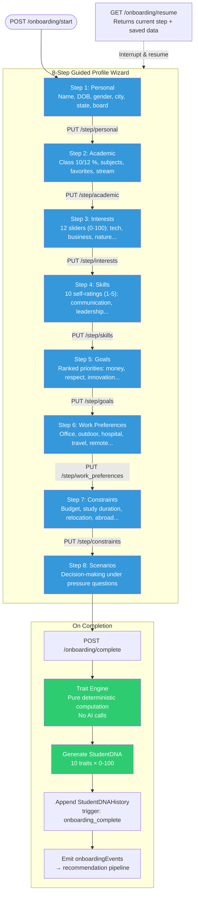
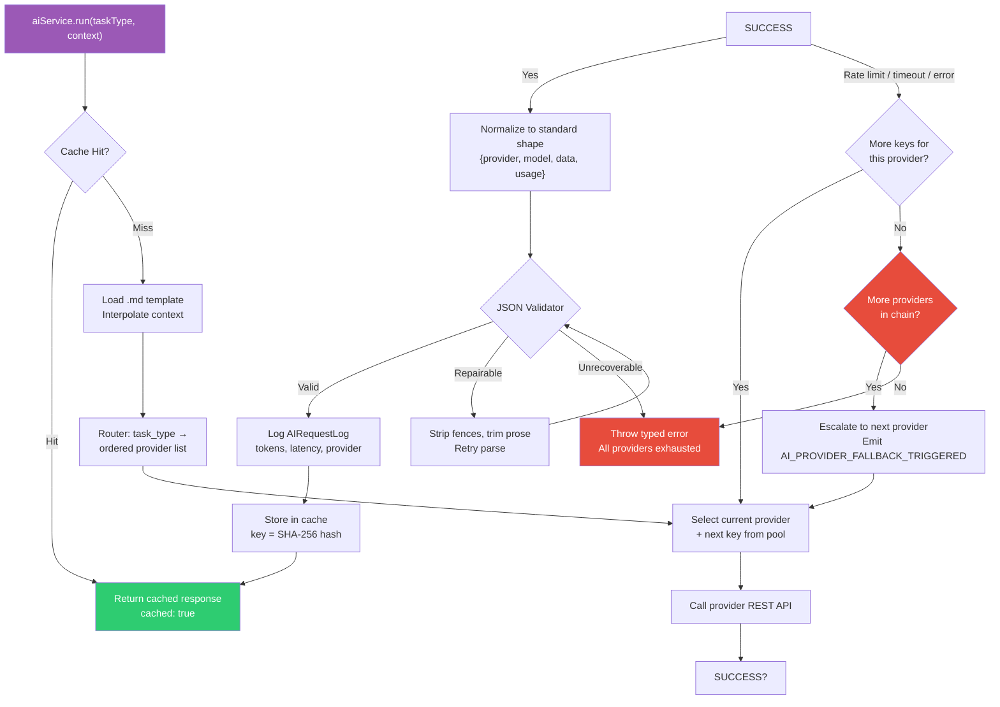
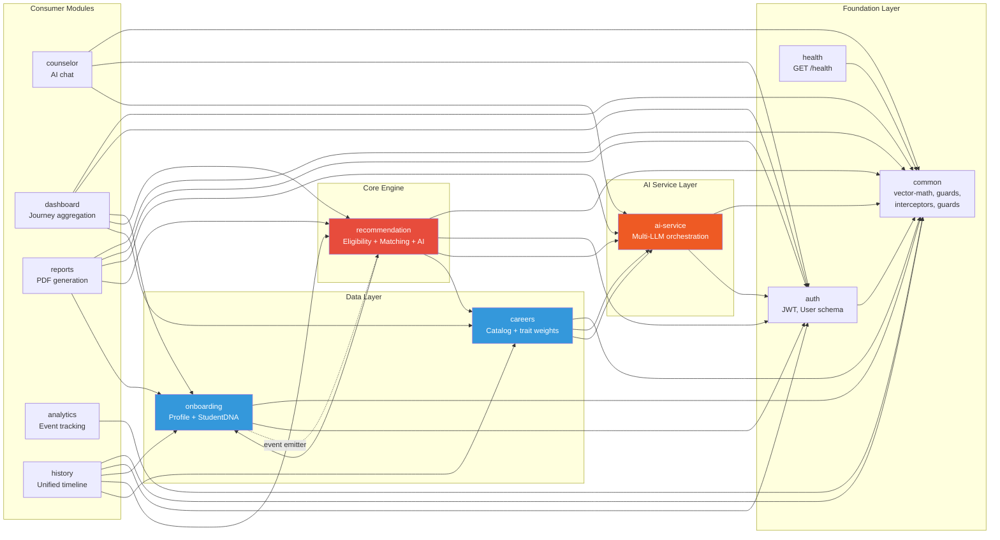
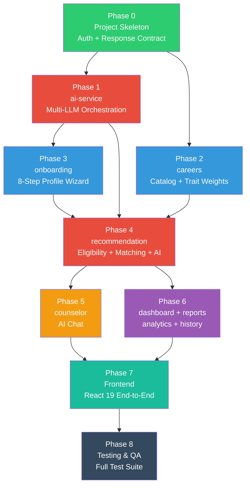

# SCPR — Project Workflow Diagrams

## 1. High-Level Architecture

```mermaid
graph TB
    subgraph Frontend["React 19 Frontend"]
        UI[UI Components]
        ZS[Zustand Store<br/>JWT in memory only]
        TQ[TanStack Query]
    end

    subgraph API["NestJS API Gateway"]
        MAIN[main.ts<br/>TransformInterceptor + HttpExceptionFilter]
        GUARD[JwtAuthGuard<br/>@Public decorator]
    end

    subgraph CoreModules["Core Business Modules"]
        AUTH[auth<br/>Register / Login / Refresh / Logout]
        ONBOARD[onboarding<br/>8-Step Profile Wizard]
        CAREERS[careers<br/>Career Catalog + Trait Weights]
        RECO[recommendation<br/>Eligibility + Trait Matching + AI]
        COUNS[counselor<br/>AI Chat + Rolling Summary]
        DASH[dashboard<br/>Journey State Aggregation]
        REPORTS[reports<br/>PDF Generation]
        ANALYTICS[analytics<br/>Fire-and-Forget Events]
        HISTORY[history<br/>Unified Timeline]
    end

    subgraph AIService["ai-service — Multi-LLM Orchestration"]
        CLIENT[aiService.run]
        ROUTER[router.service<br/>task_type → provider list]
        KEYPOOL[key-pool.service<br/>Key rotation per provider]
        RETRY[retry-manager.service<br/>In-provider → cross-provider fallback]
        PROMPT[prompt-builder.service<br/>.md template loading]
        JSONV[json-validator.service<br/>Validate + repair LLM output]
        CACHE[cache.service<br/>SHA-256 keyed]
        LOGGER[token-logger.service<br/>AIRequestLog]
    end

    subgraph Providers["LLM Providers"]
        GEMINI[Gemini]
        GROQ[Groq]
        MISTRAL[Mistral]
        DEEPSEEK[DeepSeek]
        GLM[GLM]
    end

    subgraph Database["MongoDB Atlas"]
        MONGO[(MongoDB)]
    end

    UI --> MAIN
    ZS -.->|JWT only| UI
    TQ -.->|server data| UI
    MAIN --> GUARD
    GUARD --> AUTH
    GUARD --> ONBOARD
    GUARD --> CAREERS
    GUARD --> RECO
    GUARD --> COUNS
    GUARD --> DASH
    GUARD --> REPORTS
    GUARD --> ANALYTICS
    GUARD --> HISTORY

    AUTH --> MONGO
    ONBOARD --> MONGO
    CAREERS --> MONGO
    RECO --> MONGO
    COUNS --> MONGO
    DASH --> MONGO
    REPORTS --> MONGO
    ANALYTICS --> MONGO
    HISTORY --> MONGO

    RECO --> CLIENT
    COUNS --> CLIENT
    CAREERS --> CLIENT
    REPORTS --> CLIENT

    CLIENT --> ROUTER
    ROUTER --> KEYPOOL
    KEYPOOL --> RETRY
    RETRY --> PROMPT
    PROMPT --> JSONV
    JSONV --> CACHE
    CACHE --> LOGGER

    RETRY --> GEMINI
    RETRY --> GROQ
    RETRY --> MISTRAL
    RETRY --> DEEPSEEK
    RETRY --> GLM

    GEMINI --> MONGO
    GROQ --> MONGO
    MISTRAL --> MONGO
    DEEPSEEK --> MONGO
    GLM --> MONGO
```

---

## 2. Recommendation Pipeline (Core Flow)

```mermaid
flowchart LR
    START([Student completes onboarding]) --> DNA[Compute StudentDNA<br/>10-dimension trait vector]

    DNA --> ELIG{Eligibility Engine<br/>Mongo Query Filter}

    ELIG -->|Pass| ELIG_RESULT["~N Eligible Careers<br/>Hard constraints checked"]
    ELIG -->|Zero matches| ZERO[Graceful Fallback<br/>Relax tightest constraint]

    ELIG_RESULT --> MATCH{Trait Matching Engine<br/>Cosine Similarity}

    MATCH --> TOP20["Top 20 Candidates<br/>Sorted by match_score"]

    TOP20 --> PAYLOAD[Build AI Payload<br/>student_profile + student_dna<br/>+ candidate_careers ≤ 20]

    PAYLOAD --> AI_CALL["Single ai-service Call<br/>career_recommendation task"]

    AI_CALL --> RANK[LLM Ranks + Explains<br/>Never invents candidates]

    RANK --> VALIDATE{JSON Validator<br/>Schema check + repair}

    VALIDATE -->|Pass| TOP5["Top 5 Final Recommendations<br/>rank, ai_score, explanation,<br/>roadmap, colleges, certs"]

    VALIDATE -->|Fail| RETRY_AI[Retry AI Call<br/>or fallback provider]

    TOP5 --> PERSIST[Persist Recommendation<br/>stale: false]
    PERSIST --> DISPLAY[Display to Student<br/>Ranked list with explanations]

    ZERO --> DISPLAY

    style DNA fill:#4a9eff,color:#fff
    style ELIG fill:#ff9f43,color:#fff
    style MATCH fill:#ff9f43,color:#fff
    style AI_CALL fill:#ee5a24,color:#fff
    style TOP5 fill:#2ecc71,color:#fff
    style ZERO fill:#e74c3c,color:#fff
```



---

## 3. Onboarding Flow (8 Steps)



---

## 4. ai-service Orchestration



---

## 5. Module Dependency Graph



---

## 6. Build Phase Sequence



---

## Summary

| Diagram | What it Shows |
|---------|---------------|
| **Architecture** | Full system: frontend → API → modules → ai-service → LLM providers → MongoDB |
| **Recommendation Pipeline** | The core algorithm: Eligibility → Trait Matching → AI Personalization → Top 5 |
| **Onboarding Flow** | 8-step profile wizard with resume support and trait computation |
| **ai-service Orchestration** | Routing, key rotation, fallback chains, JSON validation, caching |
| **Module Dependencies** | Which modules import from which (enforces boundary rules) |
| **Build Phases** | Phase 0→8 execution order with dependency graph |

---

*Generated from SCPR_PROJECT_SPEC.md and SCPR_EXECUTION_PLAN.md*
