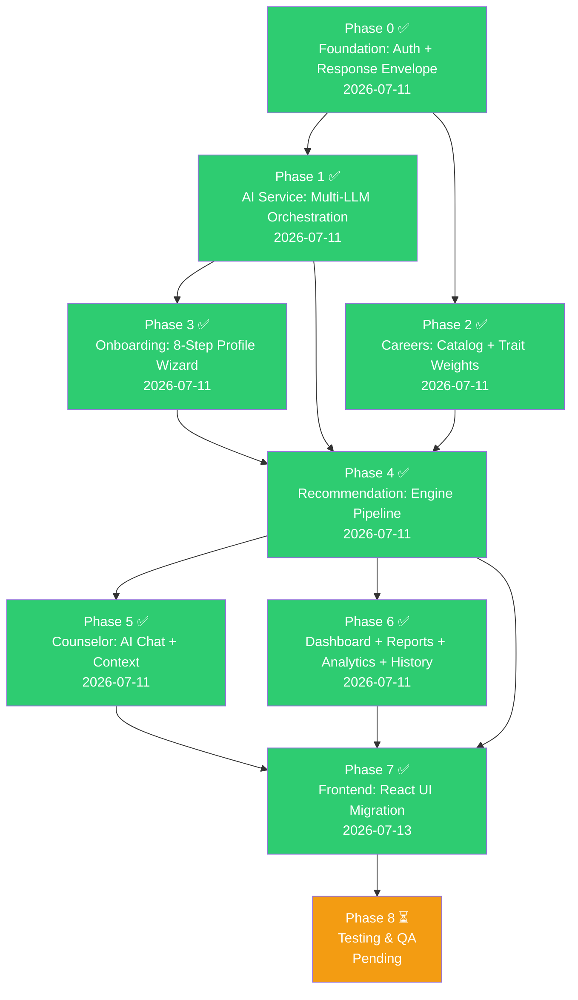

# SCPR — Smart Career Path Recommendation System
# Comprehensive Project Workflow & Documentation

> **Stack:** NestJS 11 (TypeScript) + Mongoose 9 + MongoDB Atlas · React 19 + TypeScript + Vite + Tailwind CSS v4  
> **Purpose:** AI-powered career counselor for Class 10 students — deterministic engine + LLM personalization  
> **Status:** JSON Validator fixed ✅ | Provider config centralized + health checks live ✅ | Frontend UI migrated ✅ | Testing pending ⏳

---

## Table of Contents

1. [Project Overview](#1-project-overview)
2. [System Architecture](#2-system-architecture)
3. [Tech Stack](#3-tech-stack)
4. [Domain Model](#4-domain-model)
5. [Backend Modules (Sequence)](#5-backend-modules-sequence)
6. [Recommendation Pipeline](#6-recommendation-pipeline)
7. [AI Service Architecture](#7-ai-service-architecture)
8. [Frontend Architecture](#8-frontend-architecture)
9. [API Surface](#9-api-surface)
10. [Career Catalog Import](#10-career-catalog-import)
11. [Engineering Rules](#11-engineering-rules)
12. [Build Phase Sequence](#12-build-phase-sequence)
13. [Project Status & Progress](#13-project-status--progress)
14. [Known Issues & Open Items](#14-known-issues--open-items)

---

## 1. Project Overview

### Vision
> A student completes SCPR's onboarding and never feels like they took a test. They answered questions about their subjects, interests, what they're good at, what they want out of life, and how they handle pressure — and at the end, the system hands them a short, ranked, explained list of careers that actually fit them, with a roadmap to get there.

### Key Design Decision (Why This Architecture)
An earlier prototype tried to classify students into 700+ careers using Random Forest + XGBoost trained on synthetic data. It kept collapsing onto the same 1-2 careers. The fix is architectural:

```
Student → Eligibility Engine → Trait Matching Engine → Top 20 → LLM (rank + explain) → Top 5
```

- **Eligibility and ranking are deterministic** (plain code/Mongo queries) — every recommendation is inspectable and defensible.
- **The LLM never invents a candidate and never decides eligibility** — it only ranks, explains, and personalizes a shortlist the backend already computed.
- **Adding a new career** is a database row, not a retrain.
- **Swapping an LLM provider** touches one module (`ai-service/`), not the whole system.

---

## 2. System Architecture

```mermaid
graph TB
    subgraph Frontend["React 19 Frontend"]
        UI[UI Components]
        ZS[Zustand Store<br/>JWT in memory only]
        TQ[TanStack Query]
    end

    subgraph API["NestJS API Gateway"]
        MAIN[main.ts<br/>TransformInterceptor + HttpExceptionFilter]
        GUARD[JwtAuthGuard<br/>@Public decorator]
    end

    subgraph CoreModules["Core Business Modules"]
        AUTH[auth<br/>Register / Login / Refresh / Logout]
        ONBOARD[onboarding<br/>8-Step Profile Wizard]
        CAREERS[careers<br/>Career Catalog + Trait Weights]
        RECO[recommendation<br/>Eligibility + Trait Matching + AI]
        COUNS[counselor<br/>AI Chat + Rolling Summary]
        DASH[dashboard<br/>Journey State Aggregation]
        REPORTS[reports<br/>PDF Generation]
        ANALYTICS[analytics<br/>Fire-and-Forget Events]
        HISTORY[history<br/>Unified Timeline]
    end

    subgraph AIService["ai-service — Multi-LLM Orchestration"]
        CLIENT[aiService.run]
        ROUTER[router.service<br/>task_type → provider list]
        KEYPOOL[key-pool.service<br/>Key rotation per provider]
        RETRY[retry-manager.service<br/>In-provider → cross-provider fallback]
        PROMPT[prompt-builder.service<br/>.md template loading]
        JSONV[json-validator.service<br/>Validate + repair LLM output]
        CACHE[cache.service<br/>SHA-256 keyed]
        LOGGER[token-logger.service<br/>AIRequestLog]
    end

    subgraph Providers["LLM Providers"]
        GEMINI[Gemini]
        GROQ[Groq]
        MISTRAL[Mistral]
        DEEPSEEK[DeepSeek]
        GLM[GLM]
    end

    subgraph Database["MongoDB Atlas"]
        MONGO[(MongoDB)]
    end

    UI --> MAIN
    ZS -.->|JWT only| UI
    TQ -.->|server data| UI
    MAIN --> GUARD
    GUARD --> AUTH & ONBOARD & CAREERS & RECO & COUNS & DASH & REPORTS & ANALYTICS & HISTORY

    AUTH & ONBOARD & CAREERS & RECO & COUNS & DASH & REPORTS & ANALYTICS & HISTORY --> MONGO
    RECO & COUNS & CAREERS & REPORTS --> CLIENT

    CLIENT --> ROUTER --> KEYPOOL --> RETRY --> PROMPT --> JSONV --> CACHE --> LOGGER
    RETRY --> GEMINI & GROQ & MISTRAL & DEEPSEEK & GLM
    GEMINI & GROQ & MISTRAL & DEEPSEEK & GLM --> MONGO
```

---

## 3. Tech Stack

### Backend
| Category | Technology | Version |
|----------|------------|---------|
| Framework | NestJS | 11.x |
| Runtime | Node.js | LTS |
| Language | TypeScript | 5.7+ |
| ODM | Mongoose | 9.x |
| Database | MongoDB Atlas | Latest |
| Validation | class-validator / class-transformer | Latest |
| Auth | Passport.js (passport-jwt, passport-local) | Latest |
| JWT | @nestjs/jwt / jsonwebtoken | Latest |
| PDF Generation | pdfmake | 0.3.x |
| Hashing | bcrypt | 6.x |
| Vector Math | Custom (no external ML lib) | N/A |

### AI Providers
| Provider | Models | Primary Use | Status |
|----------|--------|-------------|--------|
| Gemini | gemini-2.5-flash | Career ranking, roadmap generation | ✅ Healthy (v1 API) |
| Groq | llama-3.3-70b-versatile, mixtral-8x7b-32768, llama-3.1-8b-instant | Counselor chat (low-latency) | ⚠️ TPD-limited (4 keys in pool) |
| Mistral | mistral-large-latest | Report summary | ✅ Healthy |
| DeepSeek | deepseek-chat | Fallback for ranking/roadmap | ❌ Billing (human action) |
| GLM | glm-4-plus | Unused | ⚙️ Configured, not in routing |

### Frontend
| Category | Technology | Version |
|----------|------------|---------|
| Framework | React | 19.x |
| Build Tool | Vite | 8.x |
| Language | TypeScript | 6.x |
| Styling | Tailwind CSS | 4.x (CSS-first, no tailwind.config.js) |
| Animation | Framer Motion | 12.x |
| State Management | Zustand | 5.x (JWT in memory only) |
| Server Cache | TanStack Query | 5.x |
| Routing | React Router | 7.x |
| HTTP Client | Axios | 1.x |
| Utilities | clsx, tailwind-merge | Latest |
| Icons | lucide-react | 1.x |

---

## 4. Domain Model

### Core Collections (MongoDB/Mongoose)

**`User`** — Authentication & identity
```
user_id (UUID, hyphens stripped), email, email_verified, password_hash,
provider ('local'), role ('student'|'admin'), full_name,
failed_login_attempts, locked_until, last_login, created_at, updated_at
```

**`StudentProfile`** — One per user, resumable 8-step onboarding
```
user_id, onboarding_step (current step key), completion_percentage,
personal: { name, dob, age, gender, city, state, board },
academic: { status, class10_percent, class12_percent, subjects: { maths, science, english, sst, computer },
            favorite_subjects[], weak_subjects[], stream_interest },
interests: { technology, business, helping_people, teaching, nature, research, sports, design,
             media, government, finance, machines }  // 0-100 sliders
skills: { communication, leadership, problem_solving, creativity, logical_thinking,
          coding, drawing, math, observation, patience }  // 1-5 self-rated
goals: [ranked priorities],
work_preferences: [office, outdoor, hospital, travel, factory, lab, creative_studio, remote],
constraints: { govt_vs_private, budget_tier, study_duration_max,
               willing_to_relocate, abroad_ok, preferred_location },
scenario_responses: [{ question_id, selected_option, trait_weights }],
current_dna: StudentDNA (embedded), created_at, updated_at
```

**`StudentDNA`** (Embedded) — 10-dimensional trait vector (0-100)
```
analytical_thinking, creativity, communication, leadership, research,
business_acumen, technical_curiosity, empathy, patience, risk_tolerance,
computed_at, source_version
```

**`StudentDNAHistory`** — Append-only log of DNA snapshots
```
user_id, dna_snapshot, computed_at, trigger ('onboarding_complete'|'profile_updated'|'manual_recompute')
```

**`Career`** — Career catalog with trait weights and eligibility
```
career_code (stable string ID), category_code, name, description,
required_skills[], technical_skills[], soft_skills[], market_demand, future_scope, career_progression,
trait_weights: { 10 traits } 0-100,
eligibility: { min_maths, min_science, min_biology, min_english, max_budget_tier,
               min_study_duration_years, max_study_duration_years, required_stream, abroad_required },
trait_weights_draft, eligibility_draft (staging fields for LLM backfill)
```

**`Recommendation`** — Generated recommendation document
```
user_id, onboarding_session_ref, pipeline_version, eligible_count,
shortlist: [{ career_code, match_score }] — top 20
final_recommendations: [{ career_code, rank, ai_score, explanation, roadmap,
                         suggested_colleges, suggested_certifications }] — top 5
ai_provider_used, ai_model_used, fallback_used, generated_at, stale (bool)
```

**`RecommendationFeedback`** — User feedback on recommendations
```
user_id, recommendation_id, career_code, rating, comment, created_at
```

**`Conversation`** / **`ConversationMessage`** — Counselor chat sessions
```
Conversation: user_id, started_at, last_message_at, summary (rolling)
ConversationMessage: conversation_id, role, content, intent, is_structured, created_at
```

**`Report`** — PDF report generation
```
user_id, recommendation_ref, status (QUEUED|GENERATING|READY|DOWNLOADED|FAILED), file_ref, generated_at
```

**`AnalyticsEvent`** — Fire-and-forget event tracking
```
user_id, event_type, payload, created_at
```

**`AIRequestLog`** — Per-call AI provider logging
```
task_type, provider, model, input_tokens, output_tokens, latency_ms, success, fallback_used, cached, created_at
```

---

## 5. Backend Modules (Sequence)

Modules built in dependency order — each only depends on modules already built:

### Phase 0: Foundation Layer
**`common/`** — Shared utilities
- `vector-math.ts`: Weighted cosine similarity for trait matching
- `filters/http-exception.filter.ts`: Global error shape
- `interceptors/transform.interceptor.ts`: Global response envelope `{ data, timestamp, requestId }`

**`health/`** — System health check (`GET /api/health`, public)

**`auth/`** — JWT authentication module
- Register, login, logout, refresh, me endpoints
- `passport-jwt` + `passport-local` strategies
- Global `JwtAuthGuard` with `@Public()` decorator
- Failed login attempt lockout (5 attempts → 15-min lock)
- `User` schema: bcrypt-hashed passwords, `failed_login_attempts`, `locked_until` (never serialized)

### Phase 1: AI Service Layer
**`ai-service/`** — Multi-LLM orchestration (single chokepoint for all AI calls)
- `config/provider-models.config.ts`: Centralized model identifiers + API versions (single source of truth)
- `schemas/json-schemas/`: 5 draft-07 JSON Schema files (one per task type, compiled with ajv)
- `ai-service.client.ts`: `aiService.run(taskType, context)` — single public entrypoint
- `router.service.ts`: Task type → ordered provider list (reads model strings from config)
- `providers/`: Adapters for Gemini, Groq, Mistral, DeepSeek, GLM (REST-based, no SDKs)
- `key-pool.service.ts`: Rotates across N API keys per provider from env
- `retry-manager.service.ts`: In-provider retries → cross-provider fallback, quota-exhausted fail-fast detection, emits `AI_PROVIDER_FALLBACK_TRIGGERED` + `AI_PROVIDER_UNHEALTHY_DETECTED`
- `prompt-builder.service.ts`: Loads `.md` templates, interpolates at call time
- `json-validator.service.ts`: ajv-backed schema validation + bounded JSON repair (trailing commas, single quotes, newlines) + structured error output
- `cache.service.ts`: SHA-256 hash keyed cache with TTL
- `token-logger.service.ts`: Writes `AIRequestLog` per call

### Phase 2: Data Layer
**`careers/`** — Career catalog management
- CRUD for careers with `trait_weights` + `eligibility` + staging drafts
- 40 seed careers across 8 sectors (later expanded to ~702 via catalog import)
- LLM-assisted `career_trait_backfill` with draft → promote workflow
- Saved career bookmarks via `SavedCareer` schema
- Admin endpoints for backfill, draft review/promote, toggle active

### Phase 3: Profile Layer
**`onboarding/`** — 8-step guided profile wizard
- Steps: `personal → academic → interests → skills → goals → work_preferences → constraints → scenarios`
- `onboarding-flow.service.ts`: Step ordering, validation, resume logic
- `trait-engine.service.ts`: Pure deterministic function mapping profile to 10-dim StudentDNA
- `StudentDNAHistory` append-only log on completion
- Emits events on completion (triggers recommendation pipeline)

### Phase 4: Core Engine
**`recommendation/`** — The heart of the system
- `eligibility-engine.service.ts`: MongoDB query-based filtering (never load all into memory)
- `trait-matching-engine.service.ts`: Weighted cosine similarity between StudentDNA and Career trait_weights
- Orchestrates: Eligibility → Trait Matching → AI Personalization (single LLM call with top 20)
- Staleness tracking: profile changes mark `stale: true`
- `RecommendationFeedback` for user ratings

### Phase 5: Consumer Modules
**`counselor/`** — AI chat with context management
- `context-builder.service.ts`: Rolling conversation summary (compresses beyond 10 messages)
- Basic intent classification (career/roadmap/general)
- Post-processing safety filter
- Structured response parsing (falls back to markdown)

**`dashboard/`** — Journey state aggregation
- `next_action` state machine computed server-side
- Aggregates: onboarding %, recommendation freshness, saved careers count

**`reports/`** — PDF report generation
- Uses `pdfmake` (no Puppeteer dependency — fully network-independent)
- Status tracking: QUEUED → GENERATING → READY → DOWNLOADED → FAILED

**`analytics/`** — Fire-and-forget event tracking
- Must never throw — wrapped in try/catch at every call site
- Events: ONBOARDING_STARTED, ONBOARDING_STEP_COMPLETED, ONBOARDING_COMPLETED, AI_PROVIDER_FALLBACK_TRIGGERED, AI_PROVIDER_UNHEALTHY_DETECTED
- `GET /analytics/ai` includes `recent_provider_issues` from UNHEALTHY_DETECTED events

**`history/`** — Unified chronological timeline
- Merges onboarding milestones, recommendation generations, saved careers
- Paginated with type filter (all/careers/recommendations/onboarding)

---

## 6. Recommendation Pipeline

```
Stage 1: Eligibility Engine (MongoDB query — no AI)
   Input: Full career catalog + StudentProfile constraints
   Output: ~N eligible careers passing hard gates
   Mechanism: MongoDB $lte/$gte queries — never loaded into memory

Stage 2: Trait Matching Engine (cosine similarity — no AI)
   Input: Eligible careers + StudentDNA 10-dim vector
   Output: Top 20 careers by match_score
   Mechanism: Weighted cosine similarity (custom vector-math.ts)

Stage 3: AI Personalization (single LLM call)
   Input: Top 20 candidates + StudentDNA + StudentProfile
   Output: Top 5 ranked with explanations, roadmaps, colleges, certifications
   Constraint: LLM never invents candidates outside the provided list
```

### Routing Table (actual — model strings from `provider-models.config.ts`)
| Task Type | Primary | Fallback 1 | Fallback 2 |
|-----------|---------|------------|------------|
| Career ranking + explanation | Gemini Flash | DeepSeek | Groq LLaMA 3.3-70B |
| Roadmap generation | Gemini Flash | DeepSeek | Groq LLaMA 3.3-70B |
| Counselor chat | Groq LLaMA 3.3-70B | Groq Mixtral 8x7B | Gemini Flash |
| Career trait backfill | Gemini Flash | Groq LLaMA 3.3-70B | Groq LLaMA 3.1-8B |
| Report summary | Mistral Large | Gemini Flash | Groq LLaMA 3.3-70B |

### Fallback Flow
1. Rotate through all keys within current provider
2. On quota/billing error (`insufficient_balance`, `429`, `402`), skip remaining keys → emit `AI_PROVIDER_UNHEALTHY_DETECTED` (once per provider per request)
3. Once exhausted, escalate to next provider in chain → emit `AI_PROVIDER_FALLBACK_TRIGGERED`
4. If all providers exhausted, throw typed error

---

## 7. AI Service Architecture

```
ai-service/
├── config/
│   └── provider-models.config.ts       # Centralized model identifiers + API versions
├── schemas/
│   └── json-schemas/
│       ├── index.ts                    # TaskType → JSONSchema map
│       ├── career-recommendation.schema.ts
│       ├── counselor-chat.schema.ts
│       ├── career-trait-backfill.schema.ts
│       ├── report-summary.schema.ts
│       └── roadmap-generation.schema.ts
├── prompts/
│   ├── career-recommendation.md        # Rank + explain top 20
│   ├── career-trait-backfill.md        # LLM-assisted catalog enrichment
│   ├── counselor-chat.md               # Open-ended chat
│   ├── report-summary.md               # PDF summary generation
│   ├── roadmap-generation.md           # Career roadmap
│   └── test-task.md                    # Synthetic test task
├── providers/
│   ├── provider.interface.ts           # AbstractLLMProvider
│   ├── gemini.provider.ts              # Gemini (reads api_version from config)
│   ├── groq.provider.ts                # Groq
│   ├── mistral.provider.ts             # Mistral Large
│   ├── deepseek.provider.ts            # deepseek-chat
│   └── glm.provider.ts                 # GLM-4
├── ai-request-log.schema.ts          # MongoDB log schema
├── ai-service.client.ts              # SINGLE public entrypoint
├── ai-service.controller.ts          # GET /ai-service/health (live per-provider check, 5-min cache)
├── ai-service.module.ts
├── ai-service.schemas.ts             # DTOs
├── cache.service.ts                  # SHA-256 keyed, TTL
├── json-validator.service.ts         # ajv-backed validation + bounded JSON repair
├── key-pool.service.ts               # Multi-key rotation per provider
├── prompt-builder.service.ts         # .md template loader
├── retry-manager.service.ts          # In-provider → cross-provider + quota-exhausted detection
├── router.service.ts                 # Task → provider chain (model strings from config)
└── token-logger.service.ts           # AIRequestLog writer
```

### Standard Response Shape (normalized by all providers)
```json
{
  "provider": "gemini",
  "model": "gemini-2.5-flash",
  "task": "career_recommendation",
  "success": true,
  "data": { "...task-specific JSON..." },
  "usage": { "input_tokens": 1200, "output_tokens": 450 },
  "latency_ms": 1830,
  "fallback_used": false,
  "cached": false
}
```

---

## 8. Frontend Architecture

### Directory Structure
```
frontend/src/
├── main.tsx                    # Entry point
├── App.tsx                     # Router + Suspense + ErrorBoundary
├── index.css                   # Tailwind v4 @theme + utilities
├── api/
│   ├── client.ts               # Axios with JWT interceptor + refresh queue
│   └── adminCareers.ts         # Admin career API functions
├── store/
│   └── authStore.ts            # Zustand: user, accessToken, refreshToken (memory only)
├── lib/
│   ├── utils.ts                # cn() helper (clsx + tailwind-merge)
│   └── motion.ts               # Framer Motion variants (fadeUp, fadeIn, scaleIn, staggerContainer)
├── components/
│   ├── layout/
│   │   ├── AppShell.tsx        # Sidebar + main content + floating AI button
│   │   └── AuthLayout.tsx      # Centered card layout + AmbientOrbs
│   ├── shared/
│   │   ├── AmbientOrbs.tsx     # Animated background orbs
│   │   ├── ErrorBoundary.tsx   # React error boundary with retry
│   │   └── SectionReveal.tsx   # Scroll-in animation wrapper
│   └── ui/
│       ├── Button.tsx          # Variants: primary, secondary, ghost, destructive
│       └── GlassCard.tsx       # Glassmorphism card component
└── pages/
    ├── Landing.tsx             # Public landing page (hero, stats, journey, careers, assessment preview, AI chat preview, CTA)
    ├── Login.tsx               # Login form → POST /auth/login
    ├── Register.tsx            # Register form → POST /auth/register
    ├── Dashboard.tsx           # Dashboard with reports, recommendations overview
    ├── Onboarding.tsx          # 8-step wizard: personal → academic → interests → skills → goals
    ├── CareerExplorer.tsx      # Browse/search careers, save/unsave, recommendations
    ├── CounselingChat.tsx      # AI counselor chat interface
    ├── HistoryLog.tsx          # Unified activity timeline
    └── AdminCareers.tsx        # Admin career catalog management panel
```

### Routing
| Route | Component | Auth | Notes |
|-------|-----------|------|-------|
| `/` | Landing or Dashboard | Public → Auth | Unauthenticated users see Landing, authenticated see Dashboard |
| `/login` | Login | Public | Redirects to `/` if already authenticated |
| `/register` | Register | Public | Redirects to `/` if already authenticated |
| `/onboarding` | Onboarding | Auth | 8-step profile wizard |
| `/careers` | CareerExplorer | Auth | Career catalog + recommendations |
| `/chat` | CounselingChat | Auth | AI counselor |
| `/history` | HistoryLog | Auth | Activity timeline |
| `/admin/careers` | AdminCareers | Auth + Admin | Admin career management |

### Key Frontend Design Decisions
- **JWT in memory only**: Zustand store, never localStorage/sessionStorage
- **Silent token refresh**: Axios interceptor queues failed 401 requests, refreshes token, retries
- **Response envelope unwrap**: Axios interceptor extracts `response.data.data` automatically
- **Lazy-loaded routes**: All page components use `React.lazy()` + `Suspense`
- **Tailwind v4 CSS-first**: Design tokens via `@theme` directive in `index.css`
- **Dark theme**: Deep purple/black background (`#150E22`), accent purple (`#B583F0`), gold CTA (`#F0A83E`)
- **Glassmorphism**: `glass-card` utility with backdrop blur and translucent backgrounds
- **Reduced motion**: Respects `prefers-reduced-motion` — animations disabled
- **Accessibility**: Focus rings (`focus-ring` utility), keyboard navigation, semantic HTML

---

## 9. API Surface

Global prefix: **`/api`**. JWT Bearer auth by default; public routes marked with `@Public()`.

| Module | Base | Key Endpoints | Auth |
|--------|------|---------------|------|
| Health | `/health` | `GET /health` | Public |
| Auth | `/auth` | register, login, logout, refresh, me, verify-email, forgot-password, reset-password | Mixed |
| AI Service | `/ai-service` | `GET /ai-service/health` (live per-provider check, 5-min cache) | Public |
| Careers | `/careers` | list, categories, search, suggest, filter, `:careerCode`, related/:code, roadmap/:code, by-codes, save, saved, admin/* | Mostly public |
| Onboarding | `/onboarding` | start, step/:stepKey (GET/PUT), resume, complete, student-dna | Auth |
| Recommendation | `/recommendations` | generate, latest, regenerate, feedback | Auth |
| Counselor | `/counselor` | chat, conversations, conversations/:id, feedback, regenerate | Auth |
| Dashboard | `/dashboard` | `GET /dashboard` | Auth |
| Reports | `/report` | generate, status/:id, download/:id, history | Auth |
| Analytics | `/analytics` | me, platform, careers, ai, event | Auth/Admin |
| History | `/history` | `GET /history?type=all\|careers\|recommendations\|onboarding` | Auth |

### Response Envelope
**Success:** `{ data, timestamp, requestId }`  
**Error:** `{ statusCode, message, detail?, errors?, timestamp, path, requestId }`

### Naming Convention
- `snake_case` on the wire everywhere — request bodies, response bodies, query params
- `career_code` / `category_code` are stable string identifiers (never Mongo `_id`)
- `user_id` is hyphen-stripped UUID

---

## 10. Career Catalog Import

The career catalog was imported in 8 phases from tree-format markdown files, totaling **~702 careers** across all sectors.

### Import Phases
| Phase | Sector | Careers | Notes |
|-------|--------|---------|-------|
| 1 | Science (PCM/PCB) | ~100+ | B.Des, B.Arch flagged for enrichment |
| 2 | Commerce | ~100+ | Sub-domain code resolution for parenthetical names |
| 3 | Arts & Humanities | ~100+ | 98 new, 10 merged duplicates |
| 4 | Diploma | ~90+ | 87 new, 42 merged duplicates |
| 5 | ITI & Polytechnic | ~80+ | Cross-linking to diploma sub-domains |
| 6 | Vocational & Skill Development | ~70+ | 69 new, 14 merged |
| 7 | Government & Defence | ~80+ | 22 graduate-level roles flagged |
| 8 | Emerging & Future Careers | ~85+ | 83 new, 31 merged |

### AI Backfill (Phase 9)
- **Goal**: Populate `trait_weights` and `eligibility` for all careers via LLM
- **Status**: 628/702 careers backfilled (89.5%)
- **Remaining**: 74 careers unprocessed due to rate limits (Gemini 20 RPM, 1500/day; Groq TPD)
- **Method**: Resumable runner queries only `backfill_status: 'rule_based'` careers
- **Providers**: Gemini 2.5 Flash (primary), Groq LLaMA 3.3-70B + LLaMA 3.1-8B (fallback)
- **Active issues**: Groq TPD limits throttle throughput; DeepSeek insufficient balance (not in backfill route)

### Admin Panel (Phase 10)
- Full CRUD for careers with filters (category, backfill_status, needs_enrichment, is_active, search)
- Draft publish/reject workflow for LLM backfill results
- Import audit log
- Bulk publish across filters
- Toggle active/inactive for careers

---

## 11. Engineering Rules

### Non-Negotiable Rules
1. **Mongoose only** — never raw MongoDB driver
2. **Thin controllers** — all business logic in `*.service.ts`
3. **JWT in memory only** — never localStorage/sessionStorage
4. **Analytics must never throw** — try/catch at every call site
5. **Backend is source of truth** — LLM never decides eligibility or invents candidates
6. **Never send full catalog to LLM** — max top 20 candidates
7. **Provider-agnostic** — no module outside `ai-service/` imports a provider SDK
8. **Prompts as `.md` files** — never hardcoded in `.ts` files
9. **`snake_case` on the wire** — everywhere
10. **Scope discipline** — each phase touches only named files
11. **Model strings in one place** — never hardcoded in provider files; all in `config/provider-models.config.ts`
12. **No hand-rolled validation** — use ajv for JSON Schema; hand-rolled `checkSchema()` was the root cause of a production bug
13. **Quota errors fail fast** — billing/rate-limit errors skip remaining keys and escalate to next fallback immediately

### Response Envelope Contract
- Success: `{ data, timestamp, requestId }`
- Error: `{ statusCode, message, detail?, errors?, timestamp, path, requestId }`

### Field Naming
- API boundary: `snake_case`
- Internal TypeScript: `camelCase` or `PascalCase`
- Stable identifiers: `career_code`, `category_code`, `user_id` (hyphen-stripped UUID)

---

## 12. Build Phase Sequence



### Individual Phase Details

**Phase 0 — Foundation (Auth + Response Contract)**
- Scaffolded NestJS 11 backend + React 19 + Vite frontend
- Built global `TransformInterceptor` + `HttpExceptionFilter`
- Auth module: register, login, refresh, logout, me
- JWT in-memory Zustand store + silent refresh interceptor
- Failed login attempt lockout (5 attempts → 15-min lock)

**Phase 1 — AI Service (Multi-LLM Orchestration)**
- 5 provider adapters: Gemini, Groq, Mistral, DeepSeek, GLM
- Key pool rotation + retry manager with cross-provider fallback
- Prompt builder loading `.md` templates
- JSON validator with repair capabilities
- SHA-256 cache + AIRequestLog persistence
- `aiService.run(taskType, context)` single entrypoint

**Phase 2 — Careers (Catalog + Traits)**
- Career schema with live + staging (draft) fields
- 40 seed careers across 8 sectors
- LLM-assisted trait backfill with draft→promote workflow
- Saved career bookmarks

**Phase 3 — Onboarding (Profile Wizard)**
- 8-step resumable wizard: personal → academic → interests → skills → goals → work_preferences → constraints → scenarios
- Pure deterministic trait engine (10-dim StudentDNA, no AI)
- Append-only StudentDNAHistory with trigger markers
- Event emission on completion (triggers recommendation)

**Phase 4 — Recommendation (Pipeline)**
- Eligibility Engine: MongoDB query-based hard gate filtering
- Trait Matching Engine: weighted cosine similarity (custom vector-math.ts)
- AI Personalization: single LLM call with top 20 → top 5
- Staleness tracking on profile changes
- Decoupled event-driven orchestration (onboarding → recommendation)

**Phase 5 — Counselor (AI Chat)**
- Conversation management with rolling summary (compresses beyond 10 messages)
- Intent classification (career/roadmap/general)
- Post-processing safety filter
- Graceful fallback: structured JSON or plain markdown

**Phase 6 — Consumer Modules**
- Dashboard: server-side state machine (next_action)
- Reports: pdfmake PDF generation (no Puppeteer)
- Analytics: fire-and-forget event tracking (never throws)
- History: unified chronological timeline with pagination + type filter

**Phase 7 — Frontend UI Migration** *(completed 2026-07-13)*
- Migrated from minimal Tailwind styling to premium dark-themed glassmorphism design
- Built shared component library: Button, GlassCard, AppShell, AuthLayout, ErrorBoundary, SectionReveal, AmbientOrbs
- Replaced per-page duplicated sidebars with shared AppShell
- Added public Landing page with hero section, career orbit, interactive assessment preview, AI chat preview, student stories
- Preserved all existing API calls, Zustand store fields, and business logic
- Tailwind v4 CSS-first: design tokens via `@theme` directive
- Framer Motion animations with reduced-motion support
- ROUTING: 10 lazy-loaded routes with protected/auth guards

**Phase 8 — Testing & QA** *(pending)*
- Full onboarding sequence + resume tests
- Eligibility edge case: zero eligible careers
- Forced provider fallback tests
- Cache hit/miss tests
- JSON validator unit tests
- Response envelope contract tests
- Postman/API collection

### Career Catalog Import (Post Phase 2)
- **Phase 1-8**: Imported ~702 careers from tree-format markdown across 8 sectors
- **Phase 9**: AI backfill — 628/702 careers backfilled (89.5%), 74 remaining due to rate limits
- **Phase 10**: Admin panel — full CRUD, draft publish/reject, import audit, bulk ops

---

## 13. Project Status & Progress

| Phase | Description | Status | Date | Key Modules |
|-------|-------------|--------|------|-------------|
| P0 | Project skeleton, auth, response contract | ✅ Done | 2026-07-11 | auth, health, common |
| P1 | AI service (multi-LLM orchestration) | ✅ Done | 2026-07-11 | ai-service |
| P2 | Careers (catalog + trait weights) | ✅ Done | 2026-07-11 | careers |
| P3 | Onboarding (8-step profile wizard) | ✅ Done | 2026-07-11 | onboarding |
| P4 | Recommendation (pipeline engine) | ✅ Done | 2026-07-11 | recommendation |
| P5 | Counselor (AI chat) | ✅ Done | 2026-07-11 | counselor |
| P6 | Dashboard, reports, analytics, history | ✅ Done | 2026-07-11 | dashboard, reports, analytics, history |
| — | Career catalog import (~702 careers) | ✅ Done | 2026-07-12 | careers/import |
| — | AI backfill (628/702) | ⚠️ Partial | 2026-07-12 | ai-backfill-runner |
| — | Admin panel | ✅ Done | 2026-07-12 | AdminCareers page |
| P7 | Frontend UI migration | ✅ Done | 2026-07-13 | All frontend pages + components |
| — | JSON Validator fix (ajv + schemas) | ✅ Done | 2026-07-13 | json-validator.service, schemas/json-schemas, 22 tests |
| — | AI Provider config fix & health checks | ✅ Done | 2026-07-13 | config/provider-models.config, health endpoint, retry-manager, analytics, main.ts startup check |
| P8 | Testing & QA | ⏳ Pending | — | Full test suite |

### Completion Timeline
- **Backend core** (Phases 0-6): Built 2026-07-11
- **Career catalog + backfill** (Phases 1-10): Built 2026-07-12
- **Frontend UI** (Phase 7): Migrated 2026-07-13
- **JSON Validator fix**: ajv-backed validation, bounded repair, 22 regression tests — 2026-07-13
- **AI Provider health fix**: centralized config, Gemini v1 API, quota fail-fast, live health endpoint, startup validation — 2026-07-13
- **Testing** (Phase 8): Not yet started

---

## 14. Known Issues & Open Items

### 🔴 High Priority
| Issue | Detail | Status |
|-------|--------|--------|
| 74 careers not AI backfilled | Rate limits exhausted (Gemini 1500/day, Groq TPD) — runner is resumable | ⚠️ Pending retry |

### 🟡 Medium Priority
| Issue | Detail | Status |
|-------|--------|--------|
| Groq TPD limit (100k tokens/day) | Limits batch backfill throughput | ⚠️ Mitigated (4 keys in pool) |
| GLM model not in routing | Provider configured (`glm-4-plus`) but not wired into any task route | ⚠️ Open |

### 🟢 Low Priority
| Issue | Detail | Status |
|-------|--------|--------|
| 11 broad-degree careers need enrichment | B.Des, B.Arch, etc. flagged `needs_enrichment: true` | ⚠️ Open |
| 25 Polytechnic cross-links best-effort | Slug-matched sub-domain names may have imperfections | ⚠️ Open |
| 22 government roles need enrichment | Graduate-level roles needing additional context | ⚠️ Open |

### ✅ Recently Resolved
| Issue | Fix |
|-------|-----|
| `json-validator.service.ts` `checkSchema()` broken | Replaced with ajv-backed compiled validation + bounded JSON repair + structured error output (22 tests) |
| Gemini 1.5 Flash not found on v1beta API | Changed to `v1` API, model `gemini-2.5-flash` (configurable via `provider-models.config.ts`) |
| Model strings hardcoded across router + providers | Centralized into `config/provider-models.config.ts` — single source of truth |
| Quota/billing errors wasted retry attempts | Added fail-fast detection (`insufficient_balance` / `429` / `402`) — skips remaining keys, emits `AI_PROVIDER_UNHEALTHY_DETECTED` |
| Health endpoint only checked key presence | Now performs live per-provider API ping with 5-min cache (`GET /api/ai-service/health`) |
| Provider issues invisible until batch fails | `AI_PROVIDER_UNHEALTHY_DETECTED` event wired into analytics, visible in `/analytics/ai` |
| Missing API keys discovered on first request | Startup validation logs loud warning for missing Primary provider keys |

### 👤 Human Action Items (agent cannot resolve)
| Item | Detail |
|------|--------|
| Top up DeepSeek balance | Account out of credits — either top up or remove `deepseek` from the routing table in `router.service.ts` |
| Review Groq org-level TPD | 4 API keys in pool but may share a single org quota; multiple org accounts needed for true parallelism |

### Next Steps
1. **Run Phase 8 Testing & QA** — full test suite, Postman collection, edge cases
2. **Retry AI backfill** — run `ai-backfill-runner.ts` when quotas reset (validator + provider fixes both active now)
3. **Top up DeepSeek or prune** from routing if not worth maintaining
4. **Scale career catalog** from 702 to full 700+ (already at target)
5. **Optional enhancements**: Social login (Google OAuth), mobile apps, full admin dashboard

---

*Document generated: 2026-07-13*  
*Project: SCPR — Smart Career Path Recommendation System*
